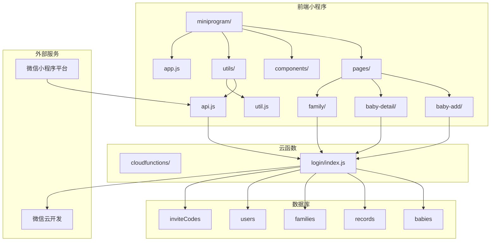
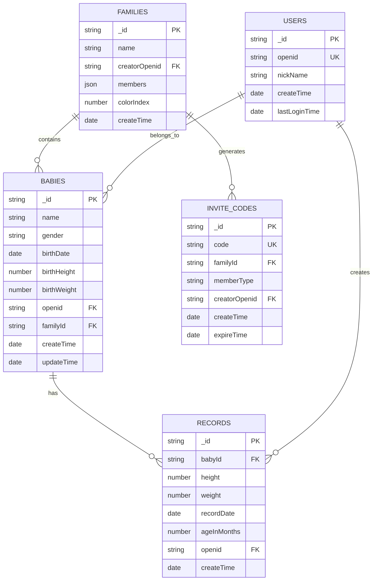
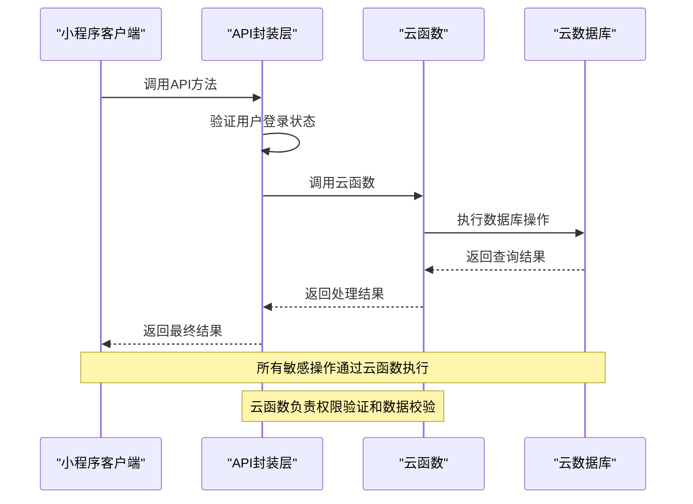
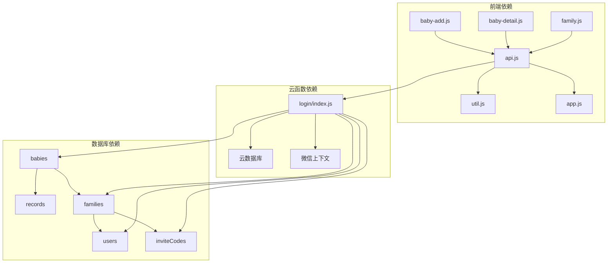
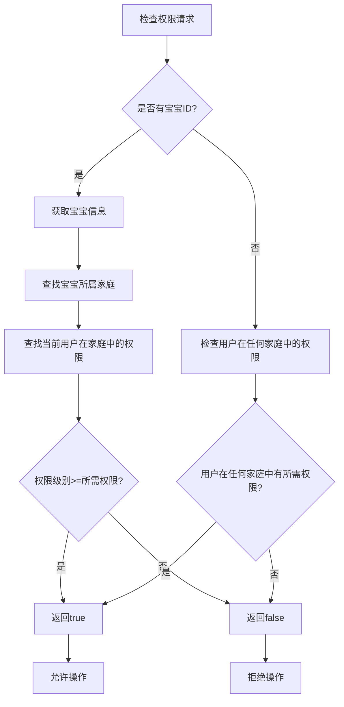

# 宝宝管理API

<cite>
**本文档引用的文件**
- [miniprogram/pages/baby-add/baby-add.js](file://miniprogram/pages/baby-add/baby-add.js)
- [miniprogram/pages/baby-detail/baby-detail.js](file://miniprogram/pages/baby-detail/baby-detail.js)
- [miniprogram/utils/api.js](file://miniprogram/utils/api.js)
- [miniprogram/utils/util.js](file://miniprogram/utils/util.js)
- [miniprogram/app.js](file://miniprogram/app.js)
- [cloudfunctions/login/index.js](file://cloudfunctions/login/index.js)
- [.trae/documents/baby_assistant_technical.md](file://.trae/documents/baby_assistant_technical.md)
</cite>

## 目录
1. [简介](#简介)
2. [项目结构](#项目结构)
3. [核心组件](#核心组件)
4. [架构概览](#架构概览)
5. [详细组件分析](#详细组件分析)
6. [依赖关系分析](#依赖关系分析)
7. [性能考虑](#性能考虑)
8. [故障排除指南](#故障排除指南)
9. [结论](#结论)

## 简介

本项目是一个基于微信小程序的宝宝管理系统，提供了完整的宝宝信息管理功能。系统支持多宝宝管理、家庭权限控制、成长记录跟踪等功能。通过云函数实现数据访问控制，确保数据安全性和权限验证。

系统采用分层架构设计：
- **前端层**：微信小程序页面和组件
- **工具层**：API封装和工具函数
- **云函数层**：业务逻辑处理和数据库操作
- **数据层**：云数据库存储

## 项目结构



**图表来源**
- [miniprogram/app.js:1-56](file://miniprogram/app.js#L1-L56)
- [cloudfunctions/login/index.js:1-200](file://cloudfunctions/login/index.js#L1-L200)

**章节来源**
- [miniprogram/app.js:1-56](file://miniprogram/app.js#L1-L56)
- [cloudfunctions/login/index.js:1-200](file://cloudfunctions/login/index.js#L1-L200)

## 核心组件

### 数据模型

系统采用以下核心数据模型：



**图表来源**
- [.trae/documents/baby_assistant_technical.md:77-154](file://.trae/documents/baby_assistant_technical.md#L77-L154)

### 权限模型

系统采用三级权限模型：

| 权限级别 | 角色名称 | 权限描述 | 可执行操作 |
|---------|----------|----------|------------|
| 1 | viewer | 围观吃瓜 | 仅能查看宝宝数据 |
| 2 | caretaker | 二级助教 | 可添加宝宝成长记录 |
| 3 | guardian | 一级助教 | 最高权限，可管理宝宝和成员 |

**章节来源**
- [miniprogram/pages/baby-detail/baby-detail.js:594-612](file://miniprogram/pages/baby-detail/baby-detail.js#L594-L612)
- [cloudfunctions/login/index.js:187-200](file://cloudfunctions/login/index.js#L187-L200)

## 架构概览



**图表来源**
- [miniprogram/utils/api.js:149-210](file://miniprogram/utils/api.js#L149-L210)
- [cloudfunctions/login/index.js:22-25](file://cloudfunctions/login/index.js#L22-L25)

## 详细组件分析

### 宝宝管理API

#### 添加宝宝 (POST /api/babies)

**功能描述**: 为指定家庭添加新宝宝信息

**请求参数**:
| 参数名 | 类型 | 必填 | 描述 | 验证规则 |
|--------|------|------|------|----------|
| familyId | string | 否 | 家庭ID | 存在且有效 |
| name | string | 是 | 宝宝姓名 | 1-7个字符 |
| gender | string | 是 | 性别 | 'male'或'female' |
| birthDate | date | 是 | 出生日期 | 有效日期格式 |
| birthHeight | number | 否 | 出生身高(cm) | 数值且>0 |
| birthWeight | number | 否 | 出生体重(kg) | 数值且>0 |

**响应格式**:
```json
{
  "success": true,
  "data": {
    "_id": "宝宝ID",
    "name": "宝宝姓名",
    "gender": "性别",
    "birthDate": "出生日期",
    "birthHeight": 出生身高,
    "birthWeight": 出生体重,
    "familyId": "家庭ID",
    "createTime": "创建时间"
  }
}
```

**权限验证**:
- 需要登录状态
- 需要至少为二级助教权限
- 家庭内宝宝数量限制为3个

**错误处理**:
- 家庭ID无效：`请选择所属家庭`
- 宝宝数量超限：`该家庭最多只能添加3个宝宝`
- 姓名格式错误：`宝宝姓名最多7个字符`

**章节来源**
- [miniprogram/pages/baby-add/baby-add.js:74-118](file://miniprogram/pages/baby-add/baby-add.js#L74-L118)
- [miniprogram/utils/api.js:149-210](file://miniprogram/utils/api.js#L149-L210)

#### 删除宝宝 (DELETE /api/babies/:id)

**功能描述**: 删除指定宝宝及其相关记录

**路径参数**:
| 参数名 | 类型 | 必填 | 描述 |
|--------|------|------|------|
| id | string | 是 | 宝宝ID |

**权限验证**:
- 需要一级助教权限
- 需要验证宝宝归属关系

**错误处理**:
- 宝宝不存在：`宝宝不存在`
- 权限不足：`无权限删除此宝宝`

**章节来源**
- [miniprogram/utils/api.js:212-240](file://miniprogram/utils/api.js#L212-L240)
- [cloudfunctions/login/index.js:548-554](file://cloudfunctions/login/index.js#L548-L554)

#### 更新宝宝信息 (PUT /api/babies/:id)

**功能描述**: 更新宝宝基本信息

**路径参数**:
| 参数名 | 类型 | 必填 | 描述 |
|--------|------|------|------|
| id | string | 是 | 宝宝ID |

**请求参数**:
| 参数名 | 类型 | 必填 | 描述 | 验证规则 |
|--------|------|------|------|----------|
| name | string | 否 | 宝宝姓名 | 1-7个字符 |
| avatarUrl | string | 否 | 头像URL | 有效URL格式 |

**权限验证**:
- 姓名修改：需要一级助教权限
- 头像更新：需要用户拥有该宝宝

**错误处理**:
- 姓名过长：`宝宝姓名最多7个字符`
- 权限不足：`无权限更新此宝宝信息`

**章节来源**
- [miniprogram/utils/api.js:403-433](file://miniprogram/utils/api.js#L403-L433)
- [cloudfunctions/login/index.js:701-738](file://cloudfunctions/login/index.js#L701-L738)

#### 获取宝宝详情 (GET /api/babies/:id)

**功能描述**: 获取指定宝宝的详细信息

**路径参数**:
| 参数名 | 类型 | 必填 | 描述 |
|--------|------|------|------|
| id | string | 是 | 宝宝ID |

**响应格式**:
```json
{
  "success": true,
  "data": {
    "_id": "宝宝ID",
    "name": "宝宝姓名",
    "gender": "性别",
    "birthDate": "出生日期",
    "familyId": "家庭ID",
    "familyName": "家庭名称",
    "ageStr": "年龄描述",
    "avatarUrl": "头像URL",
    "createTime": "创建时间"
  }
}
```

**权限验证**:
- 需要是宝宝所属家庭的成员

**章节来源**
- [miniprogram/utils/api.js:77-111](file://miniprogram/utils/api.js#L77-L111)
- [cloudfunctions/login/index.js:557-577](file://cloudfunctions/login/index.js#L557-L577)

#### 获取宝宝列表 (GET /api/babies)

**功能描述**: 获取当前用户所在家庭的所有宝宝列表

**响应格式**:
```json
{
  "success": true,
  "data": [
    {
      "_id": "宝宝ID",
      "name": "宝宝姓名",
      "gender": "性别",
      "birthDate": "出生日期",
      "familyId": "家庭ID",
      "avatarUrl": "头像URL",
      "createTime": "创建时间"
    }
  ]
}
```

**权限验证**:
- 需要登录状态
- 需要至少为家庭成员

**章节来源**
- [miniprogram/utils/api.js:43-75](file://miniprogram/utils/api.js#L43-L75)
- [cloudfunctions/login/index.js:50-92](file://cloudfunctions/login/index.js#L50-L92)

### 成长记录管理API

#### 添加记录 (POST /api/records)

**功能描述**: 为宝宝添加成长记录

**请求参数**:
| 参数名 | 类型 | 必填 | 描述 | 验证规则 |
|--------|------|------|------|----------|
| babyId | string | 是 | 宝宝ID | 存在且有效 |
| height | number | 否 | 身高(cm) | 数值且>0 |
| weight | number | 否 | 体重(kg) | 数值且>0 |
| recordDate | date | 是 | 记录日期 | 有效日期格式 |

**权限验证**:
- 需要二级助教或一级助教权限
- 需要验证宝宝归属关系

**计算逻辑**:
- 自动计算月龄：基于出生日期和记录日期
- 15天为0.5个月的近似规则

**章节来源**
- [miniprogram/utils/api.js:299-346](file://miniprogram/utils/api.js#L299-L346)
- [cloudfunctions/login/index.js:580-605](file://cloudfunctions/login/index.js#L580-L605)

#### 删除记录 (DELETE /api/records/:id)

**功能描述**: 删除指定成长记录

**权限验证**:
- 一级助教：可删除任意记录
- 二级助教：只能删除自己录入的记录

**错误处理**:
- 权限不足：`无权限删除此记录`

**章节来源**
- [miniprogram/pages/baby-detail/baby-detail.js:614-663](file://miniprogram/pages/baby-detail/baby-detail.js#L614-L663)
- [cloudfunctions/login/index.js:548-554](file://cloudfunctions/login/index.js#L548-L554)

### 家庭管理API

#### 获取家庭列表 (GET /api/families)

**功能描述**: 获取用户所在的所有家庭

**响应格式**:
```json
{
  "success": true,
  "data": [
    {
      "_id": "家庭ID",
      "name": "家庭名称",
      "creatorOpenid": "创建者ID",
      "members": [
        {
          "openid": "成员ID",
          "nickName": "昵称",
          "permission": "权限级别"
        }
      ],
      "colorIndex": 颜色索引
    }
  ]
}
```

**权限验证**:
- 需要登录状态

**章节来源**
- [miniprogram/utils/api.js:435-461](file://miniprogram/utils/api.js#L435-L461)
- [cloudfunctions/login/index.js:27-48](file://cloudfunctions/login/index.js#L27-L48)

#### 创建家庭 (POST /api/families)

**功能描述**: 创建新家庭

**请求参数**:
| 参数名 | 类型 | 必填 | 描述 | 验证规则 |
|--------|------|------|------|----------|
| familyName | string | 否 | 家庭名称 | 1-7个字符 |
| userInfo | object | 是 | 创建者信息 | 包含openid、昵称、头像 |

**权限验证**:
- 每个用户最多只能创建一个家庭
- 用户加入的家庭数量限制为3个

**章节来源**
- [miniprogram/utils/api.js:497-529](file://miniprogram/utils/api.js#L497-L529)
- [cloudfunctions/login/index.js:94-151](file://cloudfunctions/login/index.js#L94-L151)

## 依赖关系分析



**图表来源**
- [miniprogram/utils/api.js:1-11](file://miniprogram/utils/api.js#L1-L11)
- [cloudfunctions/login/index.js:1-10](file://cloudfunctions/login/index.js#L1-L10)

### 权限检查流程



**图表来源**
- [miniprogram/utils/api.js:782-852](file://miniprogram/utils/api.js#L782-L852)

**章节来源**
- [miniprogram/utils/api.js:782-852](file://miniprogram/utils/api.js#L782-L852)

## 性能考虑

### 缓存策略
- 用户信息缓存：通过全局变量存储用户信息，避免重复获取
- 登录状态检查：使用等待机制确保登录完成后再执行操作
- 家庭列表缓存：按用户会话缓存家庭信息

### 数据查询优化
- 批量查询：使用`_.in`操作符批量获取相关数据
- 条件查询：合理使用where条件减少查询范围
- 排序优化：按创建时间排序，提高查询效率

### 错误处理优化
- 超时控制：登录等待最大5秒，防止长时间阻塞
- 降级处理：网络异常时返回空结果而非崩溃
- 错误聚合：统一错误处理，避免重复代码

## 故障排除指南

### 常见问题及解决方案

**登录相关问题**
- **问题**：登录超时
  - **原因**：网络延迟或服务器响应慢
  - **解决**：检查网络连接，重试登录
  - **预防**：设置合理的超时时间

**权限相关问题**
- **问题**：权限不足
  - **原因**：用户权限级别不够
  - **解决**：联系家庭管理员提升权限
  - **预防**：操作前检查用户权限

**数据验证问题**
- **问题**：输入数据格式错误
  - **原因**：前端验证规则与后端不一致
  - **解决**：检查输入格式，符合要求
  - **预防**：前后端统一验证规则

**章节来源**
- [miniprogram/utils/api.js:14-41](file://miniprogram/utils/api.js#L14-L41)
- [miniprogram/pages/baby-add/baby-add.js:74-118](file://miniprogram/pages/baby-add/baby-add.js#L74-L118)

### 调试技巧

1. **日志记录**：使用console.error记录详细错误信息
2. **状态检查**：检查用户登录状态和权限级别
3. **数据验证**：验证API请求参数的完整性和正确性
4. **网络监控**：监控云函数调用的响应时间和成功率

## 结论

本宝宝管理API系统提供了完整的CRUD操作和权限控制机制，通过云函数实现了数据访问的安全控制。系统采用清晰的分层架构，前端负责用户交互，云函数负责业务逻辑和数据校验，数据库提供数据持久化。

主要特点：
- **安全性**：所有敏感操作通过云函数执行，确保数据安全
- **权限控制**：三级权限模型，细粒度的权限管理
- **扩展性**：模块化的API设计，易于功能扩展
- **用户体验**：完善的错误处理和提示机制

建议的后续改进方向：
- 增加API版本控制
- 实现更详细的审计日志
- 优化移动端性能
- 增强数据备份机制