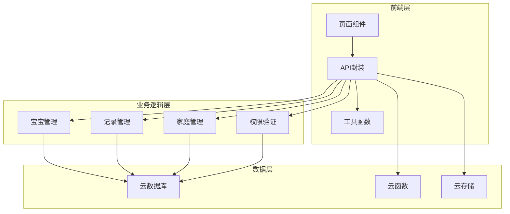
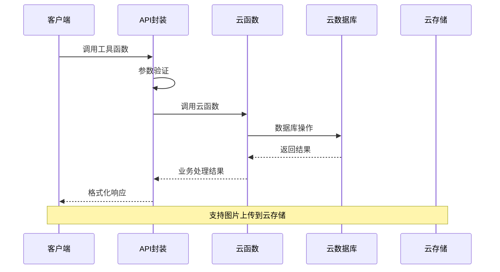
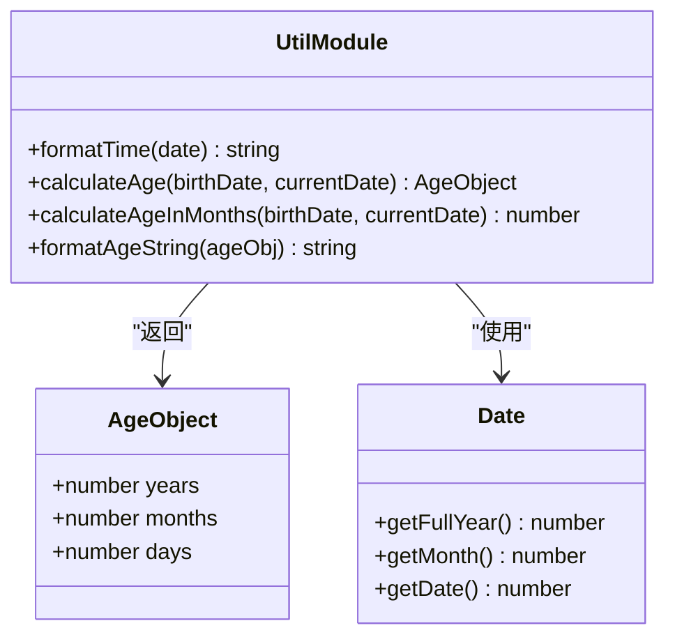
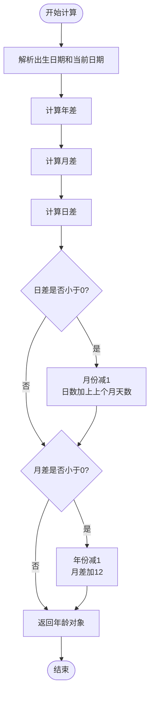
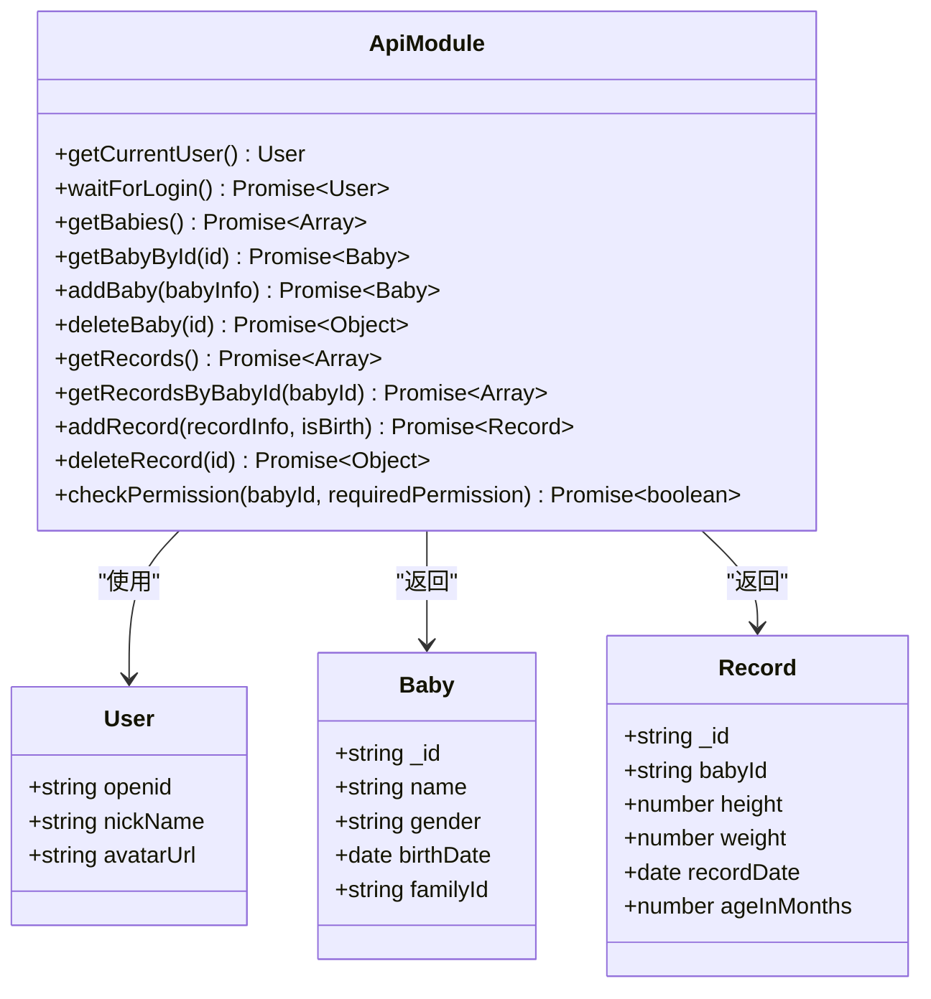
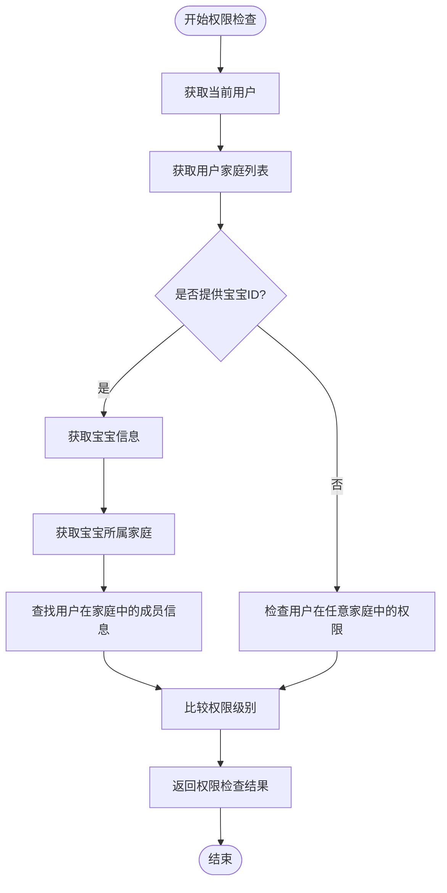
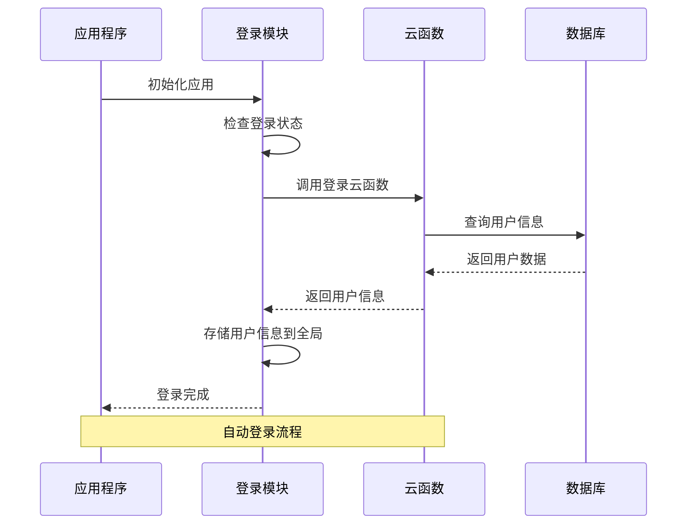
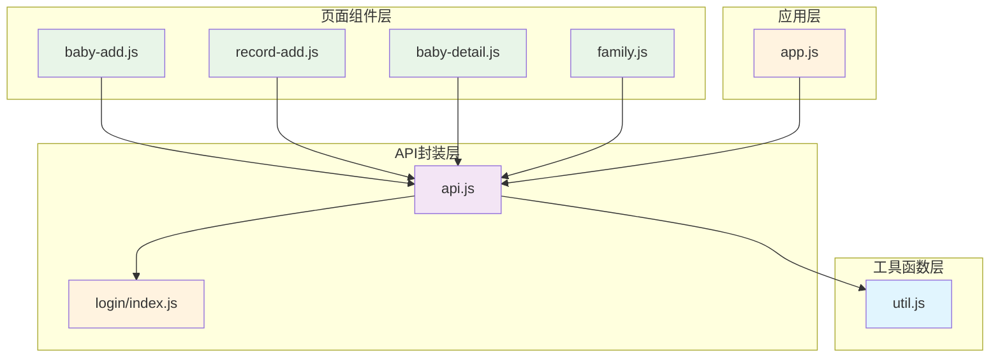
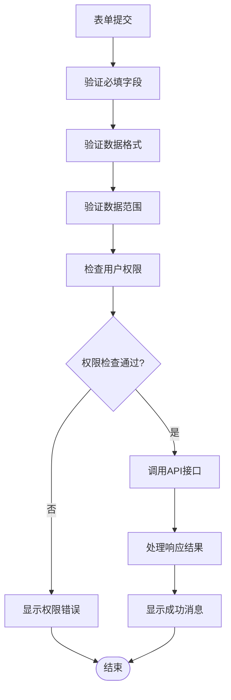

# 工具类API

<cite>
**本文档引用的文件**
- [util.js](file://miniprogram/utils/util.js)
- [api.js](file://miniprogram/utils/api.js)
- [app.js](file://miniprogram/app.js)
- [baby-add.js](file://miniprogram/pages/baby-add/baby-add.js)
- [record-add.js](file://miniprogram/pages/record-add/record-add.js)
- [baby-detail.js](file://miniprogram/pages/baby-detail/baby-detail.js)
- [family.js](file://miniprogram/pages/family/family.js)
- [login/index.js](file://cloudfunctions/login/index.js)
</cite>

## 目录
1. [简介](#简介)
2. [项目结构](#项目结构)
3. [核心组件](#核心组件)
4. [架构概览](#架构概览)
5. [详细组件分析](#详细组件分析)
6. [依赖关系分析](#依赖关系分析)
7. [性能考虑](#性能考虑)
8. [故障排除指南](#故障排除指南)
9. [结论](#结论)

## 简介

本项目是一个基于微信小程序的婴儿成长追踪助手，提供了完整的工具类辅助功能。系统包含数据格式化、计算工具、验证规则、通用操作等多个方面的实用工具接口，涵盖了年龄计算、数据转换、格式化工具、通用验证等功能。

主要功能模块包括：
- **数据格式化工具**：日期格式化、年龄字符串格式化
- **年龄计算工具**：精确年龄计算、月龄计算
- **权限验证工具**：用户权限检查、访问控制
- **数据验证工具**：表单验证、参数校验
- **通用操作工具**：登录状态管理、网络请求封装

## 项目结构

项目采用分层架构设计，主要分为以下几个层次：

**图表来源**
- [util.js:1-55](file://miniprogram/utils/util.js#L1-L55)
- [api.js:1-879](file://miniprogram/utils/api.js#L1-L879)
- [app.js:1-56](file://miniprogram/app.js#L1-L56)

**章节来源**
- [util.js:1-55](file://miniprogram/utils/util.js#L1-L55)
- [api.js:1-879](file://miniprogram/utils/api.js#L1-L879)
- [app.js:1-56](file://miniprogram/app.js#L1-L56)

## 核心组件

### 数据格式化工具

#### 时间格式化函数
- **formatTime(date)**: 将Date对象格式化为"YYYY/M/D"格式
- **使用场景**: 显示系统日期、记录时间格式化
- **参数**: date - JavaScript Date对象
- **返回值**: 字符串格式的日期

#### 年龄格式化函数
- **formatAgeString(ageObj)**: 将年龄对象格式化为可读字符串
- **使用场景**: 显示宝宝年龄描述
- **参数**: ageObj - 包含years、months、days的对象
- **返回值**: 格式化的年龄字符串

### 年龄计算工具

#### 精确年龄计算
- **calculateAge(birthDate, currentDate)**: 计算精确年龄
- **使用场景**: 计算宝宝当前年龄
- **参数**: birthDate - 出生日期, currentDate - 计算日期(可选，默认当前日期)
- **返回值**: 包含years、months、days的对象

#### 月龄计算
- **calculateAgeInMonths(birthDate, currentDate)**: 计算近似月龄
- **使用场景**: 计算宝宝月龄，15天计为0.5个月
- **参数**: birthDate - 出生日期, currentDate - 计算日期(可选，默认当前日期)
- **返回值**: 数值型月龄

**章节来源**
- [util.js:1-55](file://miniprogram/utils/util.js#L1-L55)

## 架构概览

系统采用前后端分离架构，前端负责用户界面和交互，后端通过云函数提供数据访问和业务逻辑处理。

**图表来源**
- [api.js:1-879](file://miniprogram/utils/api.js#L1-L879)
- [login/index.js:1-814](file://cloudfunctions/login/index.js#L1-L814)

## 详细组件分析

### 工具函数模块 (util.js)

#### 类结构图

**图表来源**
- [util.js:1-55](file://miniprogram/utils/util.js#L1-L55)

#### 核心算法流程

##### 年龄计算算法

**图表来源**
- [util.js:8-28](file://miniprogram/utils/util.js#L8-L28)

**章节来源**
- [util.js:1-55](file://miniprogram/utils/util.js#L1-L55)

### API封装模块 (api.js)

#### 类结构图

**图表来源**
- [api.js:1-879](file://miniprogram/utils/api.js#L1-L879)

#### 权限检查流程

**图表来源**
- [api.js:782-852](file://miniprogram/utils/api.js#L782-L852)

**章节来源**
- [api.js:1-879](file://miniprogram/utils/api.js#L1-L879)

### 页面组件集成

#### 登录状态管理

**图表来源**
- [app.js:22-54](file://miniprogram/app.js#L22-L54)

**章节来源**
- [app.js:1-56](file://miniprogram/app.js#L1-L56)

## 依赖关系分析

### 组件依赖图

**图表来源**
- [util.js:1-55](file://miniprogram/utils/util.js#L1-L55)
- [api.js:1-879](file://miniprogram/utils/api.js#L1-L879)
- [login/index.js:1-814](file://cloudfunctions/login/index.js#L1-L814)

### 数据流分析

#### 表单验证流程

**图表来源**
- [baby-add.js:74-118](file://miniprogram/pages/baby-add/baby-add.js#L74-L118)
- [record-add.js:71-116](file://miniprogram/pages/record-add/record-add.js#L71-L116)

**章节来源**
- [baby-add.js:1-120](file://miniprogram/pages/baby-add/baby-add.js#L1-L120)
- [record-add.js:1-118](file://miniprogram/pages/record-add/record-add.js#L1-L118)

## 性能考虑

### 缓存策略
- **用户信息缓存**: 登录成功后存储到全局变量和本地存储
- **权限缓存**: 在页面生命周期内复用权限检查结果
- **数据缓存**: 家庭和宝宝信息在页面显示时缓存

### 异步处理
- **Promise链式调用**: 避免回调地狱，提高代码可读性
- **并发请求**: 合理使用Promise.all进行并发数据获取
- **超时控制**: 登录等待机制设置最大等待时间

### 内存管理
- **及时释放**: 页面卸载时清理定时器和事件监听器
- **数据清理**: 避免内存泄漏，及时清理大型对象引用

## 故障排除指南

### 常见问题及解决方案

#### 登录相关问题
- **问题**: 登录超时
- **原因**: 网络延迟或服务器响应慢
- **解决**: 检查网络连接，增加重试机制

#### 权限相关问题
- **问题**: 无权限操作
- **原因**: 用户权限不足或家庭成员关系异常
- **解决**: 检查用户在家庭中的权限等级

#### 数据验证问题
- **问题**: 表单验证失败
- **原因**: 输入数据格式不正确或超出范围
- **解决**: 提供清晰的错误提示和输入指导

**章节来源**
- [api.js:14-41](file://miniprogram/utils/api.js#L14-L41)
- [api.js:782-852](file://miniprogram/utils/api.js#L782-L852)

## 结论

本项目提供了完整的工具类辅助功能，涵盖了数据格式化、计算工具、验证规则、通用操作等多个方面。通过合理的模块化设计和清晰的API接口，实现了以下目标：

1. **功能完整性**: 提供了年龄计算、数据格式化、权限验证等核心工具函数
2. **易用性**: 简洁的API接口和完善的错误处理机制
3. **可扩展性**: 模块化设计便于功能扩展和维护
4. **可靠性**: 完善的错误处理和权限控制机制

推荐的最佳实践包括：合理使用工具函数进行数据格式化、严格的数据验证、适当的权限检查、以及良好的错误处理机制。这些工具函数为整个系统的稳定运行提供了坚实的基础。