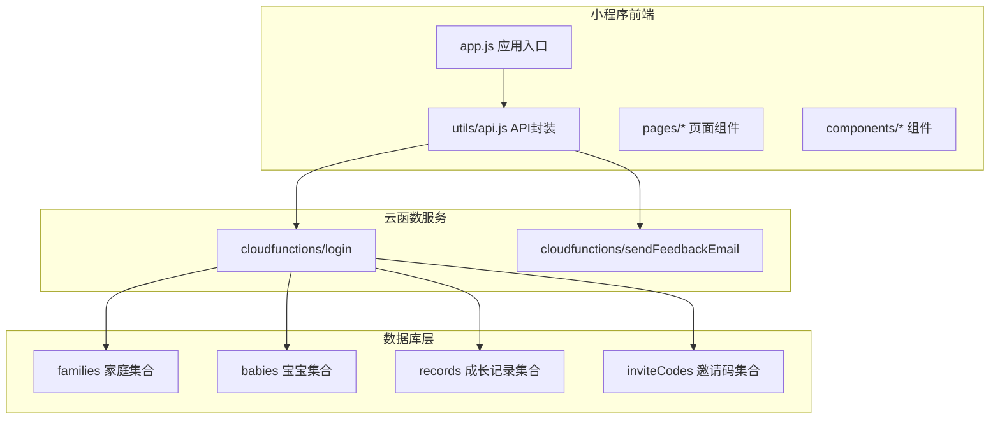
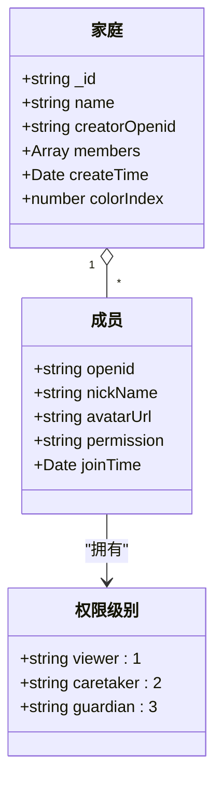
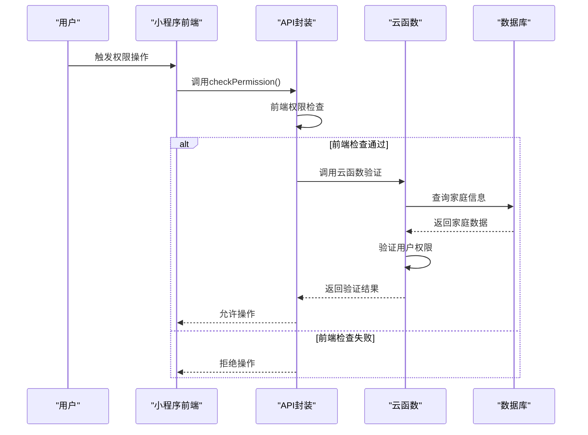
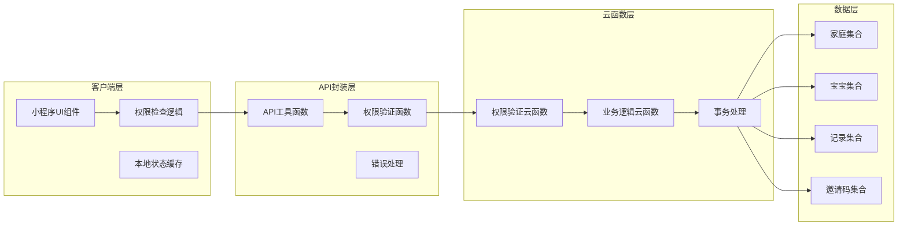
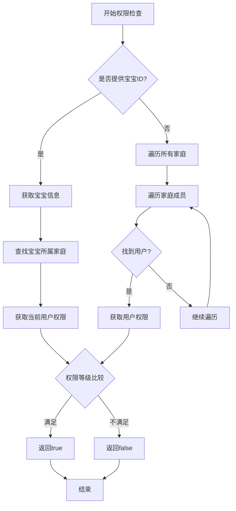
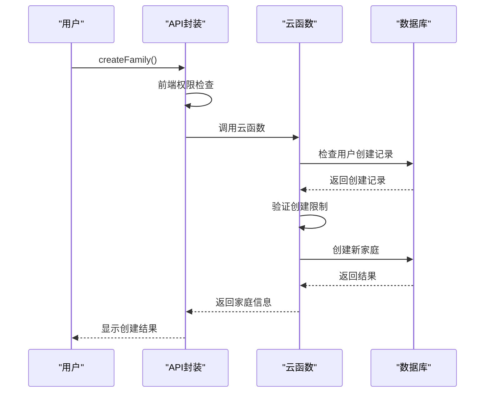
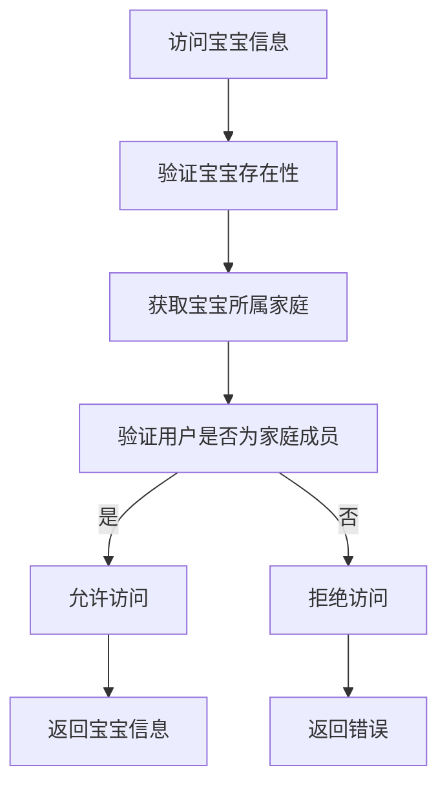
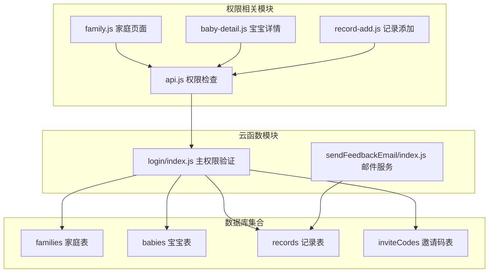

# 权限控制API

<cite>
**本文档引用的文件**
- [login/index.js](file://cloudfunctions/login/index.js)
- [api.js](file://miniprogram/utils/api.js)
- [family.js](file://miniprogram/pages/family/family.js)
- [baby-detail.js](file://miniprogram/pages/baby-detail/baby-detail.js)
- [record-add.js](file://miniprogram/pages/record-add/record-add.js)
- [family.wxml](file://miniprogram/pages/family/family.wxml)
- [app.js](file://miniprogram/app.js)
- [sendFeedbackEmail/index.js](file://cloudfunctions/sendFeedbackEmail/index.js)
</cite>

## 目录
1. [简介](#简介)
2. [项目结构](#项目结构)
3. [核心组件](#核心组件)
4. [架构概览](#架构概览)
5. [详细组件分析](#详细组件分析)
6. [依赖关系分析](#依赖关系分析)
7. [性能考虑](#性能考虑)
8. [故障排除指南](#故障排除指南)
9. [结论](#结论)

## 简介

本项目实现了基于微信小程序的权限控制系统，采用"前端权限检查 + 云端操作验证"的双重安全机制。系统通过家庭-成员-权限三级模型实现细粒度的资源访问控制，支持多层级权限继承和动态权限判断。

权限控制体系包含三个核心角色：
- **一级助教（guardian）**：最高权限，可管理家庭和成员
- **二级助教（caretaker）**：可添加成长记录
- **围观吃瓜（viewer）**：仅可查看数据

系统通过云函数作为权限验证的权威来源，确保数据操作的安全性和一致性。

## 项目结构

**图表来源**
- [app.js:1-56](file://miniprogram/app.js#L1-L56)
- [api.js:1-879](file://miniprogram/utils/api.js#L1-L879)

**章节来源**
- [app.js:1-56](file://miniprogram/app.js#L1-L56)
- [api.js:1-879](file://miniprogram/utils/api.js#L1-L879)

## 核心组件

### 权限模型设计

系统采用三层权限模型：

**图表来源**
- [login/index.js:130-145](file://cloudfunctions/login/index.js#L130-L145)
- [api.js:814-823](file://miniprogram/utils/api.js#L814-L823)

### 权限验证流程

**图表来源**
- [api.js:782-852](file://miniprogram/utils/api.js#L782-L852)
- [login/index.js:556-576](file://cloudfunctions/login/index.js#L556-L576)

**章节来源**
- [api.js:782-852](file://miniprogram/utils/api.js#L782-L852)
- [login/index.js:556-576](file://cloudfunctions/login/index.js#L556-L576)

## 架构概览

系统采用"前端轻量检查 + 云端权威验证"的混合架构：

**图表来源**
- [api.js:1-879](file://miniprogram/utils/api.js#L1-L879)
- [login/index.js:1-814](file://cloudfunctions/login/index.js#L1-L814)

## 详细组件分析

### 权限检查组件

#### 前端权限检查

前端实现了一个完整的权限检查系统，支持两种检查模式：

**图表来源**
- [api.js:782-852](file://miniprogram/utils/api.js#L782-L852)

#### 云端权限验证

云函数作为权限验证的权威来源，确保所有敏感操作都经过严格验证：

**章节来源**
- [api.js:782-852](file://miniprogram/utils/api.js#L782-L852)
- [login/index.js:186-225](file://cloudfunctions/login/index.js#L186-L225)

### 家庭管理API

#### 家庭创建权限

**图表来源**
- [login/index.js:94-151](file://cloudfunctions/login/index.js#L94-L151)
- [api.js:497-529](file://miniprogram/utils/api.js#L497-L529)

#### 成员权限管理

系统支持完整的成员权限管理功能：

**章节来源**
- [login/index.js:186-266](file://cloudfunctions/login/index.js#L186-L266)
- [api.js:717-749](file://miniprogram/utils/api.js#L717-L749)

### 宝宝数据权限

#### 宝宝信息访问控制

**图表来源**
- [login/index.js:556-576](file://cloudfunctions/login/index.js#L556-L576)
- [api.js:78-111](file://miniprogram/utils/api.js#L78-L111)

#### 成长记录操作权限

系统对不同角色设置不同的记录操作权限：

**章节来源**
- [login/index.js:512-554](file://cloudfunctions/login/index.js#L512-L554)
- [baby-detail.js:592-612](file://miniprogram/pages/baby-detail/baby-detail.js#L592-L612)

### 邀请码权限控制

系统通过邀请码机制实现安全的成员邀请功能：

**章节来源**
- [login/index.js:658-699](file://cloudfunctions/login/index.js#L658-L699)
- [api.js:531-563](file://miniprogram/utils/api.js#L531-L563)

## 依赖关系分析

**图表来源**
- [api.js:1-879](file://miniprogram/utils/api.js#L1-L879)
- [login/index.js:1-814](file://cloudfunctions/login/index.js#L1-L814)

**章节来源**
- [api.js:1-879](file://miniprogram/utils/api.js#L1-L879)
- [login/index.js:1-814](file://cloudfunctions/login/index.js#L1-L814)

## 性能考虑

### 缓存策略

系统采用多层缓存机制：

1. **前端缓存**：用户信息和家庭信息在内存中缓存
2. **数据库查询优化**：使用索引和条件查询减少查询时间
3. **云函数复用**：权限验证结果在一定时间内有效

### 性能优化建议

- 使用批量查询减少数据库往返次数
- 实施适当的权限缓存策略
- 优化图表渲染性能
- 实现懒加载机制

## 故障排除指南

### 常见权限问题

| 问题类型 | 症状 | 解决方案 |
|---------|------|---------|
| 权限不足 | 操作被拒绝 | 检查用户在家庭中的权限级别 |
| 数据访问失败 | 无法查看数据 | 验证用户是否为家庭成员 |
| 权限验证错误 | 权限检查异常 | 检查云函数执行日志 |

### 调试方法

1. **启用详细日志**：在开发工具中查看网络请求和响应
2. **检查云函数状态**：监控云函数执行时间和错误
3. **验证数据库权限**：确保数据库安全规则正确配置

**章节来源**
- [login/index.js:1-814](file://cloudfunctions/login/index.js#L1-814)
- [api.js:1-879](file://miniprogram/utils/api.js#L1-879)

## 结论

本权限控制系统通过"前端轻量检查 + 云端权威验证"的设计，在保证安全性的同时提供了良好的用户体验。系统支持多层级权限模型、细粒度的资源控制和动态权限判断，能够满足家庭成长记录管理的复杂权限需求。

主要特点：
- **双重安全验证**：前端检查 + 云端验证
- **细粒度权限控制**：支持资源级和操作级权限
- **灵活的权限继承**：基于家庭关系的权限继承
- **完善的错误处理**：提供清晰的权限错误信息
- **可扩展的架构**：易于添加新的权限规则和验证逻辑