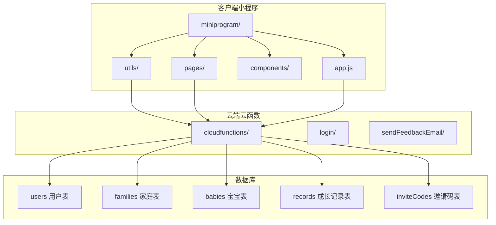
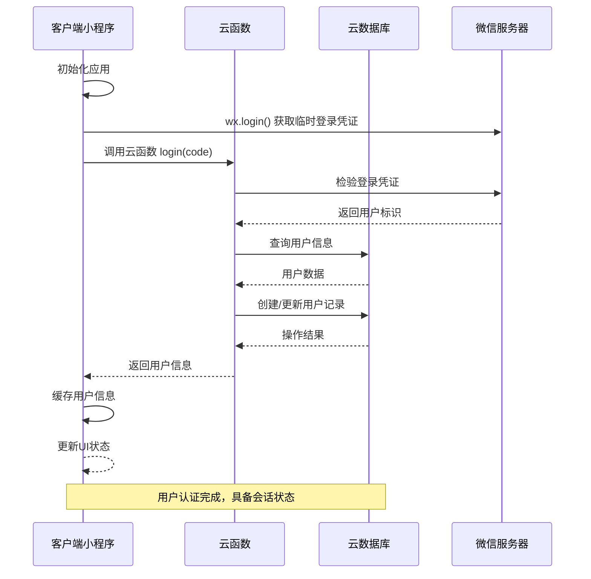
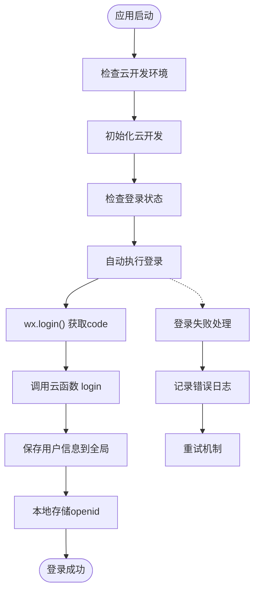
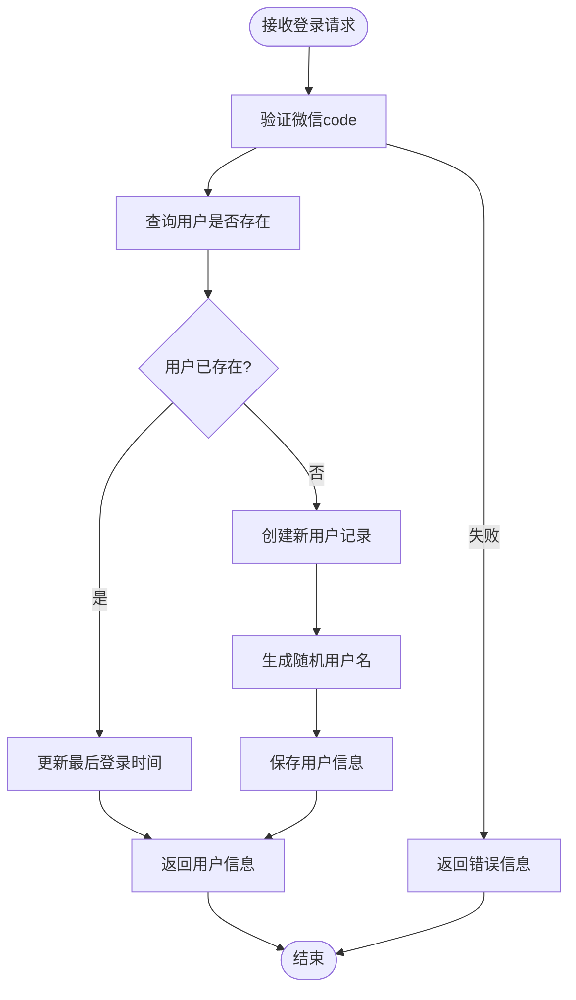
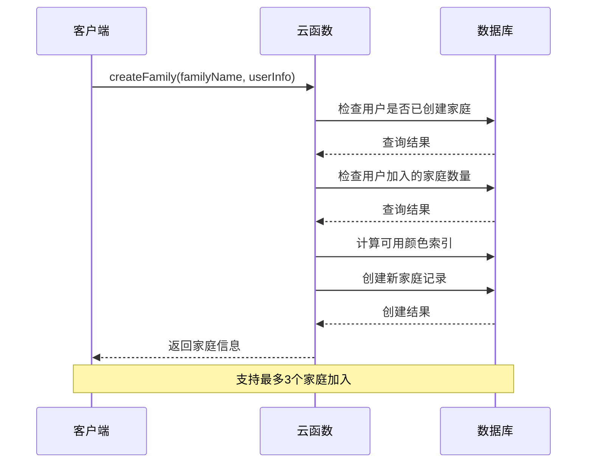
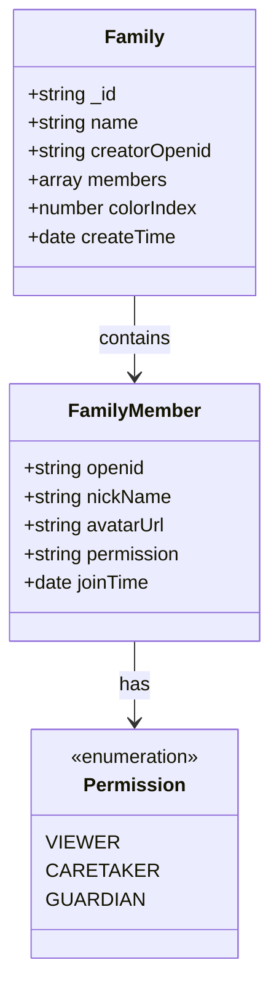
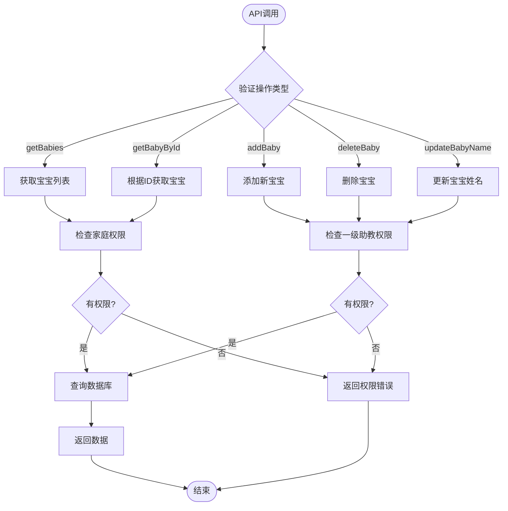
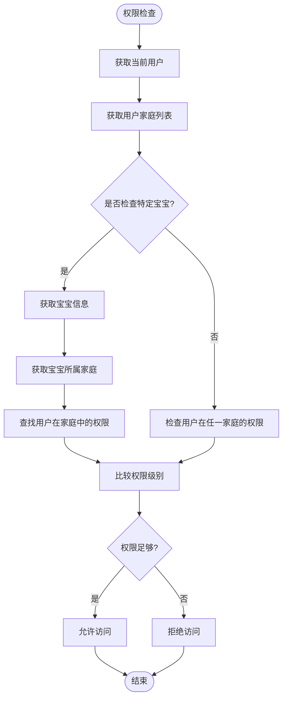
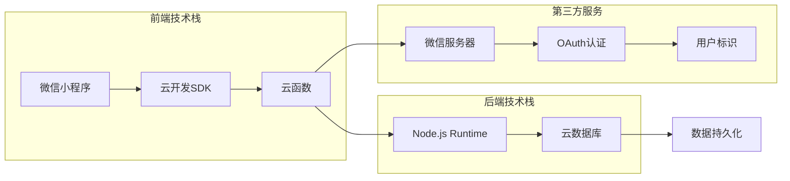
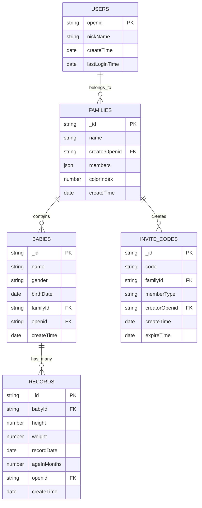

# 用户认证API

<cite>
**本文档引用的文件**
- [cloudfunctions/login/index.js](file://cloudfunctions/login/index.js)
- [miniprogram/utils/api.js](file://miniprogram/utils/api.js)
- [miniprogram/app.js](file://miniprogram/app.js)
- [miniprogram/utils/util.js](file://miniprogram/utils/util.js)
- [miniprogram/pages/index/index.js](file://miniprogram/pages/index/index.js)
- [miniprogram/pages/baby-detail/baby-detail.js](file://miniprogram/pages/baby-detail/baby-detail.js)
- [miniprogram/pages/baby-add/baby-add.js](file://miniprogram/pages/baby-add/baby-add.js)
- [cloudfunctions/sendFeedbackEmail/index.js](file://cloudfunctions/sendFeedbackEmail/index.js)
</cite>

## 目录
1. [简介](#简介)
2. [项目结构](#项目结构)
3. [核心组件](#核心组件)
4. [架构概览](#架构概览)
5. [详细组件分析](#详细组件分析)
6. [依赖关系分析](#依赖关系分析)
7. [性能考虑](#性能考虑)
8. [故障排除指南](#故障排除指南)
9. [结论](#结论)

## 简介

这是一个基于微信小程序的用户认证系统，主要服务于"宝宝助手"应用。系统实现了完整的用户登录、注册、会话管理和家庭成员权限控制功能。通过云函数提供统一的认证服务，支持微信授权登录、家庭管理、宝宝信息管理等功能。

## 项目结构

该项目采用典型的微信小程序架构，分为客户端小程序和云端云函数两部分：

**图表来源**
- [miniprogram/app.js:1-56](file://miniprogram/app.js#L1-L56)
- [cloudfunctions/login/index.js:1-814](file://cloudfunctions/login/index.js#L1-L814)

**章节来源**
- [miniprogram/app.js:1-56](file://miniprogram/app.js#L1-L56)
- [cloudfunctions/login/index.js:1-814](file://cloudfunctions/login/index.js#L1-L814)

## 核心组件

### 登录认证模块

系统的核心认证流程基于微信小程序的登录机制，通过云函数实现用户身份验证和会话管理。

### 家庭管理系统

提供家庭创建、成员管理、权限控制等功能，支持多家庭场景下的用户协作。

### 数据访问层

通过云函数封装数据库操作，确保数据访问的安全性和一致性。

**章节来源**
- [miniprogram/utils/api.js:1-879](file://miniprogram/utils/api.js#L1-L879)
- [cloudfunctions/login/index.js:22-800](file://cloudfunctions/login/index.js#L22-L800)

## 架构概览

系统采用客户端-云函数-数据库三层架构，实现了前后端分离的设计模式：

**图表来源**
- [miniprogram/app.js:28-54](file://miniprogram/app.js#L28-L54)
- [cloudfunctions/login/index.js:762-800](file://cloudfunctions/login/index.js#L762-L800)

## 详细组件分析

### 登录认证流程

#### 客户端登录实现

小程序启动时自动执行登录流程，无需用户手动操作：

**图表来源**
- [miniprogram/app.js:18-54](file://miniprogram/app.js#L18-L54)

#### 云函数登录处理

云函数负责处理微信登录凭证验证和用户信息管理：

**图表来源**
- [cloudfunctions/login/index.js:762-800](file://cloudfunctions/login/index.js#L762-L800)

**章节来源**
- [miniprogram/app.js:18-54](file://miniprogram/app.js#L18-L54)
- [cloudfunctions/login/index.js:762-800](file://cloudfunctions/login/index.js#L762-L800)

### 家庭管理API

#### 家庭创建

系统支持用户创建家庭，限制每个用户只能创建一个家庭：

**图表来源**
- [cloudfunctions/login/index.js:94-151](file://cloudfunctions/login/index.js#L94-L151)

#### 家庭成员管理

提供完整的家庭成员权限管理体系：

**图表来源**
- [cloudfunctions/login/index.js:131-143](file://cloudfunctions/login/index.js#L131-L143)

**章节来源**
- [cloudfunctions/login/index.js:94-151](file://cloudfunctions/login/index.js#L94-L151)
- [cloudfunctions/login/index.js:186-266](file://cloudfunctions/login/index.js#L186-L266)

### 数据访问API

#### 宝宝信息管理

提供宝宝信息的增删改查操作，支持权限控制：

**图表来源**
- [miniprogram/utils/api.js:43-75](file://miniprogram/utils/api.js#L43-L75)
- [miniprogram/utils/api.js:149-240](file://miniprogram/utils/api.js#L149-L240)

**章节来源**
- [miniprogram/utils/api.js:43-75](file://miniprogram/utils/api.js#L43-L75)
- [miniprogram/utils/api.js:149-240](file://miniprogram/utils/api.js#L149-L240)

### 权限控制系统

#### 权限级别定义

系统采用三级权限模型，确保家庭数据的安全访问：

| 权限级别 | 权限名称 | 可执行操作 |
|---------|----------|-----------|
| 1 | 观察者(Viewer) | 仅能查看宝宝数据 |
| 2 | 照看者(Caretaker) | 可添加宝宝成长记录 |
| 3 | 一级助教(Guardian) | 最高权限，可管理宝宝和成员 |

#### 权限检查流程

**图表来源**
- [miniprogram/utils/api.js:782-825](file://miniprogram/utils/api.js#L782-L825)

**章节来源**
- [miniprogram/utils/api.js:782-825](file://miniprogram/utils/api.js#L782-L825)

## 依赖关系分析

### 技术栈依赖

**图表来源**
- [miniprogram/app.js:8-16](file://miniprogram/app.js#L8-L16)
- [cloudfunctions/login/package.json:12-14](file://cloudfunctions/login/package.json#L12-L14)

### 数据模型关系

**图表来源**
- [cloudfunctions/login/index.js:54-89](file://cloudfunctions/login/index.js#L54-L89)
- [cloudfunctions/login/index.js:556-605](file://cloudfunctions/login/index.js#L556-L605)

**章节来源**
- [cloudfunctions/login/index.js:54-89](file://cloudfunctions/login/index.js#L54-L89)
- [cloudfunctions/login/index.js:556-605](file://cloudfunctions/login/index.js#L556-L605)

## 性能考虑

### 登录优化策略

1. **异步登录处理**：客户端启动时自动执行登录，避免阻塞用户体验
2. **本地缓存机制**：使用本地存储缓存用户信息，减少重复登录
3. **超时控制**：设置5秒登录超时，防止长时间等待

### 数据访问优化

1. **批量查询**：支持批量获取宝宝列表和家庭信息
2. **权限预检查**：在客户端进行权限预检查，减少无效请求
3. **懒加载机制**：图表数据按需加载，提升页面响应速度

### 错误处理策略

1. **重试机制**：登录失败时自动重试，提高成功率
2. **降级处理**：网络异常时提供基本功能降级方案
3. **用户提示**：友好的错误提示和解决方案引导

## 故障排除指南

### 常见问题及解决方案

#### 登录失败问题

**症状**：应用启动后无法获取用户信息
**可能原因**：
- 微信服务器连接异常
- 云函数部署失败
- 网络环境不稳定

**解决步骤**：
1. 检查微信服务器状态
2. 验证云函数部署情况
3. 确认网络连接正常
4. 清除本地缓存重新登录

#### 权限不足问题

**症状**：执行某些操作时提示权限不足
**可能原因**：
- 用户在家庭中的权限级别不够
- 家庭成员关系发生变化
- 权限检查逻辑异常

**解决步骤**：
1. 确认用户在家庭中的正确权限
2. 检查家庭成员列表更新
3. 验证权限检查逻辑
4. 联系一级助教调整权限

#### 数据同步问题

**症状**：页面显示的数据与实际不符
**可能原因**：
- 本地缓存数据过期
- 并发操作导致的数据冲突
- 网络延迟影响数据更新

**解决步骤**：
1. 刷新页面强制重新加载
2. 检查网络连接稳定性
3. 等待数据同步完成
4. 重启应用清除缓存

**章节来源**
- [miniprogram/app.js:18-54](file://miniprogram/app.js#L18-L54)
- [miniprogram/utils/api.js:13-41](file://miniprogram/utils/api.js#L13-L41)

## 结论

本用户认证系统通过微信小程序的云开发能力，实现了完整的用户身份验证和权限管理功能。系统采用分层架构设计，客户端负责用户交互，云函数提供业务逻辑处理，云数据库保证数据安全。

### 主要优势

1. **安全性**：基于微信官方认证体系，确保用户身份可信
2. **易用性**：自动登录机制，无需用户手动操作
3. **扩展性**：模块化设计，便于功能扩展和维护
4. **可靠性**：完善的错误处理和重试机制

### 改进建议

1. **增加Token管理**：考虑引入JWT Token机制，支持更灵活的会话管理
2. **增强安全防护**：添加防刷机制和异常行为检测
3. **优化性能**：实现更精细的数据缓存策略
4. **完善监控**：增加详细的日志记录和性能监控

该系统为"宝宝助手"应用提供了稳定可靠的用户认证基础，支持多用户协作和家庭管理场景，为后续功能扩展奠定了良好的技术基础。