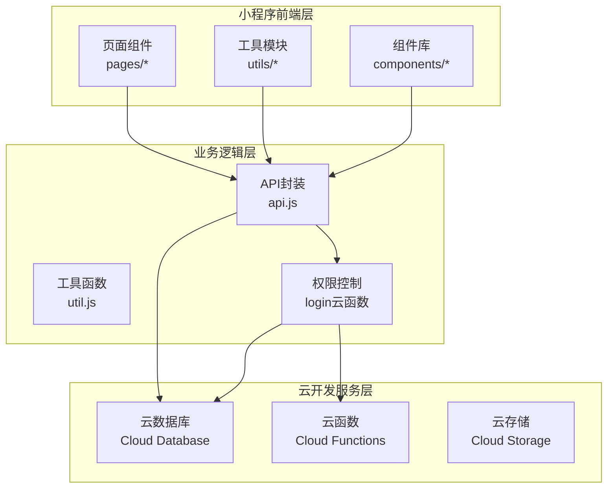
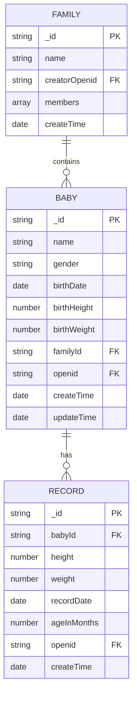
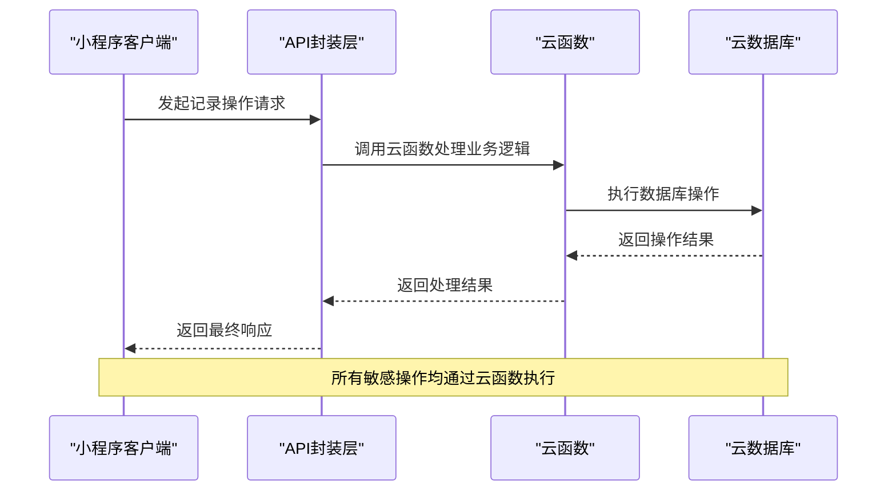
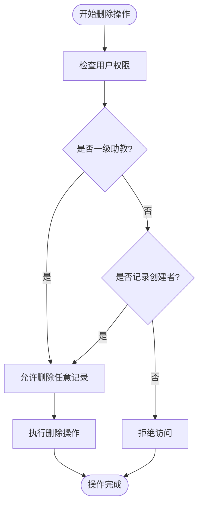
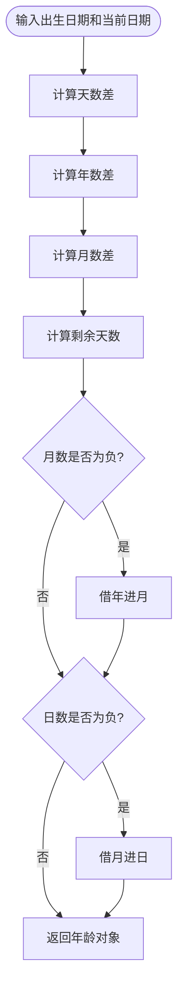
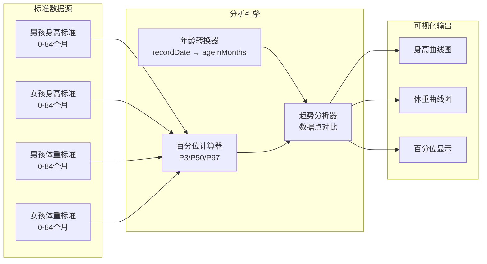
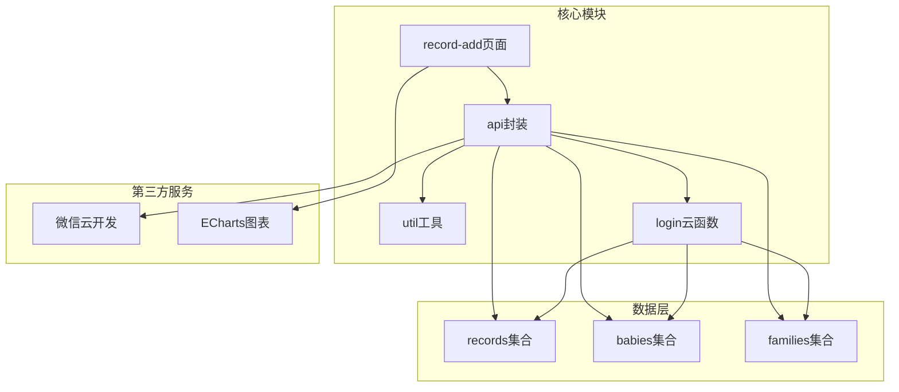

# 记录管理API

<cite>
**本文档引用的文件**
- [record-add.js](file://miniprogram/pages/record-add/record-add.js)
- [api.js](file://miniprogram/utils/api.js)
- [util.js](file://miniprogram/utils/util.js)
- [index.js](file://cloudfunctions/login/index.js)
- [baby-detail.js](file://miniprogram/pages/baby-detail/baby-detail.js)
- [family.wxml](file://miniprogram/pages/family/family.wxml)
</cite>

## 目录
1. [简介](#简介)
2. [项目结构](#项目结构)
3. [核心组件](#核心组件)
4. [架构概览](#架构概览)
5. [详细组件分析](#详细组件分析)
6. [依赖关系分析](#依赖关系分析)
7. [性能考虑](#性能考虑)
8. [故障排除指南](#故障排除指南)
9. [结论](#结论)

## 简介

BabyAssistant 是一个基于微信小程序的婴幼儿成长记录管理系统。本系统提供了完整的成长记录管理功能，包括身高、体重数据的录入、查询、统计分析和可视化展示。系统采用微信云开发技术栈，实现了云端数据库、云函数和小程序前端的完整架构。

## 项目结构

项目采用典型的微信小程序三层架构设计：



**图表来源**
- [api.js:1-800](file://miniprogram/utils/api.js#L1-L800)
- [index.js:1-800](file://cloudfunctions/login/index.js#L1-L800)

**章节来源**
- [api.js:1-800](file://miniprogram/utils/api.js#L1-L800)
- [index.js:1-800](file://cloudfunctions/login/index.js#L1-L800)

## 核心组件

### 数据模型设计

系统采用简洁高效的数据模型设计，主要包含两个核心集合：



**图表来源**
- [.trae/documents/baby_assistant_technical.md:47-106](file://.trae/documents/baby_assistant_technical.md#L47-L106)

### 权限管理体系

系统实现了三级权限控制机制：

| 权限级别 | 角色名称 | 权限描述 | 操作范围 |
|---------|---------|---------|---------|
| 1 | 围观吃瓜 | 仅查看权限 | 仅能查看宝宝数据 |
| 2 | 二级助教 | 基础操作权限 | 可添加宝宝成长记录 |
| 3 | 一级助教 | 管理权限 | 可管理宝宝和成员 |

**章节来源**
- [family.wxml:86-102](file://miniprogram/pages/family/family.wxml#L86-L102)
- [api.js:782-825](file://miniprogram/utils/api.js#L782-L825)

## 架构概览

系统采用前后端分离的微服务架构，通过云函数实现业务逻辑的集中处理：



**图表来源**
- [api.js:299-346](file://miniprogram/utils/api.js#L299-L346)
- [index.js:22-800](file://cloudfunctions/login/index.js#L22-L800)

## 详细组件分析

### 成长记录管理API

#### 添加成长记录接口

**接口定义**
- 方法：POST
- 路径：`/api/records`
- 权限：二级助教及以上

**请求参数**

| 参数名 | 类型 | 必填 | 描述 | 验证规则 |
|-------|------|------|------|---------|
| babyId | string | 是 | 宝宝唯一标识 | 存在且属于当前家庭 |
| height | number | 是 | 身高(cm) | 0 < height ≤ 250 |
| weight | number | 是 | 体重(kg) | 0 < weight ≤ 200 |
| recordDate | date | 是 | 记录日期 | 不得早于出生日期 |
| openid | string | 否 | 操作用户标识 | 通过云函数获取 |

**响应格式**
```json
{
  "success": true,
  "data": {
    "_id": "记录唯一标识",
    "babyId": "宝宝标识",
    "height": 75.5,
    "weight": 9.2,
    "recordDate": "2024-06-01T00:00:00.000Z",
    "ageInMonths": 5.5,
    "createTime": "2024-06-01T00:00:00.000Z"
  }
}
```

**数据验证规则**

1. **数值范围验证**
   - 身高：10cm ≤ height ≤ 250cm
   - 体重：0.1kg ≤ weight ≤ 200kg

2. **时间逻辑验证**
   - 记录日期不得早于宝宝出生日期
   - 年龄计算采用15天为半年的近似算法

3. **权限验证**
   - 仅限二级助教及以上成员
   - 必须是目标宝宝所在家庭的成员

**章节来源**
- [record-add.js:71-116](file://miniprogram/pages/record-add/record-add.js#L71-L116)
- [api.js:299-346](file://miniprogram/utils/api.js#L299-L346)

#### 删除记录接口

**接口定义**
- 方法：DELETE
- 路径：`/api/records/{recordId}`
- 权限：一级助教或二级助教（仅限本人录入的记录）

**权限控制逻辑**


**图表来源**
- [index.js:512-554](file://cloudfunctions/login/index.js#L512-L554)

**章节来源**
- [index.js:512-554](file://cloudfunctions/login/index.js#L512-L554)

#### 查询记录接口

**接口定义**
- 方法：GET
- 路径：`/api/records/{babyId}`
- 权限：所有家庭成员

**查询参数**

| 参数名 | 类型 | 必填 | 描述 |
|-------|------|------|------|
| babyId | string | 是 | 宝宝唯一标识 |
| limit | number | 否 | 返回记录数量限制，默认100 |
| offset | number | 否 | 分页偏移量，默认0 |
| orderBy | string | 否 | 排序字段，默认recordDate |

**响应格式**
```json
{
  "success": true,
  "data": [
    {
      "_id": "记录1标识",
      "height": 75.5,
      "weight": 9.2,
      "recordDate": "2024-06-01T00:00:00.000Z",
      "ageInMonths": 5.5,
      "formattedDate": "2024-06-01",
      "ageStr": "5月15天"
    }
  ]
}
```

**章节来源**
- [api.js:264-286](file://miniprogram/utils/api.js#L264-L286)
- [index.js:579-605](file://cloudfunctions/login/index.js#L579-L605)

### 计算逻辑实现

#### 年龄计算算法

系统采用精确的年龄计算算法，考虑闰年和不同月份天数差异：



**图表来源**
- [util.js:8-28](file://miniprogram/utils/util.js#L8-L28)

#### 数据有效性检查

系统实现了多层次的数据验证机制：

1. **前端验证**
   - 输入格式检查
   - 数值范围验证
   - 时间逻辑校验

2. **后端验证**
   - 用户权限确认
   - 数据完整性检查
   - 业务规则验证

**章节来源**
- [util.js:8-38](file://miniprogram/utils/util.js#L8-L38)
- [record-add.js:78-92](file://miniprogram/pages/record-add/record-add.js#L78-L92)

### 统计分析功能

#### 标准曲线对比

系统集成了国家卫健委标准曲线数据，支持实时对比分析：



**图表来源**
- [baby-detail.js:263-321](file://miniprogram/pages/baby-detail/baby-detail.js#L263-L321)

**章节来源**
- [baby-detail.js:263-321](file://miniprogram/pages/baby-detail/baby-detail.js#L263-L321)

## 依赖关系分析

### 组件耦合度分析



**图表来源**
- [api.js:1-800](file://miniprogram/utils/api.js#L1-L800)
- [index.js:1-800](file://cloudfunctions/login/index.js#L1-L800)

### 外部依赖

系统主要依赖以下外部服务：
- 微信云开发（数据库、函数、存储）
- ECharts图表库
- 微信小程序原生API

**章节来源**
- [api.js:1-800](file://miniprogram/utils/api.js#L1-L800)
- [index.js:1-800](file://cloudfunctions/login/index.js#L1-L800)

## 性能考虑

### 数据访问优化

1. **批量查询优化**
   - 使用`_.in`操作符进行批量ID查询
   - 实现分页机制避免一次性加载过多数据

2. **缓存策略**
   - 本地缓存用户信息和权限状态
   - 避免重复的云函数调用

3. **网络优化**
   - 实现请求去重机制
   - 采用防抖处理频繁操作

### 安全性保障

1. **权限控制**
   - 所有敏感操作必须通过云函数执行
   - 实现细粒度的权限验证

2. **数据验证**
   - 前后端双重验证
   - 实施输入白名单机制

## 故障排除指南

### 常见问题及解决方案

**问题1：权限不足导致操作失败**
- 症状：提示"无权限删除此记录"
- 解决方案：确认当前用户权限等级和目标记录归属关系

**问题2：记录数据异常**
- 症状：身高体重超出正常范围
- 解决方案：检查输入数据格式和数值范围

**问题3：图表显示异常**
- 症状：标准曲线不显示或显示错误
- 解决方案：确认宝宝性别设置和数据完整性

**章节来源**
- [api.js:348-374](file://miniprogram/utils/api.js#L348-L374)
- [index.js:512-554](file://cloudfunctions/login/index.js#L512-L554)

## 结论

BabyAssistant成长记录管理系统通过合理的架构设计和严格的权限控制，为用户提供了一个安全、可靠、易用的婴幼儿成长记录管理平台。系统的核心优势包括：

1. **完善的权限体系**：三级权限控制确保数据安全
2. **准确的计算逻辑**：精确的年龄计算和数据验证
3. **丰富的分析功能**：集成标准曲线对比分析
4. **良好的用户体验**：直观的图表展示和便捷的操作流程

未来可以在以下方面进一步优化：
- 增加批量操作功能
- 实现数据导入导出
- 扩展移动端推送通知
- 增强数据分析能力