# UI增强功能

<cite>
**本文档引用的文件**
- [miniprogram/app.js](file://miniprogram/app.js)
- [miniprogram/app.json](file://miniprogram/app.json)
- [miniprogram/app.wxss](file://miniprogram/app.wxss)
- [miniprogram/pages/index/index.js](file://miniprogram/pages/index/index.js)
- [miniprogram/pages/index/index.wxss](file://miniprogram/pages/index/index.wxss)
- [miniprogram/pages/index/index.wxml](file://miniprogram/pages/index/index.wxml)
- [miniprogram/pages/baby-detail/baby-detail.js](file://miniprogram/pages/baby-detail/baby-detail.js)
- [miniprogram/pages/baby-detail/baby-detail.wxss](file://miniprogram/pages/baby-detail/baby-detail.wxss)
- [miniprogram/pages/baby-detail/baby-detail.wxml](file://miniprogram/pages/baby-detail/baby-detail.wxml)
- [miniprogram/components/ec-canvas/ec-canvas.js](file://miniprogram/components/ec-canvas/ec-canvas.js)
- [miniprogram/components/ec-canvas/ec-canvas.wxml](file://miniprogram/components/ec-canvas/ec-canvas.wxml)
- [miniprogram/utils/api.js](file://miniprogram/utils/api.js)
- [miniprogram/utils/util.js](file://miniprogram/utils/util.js)
- [miniprogram/pages/baby-add/baby-add.js](file://miniprogram/pages/baby-add/baby-add.js)
- [miniprogram/pages/baby-add/baby-add.wxml](file://miniprogram/pages/baby-add/baby-add.wxml)
- [miniprogram/pages/record-add/record-add.js](file://miniprogram/pages/record-add/record-add.js)
- [miniprogram/pages/record-add/record-add.wxml](file://miniprogram/pages/record-add/record-add.wxml)
</cite>

## 更新摘要
**所做更改**
- 新增了详细的UI增强功能分析，涵盖页面组件设计、界面交互优化、图表渲染改进等内容
- 更新了首页和详情页的UI设计说明，包括卡片式布局、动画效果和视觉优化
- 增强了图表组件的交互性和性能优化说明
- 完善了表单验证和用户交互机制的文档

## 目录
1. [简介](#简介)
2. [项目结构](#项目结构)
3. [核心组件](#核心组件)
4. [架构概览](#架构概览)
5. [详细组件分析](#详细组件分析)
6. [UI增强功能](#ui增强功能)
7. [依赖关系分析](#依赖关系分析)
8. [性能考虑](#性能考虑)
9. [故障排除指南](#故障排除指南)
10. [结论](#结论)

## 简介

这是一个基于微信小程序平台的宝宝成长追踪应用，专注于提供直观、美观且功能丰富的用户界面。该项目采用现代化的设计理念，结合了响应式布局、动画效果和交互体验优化，为用户提供了一个温馨可爱的育儿助手。

应用的核心特色包括：
- **渐变色彩系统**：采用柔和的绿色调和多样的配色方案
- **卡片式设计**：现代化的卡片布局，支持阴影和圆角效果
- **图表可视化**：集成ECharts实现宝宝身高体重增长曲线
- **家庭分组功能**：支持多家庭管理和颜色标识
- **响应式交互**：流畅的动画和过渡效果
- **玻璃拟态设计**：现代感的视觉效果
- **胶囊式导航**：简洁直观的导航体验

## 项目结构

项目采用典型的微信小程序目录结构，主要分为以下几个核心部分：

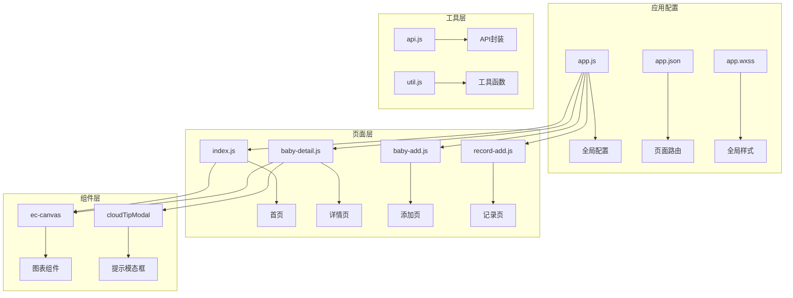

**图表来源**
- [miniprogram/app.js:1-56](file://miniprogram/app.js#L1-L56)
- [miniprogram/app.json:1-39](file://miniprogram/app.json#L1-L39)

**章节来源**
- [miniprogram/app.js:1-56](file://miniprogram/app.js#L1-L56)
- [miniprogram/app.json:1-39](file://miniprogram/app.json#L1-L39)
- [miniprogram/app.wxss:1-95](file://miniprogram/app.wxss#L1-L95)

## 核心组件

### 应用配置与主题系统

应用采用了统一的主题色彩系统，通过CSS变量实现了灵活的颜色管理：

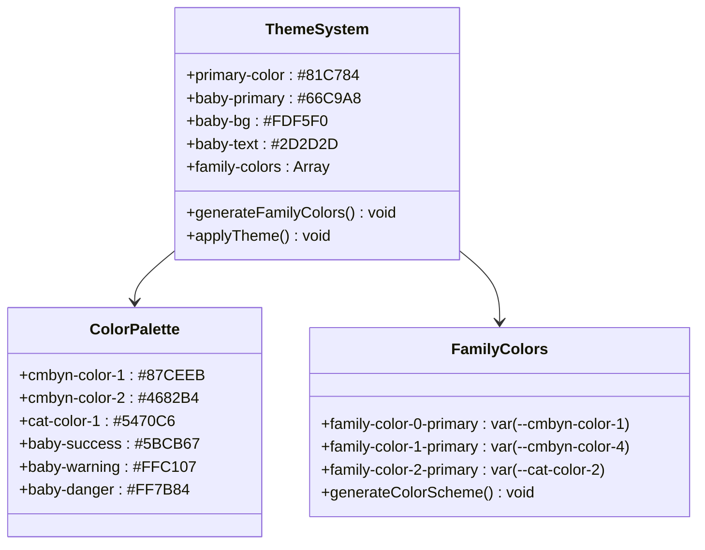

**图表来源**
- [miniprogram/app.wxss:1-95](file://miniprogram/app.wxss#L1-L95)

### 页面导航与布局

应用采用底部导航栏设计，提供清晰的页面层次结构：

| 页面 | 功能 | 主要特性 |
|------|------|----------|
| 首页 | 宝宝列表展示 | 卡片式布局、家庭颜色标识、批量数据加载 |
| 宝宝详情 | 成长记录查看 | 图表可视化、记录管理、权限控制 |
| 添加宝宝 | 新增宝宝信息 | 表单验证、家庭选择、出生信息录入 |
| 记录添加 | 成长数据录入 | 实时年龄计算、数据验证、权限检查 |

**章节来源**
- [miniprogram/app.json:16-35](file://miniprogram/app.json#L16-L35)
- [miniprogram/pages/index/index.js:1-160](file://miniprogram/pages/index/index.js#L1-L160)

## 架构概览

应用采用分层架构设计，各层职责明确，便于维护和扩展：

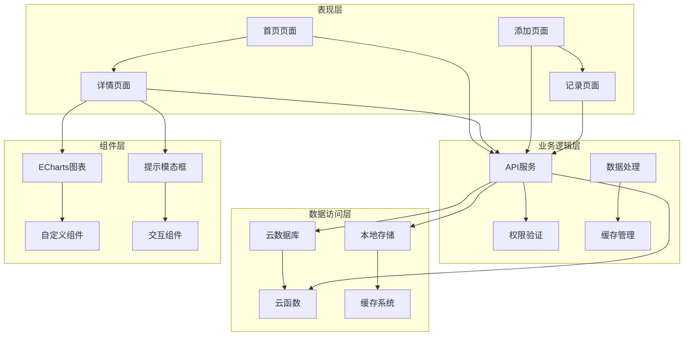

**图表来源**
- [miniprogram/utils/api.js:1-800](file://miniprogram/utils/api.js#L1-L800)
- [miniprogram/components/ec-canvas/ec-canvas.js:1-285](file://miniprogram/components/ec-canvas/ec-canvas.js#L1-L285)

## 详细组件分析

### 首页组件分析

首页采用卡片式布局设计，提供了优雅的视觉体验和流畅的交互效果：

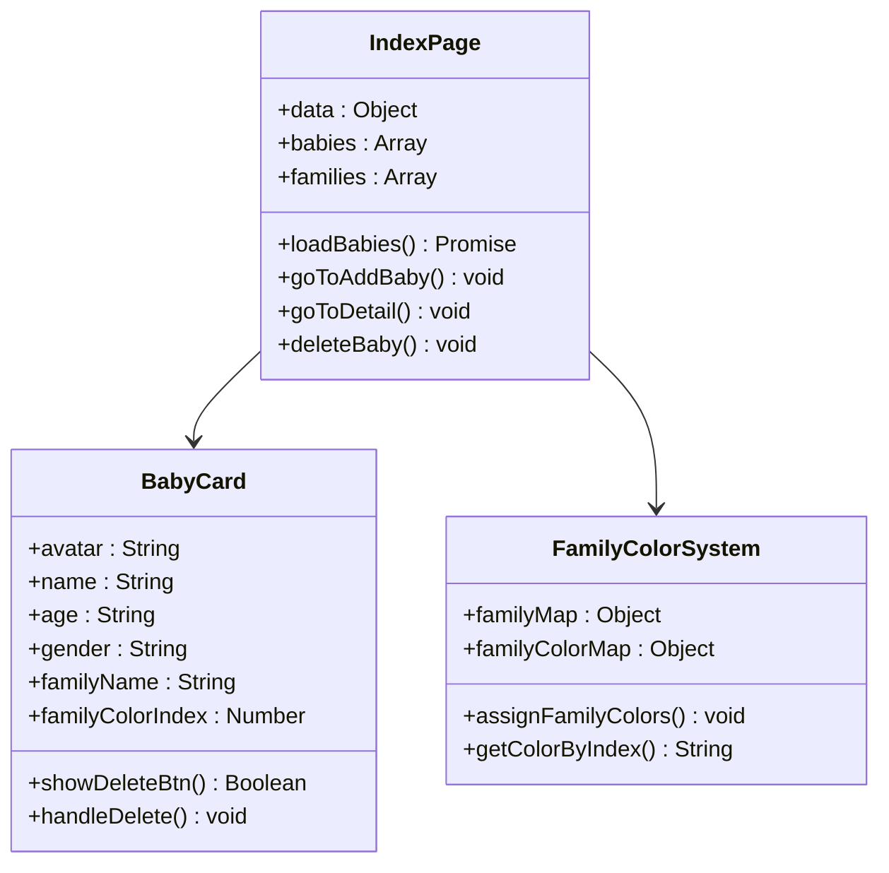

**图表来源**
- [miniprogram/pages/index/index.js:14-68](file://miniprogram/pages/index/index.js#L14-L68)
- [miniprogram/pages/index/index.wxss:218-269](file://miniprogram/pages/index/index.wxss#L218-L269)

#### 首页布局特点

首页采用了渐变背景和玻璃拟态设计：

- **渐变背景**：从浅绿色到米色的渐变效果
- **头部装饰**：动态浮动的圆形装饰元素
- **卡片设计**：圆角矩形卡片，带有阴影和边框
- **家庭颜色标识**：基于家庭ID的哈希算法生成唯一颜色

**章节来源**
- [miniprogram/pages/index/index.wxss:1-470](file://miniprogram/pages/index/index.wxss#L1-L470)

### 宝宝详情组件分析

详情页是应用的核心功能模块，集成了图表可视化和完整的数据管理：

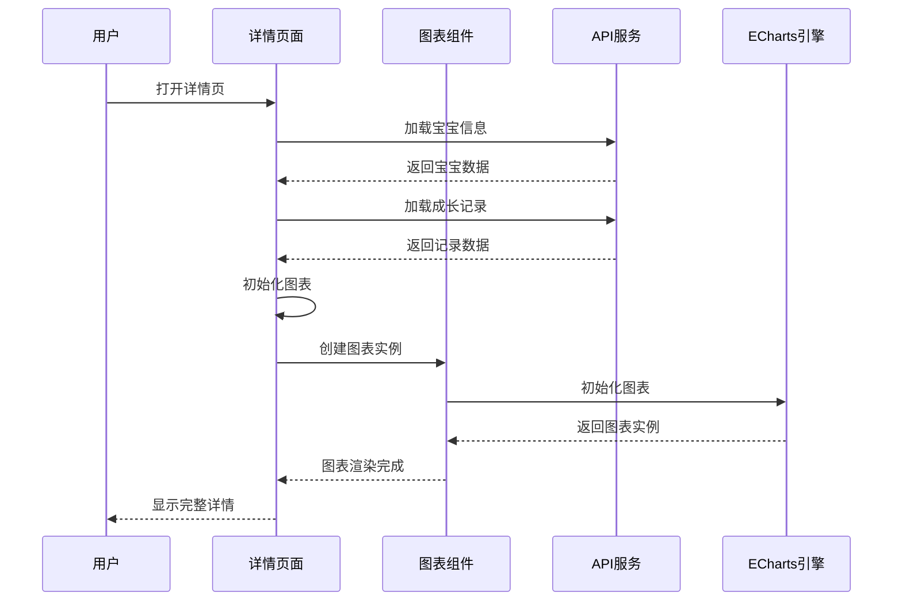

**图表来源**
- [miniprogram/pages/baby-detail/baby-detail.js:201-253](file://miniprogram/pages/baby-detail/baby-detail.js#L201-L253)

#### 图表功能特性

详情页集成了专业的成长曲线图表：

- **双轴图表**：同时显示身高和体重数据
- **标准曲线对比**：P3、P50、P97百分位标准曲线
- **交互控制**：支持缩放、平移、数据点悬停
- **响应式设计**：自适应不同屏幕尺寸

**章节来源**
- [miniprogram/pages/baby-detail/baby-detail.js:337-487](file://miniprogram/pages/baby-detail/baby-detail.js#L337-L487)

### ECharts图表组件

自定义的ECharts组件提供了完整的图表解决方案：

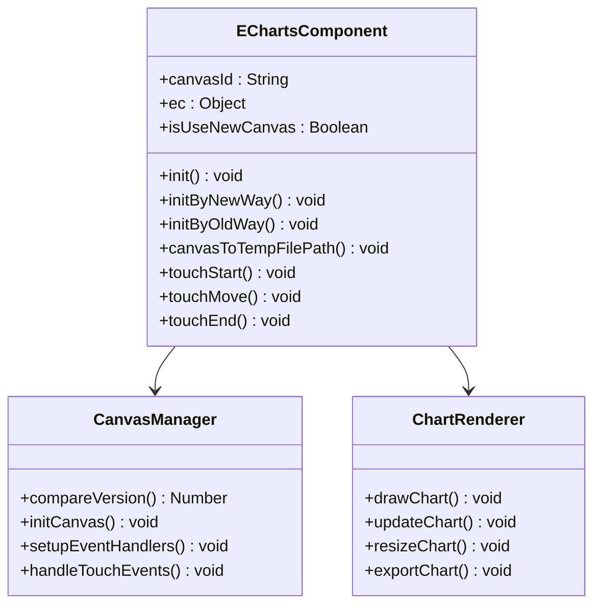

**图表来源**
- [miniprogram/components/ec-canvas/ec-canvas.js:31-275](file://miniprogram/components/ec-canvas/ec-canvas.js#L31-L275)

#### 性能优化策略

组件实现了多项性能优化：

- **版本检测**：自动适配新旧Canvas API
- **懒加载**：图表按需初始化
- **事件处理**：优化触摸事件响应
- **内存管理**：及时清理图表实例

**章节来源**
- [miniprogram/components/ec-canvas/ec-canvas.js:79-192](file://miniprogram/components/ec-canvas/ec-canvas.js#L79-L192)

### 表单验证与交互

应用实现了完善的表单验证和用户交互机制：

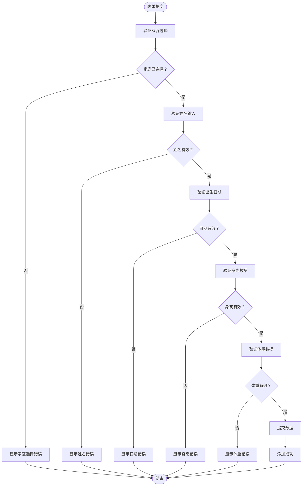

**图表来源**
- [miniprogram/pages/baby-add/baby-add.js:74-118](file://miniprogram/pages/baby-add/baby-add.js#L74-L118)

**章节来源**
- [miniprogram/pages/baby-add/baby-add.js:1-120](file://miniprogram/pages/baby-add/baby-add.js#L1-L120)

## UI增强功能

### 玻璃拟态设计系统

应用采用了先进的玻璃拟态设计，为用户提供了现代感十足的视觉体验：

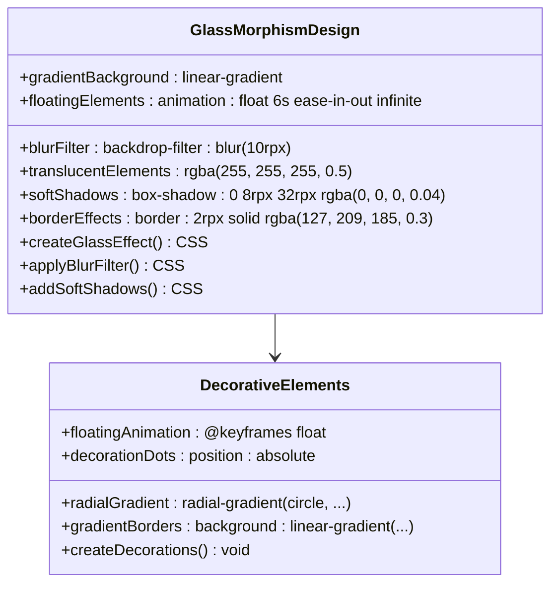

**图表来源**
- [miniprogram/pages/index/index.wxss:25-90](file://miniprogram/pages/index/index.wxss#L25-L90)
- [miniprogram/pages/baby-detail/baby-detail.wxss:49-93](file://miniprogram/pages/baby-detail/baby-detail.wxss#L49-L93)

#### 首页玻璃拟态实现

首页的玻璃拟态设计包括：

- **渐变背景**：从浅绿色到米色的柔和渐变
- **模糊滤镜**：使用backdrop-filter实现毛玻璃效果
- **装饰元素**：动态浮动的圆形装饰物
- **阴影系统**：多层次的阴影增强立体感

**章节来源**
- [miniprogram/pages/index/index.wxss:1-470](file://miniprogram/pages/index/index.wxss#L1-L470)

### 胶囊式导航系统

应用采用了创新的胶囊式导航设计，提供了直观的页面切换体验：

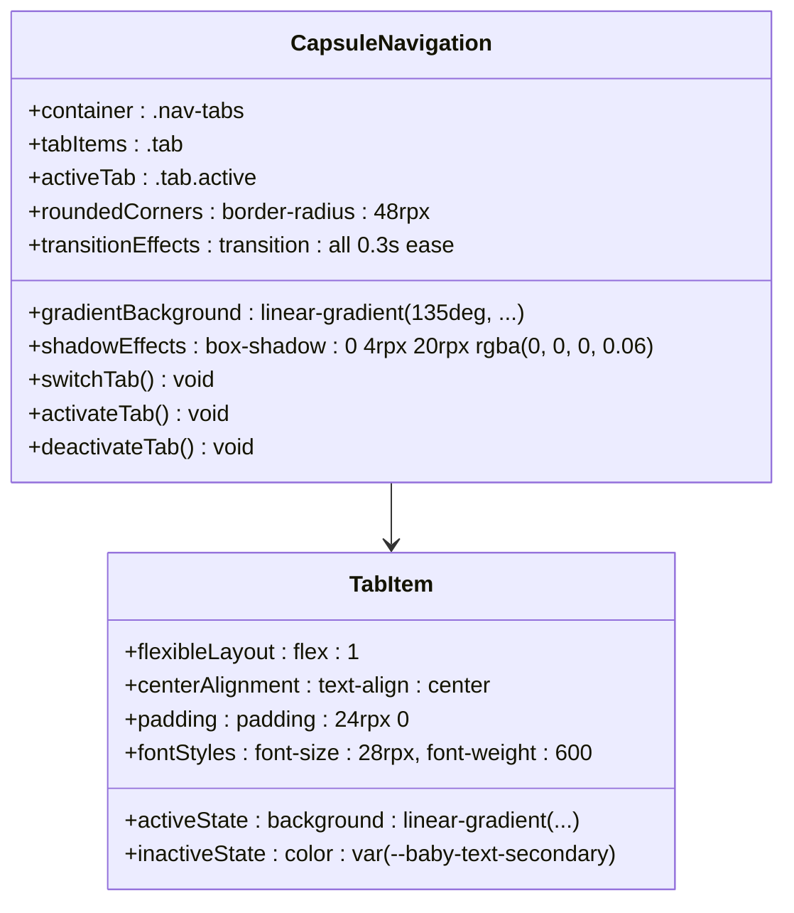

**图表来源**
- [miniprogram/pages/baby-detail/baby-detail.wxss:135-162](file://miniprogram/pages/baby-detail/baby-detail.wxss#L135-L162)

#### 导航系统特性

胶囊式导航具有以下特点：

- **圆角设计**：48rpx的圆角半径创造柔和外观
- **渐变背景**：激活状态使用渐变色彩
- **阴影效果**：提供层次感和深度
- **平滑过渡**：0.3秒的过渡动画
- **响应式布局**：flex布局适应不同屏幕

**章节来源**
- [miniprogram/pages/baby-detail/baby-detail.wxml:17-21](file://miniprogram/pages/baby-detail/baby-detail.wxml#L17-L21)

### 卡片式数据展示

应用广泛使用卡片式设计来展示宝宝信息和成长记录：

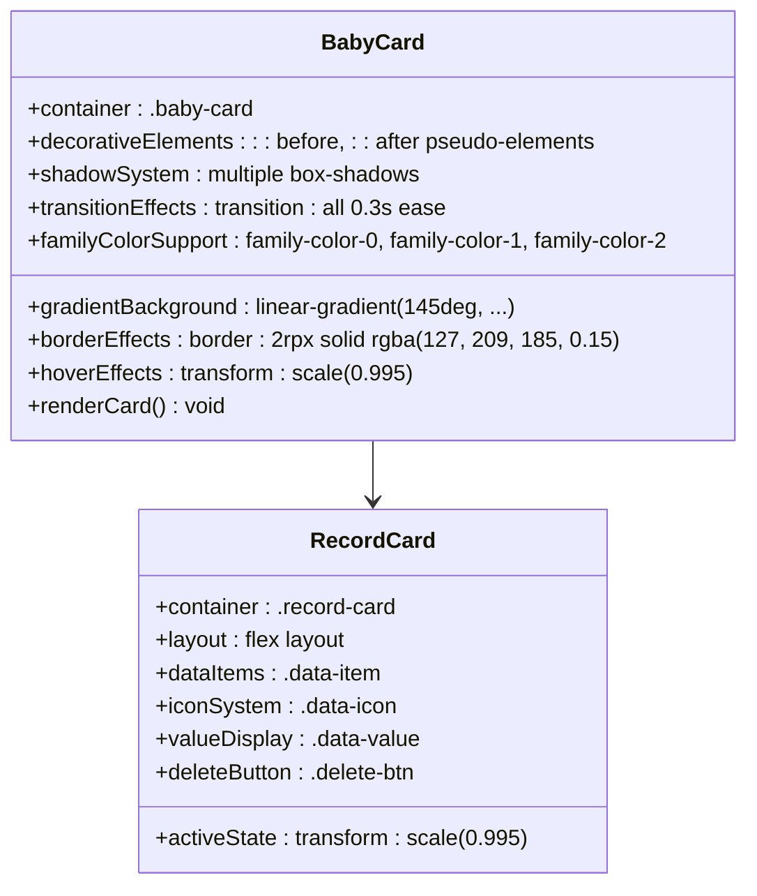

**图表来源**
- [miniprogram/pages/index/index.wxss:219-293](file://miniprogram/pages/index/index.wxss#L219-L293)
- [miniprogram/pages/baby-detail/baby-detail.wxss:210-228](file://miniprogram/pages/baby-detail/baby-detail.wxss#L210-L228)

#### 卡片设计要素

卡片式设计包含以下设计要素：

- **渐变背景**：多层渐变创造丰富色彩
- **装饰元素**：伪元素创建装饰线条和圆点
- **阴影系统**：多层次阴影增强立体感
- **边框效果**：半透明边框增加质感
- **过渡动画**：平滑的交互反馈
- **家族色彩**：支持三种不同的家族配色

**章节来源**
- [miniprogram/pages/index/index.wxml:24-47](file://miniprogram/pages/index/index.wxml#L24-L47)

### 弹窗交互系统

应用实现了现代化的弹窗交互系统，提供优雅的用户反馈：

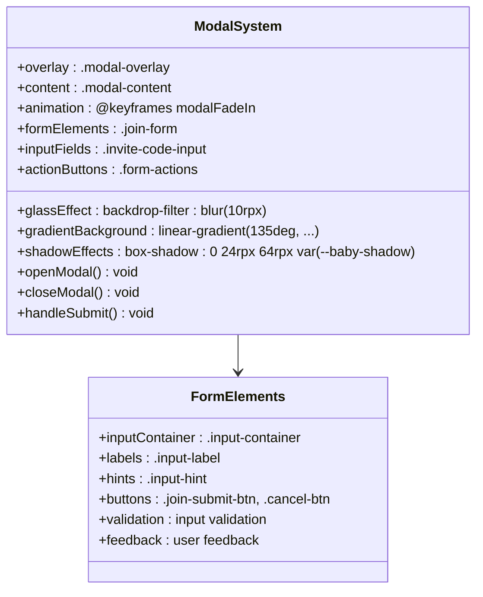

**图表来源**
- [miniprogram/pages/baby-detail/baby-detail.wxss:451-640](file://miniprogram/pages/baby-detail/baby-detail.wxss#L451-L640)

#### 弹窗设计特点

弹窗系统具有以下设计特点：

- **渐变背景**：使用渐变色彩创造视觉吸引力
- **模糊效果**：背景使用backdrop-filter实现模糊
- **动画过渡**：0.4秒的淡入动画
- **阴影系统**：多重阴影增强立体感
- **表单设计**：优雅的输入框和按钮设计
- **响应式布局**：适应不同屏幕尺寸

**章节来源**
- [miniprogram/pages/baby-detail/baby-detail.wxml:100-123](file://miniprogram/pages/baby-detail/baby-detail.wxml#L100-L123)

## 依赖关系分析

应用的依赖关系呈现清晰的分层结构：

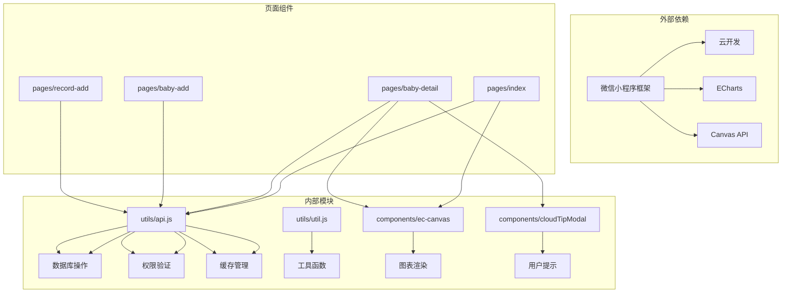

**图表来源**
- [miniprogram/utils/api.js:1-800](file://miniprogram/utils/api.js#L1-L800)
- [miniprogram/components/ec-canvas/ec-canvas.js:1-285](file://miniprogram/components/ec-canvas/ec-canvas.js#L1-L285)

**章节来源**
- [miniprogram/utils/api.js:57-94](file://miniprogram/utils/api.js#L57-L94)
- [miniprogram/utils/util.js:8-27](file://miniprogram/utils/util.js#L8-L27)

## 性能考虑

应用在多个层面实现了性能优化：

### 缓存策略
- **智能缓存**：家庭和宝宝数据缓存5分钟
- **条件缓存**：根据TTL时间戳判断缓存有效性
- **缓存清理**：操作完成后及时清理相关缓存

### 异步处理
- **并行加载**：首页同时加载宝宝列表和家庭信息
- **延迟初始化**：图表组件按需懒加载
- **防抖优化**：输入事件防抖处理

### 内存管理
- **组件销毁**：及时清理图表实例和事件监听
- **数据清理**：避免内存泄漏和重复数据存储

## 故障排除指南

### 常见问题及解决方案

| 问题类型 | 症状描述 | 解决方案 |
|----------|----------|----------|
| 登录失败 | 无法获取用户信息 | 检查云函数配置和网络连接 |
| 图表不显示 | 图表空白或加载失败 | 验证Canvas版本兼容性和数据格式 |
| 权限错误 | 操作被拒绝 | 确认用户在家庭中的角色权限 |
| 数据同步 | 数据不同步 | 清除缓存或等待缓存过期 |

### 调试技巧

1. **日志输出**：使用console.log跟踪异步操作
2. **状态检查**：验证全局数据状态和组件生命周期
3. **网络监控**：检查API调用和错误响应
4. **性能分析**：使用微信开发者工具性能面板

**章节来源**
- [miniprogram/pages/baby-detail/baby-detail.js:117-158](file://miniprogram/pages/baby-detail/baby-detail.js#L117-L158)
- [miniprogram/utils/api.js:129-164](file://miniprogram/utils/api.js#L129-L164)

## 结论

这个宝宝成长追踪应用展现了现代小程序开发的最佳实践，通过精心设计的UI组件和优化的用户体验，为用户提供了专业而友好的育儿助手。应用的主要优势包括：

- **优秀的视觉设计**：采用渐变色彩和现代化布局
- **强大的功能集成**：图表可视化和数据管理
- **良好的性能表现**：缓存策略和异步处理
- **完善的权限控制**：基于角色的访问管理
- **优雅的交互体验**：流畅的动画和响应式设计
- **先进的UI技术**：玻璃拟态、胶囊式导航、卡片式设计
- **现代化的交互系统**：弹窗设计和表单验证

未来可以考虑的功能增强方向：
- 添加更多图表类型和可视化选项
- 实现离线数据同步功能
- 增强个性化定制选项
- 优化移动端特定功能
- 扩展UI设计系统到更多页面