# 业务逻辑云函数

<cite>
**本文档引用的文件**
- [cloudfunctions/login/index.js](file://cloudfunctions/login/index.js)
- [cloudfunctions/sendFeedbackEmail/index.js](file://cloudfunctions/sendFeedbackEmail/index.js)
- [miniprogram/utils/api.js](file://miniprogram/utils/api.js)
- [miniprogram/pages/family/family.js](file://miniprogram/pages/family/family.js)
- [miniprogram/pages/baby-add/baby-add.js](file://miniprogram/pages/baby-add/baby-add.js)
- [miniprogram/pages/baby-detail/baby-detail.js](file://miniprogram/pages/baby-detail/baby-detail.js)
- [miniprogram/pages/record-add/record-add.js](file://miniprogram/pages/record-add/record-add.js)
- [miniprogram/app.js](file://miniprogram/app.js)
- [cloudfunctions/login/package.json](file://cloudfunctions/login/package.json)
- [cloudfunctions/sendFeedbackEmail/package.json](file://cloudfunctions/sendFeedbackEmail/package.json)
</cite>

## 目录
1. [简介](#简介)
2. [项目结构](#项目结构)
3. [核心组件](#核心组件)
4. [架构总览](#架构总览)
5. [详细组件分析](#详细组件分析)
6. [依赖分析](#依赖分析)
7. [性能考虑](#性能考虑)
8. [故障排除指南](#故障排除指南)
9. [结论](#结论)
10. [附录](#附录)

## 简介
本项目为“宝宝助手”微信小程序，围绕家庭管理、宝宝管理与记录管理三大核心业务，通过云函数实现统一的业务逻辑与权限控制。云函数承担用户登录、家庭创建与成员管理、邀请码系统、宝宝信息维护、记录增删改查以及权限校验等职责，确保数据一致性与安全性。

## 项目结构
项目采用“小程序前端 + 云函数后端”的分层架构：
- 小程序前端负责用户交互与调用云函数
- 云函数负责业务逻辑、权限校验与数据库操作
- 数据库存储家庭、宝宝、记录、邀请码、用户等实体

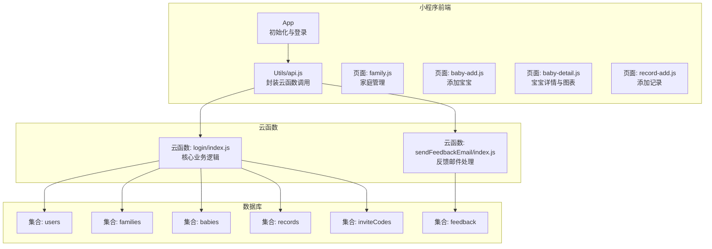

**图表来源**
- [cloudfunctions/login/index.js:22-800](file://cloudfunctions/login/index.js#L22-L800)
- [cloudfunctions/sendFeedbackEmail/index.js:7-21](file://cloudfunctions/sendFeedbackEmail/index.js#L7-L21)
- [miniprogram/utils/api.js:436-878](file://miniprogram/utils/api.js#L436-L878)

**章节来源**
- [cloudfunctions/login/index.js:22-800](file://cloudfunctions/login/index.js#L22-L800)
- [cloudfunctions/sendFeedbackEmail/index.js:7-21](file://cloudfunctions/sendFeedbackEmail/index.js#L7-L21)
- [miniprogram/utils/api.js:436-878](file://miniprogram/utils/api.js#L436-L878)

## 核心组件
- 登录与用户管理：登录态获取、用户信息持久化、最后登录时间更新
- 家庭管理：创建家庭、修改家庭名称、成员管理（权限变更、移除）、退出家庭
- 邀请码系统：生成邀请码、使用邀请码加入家庭、清理过期邀请码
- 宝宝管理：添加宝宝、更新宝宝姓名、删除宝宝（事务保障）
- 记录管理：添加记录、查看记录、删除记录（权限校验）
- 权限校验：基于家庭成员权限的细粒度访问控制

**章节来源**
- [cloudfunctions/login/index.js:22-800](file://cloudfunctions/login/index.js#L22-L800)
- [miniprogram/utils/api.js:782-878](file://miniprogram/utils/api.js#L782-L878)

## 架构总览
云函数作为统一入口，接收小程序端请求，执行业务逻辑并访问数据库；小程序端通过封装的 API 方法调用云函数，避免直接访问数据库。

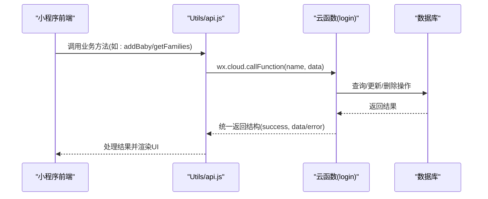

**图表来源**
- [miniprogram/utils/api.js:149-240](file://miniprogram/utils/api.js#L149-L240)
- [cloudfunctions/login/index.js:22-800](file://cloudfunctions/login/index.js#L22-L800)

## 详细组件分析

### 登录与用户管理
- 功能要点
  - 通过 wx.login 获取 code，调用云函数 login 完成登录态校验
  - 若用户首次登录，自动生成随机昵称并创建用户记录
  - 更新用户最后登录时间
- 参数与返回
  - 请求参数: code
  - 返回: { success: true, userInfo }
- 异常处理
  - 登录失败、获取 code 失败均记录日志并返回错误

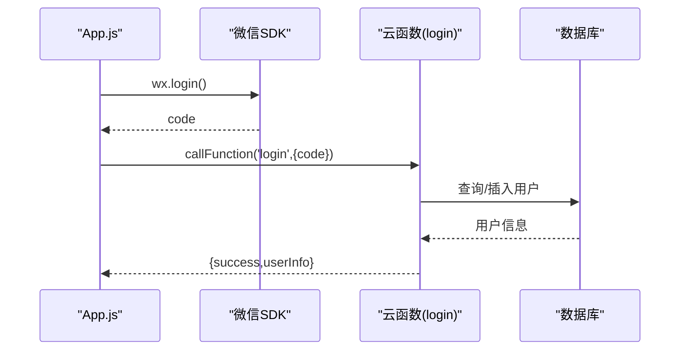

**图表来源**
- [miniprogram/app.js:29-54](file://miniprogram/app.js#L29-L54)
- [cloudfunctions/login/index.js:762-800](file://cloudfunctions/login/index.js#L762-L800)

**章节来源**
- [miniprogram/app.js:29-54](file://miniprogram/app.js#L29-L54)
- [cloudfunctions/login/index.js:762-800](file://cloudfunctions/login/index.js#L762-L800)

### 家庭管理
- 家庭创建
  - 校验名称长度、用户创建上限、加入家庭数量上限
  - 自动分配颜色索引，避免冲突
  - 返回新建家庭信息
- 修改家庭名称
  - 仅一级助教可操作
- 成员管理
  - 权限变更：仅一级助教可修改他人权限，且不可修改创建者
  - 移除成员：仅一级助教可移除非创建者
  - 退出家庭：创建者删除家庭及所有宝宝与记录；非创建者仅移除成员
- 参数与返回
  - createFamily: familyName, userInfo → { success, family }
  - updateFamilyName: familyId, newName, openid → { success }
  - updateMemberPermission: familyId, memberOpenid, permission, openid → { success }
  - removeFamilyMember: familyId, memberOpenid, openid → { success }
  - leaveFamily: familyId → { success }

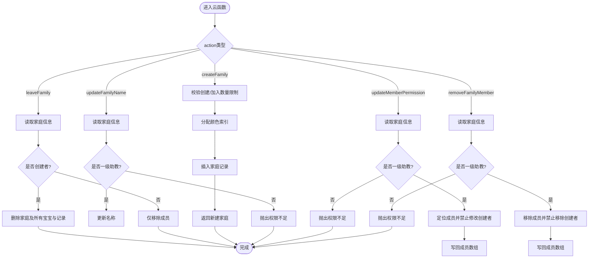

**图表来源**
- [cloudfunctions/login/index.js:94-422](file://cloudfunctions/login/index.js#L94-L422)

**章节来源**
- [cloudfunctions/login/index.js:94-422](file://cloudfunctions/login/index.js#L94-L422)

### 邀请码系统
- 功能要点
  - 仅一级助教与二级助教可创建邀请码
  - 邀请码有效期 12 小时，异步清理过期邀请码
  - 使用邀请码加入家庭，自动同步用户昵称与头像
- 参数与返回
  - createInviteCode: familyId, memberType → { success, inviteCode }
  - joinFamily: inviteCode, memberInfo → { success }
  - cleanExpiredInviteCodes → { success, deletedCount }

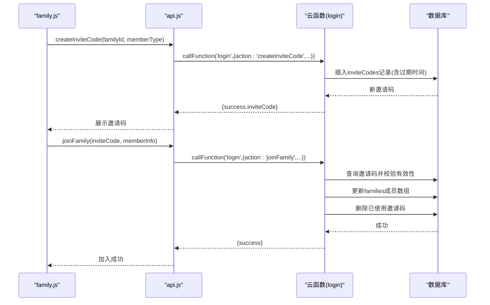

**图表来源**
- [miniprogram/pages/family/family.js:237-277](file://miniprogram/pages/family/family.js#L237-L277)
- [cloudfunctions/login/index.js:658-760](file://cloudfunctions/login/index.js#L658-L760)

**章节来源**
- [miniprogram/pages/family/family.js:237-277](file://miniprogram/pages/family/family.js#L237-L277)
- [cloudfunctions/login/index.js:658-760](file://cloudfunctions/login/index.js#L658-L760)

### 宝宝管理
- 添加宝宝
  - 小程序端校验家庭数量上限与必填字段
  - 自动创建出生记录（身高、体重、出生日期）
- 更新宝宝姓名
  - 仅一级助教可操作
- 删除宝宝
  - 使用事务确保原子性：删除宝宝与关联记录
- 参数与返回
  - addBaby: 宝宝信息 → 宝宝对象
  - updateBabyName: babyId, name → { success }
  - deleteBaby: babyId → { success }

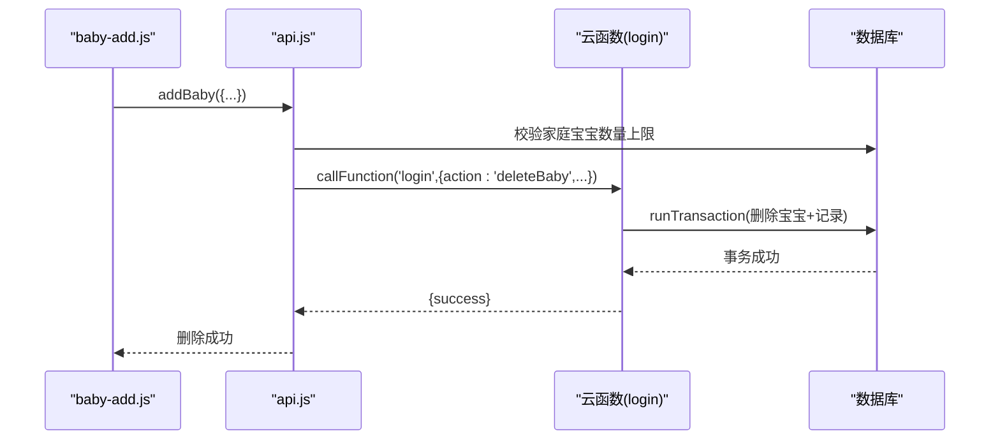

**图表来源**
- [miniprogram/pages/baby-add/baby-add.js:74-118](file://miniprogram/pages/baby-add/baby-add.js#L74-L118)
- [cloudfunctions/login/index.js:482-510](file://cloudfunctions/login/index.js#L482-L510)

**章节来源**
- [miniprogram/pages/baby-add/baby-add.js:74-118](file://miniprogram/pages/baby-add/baby-add.js#L74-L118)
- [cloudfunctions/login/index.js:482-510](file://cloudfunctions/login/index.js#L482-L510)

### 记录管理
- 添加记录
  - 校验权限（一级助教、二级助教）
  - 计算月龄（四舍五入至半年）
- 查看记录
  - 仅家庭成员可查看
- 删除记录
  - 一级助教可删除任意记录；二级助教仅可删除自己录入的记录
- 参数与返回
  - addRecord: recordInfo → 记录对象
  - getRecordsByBabyId: babyId → [记录]
  - getRecordById: recordId → 记录
  - deleteRecord: recordId → { success }

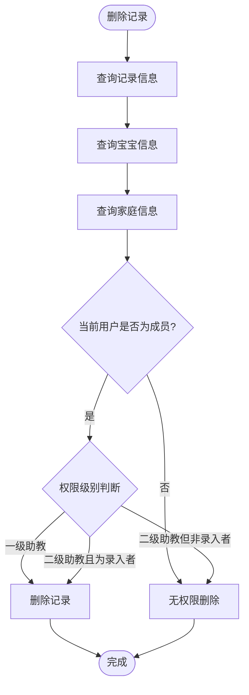

**图表来源**
- [cloudfunctions/login/index.js:512-554](file://cloudfunctions/login/index.js#L512-L554)

**章节来源**
- [cloudfunctions/login/index.js:512-554](file://cloudfunctions/login/index.js#L512-L554)

### 权限校验机制
- 权限层级
  - viewer（围观吃瓜）
  - caretaker（二级助教）
  - guardian（一级助教）
- 校验策略
  - 通过 api.js 的 checkPermission 统一校验
  - 支持按宝宝或按家庭维度校验
  - 在 UI 侧拦截敏感操作（如添加记录、修改姓名）

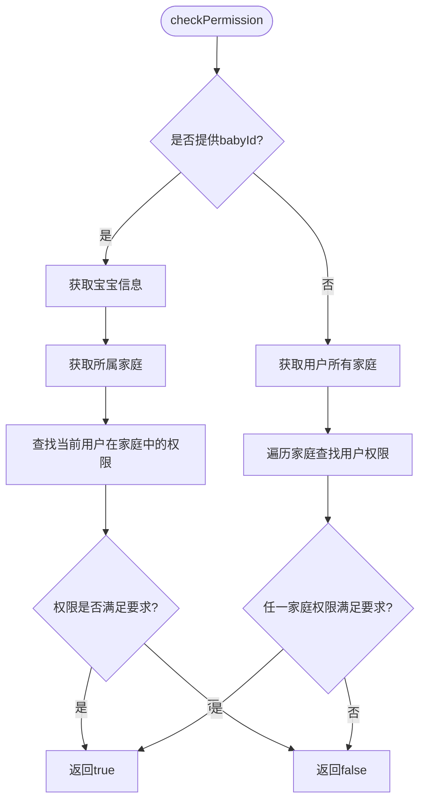

**图表来源**
- [miniprogram/utils/api.js:782-852](file://miniprogram/utils/api.js#L782-L852)

**章节来源**
- [miniprogram/utils/api.js:782-852](file://miniprogram/utils/api.js#L782-L852)

### 数据一致性与事务处理
- 删除宝宝采用数据库事务，确保“删除宝宝 + 删除关联记录”原子性
- 删除记录前严格校验用户权限，防止越权删除

**章节来源**
- [cloudfunctions/login/index.js:482-510](file://cloudfunctions/login/index.js#L482-L510)
- [cloudfunctions/login/index.js:512-554](file://cloudfunctions/login/index.js#L512-L554)

### 复杂业务场景
- 家庭成员权限变更
  - 仅一级助教可操作
  - 不允许修改创建者权限
- 宝宝信息更新
  - 姓名更新仅一级助教可操作
- 记录删除验证
  - 一级助教可删除任意记录
  - 二级助教仅可删除自己录入的记录

**章节来源**
- [cloudfunctions/login/index.js:186-225](file://cloudfunctions/login/index.js#L186-L225)
- [cloudfunctions/login/index.js:701-738](file://cloudfunctions/login/index.js#L701-L738)
- [cloudfunctions/login/index.js:512-554](file://cloudfunctions/login/index.js#L512-L554)

## 依赖分析
- 云函数依赖
  - wx-server-sdk：微信云开发 SDK
  - nodemailer（sendFeedbackEmail）：邮件发送（当前云函数暂不实际发送邮件）
- 小程序依赖
  - 通过 wx.cloud 调用云函数
  - 通过 wx.cloud.database 访问数据库（部分场景绕过权限限制）

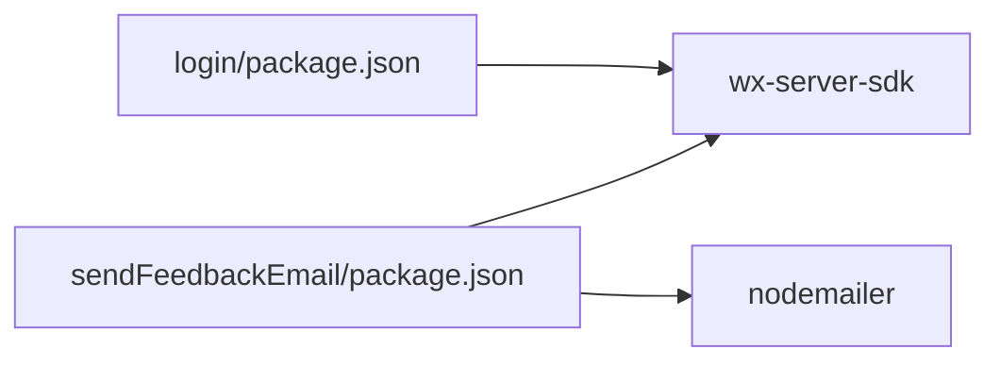

**图表来源**
- [cloudfunctions/login/package.json:12-14](file://cloudfunctions/login/package.json#L12-L14)
- [cloudfunctions/sendFeedbackEmail/package.json:9-12](file://cloudfunctions/sendFeedbackEmail/package.json#L9-L12)

**章节来源**
- [cloudfunctions/login/package.json:12-14](file://cloudfunctions/login/package.json#L12-L14)
- [cloudfunctions/sendFeedbackEmail/package.json:9-12](file://cloudfunctions/sendFeedbackEmail/package.json#L9-L12)

## 性能考虑
- 云函数冷启动优化
  - 合理设置运行时与超时时间
  - 避免在函数内进行重型计算
- 数据库查询优化
  - 使用索引字段进行查询（如 openid、familyId）
  - 批量操作时使用 in 查询减少往返
- 权限校验前置
  - 在小程序端提前校验权限，减少无效调用
- 异步清理任务
  - 邀请码过期清理采用异步方式，不阻塞主流程

[本节为通用指导，无需特定文件引用]

## 故障排除指南
- 登录失败
  - 检查 wx.login 是否成功获取 code
  - 查看云函数日志与返回错误信息
- 家庭创建失败
  - 检查名称长度与用户创建/加入数量限制
- 权限不足
  - 确认当前用户在家庭中的权限层级
  - 检查 UI 是否正确拦截敏感操作
- 删除失败
  - 确认删除权限（一级助教或二级助教且为录入者）
  - 查看事务执行日志

**章节来源**
- [cloudfunctions/login/index.js:94-121](file://cloudfunctions/login/index.js#L94-L121)
- [cloudfunctions/login/index.js:512-554](file://cloudfunctions/login/index.js#L512-L554)
- [miniprogram/utils/api.js:782-852](file://miniprogram/utils/api.js#L782-L852)

## 结论
本项目通过云函数集中实现家庭、宝宝、记录等核心业务逻辑，并结合小程序端的权限校验与 UI 拦截，构建了清晰的权限体系与数据一致性保障。建议后续持续优化冷启动与数据库查询性能，完善异常监控与日志记录，提升用户体验与系统稳定性。

[本节为总结性内容，无需特定文件引用]

## 附录

### 业务流程图：添加宝宝
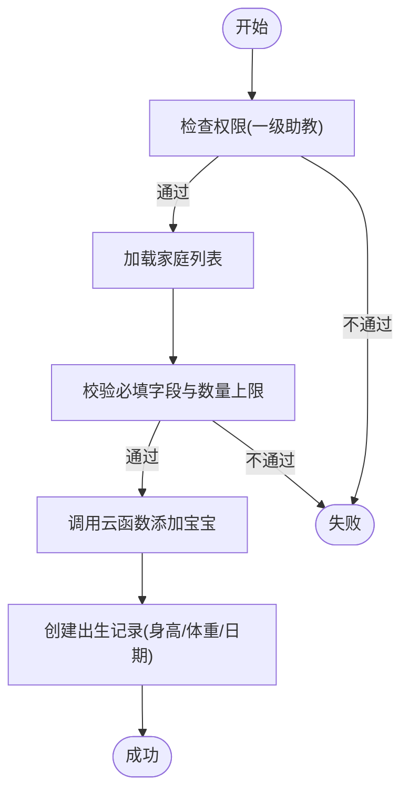

**图表来源**
- [miniprogram/pages/baby-add/baby-add.js:20-118](file://miniprogram/pages/baby-add/baby-add.js#L20-L118)
- [miniprogram/utils/api.js:149-210](file://miniprogram/utils/api.js#L149-L210)

### 业务流程图：删除记录
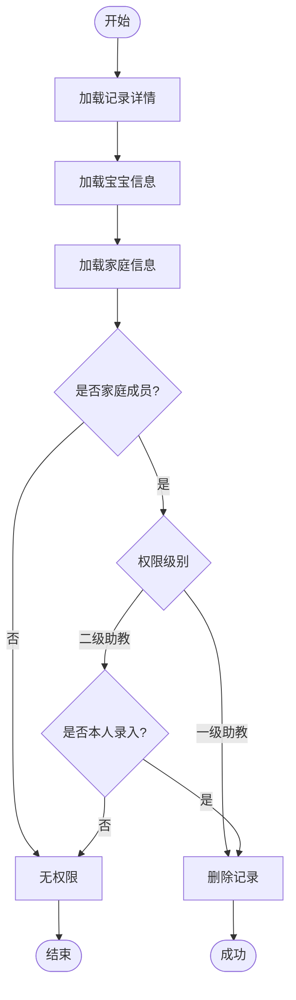

**图表来源**
- [cloudfunctions/login/index.js:512-554](file://cloudfunctions/login/index.js#L512-L554)