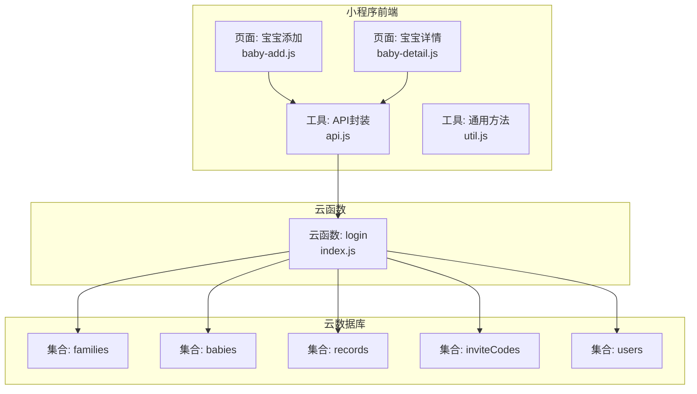
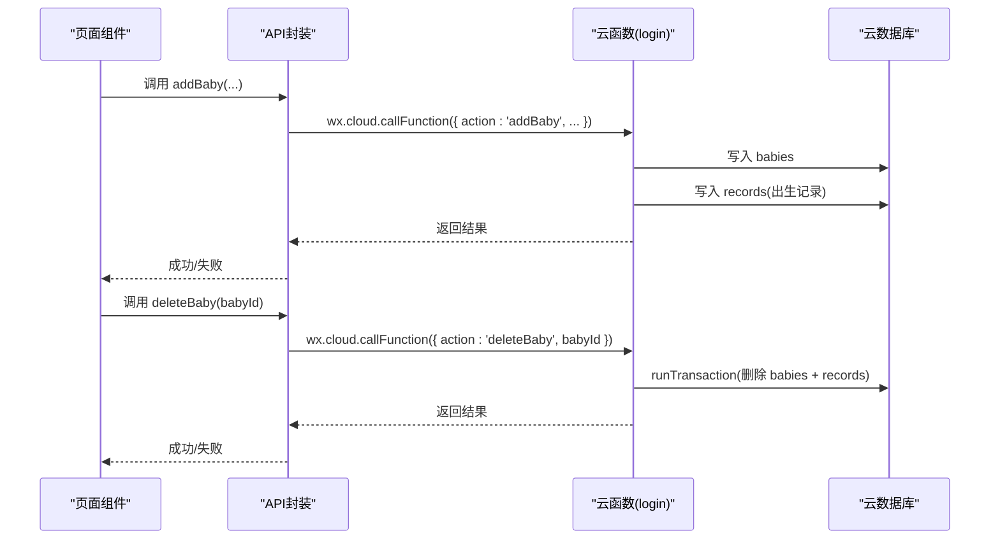
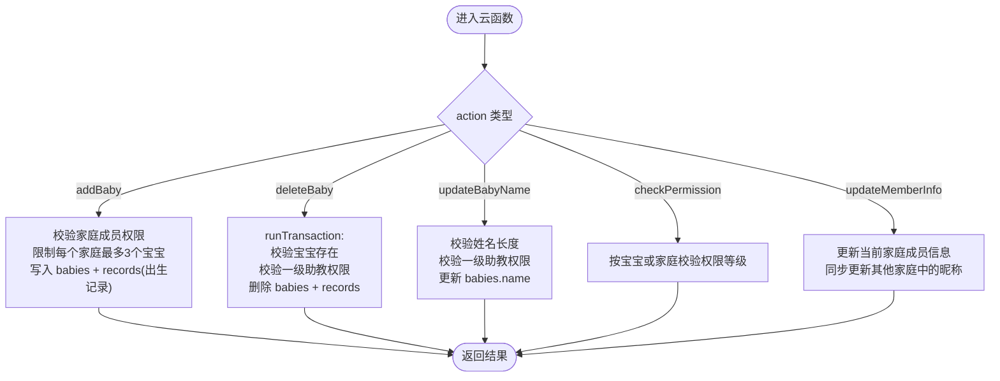
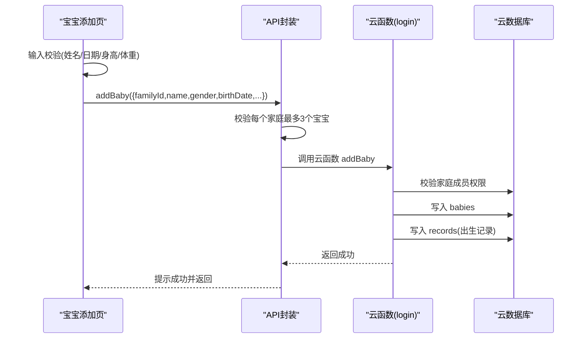
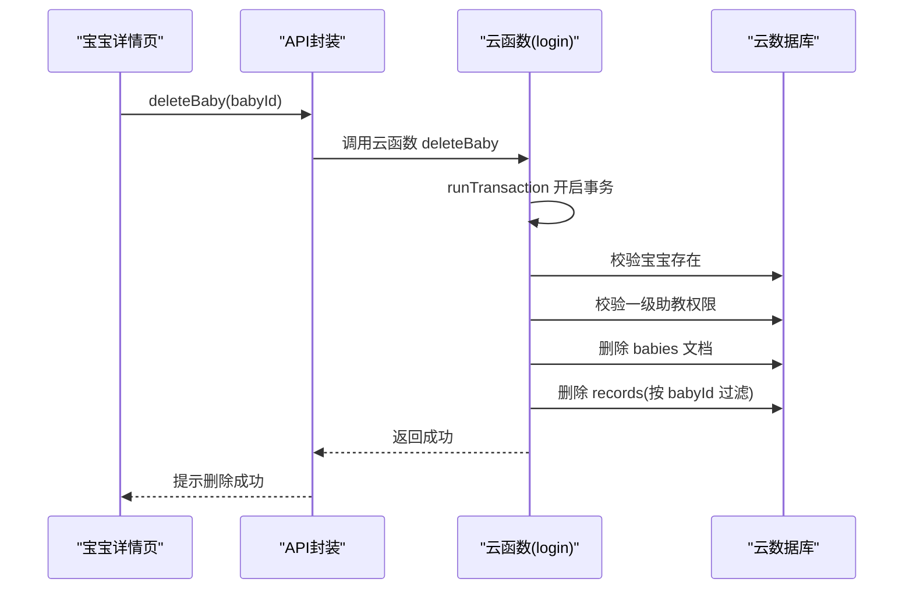
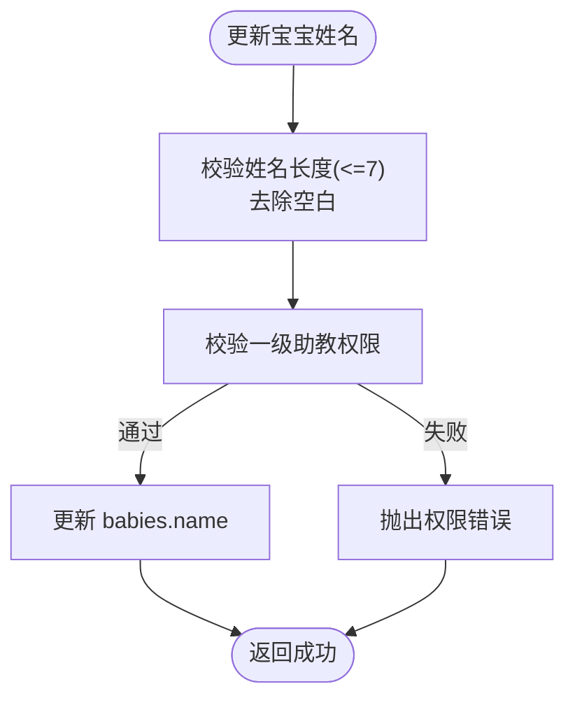
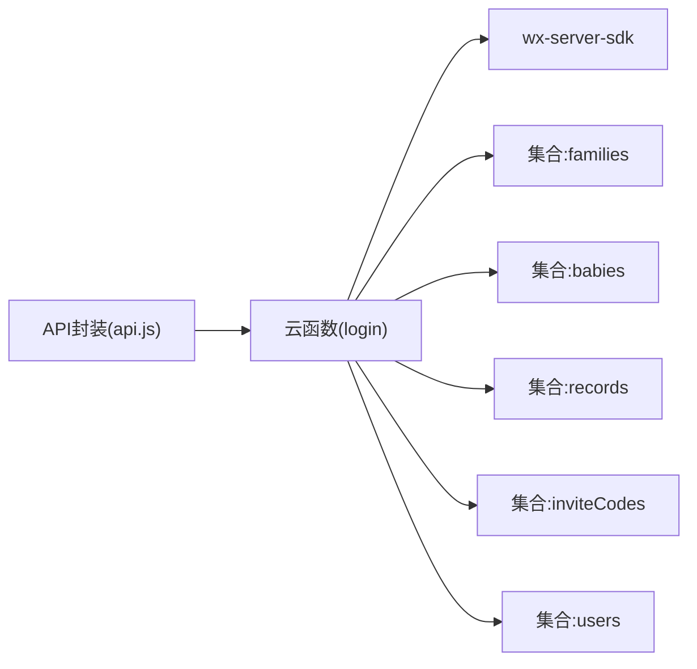

# 宝宝管理

<cite>
**本文引用的文件**
- [cloudfunctions/login/index.js](file://cloudfunctions/login/index.js)
- [miniprogram/utils/api.js](file://miniprogram/utils/api.js)
- [miniprogram/pages/baby-add/baby-add.js](file://miniprogram/pages/baby-add/baby-add.js)
- [miniprogram/pages/baby-detail/baby-detail.js](file://miniprogram/pages/baby-detail/baby-detail.js)
- [miniprogram/utils/util.js](file://miniprogram/utils/util.js)
- [miniprogram/app.json](file://miniprogram/app.json)
- [cloudfunctions/sendFeedbackEmail/index.js](file://cloudfunctions/sendFeedbackEmail/index.js)
- [cloudfunctions/login/package.json](file://cloudfunctions/login/package.json)
</cite>

## 目录
1. [简介](#简介)
2. [项目结构](#项目结构)
3. [核心组件](#核心组件)
4. [架构总览](#架构总览)
5. [详细组件分析](#详细组件分析)
6. [依赖关系分析](#依赖关系分析)
7. [性能考量](#性能考量)
8. [故障排查指南](#故障排查指南)
9. [结论](#结论)
10. [附录](#附录)

## 简介
本技术文档聚焦于“宝宝管理”功能，围绕云函数实现的宝宝信息管理、删除与更新等核心能力，系统阐述：
- 宝宝创建时的验证规则、家庭权限检查、数据完整性保证
- 宝宝删除的复杂逻辑（事务处理、级联删除、权限验证）
- 宝宝信息更新流程（姓名验证、权限控制、数据同步）
- 完整的API参数说明、数据验证规则、异常处理策略
- 最佳实践、数据安全考虑、性能优化建议
- 业务流程图与数据流转说明，帮助开发者理解宝宝管理的完整生命周期

## 项目结构
该项目采用“小程序前端 + 微信云开发云函数”的分层架构：
- 小程序端负责UI交互与调用云函数
- 云函数负责业务逻辑、权限校验、跨集合事务与数据一致性保障
- 数据模型涉及 families（家庭）、babies（宝宝）、records（成长记录）、inviteCodes（邀请码）、users（用户）

图表来源
- [miniprogram/pages/baby-add/baby-add.js:1-120](file://miniprogram/pages/baby-add/baby-add.js#L1-L120)
- [miniprogram/pages/baby-detail/baby-detail.js:1-691](file://miniprogram/pages/baby-detail/baby-detail.js#L1-L691)
- [miniprogram/utils/api.js:1-879](file://miniprogram/utils/api.js#L1-L879)
- [cloudfunctions/login/index.js:1-814](file://cloudfunctions/login/index.js#L1-L814)

章节来源
- [miniprogram/app.json:1-39](file://miniprogram/app.json#L1-L39)

## 核心组件
- 云函数 login：统一承载宝宝管理、家庭管理、记录管理、权限校验等业务逻辑，通过事务保证删除等关键操作的数据一致性。
- 小程序 API 封装：对云函数进行统一封装，提供 addBaby、deleteBaby、updateBabyName、getRecordsByBabyId 等方法，同时在部分场景下绕过数据库权限限制，通过云函数执行。
- 页面组件：宝宝添加页与宝宝详情页分别负责输入校验、提交创建、展示数据与图表、权限控制与交互。

章节来源
- [cloudfunctions/login/index.js:1-814](file://cloudfunctions/login/index.js#L1-L814)
- [miniprogram/utils/api.js:1-879](file://miniprogram/utils/api.js#L1-L879)
- [miniprogram/pages/baby-add/baby-add.js:1-120](file://miniprogram/pages/baby-add/baby-add.js#L1-L120)
- [miniprogram/pages/baby-detail/baby-detail.js:1-691](file://miniprogram/pages/baby-detail/baby-detail.js#L1-L691)

## 架构总览
整体调用链路如下：
- 小程序页面通过 API 工具调用云函数
- 云函数根据 action 参数路由到具体业务分支
- 云函数在必要时使用事务处理跨集合删除
- 云函数在部分场景下进行权限校验与数据同步

图表来源
- [miniprogram/utils/api.js:149-240](file://miniprogram/utils/api.js#L149-L240)
- [cloudfunctions/login/index.js:482-510](file://cloudfunctions/login/index.js#L482-L510)

## 详细组件分析

### 云函数 login：宝宝管理核心实现
云函数以 action 字段作为路由开关，集中处理以下关键能力：
- 宝宝创建：校验家庭成员权限、限制每个家庭最多3个宝宝、写入出生记录
- 宝宝删除：事务删除宝宝及其所有成长记录，严格校验一级助教权限
- 宝宝信息更新：姓名长度校验、权限校验（仅一级助教）
- 权限校验：checkPermission 支持按宝宝或按家庭维度校验 viewer/caretaker/guardian 权限
- 数据同步：更新成员信息时同步更新用户在其他家庭中的昵称

图表来源
- [cloudfunctions/login/index.js:94-151](file://cloudfunctions/login/index.js#L94-L151)
- [cloudfunctions/login/index.js:482-510](file://cloudfunctions/login/index.js#L482-L510)
- [cloudfunctions/login/index.js:701-738](file://cloudfunctions/login/index.js#L701-L738)
- [cloudfunctions/login/index.js:424-480](file://cloudfunctions/login/index.js#L424-L480)

章节来源
- [cloudfunctions/login/index.js:94-151](file://cloudfunctions/login/index.js#L94-L151)
- [cloudfunctions/login/index.js:482-510](file://cloudfunctions/login/index.js#L482-L510)
- [cloudfunctions/login/index.js:701-738](file://cloudfunctions/login/index.js#L701-L738)
- [cloudfunctions/login/index.js:424-480](file://cloudfunctions/login/index.js#L424-L480)

### 宝宝创建流程（含验证与数据完整性）
- 前端页面在提交前进行基础字段校验（家庭选择、姓名非空、出生日期、身高体重数值有效性）
- API 层在云函数外侧再次校验家庭成员数量上限（每个家庭最多3个宝宝），避免越权
- 云函数侧进一步校验用户是否为家庭成员，确保创建行为合法
- 创建成功后，自动写入一条出生记录，保证数据完整性

图表来源
- [miniprogram/pages/baby-add/baby-add.js:74-118](file://miniprogram/pages/baby-add/baby-add.js#L74-L118)
- [miniprogram/utils/api.js:149-210](file://miniprogram/utils/api.js#L149-L210)
- [cloudfunctions/login/index.js:94-151](file://cloudfunctions/login/index.js#L94-L151)

章节来源
- [miniprogram/pages/baby-add/baby-add.js:74-118](file://miniprogram/pages/baby-add/baby-add.js#L74-L118)
- [miniprogram/utils/api.js:149-210](file://miniprogram/utils/api.js#L149-L210)
- [cloudfunctions/login/index.js:94-151](file://cloudfunctions/login/index.js#L94-L151)

### 宝宝删除流程（事务、级联删除、权限）
- 云函数使用 runTransaction 确保删除操作的原子性
- 删除顺序：先删除宝宝文档，再删除其关联的所有成长记录
- 权限要求：仅宝宝所属家庭的一级助教可执行删除
- 若为家庭创建者主动退出家庭，会级联删除该家庭下的所有宝宝与其记录

图表来源
- [miniprogram/utils/api.js:212-240](file://miniprogram/utils/api.js#L212-L240)
- [cloudfunctions/login/index.js:482-510](file://cloudfunctions/login/index.js#L482-L510)

章节来源
- [miniprogram/utils/api.js:212-240](file://miniprogram/utils/api.js#L212-L240)
- [cloudfunctions/login/index.js:482-510](file://cloudfunctions/login/index.js#L482-L510)

### 宝宝信息更新流程（姓名、权限、同步）
- 姓名更新：仅一级助教可操作；云函数侧校验姓名长度（最多7个字符），并去除首尾空白
- 成员信息同步：当用户在某家庭更新昵称时，云函数会同步更新其在其他家庭中的昵称，保持一致性
- 权限校验：checkPermission 支持按宝宝或按家庭维度校验 viewer/caretaker/guardian 权限等级

图表来源
- [cloudfunctions/login/index.js:701-738](file://cloudfunctions/login/index.js#L701-L738)
- [cloudfunctions/login/index.js:424-480](file://cloudfunctions/login/index.js#L424-L480)

章节来源
- [cloudfunctions/login/index.js:701-738](file://cloudfunctions/login/index.js#L701-L738)
- [cloudfunctions/login/index.js:424-480](file://cloudfunctions/login/index.js#L424-L480)

### 权限模型与校验
- 权限等级：viewer（访客）< caretaker（二级助教）< guardian（一级助教）
- 按宝宝校验：通过获取宝宝所属家庭，定位当前用户在该家庭中的权限
- 按家庭校验：遍历用户所在家庭，判断是否存在满足条件的权限等级
- 云函数侧对敏感操作（删除宝宝、修改家庭名称、更新成员权限等）均进行严格校验

章节来源
- [cloudfunctions/login/index.js:153-225](file://cloudfunctions/login/index.js#L153-L225)
- [cloudfunctions/login/index.js:424-480](file://cloudfunctions/login/index.js#L424-L480)
- [miniprogram/utils/api.js:782-852](file://miniprogram/utils/api.js#L782-L852)

### 数据模型与API参数说明
- 宝宝信息（babies）
  - 字段：name、gender、birthDate、birthHeight、birthWeight、familyId、createTime、updateTime
  - 关键约束：每个家庭最多3个宝宝；姓名长度<=7；出生记录自动创建
- 成长记录（records）
  - 字段：babyId、height、weight、recordDate、ageInMonths、createTime、openid
  - 关键约束：二级助教及以上可添加；按宝宝维度查询
- 家庭（families）
  - 字段：name、creatorOpenid、members、colorIndex、createTime
  - 关键约束：每个用户最多创建1个家庭；最多加入3个家庭；成员权限等级
- 邀请码（inviteCodes）
  - 字段：code、familyId、memberType、creatorOpenid、createTime、expireTime
  - 关键约束：12小时有效期；使用后删除

API参数要点（节选）
- addBaby
  - 必填：familyId、name、gender、birthDate、birthHeight、birthWeight
  - 校验：每个家庭最多3个宝宝；姓名长度<=7；出生日期与身高体重数值有效性
- deleteBaby
  - 必填：babyId
  - 权限：一级助教
  - 行为：事务删除宝宝及所有成长记录
- updateBabyName
  - 必填：babyId、name
  - 校验：name长度<=7；去除空白
  - 权限：一级助教
- checkPermission
  - 可选：babyId（按宝宝校验）或仅 openid（按家庭校验）
  - 必填：requiredPermission（viewer/caretaker/guardian）
  - 返回：布尔值

章节来源
- [cloudfunctions/login/index.js:94-151](file://cloudfunctions/login/index.js#L94-L151)
- [cloudfunctions/login/index.js:482-510](file://cloudfunctions/login/index.js#L482-L510)
- [cloudfunctions/login/index.js:701-738](file://cloudfunctions/login/index.js#L701-L738)
- [miniprogram/utils/api.js:149-210](file://miniprogram/utils/api.js#L149-L210)
- [miniprogram/utils/api.js:212-240](file://miniprogram/utils/api.js#L212-L240)
- [miniprogram/utils/api.js:403-433](file://miniprogram/utils/api.js#L403-L433)
- [miniprogram/utils/api.js:782-852](file://miniprogram/utils/api.js#L782-L852)

## 依赖关系分析
- 小程序端依赖云函数进行权限校验与事务处理，避免直接访问数据库导致的权限绕过风险
- 云函数依赖微信云开发 SDK（wx-server-sdk）进行数据库操作与事务
- 云函数内部通过集合间关联（familyId、babyId）实现跨集合一致性

图表来源
- [miniprogram/utils/api.js:1-879](file://miniprogram/utils/api.js#L1-L879)
- [cloudfunctions/login/index.js:1-814](file://cloudfunctions/login/index.js#L1-L814)
- [cloudfunctions/login/package.json:1-16](file://cloudfunctions/login/package.json#L1-L16)

章节来源
- [cloudfunctions/login/package.json:1-16](file://cloudfunctions/login/package.json#L1-L16)
- [cloudfunctions/login/index.js:1-814](file://cloudfunctions/login/index.js#L1-L814)

## 性能考量
- 事务开销：删除宝宝使用 runTransaction，确保一致性但会增加数据库往返；建议在高并发场景下评估事务锁粒度
- 查询优化：按家庭批量查询宝宝时使用 in 查询；建议在大数据量场景下考虑分页与索引
- 前端渲染：图表组件按需初始化，避免不必要的计算；建议对标准曲线数据进行缓存
- 登录等待：API 封装中提供登录等待机制，避免未登录状态下的请求失败

[本节为通用性能建议，无需特定文件引用]

## 故障排查指南
常见问题与定位思路：
- “无权限查看/修改/删除”
  - 检查用户是否为家庭成员；检查 requiredPermission 是否满足；检查 checkPermission 的调用方式（按宝宝 vs 按家庭）
- “删除失败或记录未清理”
  - 确认是否为一级助教；确认 runTransaction 是否抛错；检查事务内删除顺序
- “创建失败或超过家庭上限”
  - 检查每个家庭宝宝数量是否超过3；检查前端与云函数两侧的校验逻辑
- “更新姓名失败”
  - 检查姓名长度与空白处理；确认调用云函数而非直接数据库写入

章节来源
- [cloudfunctions/login/index.js:482-510](file://cloudfunctions/login/index.js#L482-L510)
- [cloudfunctions/login/index.js:701-738](file://cloudfunctions/login/index.js#L701-L738)
- [miniprogram/utils/api.js:149-210](file://miniprogram/utils/api.js#L149-L210)
- [miniprogram/utils/api.js:403-433](file://miniprogram/utils/api.js#L403-L433)

## 结论
本项目通过“小程序 API 封装 + 云函数统一业务逻辑”的架构，实现了宝宝管理的强一致与强权限控制：
- 在创建环节保证数据完整性与家庭边界
- 在删除环节通过事务与级联删除确保一致性
- 在更新环节通过严格的权限校验与数据同步保障用户体验与数据正确性
建议在后续迭代中引入更细粒度的索引与分页策略，持续优化事务性能与图表渲染效率。

[本节为总结性内容，无需特定文件引用]

## 附录

### 最佳实践
- 优先通过云函数执行敏感操作（删除、权限变更、成员同步）
- 在小程序端进行基础输入校验，在云函数端进行业务规则与权限校验
- 对高成本操作（如图表渲染）进行懒加载与缓存
- 对事务操作进行错误回滚与日志记录

### 数据安全考虑
- 严禁在小程序端直接写入/删除敏感集合
- 通过云函数进行跨集合关联查询与更新
- 对邀请码设置过期时间并定期清理

### 其他云函数参考
- sendFeedbackEmail：用于接收并处理反馈数据（当前为占位实现）

章节来源
- [cloudfunctions/sendFeedbackEmail/index.js:1-21](file://cloudfunctions/sendFeedbackEmail/index.js#L1-L21)