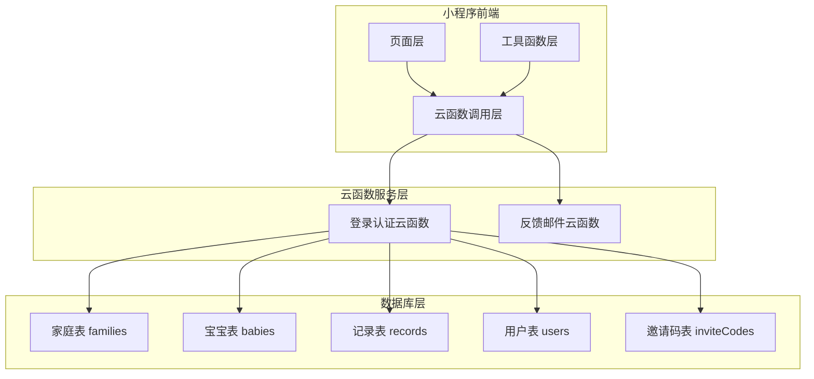
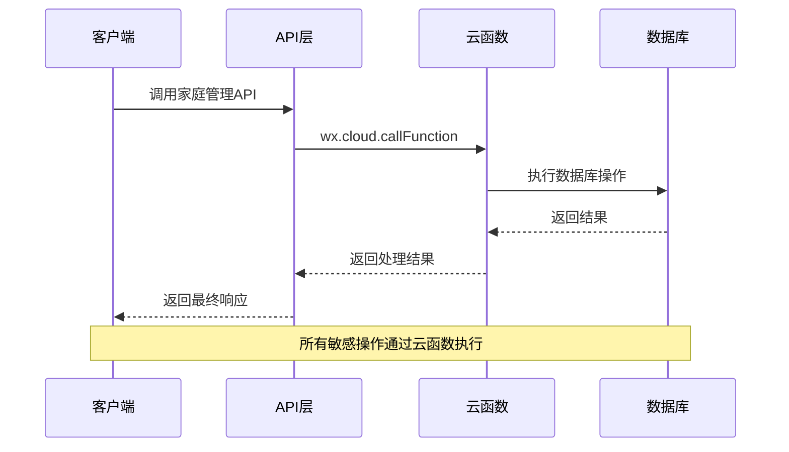
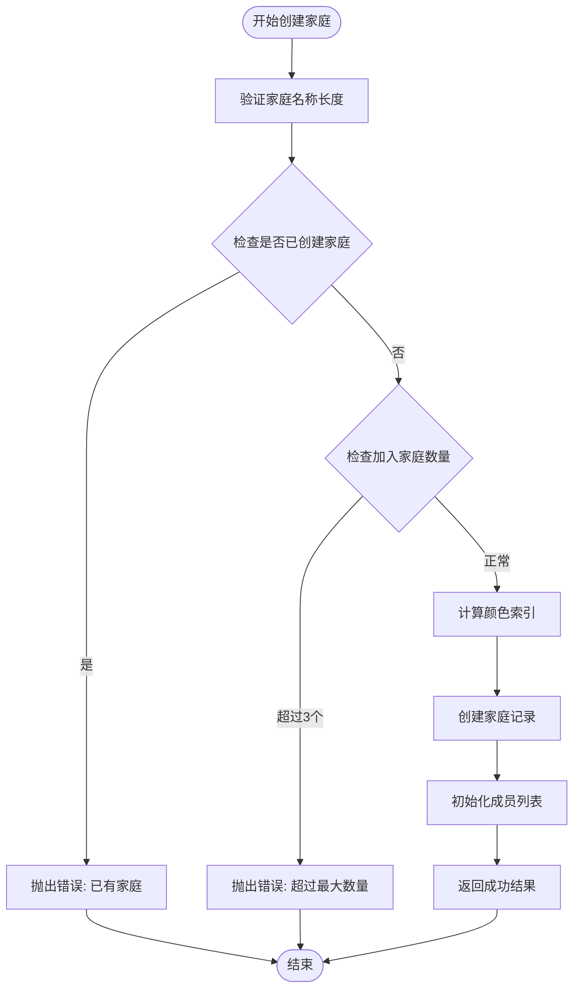
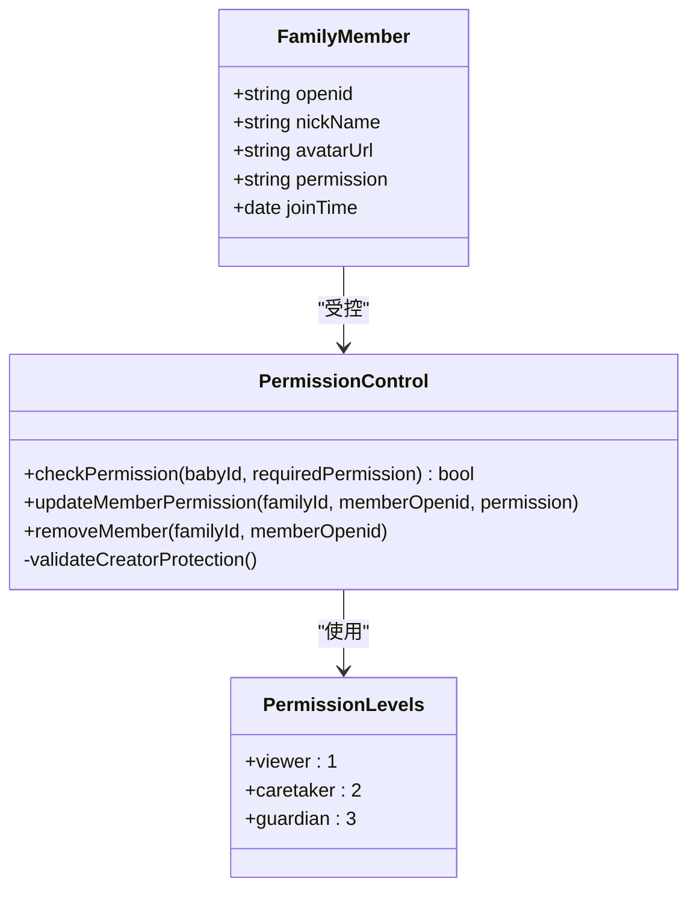
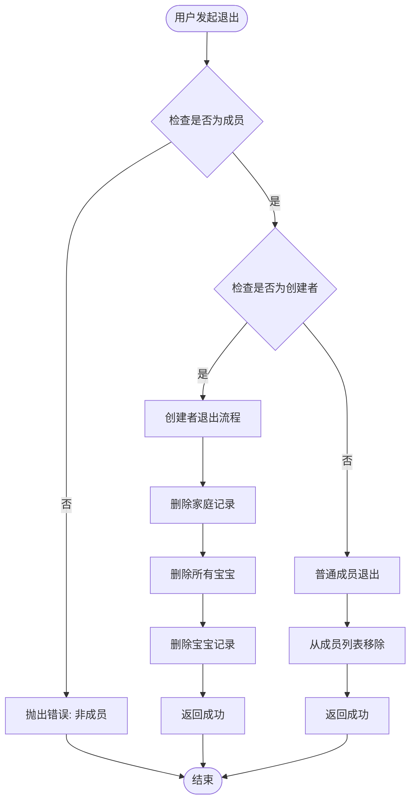
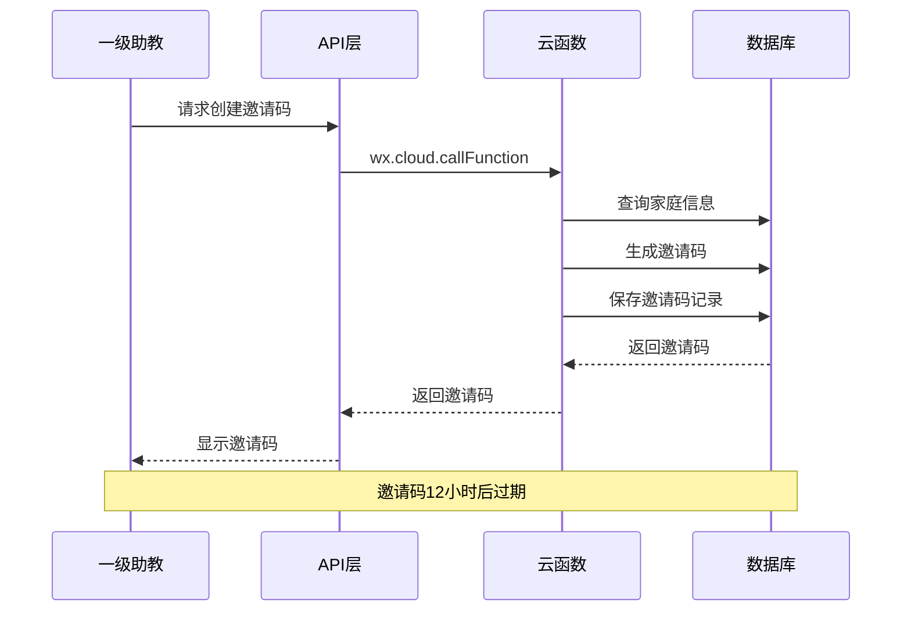
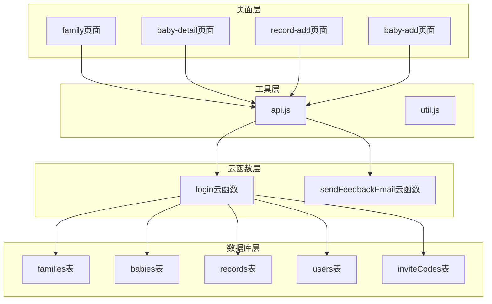
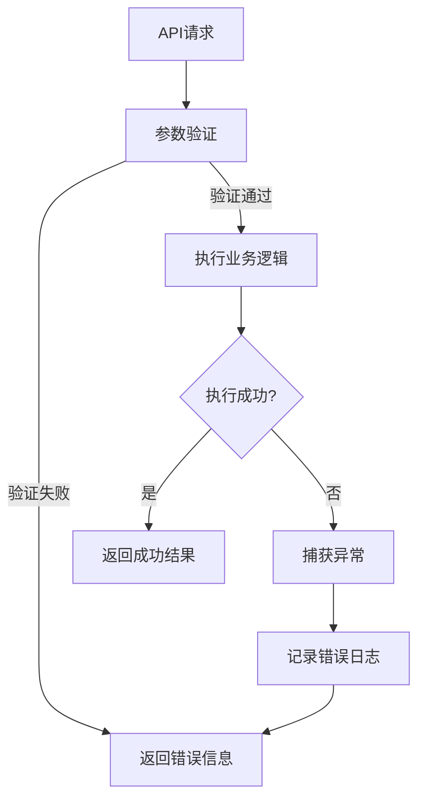

# 家庭管理

<cite>
**本文档引用的文件**
- [family.js](file://miniprogram/pages/family/family.js)
- [api.js](file://miniprogram/utils/api.js)
- [index.js](file://cloudfunctions/login/index.js)
- [index.js](file://cloudfunctions/sendFeedbackEmail/index.js)
- [util.js](file://miniprogram/utils/util.js)
- [baby-detail.js](file://miniprogram/pages/baby-detail/baby-detail.js)
- [record-add.js](file://miniprogram/pages/record-add/record-add.js)
- [baby-add.js](file://miniprogram/pages/baby-add/baby-add.js)
- [package.json](file://cloudfunctions/login/package.json)
- [package.json](file://cloudfunctions/sendFeedbackEmail/package.json)
</cite>

## 目录
1. [简介](#简介)
2. [项目结构](#项目结构)
3. [核心组件](#核心组件)
4. [架构概览](#架构概览)
5. [详细组件分析](#详细组件分析)
6. [依赖关系分析](#依赖关系分析)
7. [性能考虑](#性能考虑)
8. [故障排除指南](#故障排除指南)
9. [结论](#结论)

## 简介

本项目是一个基于微信小程序的婴儿成长管理应用，提供了完整的家庭管理系统。系统支持多家庭管理、成员权限控制、宝宝信息管理等功能。本文档深入解析家庭管理功能的云函数实现，包括家庭创建、家庭信息更新、家庭成员管理等核心功能。

## 项目结构

项目采用典型的微信小程序架构，主要分为前端页面层和云函数服务层：

**图表来源**
- [family.js:1-757](file://miniprogram/pages/family/family.js#L1-L757)
- [api.js:1-879](file://miniprogram/utils/api.js#L1-L879)
- [index.js:1-814](file://cloudfunctions/login/index.js#L1-L814)

**章节来源**
- [family.js:1-757](file://miniprogram/pages/family/family.js#L1-L757)
- [api.js:1-879](file://miniprogram/utils/api.js#L1-L879)

## 核心组件

### 权限控制系统

系统实现了三级权限模型：
- **一级助教 (guardian)**: 家庭管理员，拥有最高权限
- **二级助教 (caretaker)**: 普通成员，可添加记录
- **围观吃瓜 (viewer)**: 只读权限

权限检查通过 `checkPermission` 方法实现，支持按宝宝或按家庭级别检查。

### 家庭管理API

提供完整的家庭管理接口：
- 家庭创建：`createFamily`
- 家庭信息更新：`updateFamilyName`
- 成员管理：`updateMemberPermission`, `removeFamilyMember`
- 成员信息更新：`updateMemberInfo`
- 家庭退出：`leaveFamily`

**章节来源**
- [api.js:498-780](file://miniprogram/utils/api.js#L498-L780)
- [index.js:94-480](file://cloudfunctions/login/index.js#L94-L480)

## 架构概览

系统采用前后端分离架构，前端通过云函数调用实现数据访问，确保数据库权限控制的安全性。

**图表来源**
- [api.js:498-780](file://miniprogram/utils/api.js#L498-L780)
- [index.js:22-814](file://cloudfunctions/login/index.js#L22-L814)

## 详细组件分析

### 家庭创建流程

家庭创建是系统的核心功能之一，涉及多个安全验证步骤：

**图表来源**
- [index.js:94-151](file://cloudfunctions/login/index.js#L94-L151)

#### 关键实现细节

1. **权限验证**: 每个用户最多只能创建一个家庭
2. **数量限制**: 用户最多只能加入3个家庭
3. **颜色索引分配**: 自动分配不重复的颜色索引
4. **成员初始化**: 创建者自动成为一级助教

**章节来源**
- [index.js:94-151](file://cloudfunctions/login/index.js#L94-L151)
- [family.js:102-130](file://miniprogram/pages/family/family.js#L102-L130)

### 家庭成员权限控制

系统实现了严格的成员权限管理机制：

**图表来源**
- [index.js:186-266](file://cloudfunctions/login/index.js#L186-L266)
- [api.js:782-852](file://miniprogram/utils/api.js#L782-L852)

#### 权限差异说明

| 权限级别 | 功能权限 | 操作权限 |
|---------|---------|---------|
| 一级助教 | 完全管理权 | 修改家庭名称、管理成员、删除宝宝 |
| 二级助教 | 记录管理 | 添加记录、删除自己录入的记录 |
| 围观吃瓜 | 只读权限 | 查看宝宝信息和记录 |

**章节来源**
- [index.js:186-266](file://cloudfunctions/login/index.js#L186-L266)
- [api.js:782-852](file://miniprogram/utils/api.js#L782-L852)

### 家庭退出机制

系统区分了创建者退出和普通成员退出的不同处理逻辑：

**图表来源**
- [index.js:373-422](file://cloudfunctions/login/index.js#L373-L422)

#### 退出流程特点

1. **创建者退出**: 清空整个家庭的所有数据
2. **普通成员退出**: 仅移除成员身份
3. **数据完整性**: 确保退出后数据一致性

**章节来源**
- [index.js:373-422](file://cloudfunctions/login/index.js#L373-L422)
- [family.js:132-166](file://miniprogram/pages/family/family.js#L132-L166)

### 邀请码系统

系统通过邀请码实现家庭成员邀请功能：

**图表来源**
- [index.js:658-699](file://cloudfunctions/login/index.js#L658-L699)

**章节来源**
- [index.js:658-699](file://cloudfunctions/login/index.js#L658-L699)
- [api.js:531-563](file://miniprogram/utils/api.js#L531-L563)

## 依赖关系分析

系统各模块之间的依赖关系如下：

**图表来源**
- [family.js:1-757](file://miniprogram/pages/family/family.js#L1-L757)
- [api.js:1-879](file://miniprogram/utils/api.js#L1-L879)
- [index.js:1-814](file://cloudfunctions/login/index.js#L1-L814)

**章节来源**
- [family.js:1-757](file://miniprogram/pages/family/family.js#L1-L757)
- [api.js:1-879](file://miniprogram/utils/api.js#L1-L879)

## 性能考虑

### 数据库查询优化

1. **批量查询**: 家庭列表查询使用 `whereIn` 优化
2. **索引使用**: 对常用查询字段建立索引
3. **分页处理**: 大量数据采用分页查询

### 云函数优化

1. **事务处理**: 关键操作使用数据库事务确保一致性
2. **异步处理**: 邀请码清理等后台任务异步执行
3. **缓存策略**: 频繁访问的数据采用缓存机制

### 前端性能

1. **懒加载**: 图表组件采用懒加载
2. **数据缓存**: 用户信息和家庭数据本地缓存
3. **防抖处理**: 输入验证采用防抖机制

## 故障排除指南

### 常见问题及解决方案

#### 权限相关问题

| 问题描述 | 可能原因 | 解决方案 |
|---------|---------|---------|
| 无法创建家庭 | 已有家庭或加入家庭数量已达上限 | 检查用户现有家庭状态 |
| 无法修改权限 | 非一级助教或试图修改创建者权限 | 确认当前用户权限级别 |
| 无法退出家庭 | 非家庭成员 | 检查用户是否在家庭中 |

#### 数据一致性问题

| 问题描述 | 可能原因 | 解决方案 |
|---------|---------|---------|
| 家庭数据不完整 | 退出流程中断 | 实施事务处理确保原子性 |
| 成员信息不同步 | 更新操作失败 | 检查网络连接和数据库状态 |

**章节来源**
- [index.js:94-480](file://cloudfunctions/login/index.js#L94-L480)

### 错误处理策略

系统采用统一的错误处理机制：

**图表来源**
- [api.js:1-879](file://miniprogram/utils/api.js#L1-L879)

## 结论

本家庭管理系统通过云函数实现了强大的权限控制和数据安全保障。系统的主要优势包括：

1. **安全可靠**: 所有敏感操作通过云函数执行，确保数据库权限控制
2. **权限清晰**: 三级权限模型满足不同场景需求
3. **用户体验**: 流畅的界面设计和完善的错误提示
4. **扩展性强**: 模块化设计便于功能扩展和维护

系统在家庭管理、成员权限控制、数据一致性等方面表现优秀，为用户提供了一个完整的婴儿成长管理解决方案。