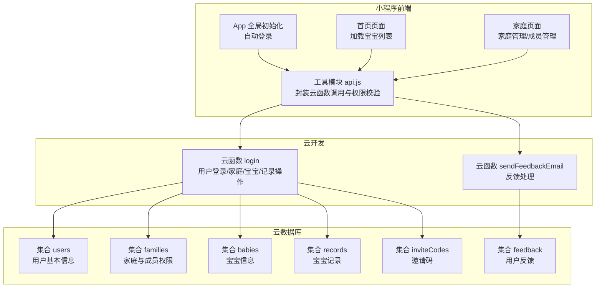
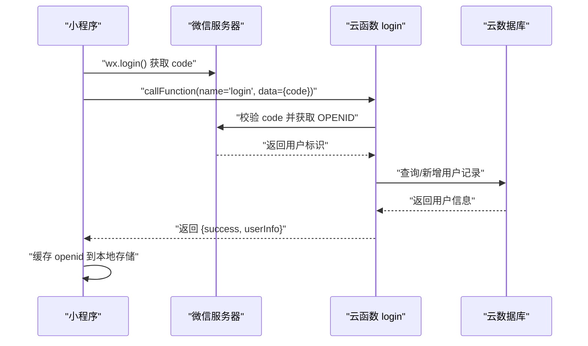
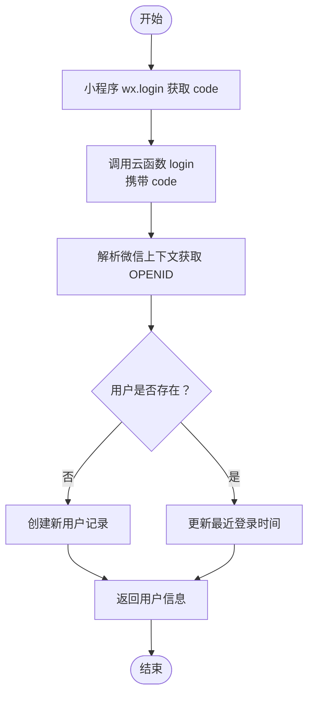
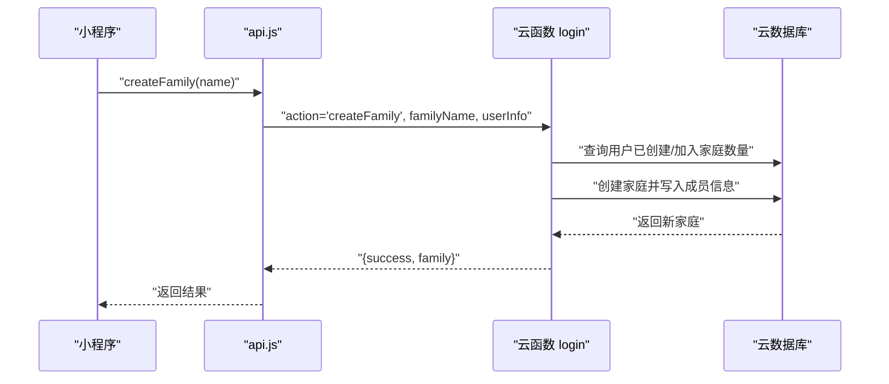
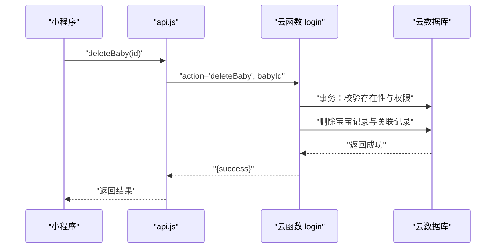
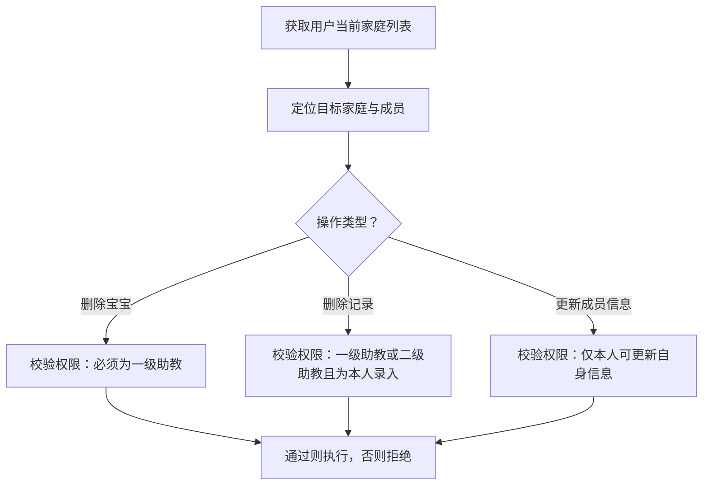
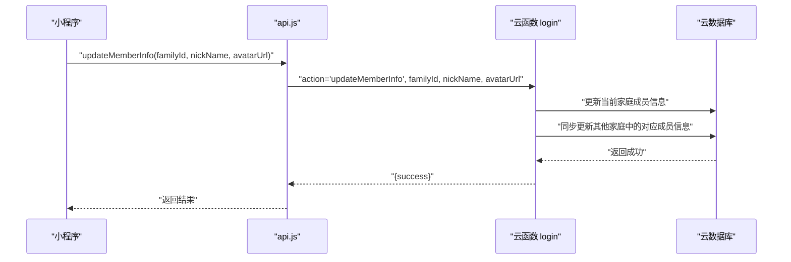
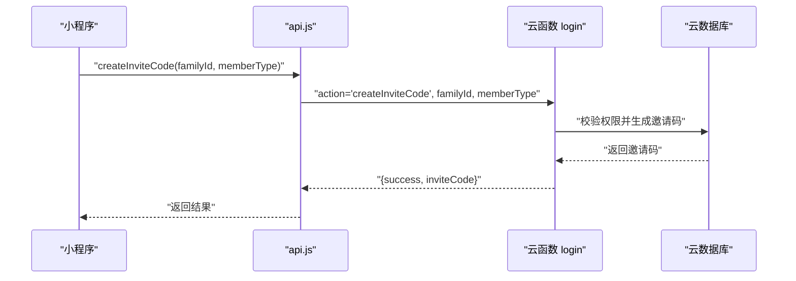
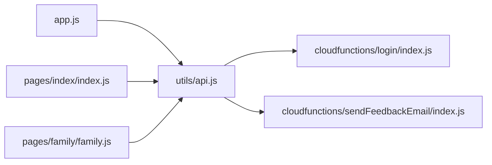

# 用户认证

<cite>
**本文引用的文件**
- [cloudfunctions/login/index.js](file://cloudfunctions/login/index.js)
- [cloudfunctions/login/package.json](file://cloudfunctions/login/package.json)
- [miniprogram/app.js](file://miniprogram/app.js)
- [miniprogram/utils/api.js](file://miniprogram/utils/api.js)
- [miniprogram/pages/index/index.js](file://miniprogram/pages/index/index.js)
- [miniprogram/pages/family/family.js](file://miniprogram/pages/family/family.js)
- [cloudfunctions/sendFeedbackEmail/index.js](file://cloudfunctions/sendFeedbackEmail/index.js)
</cite>

## 目录
1. [简介](#简介)
2. [项目结构](#项目结构)
3. [核心组件](#核心组件)
4. [架构总览](#架构总览)
5. [详细组件分析](#详细组件分析)
6. [依赖关系分析](#依赖关系分析)
7. [性能考虑](#性能考虑)
8. [故障排查指南](#故障排查指南)
9. [结论](#结论)
10. [附录](#附录)

## 简介
本技术文档围绕用户认证与权限体系展开，覆盖微信小程序端登录流程、云函数侧用户信息与家庭/宝宝/记录数据的访问控制、权限模型与数据隔离策略、以及跨家庭信息一致性保障机制。文档同时提供API参数说明、安全策略、错误处理机制、性能优化建议与最佳实践，帮助开发者快速理解并扩展完整的用户认证体系。

## 项目结构
本项目采用“前端小程序 + 云开发云函数”的分层架构：
- 前端小程序负责用户交互、调用云函数、本地状态管理与权限校验。
- 云函数统一处理用户登录、家庭/宝宝/记录等业务逻辑，并进行严格的权限校验与数据隔离。
- 数据库存储用户、家庭、宝宝、记录、邀请码等实体，配合云函数实现强一致与权限控制。

图表来源
- [miniprogram/app.js:1-56](file://miniprogram/app.js#L1-L56)
- [miniprogram/utils/api.js:1-879](file://miniprogram/utils/api.js#L1-L879)
- [cloudfunctions/login/index.js:1-814](file://cloudfunctions/login/index.js#L1-L814)
- [cloudfunctions/sendFeedbackEmail/index.js:1-21](file://cloudfunctions/sendFeedbackEmail/index.js#L1-L21)

章节来源
- [miniprogram/app.js:1-56](file://miniprogram/app.js#L1-L56)
- [miniprogram/utils/api.js:1-879](file://miniprogram/utils/api.js#L1-L879)
- [cloudfunctions/login/index.js:1-814](file://cloudfunctions/login/index.js#L1-L814)
- [cloudfunctions/sendFeedbackEmail/index.js:1-21](file://cloudfunctions/sendFeedbackEmail/index.js#L1-L21)

## 核心组件
- 小程序自动登录与全局状态
  - App 在启动时初始化云环境并自动执行登录，拉取用户 OPENID 并缓存至本地存储。
- 云函数 login
  - 统一处理用户登录、家庭/宝宝/记录的增删改查与权限校验，支持事务性删除宝宝及关联记录。
- 工具模块 api.js
  - 封装云函数调用、等待登录、权限检查、家庭/宝宝/记录 CRUD 等常用接口。
- 家庭页面 family.js
  - 展示用户在各家庭的身份与权限，提供创建/加入/退出家庭、邀请码生成、成员管理、头像/昵称更新等能力。
- 反馈云函数 sendFeedbackEmail
  - 接收反馈数据，当前为占位实现，便于后续集成邮件服务。

章节来源
- [miniprogram/app.js:1-56](file://miniprogram/app.js#L1-L56)
- [cloudfunctions/login/index.js:1-814](file://cloudfunctions/login/index.js#L1-L814)
- [miniprogram/utils/api.js:1-879](file://miniprogram/utils/api.js#L1-L879)
- [miniprogram/pages/family/family.js:1-757](file://miniprogram/pages/family/family.js#L1-L757)
- [cloudfunctions/sendFeedbackEmail/index.js:1-21](file://cloudfunctions/sendFeedbackEmail/index.js#L1-L21)

## 架构总览
用户认证与权限控制的关键路径如下：
- 小程序端通过 wx.login 获取临时登录凭证 code，调用云函数 login 的登录动作，云函数基于微信上下文解析 OPENID，完成用户注册/登录并返回用户信息。
- 业务操作均通过云函数执行，前端仅调用云函数，避免直接访问数据库造成越权风险。
- 权限模型以家庭为最小边界，成员权限分为“围观吃瓜”“二级助教”“一级助教”，不同权限对家庭/宝宝/记录具备不同操作能力。
- 跨家庭信息一致性通过云函数在成员信息变更时同步更新其他家庭中的对应成员信息。

图表来源
- [miniprogram/app.js:28-54](file://miniprogram/app.js#L28-L54)
- [cloudfunctions/login/index.js:762-800](file://cloudfunctions/login/index.js#L762-L800)

章节来源
- [miniprogram/app.js:28-54](file://miniprogram/app.js#L28-L54)
- [cloudfunctions/login/index.js:762-800](file://cloudfunctions/login/index.js#L762-L800)

## 详细组件分析

### 登录流程与用户信息管理
- 登录入口
  - 小程序启动即发起登录，调用云函数 login，携带 code 参数。
  - 云函数通过微信上下文解析 OPENID，若用户不存在则创建；若已存在则更新最近登录时间。
- 用户信息
  - 用户表 users 存储 openid、昵称、创建/最近登录时间等字段。
  - 若首次登录，昵称为随机生成的友好名称，便于匿名体验。
- 会话与状态
  - 小程序将 openid 写入本地存储，作为后续权限校验与业务调用的基础。

图表来源
- [miniprogram/app.js:28-54](file://miniprogram/app.js#L28-L54)
- [cloudfunctions/login/index.js:762-800](file://cloudfunctions/login/index.js#L762-L800)

章节来源
- [miniprogram/app.js:28-54](file://miniprogram/app.js#L28-L54)
- [cloudfunctions/login/index.js:762-800](file://cloudfunctions/login/index.js#L762-L800)

### 家庭与成员管理
- 家庭创建
  - 限制：每位用户仅可创建一个家庭；加入家庭数量不超过3个；家庭名长度不超过7个字符。
  - 颜色索引自动分配，避免重复。
- 成员权限
  - 围观吃瓜：仅可查看。
  - 二级助教：可添加/编辑记录（部分场景）、查看。
  - 一级助教：可管理家庭、成员、宝宝与记录。
- 成员变更
  - 修改家庭名称、调整成员权限、移除成员、退出家庭等操作均需当前用户为一级助教或满足特定条件。
- 加入/退出家庭
  - 加入：通过有效且未使用的邀请码加入；退出：创建者退出将删除家庭及其所有宝宝与记录。
- 信息同步
  - 当用户在任一家庭中更新昵称/头像时，云函数会同步更新其在其他家庭中的对应信息，保证跨家庭一致性。

图表来源
- [miniprogram/utils/api.js:498-529](file://miniprogram/utils/api.js#L498-L529)
- [cloudfunctions/login/index.js:94-151](file://cloudfunctions/login/index.js#L94-L151)

章节来源
- [miniprogram/utils/api.js:498-529](file://miniprogram/utils/api.js#L498-L529)
- [cloudfunctions/login/index.js:94-151](file://cloudfunctions/login/index.js#L94-L151)

### 宝宝与记录管理
- 宝宝 CRUD
  - 新增：校验家庭内宝宝数量上限（每家庭最多3个）；创建时写入 openid、familyId、创建时间。
  - 删除：使用事务确保原子性，删除宝宝与其所有记录；仅一级助教可删除。
- 记录 CRUD
  - 新增：根据宝宝出生日期计算月龄；二级助教及以上可添加；记录包含 openid、创建时间。
  - 删除：一级助教可删除任意记录；二级助教仅可删除自己录入的记录。
- 权限校验
  - 所有读取操作（获取宝宝/记录）均通过云函数执行，确保用户仅能访问所属家庭的数据。

图表来源
- [miniprogram/utils/api.js:213-240](file://miniprogram/utils/api.js#L213-L240)
- [cloudfunctions/login/index.js:482-510](file://cloudfunctions/login/index.js#L482-L510)

章节来源
- [miniprogram/utils/api.js:213-240](file://miniprogram/utils/api.js#L213-L240)
- [cloudfunctions/login/index.js:482-510](file://cloudfunctions/login/index.js#L482-L510)

### 权限模型与数据隔离
- 权限等级
  - 围观吃瓜 < 二级助教 < 一级助教（数值化等级用于比较）。
- 数据隔离
  - 读取类操作全部通过云函数执行，前端直接访问数据库的读取被规避，防止越权。
  - 写入类操作严格校验当前用户在目标家庭中的权限，如删除宝宝仅限一级助教。
- 跨家庭一致性
  - 当用户在某家庭更新昵称/头像时，云函数遍历用户在其他家庭中的成员信息并同步更新，保持跨家庭一致。

图表来源
- [miniprogram/utils/api.js:782-852](file://miniprogram/utils/api.js#L782-L852)
- [cloudfunctions/login/index.js:482-554](file://cloudfunctions/login/index.js#L482-L554)

章节来源
- [miniprogram/utils/api.js:782-852](file://miniprogram/utils/api.js#L782-L852)
- [cloudfunctions/login/index.js:482-554](file://cloudfunctions/login/index.js#L482-L554)

### 用户信息更新机制
- 昵称与头像更新
  - 支持在家庭页面中修改个人昵称与头像，更新后会同步到用户在其他家庭中的对应信息。
- 微信信息同步
  - 加入家庭时优先使用用户在其他家庭中的自定义昵称/头像，其次回退到用户表中的微信信息，最后回退到调用方提供的 memberInfo。
- 上传与存储
  - 头像上传至云存储，返回 fileID，前端与云函数均可使用该 ID 进行展示与持久化。

图表来源
- [miniprogram/pages/family/family.js:301-354](file://miniprogram/pages/family/family.js#L301-L354)
- [miniprogram/utils/api.js:655-684](file://miniprogram/utils/api.js#L655-L684)
- [cloudfunctions/login/index.js:424-480](file://cloudfunctions/login/index.js#L424-L480)

章节来源
- [miniprogram/pages/family/family.js:301-354](file://miniprogram/pages/family/family.js#L301-L354)
- [miniprogram/utils/api.js:655-684](file://miniprogram/utils/api.js#L655-L684)
- [cloudfunctions/login/index.js:424-480](file://cloudfunctions/login/index.js#L424-L480)

### 邀请码与家庭加入
- 邀请码生成
  - 仅一级助教与二级助教可生成邀请码，有效期12小时，生成后异步清理过期邀请码。
- 加入家庭
  - 使用有效邀请码加入，系统自动去重、限制加入数量、同步用户昵称/头像。
- 退出家庭
  - 创建者退出将删除家庭及其所有数据；非创建者仅移除成员。

图表来源
- [miniprogram/utils/api.js:531-563](file://miniprogram/utils/api.js#L531-L563)
- [cloudfunctions/login/index.js:658-699](file://cloudfunctions/login/index.js#L658-L699)

章节来源
- [miniprogram/utils/api.js:531-563](file://miniprogram/utils/api.js#L531-L563)
- [cloudfunctions/login/index.js:658-699](file://cloudfunctions/login/index.js#L658-L699)

## 依赖关系分析
- 小程序端依赖
  - app.js 初始化云环境并自动登录。
  - api.js 封装云函数调用与权限校验，是业务层的核心依赖。
  - 页面组件通过 api.js 调用云函数，避免直接访问数据库。
- 云函数依赖
  - login 依赖微信云开发 SDK，使用 wx-server-sdk 获取微信上下文与数据库操作。
  - sendFeedbackEmail 作为反馈处理的占位云函数，当前仅打印日志并返回成功。

图表来源
- [miniprogram/app.js:1-56](file://miniprogram/app.js#L1-L56)
- [miniprogram/utils/api.js:1-879](file://miniprogram/utils/api.js#L1-L879)
- [miniprogram/pages/index/index.js:1-144](file://miniprogram/pages/index/index.js#L1-L144)
- [miniprogram/pages/family/family.js:1-757](file://miniprogram/pages/family/family.js#L1-L757)
- [cloudfunctions/login/index.js:1-814](file://cloudfunctions/login/index.js#L1-L814)
- [cloudfunctions/sendFeedbackEmail/index.js:1-21](file://cloudfunctions/sendFeedbackEmail/index.js#L1-L21)

章节来源
- [miniprogram/app.js:1-56](file://miniprogram/app.js#L1-L56)
- [miniprogram/utils/api.js:1-879](file://miniprogram/utils/api.js#L1-L879)
- [miniprogram/pages/index/index.js:1-144](file://miniprogram/pages/index/index.js#L1-L144)
- [miniprogram/pages/family/family.js:1-757](file://miniprogram/pages/family/family.js#L1-L757)
- [cloudfunctions/login/index.js:1-814](file://cloudfunctions/login/index.js#L1-L814)
- [cloudfunctions/sendFeedbackEmail/index.js:1-21](file://cloudfunctions/sendFeedbackEmail/index.js#L1-L21)

## 性能考虑
- 云函数调用
  - 所有读取/写入操作通过云函数执行，减少前端直连数据库带来的网络与权限复杂度。
- 事务与批量更新
  - 删除宝宝使用事务确保原子性，避免数据不一致。
  - 成员信息更新时批量同步到其他家庭，降低重复查询成本。
- 缓存与幂等
  - 小程序端缓存 openid，避免重复登录；云函数侧对重复加入/创建等场景进行幂等判断。
- 异步清理
  - 邀请码过期清理采用异步方式，不阻塞主流程。

[本节为通用性能建议，无需列出具体文件来源]

## 故障排查指南
- 登录失败
  - 检查小程序是否正确初始化云环境；确认 wx.login 是否成功获取 code；查看云函数返回的错误信息。
- 权限不足
  - 确认当前用户在目标家庭中的权限等级；检查 api.js 中的 checkPermission 返回值。
- 数据越权
  - 所有读取操作应通过云函数执行；避免前端直接访问数据库集合。
- 邀请码无效
  - 检查邀请码是否过期、是否已被使用、是否指向有效家庭。
- 删除失败
  - 确认操作用户权限为一级助教；检查事务是否正常提交。

章节来源
- [miniprogram/app.js:28-54](file://miniprogram/app.js#L28-L54)
- [miniprogram/utils/api.js:782-852](file://miniprogram/utils/api.js#L782-L852)
- [cloudfunctions/login/index.js:658-699](file://cloudfunctions/login/index.js#L658-L699)

## 结论
本认证体系以云函数为核心，结合小程序端的自动登录与权限校验，实现了以家庭为单位的细粒度权限控制与数据隔离。通过事务、幂等与异步清理等机制，保障了数据一致性与系统稳定性。建议在后续迭代中完善邀请码并发安全、增强日志审计与监控告警，并逐步接入更完善的邮件通知与风控策略。

[本节为总结性内容，无需列出具体文件来源]

## 附录

### 用户认证 API 参数说明（云函数 login）
- 通用参数
  - code: 微信登录临时凭证
  - action: 操作类型（字符串）
  - openid: 当前用户 OPENID（由微信上下文注入）
- 登录
  - 输入：code
  - 输出：success, userInfo
- 获取家庭列表
  - 输入：action=getFamilies
  - 输出：success, families
- 获取宝宝列表
  - 输入：action=getBabies
  - 输出：success, babies
- 创建家庭
  - 输入：action=createFamily, familyName, userInfo
  - 输出：success, family
- 更新家庭名称
  - 输入：action=updateFamilyName, familyId, newName, openid
  - 输出：success
- 更新成员权限
  - 输入：action=updateMemberPermission, familyId, memberOpenid, permission, openid
  - 输出：success
- 移除成员
  - 输入：action=removeFamilyMember, familyId, memberOpenid, openid
  - 输出：success
- 加入家庭
  - 输入：action=joinFamily, inviteCode, memberInfo
  - 输出：success
- 退出家庭
  - 输入：action=leaveFamily, familyId
  - 输出：success
- 更新成员信息
  - 输入：action=updateMemberInfo, familyId, nickName, avatarUrl
  - 输出：success
- 删除宝宝
  - 输入：action=deleteBaby, babyId
  - 输出：success
- 删除记录
  - 输入：action=deleteRecord, recordId
  - 输出：success
- 获取宝宝详情
  - 输入：action=getBabyById, babyId
  - 输出：success, baby
- 获取宝宝记录
  - 输入：action=getRecordsByBabyId, babyId
  - 输出：success, records
- 获取记录详情
  - 输入：action=getRecordById, recordId
  - 输出：success, record
- 获取家庭详情
  - 输入：action=getFamilyById, familyId
  - 输出：success, family
- 生成邀请码
  - 输入：action=createInviteCode, familyId, memberType
  - 输出：success, inviteCode
- 更新宝宝姓名
  - 输入：action=updateBabyName, babyId, name
  - 输出：success
- 清理过期邀请码
  - 输入：action=cleanExpiredInviteCodes
  - 输出：success, deletedCount

章节来源
- [cloudfunctions/login/index.js:22-814](file://cloudfunctions/login/index.js#L22-L814)

### 安全策略
- OPENID 验证
  - 云函数通过微信上下文解析 OPENID，所有业务操作均基于该标识进行权限校验。
- 权限控制
  - 以家庭为边界，权限等级逐级递增；敏感操作（删除、修改）仅限一级助教。
- 数据隔离
  - 读取类操作统一走云函数，前端不直接访问数据库集合。
- 信息同步
  - 成员昵称/头像更新时同步到其他家庭，避免跨家庭信息不一致。
- 邀请码安全
  - 生成后异步清理过期邀请码，限制有效期与使用次数。

章节来源
- [cloudfunctions/login/index.js:94-151](file://cloudfunctions/login/index.js#L94-L151)
- [cloudfunctions/login/index.js:268-371](file://cloudfunctions/login/index.js#L268-L371)
- [cloudfunctions/login/index.js:424-480](file://cloudfunctions/login/index.js#L424-L480)
- [cloudfunctions/login/index.js:658-699](file://cloudfunctions/login/index.js#L658-L699)

### 错误处理机制
- 云函数内部通过抛出错误并返回 { success: false, error } 形式向前端反馈异常。
- 前端在调用云函数时捕获错误并提示用户，避免崩溃。
- 对于可恢复场景（如登录等待），提供最大等待时间与重试策略。

章节来源
- [miniprogram/utils/api.js:13-41](file://miniprogram/utils/api.js#L13-L41)
- [cloudfunctions/login/index.js:762-800](file://cloudfunctions/login/index.js#L762-L800)

### 最佳实践
- 所有业务操作通过云函数执行，前端仅负责 UI 与调用。
- 在需要跨家庭一致性更新的场景，优先在云函数侧实现批量同步。
- 对高风险操作（删除、权限变更）增加二次确认与日志审计。
- 对外暴露的邀请码应设置合理有效期与使用限制，并定期清理。

[本节为通用最佳实践建议，无需列出具体文件来源]