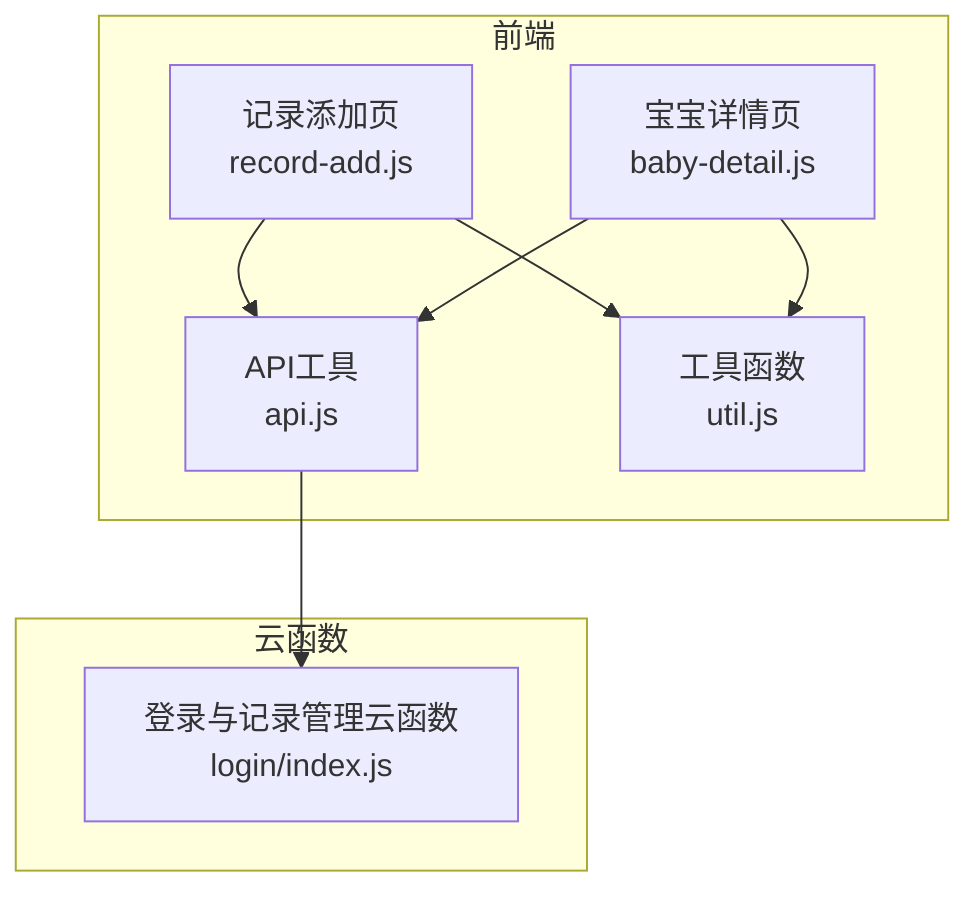
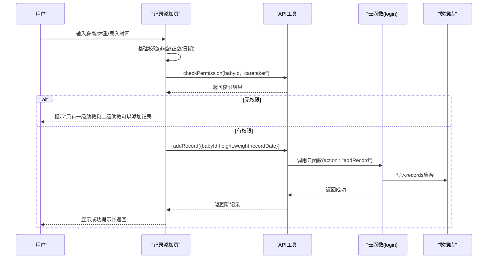
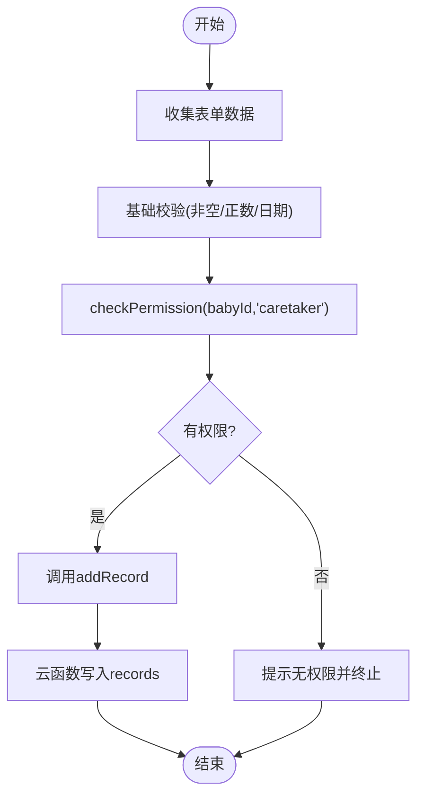
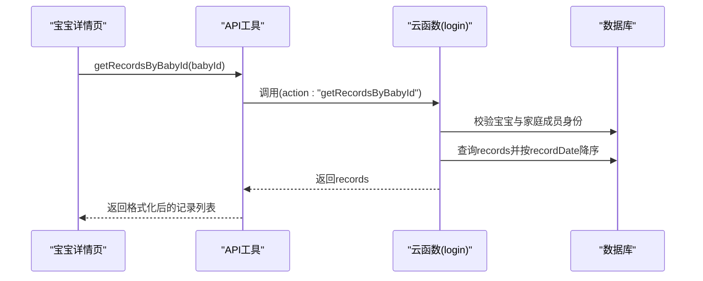
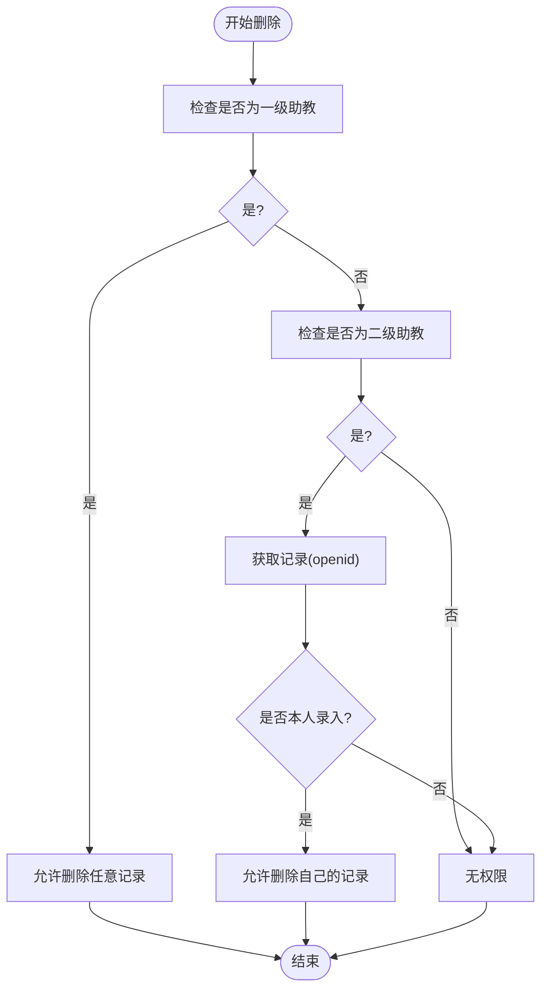
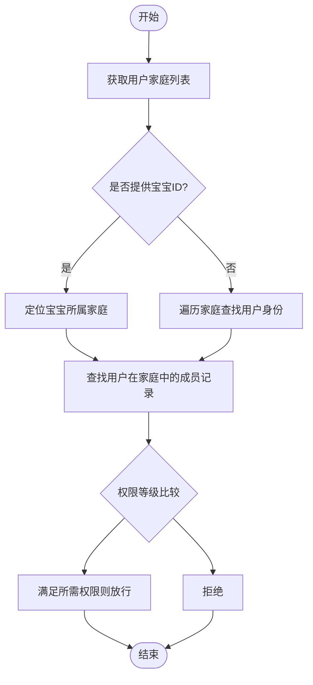
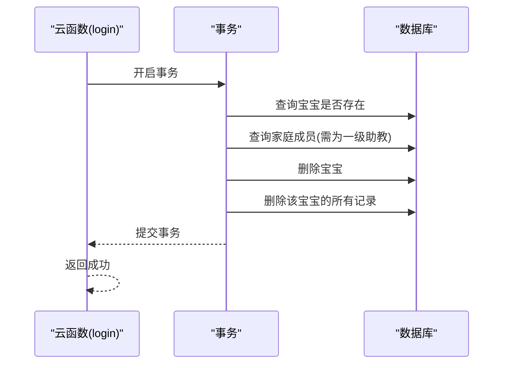
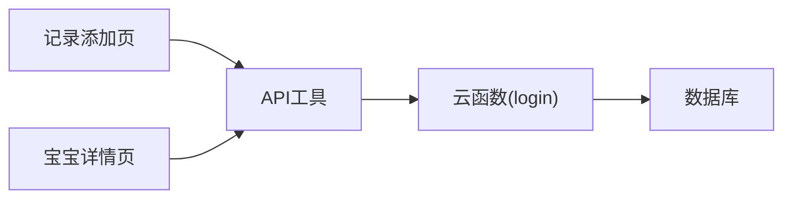

# 记录管理

<cite>
**本文引用的文件**
- [miniprogram/utils/api.js](file://miniprogram/utils/api.js)
- [miniprogram/pages/record-add/record-add.js](file://miniprogram/pages/record-add/record-add.js)
- [miniprogram/pages/record-add/record-add.json](file://miniprogram/pages/record-add/record-add.json)
- [miniprogram/pages/record-add/record-add.wxml](file://miniprogram/pages/record-add/record-add.wxml)
- [miniprogram/pages/baby-detail/baby-detail.js](file://miniprogram/pages/baby-detail/baby-detail.js)
- [miniprogram/pages/family/family.wxml](file://miniprogram/pages/family/family.wxml)
- [miniprogram/pages/family/family.wxss](file://miniprogram/pages/family/family.wxss)
- [miniprogram/utils/util.js](file://miniprogram/utils/util.js)
- [cloudfunctions/login/index.js](file://cloudfunctions/login/index.js)
</cite>

## 目录
1. [简介](#简介)
2. [项目结构](#项目结构)
3. [核心组件](#核心组件)
4. [架构总览](#架构总览)
5. [详细组件分析](#详细组件分析)
6. [依赖关系分析](#依赖关系分析)
7. [性能考量](#性能考量)
8. [故障排查指南](#故障排查指南)
9. [结论](#结论)
10. [附录](#附录)

## 简介
本技术文档围绕“记录管理”功能展开，系统性阐述成长记录的增删改查（CRUD）流程、权限验证机制、查询逻辑与数据一致性保障。重点覆盖以下方面：
- 成长记录的CRUD实现与调用链路
- 权限验证规则：区分一级助教（guardian）、二级助教（caretaker）与围观者（viewer）
- 记录删除的权限控制差异：一级助教可删任意记录；二级助教仅可删本人录入的记录
- 记录查询的复杂逻辑：按宝宝ID查询、按记录ID查询、权限校验
- 数据一致性保证、异常处理策略、最佳实践与性能优化建议
- 完整的API参数说明、权限验证规则、数据验证逻辑
- 业务流程图与权限控制流程图，帮助开发者快速理解复杂逻辑

## 项目结构
记录管理涉及前端页面、工具方法与云函数三层协作：
- 前端页面负责用户交互与基础校验
- 工具方法封装API调用、权限检查与数据格式化
- 云函数负责跨集合事务、权限校验与复杂查询，确保数据一致性与安全

图表来源
- [miniprogram/pages/record-add/record-add.js:1-118](file://miniprogram/pages/record-add/record-add.js#L1-L118)
- [miniprogram/pages/baby-detail/baby-detail.js:1-691](file://miniprogram/pages/baby-detail/baby-detail.js#L1-L691)
- [miniprogram/utils/api.js:1-879](file://miniprogram/utils/api.js#L1-L879)
- [miniprogram/utils/util.js:1-55](file://miniprogram/utils/util.js#L1-L55)
- [cloudfunctions/login/index.js:1-814](file://cloudfunctions/login/index.js#L1-L814)

章节来源
- [miniprogram/pages/record-add/record-add.js:1-118](file://miniprogram/pages/record-add/record-add.js#L1-L118)
- [miniprogram/pages/baby-detail/baby-detail.js:1-691](file://miniprogram/pages/baby-detail/baby-detail.js#L1-L691)
- [miniprogram/utils/api.js:1-879](file://miniprogram/utils/api.js#L1-L879)
- [miniprogram/utils/util.js:1-55](file://miniprogram/utils/util.js#L1-L55)
- [cloudfunctions/login/index.js:1-814](file://cloudfunctions/login/index.js#L1-L814)

## 核心组件
- 记录添加页面：负责表单输入、基础数据校验、权限检查与提交
- 记录查询API：封装按宝宝ID与按记录ID查询，统一通过云函数绕过数据库权限限制
- 记录删除API：统一通过云函数执行，实现事务与细粒度权限控制
- 权限检查API：根据用户在家庭中的权限级别判断是否具备操作能力
- 工具函数：日期格式化、年龄计算与展示格式化

章节来源
- [miniprogram/pages/record-add/record-add.js:71-116](file://miniprogram/pages/record-add/record-add.js#L71-L116)
- [miniprogram/utils/api.js:113-147](file://miniprogram/utils/api.js#L113-L147)
- [miniprogram/utils/api.js:264-286](file://miniprogram/utils/api.js#L264-L286)
- [miniprogram/utils/api.js:348-374](file://miniprogram/utils/api.js#L348-L374)
- [miniprogram/utils/api.js:782-852](file://miniprogram/utils/api.js#L782-L852)
- [miniprogram/utils/util.js:1-55](file://miniprogram/utils/util.js#L1-L55)

## 架构总览
记录管理采用“前端轻量校验 + 云函数强一致”的设计模式：
- 前端负责UI与基础校验（如身高体重非空、正数、日期合法性）
- 云函数负责：
  - 跨集合事务（删除宝宝时同步删除其记录）
  - 细粒度权限校验（按家庭成员与权限级别）
  - 复杂查询（按宝宝ID/记录ID查询并校验访问权限）

图表来源
- [miniprogram/pages/record-add/record-add.js:71-116](file://miniprogram/pages/record-add/record-add.js#L71-L116)
- [miniprogram/utils/api.js:299-346](file://miniprogram/utils/api.js#L299-L346)
- [cloudfunctions/login/index.js:1-814](file://cloudfunctions/login/index.js#L1-L814)

章节来源
- [miniprogram/pages/record-add/record-add.js:71-116](file://miniprogram/pages/record-add/record-add.js#L71-L116)
- [miniprogram/utils/api.js:299-346](file://miniprogram/utils/api.js#L299-L346)
- [cloudfunctions/login/index.js:1-814](file://cloudfunctions/login/index.js#L1-L814)

## 详细组件分析

### 记录添加流程
- 前端页面收集身高、体重、录入时间，进行基础校验
- 调用权限检查接口，要求至少为二级助教
- 通过API工具调用云函数执行添加，云函数写入records集合

图表来源
- [miniprogram/pages/record-add/record-add.js:71-116](file://miniprogram/pages/record-add/record-add.js#L71-L116)
- [miniprogram/utils/api.js:299-346](file://miniprogram/utils/api.js#L299-L346)
- [cloudfunctions/login/index.js:1-814](file://cloudfunctions/login/index.js#L1-L814)

章节来源
- [miniprogram/pages/record-add/record-add.js:71-116](file://miniprogram/pages/record-add/record-add.js#L71-L116)
- [miniprogram/utils/api.js:299-346](file://miniprogram/utils/api.js#L299-L346)
- [cloudfunctions/login/index.js:1-814](file://cloudfunctions/login/index.js#L1-L814)

### 记录查询逻辑
- 按宝宝ID查询：通过云函数查询records集合，同时校验用户对宝宝所属家庭的成员身份
- 按记录ID查询：通过云函数查询单条记录，校验用户对该记录所属宝宝家庭的成员身份
- 前端页面将查询结果格式化为展示用字段（日期格式化、年龄字符串）

图表来源
- [miniprogram/pages/baby-detail/baby-detail.js:223-235](file://miniprogram/pages/baby-detail/baby-detail.js#L223-L235)
- [miniprogram/utils/api.js:264-286](file://miniprogram/utils/api.js#L264-L286)
- [cloudfunctions/login/index.js:579-605](file://cloudfunctions/login/index.js#L579-L605)

章节来源
- [miniprogram/pages/baby-detail/baby-detail.js:223-235](file://miniprogram/pages/baby-detail/baby-detail.js#L223-L235)
- [miniprogram/utils/api.js:264-286](file://miniprogram/utils/api.js#L264-L286)
- [cloudfunctions/login/index.js:579-605](file://cloudfunctions/login/index.js#L579-L605)

### 记录删除权限控制
- 一级助教（guardian）：可删除该家庭内的任意记录
- 二级助教（caretaker）：仅可删除自己录入的记录（通过openid比对）
- 围观者（viewer）：无删除权限

图表来源
- [miniprogram/pages/baby-detail/baby-detail.js:614-663](file://miniprogram/pages/baby-detail/baby-detail.js#L614-L663)
- [cloudfunctions/login/index.js:512-554](file://cloudfunctions/login/index.js#L512-L554)

章节来源
- [miniprogram/pages/baby-detail/baby-detail.js:614-663](file://miniprogram/pages/baby-detail/baby-detail.js#L614-L663)
- [cloudfunctions/login/index.js:512-554](file://cloudfunctions/login/index.js#L512-L554)

### 权限验证流程
- 通过家庭集合与成员数组定位用户在家庭中的权限
- 支持按宝宝ID或全局家庭上下文进行权限判定
- 权限等级：viewer < caretaker < guardian

图表来源
- [miniprogram/utils/api.js:782-852](file://miniprogram/utils/api.js#L782-L852)
- [cloudfunctions/login/index.js:28-92](file://cloudfunctions/login/index.js#L28-L92)

章节来源
- [miniprogram/utils/api.js:782-852](file://miniprogram/utils/api.js#L782-L852)
- [cloudfunctions/login/index.js:28-92](file://cloudfunctions/login/index.js#L28-L92)

### 数据一致性保证
- 删除宝宝时，云函数使用事务确保“删除宝宝 + 删除其全部记录”原子性
- 删除记录时，云函数严格校验用户权限与记录归属，避免越权删除

图表来源
- [cloudfunctions/login/index.js:482-510](file://cloudfunctions/login/index.js#L482-L510)

章节来源
- [cloudfunctions/login/index.js:482-510](file://cloudfunctions/login/index.js#L482-L510)

## 依赖关系分析
- 页面依赖API工具：记录添加、查询、删除均通过API工具发起请求
- API工具依赖云函数：所有涉及跨集合或复杂权限的读写均走云函数
- 云函数依赖数据库：执行事务、查询与更新

图表来源
- [miniprogram/pages/record-add/record-add.js:1-118](file://miniprogram/pages/record-add/record-add.js#L1-L118)
- [miniprogram/pages/baby-detail/baby-detail.js:1-691](file://miniprogram/pages/baby-detail/baby-detail.js#L1-L691)
- [miniprogram/utils/api.js:1-879](file://miniprogram/utils/api.js#L1-L879)
- [cloudfunctions/login/index.js:1-814](file://cloudfunctions/login/index.js#L1-L814)

章节来源
- [miniprogram/pages/record-add/record-add.js:1-118](file://miniprogram/pages/record-add/record-add.js#L1-L118)
- [miniprogram/pages/baby-detail/baby-detail.js:1-691](file://miniprogram/pages/baby-detail/baby-detail.js#L1-L691)
- [miniprogram/utils/api.js:1-879](file://miniprogram/utils/api.js#L1-L879)
- [cloudfunctions/login/index.js:1-814](file://cloudfunctions/login/index.js#L1-L814)

## 性能考量
- 查询优化
  - 按宝宝ID查询记录时，使用精确匹配与排序，减少扫描范围
  - 前端缓存已获取的宝宝与家庭信息，避免重复网络请求
- 事务与批量操作
  - 删除宝宝时使用事务，避免中间状态导致的数据不一致
  - 批量删除记录时尽量减少多次往返
- 前端渲染
  - 图表按需懒加载，切换标签页时再初始化，降低首屏压力

[本节为通用性能建议，无需特定文件引用]

## 故障排查指南
- 权限不足
  - 现象：添加/删除记录时报“无权限”或“只有一级助教和二级助教可以添加记录”
  - 排查：确认用户在家庭中的权限级别；检查checkPermission调用参数与返回值
- 记录不存在
  - 现象：按记录ID查询或删除时报“记录不存在”
  - 排查：确认recordId正确；检查云函数中对记录与宝宝、家庭的关联查询
- 登录超时
  - 现象：API工具等待登录超时
  - 排查：检查登录流程与用户态存储；适当延长等待时间或引导重新登录
- 事务失败
  - 现象：删除宝宝后记录未删除或出现部分删除
  - 排查：检查云函数事务边界与异常捕获；确保所有子操作在事务内执行

章节来源
- [miniprogram/utils/api.js:14-41](file://miniprogram/utils/api.js#L14-L41)
- [cloudfunctions/login/index.js:512-554](file://cloudfunctions/login/index.js#L512-L554)

## 结论
记录管理通过“前端轻量校验 + 云函数强一致”的架构，实现了：
- 清晰的权限边界：一级助教与二级助教的差异化控制
- 可靠的数据一致性：事务保障关键操作原子性
- 易扩展的查询能力：按宝宝ID与记录ID的权限化查询
- 良好的用户体验：前端校验与云端校验双层保障

## 附录

### API参数说明与权限规则
- addRecord(recordInfo, isBirth=false)
  - 参数：babyId、height、weight、recordDate、isBirth
  - 权限：二级助教及以上
  - 行为：计算月龄、写入records
- getRecordsByBabyId(babyId)
  - 参数：babyId
  - 权限：该宝宝家庭成员
  - 行为：按recordDate降序返回记录
- getRecordById(recordId)
  - 参数：recordId
  - 权限：该记录所属宝宝家庭成员
  - 行为：返回单条记录
- deleteRecord(recordId)
  - 参数：recordId
  - 权限：一级助教或二级助教（仅限本人录入）
  - 行为：删除指定记录
- checkPermission(babyId, requiredPermission)
  - 参数：babyId、requiredPermission ∈ {"viewer","caretaker","guardian"}
  - 权限：按用户在家庭中的权限等级比较
  - 行为：返回布尔值表示是否满足权限

章节来源
- [miniprogram/utils/api.js:299-346](file://miniprogram/utils/api.js#L299-L346)
- [miniprogram/utils/api.js:264-286](file://miniprogram/utils/api.js#L264-L286)
- [miniprogram/utils/api.js:113-147](file://miniprogram/utils/api.js#L113-L147)
- [miniprogram/utils/api.js:348-374](file://miniprogram/utils/api.js#L348-L374)
- [miniprogram/utils/api.js:782-852](file://miniprogram/utils/api.js#L782-L852)
- [cloudfunctions/login/index.js:512-554](file://cloudfunctions/login/index.js#L512-L554)
- [cloudfunctions/login/index.js:579-605](file://cloudfunctions/login/index.js#L579-L605)

### 权限等级与页面提示
- 一级助教（guardian）：最高权限，可新增/删除宝宝与记录，可移除成员与修改权限
- 二级助教（caretaker）：可新增宝宝身高体重数据，删除时仅限本人录入
- 围观者（viewer）：仅可查看数据

章节来源
- [miniprogram/pages/family/family.wxml:101-114](file://miniprogram/pages/family/family.wxml#L101-L114)
- [miniprogram/pages/family/family.wxss:1290-1310](file://miniprogram/pages/family/family.wxss#L1290-L1310)