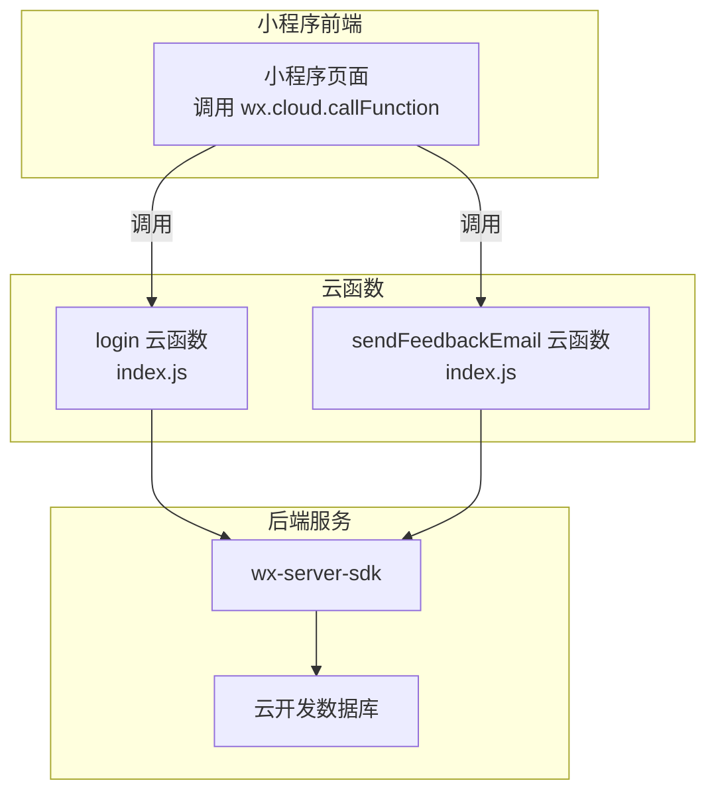
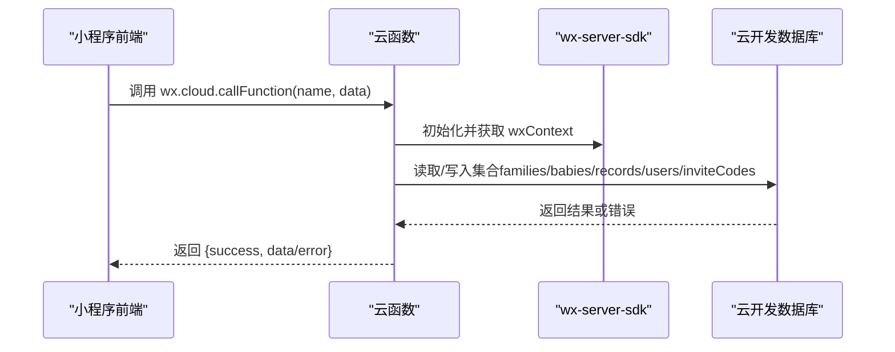
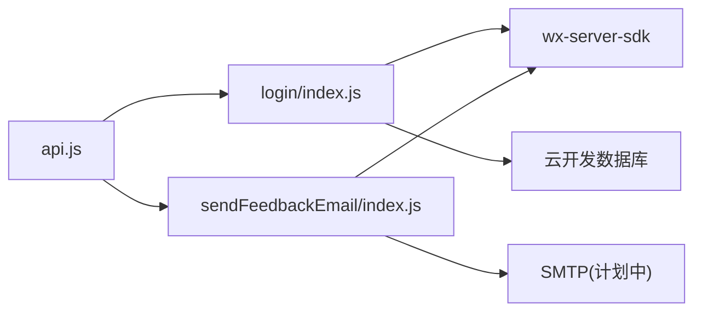

# 云函数详解

<cite>
**本文引用的文件**
- [login/index.js](file://cloudfunctions/login/index.js)
- [login/package.json](file://cloudfunctions/login/package.json)
- [sendFeedbackEmail/index.js](file://cloudfunctions/sendFeedbackEmail/index.js)
- [sendFeedbackEmail/package.json](file://cloudfunctions/sendFeedbackEmail/package.json)
- [api.js](file://miniprogram/utils/api.js)
- [uploadCloudFunction.sh](file://uploadCloudFunction.sh)
- [envList.js](file://miniprogram/envList.js)
</cite>

## 目录
1. [简介](#简介)
2. [项目结构](#项目结构)
3. [核心组件](#核心组件)
4. [架构总览](#架构总览)
5. [详细组件分析](#详细组件分析)
6. [依赖关系分析](#依赖关系分析)
7. [性能考量](#性能考量)
8. [故障排查指南](#故障排查指南)
9. [结论](#结论)
10. [附录](#附录)

## 简介
本文件面向“宝宝助手”小程序的云函数技术文档，系统阐述云函数的架构设计与运行机制，重点覆盖以下方面：
- Serverless 模式的优势与限制
- 登录认证云函数与反馈邮件发送云函数的实现细节
- 输入输出参数、业务逻辑、错误处理与性能优化策略
- 部署流程、调试方法与监控告警配置建议
- 云函数与小程序前端的通信方式、数据传递格式与安全考虑
- 自定义云函数的扩展开发指南与最佳实践

## 项目结构
云函数位于 cloudfunctions 目录下，目前包含两个函数：
- login：负责用户登录、家庭与宝宝管理、权限校验、记录管理等核心业务
- sendFeedbackEmail：用于接收反馈并通过邮件发送（当前为占位实现）

小程序前端通过 wx.cloud.callFunction 调用云函数，封装了大量对数据库的 CRUD 操作与权限控制，避免直接暴露数据库访问。

图表来源
- [login/index.js:1-20](file://cloudfunctions/login/index.js#L1-L20)
- [sendFeedbackEmail/index.js:1-21](file://cloudfunctions/sendFeedbackEmail/index.js#L1-L21)
- [api.js:58-63](file://miniprogram/utils/api.js#L58-L63)

章节来源
- [login/index.js:1-20](file://cloudfunctions/login/index.js#L1-L20)
- [sendFeedbackEmail/index.js:1-21](file://cloudfunctions/sendFeedbackEmail/index.js#L1-L21)
- [api.js:58-63](file://miniprogram/utils/api.js#L58-L63)

## 核心组件
- 登录认证云函数（login）
  - 支持多种动作：获取家庭/宝宝列表、创建/更新/删除家庭、加入/退出家庭、更新成员信息、创建邀请码、删除宝宝/记录、获取宝宝/记录详情等
  - 基于 wx-server-sdk 初始化，使用云开发数据库进行读写
  - 通过 wxContext.OPENID 获取用户身份，结合数据库中的家庭成员权限进行严格校验
- 反馈邮件发送云函数（sendFeedbackEmail）
  - 当前为占位实现，接收事件数据并返回成功消息；后续可集成邮件发送能力

章节来源
- [login/index.js:22-800](file://cloudfunctions/login/index.js#L22-L800)
- [sendFeedbackEmail/index.js:7-20](file://cloudfunctions/sendFeedbackEmail/index.js#L7-L20)

## 架构总览
云函数采用 Serverless 架构，具备以下特征：
- 无服务器运维：按需弹性扩缩容，自动伸缩
- 事件驱动：通过小程序前端触发，或由平台触发器触发
- 安全隔离：函数运行在沙箱环境，访问数据库受权限控制
- 快速迭代：独立部署，便于灰度与回滚

图表来源
- [api.js:58-63](file://miniprogram/utils/api.js#L58-L63)
- [login/index.js:22-25](file://cloudfunctions/login/index.js#L22-L25)
- [login/index.js:763-800](file://cloudfunctions/login/index.js#L763-L800)

## 详细组件分析

### 登录认证云函数（login）
- 入口与上下文
  - 初始化：使用 wx-server-sdk 并设置动态环境变量
  - 上下文：通过 cloud.getWXContext() 获取 OPENID、APPID 等
- 主要动作与业务逻辑
  - 获取家庭列表：按创建者优先与创建时间排序返回用户所在家庭
  - 获取宝宝列表：基于家庭列表顺序返回对应宝宝，并按创建时间排序
  - 创建家庭：校验名称长度、用户创建次数与加入数量上限，分配颜色索引，写入家庭信息
  - 更新家庭名称：仅限一级助教，校验权限后更新
  - 更新成员权限/移除成员：仅限一级助教，禁止修改/移除创建者
  - 加入/退出家庭：加入时校验邀请码有效性与过期状态，退出时若为创建者则级联删除家庭及宝宝/记录
  - 更新成员信息：支持同步更新其他家庭中的昵称
  - 删除宝宝：使用事务保证原子性，校验权限后删除宝宝与相关记录
  - 删除记录：校验用户与记录归属，一级助教可删任意记录，二级助教仅可删自己录入的记录
  - 获取宝宝/记录详情：校验用户是否为家庭成员，再返回数据
  - 创建邀请码：生成唯一码并设置过期时间，异步清理过期邀请码
  - 更新宝宝姓名：校验长度与权限后更新
  - 清理过期邀请码：批量删除过期邀请码
  - 登录：若用户不存在则创建并生成随机昵称，否则更新最后登录时间
- 错误处理
  - 对每类业务场景抛出明确错误信息，前端统一捕获并提示
  - 部分清理任务采用异步执行，避免阻塞主流程
- 性能优化
  - 使用排序与 in 查询减少跨集合多次查询
  - 事务删除宝宝时确保原子性，避免脏数据
  - 邀请码清理采用异步方式，降低主流程耗时

```mermaid
flowchart TD
Start(["进入 login.main"]) --> Action{"action 类型"}
Action --> |getFamilies| F1["查询用户所在家庭<br/>排序返回"]
Action --> |getBabies| F2["查询家庭列表并排序<br/>查询宝宝并按家庭顺序排序"]
Action --> |createFamily| F3["校验名称/数量/颜色<br/>创建家庭"]
Action --> |updateFamilyName| F4["校验权限后更新名称"]
Action --> |updateMemberPermission| F5["校验权限后更新成员权限"]
Action --> |removeFamilyMember| F6["校验权限后移除成员"]
Action --> |joinFamily| F7["校验邀请码/过期/重复<br/>加入家庭并删除邀请码"]
Action --> |leaveFamily| F8["创建者删除家庭及关联数据<br/>非创建者仅移除成员"]
Action --> |updateMemberInfo| F9["更新成员信息并同步其他家庭"]
Action --> |deleteBaby| F10["事务删除宝宝与记录"]
Action --> |deleteRecord| F11["校验权限后删除记录"]
Action --> |getBabyById| F12["校验成员身份后返回宝宝信息"]
Action --> |getRecordsByBabyId| F13["校验成员身份后返回记录列表"]
Action --> |getRecordById| F14["校验成员身份后返回记录详情"]
Action --> |getFamilyById| F15["校验成员身份后返回家庭信息"]
Action --> |createInviteCode| F16["生成邀请码并设置过期时间<br/>异步清理过期邀请码"]
Action --> |updateBabyName| F17["校验长度与权限后更新姓名"]
Action --> |cleanExpiredInviteCodes| F18["批量删除过期邀请码"]
Action --> |code 存在| F19["登录：创建/更新用户信息"]
F19 --> End(["返回结果"])
F18 --> End
F17 --> End
F16 --> End
F15 --> End
F14 --> End
F13 --> End
F12 --> End
F11 --> End
F10 --> End
F9 --> End
F8 --> End
F7 --> End
F6 --> End
F5 --> End
F4 --> End
F3 --> End
F2 --> End
F1 --> End
```

图表来源
- [login/index.js:22-800](file://cloudfunctions/login/index.js#L22-L800)

章节来源
- [login/index.js:22-800](file://cloudfunctions/login/index.js#L22-L800)

### 反馈邮件发送云函数（sendFeedbackEmail）
- 当前实现
  - 从触发器事件中获取 data 字段并打印日志
  - 返回成功消息（占位），暂不发送邮件
- 扩展建议
  - 引入 nodemailer 依赖，配置 SMTP 参数
  - 在云函数中读取环境变量（如发件人邮箱、授权码）并发送邮件
  - 增加重试与失败告警机制

章节来源
- [sendFeedbackEmail/index.js:7-20](file://cloudfunctions/sendFeedbackEmail/index.js#L7-L20)
- [sendFeedbackEmail/package.json:9-12](file://cloudfunctions/sendFeedbackEmail/package.json#L9-L12)

### 前端调用与数据传递
- 小程序通过 wx.cloud.callFunction 调用云函数，传入 { name, data } 结构
- 常见调用示例
  - 获取宝宝列表：data.action = 'getBabies'
  - 获取宝宝详情：data.action = 'getBabyById', data.babyId
  - 删除宝宝：data.action = 'deleteBaby', data.babyId
  - 获取记录：data.action = 'getRecordsByBabyId', data.babyId
  - 创建家庭：data.action = 'createFamily', data.familyName, data.userInfo
  - 加入家庭：data.action = 'joinFamily', data.inviteCode, data.memberInfo
  - 更新成员信息：data.action = 'updateMemberInfo', data.familyId, data.nickName, data.avatarUrl
  - 删除记录：data.action = 'deleteRecord', data.recordId
  - 更新宝宝姓名：data.action = 'updateBabyName', data.babyId, data.name
  - 获取家庭详情：data.action = 'getFamilyById', data.familyId
  - 创建邀请码：data.action = 'createInviteCode', data.familyId, data.memberType
- 返回值约定
  - 成功：{ success: true, data... }
  - 失败：{ success: false, error: "错误信息" }

章节来源
- [api.js:58-63](file://miniprogram/utils/api.js#L58-L63)
- [api.js:149-240](file://miniprogram/utils/api.js#L149-L240)
- [api.js:265-286](file://miniprogram/utils/api.js#L265-L286)
- [api.js:415-433](file://miniprogram/utils/api.js#L415-L433)
- [api.js:445-484](file://miniprogram/utils/api.js#L445-L484)
- [api.js:507-529](file://miniprogram/utils/api.js#L507-L529)
- [api.js:545-563](file://miniprogram/utils/api.js#L545-L563)
- [api.js:606-624](file://miniprogram/utils/api.js#L606-L624)
- [api.js:636-653](file://miniprogram/utils/api.js#L636-L653)
- [api.js:665-684](file://miniprogram/utils/api.js#L665-L684)
- [api.js:697-715](file://miniprogram/utils/api.js#L697-L715)
- [api.js:728-780](file://miniprogram/utils/api.js#L728-L780)
- [api.js:800-852](file://miniprogram/utils/api.js#L800-L852)

## 依赖关系分析
- 云函数依赖
  - wx-server-sdk：提供初始化、上下文获取、数据库操作等能力
  - login 依赖：数据库集合 families、babies、records、users、inviteCodes
  - sendFeedbackEmail 依赖：nodemailer（计划中）
- 前端依赖
  - wx.cloud：调用云函数
  - 封装工具 api.js：统一封装调用与错误处理

图表来源
- [api.js:58-63](file://miniprogram/utils/api.js#L58-L63)
- [login/index.js:2-6](file://cloudfunctions/login/index.js#L2-L6)
- [sendFeedbackEmail/index.js:2-4](file://cloudfunctions/sendFeedbackEmail/index.js#L2-L4)
- [login/package.json:12-14](file://cloudfunctions/login/package.json#L12-L14)
- [sendFeedbackEmail/package.json:9-12](file://cloudfunctions/sendFeedbackEmail/package.json#L9-L12)

章节来源
- [login/package.json:12-14](file://cloudfunctions/login/package.json#L12-L14)
- [sendFeedbackEmail/package.json:9-12](file://cloudfunctions/sendFeedbackEmail/package.json#L9-L12)
- [api.js:58-63](file://miniprogram/utils/api.js#L58-L63)

## 性能考量
- 查询优化
  - 使用排序与 in 查询减少多次往返
  - 对高频查询（如获取家庭/宝宝列表）尽量一次性返回并排序
- 事务与一致性
  - 删除宝宝使用事务，确保删除宝宝与记录的原子性
- 异步清理
  - 邀请码清理采用异步删除，避免阻塞主流程
- 超时与重试
  - 建议为云函数设置合理超时时间，并在前端进行必要的重试与降级处理
- 缓存与冷启动
  - 对静态数据（如邀请码清理）可在函数外层缓存或延迟执行，减少冷启动影响

章节来源
- [login/index.js:485-507](file://cloudfunctions/login/index.js#L485-L507)
- [login/index.js:691-696](file://cloudfunctions/login/index.js#L691-L696)
- [login/index.js:741-760](file://cloudfunctions/login/index.js#L741-L760)

## 故障排查指南
- 常见问题定位
  - 云函数日志：通过平台提供的日志查询接口查看请求 ID 与错误堆栈
  - 权限不足：检查家庭成员权限与 openid 是否匹配
  - 数据不存在：确认集合名称与文档 ID 是否正确
- 建议流程
  - 前端捕获返回的 error 字段并提示用户
  - 云函数内部对异常进行统一包装，返回 { success: false, message, error }
  - 对关键路径增加日志输出，便于定位

章节来源
- [.agents\skills\cloudbase\references\cloud-functions\SKILL.md:693-737](file://.agents/skills/cloudbase/references/cloud-functions/SKILL.md#L693-L737)
- [login/index.js:16-19](file://cloudfunctions/login/index.js#L16-L19)
- [login/index.js:26-27](file://cloudfunctions/login/index.js#L26-L27)

## 结论
- login 云函数承担了核心业务逻辑与权限控制，通过 wx-server-sdk 与云开发数据库紧密协作，实现了家庭、宝宝、记录与邀请码的完整闭环
- sendFeedbackEmail 云函数当前为占位实现，后续可扩展邮件发送能力
- 前端通过 api.js 统一封装调用，避免直接暴露数据库权限，提升安全性与可维护性
- 建议在现有基础上完善监控告警、错误处理与性能优化，持续演进云函数能力

## 附录

### 部署流程
- 本地准备
  - 确保安装依赖（login 与 sendFeedbackEmail 的 package.json 已声明依赖）
- CLI 部署
  - 使用脚本 uploadCloudFunction.sh 中的命令进行部署（需替换 installPath、envId、projectPath）
  - 命令示例：${installPath} cloud functions deploy --e ${envId} --n quickstartFunctions --r --project ${projectPath}
- 注意事项
  - 环境变量更新需合并现有变量，避免覆盖导致功能异常
  - 部署后验证函数可用性与日志输出

章节来源
- [uploadCloudFunction.sh:1-1](file://uploadCloudFunction.sh#L1-L1)
- [.agents\skills\cloudbase\references\cloud-functions\SKILL.md:616-653](file://.agents/skills/cloudbase/references/cloud-functions/SKILL.md#L616-L653)

### 调试方法
- 本地调试
  - 使用微信开发者工具的云函数调试功能
  - 在云函数内增加 console 输出，观察日志
- 远程调试
  - 通过平台日志查询接口获取 RequestId，定位具体错误
  - 对关键路径增加日志埋点，便于复现问题

章节来源
- [.agents\skills\cloudbase\references\cloud-functions\SKILL.md:693-703](file://.agents/skills/cloudbase/references/cloud-functions/SKILL.md#L693-L703)

### 监控告警配置
- 日志与追踪
  - 使用平台日志接口查询函数日志与详情
  - 建议接入可观测性（如 OTLP 导出器）以收集链路追踪
- 告警策略
  - 设置错误率阈值与超时告警
  - 对关键业务（如删除宝宝、创建家庭）增加成功率与耗时监控

章节来源
- [.agents\skills\cloudbase\references\cloud-functions\SKILL.md:693-737](file://.agents/skills/cloudbase/references/cloud-functions/SKILL.md#L693-L737)
- [.agents\skills\cloudbase\references\cloudbase-agent\ts\server-quickstart.md:113-141](file://.agents/skills/cloudbase/references/cloudbase-agent/ts/server-quickstart.md#L113-L141)

### 安全考虑
- 身份校验
  - 通过 wxContext.OPENID 获取用户身份，所有敏感操作均需校验权限
- 权限模型
  - viewer < caretaker < guardian，不同角色可执行的操作不同
- 数据访问
  - 前端尽量通过云函数访问数据库，避免直接暴露集合与规则
- 环境变量
  - 敏感配置（如第三方服务凭据）应通过环境变量注入，避免硬编码

章节来源
- [login/index.js:22-25](file://cloudfunctions/login/index.js#L22-L25)
- [login/index.js:170-225](file://cloudfunctions/login/index.js#L170-L225)
- [login/index.js:541-554](file://cloudfunctions/login/index.js#L541-L554)
- [.agents\skills\cloudbase\references\cloud-functions\SKILL.md:616-653](file://.agents/skills/cloudbase/references/cloud-functions/SKILL.md#L616-L653)

### 扩展开发指南
- 新增云函数步骤
  - 在 cloudfunctions 下新建目录与 index.js、package.json
  - 在 package.json 中声明依赖（如 wx-server-sdk、nodemailer 等）
  - 在小程序端通过 wx.cloud.callFunction 调用新函数
- 测试与部署
  - 本地调试通过后，使用 CLI 或脚本进行部署
  - 部署后验证日志与返回值
- 最佳实践
  - 统一错误处理与返回格式
  - 对关键路径增加日志与监控
  - 合理设置超时与重试策略
  - 保持环境变量的安全性与可维护性

章节来源
- [login/package.json:12-14](file://cloudfunctions/login/package.json#L12-L14)
- [sendFeedbackEmail/package.json:9-12](file://cloudfunctions/sendFeedbackEmail/package.json#L9-L12)
- [api.js:58-63](file://miniprogram/utils/api.js#L58-L63)
- [.agents\skills\cloudbase\references\cloud-functions\SKILL.md:710-715](file://.agents/skills/cloudbase/references/cloud-functions/SKILL.md#L710-L715)