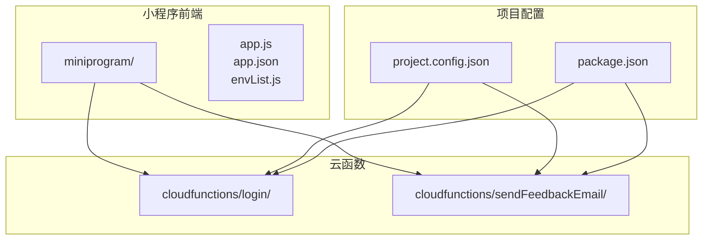
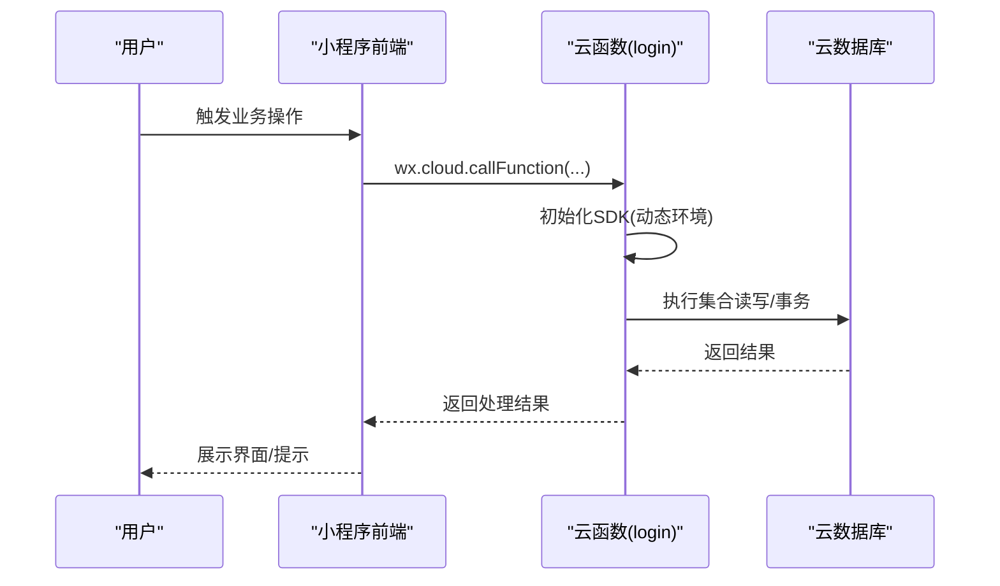
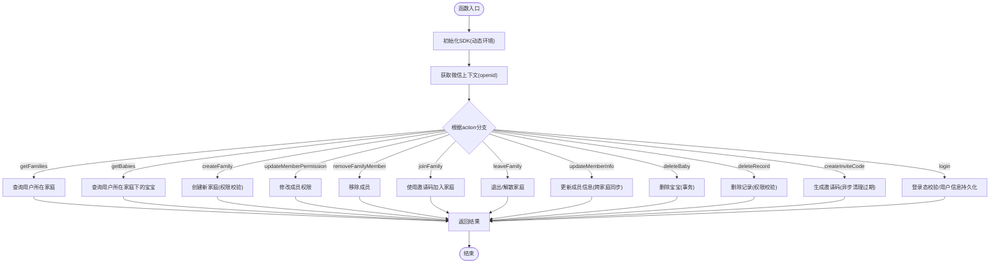
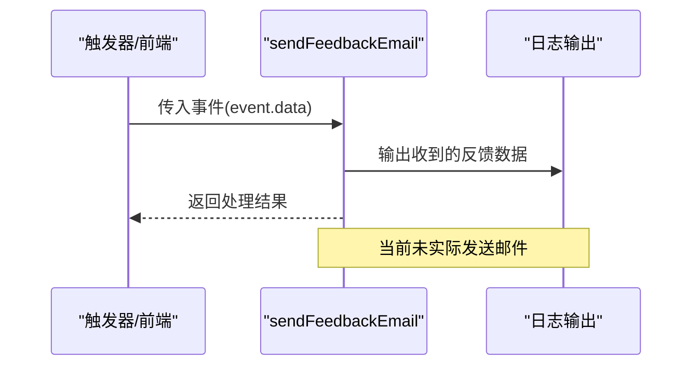
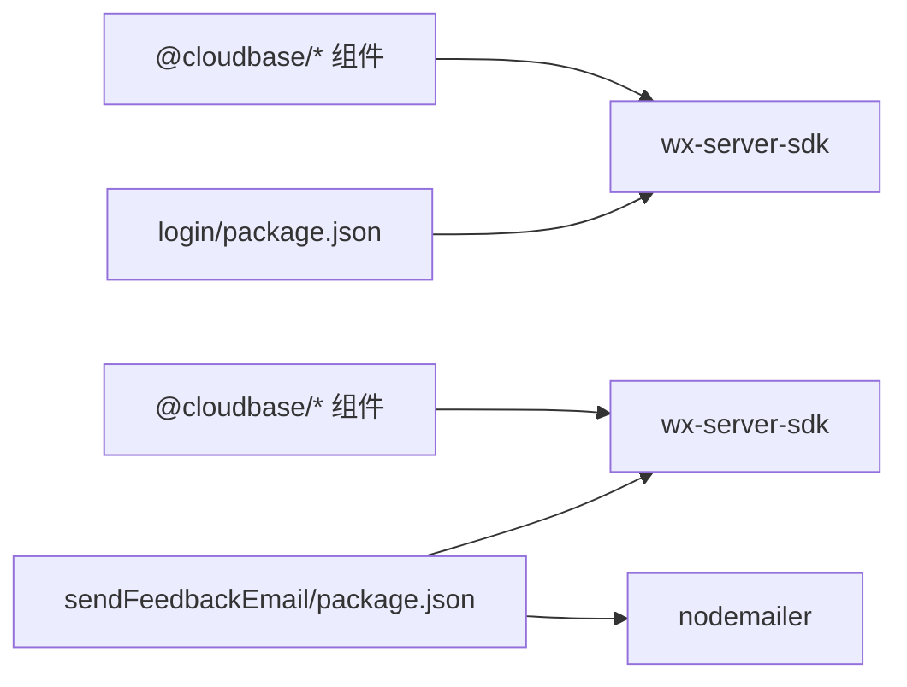
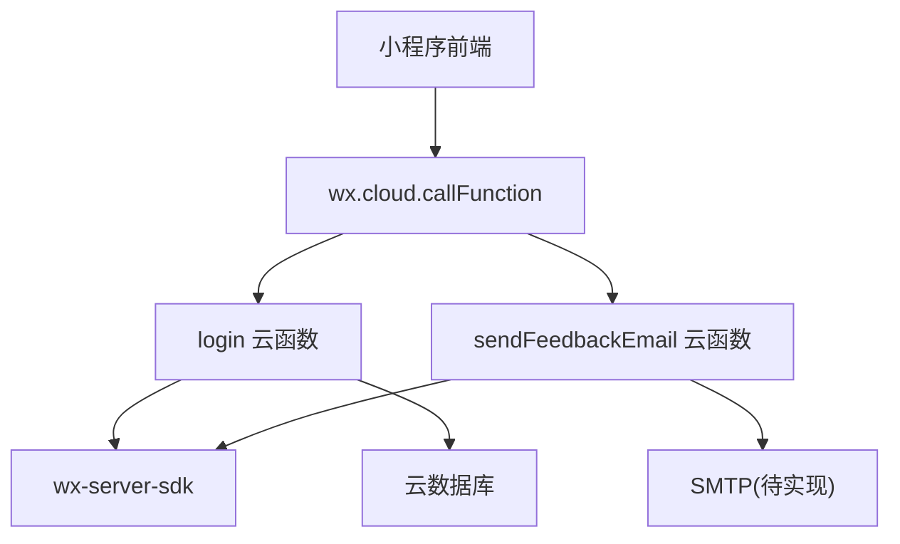

# 云函数部署与配置

<cite>
**本文档引用的文件**
- [cloudfunctions/login/index.js](file://cloudfunctions/login/index.js)
- [cloudfunctions/login/package.json](file://cloudfunctions/login/package.json)
- [cloudfunctions/login/package-lock.json](file://cloudfunctions/login/package-lock.json)
- [cloudfunctions/sendFeedbackEmail/index.js](file://cloudfunctions/sendFeedbackEmail/index.js)
- [cloudfunctions/sendFeedbackEmail/package.json](file://cloudfunctions/sendFeedbackEmail/package.json)
- [cloudfunctions/sendFeedbackEmail/package-lock.json](file://cloudfunctions/sendFeedbackEmail/package-lock.json)
- [uploadCloudFunction.sh](file://uploadCloudFunction.sh)
- [project.config.json](file://project.config.json)
- [README.md](file://README.md)
- [miniprogram/envList.js](file://miniprogram/envList.js)
- [package.json](file://package.json)
</cite>

## 目录
1. [简介](#简介)
2. [项目结构](#项目结构)
3. [核心组件](#核心组件)
4. [架构总览](#架构总览)
5. [详细组件分析](#详细组件分析)
6. [依赖关系分析](#依赖关系分析)
7. [性能考虑](#性能考虑)
8. [故障排查指南](#故障排查指南)
9. [结论](#结论)
10. [附录](#附录)

## 简介
本文件面向“宝宝助手”小程序的云函数部署与配置，目标是帮助开发者独立完成云函数的部署、配置与维护工作。内容涵盖：
- 云函数部署流程与配置管理
- 环境变量设置与数据库连接
- 第三方服务集成（如邮件发送）
- 自动化部署脚本与命令行工具使用
- 多环境部署策略与最佳实践
- 故障排查、性能监控与日志分析方法

## 项目结构
项目采用“小程序前端 + 云函数”的分层结构，云函数位于 cloudfunctions 目录下，每个子目录代表一个独立的云函数；小程序前端位于 miniprogram 目录；项目配置由 project.config.json 管理。

**图示来源**
- [project.config.json:1-85](file://project.config.json#L1-L85)
- [package.json:1-22](file://package.json#L1-L22)

**章节来源**
- [project.config.json:1-85](file://project.config.json#L1-L85)
- [README.md:77-103](file://README.md#L77-L103)

## 核心组件
- 登录与家庭管理云函数（login）
  - 支持微信登录态校验、用户信息管理、家庭与宝宝数据的增删改查、权限控制、邀请码机制等。
  - 依赖微信云开发 SDK，使用动态环境变量初始化。
- 反馈邮件云函数（sendFeedbackEmail）
  - 当前为占位实现，接收事件参数并返回处理结果，后续可接入邮件服务。

**章节来源**
- [cloudfunctions/login/index.js:1-814](file://cloudfunctions/login/index.js#L1-L814)
- [cloudfunctions/sendFeedbackEmail/index.js:1-21](file://cloudfunctions/sendFeedbackEmail/index.js#L1-L21)

## 架构总览
云函数与小程序前端通过微信云开发平台交互，前端通过 wx.request 调用云函数，云函数通过 wx-server-sdk 访问云数据库与执行业务逻辑。

**图示来源**
- [cloudfunctions/login/index.js:4-6](file://cloudfunctions/login/index.js#L4-L6)
- [cloudfunctions/login/index.js:22-800](file://cloudfunctions/login/index.js#L22-L800)

## 详细组件分析

### 登录与家庭管理云函数（login）
- 初始化与上下文
  - 使用动态环境变量初始化 SDK，确保在不同环境下自动识别目标环境。
- 主要能力
  - 用户登录态获取与用户信息持久化
  - 家庭创建、加入、退出、成员权限管理
  - 宝宝信息管理与成长记录管理
  - 邀请码生成与清理
  - 事务保证关键操作的数据一致性
- 关键数据流
  - 通过 wxContext 获取用户标识，结合数据库集合 families、babies、records、users、inviteCodes 实现业务闭环。

**图示来源**
- [cloudfunctions/login/index.js:22-800](file://cloudfunctions/login/index.js#L22-L800)

**章节来源**
- [cloudfunctions/login/index.js:1-814](file://cloudfunctions/login/index.js#L1-L814)
- [cloudfunctions/login/package.json:1-16](file://cloudfunctions/login/package.json#L1-L16)

### 反馈邮件云函数（sendFeedbackEmail）
- 当前实现
  - 从事件中提取 data 参数并打印日志，返回处理结果；暂未实现邮件发送逻辑。
- 扩展建议
  - 引入 nodemailer 并配置 SMTP 凭据，通过环境变量注入敏感信息。
  - 在云函数中读取 process.env 发送邮件。

**图示来源**
- [cloudfunctions/sendFeedbackEmail/index.js:1-21](file://cloudfunctions/sendFeedbackEmail/index.js#L1-L21)

**章节来源**
- [cloudfunctions/sendFeedbackEmail/index.js:1-21](file://cloudfunctions/sendFeedbackEmail/index.js#L1-L21)
- [cloudfunctions/sendFeedbackEmail/package.json:1-16](file://cloudfunctions/sendFeedbackEmail/package.json#L1-L16)

### 依赖管理与包配置
- login 云函数
  - 依赖 wx-server-sdk，用于云开发能力访问。
  - 锁定文件包含 @cloudbase/* 生态组件，确保版本一致性。
- sendFeedbackEmail 云函数
  - 依赖 wx-server-sdk 与 nodemailer，便于后续邮件发送能力扩展。

**图示来源**
- [cloudfunctions/login/package.json:12-14](file://cloudfunctions/login/package.json#L12-L14)
- [cloudfunctions/login/package-lock.json:1-800](file://cloudfunctions/login/package-lock.json#L1-L800)
- [cloudfunctions/sendFeedbackEmail/package.json:9-12](file://cloudfunctions/sendFeedbackEmail/package.json#L9-L12)
- [cloudfunctions/sendFeedbackEmail/package-lock.json:1-800](file://cloudfunctions/sendFeedbackEmail/package-lock.json#L1-L800)

**章节来源**
- [cloudfunctions/login/package.json:1-16](file://cloudfunctions/login/package.json#L1-L16)
- [cloudfunctions/sendFeedbackEmail/package.json:1-16](file://cloudfunctions/sendFeedbackEmail/package.json#L1-L16)

## 依赖关系分析
- 云函数与小程序前端的耦合点
  - 小程序通过 wx.cloud.callFunction 调用云函数，需正确配置云开发环境 ID。
  - 云函数通过 wx-server-sdk 访问云数据库，依赖动态环境变量。
- 云函数之间的内聚性
  - login 云函数承担较多业务逻辑，建议未来拆分为更细粒度的云函数（如用户、家庭、宝宝、记录等），提升可维护性与可测试性。

**图示来源**
- [cloudfunctions/login/index.js:4-6](file://cloudfunctions/login/index.js#L4-L6)
- [cloudfunctions/sendFeedbackEmail/index.js:4-4](file://cloudfunctions/sendFeedbackEmail/index.js#L4-L4)

**章节来源**
- [cloudfunctions/login/index.js:1-814](file://cloudfunctions/login/index.js#L1-L814)
- [cloudfunctions/sendFeedbackEmail/index.js:1-21](file://cloudfunctions/sendFeedbackEmail/index.js#L1-L21)

## 性能考虑
- 冷启动优化
  - 合理拆分云函数，避免单函数体积过大导致冷启动时间增加。
  - 将静态依赖与动态逻辑分离，减少不必要的模块加载。
- 数据库访问
  - 使用批量查询与聚合命令，减少往返次数。
  - 对高频查询建立索引，避免全表扫描。
- 日志与监控
  - 在关键路径添加结构化日志，便于定位性能瓶颈。
  - 结合云开发平台的日志与监控面板，观察耗时与错误率。

## 故障排查指南
- 环境变量缺失
  - 症状：云函数初始化失败或数据库连接异常。
  - 排查：确认环境变量是否正确设置；对于现有函数更新环境变量时，需先查询再合并，避免覆盖。
- 权限不足
  - 症状：家庭/宝宝/记录操作报无权限。
  - 排查：核对用户 openid 与家庭成员权限字段，确保调用方具备相应角色。
- 邀请码问题
  - 症状：邀请码无效或已过期。
  - 排查：检查邀请码集合状态与过期时间，确认清理任务是否正常执行。
- 邮件发送失败
  - 症状：反馈邮件云函数无实际发送。
  - 排查：检查 SMTP 配置与凭据是否通过环境变量正确注入，确认网络与域名白名单设置。

**章节来源**
- [.agents\skills\cloudbase\references\cloud-functions\SKILL.md:600-778](file://.agents/skills/cloudbase/references/cloud-functions/SKILL.md#L600-L778)
- [cloudfunctions/sendFeedbackEmail/index.js:14-19](file://cloudfunctions/sendFeedbackEmail/index.js#L14-L19)

## 结论
通过本文档，开发者可以基于现有项目结构与云函数实现，完成云函数的部署、配置与维护。建议在生产环境中：
- 明确多环境划分（开发/测试/生产），严格区分环境变量与数据库集合。
- 将 login 云函数进一步拆分，提升可维护性与可观测性。
- 补充 sendFeedbackEmail 的邮件发送能力，并完善日志与监控。

## 附录

### 部署清单
- 本地准备
  - 安装 Node.js 与微信开发者工具
  - 确认项目根目录存在 package.json 与项目配置文件
- 云开发环境
  - 在微信开发者工具中启用云开发，创建或选择环境并复制环境 ID
  - 在云开发控制台创建所需集合：babies、records、users、families、inviteCodes
- 云函数部署
  - 在开发者工具中右键点击 cloudfunctions 下的函数目录，选择“上传并部署”
  - 或使用自动化脚本进行批量部署
- 前端配置
  - 在小程序前端配置中填入正确的云开发环境 ID

**章节来源**
- [README.md:48-76](file://README.md#L48-L76)
- [project.config.json:1-85](file://project.config.json#L1-L85)

### 环境变量配置模板
- 通用模板
  - DATABASE_URL：数据库连接字符串（如适用）
  - API_KEY：第三方服务密钥
  - SMTP_HOST/PORT/USER/PASS：邮件服务配置（sendFeedbackEmail 扩展时使用）
- 设置原则
  - 通过查询函数详情后再合并更新，避免覆盖现有变量

**章节来源**
- [.agents\skills\cloudbase\references\cloud-functions\SKILL.md:600-778](file://.agents/skills/cloudbase/references/cloud-functions/SKILL.md#L600-L778)

### 自动化部署脚本
- 脚本内容
  - 使用安装路径提供的命令行工具，指定环境 ID、项目路径与函数目录进行部署
- 使用建议
  - 在 CI/CD 流水线中调用该脚本，实现自动化部署

**章节来源**
- [uploadCloudFunction.sh:1-1](file://uploadCloudFunction.sh#L1-L1)

### 多环境部署策略与最佳实践
- 环境划分
  - 开发：最小权限与最小数据集，便于联调
  - 测试：与生产隔离的数据库与集合，模拟真实流量
  - 生产：严格的权限控制与审计日志
- 最佳实践
  - 使用环境变量管理配置，禁止硬编码敏感信息
  - 为每个云函数设置合理的超时与并发限制
  - 对关键路径增加重试与降级策略
  - 定期审查与清理过期数据（如邀请码）

**章节来源**
- [.agents\skills\cloudbase\references\cloud-functions\SKILL.md:766-778](file://.agents/skills/cloudbase/references/cloud-functions/SKILL.md#L766-L778)