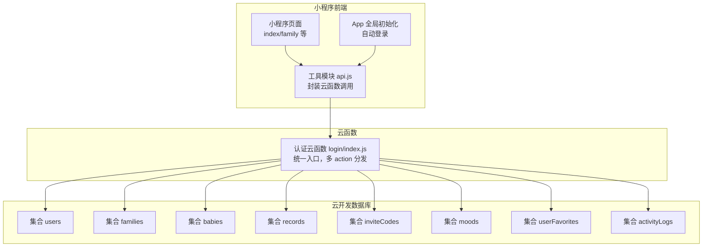
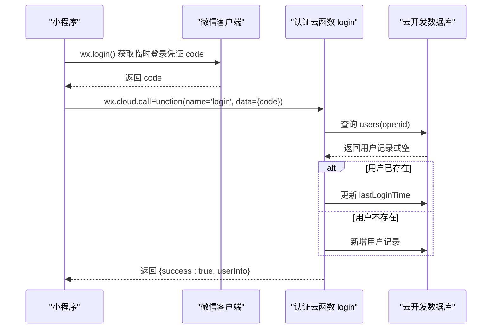
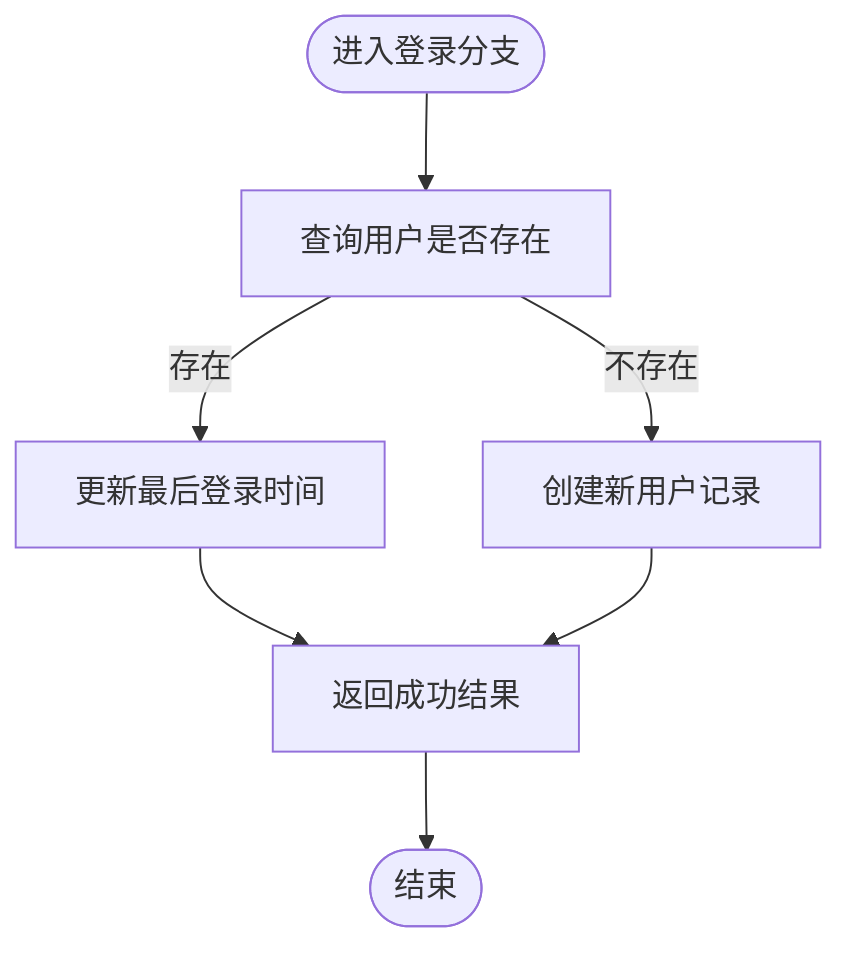
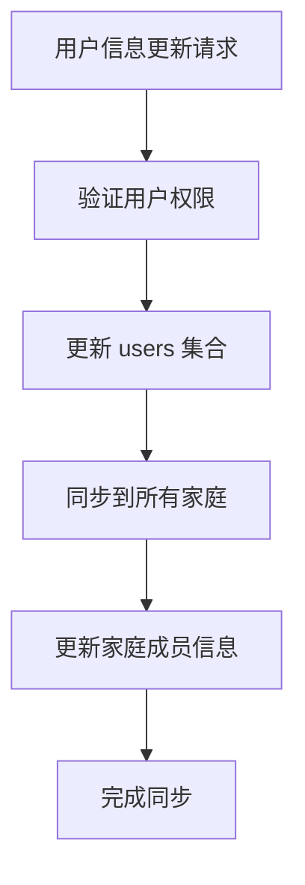
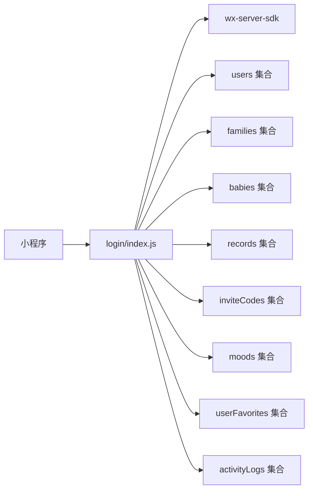

# 认证云函数

<cite>
**本文引用的文件**
- [cloudfunctions/login/index.js](file://cloudfunctions/login/index.js)
- [cloudfunctions/login/package.json](file://cloudfunctions/login/package.json)
- [miniprogram/app.js](file://miniprogram/app.js)
- [miniprogram/utils/api.js](file://miniprogram/utils/api.js)
- [miniprogram/envList.js](file://miniprogram/envList.js)
- [miniprogram/app.json](file://miniprogram/app.json)
- [uploadCloudFunction.sh](file://uploadCloudFunction.sh)
- [wiki/云函数详解/认证云函数.md](file://wiki/云函数详解/认证云函数.md)
- [wiki/API接口文档/用户认证API.md](file://wiki/API接口文档/用户认证API.md)
</cite>

## 更新摘要
**变更内容**
- 新增用户信息同步机制，支持跨家庭用户信息更新
- 增强权限控制策略，特别是用户信息更新的权限验证
- 新增活动日志系统，记录所有重要操作
- 新增心情管理功能，支持宝宝心情评价
- 新增用户收藏功能，支持关注宝宝
- 优化批量操作，新增批量获取最新记录功能
- 新增ASR语音转文字功能（待实现）

## 目录
1. [简介](#简介)
2. [项目结构](#项目结构)
3. [核心组件](#核心组件)
4. [架构总览](#架构总览)
5. [详细组件分析](#详细组件分析)
6. [依赖关系分析](#依赖关系分析)
7. [性能考量](#性能考量)
8. [故障排查指南](#故障排查指南)
9. [结论](#结论)
10. [附录](#附录)

## 简介
本技术文档面向"宝宝助手"小程序的认证云函数，聚焦于登录认证流程、用户信息管理与会话状态维护，系统化梳理云函数入口设计、参数解析、错误处理机制，并深入讲解用户认证流程（通过 code 换取 openid、用户信息查询与创建、最后登录时间更新）等核心逻辑。同时提供完整的 API 接口说明（支持的 action 参数、请求/响应格式、错误码定义），并涵盖云函数部署配置、环境变量设置与权限控制策略，辅以实际调用示例与常见问题解决方案，帮助开发者快速集成与稳定使用认证功能。

**更新** 本次更新反映了认证云函数的重大优化，包括用户信息同步机制、权限控制增强、活动日志系统、心情管理功能等多个新特性的实现。

## 项目结构
该项目采用"小程序前端 + 云函数后端"的分层架构：
- 小程序前端负责用户交互与调用云函数
- 云函数负责用户认证、家庭/宝宝/记录等业务操作与数据库访问
- 数据库存储用户、家庭、宝宝、记录、邀请码、活动日志等实体

**图表来源**
- [cloudfunctions/login/index.js](file://cloudfunctions/login/index.js)
- [miniprogram/utils/api.js](file://miniprogram/utils/api.js)
- [miniprogram/app.js](file://miniprogram/app.js)

**章节来源**
- [cloudfunctions/login/index.js](file://cloudfunctions/login/index.js)
- [miniprogram/utils/api.js](file://miniprogram/utils/api.js)
- [miniprogram/app.js](file://miniprogram/app.js)

## 核心组件
- 云函数入口与统一调度：云函数以单一入口函数接收事件，根据 action 参数分派到不同业务分支，集中处理参数校验、权限校验、数据库操作与错误返回。
- 用户认证与会话：通过微信 code 换取 openid，查询/创建用户记录，更新最后登录时间；小程序端自动触发登录流程并在全局存储 openid。
- 家庭与成员管理：支持创建家庭、加入/退出家庭、成员权限管理、成员信息同步等。
- 宝宝与记录管理：支持查询宝宝列表、获取单个宝宝/记录、删除宝宝与记录、更新宝宝姓名等。
- 邀请码机制：支持生成与清理过期邀请码，配合加入家庭流程。
- **新增** 用户信息同步：支持跨家庭用户信息更新，确保用户昵称和头像在所有家庭中保持一致。
- **新增** 活动日志系统：记录所有重要操作，包括家庭加入/退出、宝宝添加/删除、记录添加/删除、心情评价等。
- **新增** 心情管理：支持宝宝心情评价，包括评分、表情符号、备注等功能。
- **新增** 用户收藏：支持用户关注宝宝，便于快速访问常用宝宝信息。

**章节来源**
- [cloudfunctions/login/index.js](file://cloudfunctions/login/index.js)
- [miniprogram/utils/api.js](file://miniprogram/utils/api.js)
- [miniprogram/app.js](file://miniprogram/app.js)

## 架构总览
认证云函数作为统一入口，承担以下职责：
- 解析请求参数（code、action、数据体等）
- 基于 wxContext 获取 openid
- 根据 action 分派到具体业务逻辑
- 进行权限校验与业务规则校验
- 访问数据库并返回结构化结果
- 统一错误处理与返回格式

**图表来源**
- [cloudfunctions/login/index.js](file://cloudfunctions/login/index.js)
- [miniprogram/app.js](file://miniprogram/app.js)

**章节来源**
- [cloudfunctions/login/index.js](file://cloudfunctions/login/index.js)
- [miniprogram/app.js](file://miniprogram/app.js)

## 详细组件分析

### 云函数入口与参数解析
- 入口函数：导出 main 函数，接收 event 与 context
- 参数解构：从 event 中提取 code、action、babyId、familyId、memberInfo、inviteCodeId、nickName、avatarUrl、inviteCode、memberType 等
- 上下文：通过 cloud.getWXContext() 获取 OPENID 等微信上下文信息
- 统一返回：所有分支最终返回 {success: boolean, ...data} 或 {success: false, error: string}

**章节来源**
- [cloudfunctions/login/index.js](file://cloudfunctions/login/index.js)

### 登录认证流程
- 通过 code 换取 openid 并查询用户表
- 若用户存在：更新 lastLoginTime
- 若用户不存在：生成随机昵称，创建用户记录
- 返回 userInfo（含 openid、昵称、创建/登录时间）

**图表来源**
- [cloudfunctions/login/index.js](file://cloudfunctions/login/index.js)

**章节来源**
- [cloudfunctions/login/index.js](file://cloudfunctions/login/index.js)

### 用户信息同步机制
**新增功能** 系统实现了完整的用户信息同步机制，确保用户在所有家庭中的信息保持一致：

- **跨家庭同步**：当用户更新昵称或头像时，系统会自动同步到用户参与的所有家庭
- **用户集合更新**：同时更新 users 集合中的用户信息
- **权限验证**：仅允许用户更新自己的信息
- **事务保证**：使用数据库事务确保数据一致性

**图表来源**
- [cloudfunctions/login/index.js](file://cloudfunctions/login/index.js)

**章节来源**
- [cloudfunctions/login/index.js](file://cloudfunctions/login/index.js)

### 家庭与成员管理
- 创建家庭：校验名称长度、用户创建数量上限、加入家庭数量上限，分配颜色索引，写入 families 集合
- 加入/退出家庭：加入时校验邀请码有效性与过期、成员去重、同步用户昵称/头像；退出时若为创建者则级联删除家庭及所有宝宝与记录
- 成员权限：仅一级助教可修改权限与移除成员，且不可修改创建者权限
- 成员信息更新：仅允许更新自己的昵称/头像，并同步到其他家庭

**章节来源**
- [cloudfunctions/login/index.js](file://cloudfunctions/login/index.js)

### 宝宝与记录管理
- 删除宝宝：使用事务确保原子性，先校验存在与权限，再删除宝宝与关联记录
- 删除记录：校验记录/宝宝/家庭存在性与权限（一级助教可删任意记录，二级助教仅可删自己录入的记录）
- 获取宝宝/记录：校验用户是否为家庭成员，按家庭顺序与时间排序返回

**章节来源**
- [cloudfunctions/login/index.js](file://cloudfunctions/login/index.js)

### 邀请码机制
- 生成邀请码：仅一级/二级助教可生成，有效期 12 小时，异步清理过期邀请码
- 清理过期邀请码：后台扫描并删除过期条目

**章节来源**
- [cloudfunctions/login/index.js](file://cloudfunctions/login/index.js)

### 权限控制策略
- 角色等级：viewer（围观）< caretaker（二级助教）< guardian（一级助教）
- 权限校验：在涉及删除/修改/移除等敏感操作前，均需验证当前用户在目标家庭中的权限等级
- **新增** 用户信息更新权限：仅允许用户更新自己的信息，且需验证用户在目标家庭中的权限

**章节来源**
- [cloudfunctions/login/index.js](file://cloudfunctions/login/index.js)
- [miniprogram/utils/api.js](file://miniprogram/utils/api.js)

### 活动日志系统
**新增功能** 系统实现了完整的活动日志记录功能：

- **日志类型**：支持 family（家庭相关）、record（记录相关）、mood（心情相关）等不同类型
- **操作记录**：记录所有重要操作，包括加入/退出家庭、添加/删除宝宝、添加/删除记录、添加/删除心情等
- **权限验证**：仅允许家庭成员查看相关日志
- **分页查询**：支持按时间倒序分页查询日志

**章节来源**
- [cloudfunctions/login/index.js](file://cloudfunctions/login/index.js)

### 心情管理功能
**新增功能** 系统实现了完整的宝宝心情评价功能：

- **评分系统**：支持1-5星评分
- **表情符号**：支持多种表情符号表达心情
- **备注功能**：支持添加备注，支持多条备注历史
- **权限控制**：仅家庭成员可评价，权限不足时无法修改他人评价
- **日志记录**：每次评价都会生成相应的活动日志

**章节来源**
- [cloudfunctions/login/index.js](file://cloudfunctions/login/index.js)

### 用户收藏功能
**新增功能** 系统实现了用户关注宝宝的功能：

- **关注管理**：用户可以关注感兴趣的宝宝
- **权限验证**：仅允许查看有权限的家庭中的宝宝
- **快速访问**：支持获取用户关注的宝宝列表

**章节来源**
- [cloudfunctions/login/index.js](file://cloudfunctions/login/index.js)

### 批量操作优化
**新增功能** 系统优化了批量操作性能：

- **批量获取最新记录**：支持一次性获取多个宝宝的最新记录
- **权限预检查**：在客户端进行权限预检查，减少无效请求
- **数据缓存**：实现智能缓存机制，提升数据访问性能

**章节来源**
- [cloudfunctions/login/index.js](file://cloudfunctions/login/index.js)

### 错误处理机制
- 参数缺失：返回 {success: false, error: '缺少必要参数'}
- 业务异常：抛出错误并捕获，返回 {success: false, error: message}
- 数据库异常：捕获并记录日志，返回统一错误格式

**章节来源**
- [cloudfunctions/login/index.js](file://cloudfunctions/login/index.js)

## 依赖关系分析
- 云函数依赖：wx-server-sdk（用于初始化、数据库访问、事务）
- 前端依赖：小程序基础库（2.2.3+）与云开发 SDK
- 数据库集合：users、families、babies、records、inviteCodes、moods、userFavorites、activityLogs

**图表来源**
- [cloudfunctions/login/index.js](file://cloudfunctions/login/index.js)
- [miniprogram/utils/api.js](file://miniprogram/utils/api.js)

**章节来源**
- [cloudfunctions/login/package.json](file://cloudfunctions/login/package.json)
- [cloudfunctions/login/index.js](file://cloudfunctions/login/index.js)
- [miniprogram/utils/api.js](file://miniprogram/utils/api.js)

## 性能考量
- 数据库查询优化：对常用查询字段建立索引（如 openid、familyId、createTime 等）
- 批量操作：在需要一致性时使用事务（如删除宝宝）
- 异步清理：清理过期邀请码采用异步方式，避免阻塞主流程
- 前端缓存：小程序端在全局存储 openid，减少重复登录开销
- **新增** 批量获取优化：新增批量获取最新记录功能，减少客户端N+1请求
- **新增** 缓存策略：实现智能缓存机制，提升数据访问性能

**章节来源**
- [cloudfunctions/login/index.js](file://cloudfunctions/login/index.js)
- [miniprogram/app.js](file://miniprogram/app.js)
- [miniprogram/utils/api.js](file://miniprogram/utils/api.js)

## 故障排查指南
- 登录失败
  - 检查小程序是否使用 2.2.3+ 基础库并正确初始化云开发
  - 确认云函数已部署并名称为 login
  - 查看小程序端控制台错误日志
- 权限不足
  - 确认当前用户在目标家庭中的角色等级
  - 检查 action 是否需要更高权限（如删除记录需一级/二级助教）
- 数据异常
  - 检查 families/babies/records 集合中是否存在脏数据
  - 对于删除类操作，确认是否使用了事务
- 邀请码无效
  - 检查邀请码是否过期或已被使用
  - 确认加入家庭时的成员类型与数量限制
- **新增** 用户信息同步失败
  - 检查用户是否在目标家庭中
  - 确认用户是否有权限更新信息
  - 查看数据库事务执行情况
- **新增** 活动日志异常
  - 检查 activityLogs 集合中是否存在数据
  - 确认日志权限验证逻辑
  - 查看日志查询分页参数

**章节来源**
- [cloudfunctions/login/index.js](file://cloudfunctions/login/index.js)
- [miniprogram/utils/api.js](file://miniprogram/utils/api.js)
- [miniprogram/app.js](file://miniprogram/app.js)

## 结论
认证云函数以单一入口、多 action 分发的方式，实现了从微信登录到家庭/宝宝/记录全链路的用户认证与权限控制。通过严格的参数校验、权限校验与事务保证，确保了业务逻辑的正确性与数据一致性。结合小程序端的自动登录与全局状态管理，开发者可快速集成认证与核心业务功能。

**更新** 本次重大优化新增了用户信息同步机制、活动日志系统、心情管理功能等多个特性，进一步提升了系统的完整性和用户体验。新的架构设计支持更复杂的多家庭协作场景，为"宝宝助手"应用提供了更加完善的服务能力。

## 附录

### API 接口说明

- 通用请求格式
  - 请求方法：POST（通过 wx.cloud.callFunction 调用）
  - 请求头：无特殊要求
  - 请求体字段
    - code：微信登录临时凭证（登录场景必填）
    - action：字符串，指定具体操作
    - 其他字段：按 action 需求传入（如 babyId、familyId、memberInfo、inviteCode、memberType 等）

- 通用响应格式
  - 成功：{success: true, ...data}
  - 失败：{success: false, error: string}

- 支持的 action 列表与行为
  - getFamilies
    - 功能：获取当前用户所在的所有家庭，按创建者优先与创建时间排序
    - 请求参数：无
    - 返回：{success: true, families: [...]}
  - getBabies
    - 功能：获取当前用户所在家庭的所有宝宝，按家庭顺序与创建时间排序
    - 请求参数：无
    - 返回：{success: true, babies: [...]}
  - **新增** getLatestRecordsByBabyIds
    - 功能：批量获取多个宝宝的最新记录
    - 请求参数：babyIds（数组）
    - 返回：{success: true, latestRecordMap: {...}}
  - createFamily
    - 功能：创建新家庭
    - 请求参数：familyName, userInfo
    - 返回：{success: true, family: {...}}
  - updateFamilyName
    - 功能：修改家庭名称（仅一级助教）
    - 请求参数：familyId, newName, openid
    - 返回：{success: true}
  - updateMemberPermission
    - 功能：修改成员权限（仅一级助教）
    - 请求参数：familyId, memberOpenid, permission, openid
    - 返回：{success: true}
  - removeFamilyMember
    - 功能：移除成员（仅一级助教，不可移除创建者）
    - 请求参数：familyId, memberOpenid, openid
    - 返回：{success: true}
  - joinFamily
    - 功能：通过邀请码加入家庭
    - 请求参数：inviteCode, memberInfo
    - 返回：{success: true}
  - leaveFamily
    - 功能：退出家庭（创建者将删除家庭及其所有宝宝与记录）
    - 请求参数：familyId
    - 返回：{success: true}
  - updateMemberInfo
    - 功能：更新成员信息（仅本人），并同步到其他家庭
    - 请求参数：familyId, nickName, avatarUrl
    - 返回：{success: true}
  - **新增** updateUserInfo
    - 功能：更新用户信息（仅本人），并同步到所有家庭
    - 请求参数：nickName, avatarUrl
    - 返回：{success: true}
  - deleteBaby
    - 功能：删除宝宝（事务），仅一级助教可操作
    - 请求参数：babyId
    - 返回：{success: true}
  - deleteRecord
    - 功能：删除记录（一级助教可删任意记录，二级助教仅可删自己录入的记录）
    - 请求参数：recordId
    - 返回：{success: true}
  - getBabyById
    - 功能：获取单个宝宝信息（需为家庭成员）
    - 请求参数：babyId
    - 返回：{success: true, baby: {...}}
  - getRecordsByBabyId
    - 功能：获取宝宝记录（需为家庭成员），按日期降序
    - 请求参数：babyId
    - 返回：{success: true, records: [...]}
  - getRecordById
    - 功能：获取单个记录（需为家庭成员）
    - 请求参数：recordId
    - 返回：{success: true, record: {...}}
  - getFamilyById
    - 功能：获取单个家庭信息（需为家庭成员）
    - 请求参数：familyId
    - 返回：{success: true, family: {...}}
  - createInviteCode
    - 功能：生成邀请码（一级/二级助教），有效期 12 小时
    - 请求参数：familyId, memberType
    - 返回：{success: true, inviteCode: string}
  - updateBabyName
    - 功能：修改宝宝姓名（仅一级助教）
    - 请求参数：babyId, name
    - 返回：{success: true}
  - cleanExpiredInviteCodes
    - 功能：清理过期邀请码
    - 请求参数：无
    - 返回：{success: true, deletedCount: number}
  - login（code）
    - 功能：通过 code 换取 openid，查询/创建用户并更新最后登录时间
    - 请求参数：code
    - 返回：{success: true, userInfo: {...}}
  - **新增** getMoodsByMonth
    - 功能：获取宝宝某月的心情记录
    - 请求参数：babyId, year, month
    - 返回：{success: true, moods: [...]}
  - **新增** getMoodByDate
    - 功能：获取某天的心情记录
    - 请求参数：babyId, date
    - 返回：{success: true, mood: {...}}
  - **新增** addMood
    - 功能：添加或更新心情评价
    - 请求参数：moodInfo（包含 babyId, date, rating, emoji, note）
    - 返回：{success: true, moodId: string, updated: boolean}
  - **新增** deleteMood
    - 功能：删除心情记录（仅一级助教）
    - 请求参数：moodId
    - 返回：{success: true}
  - **新增** deleteMoodNote
    - 功能：删除心情备注条目（仅一级助教）
    - 请求参数：moodId, entryId
    - 返回：{success: true}
  - **新增** getUserFavorites
    - 功能：获取用户关注的宝宝列表
    - 请求参数：无
    - 返回：{success: true, favorites: [...]}
  - **新增** setUserFavorite
    - 功能：添加或更新用户关注的宝宝
    - 请求参数：babyId
    - 返回：{success: true, favoriteId: string}
  - **新增** getActivityLogs
    - 功能：获取家庭活动日志
    - 请求参数：familyId, page, pageSize
    - 返回：{success: true, logs: [...]}
  - **新增** getActivityLogsByBaby
    - 功能：获取宝宝相关的活动日志（最近30天）
    - 请求参数：babyId, page, pageSize
    - 返回：{success: true, logs: [...]}
  - **新增** transcribeMoodNoteAudio
    - 功能：心情备注录音转文字（待实现）
    - 请求参数：fileID
    - 返回：{success: true, text: string, transcribeAvailable: boolean}

- 错误码定义
  - 缺少必要参数：返回 {success: false, error: '缺少必要参数'}
  - 业务异常：返回 {success: false, error: 具体错误消息}
  - 数据库异常：捕获并返回统一错误格式

**章节来源**
- [cloudfunctions/login/index.js](file://cloudfunctions/login/index.js)
- [miniprogram/utils/api.js](file://miniprogram/utils/api.js)

### 部署与环境配置

- 云函数部署
  - 使用命令行工具部署认证云函数，脚本示例见 uploadCloudFunction.sh
  - 确保云函数名称为 login，与小程序端调用一致

- 环境变量
  - 小程序端环境 ID：在 app.js 中通过 globalData.env 指定
  - 云开发环境 ID：在部署脚本 uploadCloudFunction.sh 中通过 envId 指定

- 权限控制策略
  - 数据库安全规则：建议为 users/families/babies/records/inviteCodes/moods/userFavorites/activityLogs 设置最小权限访问规则
  - 云函数权限：仅允许小程序调用，避免公网直接访问

**章节来源**
- [uploadCloudFunction.sh](file://uploadCloudFunction.sh)
- [miniprogram/app.js](file://miniprogram/app.js)
- [miniprogram/envList.js](file://miniprogram/envList.js)

### 实际调用示例

- 小程序端自动登录
  - 在 App.onLaunch 中初始化云开发并触发登录
  - 登录成功后将 openid 写入全局存储

- 获取宝宝列表
  - 通过 wx.cloud.callFunction 调用 login，action=getBabies
  - 返回成功后渲染页面

- 删除宝宝
  - 通过 wx.cloud.callFunction 调用 login，action=deleteBaby，传入 babyId
  - 使用事务确保原子性

- **新增** 批量获取最新记录
  - 通过 wx.cloud.callFunction 调用 login，action=getLatestRecordsByBabyIds，传入 babyIds 数组
  - 返回成功后处理 latestRecordMap 映射

- **新增** 用户信息同步
  - 通过 wx.cloud.callFunction 调用 login，action=updateUserInfo，传入 nickName 和/或 avatarUrl
  - 系统自动同步到所有家庭

**章节来源**
- [miniprogram/app.js](file://miniprogram/app.js)
- [miniprogram/utils/api.js](file://miniprogram/utils/api.js)