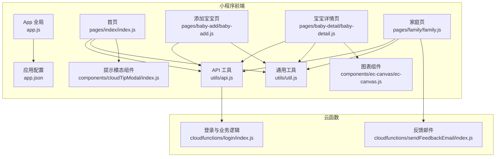
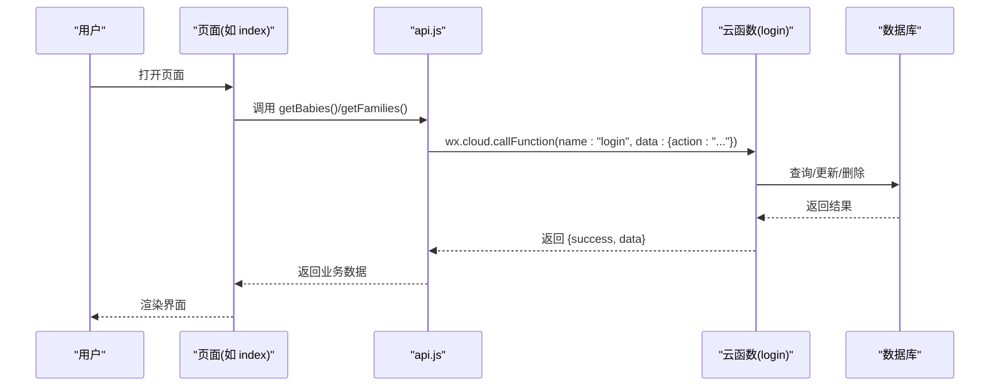
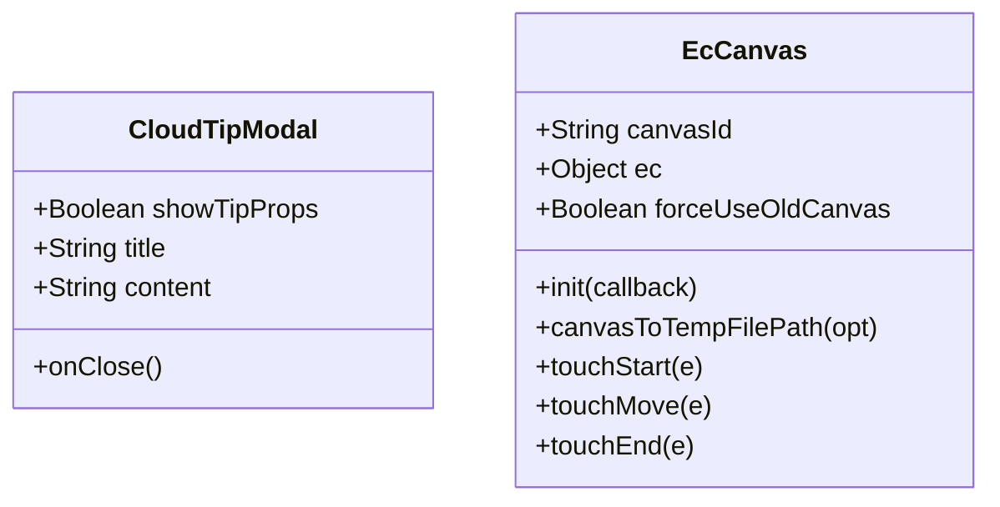
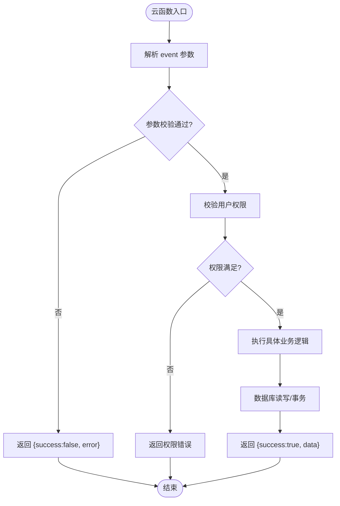
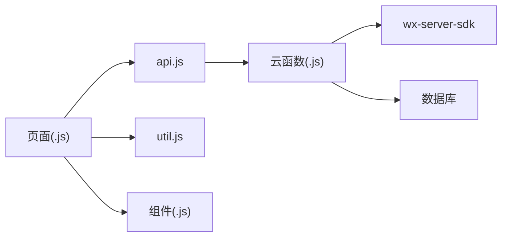

# 代码规范

<cite>
**本文引用的文件**
- [miniprogram/app.js](file://miniprogram/app.js)
- [miniprogram/app.json](file://miniprogram/app.json)
- [miniprogram/utils/api.js](file://miniprogram/utils/api.js)
- [miniprogram/utils/util.js](file://miniprogram/utils/util.js)
- [miniprogram/pages/index/index.js](file://miniprogram/pages/index/index.js)
- [miniprogram/pages/baby-add/baby-add.js](file://miniprogram/pages/baby-add/baby-add.js)
- [miniprogram/pages/baby-detail/baby-detail.js](file://miniprogram/pages/baby-detail/baby-detail.js)
- [miniprogram/pages/family/family.js](file://miniprogram/pages/family/family.js)
- [miniprogram/components/cloudTipModal/index.js](file://miniprogram/components/cloudTipModal/index.js)
- [miniprogram/components/ec-canvas/ec-canvas.js](file://miniprogram/components/ec-canvas/ec-canvas.js)
- [cloudfunctions/login/index.js](file://cloudfunctions/login/index.js)
- [cloudfunctions/sendFeedbackEmail/index.js](file://cloudfunctions/sendFeedbackEmail/index.js)
- [miniprogram/envList.js](file://miniprogram/envList.js)
- [package.json](file://package.json)
</cite>

## 目录
1. [简介](#简介)
2. [项目结构](#项目结构)
3. [核心组件](#核心组件)
4. [架构总览](#架构总览)
5. [详细组件分析](#详细组件分析)
6. [依赖关系分析](#依赖关系分析)
7. [性能考虑](#性能考虑)
8. [故障排查指南](#故障排查指南)
9. [结论](#结论)
10. [附录](#附录)

## 简介
本规范旨在为“宝宝助手”小程序提供统一的开发标准与质量保障，覆盖 JavaScript 编码规范、小程序页面与组件组织、数据管理策略、云函数开发规范以及异步处理最佳实践。通过明确命名约定、格式化风格、注释规范与错误处理模式，帮助团队提升协作效率与代码可维护性。

## 项目结构
项目采用典型的微信小程序目录结构，前端页面与组件位于 miniprogram 目录，云函数位于 cloudfunctions 目录，公共工具方法集中在 utils 目录，页面通过 api.js 统一调用云函数或云数据库，实现前后端职责分离与权限控制。

**图表来源**
- [miniprogram/app.js:1-56](file://miniprogram/app.js#L1-L56)
- [miniprogram/app.json:1-39](file://miniprogram/app.json#L1-L39)
- [miniprogram/utils/api.js:1-879](file://miniprogram/utils/api.js#L1-L879)
- [miniprogram/utils/util.js:1-55](file://miniprogram/utils/util.js#L1-L55)
- [miniprogram/pages/index/index.js:1-144](file://miniprogram/pages/index/index.js#L1-L144)
- [miniprogram/pages/baby-add/baby-add.js:1-120](file://miniprogram/pages/baby-add/baby-add.js#L1-L120)
- [miniprogram/pages/baby-detail/baby-detail.js:1-691](file://miniprogram/pages/baby-detail/baby-detail.js#L1-L691)
- [miniprogram/pages/family/family.js:1-757](file://miniprogram/pages/family/family.js#L1-L757)
- [miniprogram/components/cloudTipModal/index.js:1-29](file://miniprogram/components/cloudTipModal/index.js#L1-L29)
- [miniprogram/components/ec-canvas/ec-canvas.js:1-285](file://miniprogram/components/ec-canvas/ec-canvas.js#L1-L285)
- [cloudfunctions/login/index.js:1-814](file://cloudfunctions/login/index.js#L1-L814)
- [cloudfunctions/sendFeedbackEmail/index.js:1-21](file://cloudfunctions/sendFeedbackEmail/index.js#L1-L21)

**章节来源**
- [miniprogram/app.js:1-56](file://miniprogram/app.js#L1-L56)
- [miniprogram/app.json:1-39](file://miniprogram/app.json#L1-L39)

## 核心组件
- 应用启动与全局状态：在 App 中初始化云环境、检查登录状态并调用云函数完成登录流程，全局共享用户信息与环境标识。
- 页面层：各页面负责视图渲染与交互，通过 api.js 统一发起网络请求，避免直接访问数据库。
- 工具层：api.js 封装业务接口，util.js 提供日期与年龄计算等通用方法；两者共同承担数据转换与权限校验前置工作。
- 组件层：提供可复用的提示模态与图表组件，降低页面复杂度。
- 云函数层：login 负责用户与家庭/宝宝/记录等业务操作，sendFeedbackEmail 负责接收反馈并暂存处理结果。

**章节来源**
- [miniprogram/app.js:1-56](file://miniprogram/app.js#L1-L56)
- [miniprogram/utils/api.js:1-879](file://miniprogram/utils/api.js#L1-L879)
- [miniprogram/utils/util.js:1-55](file://miniprogram/utils/util.js#L1-L55)
- [miniprogram/components/cloudTipModal/index.js:1-29](file://miniprogram/components/cloudTipModal/index.js#L1-L29)
- [miniprogram/components/ec-canvas/ec-canvas.js:1-285](file://miniprogram/components/ec-canvas/ec-canvas.js#L1-L285)
- [cloudfunctions/login/index.js:1-814](file://cloudfunctions/login/index.js#L1-L814)
- [cloudfunctions/sendFeedbackEmail/index.js:1-21](file://cloudfunctions/sendFeedbackEmail/index.js#L1-L21)

## 架构总览
小程序前端通过 wx.cloud.callFunction 调用云函数，云函数使用 wx-server-sdk 访问数据库与云存储，实现权限校验与业务逻辑集中化。

**图表来源**
- [miniprogram/pages/index/index.js:14-52](file://miniprogram/pages/index/index.js#L14-L52)
- [miniprogram/utils/api.js:44-75](file://miniprogram/utils/api.js#L44-L75)
- [cloudfunctions/login/index.js:22-92](file://cloudfunctions/login/index.js#L22-L92)

## 详细组件分析

### JavaScript 编码规范
- 命名约定
  - 变量与函数：采用小驼峰命名，语义清晰，如 waitForLogin、getBabies、calculateAge。
  - 类型导出：模块导出使用 module.exports，保持一致的对外接口风格。
  - 云函数入口：export.main 作为统一入口，便于平台识别。
- 代码缩进与格式
  - 统一使用 2 空格缩进，避免混用制表符。
  - 逗号与运算符后空格，括号内侧不冗余空格。
  - 行尾不保留多余空格，文件末尾保留一个空行。
- 注释规范
  - 函数/模块顶部提供简要功能说明与参数说明。
  - 关键分支与复杂逻辑处补充注释，解释业务背景或边界条件。
  - TODO/注意点使用注释标记，便于后续跟进。
- 异步处理最佳实践
  - 使用 async/await 串行化请求，减少回调地狱。
  - 对外暴露的 Promise 方法统一返回 {success, data|error} 结构，便于上层统一处理。
  - 错误捕获后统一记录日志并提示用户，避免静默失败。

**章节来源**
- [miniprogram/utils/util.js:1-55](file://miniprogram/utils/util.js#L1-L55)
- [miniprogram/utils/api.js:1-879](file://miniprogram/utils/api.js#L1-L879)
- [cloudfunctions/login/index.js:1-814](file://cloudfunctions/login/index.js#L1-L814)

### 小程序页面组织规范
- 页面生命周期
  - onShow/onLoad 中仅做轻量初始化，耗时任务延迟至用户交互或懒加载。
  - 列表页在 onShow 中刷新数据，详情页在 onLoad 时拉取并缓存。
- 数据流
  - 页面通过 api.js 发起请求，避免直接操作数据库。
  - 页面内部使用 setData 合并更新，尽量减少多次 setData 调用。
- 权限控制
  - 在关键操作前调用 api.checkPermission 进行权限校验，避免越权操作。
- 交互提示
  - 成功/失败场景统一使用 wx.showToast，错误信息优先使用用户可理解的语言。

**章节来源**
- [miniprogram/pages/index/index.js:10-52](file://miniprogram/pages/index/index.js#L10-L52)
- [miniprogram/pages/baby-add/baby-add.js:20-44](file://miniprogram/pages/baby-add/baby-add.js#L20-L44)
- [miniprogram/pages/baby-detail/baby-detail.js:170-245](file://miniprogram/pages/baby-detail/baby-detail.js#L170-L245)
- [miniprogram/pages/family/family.js:29-80](file://miniprogram/pages/family/family.js#L29-L80)

### 组件设计原则
- 可复用性：组件通过 properties 与 events 解耦，支持多页面复用。
- 状态最小化：组件内部状态尽量简单，复杂状态由页面管理。
- 生命周期：在 ready 中进行初始化，避免在 attached 中做昂贵操作。
- 图表组件：对 canvas 版本差异进行兼容处理，提供懒加载与事件透传。

**图表来源**
- [miniprogram/components/cloudTipModal/index.js:1-29](file://miniprogram/components/cloudTipModal/index.js#L1-L29)
- [miniprogram/components/ec-canvas/ec-canvas.js:31-275](file://miniprogram/components/ec-canvas/ec-canvas.js#L31-L275)

**章节来源**
- [miniprogram/components/cloudTipModal/index.js:1-29](file://miniprogram/components/cloudTipModal/index.js#L1-L29)
- [miniprogram/components/ec-canvas/ec-canvas.js:1-285](file://miniprogram/components/ec-canvas/ec-canvas.js#L1-L285)

### 数据管理规范
- 页面数据：仅存放渲染所需字段，避免携带冗余业务数据。
- 工具函数：将通用逻辑（如日期格式化、年龄计算）抽取到 util.js，避免重复实现。
- API 抽象：api.js 将数据库直连替换为云函数调用，统一权限校验与错误处理。
- 本地存储：仅用于临时状态或缓存，如 openid、userInfo，避免持久化敏感信息。

**章节来源**
- [miniprogram/utils/util.js:1-55](file://miniprogram/utils/util.js#L1-L55)
- [miniprogram/utils/api.js:1-879](file://miniprogram/utils/api.js#L1-L879)
- [miniprogram/app.js:3-43](file://miniprogram/app.js#L3-L43)

### 文件命名约定
- 页面与组件：采用全小写短横线分隔，如 baby-add、cloud-tip-modal。
- JSON 配置：与对应 JS 文件同名，如 baby-add.json。
- 云函数：采用动词短语或领域名词，如 login、sendFeedbackEmail。
- 工具文件：按功能命名，如 api.js、util.js。

**章节来源**
- [miniprogram/pages/baby-add/baby-add.js:1-120](file://miniprogram/pages/baby-add/baby-add.js#L1-L120)
- [miniprogram/components/cloudTipModal/index.js:1-29](file://miniprogram/components/cloudTipModal/index.js#L1-L29)
- [cloudfunctions/login/index.js:1-814](file://cloudfunctions/login/index.js#L1-L814)
- [cloudfunctions/sendFeedbackEmail/index.js:1-21](file://cloudfunctions/sendFeedbackEmail/index.js#L1-L21)

### 云函数开发规范
- 命名与职责
  - 以业务动作命名，如 getBabies、createFamily、deleteBaby、updateBabyName。
  - 单一职责：每个 action 仅处理一种业务，避免“上帝函数”。
- 参数传递
  - 严格校验必填参数，对字符串长度、数值范围进行前置校验。
  - 对外部输入统一清洗（如 trim），避免脏数据进入数据库。
- 返回值格式
  - 统一返回 { success, data|error } 结构，便于前端统一处理。
- 错误处理
  - 使用 throw new Error(message) 抛出业务异常，云函数捕获后返回统一结构。
  - 对非致命错误（如清理过期邀请码）使用异步清理，不阻塞主流程。
- 权限校验
  - 通过 wxContext.OPENID 与数据库中的成员信息比对，确保操作者具备相应权限。
  - 对关键操作（如删除宝宝、修改家庭名称）使用事务保证一致性。

**图表来源**
- [cloudfunctions/login/index.js:22-800](file://cloudfunctions/login/index.js#L22-L800)

**章节来源**
- [cloudfunctions/login/index.js:1-814](file://cloudfunctions/login/index.js#L1-L814)
- [cloudfunctions/sendFeedbackEmail/index.js:1-21](file://cloudfunctions/sendFeedbackEmail/index.js#L1-L21)

### 具体示例与反例对比
- 示例：页面发起请求
  - 正例：页面调用 api.getBabies，内部通过 wx.cloud.callFunction 调用云函数，统一处理返回结果。
  - 反例：页面直接调用 wx.cloud.database().collection(...).get()，绕过权限校验与业务规则。
- 示例：权限校验
  - 正例：在提交表单前调用 api.checkPermission，根据返回值决定是否允许操作。
  - 反例：直接执行写操作而不检查权限，导致越权修改。
- 示例：错误处理
  - 正例：云函数中对异常使用 throw new Error 并在上层捕获返回统一结构。
  - 反例：忽略异常或直接返回错误对象，导致前端无法统一处理。

**章节来源**
- [miniprogram/utils/api.js:44-75](file://miniprogram/utils/api.js#L44-L75)
- [miniprogram/pages/baby-add/baby-add.js:74-118](file://miniprogram/pages/baby-add/baby-add.js#L74-L118)
- [cloudfunctions/login/index.js:26-48](file://cloudfunctions/login/index.js#L26-L48)

## 依赖关系分析
- 页面依赖 api.js，api.js 再依赖云函数与数据库。
- 组件与页面解耦，通过属性与事件通信。
- 云函数依赖 wx-server-sdk 与数据库命令，内部封装权限与事务。

**图表来源**
- [miniprogram/utils/api.js:1-879](file://miniprogram/utils/api.js#L1-L879)
- [cloudfunctions/login/index.js:1-814](file://cloudfunctions/login/index.js#L1-L814)
- [miniprogram/utils/util.js:1-55](file://miniprogram/utils/util.js#L1-L55)

**章节来源**
- [miniprogram/utils/api.js:1-879](file://miniprogram/utils/api.js#L1-L879)
- [cloudfunctions/login/index.js:1-814](file://cloudfunctions/login/index.js#L1-L814)

## 性能考虑
- 懒加载：图表组件与部分数据在 onShow 或切换标签时再初始化，减少首屏压力。
- 请求合并：在页面中合并多次 setData，避免频繁重绘。
- 云函数幂等：对重复调用进行幂等处理，避免重复创建资源。
- 图片优化：上传前压缩或裁剪，减少带宽与存储成本。

## 故障排查指南
- 登录失败
  - 检查 App 初始化云环境与 wx.login 流程，确认云函数 login 是否正确返回用户信息。
  - 关注前端日志与云函数日志，定位失败节点。
- 权限不足
  - 确认 api.checkPermission 的调用时机与返回值，检查云函数中权限判断逻辑。
- 数据不一致
  - 对关键写操作使用事务，确保原子性；对并发场景增加重试与去重机制。
- 图表渲染异常
  - 检查 canvas 版本兼容与组件初始化时机，确认数据格式与坐标轴范围。

**章节来源**
- [miniprogram/app.js:28-54](file://miniprogram/app.js#L28-L54)
- [miniprogram/utils/api.js:800-852](file://miniprogram/utils/api.js#L800-L852)
- [cloudfunctions/login/index.js:482-510](file://cloudfunctions/login/index.js#L482-L510)
- [miniprogram/components/ec-canvas/ec-canvas.js:52-192](file://miniprogram/components/ec-canvas/ec-canvas.js#L52-L192)

## 结论
通过建立统一的命名规范、页面与组件组织、数据管理策略与云函数开发规范，团队可以在保证功能完整性的同时显著提升代码可读性与可维护性。建议在日常开发中严格执行上述规范，并结合自动化检查工具持续改进。

## 附录
- 环境配置：envList.js 用于环境列表与平台判断，建议在 CI/CD 中注入真实环境变量。
- 项目元信息：package.json 描述项目基本信息，脚本与依赖管理遵循社区最佳实践。

**章节来源**
- [miniprogram/envList.js:1-7](file://miniprogram/envList.js#L1-L7)
- [package.json:1-22](file://package.json#L1-L22)