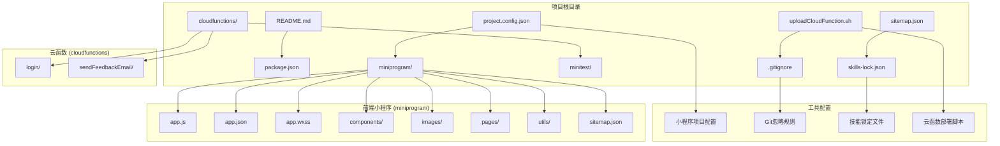
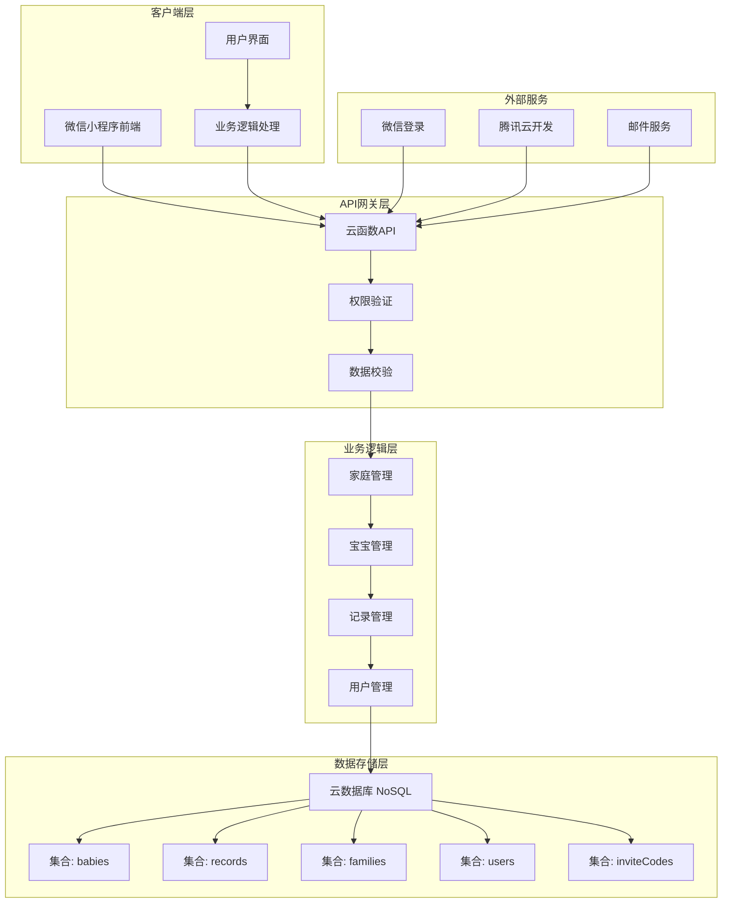
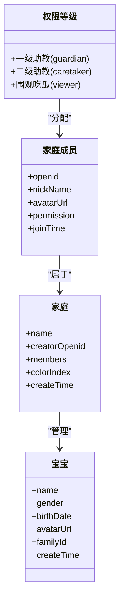
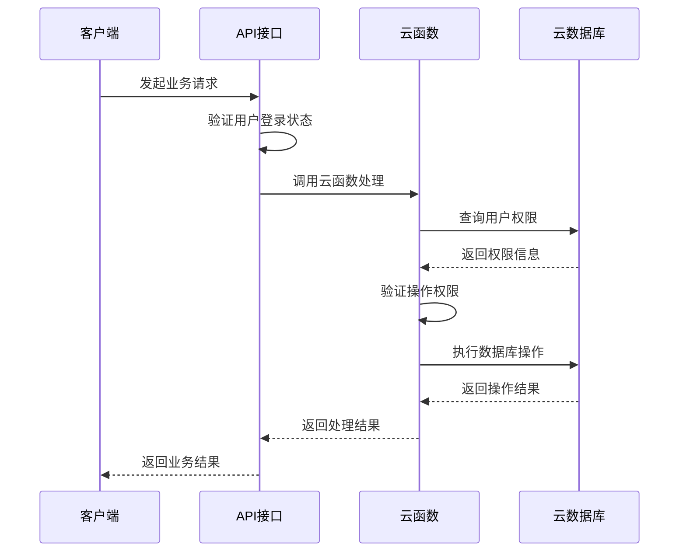
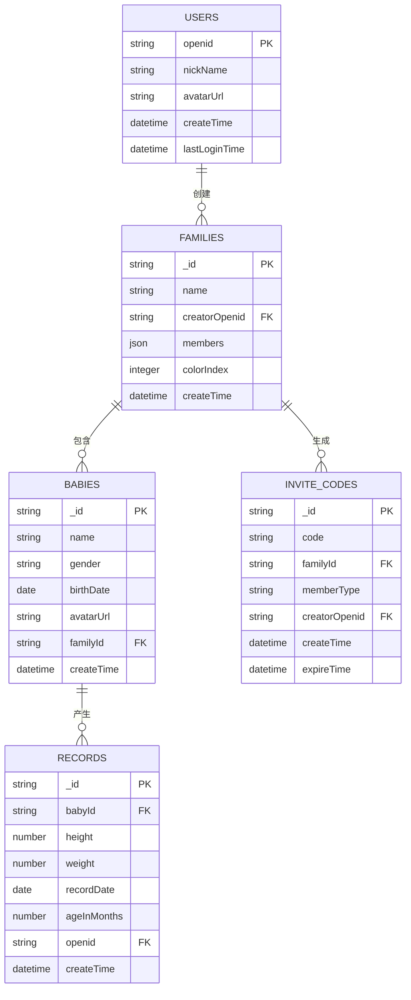
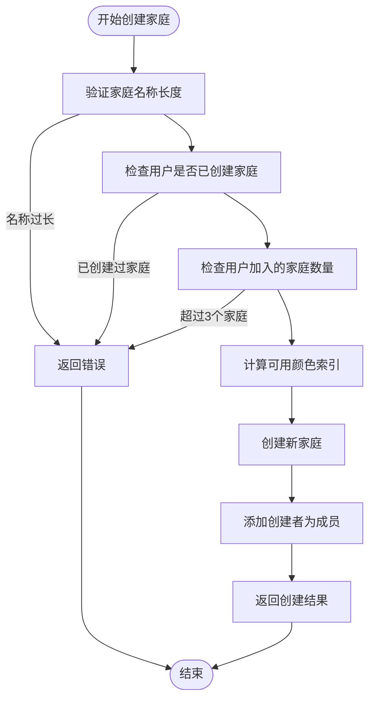
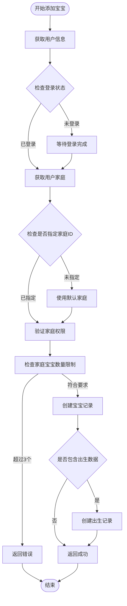
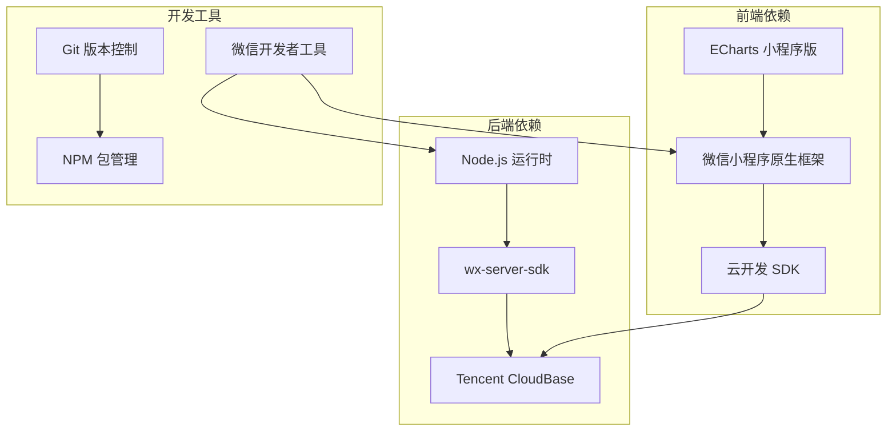

# 团队协作规范指南

<cite>
**本文档引用的文件**
- [README.md](file://README.md)
- [package.json](file://package.json)
- [project.config.json](file://project.config.json)
- [miniprogram/app.json](file://miniprogram/app.json)
- [miniprogram/app.js](file://miniprogram/app.js)
- [miniprogram/envList.js](file://miniprogram/envList.js)
- [miniprogram/utils/api.js](file://miniprogram/utils/api.js)
- [miniprogram/utils/util.js](file://miniprogram/utils/util.js)
- [cloudfunctions/login/package.json](file://cloudfunctions/login/package.json)
- [cloudfunctions/sendFeedbackEmail/package.json](file://cloudfunctions/sendFeedbackEmail/package.json)
- [cloudfunctions/login/index.js](file://cloudfunctions/login/index.js)
- [.agents/skills/cloudbase/references/spec-workflow/SKILL.md](file://.agents/skills/cloudbase/references/spec-workflow/SKILL.md)
</cite>

## 目录
1. [简介](#简介)
2. [项目结构](#项目结构)
3. [核心组件](#核心组件)
4. [架构概览](#架构概览)
5. [详细组件分析](#详细组件分析)
6. [依赖关系分析](#依赖关系分析)
7. [性能考虑](#性能考虑)
8. [故障排除指南](#故障排除指南)
9. [结论](#结论)
10. [附录](#附录)

## 简介

宝宝助手小程序是一个专为家庭设计的宝宝成长记录工具，支持多成员协作，帮助用户轻松追踪宝宝的成长数据。该项目采用微信小程序原生开发框架，结合腾讯云开发（CloudBase）实现云端数据存储和后端逻辑处理。

项目具有以下核心特性：
- 家庭管理：创建家庭、加入家庭、退出家庭、修改家庭名称
- 宝宝信息管理：添加、查看、修改、删除宝宝信息（每个家庭最多3个宝宝）
- 成长记录追踪：记录宝宝的身高、体重等数据
- 成长曲线分析：通过图表直观展示宝宝的成长趋势
- 多成员协作：支持邀请家庭成员，分配不同权限角色
- 多家庭支持：用户可以加入多个家庭，在不同家庭中拥有不同身份
- 用户信息管理：统一管理头像和用户名，同步更新到所有家庭
- 微信一键登录：使用微信账号快速登录
- 云端数据存储：数据安全存储在腾讯云

## 项目结构

项目采用模块化组织方式，主要分为前端小程序和云函数两大部分：

**图表来源**
- [project.config.json:1-85](file://project.config.json#L1-L85)
- [miniprogram/app.json:1-39](file://miniprogram/app.json#L1-L39)

**章节来源**
- [README.md:77-103](file://README.md#L77-L103)
- [project.config.json:1-85](file://project.config.json#L1-L85)

## 核心组件

### 前端应用层

前端应用采用微信小程序原生框架，主要包含以下核心组件：

#### 应用入口 (App)
应用入口负责初始化全局配置和用户登录状态管理。应用启动时会自动检查并执行登录流程，确保用户能够正常访问系统功能。

#### 页面组件
系统包含多个核心页面：
- 首页 (index)：展示用户可访问的宝宝列表
- 宝宝详情 (baby-detail)：显示单个宝宝的详细信息和成长记录
- 添加宝宝 (baby-add)：提供宝宝信息录入表单
- 记录添加 (record-add)：记录宝宝的身高、体重等数据
- 家庭管理 (family)：管理家庭设置和成员权限

#### 工具函数
- API封装：提供统一的数据访问接口，处理用户权限验证和错误处理
- 实用工具：包含日期计算、年龄转换等辅助功能

**章节来源**
- [miniprogram/app.js:1-56](file://miniprogram/app.js#L1-L56)
- [miniprogram/app.json:1-39](file://miniprogram/app.json#L1-L39)
- [miniprogram/utils/api.js:1-800](file://miniprogram/utils/api.js#L1-L800)

### 云函数服务层

云函数采用腾讯云开发平台，提供后端逻辑处理和数据库操作：

#### 登录云函数
处理用户认证、家庭管理、宝宝管理等核心业务逻辑。采用事务处理确保数据一致性，支持复杂的权限验证。

#### 反馈邮件云函数
提供用户反馈邮件发送功能，集成邮件通知机制。

**章节来源**
- [cloudfunctions/login/index.js:1-800](file://cloudfunctions/login/index.js#L1-L800)
- [cloudfunctions/login/package.json:1-16](file://cloudfunctions/login/package.json#L1-L16)

## 架构概览

系统采用前后端分离架构，前端通过云函数API与后端交互：

**图表来源**
- [miniprogram/utils/api.js:1-800](file://miniprogram/utils/api.js#L1-L800)
- [cloudfunctions/login/index.js:1-800](file://cloudfunctions/login/index.js#L1-L800)

## 详细组件分析

### 权限管理系统

系统实现了三级权限控制机制：

**图表来源**
- [cloudfunctions/login/index.js:187-225](file://cloudfunctions/login/index.js#L187-L225)
- [miniprogram/utils/api.js:782-780](file://miniprogram/utils/api.js#L782-L780)

#### 权限验证流程

**图表来源**
- [miniprogram/utils/api.js:14-41](file://miniprogram/utils/api.js#L14-L41)
- [cloudfunctions/login/index.js:22-26](file://cloudfunctions/login/index.js#L22-L26)

**章节来源**
- [cloudfunctions/login/index.js:187-266](file://cloudfunctions/login/index.js#L187-L266)
- [miniprogram/utils/api.js:782-780](file://miniprogram/utils/api.js#L782-L780)

### 数据模型设计

系统采用NoSQL数据库设计，主要数据集合：

**图表来源**
- [cloudfunctions/login/index.js:131-150](file://cloudfunctions/login/index.js#L131-L150)
- [cloudfunctions/login/index.js:483-510](file://cloudfunctions/login/index.js#L483-L510)

**章节来源**
- [cloudfunctions/login/index.js:131-150](file://cloudfunctions/login/index.js#L131-L150)
- [cloudfunctions/login/index.js:483-510](file://cloudfunctions/login/index.js#L483-L510)

### 业务流程分析

#### 家庭创建流程

**图表来源**
- [cloudfunctions/login/index.js:95-151](file://cloudfunctions/login/index.js#L95-L151)

#### 宝宝添加流程

**图表来源**
- [miniprogram/utils/api.js:150-210](file://miniprogram/utils/api.js#L150-L210)

**章节来源**
- [cloudfunctions/login/index.js:95-151](file://cloudfunctions/login/index.js#L95-L151)
- [miniprogram/utils/api.js:150-210](file://miniprogram/utils/api.js#L150-L210)

## 依赖关系分析

### 技术栈依赖

**图表来源**
- [README.md:32-40](file://README.md#L32-L40)
- [cloudfunctions/login/package.json:12-14](file://cloudfunctions/login/package.json#L12-L14)

### 开发环境配置

项目使用多种配置文件来管理开发环境：

**章节来源**
- [project.config.json:1-85](file://project.config.json#L1-L85)
- [miniprogram/envList.js:1-7](file://miniprogram/envList.js#L1-L7)

## 性能考虑

### 前端性能优化

系统采用了多项性能优化措施：
- 懒加载：使用 `lazyCodeLoading` 优化代码包大小
- 响应式设计：适配各种手机屏幕尺寸
- 缓存策略：合理使用本地存储减少网络请求
- 图表优化：ECharts组件优化渲染性能

### 后端性能优化

云函数层面的优化包括：
- 事务处理：确保数据操作的原子性和一致性
- 权限验证：在云函数层面统一处理权限控制
- 数据查询优化：使用索引和合理的查询条件

## 故障排除指南

### 常见问题诊断

#### 登录相关问题
- 检查微信登录状态是否正常
- 验证云函数调用是否成功
- 确认用户信息是否正确存储

#### 权限相关问题
- 验证用户在目标家庭中的权限级别
- 检查家庭成员列表是否包含当前用户
- 确认操作权限是否符合预期

#### 数据访问问题
- 检查数据库连接配置
- 验证集合权限设置
- 确认查询条件是否正确

**章节来源**
- [miniprogram/utils/api.js:14-41](file://miniprogram/utils/api.js#L14-L41)
- [cloudfunctions/login/index.js:22-26](file://cloudfunctions/login/index.js#L22-L26)

## 结论

宝宝助手小程序项目展现了良好的软件工程实践，采用清晰的分层架构和完善的权限管理体系。项目结构合理，技术选型恰当，为后续的功能扩展和维护奠定了坚实基础。

团队协作方面，项目提供了完整的开发流程指导和最佳实践建议，有助于提高开发效率和代码质量。通过实施这些规范，团队可以更好地协调开发工作，确保项目的稳定发展。

## 附录

### 版本历史

项目采用语义化版本控制，主要版本包括：
- v2.1.0：UI优化和功能增强
- v2.0.0：核心功能完整实现
- v1.0.0：基础功能实现

### 贡献指南

项目欢迎社区贡献，支持通过Issue和Pull Request的方式参与项目改进。

**章节来源**
- [README.md:155-194](file://README.md#L155-L194)