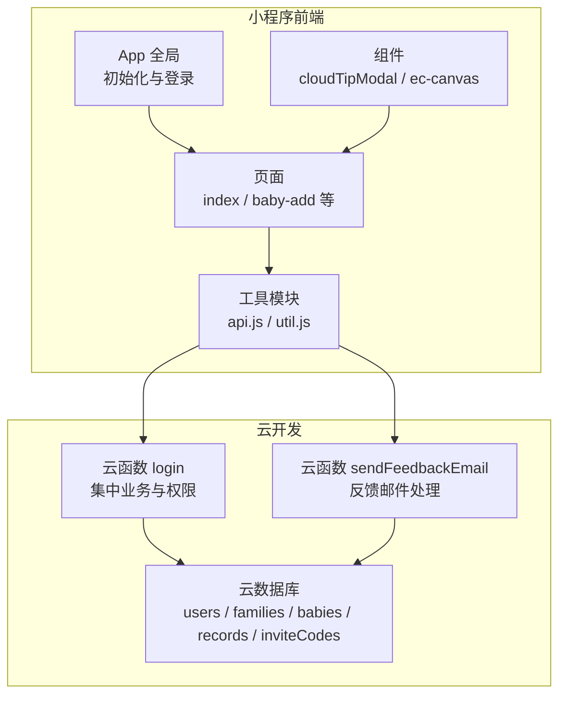
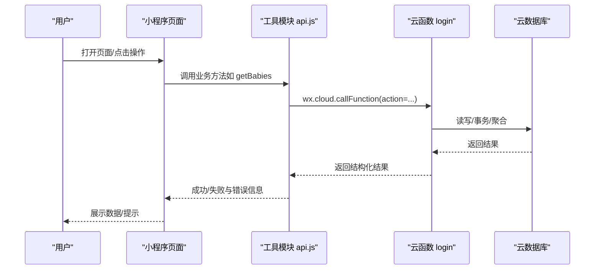
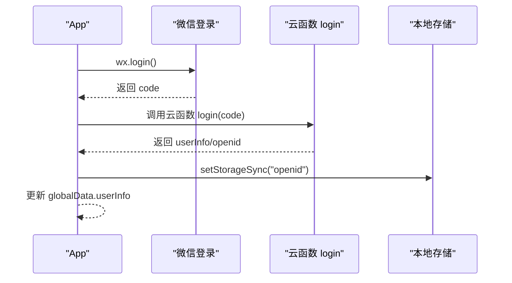
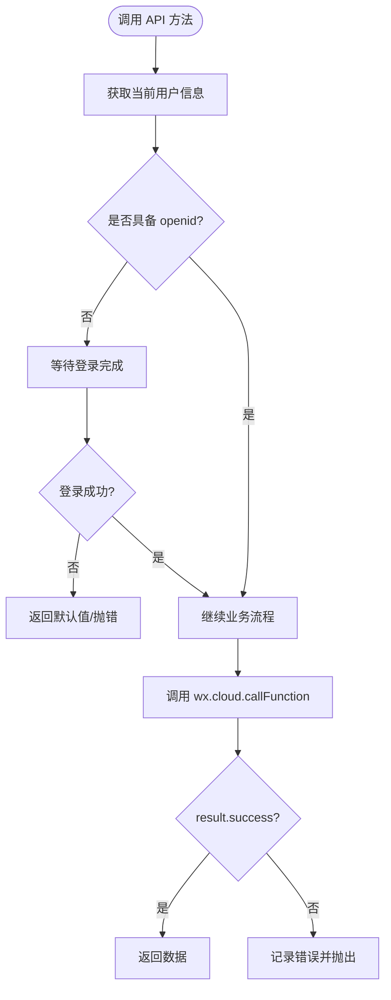
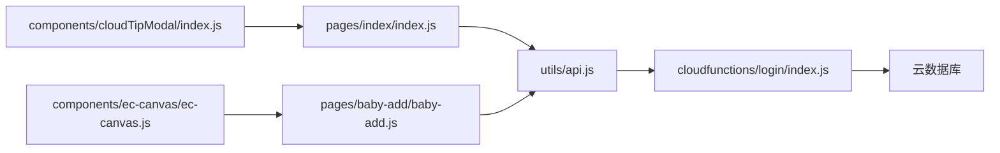

# 开发最佳实践

<cite>
**本文引用的文件**   
- [miniprogram/app.js](file://miniprogram/app.js)
- [miniprogram/app.json](file://miniprogram/app.json)
- [cloudfunctions/login/index.js](file://cloudfunctions/login/index.js)
- [cloudfunctions/sendFeedbackEmail/index.js](file://cloudfunctions/sendFeedbackEmail/index.js)
- [miniprogram/utils/api.js](file://miniprogram/utils/api.js)
- [miniprogram/utils/util.js](file://miniprogram/utils/util.js)
- [miniprogram/pages/index/index.js](file://miniprogram/pages/index/index.js)
- [miniprogram/pages/baby-add/baby-add.js](file://miniprogram/pages/baby-add/baby-add.js)
- [miniprogram/components/cloudTipModal/index.js](file://miniprogram/components/cloudTipModal/index.js)
- [miniprogram/components/ec-canvas/ec-canvas.js](file://miniprogram/components/ec-canvas/ec-canvas.js)
- [package.json](file://package.json)
- [project.config.json](file://project.config.json)
</cite>

## 更新摘要
**所做更改**   
- 移除了过时的技能文档引用（.agents/.claude/.codebuddy/.kiro/.trae 目录）
- 更新了项目结构说明，反映空目录清理后的实际状态
- 移除了依赖锁文件（package-lock.json）相关的说明
- 更新了架构图和依赖关系图以匹配当前项目结构

## 目录
1. [简介](#简介)
2. [项目结构](#项目结构)
3. [核心组件](#核心组件)
4. [架构总览](#架构总览)
5. [详细组件分析](#详细组件分析)
6. [依赖关系分析](#依赖关系分析)
7. [性能考量](#性能考量)
8. [故障排查指南](#故障排查指南)
9. [结论](#结论)
10. [附录](#附录)

## 简介
本指南面向"宝宝助手"小程序开发团队，系统总结项目在开发过程中的经验与教训，形成统一的开发标准与质量保障体系。内容覆盖代码规范、设计模式、错误处理、安全考虑、JavaScript 编码规范、小程序特定规范（页面组织、组件设计、数据管理、性能优化）、云函数开发最佳实践（错误处理、日志记录、安全防护、性能优化）、团队协作流程（代码审查、版本控制、文档维护、知识分享）以及常见问题的预防与解决策略。

## 项目结构
项目采用"小程序前端 + 云开发 + 云函数"的分层架构：
- 小程序前端：页面、组件、工具模块、全局配置
- 云函数：集中处理业务逻辑、权限校验、数据事务与安全控制
- 数据库：基于云开发 NoSQL 的集合模型（用户、家庭、宝宝、记录、邀请码等）

**更新** 项目结构已清理过时的技能文档目录，移除了 .agents/.claude/.codebuddy/.kiro/.trae 空目录，反映了最新的项目状态。

**图表来源**
- [miniprogram/app.js:1-56](file://miniprogram/app.js#L1-L56)
- [miniprogram/app.json:1-39](file://miniprogram/app.json#L1-L39)
- [cloudfunctions/login/index.js:1-814](file://cloudfunctions/login/index.js#L1-L814)
- [cloudfunctions/sendFeedbackEmail/index.js:1-21](file://cloudfunctions/sendFeedbackEmail/index.js#L1-L21)
- [miniprogram/utils/api.js:1-879](file://miniprogram/utils/api.js#L1-L879)

**章节来源**
- [miniprogram/app.js:1-56](file://miniprogram/app.js#L1-L56)
- [miniprogram/app.json:1-39](file://miniprogram/app.json#L1-L39)
- [project.config.json:1-85](file://project.config.json#L1-L85)

## 核心组件
- 应用启动与登录：在应用启动时初始化云环境并自动登录，拉取用户信息并缓存至本地存储。
- 工具模块 API：封装对云函数与数据库的调用，统一错误处理与权限校验，屏蔽数据库权限限制。
- 页面与交互：首页展示宝宝列表与最新记录，新增页表单校验与提交，统一提示与导航。
- 组件化：通用弹窗与图表组件，提升复用性与一致性。
- 云函数：集中实现业务规则、权限控制、事务与安全校验，作为前后端边界。

**章节来源**
- [miniprogram/app.js:1-56](file://miniprogram/app.js#L1-L56)
- [miniprogram/utils/api.js:1-879](file://miniprogram/utils/api.js#L1-L879)
- [miniprogram/pages/index/index.js:1-144](file://miniprogram/pages/index/index.js#L1-L144)
- [miniprogram/pages/baby-add/baby-add.js:1-120](file://miniprogram/pages/baby-add/baby-add.js#L1-L120)
- [miniprogram/components/cloudTipModal/index.js:1-29](file://miniprogram/components/cloudTipModal/index.js#L1-L29)
- [miniprogram/components/ec-canvas/ec-canvas.js:1-285](file://miniprogram/components/ec-canvas/ec-canvas.js#L1-L285)
- [cloudfunctions/login/index.js:1-814](file://cloudfunctions/login/index.js#L1-L814)

## 架构总览
整体采用"前端薄调用 + 云函数厚实现"的设计，前端仅负责 UI 与交互，复杂业务、权限与事务全部下沉到云函数，确保数据一致性与安全性。

**图表来源**
- [miniprogram/utils/api.js:1-879](file://miniprogram/utils/api.js#L1-L879)
- [cloudfunctions/login/index.js:1-814](file://cloudfunctions/login/index.js#L1-L814)

## 详细组件分析

### 应用启动与登录流程
- 初始化云环境，设置动态环境与用户轨迹
- 自动登录：调用微信登录获取 code，再调用云函数换取用户信息并持久化
- 登录状态检查与兜底：通过轮询等待登录完成，避免并发访问导致的空用户态

**图表来源**
- [miniprogram/app.js:1-56](file://miniprogram/app.js#L1-L56)
- [cloudfunctions/login/index.js:1-814](file://cloudfunctions/login/index.js#L1-L814)

**章节来源**
- [miniprogram/app.js:1-56](file://miniprogram/app.js#L1-L56)

### 工具模块 API 设计与最佳实践
- 统一错误处理：所有网络与数据库调用均包裹 try/catch 并记录日志
- 登录等待机制：waitForLogin 提供最大等待时间与轮询检测，避免竞态
- 权限前置校验：checkPermission 在关键操作前进行权限判断
- 云函数代理：对需要严格权限控制的读写（如删除、更新）统一走云函数，绕过数据库权限限制
- 本地状态与远端同步：优先使用云函数返回的数据，减少本地状态漂移

**图表来源**
- [miniprogram/utils/api.js:1-879](file://miniprogram/utils/api.js#L1-L879)

**章节来源**
- [miniprogram/utils/api.js:1-879](file://miniprogram/utils/api.js#L1-L879)

### 页面与交互最佳实践
- 首页 index：懒加载与分步渲染，先获取宝宝列表与家庭映射，再逐条计算年龄与最新记录
- 新增宝宝 baby-add：严格的表单校验（必填、数值范围、格式转换），权限前置检查
- 统一提示：使用 toast 与 modal，明确错误原因与引导
- 导航与回退：成功后延时返回，避免重复提交

**章节来源**
- [miniprogram/pages/index/index.js:1-144](file://miniprogram/pages/index/index.js#L1-L144)
- [miniprogram/pages/baby-add/baby-add.js:1-120](file://miniprogram/pages/baby-add/baby-add.js#L1-L120)

### 组件化设计
- 通用弹窗 cloudTipModal：通过属性与观察者驱动显示/隐藏，降低耦合
- 图表组件 ec-canvas：兼容新旧 Canvas 版本，自动选择初始化路径，提供触摸事件桥接

**章节来源**
- [miniprogram/components/cloudTipModal/index.js:1-29](file://miniprogram/components/cloudTipModal/index.js#L1-L29)
- [miniprogram/components/ec-canvas/ec-canvas.js:1-285](file://miniprogram/components/ec-canvas/ec-canvas.js#L1-L285)

### 云函数最佳实践
- 单一职责：每个 action 对应一种业务场景，便于测试与演进
- 权限与安全：在云函数内完成权限校验与业务规则，避免前端绕过
- 事务与一致性：删除宝宝使用事务，确保关联记录一并清理
- 错误处理：显式抛错与结构化返回，前端统一捕获
- 日志记录：关键路径打印日志，便于定位问题
- 性能优化：批量查询、排序与去重，避免 N+1 查询；异步清理过期数据

**章节来源**
- [cloudfunctions/login/index.js:1-814](file://cloudfunctions/login/index.js#L1-L814)
- [cloudfunctions/sendFeedbackEmail/index.js:1-21](file://cloudfunctions/sendFeedbackEmail/index.js#L1-L21)

## 依赖关系分析
- 小程序前端依赖工具模块 api.js，api.js 再依赖云函数 login 与数据库
- 云函数 login 依赖云开发 SDK 与数据库命令，实现复杂业务与事务
- 组件依赖基础框架与第三方图表库，注意版本兼容性

**更新** 移除了过时的技能文档依赖关系，更新了当前有效的依赖结构。

**图表来源**
- [miniprogram/pages/index/index.js:1-144](file://miniprogram/pages/index/index.js#L1-L144)
- [miniprogram/pages/baby-add/baby-add.js:1-120](file://miniprogram/pages/baby-add/baby-add.js#L1-L120)
- [miniprogram/utils/api.js:1-879](file://miniprogram/utils/api.js#L1-L879)
- [cloudfunctions/login/index.js:1-814](file://cloudfunctions/login/index.js#L1-L814)
- [miniprogram/components/cloudTipModal/index.js:1-29](file://miniprogram/components/cloudTipModal/index.js#L1-L29)
- [miniprogram/components/ec-canvas/ec-canvas.js:1-285](file://miniprogram/components/ec-canvas/ec-canvas.js#L1-L285)

**章节来源**
- [project.config.json:1-85](file://project.config.json#L1-L85)

## 性能考量
- 避免 N+1 查询：在工具模块中尽量合并请求或使用云函数聚合
- 懒加载与延迟初始化：图表组件按需初始化，减少首屏压力
- 本地缓存与最小化网络：登录态与常用数据本地持久化
- 事务与批量操作：删除等高风险操作使用事务，减少碎片数据
- 基础库版本适配：图表组件自动选择 Canvas 版本，兼顾兼容与性能

## 故障排查指南
- 登录失败/超时
  - 现象：页面无法获取用户信息或长时间等待
  - 排查：检查 App 初始化云环境与登录流程；确认云函数 login 是否正常返回
  - 参考
    - [miniprogram/app.js:1-56](file://miniprogram/app.js#L1-L56)
    - [miniprogram/utils/api.js:1-879](file://miniprogram/utils/api.js#L1-L879)
- 权限不足
  - 现象：新增/删除/修改被拒绝
  - 排查：确认用户在家庭中的权限；检查云函数中权限校验逻辑
  - 参考
    - [miniprogram/utils/api.js:1-879](file://miniprogram/utils/api.js#L1-L879)
    - [cloudfunctions/login/index.js:1-814](file://cloudfunctions/login/index.js#L1-L814)
- 删除失败/数据不一致
  - 现象：删除后仍有残留记录
  - 排查：确认使用云函数删除（事务）；检查事务是否成功返回
  - 参考
    - [miniprogram/utils/api.js:1-879](file://miniprogram/utils/api.js#L1-L879)
    - [cloudfunctions/login/index.js:1-814](file://cloudfunctions/login/index.js#L1-L814)
- 表单校验失败
  - 现象：提交时报错或无响应
  - 排查：检查表单字段与校验规则；确认必填项与数值范围
  - 参考
    - [miniprogram/pages/baby-add/baby-add.js:1-120](file://miniprogram/pages/baby-add/baby-add.js#L1-L120)

## 结论
通过"前端薄调用 + 云函数厚实现"的架构，结合统一的工具模块、严格的权限与事务控制、完善的错误处理与日志记录，项目在功能完整性、安全性与可维护性方面形成了稳定基线。项目结构已清理过时的技能文档目录，移除了不必要的依赖锁文件，使整体架构更加简洁清晰。建议团队持续遵循本文档的规范与流程，逐步完善自动化测试与监控体系，确保长期高质量交付。

## 附录

### JavaScript 编码规范（小程序）
- 命名约定
  - 文件与模块：使用小驼峰或目录分层，清晰表达职责
  - 函数与变量：语义化命名，避免缩写；私有函数以下划线前缀
  - 常量：全大写下划线
- 代码结构
  - 页面：data、onLoad/onShow、事件处理、工具方法分离
  - 工具模块：单一职责，导出明确接口
  - 组件：properties、data、methods、observers 清晰划分
- 注释规范
  - 公共接口与复杂逻辑添加注释，说明输入输出与约束
- 异步处理最佳实践
  - 统一使用 Promise 包裹回调 API
  - 明确错误分支与兜底逻辑
  - 避免深层嵌套，使用 async/await

### 小程序开发特定规范
- 页面组织
  - 按功能域拆分页面，避免单页过长
  - 使用 tabBar 时，确保图标与文案清晰
- 组件设计
  - 抽象通用组件，统一样式与行为
  - 通过属性与事件解耦
- 数据管理
  - 前端状态与远端数据保持一致，必要时二次校验
  - 本地存储仅存放轻量数据
- 性能优化
  - 懒加载、按需渲染、合理使用缓存
  - 避免频繁 setData 与长任务阻塞主线程

### 云函数开发最佳实践
- 错误处理
  - 显式抛错与结构化返回，前端统一捕获
- 日志记录
  - 关键路径打印日志，便于定位问题
- 安全防护
  - 所有敏感操作在云函数内完成权限校验
  - 输入参数校验与长度/范围限制
- 性能优化
  - 使用事务保证一致性
  - 合理使用聚合与索引，避免 N+1 查询

### 团队协作规范
- 代码审查
  - PR 必须包含变更说明与测试要点
- 版本控制
  - 分支策略：develop/main，hotfix/feature 分支命名规范
- 文档维护
  - 新增云函数/页面/组件需补充说明与变更记录
- 知识分享
  - 定期回顾与复盘，沉淀最佳实践

### 项目结构管理
- 目录清理
  - 定期清理过时的技能文档目录（.agents/.claude/.codebuddy/.kiro/.trae）
  - 移除空目录和无用的依赖锁文件
- 依赖管理
  - 使用 package.json 管理依赖版本
  - 避免在云函数中提交 node_modules 目录
  - 定期更新依赖以修复安全漏洞