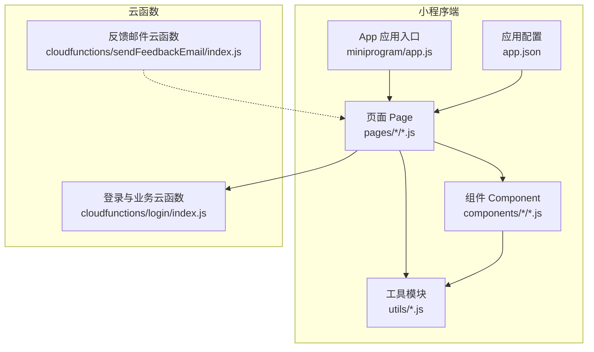
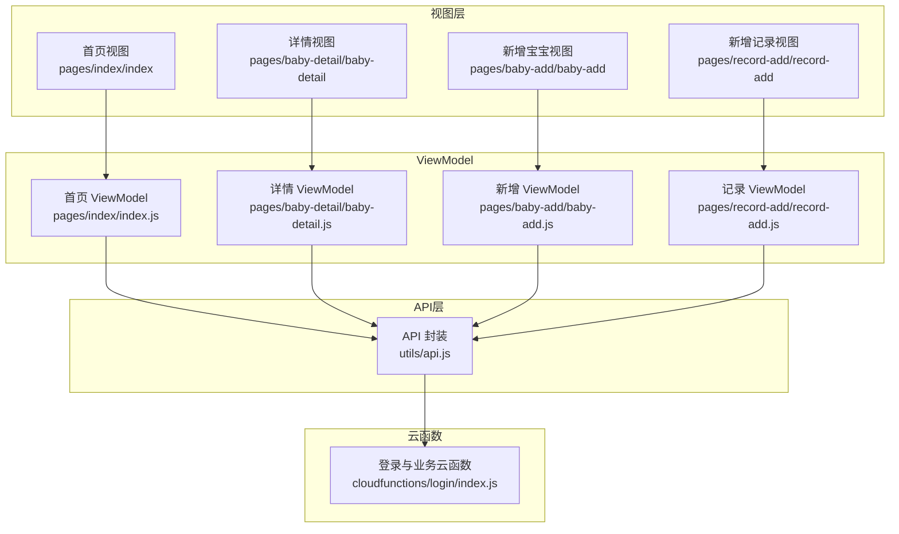
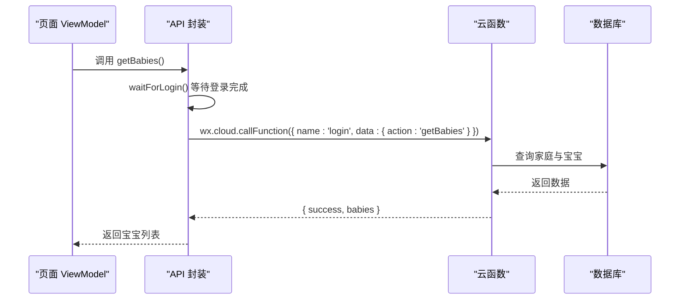
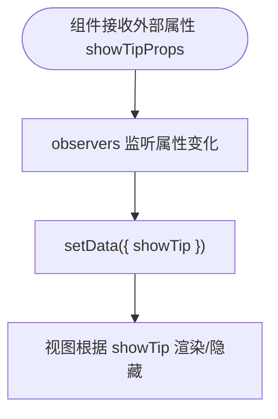
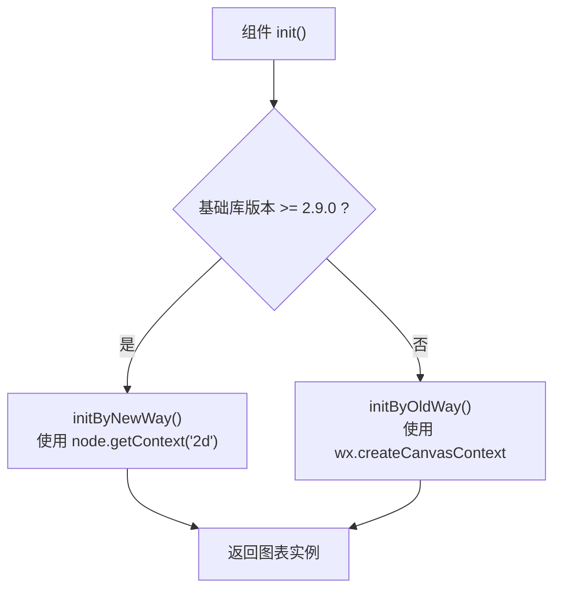
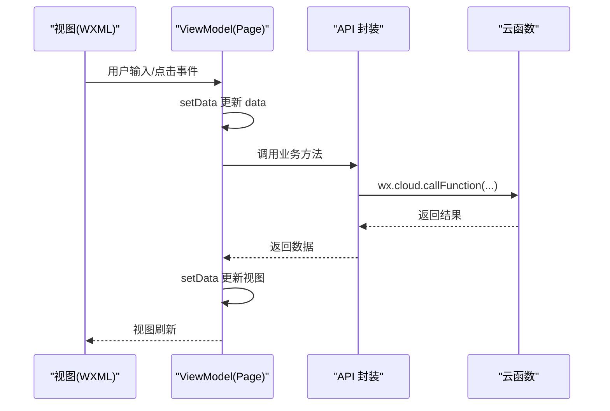
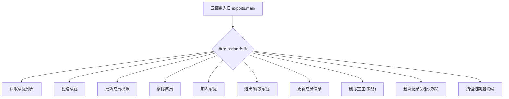
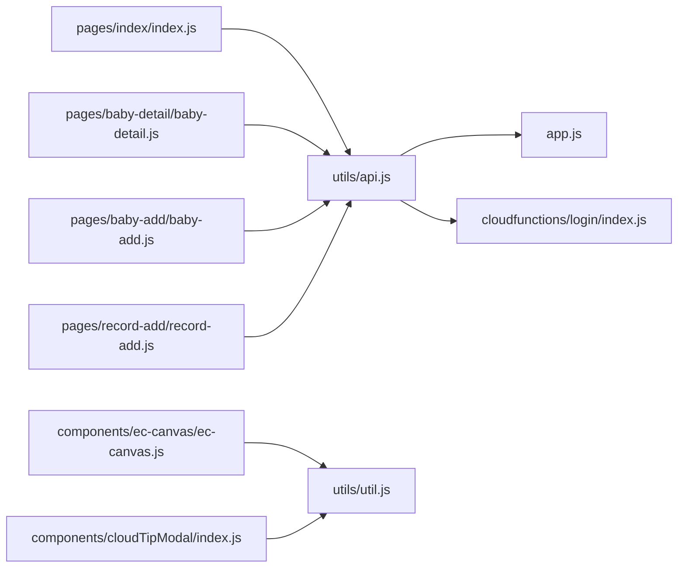

# 设计模式

<cite>
**本文引用的文件**
- [miniprogram/app.js](file://miniprogram/app.js)
- [miniprogram/utils/api.js](file://miniprogram/utils/api.js)
- [cloudfunctions/login/index.js](file://cloudfunctions/login/index.js)
- [miniprogram/components/cloudTipModal/index.js](file://miniprogram/components/cloudTipModal/index.js)
- [miniprogram/components/ec-canvas/ec-canvas.js](file://miniprogram/components/ec-canvas/ec-canvas.js)
- [miniprogram/pages/index/index.js](file://miniprogram/pages/index/index.js)
- [miniprogram/pages/baby-add/baby-add.js](file://miniprogram/pages/baby-add/baby-add.js)
- [miniprogram/pages/baby-detail/baby-detail.js](file://miniprogram/pages/baby-detail/baby-detail.js)
- [miniprogram/pages/record-add/record-add.js](file://miniprogram/pages/record-add/record-add.js)
- [miniprogram/utils/util.js](file://miniprogram/utils/util.js)
- [miniprogram/app.json](file://miniprogram/app.json)
- [cloudfunctions/sendFeedbackEmail/index.js](file://cloudfunctions/sendFeedbackEmail/index.js)
</cite>

## 目录
1. [简介](#简介)
2. [项目结构](#项目结构)
3. [核心组件](#核心组件)
4. [架构总览](#架构总览)
5. [详细组件分析](#详细组件分析)
6. [依赖关系分析](#依赖关系分析)
7. [性能考量](#性能考量)
8. [故障排查指南](#故障排查指南)
9. [结论](#结论)
10. [附录](#附录)

## 简介
本指南聚焦“宝宝助手”小程序中的设计模式应用与MVVM架构实践，围绕以下主题展开：
- 单例模式在API封装中的应用
- 观察者模式在数据监听中的使用
- 工厂模式在组件创建中的实践
- MVVM架构的数据绑定、事件处理与生命周期管理
- 云函数中的设计模式应用（策略模式在不同业务逻辑处理中的使用）
- 设计模式选择原则与适用场景

目标是帮助开发者在实际开发中正确选择与落地设计模式，提升代码质量与可维护性。

## 项目结构
项目采用分层与功能模块化组织：
- 小程序端（miniprogram）：页面、组件、工具函数、应用入口
- 云函数（cloudfunctions）：业务逻辑与数据库操作的后端实现
- 配置文件：应用清单、页面路由、组件注册等

图表来源
- [miniprogram/app.js:1-56](file://miniprogram/app.js#L1-L56)
- [miniprogram/app.json:1-39](file://miniprogram/app.json#L1-L39)
- [cloudfunctions/login/index.js:1-814](file://cloudfunctions/login/index.js#L1-L814)
- [cloudfunctions/sendFeedbackEmail/index.js:1-21](file://cloudfunctions/sendFeedbackEmail/index.js#L1-L21)

章节来源
- [miniprogram/app.js:1-56](file://miniprogram/app.js#L1-L56)
- [miniprogram/app.json:1-39](file://miniprogram/app.json#L1-L39)

## 核心组件
- 应用入口与全局状态：通过App实例管理全局数据（如用户信息、环境），并在启动时初始化云能力与登录流程。
- API封装层：统一对外暴露数据访问接口，内部处理登录等待、权限校验、调用云函数等。
- 页面与组件：页面负责视图与交互，组件负责复用与数据监听；两者均通过API层访问数据。
- 云函数：集中处理复杂业务逻辑、权限控制、事务与数据一致性。

章节来源
- [miniprogram/app.js:1-56](file://miniprogram/app.js#L1-L56)
- [miniprogram/utils/api.js:1-879](file://miniprogram/utils/api.js#L1-L879)
- [cloudfunctions/login/index.js:1-814](file://cloudfunctions/login/index.js#L1-L814)

## 架构总览
整体采用“前端MVVM + 后端云函数”的分层架构：
- 视图层（WXML/WXSS）与ViewModel（Page/Component）分离
- 数据绑定与事件处理由框架驱动
- 业务与数据访问通过API层统一入口
- 云函数承担复杂业务与权限控制

图表来源
- [miniprogram/pages/index/index.js:1-144](file://miniprogram/pages/index/index.js#L1-L144)
- [miniprogram/pages/baby-detail/baby-detail.js:1-691](file://miniprogram/pages/baby-detail/baby-detail.js#L1-L691)
- [miniprogram/pages/baby-add/baby-add.js:1-120](file://miniprogram/pages/baby-add/baby-add.js#L1-L120)
- [miniprogram/pages/record-add/record-add.js:1-118](file://miniprogram/pages/record-add/record-add.js#L1-L118)
- [miniprogram/utils/api.js:1-879](file://miniprogram/utils/api.js#L1-L879)
- [cloudfunctions/login/index.js:1-814](file://cloudfunctions/login/index.js#L1-L814)

## 详细组件分析

### 单例模式在API封装中的应用
- 全局唯一入口：API模块导出一组方法（如获取宝宝列表、添加记录、权限校验等），供页面与组件统一调用，避免重复初始化与分散逻辑。
- 登录等待与全局状态：API内部通过等待机制与全局状态（来自App）协调登录状态，保证后续请求可用。
- 云函数代理：API通过调用云函数绕过数据库权限限制，集中处理权限与事务，形成“单点控制”的单例式服务外观。

图表来源
- [miniprogram/utils/api.js:44-91](file://miniprogram/utils/api.js#L44-L91)
- [cloudfunctions/login/index.js:51-92](file://cloudfunctions/login/index.js#L51-L92)

章节来源
- [miniprogram/utils/api.js:1-879](file://miniprogram/utils/api.js#L1-L879)
- [cloudfunctions/login/index.js:1-814](file://cloudfunctions/login/index.js#L1-L814)

### 观察者模式在数据监听中的使用
- 组件属性监听：云提示模态组件通过 observers 将外部属性变化映射到内部显示状态，实现“属性变更 -> 自动刷新”的观察者行为。
- 页面数据刷新：页面通过 setData 触发视图更新，配合组件的属性监听，实现跨组件的数据联动。

图表来源
- [miniprogram/components/cloudTipModal/index.js:14-20](file://miniprogram/components/cloudTipModal/index.js#L14-L20)

章节来源
- [miniprogram/components/cloudTipModal/index.js:1-29](file://miniprogram/components/cloudTipModal/index.js#L1-L29)

### 工厂模式在组件创建中的实践
- 图表组件工厂：图表容器组件根据设备基础库版本动态选择新旧Canvas初始化路径，内部封装不同渲染路径，对外提供一致的初始化接口，体现“工厂方法”按条件创建不同实现。
- 组件职责单一：图表工厂仅负责初始化与平台适配，具体绘制由上层页面传入回调与数据。

图表来源
- [miniprogram/components/ec-canvas/ec-canvas.js:80-192](file://miniprogram/components/ec-canvas/ec-canvas.js#L80-L192)

章节来源
- [miniprogram/components/ec-canvas/ec-canvas.js:1-285](file://miniprogram/components/ec-canvas/ec-canvas.js#L1-L285)

### MVVM 架构模式实现
- 数据绑定：页面 data 与视图双向绑定，通过 setData 触发视图更新。
- 事件处理：页面方法响应用户交互（如输入、切换、点击），调用 API 层并更新 data。
- 生命周期管理：页面 onShow/onLoad/onReady 等生命周期钩子中加载数据、初始化图表、监听数据变化。
- 权限与业务：页面在提交前调用权限检查，API 层再调用云函数执行业务逻辑。

图表来源
- [miniprogram/pages/index/index.js:10-52](file://miniprogram/pages/index/index.js#L10-L52)
- [miniprogram/pages/baby-detail/baby-detail.js:178-245](file://miniprogram/pages/baby-detail/baby-detail.js#L178-L245)
- [miniprogram/pages/baby-add/baby-add.js:74-118](file://miniprogram/pages/baby-add/baby-add.js#L74-L118)
- [miniprogram/pages/record-add/record-add.js:71-116](file://miniprogram/pages/record-add/record-add.js#L71-L116)

章节来源
- [miniprogram/pages/index/index.js:1-144](file://miniprogram/pages/index/index.js#L1-L144)
- [miniprogram/pages/baby-detail/baby-detail.js:1-691](file://miniprogram/pages/baby-detail/baby-detail.js#L1-L691)
- [miniprogram/pages/baby-add/baby-add.js:1-120](file://miniprogram/pages/baby-add/baby-add.js#L1-L120)
- [miniprogram/pages/record-add/record-add.js:1-118](file://miniprogram/pages/record-add/record-add.js#L1-L118)

### 云函数中的设计模式应用：策略模式
- 动态分支策略：云函数根据 action 参数选择不同的业务分支（如获取家庭、创建家庭、更新成员权限、删除记录等），形成“策略选择 + 策略执行”的结构。
- 权限与事务：针对不同操作（如删除记录、删除宝宝）分别进行权限校验与事务处理，策略内聚、职责清晰。
- 异步清理策略：定时清理过期邀请码，策略独立、不影响主流程。

图表来源
- [cloudfunctions/login/index.js:22-814](file://cloudfunctions/login/index.js#L22-L814)

章节来源
- [cloudfunctions/login/index.js:1-814](file://cloudfunctions/login/index.js#L1-L814)

### MVVM 在页面中的具体实践
- 首页（宝宝列表）：加载宝宝与家庭数据，格式化年龄与最新记录，支持跳转详情与删除。
- 宝宝详情（图表）：按性别加载身高/体重标准曲线，结合实际记录绘制折线图，支持缩放与滑块。
- 新增宝宝/记录：表单校验与权限检查前置，提交后反馈与回退。
- 工具函数：通用的时间格式化、年龄计算与字符串格式化，被多处页面与组件复用。

章节来源
- [miniprogram/pages/index/index.js:1-144](file://miniprogram/pages/index/index.js#L1-L144)
- [miniprogram/pages/baby-detail/baby-detail.js:1-691](file://miniprogram/pages/baby-detail/baby-detail.js#L1-L691)
- [miniprogram/pages/baby-add/baby-add.js:1-120](file://miniprogram/pages/baby-add/baby-add.js#L1-L120)
- [miniprogram/pages/record-add/record-add.js:1-118](file://miniprogram/pages/record-add/record-add.js#L1-L118)
- [miniprogram/utils/util.js:1-55](file://miniprogram/utils/util.js#L1-L55)

## 依赖关系分析
- 页面依赖 API 封装：页面通过 require API 模块访问统一接口。
- API 封装依赖 App 全局状态与云函数：API 内部读取全局用户信息、等待登录、调用云函数。
- 组件依赖工具函数与第三方图表库：组件负责平台适配与事件转发，图表库负责可视化渲染。
- 云函数依赖数据库命令与权限模型：云函数集中处理业务规则与事务。

图表来源
- [miniprogram/pages/index/index.js:1-144](file://miniprogram/pages/index/index.js#L1-L144)
- [miniprogram/pages/baby-detail/baby-detail.js:1-691](file://miniprogram/pages/baby-detail/baby-detail.js#L1-L691)
- [miniprogram/pages/baby-add/baby-add.js:1-120](file://miniprogram/pages/baby-add/baby-add.js#L1-L120)
- [miniprogram/pages/record-add/record-add.js:1-118](file://miniprogram/pages/record-add/record-add.js#L1-L118)
- [miniprogram/utils/api.js:1-879](file://miniprogram/utils/api.js#L1-L879)
- [miniprogram/app.js:1-56](file://miniprogram/app.js#L1-L56)
- [cloudfunctions/login/index.js:1-814](file://cloudfunctions/login/index.js#L1-L814)
- [miniprogram/components/ec-canvas/ec-canvas.js:1-285](file://miniprogram/components/ec-canvas/ec-canvas.js#L1-L285)
- [miniprogram/components/cloudTipModal/index.js:1-29](file://miniprogram/components/cloudTipModal/index.js#L1-L29)
- [miniprogram/utils/util.js:1-55](file://miniprogram/utils/util.js#L1-L55)

章节来源
- [miniprogram/utils/api.js:1-879](file://miniprogram/utils/api.js#L1-L879)
- [miniprogram/app.js:1-56](file://miniprogram/app.js#L1-L56)

## 性能考量
- 懒加载与延迟初始化：图表组件支持懒加载，仅在需要时初始化，减少首屏开销。
- 版本适配：根据基础库版本选择新旧Canvas路径，兼顾性能与兼容性。
- 云函数事务：对删除等关键操作使用事务，保证一致性的同时避免频繁往返。
- 数据缓存：优先使用云函数返回的聚合数据，减少多次查询与跨端通信。

## 故障排查指南
- 登录失败/超时：检查 App 初始化与云函数登录逻辑，确认返回的用户信息是否写入全局状态。
- 权限不足：页面提交前调用权限检查，云函数中严格校验成员角色与操作范围。
- 图表初始化失败：确认基础库版本与 Canvas 能力，检查组件初始化回调与容器尺寸。
- 云函数报错：查看云函数日志与返回消息，定位具体 action 的异常分支。

章节来源
- [miniprogram/app.js:23-54](file://miniprogram/app.js#L23-L54)
- [miniprogram/utils/api.js:14-41](file://miniprogram/utils/api.js#L14-L41)
- [cloudfunctions/login/index.js:22-814](file://cloudfunctions/login/index.js#L22-L814)
- [miniprogram/components/ec-canvas/ec-canvas.js:80-192](file://miniprogram/components/ec-canvas/ec-canvas.js#L80-L192)

## 结论
本项目通过“单例式API封装 + 观察者式组件监听 + 工厂式组件初始化 + MVVM视图模型”的组合，实现了清晰的职责分离与良好的扩展性。云函数采用“策略模式”分支处理不同业务，配合权限与事务控制，保障了业务一致性与安全性。遵循本文的设计模式选择原则与实践建议，可在保持架构稳定的同时提升开发效率与可维护性。

## 附录
- 设计模式选择原则
  - 单例：当需要全局唯一的服务外观或状态入口时
  - 观察者：当需要基于属性/状态变化自动刷新UI或联动处理时
  - 工厂：当需要根据运行时条件创建不同实现或适配平台差异时
  - 策略：当存在多种算法或分支逻辑且可替换时
- 适用场景
  - API封装：统一入口、权限与事务、跨端调用
  - 组件监听：外部属性变化、弹窗/提示等轻量联动
  - 组件工厂：Canvas/图表等平台差异导致的差异化初始化
  - 云函数：复杂业务、权限控制、事务与异步清理