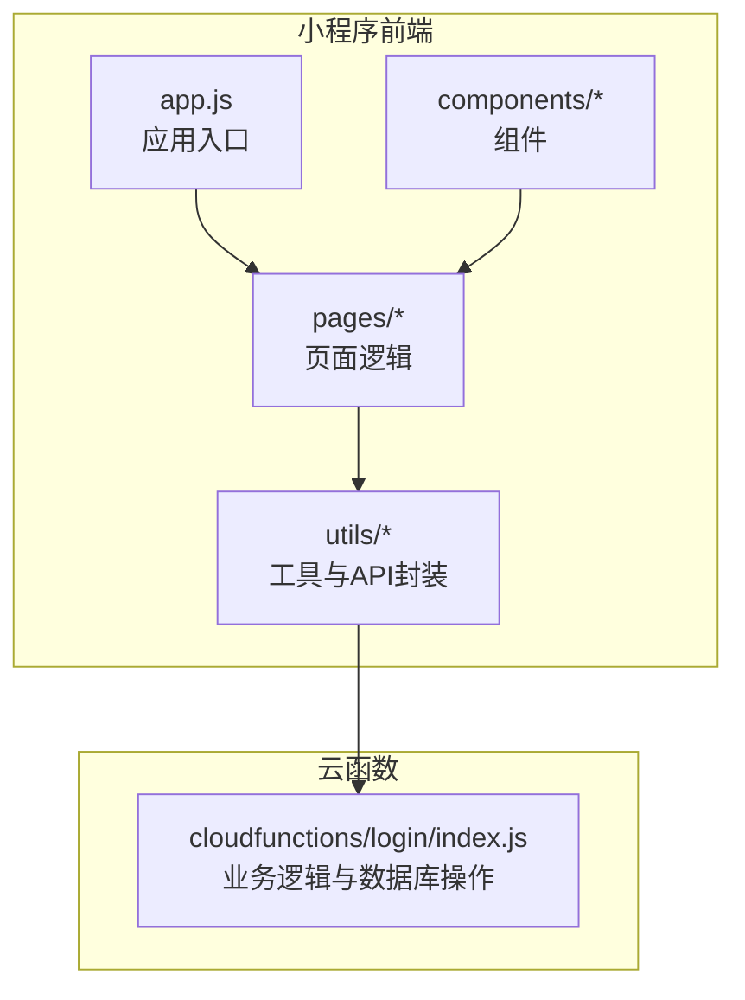
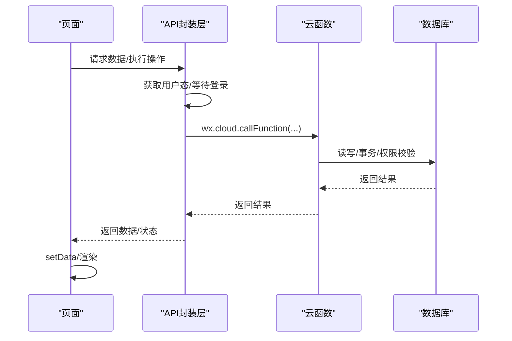
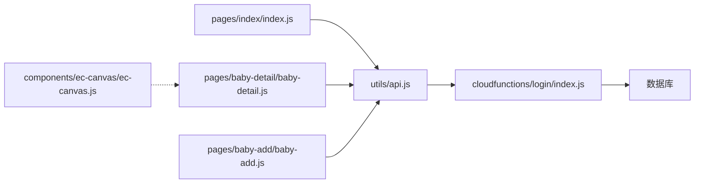

# 代码层面优化

<cite>
**本文档引用的文件**
- [app.js](file://miniprogram/app.js)
- [api.js](file://miniprogram/utils/api.js)
- [util.js](file://miniprogram/utils/util.js)
- [index.js](file://miniprogram/pages/index/index.js)
- [baby-detail.js](file://miniprogram/pages/baby-detail/baby-detail.js)
- [baby-add.js](file://miniprogram/pages/baby-add/baby-add.js)
- [ec-canvas.js](file://miniprogram/components/ec-canvas/ec-canvas.js)
- [login/index.js](file://cloudfunctions/login/index.js)
</cite>

## 目录
1. [简介](#简介)
2. [项目结构](#项目结构)
3. [核心组件](#核心组件)
4. [架构总览](#架构总览)
5. [详细组件分析](#详细组件分析)
6. [依赖关系分析](#依赖关系分析)
7. [性能考量](#性能考量)
8. [故障排查指南](#故障排查指南)
9. [结论](#结论)

## 简介
本指南聚焦于小程序代码层面的性能优化，围绕 JavaScript 代码优化、API 封装层优化、变量作用域与内存管理、常见性能瓶颈优化、代码结构优化等维度，结合仓库现有实现进行深入剖析，并提供可操作的优化建议与最佳实践，帮助开发者显著提升小程序运行效率与用户体验。

## 项目结构
该项目采用典型的微信小程序目录结构，前端页面位于 miniprogram 下，工具方法与 API 封装位于 utils，图表组件位于 components，云函数位于 cloudfunctions。整体职责清晰：页面负责视图与交互；utils 提供通用工具与 API 封装；组件提供复用能力；云函数处理业务逻辑与数据库操作。

**图表来源**
- [app.js:1-56](file://miniprogram/app.js#L1-L56)
- [api.js:1-800](file://miniprogram/utils/api.js#L1-L800)
- [login/index.js:1-814](file://cloudfunctions/login/index.js#L1-L814)

**章节来源**
- [app.js:1-56](file://miniprogram/app.js#L1-L56)
- [api.js:1-800](file://miniprogram/utils/api.js#L1-L800)
- [login/index.js:1-814](file://cloudfunctions/login/index.js#L1-L814)

## 核心组件
- 应用入口与登录流程：负责初始化云环境、检查登录状态、触发登录并缓存用户信息。
- API 封装层：统一处理用户态获取、等待登录、数据库访问、云函数调用、权限校验等。
- 页面逻辑：首页、详情页、新增页分别承担数据加载、图表渲染、表单提交等职责。
- 图表组件：基于 ECharts 的 canvas 组件，支持新旧 Canvas 初始化路径与触摸交互。
- 云函数：集中处理家庭、宝宝、记录、权限、邀请码等业务逻辑，部分操作使用事务保证一致性。

**章节来源**
- [app.js:1-56](file://miniprogram/app.js#L1-L56)
- [api.js:1-800](file://miniprogram/utils/api.js#L1-L800)
- [index.js:1-144](file://miniprogram/pages/index/index.js#L1-L144)
- [baby-detail.js:1-691](file://miniprogram/pages/baby-detail/baby-detail.js#L1-L691)
- [ec-canvas.js:1-285](file://miniprogram/components/ec-canvas/ec-canvas.js#L1-L285)
- [login/index.js:1-814](file://cloudfunctions/login/index.js#L1-L814)

## 架构总览
前端通过 API 封装层调用云函数，云函数对数据库进行读写与权限校验，页面接收数据并渲染。图表组件独立负责可视化渲染，避免与页面逻辑耦合。

**图表来源**
- [api.js:14-41](file://miniprogram/utils/api.js#L14-L41)
- [login/index.js:22-800](file://cloudfunctions/login/index.js#L22-L800)
- [index.js:14-52](file://miniprogram/pages/index/index.js#L14-L52)

## 详细组件分析

### 应用入口与登录流程优化
- 登录策略：在 onLaunch 中直接触发登录，避免额外的用户交互步骤；登录成功后将用户信息与 openid 写入全局与本地存储。
- 登录等待：waitForLogin 提供最大等待时间与轮询检查，避免长时间阻塞主线程。
- 云能力初始化：在满足条件时初始化云环境，防止低版本基础库报错。

优化建议
- 使用防抖/节流控制重复登录触发。
- 在登录等待期间显示轻提示，避免用户误以为卡顿。
- 对登录失败场景增加重试与降级策略（例如本地兜底数据）。

**章节来源**
- [app.js:8-54](file://miniprogram/app.js#L8-L54)
- [api.js:14-41](file://miniprogram/utils/api.js#L14-L41)

### API 封装层性能优化策略
- 统一用户态获取：getCurrentUser 优先从全局状态获取，否则从本地存储读取，减少重复 IO。
- 登录等待：waitForLogin 采用定时器轮询，设置最大等待时间，避免无限等待。
- 云函数调用：将复杂业务下沉至云函数，前端仅做参数组装与结果处理，降低前端复杂度与网络往返。
- 权限校验：checkPermission 统一在前端发起，减少数据库权限绕过带来的风险。
- 错误处理：统一捕获异常并返回空值/默认值，避免前端崩溃。

优化建议
- 请求合并：对高频接口（如 getBabies/getFamilies）可考虑合并为一次云函数调用，减少网络开销。
- 批量操作：对多条记录的增删改，尽量使用云函数批量处理，避免多次网络往返。
- 错误重试：对网络波动导致的失败，增加指数退避重试策略。
- 缓存策略：对只读数据（如标准曲线、静态配置）在本地缓存，设置 TTL。

**章节来源**
- [api.js:6-11](file://miniprogram/utils/api.js#L6-L11)
- [api.js:14-41](file://miniprogram/utils/api.js#L14-L41)
- [api.js:44-75](file://miniprogram/utils/api.js#L44-L75)
- [api.js:436-461](file://miniprogram/utils/api.js#L436-L461)
- [login/index.js:22-800](file://cloudfunctions/login/index.js#L22-L800)

### 页面逻辑与事件循环优化
- 首页 index：在 onShow 中加载数据，避免重复渲染；对每个宝宝逐个获取最新记录，存在大量串行 await，可能成为性能瓶颈。
- 详情页 baby-detail：图表初始化采用延迟加载（lazyLoad），切换标签页时再初始化，减少首屏压力；图表数据准备与排序在 setData 前完成，避免重复计算。
- 新增页 baby-add：表单校验前置，减少无效提交；提交成功后导航回退，避免二次渲染。

优化建议
- 将首页的串行 await 改为并发加载（Promise.all），减少等待时间。
- 对列表渲染使用虚拟滚动（如需要）或分页加载，降低一次性渲染成本。
- 在事件回调中避免长耗时同步操作，必要时拆分为多个微任务，让出主线程。

**章节来源**
- [index.js:14-52](file://miniprogram/pages/index/index.js#L14-L52)
- [baby-detail.js:178-245](file://miniprogram/pages/baby-detail/baby-detail.js#L178-L245)
- [baby-add.js:74-118](file://miniprogram/pages/baby-add/baby-add.js#L74-L118)

### 图表组件与渲染优化
- 组件初始化：根据基础库版本选择新旧 Canvas 初始化路径，新路径支持 devicePixelRatio，提升绘制质量与性能。
- 触摸交互：封装 touchStart/touchMove/touchEnd，映射到 ECharts ZRender 事件，支持缩放与拖拽。
- 渲染策略：支持 lazyLoad，在切换到图表标签时再初始化，避免首屏阻塞。

优化建议
- 对大数据量图表启用渐进渲染（progressive），但需注意小程序 Canvas 限制。
- 合理设置 dataZoom 的初始范围，避免一次性渲染过多点位。
- 图表选项预计算，避免每次 setData 时重复计算。

**章节来源**
- [ec-canvas.js:80-192](file://miniprogram/components/ec-canvas/ec-canvas.js#L80-L192)
- [ec-canvas.js:216-274](file://miniprogram/components/ec-canvas/ec-canvas.js#L216-L274)
- [baby-detail.js:323-397](file://miniprogram/pages/baby-detail/baby-detail.js#L323-L397)
- [baby-detail.js:399-473](file://miniprogram/pages/baby-detail/baby-detail.js#L399-L473)

### 云函数与数据库优化
- 事务保证：删除宝宝、删除记录等关键操作使用事务，确保原子性。
- 权限校验：在云函数内严格校验用户权限，避免前端绕过。
- 数据排序：按家庭与时间排序，减少前端排序成本。
- 异步清理：清理过期邀请码采用异步方式，不阻塞主流程。

优化建议
- 对高频查询建立合适索引，减少全表扫描。
- 对批量写入使用事务或批量 API，减少网络往返。
- 对外部依赖（如图片上传）增加超时与重试。

**章节来源**
- [login/index.js:483-510](file://cloudfunctions/login/index.js#L483-L510)
- [login/index.js:512-554](file://cloudfunctions/login/index.js#L512-L554)
- [login/index.js:658-700](file://cloudfunctions/login/index.js#L658-L700)
- [login/index.js:740-760](file://cloudfunctions/login/index.js#L740-L760)

## 依赖关系分析
- 页面依赖 utils/api.js 进行数据获取与业务操作。
- API 封装层依赖 wx.cloud 与数据库命令，同时调用云函数。
- 云函数依赖数据库 SDK，执行业务逻辑与权限校验。
- 图表组件独立于页面，通过属性绑定与回调初始化。

**图表来源**
- [index.js:1-5](file://miniprogram/pages/index/index.js#L1-L5)
- [baby-detail.js:1-5](file://miniprogram/pages/baby-detail/baby-detail.js#L1-L5)
- [baby-add.js:1-4](file://miniprogram/pages/baby-add/baby-add.js#L1-L4)
- [api.js:1-11](file://miniprogram/utils/api.js#L1-L11)
- [login/index.js:1-10](file://cloudfunctions/login/index.js#L1-L10)
- [ec-canvas.js:1-5](file://miniprogram/components/ec-canvas/ec-canvas.js#L1-L5)

**章节来源**
- [index.js:1-5](file://miniprogram/pages/index/index.js#L1-L5)
- [baby-detail.js:1-5](file://miniprogram/pages/baby-detail/baby-detail.js#L1-L5)
- [baby-add.js:1-4](file://miniprogram/pages/baby-add/baby-add.js#L1-L4)
- [api.js:1-11](file://miniprogram/utils/api.js#L1-L11)
- [login/index.js:1-10](file://cloudfunctions/login/index.js#L1-L10)
- [ec-canvas.js:1-5](file://miniprogram/components/ec-canvas/ec-canvas.js#L1-L5)

## 性能考量

### JavaScript 代码优化
- 异步操作优化
  - 首页串行 await：将逐个获取最新记录改为并发获取，减少总等待时间。
  - 云函数调用：对可合并的请求进行合并，减少网络往返。
- Promise 链式调用优化
  - 统一错误处理，避免深层嵌套与重复 try/catch。
  - 使用 Promise.all 并发执行相互独立的任务。
- 事件循环优化
  - 将长耗时任务拆分为多个微任务，避免阻塞 UI。
  - 在 setData 前完成数据准备，减少重复计算。

### API 封装层优化策略
- 请求合并：将 getBabies 与 getFamilies 合并为一次云函数调用，减少网络开销。
- 批量操作：对多条记录的增删改，使用云函数批量处理。
- 错误重试：对网络波动导致的失败，增加指数退避重试策略。

### 变量作用域与内存管理
- 作用域优化：避免在循环中创建闭包，减少变量提升与捕获。
- 内存泄漏预防：及时释放图表实例与事件监听，页面卸载时清理定时器与回调。
- 垃圾回收优化：避免持有大对象引用，及时置空或替换为轻量对象。

### 常见性能瓶颈优化
- 频繁 DOM 操作：使用 setData 合并更新，避免多次 setData 导致的重绘。
- 重复计算：对计算结果进行缓存，避免重复计算。
- 不必要的对象创建：复用对象与数组，减少 GC 压力。

### 代码结构优化
- 模块化设计：将通用逻辑抽取为独立模块，便于复用与测试。
- 懒加载：图表与重型组件采用懒加载，减少首屏负担。
- 代码分割：对大型页面进行功能拆分，按需加载。

## 故障排查指南
- 登录失败：检查 onLaunch 中云能力初始化与登录流程，确认最大等待时间与错误日志。
- 数据加载缓慢：检查首页串行 await 与图表初始化时机，优化为并发与懒加载。
- 图表渲染异常：确认基础库版本与 Canvas 初始化路径，检查 dataZoom 初始范围。
- 权限校验失败：核对云函数内的权限判断逻辑与前端调用参数。

**章节来源**
- [app.js:8-54](file://miniprogram/app.js#L8-L54)
- [index.js:14-52](file://miniprogram/pages/index/index.js#L14-L52)
- [ec-canvas.js:80-192](file://miniprogram/components/ec-canvas/ec-canvas.js#L80-L192)
- [login/index.js:22-800](file://cloudfunctions/login/index.js#L22-L800)

## 结论
通过对应用入口、API 封装层、页面逻辑、图表组件与云函数的系统性分析，本指南提出了针对 JavaScript 代码层面的优化策略与实践建议。建议优先实施并发加载、懒加载与缓存策略，配合合理的错误重试与权限校验，持续监控与迭代，以获得稳定且高效的运行表现。