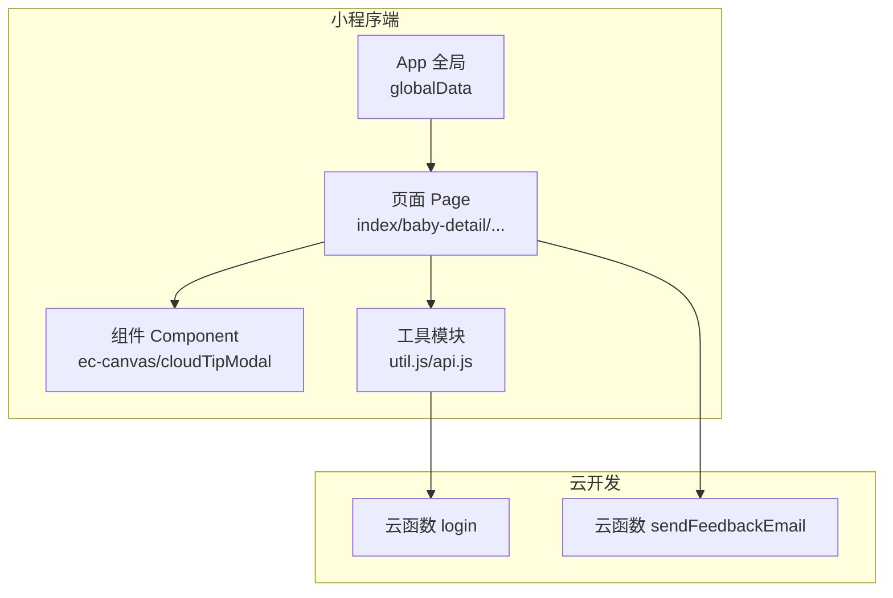
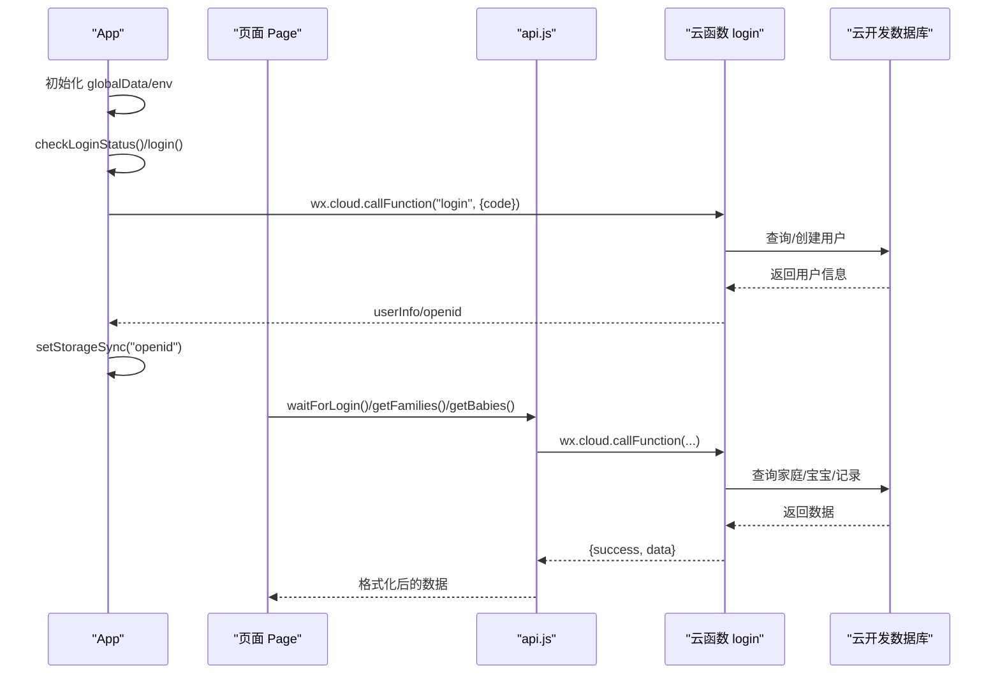
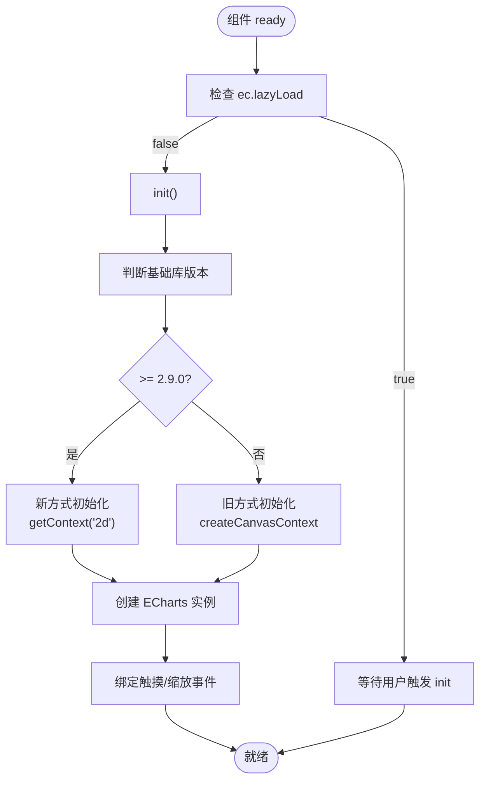
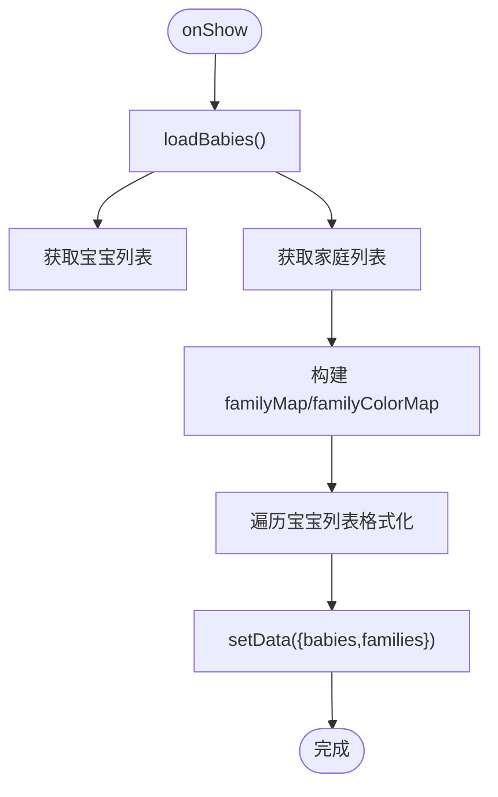
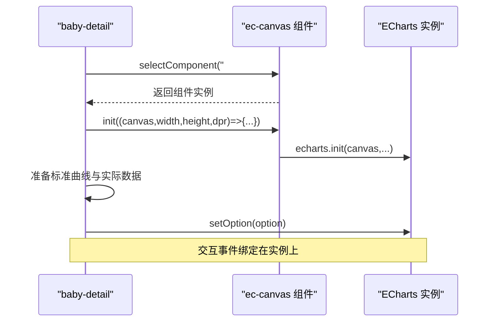
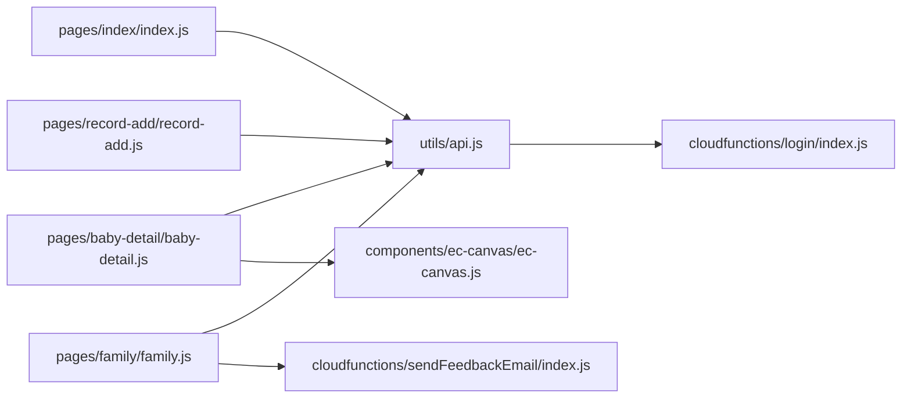

# 内存管理优化

<cite>
**本文引用的文件**
- [miniprogram/app.js](file://miniprogram/app.js)
- [miniprogram/app.json](file://miniprogram/app.json)
- [miniprogram/utils/util.js](file://miniprogram/utils/util.js)
- [miniprogram/utils/api.js](file://miniprogram/utils/api.js)
- [miniprogram/components/ec-canvas/ec-canvas.js](file://miniprogram/components/ec-canvas/ec-canvas.js)
- [miniprogram/pages/index/index.js](file://miniprogram/pages/index/index.js)
- [miniprogram/pages/baby-detail/baby-detail.js](file://miniprogram/pages/baby-detail/baby-detail.js)
- [miniprogram/pages/baby-add/baby-add.js](file://miniprogram/pages/baby-add/baby-add.js)
- [miniprogram/pages/record-add/record-add.js](file://miniprogram/pages/record-add/record-add.js)
- [miniprogram/pages/family/family.js](file://miniprogram/pages/family/family.js)
- [miniprogram/components/cloudTipModal/index.js](file://miniprogram/components/cloudTipModal/index.js)
- [cloudfunctions/login/index.js](file://cloudfunctions/login/index.js)
- [cloudfunctions/sendFeedbackEmail/index.js](file://cloudfunctions/sendFeedbackEmail/index.js)
</cite>

## 目录
1. [简介](#简介)
2. [项目结构与内存相关特性](#项目结构与内存相关特性)
3. [核心组件与内存影响](#核心组件与内存影响)
4. [架构总览与数据流](#架构总览与数据流)
5. [详细组件分析与内存优化点](#详细组件分析与内存优化点)
6. [依赖关系与耦合度分析](#依赖关系与耦合度分析)
7. [性能与内存特性](#性能与内存特性)
8. [故障排查与常见问题](#故障排查与常见问题)
9. [结论](#结论)
10. [附录：最佳实践清单](#附录最佳实践清单)

## 简介
本指南面向微信小程序开发者，聚焦“内存管理与性能优化”。结合本项目的实际代码，系统讲解：
- JavaScript 内存管理原理与垃圾回收机制
- 内存泄漏的识别与预防
- 小程序特有的内存限制与优化策略（页面生命周期、组件销毁时机）
- 内存使用监控方法（占用统计、峰值分析、泄漏检测工具）
- 数据结构优化技巧（对象池、循环引用避免、大数据处理）
- 最佳实践（及时释放资源、合理使用全局变量、避免内存碎片）
- 具体问题诊断与解决方案

## 项目结构与内存相关特性
- 应用入口与全局状态：通过 App 实例维护全局数据，减少重复初始化与跨页面共享成本。
- 页面懒加载与延迟渲染：部分图表组件采用懒加载，降低首屏内存压力。
- 组件化与局部作用域：组件内部状态与事件处理在组件生命周期内管理，有利于 GC 回收。
- 云函数封装：将复杂权限校验与数据聚合逻辑下沉至云函数，前端减少大对象持有与持久缓存。

**图表来源**
- [miniprogram/app.js:1-56](file://miniprogram/app.js#L1-L56)
- [miniprogram/app.json:1-39](file://miniprogram/app.json#L1-L39)
- [miniprogram/utils/api.js:1-800](file://miniprogram/utils/api.js#L1-L800)
- [cloudfunctions/login/index.js:1-800](file://cloudfunctions/login/index.js#L1-L800)
- [cloudfunctions/sendFeedbackEmail/index.js:1-21](file://cloudfunctions/sendFeedbackEmail/index.js#L1-L21)

**章节来源**
- [miniprogram/app.js:1-56](file://miniprogram/app.js#L1-L56)
- [miniprogram/app.json:1-39](file://miniprogram/app.json#L1-L39)

## 核心组件与内存影响
- 工具模块（util.js、api.js）：被多页面复用，避免重复计算与重复初始化；注意避免在工具模块中持有页面实例或长生命周期对象。
- 图表组件（ec-canvas）：涉及 Canvas 初始化、echarts 实例创建与事件绑定，需要在组件销毁或页面隐藏时释放图表实例，防止内存泄漏。
- 页面（index、baby-detail、record-add、family）：页面 onShow/onHide 生命周期与 setData 使用频率直接影响内存峰值；图表懒加载与数据格式化会带来短期峰值。
- 云函数（login、sendFeedbackEmail）：将权限与数据聚合逻辑迁移至云端，前端减少大对象常驻，降低内存压力。

**章节来源**
- [miniprogram/utils/util.js:1-55](file://miniprogram/utils/util.js#L1-L55)
- [miniprogram/utils/api.js:1-800](file://miniprogram/utils/api.js#L1-L800)
- [miniprogram/components/ec-canvas/ec-canvas.js:1-285](file://miniprogram/components/ec-canvas/ec-canvas.js#L1-L285)
- [miniprogram/pages/index/index.js:1-144](file://miniprogram/pages/index/index.js#L1-L144)
- [miniprogram/pages/baby-detail/baby-detail.js:1-691](file://miniprogram/pages/baby-detail/baby-detail.js#L1-L691)
- [cloudfunctions/login/index.js:1-800](file://cloudfunctions/login/index.js#L1-L800)
- [cloudfunctions/sendFeedbackEmail/index.js:1-21](file://cloudfunctions/sendFeedbackEmail/index.js#L1-L21)

## 架构总览与数据流
- 登录流程：App 初始化时调用登录，成功后写入 globalData 并持久化到本地存储，供后续 API 调用使用。
- 权限与数据：前端通过云函数接口完成权限校验与数据聚合，避免直接访问数据库导致的大对象持有。
- 图表渲染：页面 onReady 时根据 tab 切换懒加载图表，初始化 ECharts 实例并设置选项，交互事件绑定在实例上，需关注实例释放。

**图表来源**
- [miniprogram/app.js:1-56](file://miniprogram/app.js#L1-L56)
- [miniprogram/utils/api.js:1-800](file://miniprogram/utils/api.js#L1-L800)
- [cloudfunctions/login/index.js:1-800](file://cloudfunctions/login/index.js#L1-L800)

## 详细组件分析与内存优化点

### 图表组件（ec-canvas）内存优化
- 初始化路径：支持新旧 Canvas 版本，新版本使用 node.getContext('2d')，旧版本使用 wx.createCanvasContext。两种路径均创建 WxCanvas 包装对象与 ECharts 实例。
- 事件绑定：触摸事件映射到 ZRender Handler，频繁交互会产生大量临时对象，需在组件销毁或页面隐藏时释放图表实例。
- 懒加载策略：组件属性 lazyLoad 控制是否延迟初始化，页面切换到图表页再初始化，降低内存峰值。
- 性能建议：
  - 在页面 onHide/onUnload 中显式销毁图表实例，释放内部引用链。
  - 避免在回调中持有对页面实例的强引用，防止循环引用。
  - 大数据集绘制时，适当降低 progressive、采样或分批渲染。

**图表来源**
- [miniprogram/components/ec-canvas/ec-canvas.js:52-192](file://miniprogram/components/ec-canvas/ec-canvas.js#L52-L192)

**章节来源**
- [miniprogram/components/ec-canvas/ec-canvas.js:1-285](file://miniprogram/components/ec-canvas/ec-canvas.js#L1-L285)

### 页面（index）内存优化
- 数据格式化：在加载宝宝列表时，对每个宝宝计算年龄、拼接家庭名与颜色索引，形成 formattedBabies。注意避免在循环中创建过多临时对象，尽量复用中间变量。
- 异步加载：同时获取宝宝列表与家庭列表，再合并格式化，减少多次 setData 的抖动。
- 交互控制：添加/删除宝宝前进行权限检查与数量限制，避免无效渲染。

**图表来源**
- [miniprogram/pages/index/index.js:14-52](file://miniprogram/pages/index/index.js#L14-L52)

**章节来源**
- [miniprogram/pages/index/index.js:1-144](file://miniprogram/pages/index/index.js#L1-L144)

### 页面（baby-detail）内存优化
- 图表懒加载：onReady 时根据 currentTab 决定初始化身高/体重图表，避免同时初始化两个图表造成峰值。
- 数据准备：对记录按时间排序，计算月龄，构造标准曲线与实际数据序列，注意避免在循环中创建大数组副本。
- 权限与交互：姓名/头像修改、记录增删均在权限校验后再发起请求，减少无效渲染与网络请求。
- 事件绑定：图表实例绑定 mousewheel、dataZoom 等事件，需在页面卸载时解除绑定或销毁实例。

**图表来源**
- [miniprogram/pages/baby-detail/baby-detail.js:323-397](file://miniprogram/pages/baby-detail/baby-detail.js#L323-L397)

**章节来源**
- [miniprogram/pages/baby-detail/baby-detail.js:1-691](file://miniprogram/pages/baby-detail/baby-detail.js#L1-L691)

### 页面（family）内存优化
- 头像批量更新：上传头像后遍历所有家庭调用 updateMemberInfo，注意避免在循环中创建过多闭包与临时对象。
- 反馈上传：图片上传到云存储后保存到数据库，异步调用云函数发送邮件，不影响主线程渲染。
- 权限与成员管理：权限变更与成员移除均通过云函数完成，前端保持轻量状态。

**章节来源**
- [miniprogram/pages/family/family.js:1-757](file://miniprogram/pages/family/family.js#L1-L757)

### 工具模块（util、api）内存优化
- util：纯函数计算年龄与格式化字符串，避免持有外部状态，适合复用。
- api：封装等待登录、获取数据、权限校验等逻辑，统一错误处理与超时控制，减少页面重复代码与临时对象。

**章节来源**
- [miniprogram/utils/util.js:1-55](file://miniprogram/utils/util.js#L1-L55)
- [miniprogram/utils/api.js:1-800](file://miniprogram/utils/api.js#L1-L800)

## 依赖关系与耦合度分析
- 页面与工具模块：页面通过 require 方式引入 api/util，耦合度低，便于测试与复用。
- 页面与组件：图表组件通过自定义组件形式注入，页面仅通过组件 ID 与 init 回调交互，降低耦合。
- 页面与云函数：通过 wx.cloud.callFunction 调用，前后端职责清晰，前端不直接持有数据库连接或大对象。
- 云函数：集中处理权限校验与数据聚合，避免前端重复计算与缓存，降低内存占用。

**图表来源**
- [miniprogram/pages/index/index.js:1-144](file://miniprogram/pages/index/index.js#L1-L144)
- [miniprogram/pages/baby-detail/baby-detail.js:1-691](file://miniprogram/pages/baby-detail/baby-detail.js#L1-L691)
- [miniprogram/pages/record-add/record-add.js:1-118](file://miniprogram/pages/record-add/record-add.js#L1-L118)
- [miniprogram/pages/family/family.js:1-757](file://miniprogram/pages/family/family.js#L1-L757)
- [miniprogram/utils/api.js:1-800](file://miniprogram/utils/api.js#L1-L800)
- [miniprogram/components/ec-canvas/ec-canvas.js:1-285](file://miniprogram/components/ec-canvas/ec-canvas.js#L1-L285)
- [cloudfunctions/login/index.js:1-800](file://cloudfunctions/login/index.js#L1-L800)
- [cloudfunctions/sendFeedbackEmail/index.js:1-21](file://cloudfunctions/sendFeedbackEmail/index.js#L1-L21)

## 性能与内存特性
- 页面生命周期：onShow/onHide/onUnload 对应进入/离开/销毁，是释放图表实例、取消定时器、解绑事件的最佳时机。
- 懒加载：图表组件支持 lazyLoad，页面切换到图表页再初始化，显著降低首屏内存峰值。
- 云函数：将权限与聚合逻辑迁移到云端，前端仅保留轻量状态，减少大对象常驻。
- 数据格式化：在页面层进行格式化与合并，避免在工具层持有页面上下文，降低跨层引用风险。

[本节为通用指导，无需特定文件引用]

## 故障排查与常见问题
- 图表内存泄漏
  - 现象：页面切换后图表仍占用内存，或页面卸载后内存不降。
  - 排查：确认页面 onHide/onUnload 是否调用图表实例销毁；检查事件绑定是否在实例上。
  - 解决：在页面卸载时调用 chart.dispose()，解除事件绑定。
- 登录态异常
  - 现象：waitForLogin 超时或 userInfo 为空。
  - 排查：检查 App.login 流程与云函数返回；确认本地存储 openid 是否正确写入。
  - 解决：增加重试与超时提示，确保 userInfo 与 openid 同步写入。
- 权限校验失败
  - 现象：添加/删除记录时报无权限。
  - 排查：检查云函数中权限判断逻辑与家庭成员信息。
  - 解决：在前端明确提示权限不足，引导用户升级权限或联系管理员。
- 大数据渲染卡顿
  - 现象：图表初始化缓慢或滚动卡顿。
  - 排查：检查数据量与 progressive 设置；确认是否一次性渲染全部数据。
  - 解决：分批渲染、降低采样、禁用渐进式或使用虚拟滚动。

**章节来源**
- [miniprogram/utils/api.js:14-41](file://miniprogram/utils/api.js#L14-L41)
- [miniprogram/pages/baby-detail/baby-detail.js:323-397](file://miniprogram/pages/baby-detail/baby-detail.js#L323-L397)
- [cloudfunctions/login/index.js:1-800](file://cloudfunctions/login/index.js#L1-L800)

## 结论
本项目通过“页面懒加载 + 组件化 + 云函数聚合”的架构，在保证功能完整性的同时有效降低了前端内存压力。针对图表组件与页面生命周期的优化，是进一步提升内存表现的关键。建议在以下方面持续改进：
- 在页面 onHide/onUnload 中显式释放图表实例与事件
- 控制一次性渲染的数据规模，采用分批/采样策略
- 避免在工具模块中持有页面实例或长生命周期对象
- 严格遵循权限校验前置，减少无效渲染与网络请求

[本节为总结，无需特定文件引用]

## 附录：最佳实践清单
- 页面生命周期管理
  - 在 onHide/onUnload 中释放图表实例、取消定时器、解绑事件
  - 避免在页面实例上持有大对象或长生命周期引用
- 组件销毁时机控制
  - 图表组件支持 lazyLoad，按需初始化；组件销毁时调用 dispose
  - 避免在组件外持有组件实例引用
- 数据结构优化
  - 避免在循环中创建大数组副本；优先原地修改或复用中间变量
  - 使用对象池模式缓存可复用对象，减少频繁分配
  - 避免循环引用：清理闭包中的页面实例引用
- 大数据处理策略
  - 分批渲染：将大数据拆分为小批次逐步渲染
  - 采样与降维：对高密度数据进行采样或聚合
  - 渐进式渲染：关闭或降低 progressive，减少一次性渲染压力
- 云函数与前端职责分离
  - 将权限校验与数据聚合下沉至云函数，前端仅保留轻量状态
  - 通过 callFunction 统一接口，减少前端缓存与重复计算
- 监控与诊断
  - 使用开发者工具的性能面板观察内存峰值与增长趋势
  - 在关键路径（图表初始化、数据加载）埋点统计耗时与内存变化
  - 定期复盘高频页面与组件的内存占用，持续优化

[本节为通用指导，无需特定文件引用]