# 图表渲染优化

<cite>
**本文档引用的文件**
- [ec-canvas.js](file://miniprogram/components/ec-canvas/ec-canvas.js)
- [echarts.js](file://miniprogram/components/ec-canvas/echarts.js)
- [wx-canvas.js](file://miniprogram/components/ec-canvas/wx-canvas.js)
- [baby-detail.js](file://miniprogram/pages/baby-detail/baby-detail.js)
- [util.js](file://miniprogram/utils/util.js)
- [api.js](file://miniprogram/utils/api.js)
- [app.js](file://miniprogram/app.js)
- [app.json](file://miniprogram/app.json)
</cite>

## 目录
1. [简介](#简介)
2. [项目架构概览](#项目架构概览)
3. [核心组件分析](#核心组件分析)
4. [性能优化策略](#性能优化策略)
5. [大数据量处理方案](#大数据量处理方案)
6. [内存管理优化](#内存管理优化)
7. [交互性能优化](#交互性能优化)
8. [监控与调试](#监控与调试)
9. [最佳实践总结](#最佳实践总结)

## 简介

本指南专注于微信小程序中ECharts图表的渲染性能优化。通过对BabyAssistant_wechat_1项目的深入分析，我们总结了针对小程序环境的图表渲染优化策略，包括数据量优化、渲染频率控制、Canvas绘制优化、组件复用、交互优化以及内存管理等方面。

该项目是一个专为父母设计的宝宝成长记录工具，需要展示宝宝的身高、体重等成长数据曲线，对图表渲染性能提出了较高要求。

## 项目架构概览

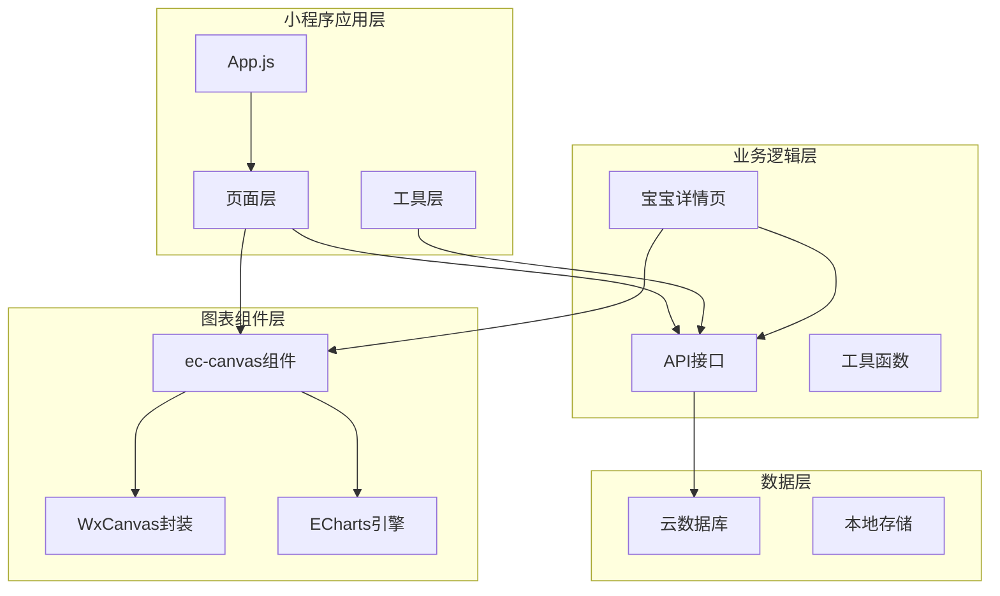

**图表来源**
- [ec-canvas.js:1-285](file://miniprogram/components/ec-canvas/ec-canvas.js#L1-L285)
- [baby-detail.js:156-691](file://miniprogram/pages/baby-detail/baby-detail.js#L156-L691)

**章节来源**
- [ec-canvas.js:31-77](file://miniprogram/components/ec-canvas/ec-canvas.js#L31-L77)
- [baby-detail.js:156-191](file://miniprogram/pages/baby-detail/baby-detail.js#L156-L191)

## 核心组件分析

### ec-canvas组件架构

ec-canvas组件是整个图表系统的核心，负责ECharts与微信小程序Canvas的桥接工作。

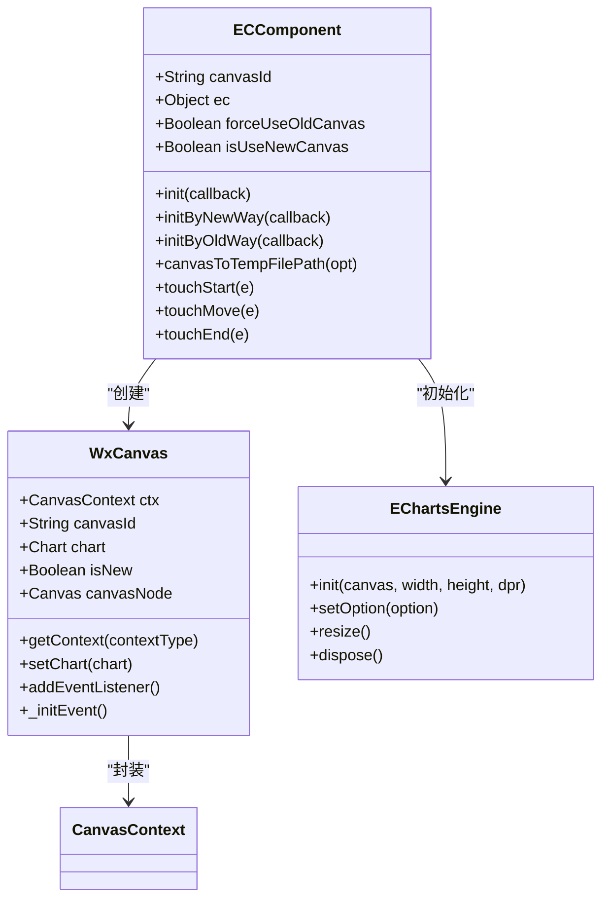

**图表来源**
- [ec-canvas.js:31-275](file://miniprogram/components/ec-canvas/ec-canvas.js#L31-L275)
- [wx-canvas.js:1-112](file://miniprogram/components/ec-canvas/wx-canvas.js#L1-L112)

### 图表初始化流程

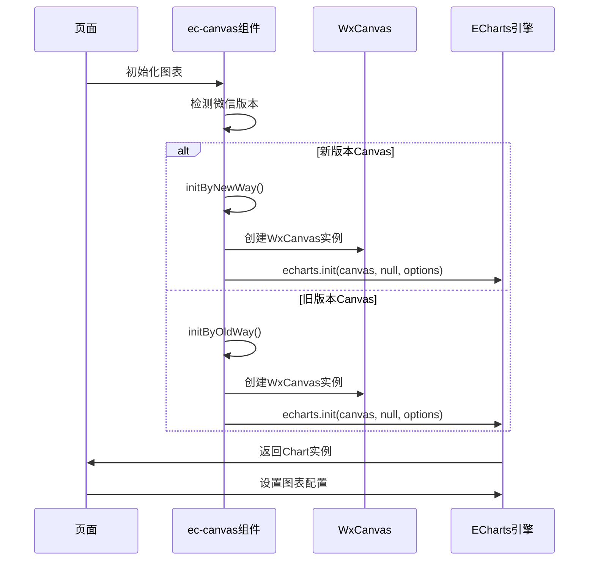

**图表来源**
- [ec-canvas.js:80-192](file://miniprogram/components/ec-canvas/ec-canvas.js#L80-L192)
- [baby-detail.js:323-397](file://miniprogram/pages/baby-detail/baby-detail.js#L323-L397)

**章节来源**
- [ec-canvas.js:79-192](file://miniprogram/components/ec-canvas/ec-canvas.js#L79-L192)
- [wx-canvas.js:1-112](file://miniprogram/components/ec-canvas/wx-canvas.js#L1-L112)

## 性能优化策略

### 数据量优化

#### 1. 数据预处理与格式化

项目中对数据进行了充分的预处理，确保图表渲染效率：

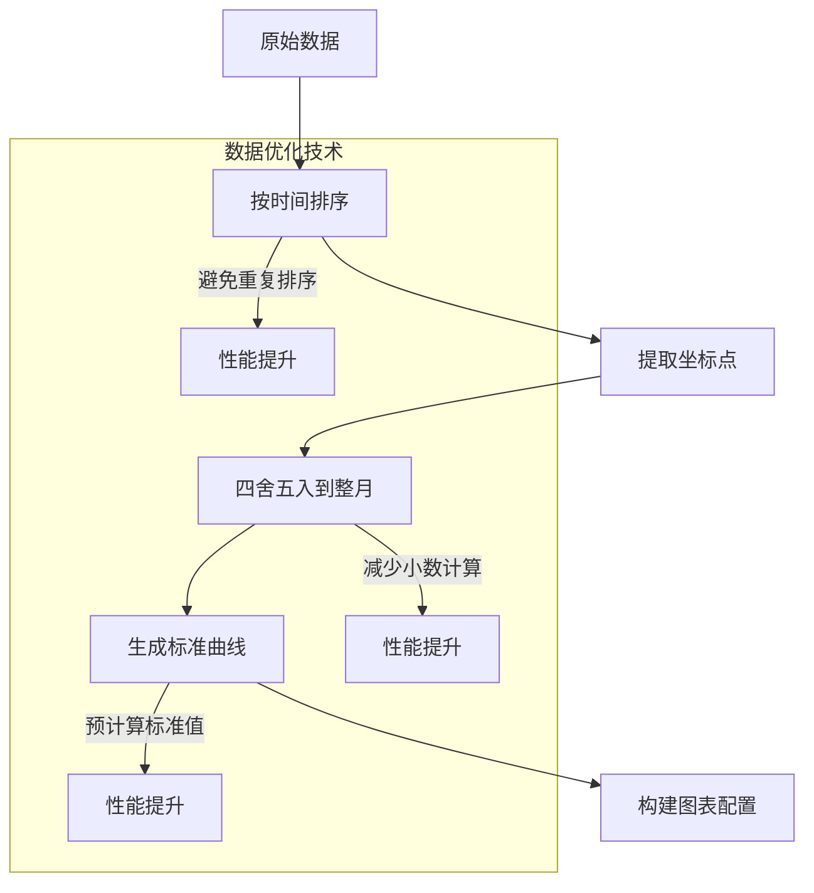

**图表来源**
- [baby-detail.js:339-357](file://miniprogram/pages/baby-detail/baby-detail.js#L339-L357)

#### 2. 动态数据更新策略

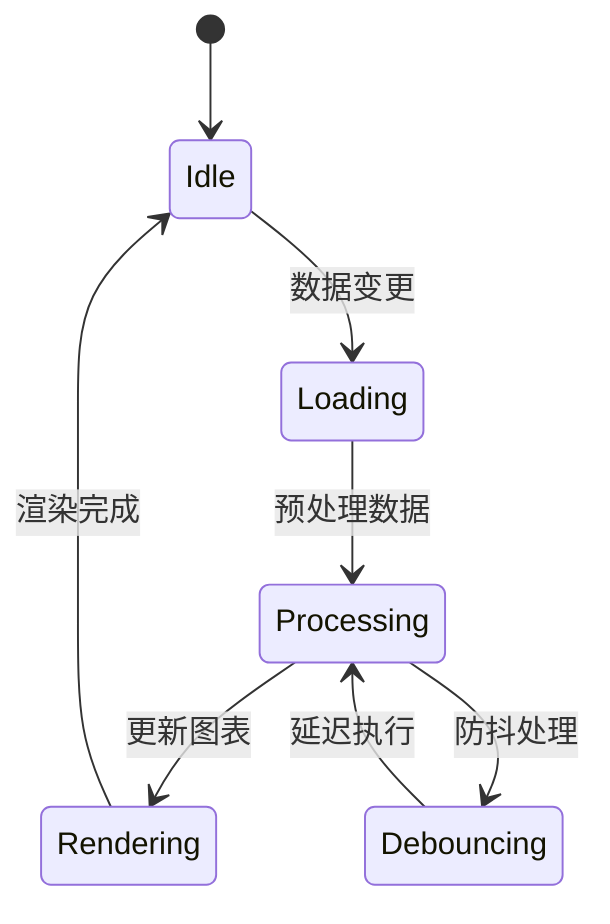

**图表来源**
- [baby-detail.js:323-397](file://miniprogram/pages/baby-detail/baby-detail.js#L323-L397)

**章节来源**
- [baby-detail.js:339-397](file://miniprogram/pages/baby-detail/baby-detail.js#L339-L397)

### 渲染频率控制

#### 1. Canvas版本检测与适配

组件根据微信基础库版本自动选择最优的Canvas实现：

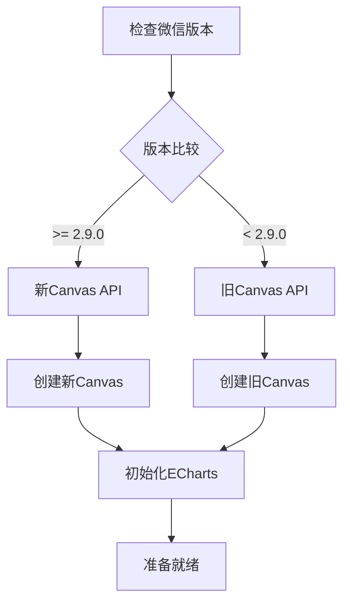

**图表来源**
- [ec-canvas.js:80-108](file://miniprogram/components/ec-canvas/ec-canvas.js#L80-L108)

#### 2. 渲染节流机制

通过设置`progressive = 0`禁用渐进式渲染，避免在小程序环境中出现兼容性问题：

**章节来源**
- [ec-canvas.js:52-66](file://miniprogram/components/ec-canvas/ec-canvas.js#L52-L66)

### Canvas绘制优化

#### 1. 设备像素比优化

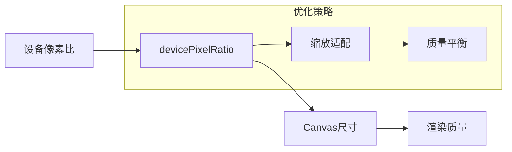

**图表来源**
- [baby-detail.js:330-335](file://miniprogram/pages/baby-detail/baby-detail.js#L330-L335)

#### 2. 绘制上下文优化

WxCanvas封装提供了高效的Canvas操作接口：

**章节来源**
- [wx-canvas.js:19-24](file://miniprogram/components/ec-canvas/wx-canvas.js#L19-L24)
- [wx-canvas.js:59-63](file://miniprogram/components/ec-canvas/wx-canvas.js#L59-L63)

## 大数据量处理方案

### 数据采样与聚合

#### 1. 时间轴数据采样

对于大量历史数据，采用时间采样的方式减少渲染负担：

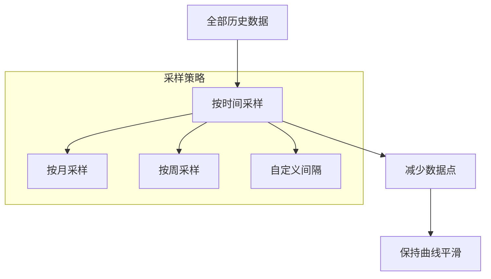

#### 2. 标准曲线优化

项目中实现了预计算的标准曲线数据，避免运行时计算：

**章节来源**
- [baby-detail.js:263-321](file://miniprogram/pages/baby-detail/baby-detail.js#L263-L321)

### 虚拟滚动实现

虽然项目中没有直接实现虚拟滚动，但可以通过以下方式优化大数据量场景：

1. **分页加载**：每次只加载最近N个月的数据
2. **增量更新**：新增数据时只更新变化部分
3. **数据缓存**：缓存已计算的标准曲线数据

## 内存管理优化

### 图表实例生命周期管理

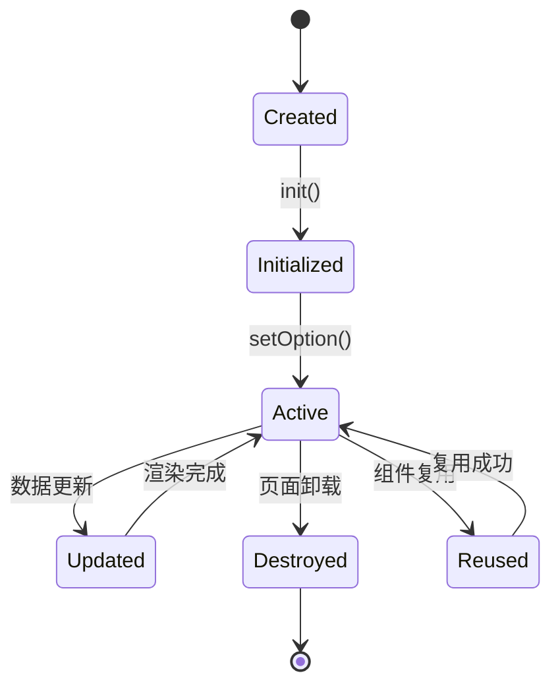

**图表来源**
- [ec-canvas.js:193-214](file://miniprogram/components/ec-canvas/ec-canvas.js#L193-L214)

### 内存泄漏防护

#### 1. 事件监听器清理

组件在销毁时应清理所有事件监听器：

#### 2. 图表实例释放

```javascript
// 推荐的清理模式
if (this.chart) {
    this.chart.dispose();
    this.chart = null;
}
```

#### 3. 数据引用清理

避免循环引用导致的内存泄漏：

**章节来源**
- [ec-canvas.js:216-273](file://miniprogram/components/ec-canvas/ec-canvas.js#L216-L273)

## 交互性能优化

### 触摸事件优化

#### 1. 事件代理与转发

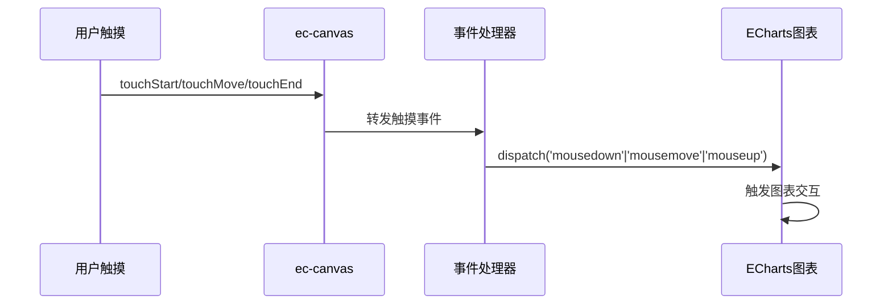

**图表来源**
- [ec-canvas.js:216-273](file://miniprogram/components/ec-canvas/ec-canvas.js#L216-L273)

#### 2. 手势识别优化

组件实现了基本的手势识别功能，支持缩放和平移操作：

**章节来源**
- [ec-canvas.js:277-284](file://miniprogram/components/ec-canvas/ec-canvas.js#L277-L284)

### 缩放与平移性能

#### 1. dataZoom配置优化

项目中使用了多种dataZoom配置来优化大数据量场景：

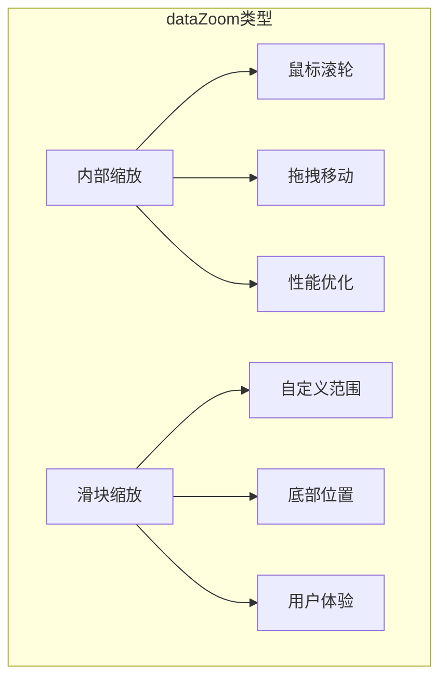

**图表来源**
- [baby-detail.js:44-57](file://miniprogram/pages/baby-detail/baby-detail.js#L44-L57)

#### 2. 自适应缩放范围

根据数据量动态调整缩放范围，确保最佳显示效果：

**章节来源**
- [baby-detail.js:370-387](file://miniprogram/pages/baby-detail/baby-detail.js#L370-L387)

## 监控与调试

### 性能监控指标

#### 1. 渲染时间监控

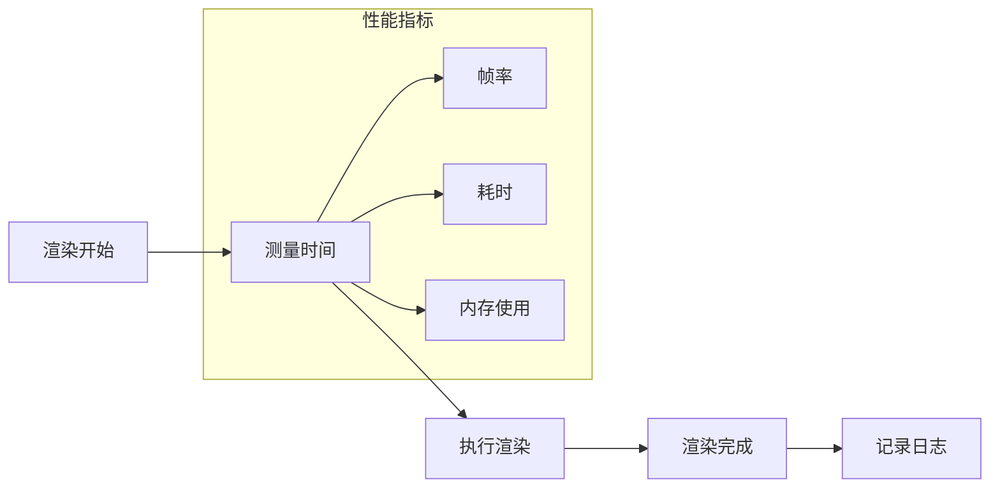

#### 2. 内存使用监控

通过微信开发者工具的性能面板监控内存使用情况。

### 调试工具使用

#### 1. 微信开发者工具

- **性能面板**：监控CPU、内存、网络使用
- **网络面板**：监控API请求性能
- **调试面板**：断点调试和日志输出

#### 2. 自定义监控

```javascript
// 性能监控示例
const startTime = Date.now();
chart.setOption(option);
const endTime = Date.now();
console.log(`图表渲染耗时: ${endTime - startTime}ms`);
```

**章节来源**
- [app.json:38](file://miniprogram/app.json#L38](file://miniprogram/app.json#L38))

## 最佳实践总结

### 1. 初始化优化

- 使用`lazyLoad: true`延迟图表初始化
- 在页面显示时再初始化图表
- 合理设置Canvas尺寸和DPR

### 2. 数据处理优化

- 预处理数据，避免运行时计算
- 使用采样技术减少数据点数量
- 缓存计算结果，避免重复计算

### 3. 渲染优化

- 选择合适的Canvas版本
- 合理配置dataZoom参数
- 控制动画效果，避免过度动画

### 4. 内存管理

- 及时释放图表实例
- 清理事件监听器
- 避免内存泄漏

### 5. 交互优化

- 优化触摸事件处理
- 合理设置交互响应时间
- 提供良好的用户体验

通过实施这些优化策略，可以在保证图表显示质量的同时，显著提升小程序的性能表现，为用户提供流畅的图表浏览体验。