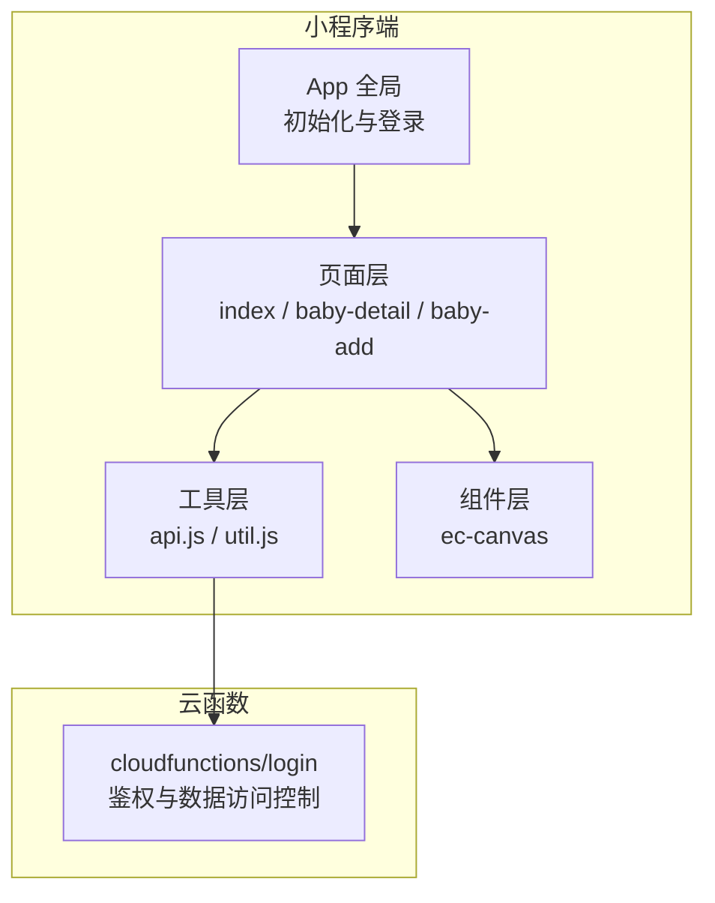
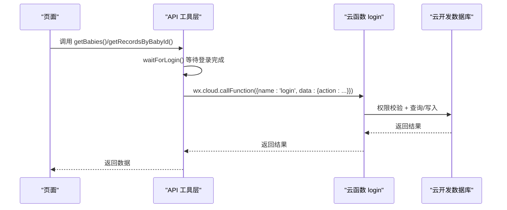
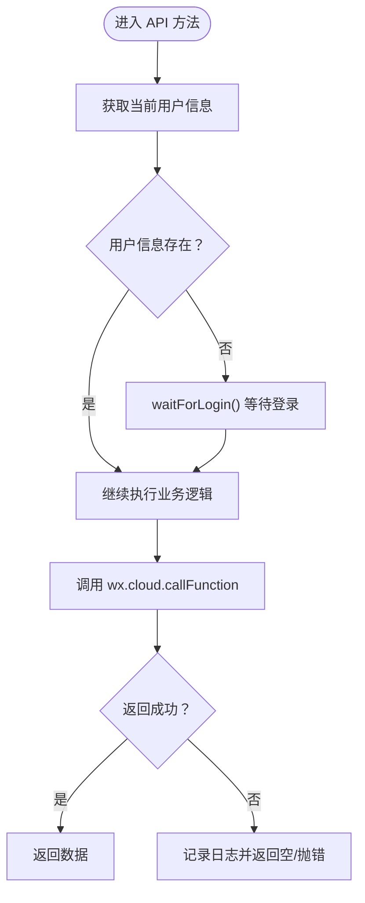
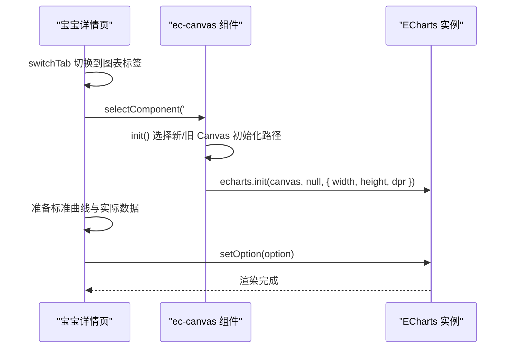
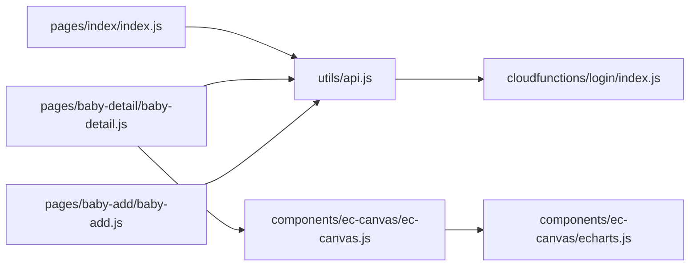
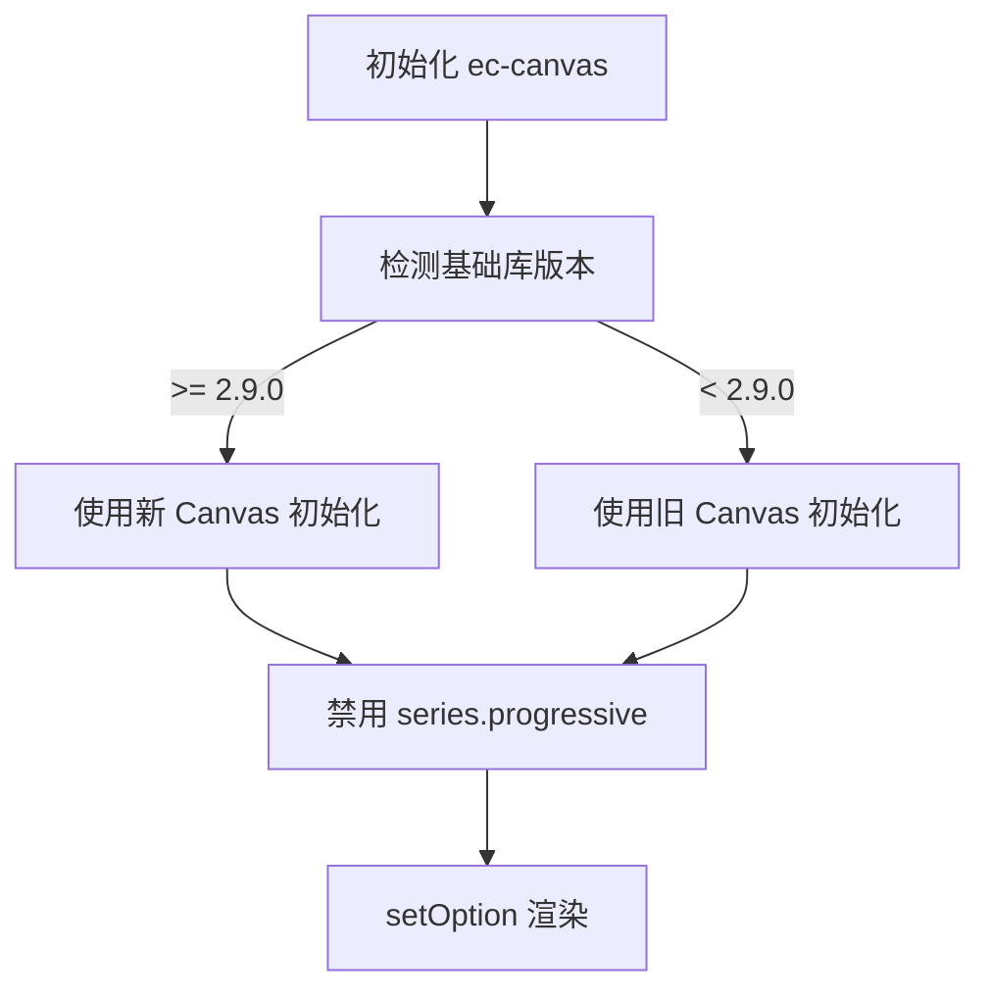

# 性能优化

<cite>
**本文引用的文件**
- [app.js](file://miniprogram/app.js)
- [app.json](file://miniprogram/app.json)
- [api.js](file://miniprogram/utils/api.js)
- [util.js](file://miniprogram/utils/util.js)
- [index.js](file://miniprogram/pages/index/index.js)
- [baby-detail.js](file://miniprogram/pages/baby-detail/baby-detail.js)
- [ec-canvas.js](file://miniprogram/components/ec-canvas/ec-canvas.js)
- [echarts.js](file://miniprogram/components/ec-canvas/echarts.js)
- [wx-canvas.js](file://miniprogram/components/ec-canvas/wx-canvas.js)
- [login/index.js](file://cloudfunctions/login/index.js)
- [login/package.json](file://cloudfunctions/login/package.json)
- [baby-add.js](file://miniprogram/pages/baby-add/baby-add.js)
</cite>

## 目录
1. [简介](#简介)
2. [项目结构](#项目结构)
3. [核心组件](#核心组件)
4. [架构总览](#架构总览)
5. [详细组件分析](#详细组件分析)
6. [依赖关系分析](#依赖关系分析)
7. [性能考量与优化建议](#性能考量与优化建议)
8. [故障排查指南](#故障排查指南)
9. [结论](#结论)
10. [附录](#附录)

## 简介
本指南面向“宝宝助手”小程序的性能优化，围绕代码层优化、网络请求优化、数据加载优化、内存管理、图表渲染性能（ECharts）、性能监控方案、缓存策略、用户体验优化以及性能测试方法展开，帮助开发者系统性地提升应用性能与稳定性。

## 项目结构
- 小程序端采用分层组织：页面层（pages）、组件层（components）、工具层（utils），并通过云函数（cloudfunctions）提供后端能力。
- 关键路径：页面通过 utils/api.js 调用微信云开发能力；图表渲染由 components/ec-canvas 组件封装 ECharts；云函数 login 提供鉴权与数据访问控制。

**图表来源**
- [app.js:1-56](file://miniprogram/app.js#L1-L56)
- [api.js:1-879](file://miniprogram/utils/api.js#L1-L879)
- [ec-canvas.js:1-285](file://miniprogram/components/ec-canvas/ec-canvas.js#L1-L285)
- [login/index.js:1-814](file://cloudfunctions/login/index.js#L1-L814)

**章节来源**
- [app.js:1-56](file://miniprogram/app.js#L1-L56)
- [app.json:1-39](file://miniprogram/app.json#L1-L39)

## 核心组件
- 登录与全局初始化：在 App.onLaunch 中初始化云环境并触发登录流程，避免页面重复登录逻辑。
- API 层：统一封装用户信息获取、权限校验、数据 CRUD，统一处理登录等待与错误。
- 页面层：首页展示宝宝列表，详情页展示图表与记录，新增页表单提交。
- 图表组件：ec-canvas 封装 ECharts，支持新旧 Canvas 初始化路径与事件桥接。
- 云函数：login 提供鉴权、家庭/宝宝/记录等读写操作，统一权限校验与事务保障。

**章节来源**
- [app.js:1-56](file://miniprogram/app.js#L1-L56)
- [api.js:1-879](file://miniprogram/utils/api.js#L1-L879)
- [index.js:1-144](file://miniprogram/pages/index/index.js#L1-L144)
- [baby-detail.js:1-691](file://miniprogram/pages/baby-detail/baby-detail.js#L1-L691)
- [ec-canvas.js:1-285](file://miniprogram/components/ec-canvas/ec-canvas.js#L1-L285)
- [login/index.js:1-814](file://cloudfunctions/login/index.js#L1-L814)

## 架构总览
小程序端通过云函数实现鉴权与数据访问控制，页面通过 API 工具层发起请求，图表组件负责渲染与交互。

**图表来源**
- [api.js:1-879](file://miniprogram/utils/api.js#L1-L879)
- [login/index.js:1-814](file://cloudfunctions/login/index.js#L1-L814)

## 详细组件分析

### 登录与全局初始化（App）
- 在 onLaunch 中初始化云环境与登录，避免页面重复登录。
- 登录成功后将 openid 写入本地存储，供后续 API 使用。

**章节来源**
- [app.js:1-56](file://miniprogram/app.js#L1-L56)

### API 工具层（utils/api.js）
- 登录等待机制：waitForLogin 通过轮询等待登录完成，最大等待时间可控。
- 统一错误处理：所有 CRUD 操作捕获异常并返回空值或抛出错误。
- 权限校验：checkPermission 统一校验用户对某资源的权限。
- 数据聚合：首页加载时一次性获取宝宝列表与家庭映射，减少多次请求。

**图表来源**
- [api.js:1-879](file://miniprogram/utils/api.js#L1-L879)

**章节来源**
- [api.js:1-879](file://miniprogram/utils/api.js#L1-L879)

### 页面：首页（pages/index/index.js）
- onShow 触发加载，一次性获取宝宝列表与家庭映射，再逐条计算年龄与最新记录。
- 权限检查：添加/删除前校验用户权限，避免无效请求。
- 交互：跳转至详情页、添加页，删除弹窗确认。

**章节来源**
- [index.js:1-144](file://miniprogram/pages/index/index.js#L1-L144)

### 页面：宝宝详情（pages/baby-detail/baby-detail.js）
- 图表初始化：懒加载，切换到身高/体重标签页时再初始化。
- 数据准备：按月龄排序记录，构建标准曲线与实际数据。
- 交互：缩放、平移、点击等事件桥接到 ECharts。

**图表来源**
- [baby-detail.js:1-691](file://miniprogram/pages/baby-detail/baby-detail.js#L1-L691)
- [ec-canvas.js:1-285](file://miniprogram/components/ec-canvas/ec-canvas.js#L1-L285)

**章节来源**
- [baby-detail.js:1-691](file://miniprogram/pages/baby-detail/baby-detail.js#L1-L691)
- [ec-canvas.js:1-285](file://miniprogram/components/ec-canvas/ec-canvas.js#L1-L285)

### 图表组件：ec-canvas
- Canvas 版本兼容：根据基础库版本选择新/旧 Canvas 初始化路径。
- 进度限制：禁用 series.progressive，避免 drawImage 不支持 DOM 的问题。
- 事件桥接：将微信触摸事件映射到 ECharts 的鼠标事件。
- 导出：支持 canvasToTempFilePath 导出图片。

**章节来源**
- [ec-canvas.js:1-285](file://miniprogram/components/ec-canvas/ec-canvas.js#L1-L285)
- [wx-canvas.js:1-112](file://miniprogram/components/ec-canvas/wx-canvas.js#L1-L112)
- [echarts.js:1-46](file://miniprogram/components/ec-canvas/echarts.js#L1-L46)

### 云函数：login
- 动态环境：env 使用动态环境变量，便于多环境部署。
- 权限控制：严格校验用户在家庭内的权限，防止越权访问。
- 事务保障：删除宝宝/记录使用事务，保证一致性。
- 邀请码：创建/使用邀请码，异步清理过期邀请码。

**章节来源**
- [login/index.js:1-814](file://cloudfunctions/login/index.js#L1-L814)
- [login/package.json:1-16](file://cloudfunctions/login/package.json#L1-L16)

### 表单页面：新增宝宝（pages/baby-add/baby-add.js）
- 表单校验：在提交前校验必填项与数值有效性。
- 权限检查：仅一级助教可添加。
- 成功提示与回退。

**章节来源**
- [baby-add.js:1-120](file://miniprogram/pages/baby-add/baby-add.js#L1-L120)

## 依赖关系分析
- 页面依赖 utils/api.js 进行数据访问。
- API 工具层依赖微信云开发 SDK 与云函数 login。
- 图表组件依赖 ECharts 与微信 Canvas。
- 云函数依赖 wx-server-sdk 与云开发数据库。

**图表来源**
- [index.js:1-144](file://miniprogram/pages/index/index.js#L1-L144)
- [baby-detail.js:1-691](file://miniprogram/pages/baby-detail/baby-detail.js#L1-L691)
- [baby-add.js:1-120](file://miniprogram/pages/baby-add/baby-add.js#L1-L120)
- [api.js:1-879](file://miniprogram/utils/api.js#L1-L879)
- [login/index.js:1-814](file://cloudfunctions/login/index.js#L1-L814)
- [ec-canvas.js:1-285](file://miniprogram/components/ec-canvas/ec-canvas.js#L1-L285)
- [echarts.js:1-46](file://miniprogram/components/ec-canvas/echarts.js#L1-L46)

## 性能考量与优化建议

### 代码层面优化
- 避免重复登录：App 初始化时完成登录，页面不再重复登录。
- 统一错误处理：API 工具层集中处理错误，减少页面冗余判断。
- 懒加载与延迟初始化：图表仅在需要时初始化，降低首屏压力。
- 事件节流/去抖：高频交互（如缩放、拖拽）可结合图表配置进行节流。

**章节来源**
- [app.js:1-56](file://miniprogram/app.js#L1-L56)
- [api.js:1-879](file://miniprogram/utils/api.js#L1-L879)
- [baby-detail.js:1-691](file://miniprogram/pages/baby-detail/baby-detail.js#L1-L691)

### 网络请求优化
- 请求合并：首页一次性获取宝宝列表与家庭映射，减少多次请求。
- 登录等待：waitForLogin 控制最大等待时间，避免长时间阻塞。
- 云函数权限前置：在云函数侧完成权限校验与事务，前端仅做参数传递。
- CDN 与静态资源：将图片等静态资源放置云存储或 CDN，减少网络往返。

**章节来源**
- [api.js:1-879](file://miniprogram/utils/api.js#L1-L879)
- [login/index.js:1-814](file://cloudfunctions/login/index.js#L1-L814)

### 数据加载优化
- 首屏数据最小化：首页仅加载必要字段，详情页按需加载记录。
- 缓存策略：利用本地存储缓存 openid、用户信息与常用数据，减少重复请求。
- 分页与增量：记录较多时考虑分页或基于时间戳的增量加载。

**章节来源**
- [index.js:1-144](file://miniprogram/pages/index/index.js#L1-L144)
- [api.js:1-879](file://miniprogram/utils/api.js#L1-L879)

### 内存管理优化
- 及时释放图表实例：离开页面时销毁图表实例，避免内存泄漏。
- 避免大数组驻留：对临时数组及时清空或复用，减少 GC 压力。
- 事件解绑：组件卸载时解绑事件监听器。

**章节来源**
- [ec-canvas.js:1-285](file://miniprogram/components/ec-canvas/ec-canvas.js#L1-L285)
- [baby-detail.js:1-691](file://miniprogram/pages/baby-detail/baby-detail.js#L1-L691)

### 图表渲染性能优化（ECharts）
- Canvas 版本选择：优先使用新版 Canvas（2.9.0+），性能更佳。
- 禁用 progressive：小程序 Canvas 不支持 DOM，禁用 series.progressive。
- 事件桥接：将触摸事件映射为鼠标事件，减少额外适配成本。
- 数据量控制：对大量点的数据进行采样或降维，减少渲染开销。
- 缩放与平移：合理设置 dataZoom 起止值，避免全量渲染。

**图表来源**
- [ec-canvas.js:1-285](file://miniprogram/components/ec-canvas/ec-canvas.js#L1-L285)

**章节来源**
- [ec-canvas.js:1-285](file://miniprogram/components/ec-canvas/ec-canvas.js#L1-L285)
- [echarts.js:1-46](file://miniprogram/components/ec-canvas/echarts.js#L1-L46)

### 性能监控方案
- 关键指标：首屏渲染耗时、图表首次渲染耗时、页面切换耗时、接口响应时间、内存峰值。
- 监控手段：在关键节点埋点（onShow/onReady/setData 完成），上报到观测平台。
- 数据分析：按机型、基础库版本、网络类型分组分析性能差异。
- 瓶颈识别：结合火焰图与内存快照定位热点函数与内存泄漏点。

[本节为通用指导，无需特定文件引用]

### 缓存策略设计与实现
- 数据缓存：将 openid、用户信息、家庭列表、宝宝列表短期缓存于本地存储，设置过期时间。
- 图片缓存：对头像、图表导出图片设置本地缓存，减少重复下载。
- 接口缓存：对只读数据（如标准曲线）在小程序端缓存，避免重复计算与请求。

**章节来源**
- [api.js:1-879](file://miniprogram/utils/api.js#L1-L879)
- [app.js:1-56](file://miniprogram/app.js#L1-L56)

### 用户体验优化
- 首屏加载：懒加载图表、骨架屏占位、分批渲染。
- 页面切换：使用 wx.showNavigationBarLoading 与下拉刷新，提升感知速度。
- 交互响应：减少主线程阻塞，使用 setData 合并与延迟更新。
- 错误反馈：统一 Toast 提示，避免白屏与长时间无响应。

**章节来源**
- [index.js:1-144](file://miniprogram/pages/index/index.js#L1-L144)
- [baby-detail.js:1-691](file://miniprogram/pages/baby-detail/baby-detail.js#L1-L691)

### 性能测试方法与工具
- 基础库版本：对比 1.9.91、2.9.0、最新版本的渲染与交互性能。
- 设备覆盖：低端机、中端机、高端机分别测试。
- 工具：微信开发者工具性能面板、Network 面板、Memory 面板；第三方观测平台。
- 回归测试：每次改动后回归关键指标，建立自动化基线。

[本节为通用指导，无需特定文件引用]

## 故障排查指南
- 登录失败：检查 App 初始化云环境与登录流程，确认 openid 是否写入本地存储。
- 权限不足：核对云函数内权限校验逻辑，确认用户在家庭内的权限。
- 图表不显示：检查基础库版本、Canvas 初始化路径、禁用 progressive 设置。
- 内存溢出：确认图表实例在页面卸载时被销毁，避免事件监听器未解绑。

**章节来源**
- [app.js:1-56](file://miniprogram/app.js#L1-L56)
- [login/index.js:1-814](file://cloudfunctions/login/index.js#L1-L814)
- [ec-canvas.js:1-285](file://miniprogram/components/ec-canvas/ec-canvas.js#L1-L285)

## 结论
通过全局登录初始化、API 层统一处理、云函数权限与事务保障、图表组件的版本兼容与性能优化，以及完善的缓存与监控体系，“宝宝助手”小程序可在保证功能完整性的同时显著提升性能与用户体验。建议持续进行性能回归测试与指标监控，形成闭环优化机制。

## 附录
- 配置项参考：小程序基础库版本、懒加载配置、tabBar 样式与图标路径。
- 云函数依赖：wx-server-sdk 版本与环境变量配置。

**章节来源**
- [app.json:1-39](file://miniprogram/app.json#L1-L39)
- [login/package.json:1-16](file://cloudfunctions/login/package.json#L1-L16)