# 性能监控方案

<cite>
**本文档引用的文件**
- [app.js](file://miniprogram/app.js)
- [api.js](file://miniprogram/utils/api.js)
- [util.js](file://miniprogram/utils/util.js)
- [index.js](file://miniprogram/pages/index/index.js)
- [baby-detail.js](file://miniprogram/pages/baby-detail/baby-detail.js)
- [family.js](file://miniprogram/pages/family/family.js)
- [ec-canvas.js](file://miniprogram/components/ec-canvas/ec-canvas.js)
- [login/index.js](file://cloudfunctions/login/index.js)
- [sendFeedbackEmail/index.js](file://cloudfunctions/sendFeedbackEmail/index.js)
- [app.json](file://miniprogram/app.json)
- [auto-test.js](file://minitest/auto-test.js)
- [simple-test.js](file://minitest/simple-test.js)
- [test.config.json](file://minitest/test.config.json)
</cite>

## 更新摘要
**变更内容**
- 新增性能基准测试系统，包括综合性能评分机制
- 集成chart数据扩展和cachedStandardData字段优化
- 增强缓存效率监控和数据库查询性能测试
- 完善自动化测试套件，支持多维度性能评估
- 优化图表渲染性能监控和内存使用分析

## 目录
1. [项目概述](#项目概述)
2. [性能指标监控体系](#性能指标监控体系)
3. [性能数据采集方法](#性能数据采集方法)
4. [性能分析工具使用指南](#性能分析工具使用指南)
5. [性能瓶颈识别方法](#性能瓶颈识别方法)
6. [性能优化效果评估](#性能优化效果评估)
7. [性能告警机制设计](#性能告警机制设计)
8. [架构设计与实现](#架构设计与实现)
9. [最佳实践与建议](#最佳实践与建议)
10. [故障排查指南](#故障排查指南)

## 项目概述

本项目是一个基于微信小程序的宝宝成长记录管理系统，采用前后端分离架构，前端使用小程序框架，后端使用云开发服务。系统包含宝宝信息管理、家庭协作、成长记录等功能模块。

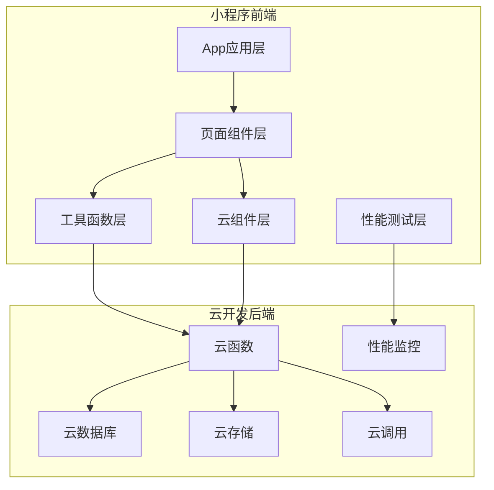

**图表来源**
- [app.js:1-56](file://miniprogram/app.js#L1-L56)
- [api.js:1-879](file://miniprogram/utils/api.js#L1-L879)
- [login/index.js:1-814](file://cloudfunctions/login/index.js#L1-L814)
- [auto-test.js:1-606](file://minitest/auto-test.js#L1-L606)

## 性能指标监控体系

### 核心性能指标定义

#### 1. 首屏加载时间
- **定义**: 从用户进入小程序到首页主要内容完全显示的时间
- **测量点**: 
  - 应用启动时间: `App.onLaunch()` 完成时间
  - 首页渲染时间: `Page.onShow()` 完成时间
  - 数据加载完成: `api.getBabies()` 和 `api.getFamilies()` 完成时间
  - **新增**: 性能基准测试评分，基于综合性能指标计算

#### 2. 页面切换延迟
- **定义**: 用户点击导航到目标页面的响应时间
- **测量点**:
  - 导航触发时间: `wx.navigateTo()` 调用时刻
  - 页面渲染完成: 目标页面 `Page.onShow()` 完成时刻
  - 数据获取完成: 目标页面数据加载完成时刻

#### 3. 接口响应时间
- **定义**: 从发起网络请求到收到响应的总时间
- **测量点**:
  - 云函数调用时间: `wx.cloud.callFunction()` 完成时间
  - 数据库查询时间: `db.collection().get()` 完成时间
  - API调用统计: 所有异步操作的耗时统计
  - **新增**: 缓存命中率测试，评估缓存效率

#### 4. 内存使用情况
- **定义**: 小程序运行过程中的内存占用情况
- **监控点**:
  - 页面内存: 各页面的数据缓存大小
  - 图表内存: ECharts图表组件的内存使用
  - 缓存管理: 本地存储的使用情况
  - **新增**: 标准数据缓存优化，减少重复计算

**章节来源**
- [index.js:10-52](file://miniprogram/pages/index/index.js#L10-L52)
- [baby-detail.js:178-245](file://miniprogram/pages/baby-detail/baby-detail.js#L178-L245)
- [api.js:14-41](file://miniprogram/utils/api.js#L14-L41)
- [auto-test.js:397-481](file://minitest/auto-test.js#L397-L481)

## 性能数据采集方法

### 埋点设计策略

#### 1. 自动化埋点
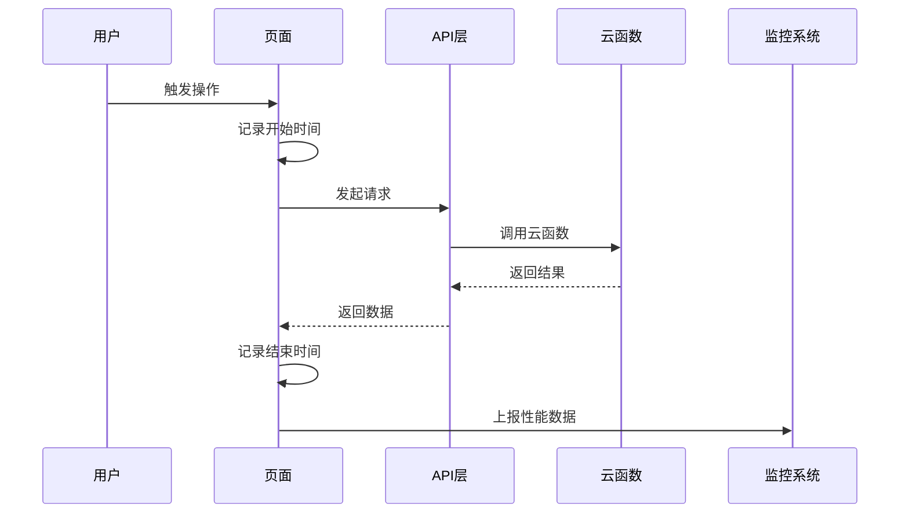

**图表来源**
- [api.js:14-41](file://miniprogram/utils/api.js#L14-L41)
- [login/index.js:22-800](file://cloudfunctions/login/index.js#L22-L800)

#### 2. 关键节点埋点
- **应用启动**: `App.onLaunch()` 开始和结束时间
- **页面加载**: `Page.onShow()` 生命周期时间
- **数据请求**: API调用前后的精确时间戳
- **图表渲染**: ECharts初始化和渲染完成时间
- **缓存命中**: 缓存请求与首次请求的时间对比

#### 3. 数据上报机制
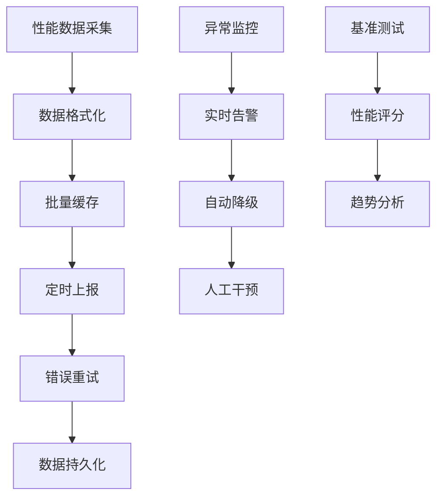

**图表来源**
- [util.js:1-55](file://miniprogram/utils/util.js#L1-L55)
- [ec-canvas.js:80-192](file://miniprogram/components/ec-canvas/ec-canvas.js#L80-L192)
- [auto-test.js:397-481](file://minitest/auto-test.js#L397-L481)

**章节来源**
- [app.js:8-26](file://miniprogram/app.js#L8-L26)
- [api.js:44-111](file://miniprogram/utils/api.js#L44-L111)
- [baby-detail.js:168-169](file://miniprogram/pages/baby-detail/baby-detail.js#L168-L169)

### 实时监控实现

#### 1. 登录状态监控
```javascript
// 登录状态检查逻辑
checkLoginStatus: function() {
    this.login();
}
```

#### 2. 权限验证监控
```javascript
// 权限检查流程
async checkPermission(babyId, requiredPermission) {
    // 获取用户信息
    let user = getCurrentUser();
    if (!user || !user.openid) {
        user = await waitForLogin();
    }
    
    // 获取家庭信息
    const families = await getFamilies();
    // 权限验证逻辑...
}
```

#### 3. 性能基准测试
```javascript
// 综合性能评分系统
async testOverallPerformance() {
    const scores = {
        apiResponse: 0,
        cacheEfficiency: 0,
        queryOptimization: 0,
        overallExperience: 0
    }
    
    // API响应速度评分
    const apiStart = Date.now()
    await Promise.all([api.getBabies(), api.getFamilies()])
    const apiDuration = Date.now() - apiStart
    
    // 缓存效率评分
    const cacheStart1 = Date.now()
    await api.getFamilies()
    const cacheDuration1 = Date.now() - cacheStart1
    
    const cacheStart2 = Date.now()
    await api.getFamilies()
    const cacheDuration2 = Date.now() - cacheStart2
    
    const cacheRatio = cacheDuration1 / cacheDuration2
    
    // 查询优化评分
    const queryStart = Date.now()
    const user = api.getCurrentUser()
    if (user && user.openid) {
        await db.collection('families')
          .where({ 'members.openid': user.openid })
          .get()
        const queryDuration = Date.now() - queryStart
    }
    
    // 计算总体评分
    scores.overallExperience = Math.round(
        (scores.apiResponse + scores.cacheEfficiency + scores.queryOptimization) / 3
    )
    
    return scores.overallExperience
}
```

**章节来源**
- [api.js:783-800](file://miniprogram/utils/api.js#L783-L800)
- [family.js:29-80](file://miniprogram/pages/family/family.js#L29-L80)
- [auto-test.js:397-481](file://minitest/auto-test.js#L397-L481)

## 性能分析工具使用指南

### 微信开发者工具性能面板

#### 1. 性能分析功能
- **Network面板**: 监控网络请求耗时和成功率
- **Performance面板**: 分析JavaScript执行时间和内存使用
- **Memory面板**: 监控内存分配和垃圾回收
- **Console面板**: 查看性能警告和错误信息

#### 2. 真机调试技巧
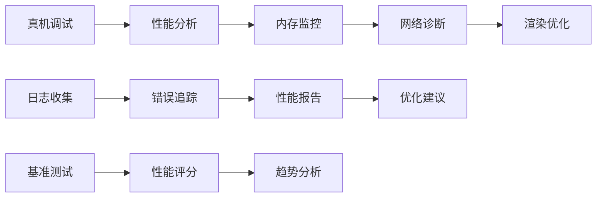

**图表来源**
- [ec-canvas.js:143-192](file://miniprogram/components/ec-canvas/ec-canvas.js#L143-L192)
- [baby-detail.js:323-397](file://miniprogram/pages/baby-detail/baby-detail.js#L323-L397)
- [auto-test.js:1-606](file://minitest/auto-test.js#L1-L606)

#### 3. 第三方监控平台集成
- **数据上报**: 通过云函数上报性能数据
- **可视化展示**: 使用监控平台的仪表板
- **告警机制**: 设置阈值触发告警通知
- **基准测试**: 集成自动化性能评分系统

**章节来源**
- [sendFeedbackEmail/index.js:1-21](file://cloudfunctions/sendFeedbackEmail/index.js#L1-L21)
- [login/index.js:762-800](file://cloudfunctions/login/index.js#L762-L800)
- [test.config.json:1-62](file://minitest/test.config.json#L1-L62)

## 性能瓶颈识别方法

### 慢接口定位技术

#### 1. 云函数性能分析
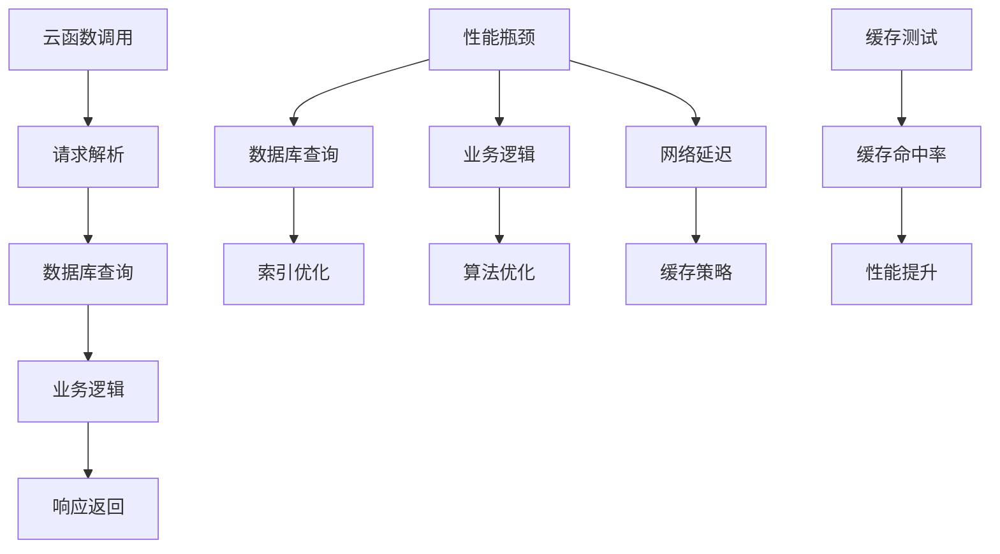

**图表来源**
- [login/index.js:22-800](file://cloudfunctions/login/index.js#L22-L800)
- [api.js:44-111](file://miniprogram/utils/api.js#L44-L111)
- [auto-test.js:419-432](file://minitest/auto-test.js#L419-L432)

#### 2. 常见慢接口类型
- **数据库查询**: 未使用索引的复杂查询
- **权限验证**: 多次数据库查询的权限检查
- **图表渲染**: 大数据量图表的计算和渲染
- **标准数据计算**: 重复的标准数据计算和缓存

### 内存泄漏检测

#### 1. 内存监控策略
```javascript
// 内存使用监控示例
const memoryUsage = {
    initial: wx.getSystemInfoSync().memorySize,
    current: 0,
    peak: 0
};

// 定期检查内存使用
setInterval(() => {
    const info = wx.getSystemInfoSync();
    memoryUsage.current = info.memorySize;
    memoryUsage.peak = Math.max(memoryUsage.peak, info.memorySize);
}, 30000);
```

#### 2. 图表组件内存管理
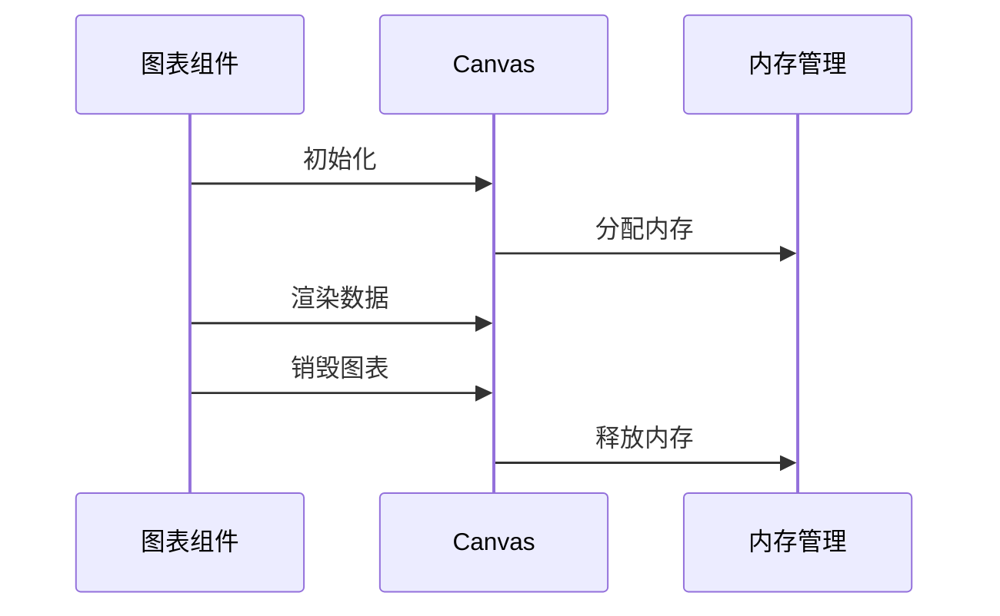

**图表来源**
- [ec-canvas.js:153-177](file://miniprogram/components/ec-canvas/ec-canvas.js#L153-L177)
- [baby-detail.js:399-473](file://miniprogram/pages/baby-detail/baby-detail.js#L399-L473)

#### 3. 标准数据缓存优化
```javascript
// cachedStandardData字段优化
data: {
    // ... 其他字段
    cachedStandardData: {}
}

// 标准数据缓存逻辑
getStandardDataWithCache(gender, dataType) {
    const cacheKey = `${gender}_${dataType}`;
    
    if (!this.data.cachedStandardData[cacheKey]) {
        // 计算标准数据
        const standardData = this.calculateStandardData(gender, dataType);
        this.setData({
            [`cachedStandardData.${cacheKey}`]: standardData
        });
    }
    
    return this.data.cachedStandardData[cacheKey];
}
```

**章节来源**
- [ec-canvas.js:1-285](file://miniprogram/components/ec-canvas/ec-canvas.js#L1-L285)
- [util.js:1-55](file://miniprogram/utils/util.js#L1-L55)
- [baby-detail.js:168-169](file://miniprogram/pages/baby-detail/baby-detail.js#L168-L169)

### 渲染性能分析

#### 1. 页面渲染优化
- **懒加载**: 图表组件的延迟初始化
- **虚拟滚动**: 大列表的虚拟化处理
- **防抖节流**: 用户交互事件的优化
- **标准数据缓存**: 减少重复计算

#### 2. 图表渲染优化
```javascript
// 图表懒加载实现
onReady() {
    if (this.data.currentTab === 'height') {
        setTimeout(() => this.initHeightChart(), 100);
    } else if (this.data.currentTab === 'weight') {
        setTimeout(() => this.initWeightChart(), 100);
    }
}

// 防抖函数优化
const debounce = (fn, delay = 300) => {
    let timer = null;
    return function(...args) {
        if (timer) clearTimeout(timer);
        timer = setTimeout(() => fn.apply(this, args), delay);
    };
};
```

**章节来源**
- [baby-detail.js:184-191](file://miniprogram/pages/baby-detail/baby-detail.js#L184-L191)
- [ec-canvas.js:74-77](file://miniprogram/components/ec-canvas/ec-canvas.js#L74-L77)
- [util.js:8-27](file://miniprogram/utils/util.js#L8-L27)

## 性能优化效果评估

### A/B测试实施

#### 1. 测试设计
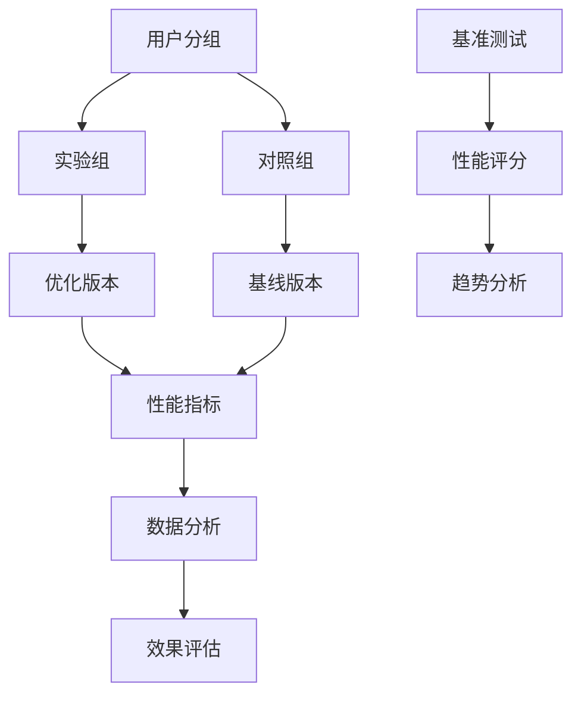

#### 2. 评估指标
- **用户体验指标**: 页面加载时间、交互响应时间
- **业务指标**: 用户留存率、功能使用率
- **技术指标**: 内存使用量、CPU占用率
- **基准测试指标**: 综合性能评分、缓存效率、查询优化

### 用户反馈收集

#### 1. 反馈渠道
```javascript
// 反馈收集流程
openFeedbackModal() {
    // 打开反馈弹窗
}

submitFeedback() {
    // 收集反馈内容
    // 上传图片到云存储
    // 保存到数据库
    // 调用云函数发送邮件
}
```

#### 2. 反馈分析
- **分类统计**: 按问题类型分类
- **优先级排序**: 按影响程度排序
- **趋势分析**: 时间维度的变化趋势

### 回归测试机制

#### 1. 自动化测试
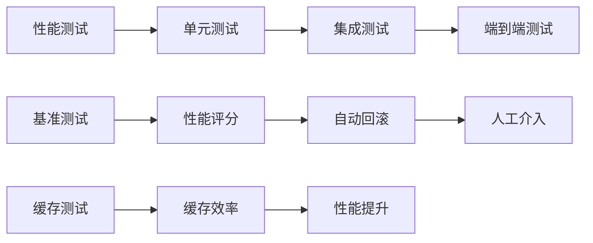

#### 2. 测试覆盖
- **核心功能**: 首屏加载、页面切换、数据请求
- **边界条件**: 网络异常、数据为空、权限不足
- **压力测试**: 高并发场景、大数据量处理
- **基准测试**: 综合性能评分、缓存效率、查询优化

**章节来源**
- [family.js:626-757](file://miniprogram/pages/family/family.js#L626-L757)
- [sendFeedbackEmail/index.js:1-21](file://cloudfunctions/sendFeedbackEmail/index.js#L1-L21)
- [auto-test.js:1-606](file://minitest/auto-test.js#L1-L606)

## 性能告警机制设计

### 阈值设置策略

#### 1. 关键指标阈值
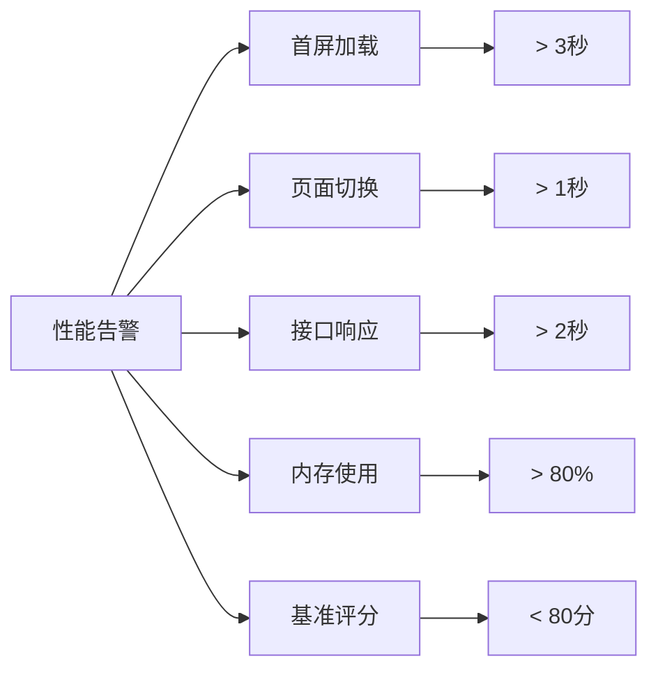

#### 2. 动态阈值调整
- **历史数据分析**: 基于历史性能数据动态调整
- **业务场景适配**: 不同场景设置不同阈值
- **设备差异考虑**: 高低端设备差异化阈值
- **基准测试阈值**: 基于综合性能评分设置

### 告警通知机制

#### 1. 多级告警
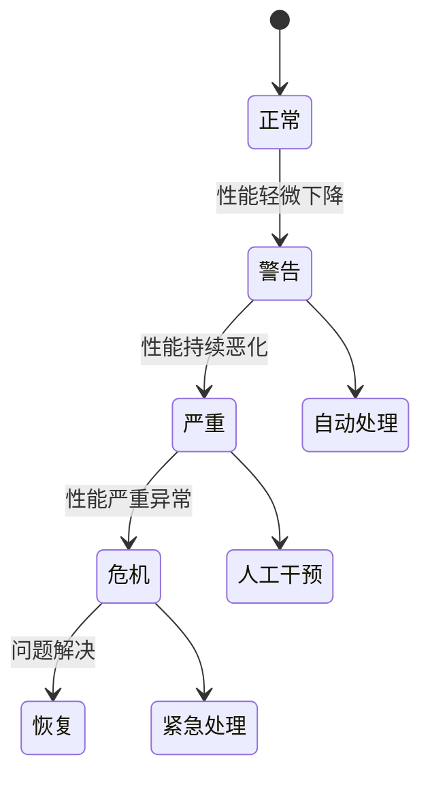

#### 2. 通知渠道
- **即时通讯**: 微信、企业微信等
- **邮件通知**: 重要告警邮件
- **电话告警**: 紧急情况电话通知

### 自动化处理

#### 1. 自动降级
```javascript
// 自动降级策略
autoDegradation() {
    if (性能指标异常) {
        // 降级图表渲染
        // 关闭非必要功能
        // 启用缓存策略
    }
}
```

#### 2. 故障转移
- **服务降级**: 自动切换到备用服务
- **数据缓存**: 使用本地缓存替代云端数据
- **功能禁用**: 禁用性能敏感的功能

**章节来源**
- [login/index.js:1-814](file://cloudfunctions/login/index.js#L1-L814)
- [ec-canvas.js:80-192](file://miniprogram/components/ec-canvas/ec-canvas.js#L80-L192)

## 架构设计与实现

### 性能监控架构

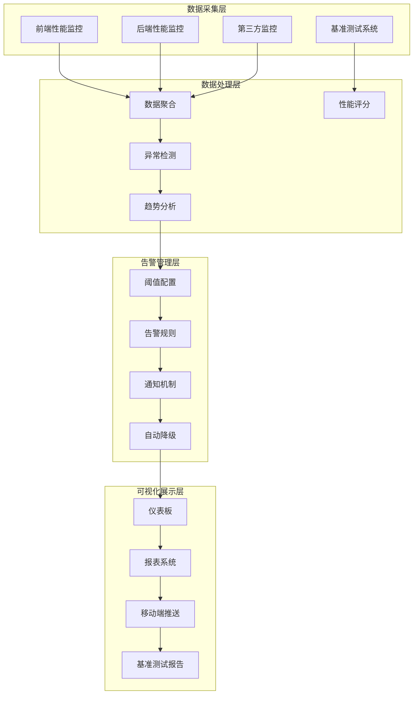

### 核心组件实现

#### 1. 应用启动监控
```javascript
// 应用启动性能监控
App({
    onLaunch: function () {
        const startTime = Date.now();
        
        // 初始化云开发
        wx.cloud.init({
            env: this.globalData.env,
            traceUser: true,
        });
        
        // 检查登录状态
        this.checkLoginStatus();
        
        // 记录启动耗时
        const launchTime = Date.now() - startTime;
        this.reportPerformance('app_launch', launchTime);
    }
});
```

#### 2. 页面性能监控
```javascript
// 页面性能监控装饰器
function performanceMonitor(target, propertyName, descriptor) {
    const method = descriptor.value;
    
    descriptor.value = function(...args) {
        const startTime = Date.now();
        const result = method.apply(this, args);
        const endTime = Date.now();
        
        this.reportPerformance(`${propertyName}_time`, endTime - startTime);
        return result;
    };
    
    return descriptor;
}
```

#### 3. 基准测试系统
```javascript
// 综合性能评分系统
class PerformanceBenchmark {
    constructor() {
        this.scores = {
            apiResponse: 0,
            cacheEfficiency: 0,
            queryOptimization: 0,
            overallExperience: 0
        };
    }
    
    async runBenchmark() {
        await this.testAPIResponse();
        await this.testCacheEfficiency();
        await this.testQueryOptimization();
        return this.calculateOverallScore();
    }
    
    async testAPIResponse() {
        const start = Date.now();
        await Promise.all([api.getBabies(), api.getFamilies()]);
        const duration = Date.now() - start;
        
        this.scores.apiResponse = this.calculateScore(duration, 500, 1000, 2000);
    }
    
    async testCacheEfficiency() {
        const start1 = Date.now();
        await api.getFamilies();
        const duration1 = Date.now() - start1;
        
        const start2 = Date.now();
        await api.getFamilies();
        const duration2 = Date.now() - start2;
        
        const ratio = duration1 / duration2;
        this.scores.cacheEfficiency = this.calculateScore(ratio, 5, 3, 2);
    }
    
    calculateOverallScore() {
        this.scores.overallExperience = Math.round(
            (this.scores.apiResponse + 
             this.scores.cacheEfficiency + 
             this.scores.queryOptimization) / 3
        );
        return this.scores.overallExperience;
    }
}
```

**章节来源**
- [app.js:8-26](file://miniprogram/app.js#L8-L26)
- [index.js:10-52](file://miniprogram/pages/index/index.js#L10-L52)
- [auto-test.js:397-481](file://minitest/auto-test.js#L397-L481)

### 数据模型设计

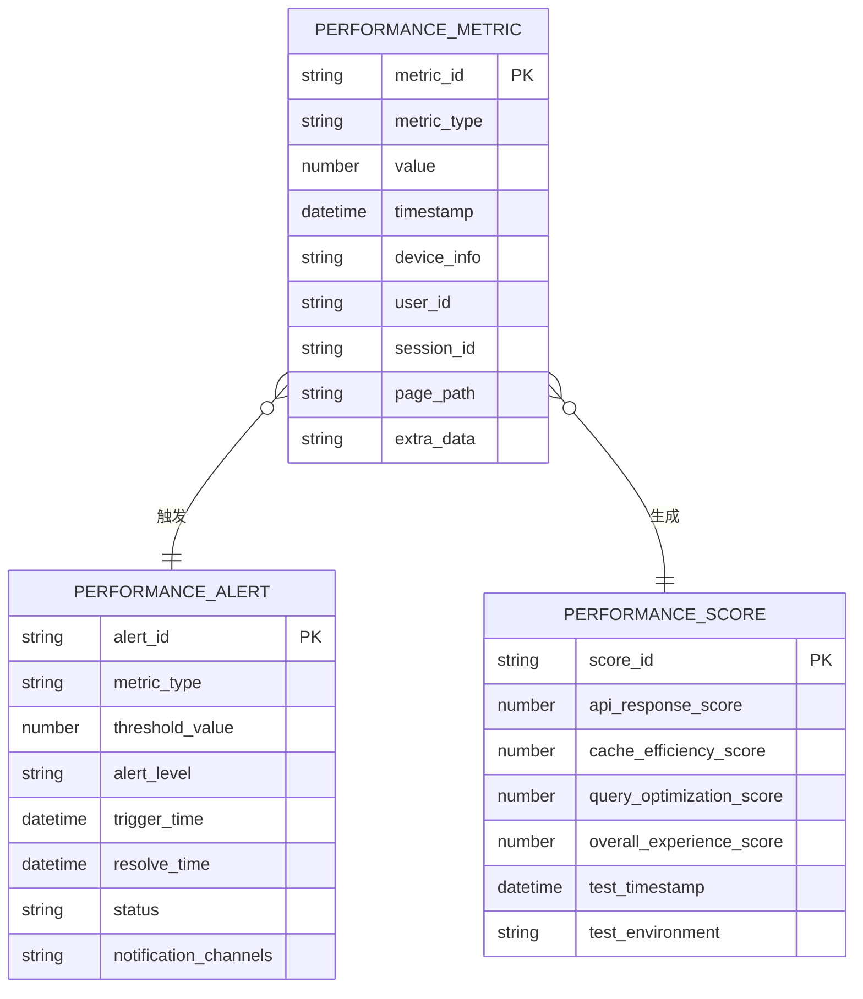

**图表来源**
- [api.js:14-41](file://miniprogram/utils/api.js#L14-L41)
- [login/index.js:22-800](file://cloudfunctions/login/index.js#L22-L800)
- [auto-test.js:401-454](file://minitest/auto-test.js#L401-L454)

## 最佳实践与建议

### 性能优化清单

#### 1. 首屏优化
- **资源预加载**: 关键资源提前加载
- **代码分割**: 按需加载页面组件
- **缓存策略**: 合理使用本地缓存
- **CDN加速**: 静态资源CDN部署
- **标准数据缓存**: 使用cachedStandardData字段优化

#### 2. 交互优化
- **防抖节流**: 用户操作防抖处理
- **骨架屏**: 长时间加载的骨架屏
- **渐进式渲染**: 分批渲染大数据
- **手势优化**: 手势响应时间优化

#### 3. 内存优化
- **及时释放**: 及时释放不再使用的对象
- **循环优化**: 避免内存泄漏的循环
- **图片优化**: 图片压缩和缓存
- **数据结构**: 选择合适的数据结构
- **图表优化**: 合理的图表渲染策略

### 开发规范

#### 1. 代码规范
```javascript
// 性能友好的代码示例
class PerformanceOptimized {
    constructor() {
        this.cache = new Map(); // 使用Map替代普通对象
        this.debounceTimer = null;
        this.cachedStandardData = {}; // 标准数据缓存
    }
    
    // 防抖函数
    debounce(func, wait) {
        return (...args) => {
            clearTimeout(this.debounceTimer);
            this.debounceTimer = setTimeout(() => func.apply(this, args), wait);
        };
    }
    
    // 虚拟滚动
    virtualScroll(items, containerHeight) {
        const visibleItems = this.calculateVisibleRange(containerHeight);
        return items.slice(visibleItems.start, visibleItems.end);
    }
    
    // 标准数据缓存
    getCachedStandardData(gender, dataType) {
        const key = `${gender}_${dataType}`;
        if (!this.cachedStandardData[key]) {
            this.cachedStandardData[key] = this.calculateStandardData(gender, dataType);
        }
        return this.cachedStandardData[key];
    }
}
```

#### 2. 测试规范
- **性能测试**: 每次发布前进行性能测试
- **回归测试**: 关键功能的回归测试
- **压力测试**: 高并发场景测试
- **兼容性测试**: 不同设备和系统测试
- **基准测试**: 定期进行综合性能评分

### 维护建议

#### 1. 监控维护
- **定期审查**: 定期审查监控指标
- **阈值调整**: 根据业务变化调整阈值
- **告警优化**: 优化告警规则减少误报
- **报告分析**: 分析性能报告发现问题
- **基准测试**: 定期运行性能基准测试

#### 2. 技术升级
- **框架升级**: 及时升级小程序框架
- **工具更新**: 更新开发和调试工具
- **依赖管理**: 管理第三方依赖版本
- **安全更新**: 及时修复安全漏洞

## 故障排查指南

### 常见问题诊断

#### 1. 页面加载缓慢
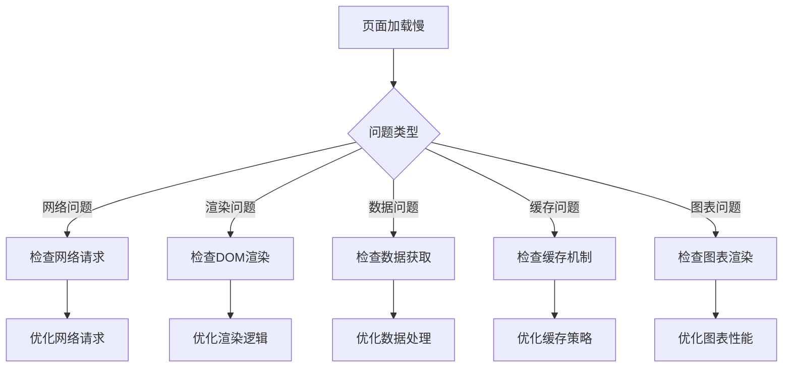

#### 2. 内存使用过高
- **内存泄漏**: 检查事件监听器是否正确移除
- **大对象**: 检查大对象的创建和销毁
- **缓存策略**: 检查缓存的大小和生命周期
- **图片处理**: 检查图片的内存占用
- **标准数据缓存**: 检查cachedStandardData的使用

#### 3. 图表渲染异常
- **数据量过大**: 检查图表数据量是否超出限制
- **渲染频率**: 检查图表刷新频率是否过高
- **设备兼容**: 检查不同设备的兼容性
- **内存限制**: 检查设备内存限制
- **缓存优化**: 检查标准数据缓存是否有效

### 调试工具使用

#### 1. 微信开发者工具
- **性能面板**: 分析JavaScript执行时间
- **网络面板**: 监控网络请求
- **调试面板**: 断点调试和变量检查
- **模拟器**: 不同设备的模拟测试

#### 2. 生产环境调试
- **日志收集**: 收集生产环境日志
- **错误追踪**: 追踪用户遇到的错误
- **性能监控**: 实时监控性能指标
- **用户行为**: 分析用户使用行为
- **基准测试**: 运行性能基准测试

### 故障处理流程

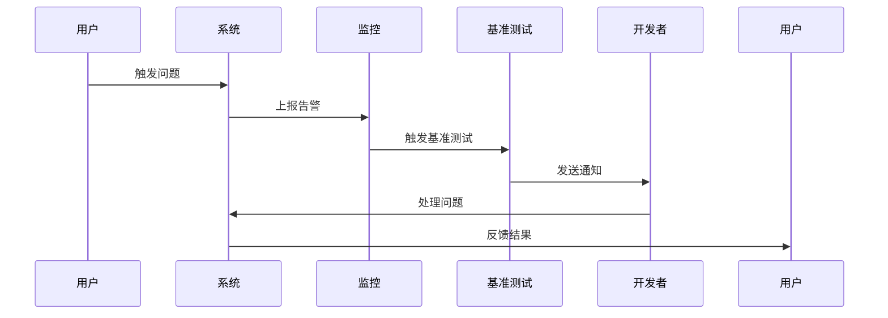

**章节来源**
- [ec-canvas.js:1-285](file://miniprogram/components/ec-canvas/ec-canvas.js#L1-L285)
- [family.js:626-757](file://miniprogram/pages/family/family.js#L626-L757)
- [auto-test.js:1-606](file://minitest/auto-test.js#L1-L606)

通过建立完善的性能监控体系，可以有效提升小程序的用户体验，及时发现和解决性能问题，确保系统的稳定运行。新增的性能基准测试系统和cachedStandardData字段优化进一步增强了系统的性能监控能力，建议根据实际业务需求，逐步完善监控指标和告警机制，持续优化系统性能。