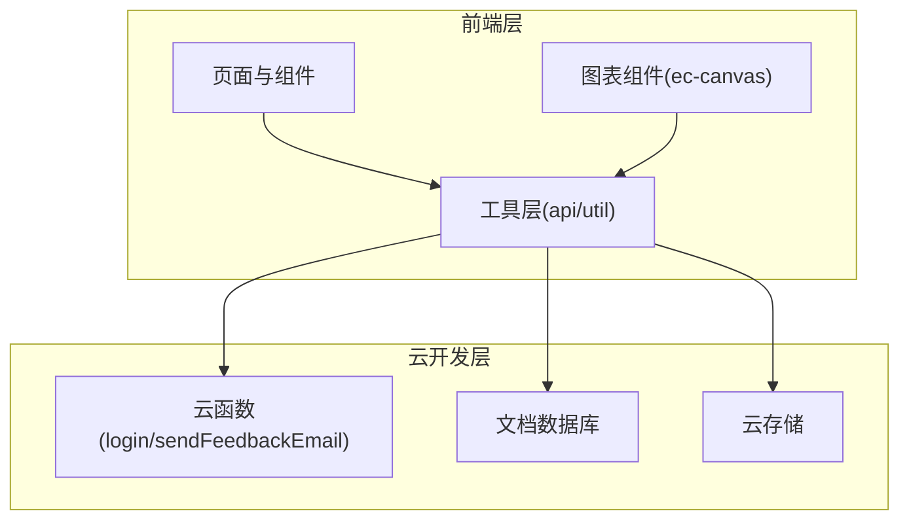
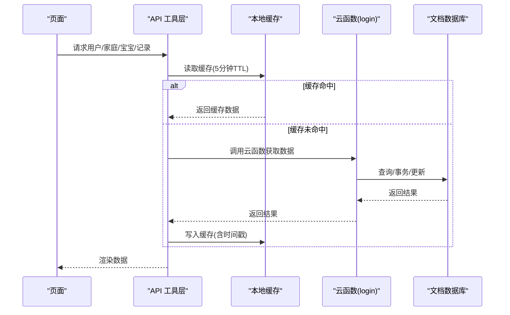
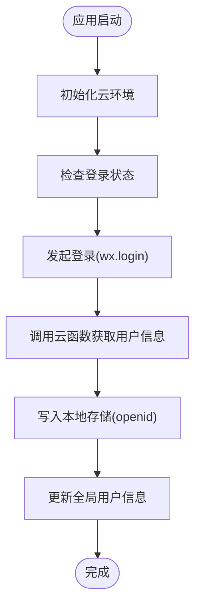
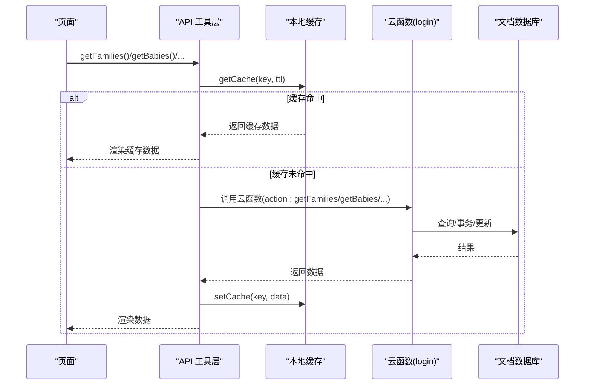
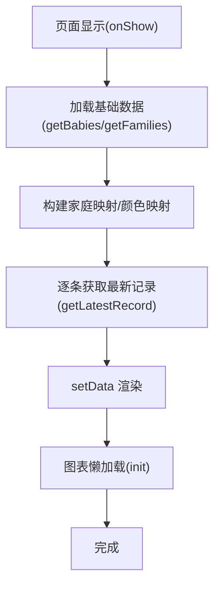
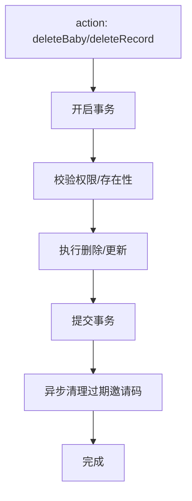
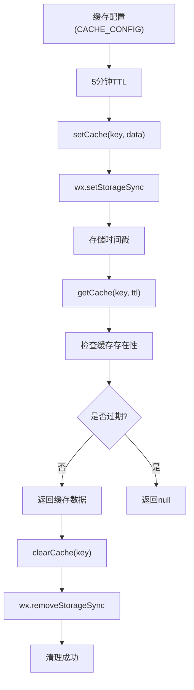
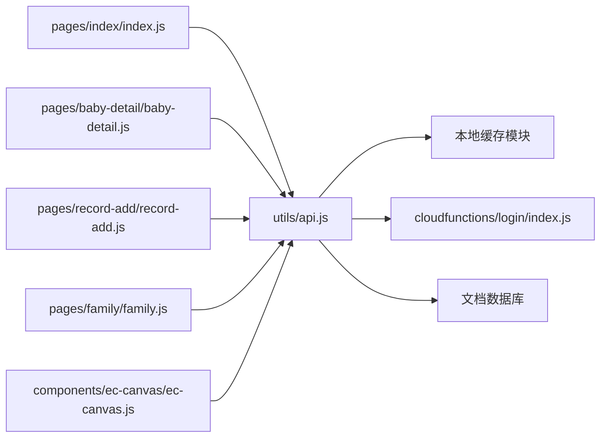

# 缓存策略设计

<cite>
**本文档引用的文件**
- [app.js](file://miniprogram/app.js)
- [api.js](file://miniprogram/utils/api.js)
- [util.js](file://miniprogram/utils/util.js)
- [index.js](file://miniprogram/pages/index/index.js)
- [baby-detail.js](file://miniprogram/pages/baby-detail/baby-detail.js)
- [record-add.js](file://miniprogram/pages/record-add/record-add.js)
- [family.js](file://miniprogram/pages/family/family.js)
- [ec-canvas.js](file://miniprogram/components/ec-canvas/ec-canvas.js)
- [index.js](file://cloudfunctions/login/index.js)
- [index.js](file://cloudfunctions/sendFeedbackEmail/index.js)
</cite>

## 更新摘要
**变更内容**
- 新增5分钟TTL本地缓存系统，包括setCache()、getCache()、clearCache()函数
- 实现家庭列表和宝宝列表的本地缓存机制
- 建立缓存失效和清理策略
- 在关键数据操作后自动清除相关缓存

## 目录
1. [简介](#简介)
2. [项目结构](#项目结构)
3. [核心组件](#核心组件)
4. [架构总览](#架构总览)
5. [详细组件分析](#详细组件分析)
6. [依赖关系分析](#依赖关系分析)
7. [性能考量](#性能考量)
8. [故障排查指南](#故障排查指南)
9. [结论](#结论)
10. [附录](#附录)

## 简介
本指南围绕微信小程序"宝宝助手"项目，系统化阐述多层级缓存架构的设计与落地实践，涵盖内存缓存、本地缓存与云端缓存的协同机制；数据缓存策略（失效、版本、一致性）；接口缓存优化（键设计、过期策略、防穿）；图片缓存优化（CDN、懒加载、格式优化）；缓存性能监控（命中率、容量、影响评估）；以及缓存清理与维护（自动清理、手动接口、预热）。目标是帮助开发者设计出高效、稳定、可运维的缓存体系。

## 项目结构
该项目采用典型的"前端页面 + 云开发 + 云函数"三层结构：
- 前端层：页面与组件负责交互与展示，调用工具层 API。
- 工具层：封装网络请求、鉴权等待、数据计算等通用逻辑。
- 云开发层：数据库、云存储、云函数提供数据持久化与服务端逻辑。

**图表来源**
- [app.js:1-56](file://miniprogram/app.js#L1-L56)
- [api.js:1-800](file://miniprogram/utils/api.js#L1-L800)
- [ec-canvas.js:1-214](file://miniprogram/components/ec-canvas/ec-canvas.js#L1-L214)
- [index.js:1-814](file://cloudfunctions/login/index.js#L1-L814)
- [index.js:1-21](file://cloudfunctions/sendFeedbackEmail/index.js#L1-L21)

**章节来源**
- [app.js:1-56](file://miniprogram/app.js#L1-L56)
- [api.js:1-800](file://miniprogram/utils/api.js#L1-L800)
- [ec-canvas.js:1-214](file://miniprogram/components/ec-canvas/ec-canvas.js#L1-L214)
- [index.js:1-814](file://cloudfunctions/login/index.js#L1-L814)
- [index.js:1-21](file://cloudfunctions/sendFeedbackEmail/index.js#L1-L21)

## 核心组件
- 应用启动与登录：初始化云环境、拉起登录流程、持久化用户标识。
- API 工具层：统一封装用户态、等待登录、数据库访问、云函数调用，集成本地缓存机制。
- 页面与组件：承载业务交互，驱动数据加载与渲染。
- 云函数：统一处理权限校验、复杂查询、事务与数据变更。

**章节来源**
- [app.js:1-56](file://miniprogram/app.js#L1-L56)
- [api.js:1-800](file://miniprogram/utils/api.js#L1-L800)
- [index.js:1-144](file://miniprogram/pages/index/index.js#L1-L144)
- [baby-detail.js:1-691](file://miniprogram/pages/baby-detail/baby-detail.js#L1-L691)
- [record-add.js:1-118](file://miniprogram/pages/record-add/record-add.js#L1-L118)
- [family.js:1-757](file://miniprogram/pages/family/family.js#L1-L757)

## 架构总览
整体数据流由"页面 → 工具层 API → 云函数/数据库"构成，结合本地存储实现多层级缓存协同。

**图表来源**
- [api.js:1-800](file://miniprogram/utils/api.js#L1-L800)
- [index.js:1-814](file://cloudfunctions/login/index.js#L1-L814)
- [app.js:1-56](file://miniprogram/app.js#L1-L56)

## 详细组件分析

### 组件A：应用启动与登录（内存/本地）
- 内存缓存：App 全局对象保存用户信息，避免重复登录。
- 本地缓存：持久化 openid，作为后续鉴权与数据访问的基础。
- 登录流程：静默登录，失败兜底，调用云函数换取用户信息并写入本地存储。

**图表来源**
- [app.js:1-56](file://miniprogram/app.js#L1-L56)

**章节来源**
- [app.js:1-56](file://miniprogram/app.js#L1-L56)

### 组件B：API 工具层（接口缓存与权限）
- 用户态管理：优先使用全局用户信息，否则等待登录并调用云函数。
- 权限校验：通过云函数统一校验，绕过客户端权限限制。
- 数据访问：封装家庭、宝宝、记录等 CRUD，统一错误处理与返回值。
- **本地缓存管理**：实现5分钟TTL的本地缓存系统，包括缓存配置、读取、写入和清理。

**图表来源**
- [api.js:1-800](file://miniprogram/utils/api.js#L1-L800)
- [index.js:1-814](file://cloudfunctions/login/index.js#L1-L814)

**章节来源**
- [api.js:1-800](file://miniprogram/utils/api.js#L1-L800)
- [index.js:1-814](file://cloudfunctions/login/index.js#L1-L814)

### 组件C：页面与图表组件（渲染缓存与懒加载）
- 页面生命周期：onShow/onLoad 触发数据加载；列表页逐条加载详情辅助数据。
- 图表组件：支持懒加载，按需初始化 ECharts 实例，减少首屏压力。
- 图片懒加载：图表组件内部通过 Canvas API 动态加载图片，避免阻塞主线程。

**图表来源**
- [index.js:1-144](file://miniprogram/pages/index/index.js#L1-L144)
- [baby-detail.js:1-691](file://miniprogram/pages/baby-detail/baby-detail.js#L1-L691)
- [ec-canvas.js:1-214](file://miniprogram/components/ec-canvas/ec-canvas.js#L1-L214)

**章节来源**
- [index.js:1-144](file://miniprogram/pages/index/index.js#L1-L144)
- [baby-detail.js:1-691](file://miniprogram/pages/baby-detail/baby-detail.js#L1-L691)
- [ec-canvas.js:1-214](file://miniprogram/components/ec-canvas/ec-canvas.js#L1-L214)

### 组件D：云函数（事务与一致性）
- 事务保障：删除宝宝、删除记录等关键操作使用事务，确保原子性。
- 权限校验：在服务端严格校验用户身份与家庭权限，避免客户端伪造。
- 过期清理：异步清理过期邀请码，降低数据库冗余。

**图表来源**
- [index.js:483-510](file://cloudfunctions/login/index.js#L483-L510)
- [index.js:512-554](file://cloudfunctions/login/index.js#L512-L554)
- [index.js:658-699](file://cloudfunctions/login/index.js#L658-L699)

**章节来源**
- [index.js:483-510](file://cloudfunctions/login/index.js#L483-L510)
- [index.js:512-554](file://cloudfunctions/login/index.js#L512-L554)
- [index.js:658-699](file://cloudfunctions/login/index.js#L658-L699)

### 组件E：本地缓存系统（新增）
- **缓存配置**：定义家庭列表(cache_families)和宝宝列表(cache_babies)的缓存键和5分钟TTL。
- **缓存读取**：getCache(key, ttl)函数检查缓存是否存在且未过期。
- **缓存写入**：setCache(key, data)函数将数据和时间戳一起存储。
- **缓存清理**：clearCache(key)函数在数据变更后主动清理相关缓存。

**图表来源**
- [api.js:5-46](file://miniprogram/utils/api.js#L5-L46)

**章节来源**
- [api.js:5-46](file://miniprogram/utils/api.js#L5-L46)

## 依赖关系分析
- 页面依赖 API 工具层；API 工具层依赖云函数与数据库；图表组件依赖 ECharts 与 Canvas。
- 云函数依赖数据库命令与事务能力；本地存储承担用户态与轻量数据缓存。
- **新增**：API 工具层内部集成了本地缓存模块，形成完整的多层级缓存体系。

**图表来源**
- [index.js:1-144](file://miniprogram/pages/index/index.js#L1-L144)
- [baby-detail.js:1-691](file://miniprogram/pages/baby-detail/baby-detail.js#L1-L691)
- [record-add.js:1-118](file://miniprogram/pages/record-add/record-add.js#L1-L118)
- [family.js:1-757](file://miniprogram/pages/family/family.js#L1-L757)
- [api.js:1-800](file://miniprogram/utils/api.js#L1-L800)
- [ec-canvas.js:1-214](file://miniprogram/components/ec-canvas/ec-canvas.js#L1-L214)
- [index.js:1-814](file://cloudfunctions/login/index.js#L1-L814)

**章节来源**
- [index.js:1-144](file://miniprogram/pages/index/index.js#L1-L144)
- [baby-detail.js:1-691](file://miniprogram/pages/baby-detail/baby-detail.js#L1-L691)
- [record-add.js:1-118](file://miniprogram/pages/record-add/record-add.js#L1-L118)
- [family.js:1-757](file://miniprogram/pages/family/family.js#L1-L757)
- [api.js:1-800](file://miniprogram/utils/api.js#L1-L800)
- [ec-canvas.js:1-214](file://miniprogram/components/ec-canvas/ec-canvas.js#L1-L214)
- [index.js:1-814](file://cloudfunctions/login/index.js#L1-L814)

## 性能考量
- 首屏渲染：页面采用懒加载与分步渲染，减少一次性数据请求与渲染压力。
- 图表性能：禁用渐进式绘制，避免在小程序 Canvas 上的兼容问题；按需初始化 ECharts。
- 网络请求：统一通过云函数进行权限校验与复杂查询，减少客户端逻辑与网络往返。
- **本地缓存**：利用本地存储承载用户态与轻量数据，降低重复请求成本；5分钟TTL平衡缓存命中率与数据新鲜度。
- **缓存命中率**：通过并行请求和缓存复用，显著提升数据获取效率。

**章节来源**
- [ec-canvas.js:52-77](file://miniprogram/components/ec-canvas/ec-canvas.js#L52-L77)
- [api.js:1-800](file://miniprogram/utils/api.js#L1-L800)
- [app.js:1-56](file://miniprogram/app.js#L1-L56)

## 故障排查指南
- 登录失败：检查云函数返回与本地存储写入；确认 wx.login 是否成功获取 code。
- 权限异常：确认云函数权限校验逻辑与家庭成员权限字段；核对客户端调用的 action 参数。
- 数据不一致：关注事务操作（删除宝宝/记录），确保提交成功；检查过期邀请码清理是否生效。
- 图表加载失败：检查 Canvas 版本兼容与懒加载初始化；确认图片加载回调是否正确设置。
- **缓存问题**：检查本地存储权限；确认TTL设置是否正确；验证缓存清理逻辑是否正常执行。

**章节来源**
- [app.js:28-54](file://miniprogram/app.js#L28-L54)
- [index.js:22-800](file://cloudfunctions/login/index.js#L22-L800)
- [ec-canvas.js:80-192](file://miniprogram/components/ec-canvas/ec-canvas.js#L80-L192)

## 结论
本项目通过"前端本地缓存 + 云函数统一权限与复杂查询 + 数据库存储"的组合，实现了清晰的多层级缓存与一致性保障。新增的5分钟TTL本地缓存系统显著提升了数据访问性能，同时保持了数据的新鲜度。建议在此基础上进一步引入显式的接口缓存层（如 LRU 内存缓存）、标准化缓存键与过期策略、埋点统计缓存命中率与性能指标，并完善自动清理与预热机制，以持续提升用户体验与系统稳定性。

## 附录

### 多层级缓存架构设计要点
- 内存缓存：App 全局用户态、页面级轻量数据。
- **本地缓存**：用户标识、最近一次查询结果片段，采用5分钟TTL。
- 云端缓存：云函数内适配的内存缓存（如热点数据）、数据库索引与查询计划优化。
- 协同机制：前端优先读本地/内存，回源走云函数，云函数命中数据库；失败回退与重试策略。

### 数据缓存策略
- 失效机制：基于业务时效性设定过期时间；重要数据采用"读旧写新"策略。
- 版本控制：为热点数据增加版本号，变更时更新版本，客户端据此判断是否使用缓存。
- 一致性：关键写操作（新增/删除/更新）后主动失效相关缓存键；事务场景下确保原子性。

### 接口缓存优化
- 缓存键设计：以"资源类型:业务维度:用户标识"命名，避免冲突。
- 过期策略：不同接口采用差异化 TTL；对高频读取接口采用短 TTL 并配合后台刷新。
- 防穿策略：空值穿透缓存（短 TTL）+ 布隆过滤器（云函数侧）+ 互斥锁（同一请求去重）。

### 图片缓存优化
- CDN 加速：云存储直链 + CDN 缓存；合理设置缓存头与压缩格式。
- 懒加载：非首屏图片延迟加载；图表组件内使用 Canvas 动态加载。
- 格式优化：优先 WebP/AVIF；按设备像素比选择合适分辨率。

### 缓存性能监控
- 命中率统计：记录缓存命中/未命中次数，计算命中率趋势。
- 容量分析：统计缓存键数量、体积与淘汰情况。
- 性能影响评估：对比缓存启用前后的首屏时间、渲染耗时与网络请求次数。

### 缓存清理与维护
- 自动清理：定时任务清理过期键；批量淘汰失效版本的数据。
- 手动清理：提供管理端接口或调试开关，支持按资源类型或用户维度清理。
- 缓存预热：在业务低峰期预热热点数据，降低首日峰值压力。

### 本地缓存系统详细实现
- **缓存配置**：CACHE_CONFIG对象定义缓存键名和TTL时间
- **缓存读取**：getCache函数检查缓存存在性和有效性
- **缓存写入**：setCache函数存储数据和时间戳
- **缓存清理**：clearCache函数在数据变更后清理相关缓存
- **TTL机制**：5分钟TTL平衡性能与数据新鲜度
- **错误处理**：所有缓存操作都有try-catch保护

**章节来源**
- [api.js:5-46](file://miniprogram/utils/api.js#L5-L46)
- [api.js:97-128](file://miniprogram/utils/api.js#L97-L128)
- [api.js:486-516](file://miniprogram/utils/api.js#L486-L516)