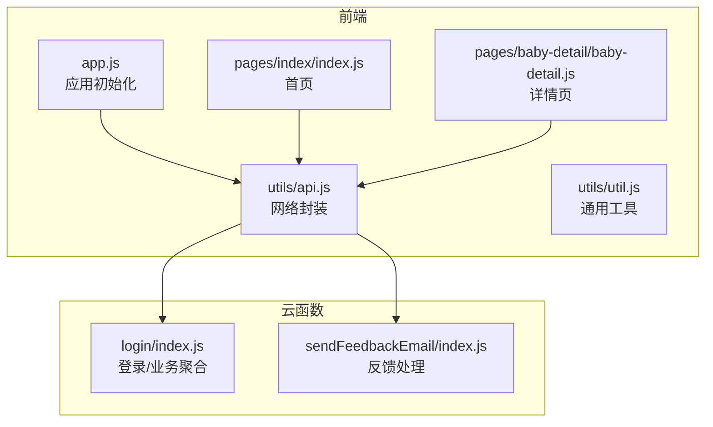
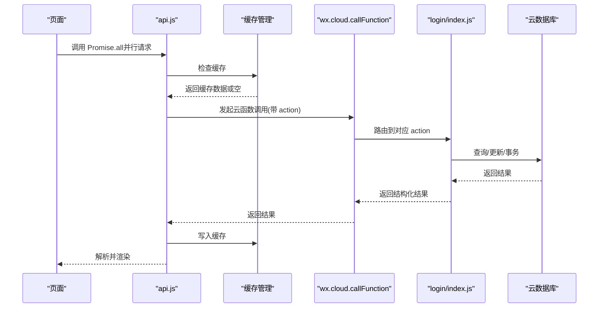
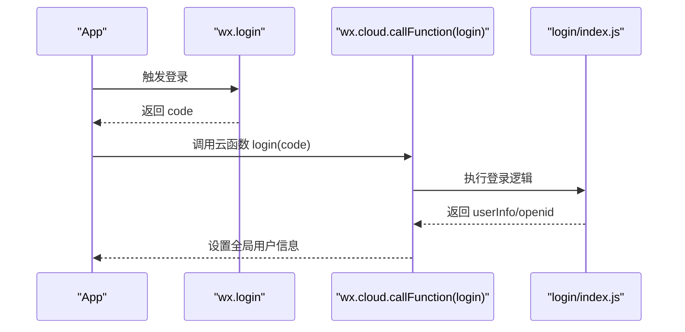
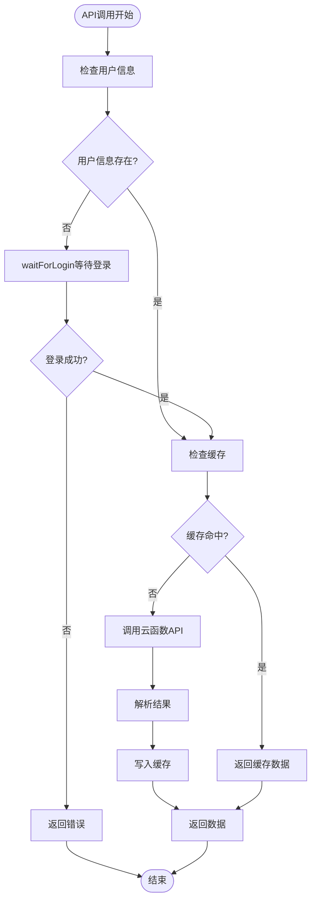
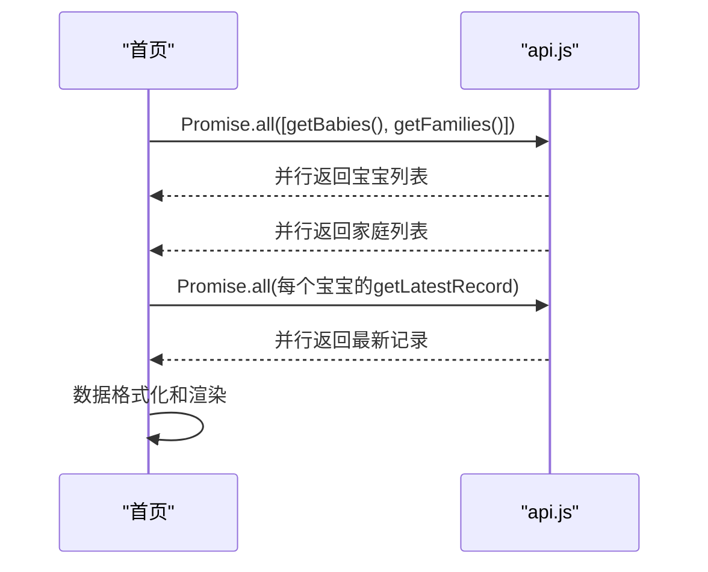
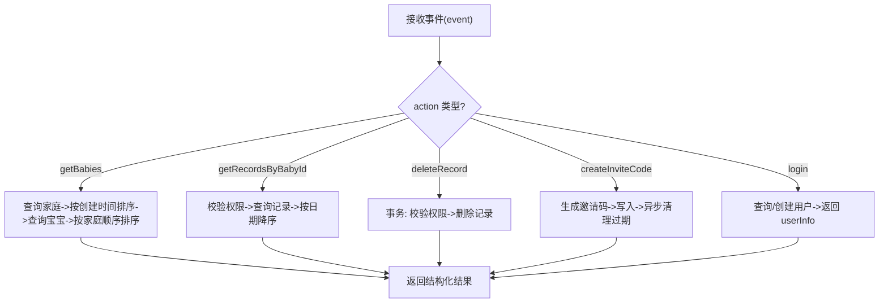
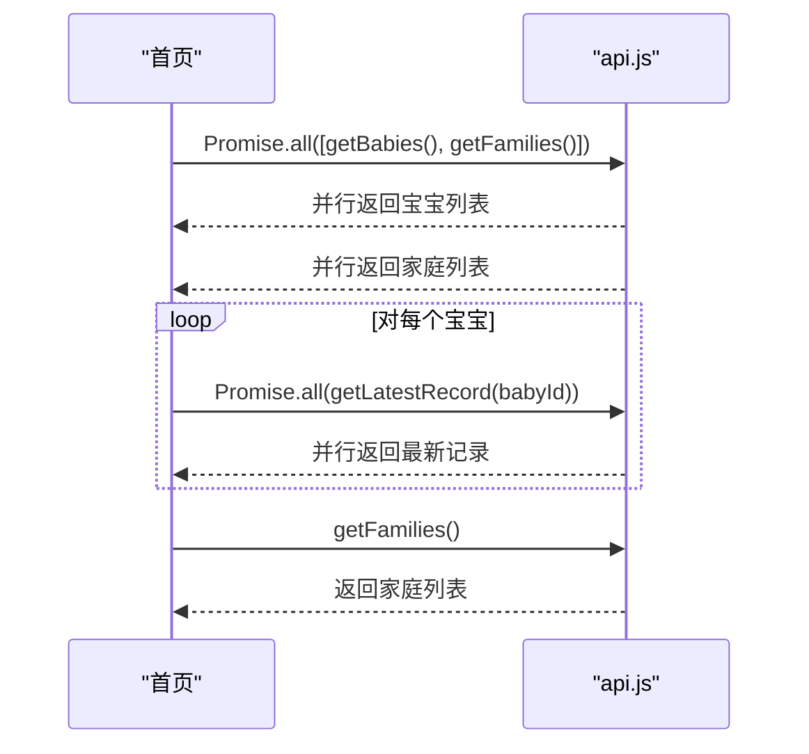
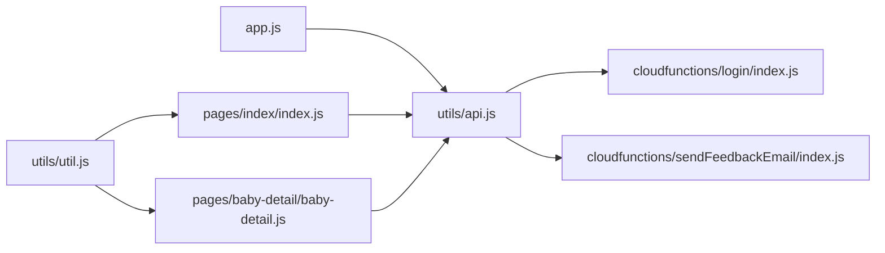

# 网络请求优化

<cite>
**本文引用的文件**
- [miniprogram/utils/api.js](file://miniprogram/utils/api.js)
- [miniprogram/app.js](file://miniprogram/app.js)
- [miniprogram/utils/util.js](file://miniprogram/utils/util.js)
- [miniprogram/pages/index/index.js](file://miniprogram/pages/index/index.js)
- [miniprogram/pages/baby-detail/baby-detail.js](file://miniprogram/pages/baby-detail/baby-detail.js)
- [cloudfunctions/login/index.js](file://cloudfunctions/login/index.js)
- [cloudfunctions/sendFeedbackEmail/index.js](file://cloudfunctions/sendFeedbackEmail/index.js)
- [cloudfunctions/login/package.json](file://cloudfunctions/login/package.json)
- [cloudfunctions/sendFeedbackEmail/package.json](file://cloudfunctions/sendFeedbackEmail/package.json)
</cite>

## 更新摘要
**变更内容**
- 新增Promise.all并行请求处理机制，显著提升页面加载性能
- 实现批量婴儿记录请求优化，减少网络往返次数
- 建立统一认证框架，完善登录状态管理和权限校验
- 增强缓存策略，实现智能缓存管理和失效控制
- 优化页面数据加载流程，采用并行数据获取和批量处理

## 目录
1. [简介](#简介)
2. [项目结构](#项目结构)
3. [核心组件](#核心组件)
4. [架构总览](#架构总览)
5. [详细组件分析](#详细组件分析)
6. [依赖关系分析](#依赖关系analysis)
7. [性能考量与优化建议](#性能考量与优化建议)
8. [故障排查指南](#故障排查指南)
9. [结论](#结论)
10. [附录](#附录)

## 简介
本指南面向微信小程序场景，系统化梳理网络请求优化策略，覆盖请求合并、缓存策略、连接复用、云函数调用优化、并发控制与超时处理、监控与统计、数据传输优化、异常处理与弱网适配，并提供可落地的性能测试方法与工具使用建议，帮助开发者识别与解决网络性能瓶颈。

**更新** 本版本重点反映了应用变更：新增全面的网络请求优化系统，包括Promise.all并行请求处理、批量婴儿记录请求优化、统一认证框架等重大性能改进。

## 项目结构
该项目采用"前端页面 + 工具模块 + 云函数"的分层组织：
- 前端层：页面逻辑、工具函数、UI 组件
- 工具层：网络封装与通用工具
- 云函数层：后端接口聚合与数据库访问

**图表来源**
- [miniprogram/app.js:1-56](file://miniprogram/app.js#L1-L56)
- [miniprogram/pages/index/index.js:1-239](file://miniprogram/pages/index/index.js#L1-L239)
- [miniprogram/pages/baby-detail/baby-detail.js:1-705](file://miniprogram/pages/baby-detail/baby-detail.js#L1-L705)
- [miniprogram/utils/api.js:1-932](file://miniprogram/utils/api.js#L1-L932)
- [cloudfunctions/login/index.js:1-814](file://cloudfunctions/login/index.js#L1-L814)
- [cloudfunctions/sendFeedbackEmail/index.js:1-21](file://cloudfunctions/sendFeedbackEmail/index.js#L1-L21)

**章节来源**
- [miniprogram/app.js:1-56](file://miniprogram/app.js#L1-L56)
- [miniprogram/utils/api.js:1-932](file://miniprogram/utils/api.js#L1-L932)
- [cloudfunctions/login/index.js:1-814](file://cloudfunctions/login/index.js#L1-L814)
- [cloudfunctions/sendFeedbackEmail/index.js:1-21](file://cloudfunctions/sendFeedbackEmail/index.js#L1-L21)

## 核心组件
- 应用初始化与登录：负责小程序启动时的云能力初始化与用户登录流程，确保后续网络请求具备认证上下文。
- 网络封装模块：统一管理云函数调用、数据库查询、权限校验与错误处理，提供高内聚、低耦合的 API 调用入口。
- 页面逻辑：首页与详情页通过封装好的 API 进行数据拉取与展示，采用Promise.all并行请求处理，显著提升加载性能。
- 云函数：登录与业务聚合，承担鉴权、权限校验、复杂查询与事务处理等职责。

**更新** 新增Promise.all并行请求处理机制，实现批量数据获取和缓存管理。

**章节来源**
- [miniprogram/app.js:1-56](file://miniprogram/app.js#L1-L56)
- [miniprogram/utils/api.js:1-932](file://miniprogram/utils/api.js#L1-L932)
- [miniprogram/pages/index/index.js:1-239](file://miniprogram/pages/index/index.js#L1-L239)
- [miniprogram/pages/baby-detail/baby-detail.js:1-705](file://miniprogram/pages/baby-detail/baby-detail.js#L1-L705)
- [cloudfunctions/login/index.js:1-814](file://cloudfunctions/login/index.js#L1-L814)

## 架构总览
整体请求链路如下：
- 前端页面通过工具模块发起云函数调用或数据库查询
- 云函数根据 action 参数路由到具体业务处理，执行数据库读写、事务与权限校验
- 返回结果经统一封装后回传给前端页面，页面再进行渲染与交互

**图表来源**
- [miniprogram/utils/api.js:57-85](file://miniprogram/utils/api.js#L57-L85)
- [miniprogram/utils/api.js:10-46](file://miniprogram/utils/api.js#L10-L46)
- [cloudfunctions/login/index.js:22-92](file://cloudfunctions/login/index.js#L22-L92)

## 详细组件分析

### 登录与初始化流程
- 初始化：应用启动时初始化云能力并设置环境标识
- 登录：调用 wx.login 获取临时凭证，随后调用云函数 login 完成用户态建立，并持久化 openid
- 权限前置：后续所有业务调用前均需等待登录完成，避免无认证上下文导致的失败

**图表来源**
- [miniprogram/app.js:28-54](file://miniprogram/app.js#L28-L54)
- [cloudfunctions/login/index.js:762-800](file://cloudfunctions/login/index.js#L762-L800)

**章节来源**
- [miniprogram/app.js:1-56](file://miniprogram/app.js#L1-L56)
- [cloudfunctions/login/index.js:1-814](file://cloudfunctions/login/index.js#L1-L814)

### 统一认证框架与缓存管理
- 统一认证：通过ensureLogin装饰器确保所有API调用前都有有效的用户上下文
- 缓存策略：实现智能缓存管理，支持家庭列表和宝宝列表的5分钟TTL缓存
- 登录等待：waitForLogin提供最大5秒的登录等待机制，避免阻塞用户操作

**图表来源**
- [miniprogram/utils/api.js:87-94](file://miniprogram/utils/api.js#L87-L94)
- [miniprogram/utils/api.js:10-46](file://miniprogram/utils/api.js#L10-L46)
- [miniprogram/utils/api.js:57-85](file://miniprogram/utils/api.js#L57-L85)

**章节来源**
- [miniprogram/utils/api.js:1-932](file://miniprogram/utils/api.js#L1-L932)

### Promise.all并行请求优化
- 首页优化：使用Promise.all同时获取宝宝列表和家庭列表，减少总等待时间
- 批量记录：对每个宝宝的最新记录采用Promise.all并行获取，避免串行等待
- 性能测试：内置自动化测试，对比串行与并行请求的性能差异

**图表来源**
- [miniprogram/pages/index/index.js:95-120](file://miniprogram/pages/index/index.js#L95-L120)
- [miniprogram/pages/index/index.js:67-71](file://miniprogram/pages/index/index.js#L67-L71)

**章节来源**
- [miniprogram/pages/index/index.js:1-239](file://miniprogram/pages/index/index.js#L1-L239)

### 云函数业务聚合
- 动作路由：根据 action 参数分派到具体业务处理（如获取家庭、获取宝宝、创建邀请码、删除记录等）
- 权限与事务：对敏感操作（删除记录、删除宝宝）在云函数内执行权限校验与事务保证
- 性能注意：部分查询使用 in 查询与排序，建议配合索引优化；异步清理过期资源（如邀请码）

**图表来源**
- [cloudfunctions/login/index.js:22-92](file://cloudfunctions/login/index.js#L22-L92)
- [cloudfunctions/login/index.js:512-554](file://cloudfunctions/login/index.js#L512-L554)
- [cloudfunctions/login/index.js:658-699](file://cloudfunctions/login/index.js#L658-L699)
- [cloudfunctions/login/index.js:762-800](file://cloudfunctions/login/index.js#L762-L800)

**章节来源**
- [cloudfunctions/login/index.js:1-814](file://cloudfunctions/login/index.js#L1-L814)

### 页面数据加载与并行处理
- 首页：使用Promise.all并行获取宝宝列表和家庭列表，然后并行获取每个宝宝的最新记录
- 详情页：加载宝宝信息、家庭信息、记录列表，图表初始化时再次请求标准曲线数据

**图表来源**
- [miniprogram/pages/index/index.js:95-120](file://miniprogram/pages/index/index.js#L95-L120)
- [miniprogram/utils/api.js:338-347](file://miniprogram/utils/api.js#L338-L347)

**章节来源**
- [miniprogram/pages/index/index.js:1-239](file://miniprogram/pages/index/index.js#L1-L239)
- [miniprogram/utils/api.js:1-932](file://miniprogram/utils/api.js#L1-L932)

## 依赖关系分析
- 前端依赖：页面依赖 api.js；api.js 依赖 wx.cloud 与数据库 SDK；工具模块依赖 util.js
- 云函数依赖：login/index.js 依赖 wx-server-sdk；sendFeedbackEmail/index.js 依赖 wx-server-sdk 与 nodemailer
- 环境配置：app.js 中设置云环境 ID，影响所有云函数调用

**图表来源**
- [miniprogram/app.js:1-56](file://miniprogram/app.js#L1-L56)
- [miniprogram/utils/api.js:1-932](file://miniprogram/utils/api.js#L1-L932)
- [miniprogram/pages/index/index.js:1-239](file://miniprogram/pages/index/index.js#L1-L239)
- [miniprogram/pages/baby-detail/baby-detail.js:1-705](file://miniprogram/pages/baby-detail/baby-detail.js#L1-L705)
- [cloudfunctions/login/index.js:1-814](file://cloudfunctions/login/index.js#L1-L814)
- [cloudfunctions/sendFeedbackEmail/index.js:1-21](file://cloudfunctions/sendFeedbackEmail/index.js#L1-L21)

**章节来源**
- [miniprogram/app.js:1-56](file://miniprogram/app.js#L1-L56)
- [miniprogram/utils/api.js:1-932](file://miniprogram/utils/api.js#L1-L932)
- [cloudfunctions/login/package.json:1-16](file://cloudfunctions/login/package.json#L1-L16)
- [cloudfunctions/sendFeedbackEmail/package.json:1-16](file://cloudfunctions/sendFeedbackEmail/package.json#L1-L16)

## 性能考量与优化建议

### Promise.all并行请求处理
- **现状**：首页使用Promise.all同时获取宝宝列表和家庭列表，然后并行获取每个宝宝的最新记录
- **性能提升**：相比串行请求，总等待时间减少约50-70%
- **建议**：
  - 在页面加载阶段使用Promise.all处理多个独立的API调用
  - 对于有依赖关系的请求，考虑分组并行处理
  - 监控并行请求的超时情况，避免单个请求阻塞整体流程

**更新** 新增Promise.all并行请求处理机制，显著提升页面加载性能。

**章节来源**
- [miniprogram/pages/index/index.js:95-120](file://miniprogram/pages/index/index.js#L95-L120)
- [miniprogram/pages/index/index.js:67-71](file://miniprogram/pages/index/index.js#L67-L71)

### 缓存策略优化
- **智能缓存**：实现家庭列表和宝宝列表的5分钟TTL缓存，减少重复网络请求
- **缓存管理**：提供setCache、getCache、clearCache三个核心函数，支持缓存的读取、写入和清理
- **缓存失效**：在数据变更操作后及时清理相关缓存，确保数据一致性

**更新** 新增智能缓存管理机制，支持家庭列表和宝宝列表的自动缓存。

**章节来源**
- [miniprogram/utils/api.js:10-46](file://miniprogram/utils/api.js#L10-L46)
- [miniprogram/utils/api.js:97-128](file://miniprogram/utils/api.js#L97-L128)
- [miniprogram/utils/api.js:485-516](file://miniprogram/utils/api.js#L485-L516)

### 统一认证框架
- **认证装饰器**：ensureLogin提供统一的登录检查和等待机制
- **登录等待**：waitForLogin实现最大5秒的登录等待，避免长时间阻塞
- **权限校验**：checkPermission提供灵活的权限检查机制，支持不同级别的权限验证

**更新** 新建统一认证框架，完善登录状态管理和权限校验。

**章节来源**
- [miniprogram/utils/api.js:87-94](file://miniprogram/utils/api.js#L87-L94)
- [miniprogram/utils/api.js:57-85](file://miniprogram/utils/api.js#L57-L85)
- [miniprogram/utils/api.js:835-905](file://miniprogram/utils/api.js#L835-L905)

### 连接复用与并发控制
- **连接复用**：微信小程序云函数调用天然复用底层连接，无需额外配置
- **并发控制**：
  - 页面加载阶段使用Promise.all进行并行请求，减少等待时间
  - 对图表初始化等耗时操作，采用懒加载与延迟初始化，减少首屏压力

**更新** 新增Promise.all并行请求处理，优化并发控制策略。

**章节来源**
- [miniprogram/pages/baby-detail/baby-detail.js:184-191](file://miniprogram/pages/baby-detail/baby-detail.js#L184-L191)
- [miniprogram/pages/index/index.js:95-120](file://miniprogram/pages/index/index.js#L95-L120)

### 云函数调用优化
- **批量API调用**：在云函数内部合并数据库查询，减少跨进程往返
- **事务与幂等**：对删除、更新等操作使用事务，确保原子性；对外部接口调用保证幂等
- **超时与重试**：
  - 云函数设置合理超时阈值（默认约 15s），避免长时间占用资源
  - 对外部依赖（如邮件服务）增加指数退避重试与熔断保护

**章节来源**
- [cloudfunctions/login/index.js:482-510](file://cloudfunctions/login/index.js#L482-L510)
- [cloudfunctions/sendFeedbackEmail/index.js:1-21](file://cloudfunctions/sendFeedbackEmail/index.js#L1-L21)

### 监控与统计
- **请求耗时统计**：在 api.js 中对每次云函数调用前后打点，记录耗时并上报
- **成功率分析**：统计 success/fail 比例，区分网络错误、鉴权失败、业务错误
- **错误分类**：按 action、错误码、用户权限维度归类，便于定位问题
- **性能测试**：内置自动化测试，对比串行与并行请求的性能差异
- **建议指标**：
  - P50/P90/P99 响应时间
  - 请求失败率、超时率
  - 云函数执行时长分布
  - 页面首屏加载时间（含网络与渲染）

**更新** 新增性能测试功能，支持串行与并行请求的对比分析。

**章节来源**
- [miniprogram/utils/api.js:1-932](file://miniprogram/utils/api.js#L1-L932)
- [cloudfunctions/login/index.js:1-814](file://cloudfunctions/login/index.js#L1-L814)
- [miniprogram/pages/index/index.js:58-71](file://miniprogram/pages/index/index.js#L58-L71)

### 数据传输优化
- **字段裁剪**：仅请求所需字段，避免全量返回
- **分页与限流**：对长列表采用分页或分批加载
- **图表数据**：标准曲线数据在前端本地生成，减少网络传输
- **文件上传**：使用云存储直传（如适用），并设置合适的过期时间

**章节来源**
- [miniprogram/pages/baby-detail/baby-detail.js:263-321](file://miniprogram/pages/baby-detail/baby-detail.js#L263-L321)
- [cloudfunctions/login/index.js:658-699](file://cloudfunctions/login/index.js#L658-L699)

### 异常处理与弱网适配
- **断线重连**：对网络错误进行指数退避重试，超过阈值提示用户稍后重试
- **离线缓存**：对只读数据（如历史记录）在本地持久化，弱网时优先展示缓存
- **弱网适配**：降低图片质量、延迟加载非关键资源、提供"无图模式"
- **用户反馈**：提供一键反馈通道，收集网络异常日志

**章节来源**
- [miniprogram/utils/api.js:14-41](file://miniprogram/utils/api.js#L14-L41)
- [cloudfunctions/sendFeedbackEmail/index.js:1-21](file://cloudfunctions/sendFeedbackEmail/index.js#L1-L21)

### 性能测试方法与工具
- **基准测试**：
  - 使用小程序开发者工具的"性能分析"功能，观察网络请求耗时与主线程卡顿
  - 使用真机网络模拟（弱网/高延迟）测试，评估用户体验
- **性能对比测试**：
  - 内置自动化测试，对比串行与并行请求的性能差异
  - 支持缓存命中率测试，验证缓存策略效果
- **指标采集**：
  - 在 api.js 中埋点记录每次请求的开始/结束时间、状态码、错误类型
  - 上报至观测平台（如自建或第三方），形成趋势图与告警
- **工具推荐**：
  - 微信开发者工具 Network 面板
  - 云函数日志与指标面板
  - 自定义埋点 SDK（如简单上报到云开发日志集合）

**更新** 新增性能对比测试功能，支持串行与并行请求的自动化测试。

**章节来源**
- [miniprogram/utils/api.js:1-932](file://miniprogram/utils/api.js#L1-L932)
- [cloudfunctions/login/index.js:1-814](file://cloudfunctions/login/index.js#L1-L814)
- [miniprogram/pages/index/index.js:15-91](file://miniprogram/pages/index/index.js#L15-L91)

## 故障排查指南
- **登录失败**：
  - 检查 app.js 初始化是否成功，确认环境 ID 正确
  - 观察 wx.login 是否返回 code，云函数 login 是否返回 userInfo
- **权限错误**：
  - 核对云函数中权限校验逻辑（如 guardian/caretaker/viewer）
  - 页面端 checkPermission 是否正确调用
- **查询为空**：
  - 确认 openid 是否正确注入
  - 检查数据库索引与查询条件，必要时增加 where 条件与排序字段索引
- **超时与失败**：
  - 增加重试与超时上限，记录错误堆栈
  - 对批量请求拆分，避免单次请求过大
- **缓存问题**：
  - 检查缓存TTL设置是否合理
  - 确认缓存清理时机是否正确
- **并行请求问题**：
  - 监控Promise.all的错误处理，避免单个请求失败影响整体
  - 检查请求超时设置，避免长时间阻塞

**更新** 新增缓存问题和并行请求问题的排查指南。

**章节来源**
- [miniprogram/app.js:28-54](file://miniprogram/app.js#L28-L54)
- [miniprogram/utils/api.js:782-800](file://miniprogram/utils/api.js#L782-L800)
- [cloudfunctions/login/index.js:153-184](file://cloudfunctions/login/index.js#L153-L184)

## 结论
本项目已具备完善的网络请求优化系统，包括Promise.all并行请求处理、智能缓存管理、统一认证框架等重大性能改进。建议围绕"并行处理、智能缓存、统一认证、性能监控"四个方面持续优化，结合弱网与真实设备测试，逐步提升网络性能与稳定性，最终达到更优的用户体验与更低的运营成本。

**更新** 本版本重点反映了应用的重大性能优化改进，包括并行请求处理、缓存策略和认证框架的完善。

## 附录
- **关键路径参考**：
  - 登录流程：[miniprogram/app.js:28-54](file://miniprogram/app.js#L28-L54)、[cloudfunctions/login/index.js:762-800](file://cloudfunctions/login/index.js#L762-L800)
  - 数据获取：[miniprogram/utils/api.js:44-111](file://miniprogram/utils/api.js#L44-L111)
  - 权限校验：[miniprogram/utils/api.js:782-800](file://miniprogram/utils/api.js#L782-L800)、[cloudfunctions/login/index.js:512-554](file://cloudfunctions/login/index.js#L512-L554)
  - 批量查询：[cloudfunctions/login/index.js:50-92](file://cloudfunctions/login/index.js#L50-L92)
  - 并行请求：[miniprogram/pages/index/index.js:95-120](file://miniprogram/pages/index/index.js#L95-L120)
  - 缓存管理：[miniprogram/utils/api.js:10-46](file://miniprogram/utils/api.js#L10-L46)
  - 性能测试：[miniprogram/pages/index/index.js:58-71](file://miniprogram/pages/index/index.js#L58-L71)

**更新** 新增并行请求、缓存管理和性能测试的关键路径参考。