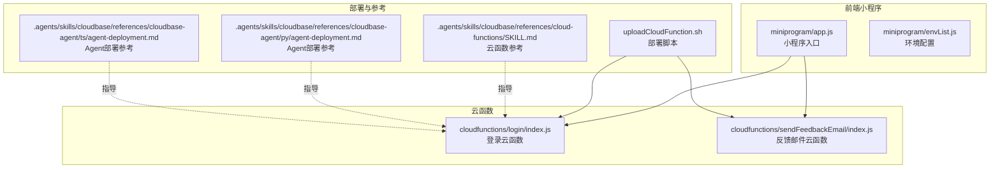
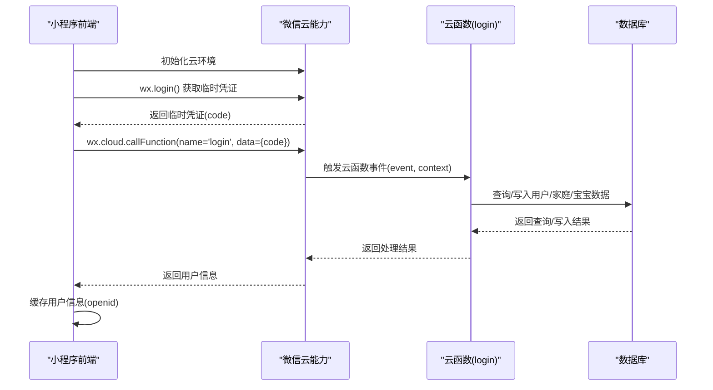
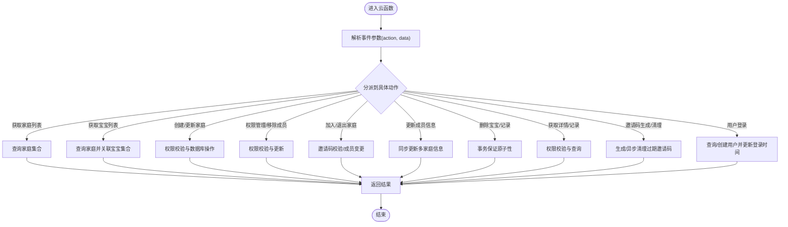
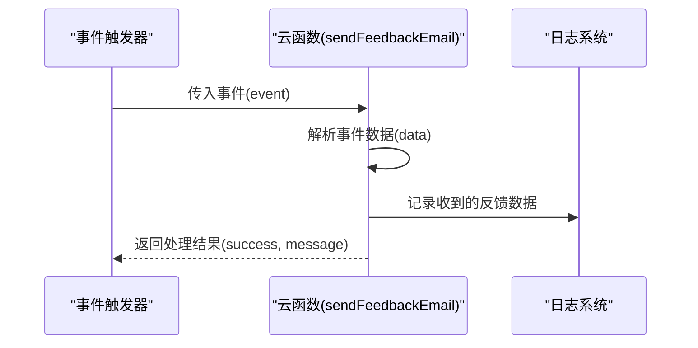
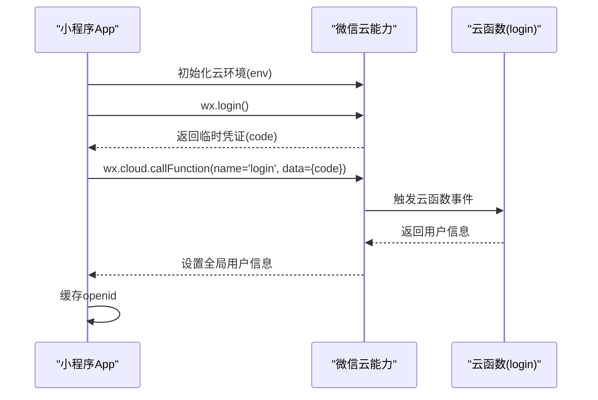
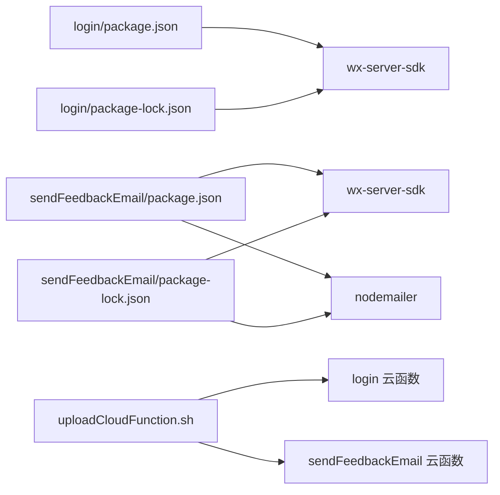

# Serverless特性

<cite>
**本文引用的文件**
- [cloudfunctions/login/index.js](file://cloudfunctions/login/index.js)
- [cloudfunctions/sendFeedbackEmail/index.js](file://cloudfunctions/sendFeedbackEmail/index.js)
- [cloudfunctions/login/package.json](file://cloudfunctions/login/package.json)
- [cloudfunctions/sendFeedbackEmail/package.json](file://cloudfunctions/sendFeedbackEmail/package.json)
- [cloudfunctions/login/package-lock.json](file://cloudfunctions/login/package-lock.json)
- [cloudfunctions/sendFeedbackEmail/package-lock.json](file://cloudfunctions/sendFeedbackEmail/package-lock.json)
- [uploadCloudFunction.sh](file://uploadCloudFunction.sh)
- [miniprogram/app.js](file://miniprogram/app.js)
- [miniprogram/envList.js](file://miniprogram/envList.js)
- [.agents/skills/cloudbase/references/cloud-functions/SKILL.md](file://.agents/skills/cloudbase/references/cloud-functions/SKILL.md)
- [.agents/skills/cloudbase/references/cloudbase-agent/py/agent-deployment.md](file://.agents/skills/cloudbase/references/cloudbase-agent/py/agent-deployment.md)
- [.agents/skills/cloudbase/references/cloudbase-agent/ts/agent-deployment.md](file://.agents/skills/cloudbase/references/cloudbase-agent/ts/agent-deployment.md)
</cite>

## 目录
1. [简介](#简介)
2. [项目结构](#项目结构)
3. [核心组件](#核心组件)
4. [架构总览](#架构总览)
5. [详细组件分析](#详细组件分析)
6. [依赖关系分析](#依赖关系分析)
7. [性能考量](#性能考量)
8. [故障排查指南](#故障排查指南)
9. [结论](#结论)
10. [附录](#附录)

## 简介
本文件围绕仓库中的Serverless特性进行系统化说明，重点覆盖以下方面：
- 云函数的自动扩缩容与资源分配策略（基于平台能力与最佳实践）
- 无服务器运维优势（无需关注服务器硬件、系统更新、安全补丁等）
- 事件驱动架构（触发器机制、异步处理、事件队列）
- 冷启动优化（预热、代码包优化、依赖管理）
- 最佳实践与性能优化建议

本项目包含两个云函数示例：登录云函数与反馈邮件云函数，并通过小程序前端调用登录云函数完成鉴权与用户信息初始化。部署脚本展示了云函数的部署流程。

## 项目结构
该项目采用“前端小程序 + 云函数”的典型Serverless架构组织方式：
- 前端：miniprogram 目录包含小程序应用入口与环境配置
- 云函数：cloudfunctions 目录包含多个云函数（如 login、sendFeedbackEmail）
- 部署：uploadCloudFunction.sh 提供一键部署脚本
- 文档参考：.agents/skills/cloudbase 下包含云函数与Agent部署的参考文档

图表来源
- [miniprogram/app.js:1-56](file://miniprogram/app.js#L1-L56)
- [miniprogram/envList.js:1-7](file://miniprogram/envList.js#L1-L7)
- [cloudfunctions/login/index.js:1-814](file://cloudfunctions/login/index.js#L1-L814)
- [cloudfunctions/sendFeedbackEmail/index.js:1-21](file://cloudfunctions/sendFeedbackEmail/index.js#L1-L21)
- [uploadCloudFunction.sh:1-1](file://uploadCloudFunction.sh#L1-L1)
- [.agents/skills/cloudbase/references/cloud-functions/SKILL.md:196-253](file://.agents/skills/cloudbase/references/cloud-functions/SKILL.md#L196-L253)
- [.agents/skills/cloudbase/references/cloudbase-agent/py/agent-deployment.md:1-231](file://.agents/skills/cloudbase/references/cloudbase-agent/py/agent-deployment.md#L1-L231)
- [.agents/skills/cloudbase/references/cloudbase-agent/ts/agent-deployment.md:42-85](file://.agents/skills/cloudbase/references/cloudbase-agent/ts/agent-deployment.md#L42-L85)

章节来源
- [miniprogram/app.js:1-56](file://miniprogram/app.js#L1-L56)
- [miniprogram/envList.js:1-7](file://miniprogram/envList.js#L1-L7)
- [cloudfunctions/login/index.js:1-814](file://cloudfunctions/login/index.js#L1-L814)
- [cloudfunctions/sendFeedbackEmail/index.js:1-21](file://cloudfunctions/sendFeedbackEmail/index.js#L1-L21)
- [uploadCloudFunction.sh:1-1](file://uploadCloudFunction.sh#L1-L1)

## 核心组件
- 登录云函数（login）：负责小程序登录、用户信息初始化、家庭与宝宝数据查询、权限校验、邀请码管理等。该函数通过事件驱动模式接收小程序传入的事件参数，执行数据库读写与事务处理。
- 反馈邮件云函数（sendFeedbackEmail）：演示事件驱动的异步处理，接收事件数据后进行日志记录与结果返回。
- 小程序前端：在应用启动时初始化云环境并调用登录云函数，完成用户登录态建立与用户信息缓存。
- 部署脚本：提供一键部署命令，用于将云函数发布到指定环境。

章节来源
- [cloudfunctions/login/index.js:22-800](file://cloudfunctions/login/index.js#L22-L800)
- [cloudfunctions/sendFeedbackEmail/index.js:6-20](file://cloudfunctions/sendFeedbackEmail/index.js#L6-L20)
- [miniprogram/app.js:28-54](file://miniprogram/app.js#L28-L54)
- [uploadCloudFunction.sh:1-1](file://uploadCloudFunction.sh#L1-L1)

## 架构总览
下图展示从前端小程序到云函数再到数据库的端到端调用链路，体现事件驱动与Serverless的解耦特性。

图表来源
- [miniprogram/app.js:12-54](file://miniprogram/app.js#L12-L54)
- [cloudfunctions/login/index.js:22-800](file://cloudfunctions/login/index.js#L22-L800)

## 详细组件分析

### 组件A：登录云函数（login）
- 入口与上下文：使用云函数标准入口 exports.main，通过云SDK获取微信上下文与数据库连接。
- 功能范围：支持多种动作（如获取家庭列表、获取宝宝列表、创建/更新家庭、权限管理、邀请码生成与清理、记录查询与删除、用户登录态维护等），通过事件参数中的 action 字段分派处理逻辑。
- 数据访问：统一通过云数据库接口进行查询、插入、更新、删除与事务处理，保证一致性与并发安全。
- 权限控制：对不同操作进行严格的权限校验（如仅一级助教可修改家庭名称、删除宝宝、移除成员等）。
- 异步清理：对过期邀请码进行异步清理，避免阻塞主流程。

图表来源
- [cloudfunctions/login/index.js:22-800](file://cloudfunctions/login/index.js#L22-L800)

章节来源
- [cloudfunctions/login/index.js:22-800](file://cloudfunctions/login/index.js#L22-L800)

### 组件B：反馈邮件云函数（sendFeedbackEmail）
- 入口与上下文：标准云函数入口 exports.main，初始化云环境。
- 功能范围：接收事件中的反馈数据，进行简单日志记录与返回，便于后续扩展为邮件发送等异步任务。
- 异步处理：适合作为事件驱动的异步处理单元，可在后续版本接入邮件服务SDK实现真正的异步投递。

图表来源
- [cloudfunctions/sendFeedbackEmail/index.js:6-20](file://cloudfunctions/sendFeedbackEmail/index.js#L6-L20)

章节来源
- [cloudfunctions/sendFeedbackEmail/index.js:6-20](file://cloudfunctions/sendFeedbackEmail/index.js#L6-L20)

### 组件C：小程序前端（app.js）
- 初始化：在应用启动时初始化云环境，设置环境ID与traceUser。
- 登录流程：调用微信登录接口获取临时凭证，再调用云函数 login 完成用户信息初始化与缓存。
- 状态管理：将用户信息存储到全局数据，便于页面共享。

图表来源
- [miniprogram/app.js:12-54](file://miniprogram/app.js#L12-L54)

章节来源
- [miniprogram/app.js:12-54](file://miniprogram/app.js#L12-L54)

## 依赖关系分析
- 云函数依赖：login 与 sendFeedbackEmail 均依赖 wx-server-sdk；sendFeedbackEmail 还依赖 nodemailer（用于后续邮件发送）。
- 包锁定文件：login 与 sendFeedbackEmail 的 package-lock.json 展示了依赖树，有助于定位冷启动与体积优化点。
- 部署脚本：uploadCloudFunction.sh 提供一键部署命令，结合云平台CLI完成函数部署。

图表来源
- [cloudfunctions/login/package.json:12-14](file://cloudfunctions/login/package.json#L12-L14)
- [cloudfunctions/sendFeedbackEmail/package.json:9-12](file://cloudfunctions/sendFeedbackEmail/package.json#L9-L12)
- [cloudfunctions/login/package-lock.json:1-50](file://cloudfunctions/login/package-lock.json#L1-L50)
- [cloudfunctions/sendFeedbackEmail/package-lock.json:525-566](file://cloudfunctions/sendFeedbackEmail/package-lock.json#L525-L566)
- [uploadCloudFunction.sh:1-1](file://uploadCloudFunction.sh#L1-L1)

章节来源
- [cloudfunctions/login/package.json:12-14](file://cloudfunctions/login/package.json#L12-L14)
- [cloudfunctions/sendFeedbackEmail/package.json:9-12](file://cloudfunctions/sendFeedbackEmail/package.json#L9-L12)
- [cloudfunctions/login/package-lock.json:1-50](file://cloudfunctions/login/package-lock.json#L1-L50)
- [cloudfunctions/sendFeedbackEmail/package-lock.json:525-566](file://cloudfunctions/sendFeedbackEmail/package-lock.json#L525-L566)
- [uploadCloudFunction.sh:1-1](file://uploadCloudFunction.sh#L1-L1)

## 性能考量
- 自动扩缩容与资源分配
  - 平台默认按请求量动态扩缩容，无需手动干预。可通过配置最小实例数、超时时间、内存等参数优化吞吐与延迟。
  - 参考文档强调：不要上传 node_modules，依赖由平台自动安装；使用环境变量而非硬编码配置；明确运行时版本。
- 冷启动优化
  - 代码包优化：减少依赖体积、避免一次性安装过多第三方包；将大依赖拆分为按需加载模块。
  - 预热机制：通过定时触发或长驻实例（如平台提供的预置实例）降低首次调用延迟。
  - 依赖管理：使用 package-lock.json 锁定版本，避免重复安装与冲突；优先选择轻量级替代方案。
- 事件驱动与异步处理
  - 将耗时任务（如邮件发送、批量数据处理）放入异步云函数或消息队列，避免阻塞主线程。
  - 对于邀请码清理等后台任务，采用异步删除策略，不影响主流程响应时间。
- 最佳实践
  - 明确运行时版本（如 Node.js 20）；严格遵循启动脚本规范；使用环境变量管理配置；测试本地后再部署。

章节来源
- [.agents/skills/cloudbase/references/cloud-functions/SKILL.md:196-253](file://.agents/skills/cloudbase/references/cloud-functions/SKILL.md#L196-L253)
- [.agents/skills/cloudbase/references/cloudbase-agent/py/agent-deployment.md:42-85](file://.agents/skills/cloudbase/references/cloudbase-agent/py/agent-deployment.md#L42-L85)
- [.agents/skills/cloudbase/references/cloudbase-agent/ts/agent-deployment.md:42-85](file://.agents/skills/cloudbase/references/cloudbase-agent/ts/agent-deployment.md#L42-L85)

## 故障排查指南
- 登录失败
  - 检查小程序端是否正确调用 wx.login 与 wx.cloud.callFunction。
  - 核对云函数入口是否正确解析事件参数与上下文。
  - 关注数据库权限与集合是否存在，必要时补充初始化脚本。
- 云函数异常
  - 查看云函数日志输出，定位错误堆栈与参数。
  - 对涉及数据库的事务操作，确认事务边界与回滚策略。
- 部署问题
  - 确认部署脚本中的环境ID、项目路径等参数正确。
  - 检查依赖是否符合平台要求（如运行时版本、启动脚本格式）。
- 冷启动慢
  - 分析依赖体积与导入路径，减少不必要的模块加载。
  - 使用预热策略或平台提供的最小实例配置。

章节来源
- [miniprogram/app.js:34-48](file://miniprogram/app.js#L34-L48)
- [cloudfunctions/login/index.js:26-800](file://cloudfunctions/login/index.js#L26-L800)
- [uploadCloudFunction.sh:1-1](file://uploadCloudFunction.sh#L1-L1)

## 结论
本项目通过小程序前端与云函数的组合，展现了典型的Serverless事件驱动架构。登录云函数承担了用户态管理与数据访问的核心职责，反馈邮件云函数则体现了异步处理的潜力。结合平台的自动扩缩容、冷启动优化与最佳实践，可以在保障性能的同时显著降低运维成本，提升开发效率。

## 附录
- 云函数参考文档要点
  - 部署最佳实践：明确运行时、避免上传 node_modules、使用环境变量、本地测试。
  - HTTP函数要求：必须监听端口9000、需要 scf_bootstrap 启动脚本。
- Agent部署参考要点
  - 使用 manageAgent 工具部署Agent服务；严格遵循四步部署流程；确保Python 3.10与依赖验证通过；启动脚本需可执行且最小化。

章节来源
- [.agents/skills/cloudbase/references/cloud-functions/SKILL.md:196-253](file://.agents/skills/cloudbase/references/cloud-functions/SKILL.md#L196-L253)
- [.agents/skills/cloudbase/references/cloudbase-agent/py/agent-deployment.md:1-231](file://.agents/skills/cloudbase/references/cloudbase-agent/py/agent-deployment.md#L1-L231)
- [.agents/skills/cloudbase/references/cloudbase-agent/ts/agent-deployment.md:42-85](file://.agents/skills/cloudbase/references/cloudbase-agent/ts/agent-deployment.md#L42-L85)