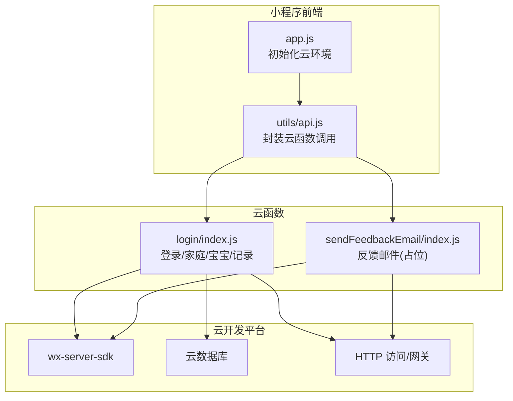
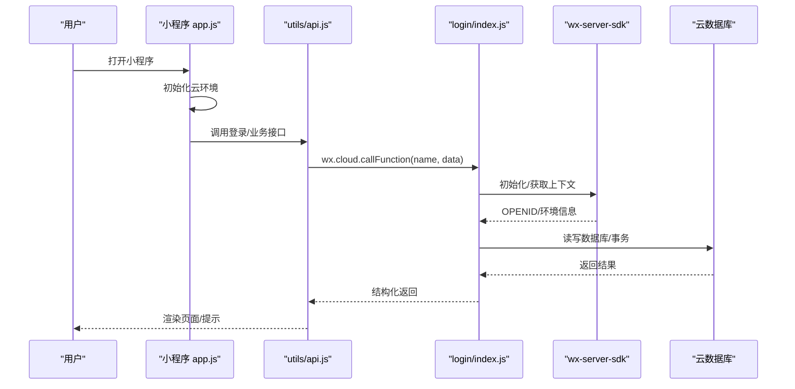
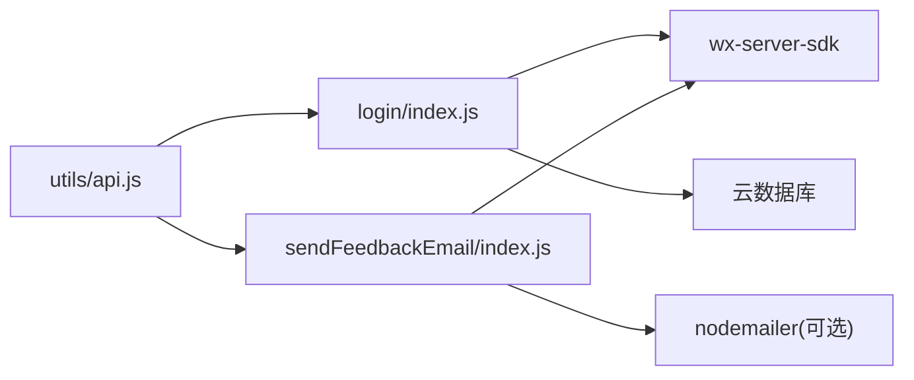

# 云函数架构

<cite>
**本文引用的文件**
- [cloudfunctions/login/index.js](file://cloudfunctions/login/index.js)
- [cloudfunctions/sendFeedbackEmail/index.js](file://cloudfunctions/sendFeedbackEmail/index.js)
- [cloudfunctions/login/package.json](file://cloudfunctions/login/package.json)
- [cloudfunctions/sendFeedbackEmail/package.json](file://cloudfunctions/sendFeedbackEmail/package.json)
- [uploadCloudFunction.sh](file://uploadCloudFunction.sh)
- [.agents/skills/cloudbase/references/cloud-functions/SKILL.md](file://.agents/skills/cloudbase/references/cloud-functions/SKILL.md)
- [.agents/skills/cloudbase/references/cloud-functions/checklist.md](file://.agents/skills/cloudbase/references/cloud-functions/checklist.md)
- [miniprogram/app.js](file://miniprogram/app.js)
- [miniprogram/utils/api.js](file://miniprogram/utils/api.js)
- [miniprogram/envList.js](file://miniprogram/envList.js)
- [package.json](file://package.json)
</cite>

## 目录
1. [简介](#简介)
2. [项目结构](#项目结构)
3. [核心组件](#核心组件)
4. [架构总览](#架构总览)
5. [组件详细分析](#组件详细分析)
6. [依赖关系分析](#依赖关系分析)
7. [性能与扩展性](#性能与扩展性)
8. [调试与监控](#调试与监控)
9. [安全机制](#安全机制)
10. [最佳实践](#最佳实践)
11. [结论](#结论)

## 简介
本项目采用云函数（Serverless）架构，通过微信小程序前端调用云函数进行用户认证、家庭与宝宝数据管理、记录增删改查等业务逻辑。云函数具备事件驱动、自动扩缩容、无服务器维护等 Serverless 特性，结合数据库与权限控制，形成轻量、可扩展、易维护的后端方案。

## 项目结构
- 云函数目录：cloudfunctions/
  - login：登录与家庭/宝宝/记录相关的核心业务云函数
  - sendFeedbackEmail：反馈邮件发送示例云函数（当前为占位）
- 前端小程序：miniprogram/
  - app.js：初始化云环境、发起登录流程
  - utils/api.js：封装云函数调用与业务接口
- 技能文档：.agents/skills/cloudbase/references/cloud-functions/*
  - 提供云函数类型、部署、日志、调用等规范
- 部署脚本：uploadCloudFunction.sh
- 环境配置：miniprogram/envList.js、根目录 package.json

图表来源
- [miniprogram/app.js:1-56](file://miniprogram/app.js#L1-L56)
- [miniprogram/utils/api.js:1-879](file://miniprogram/utils/api.js#L1-L879)
- [cloudfunctions/login/index.js:1-814](file://cloudfunctions/login/index.js#L1-L814)
- [cloudfunctions/sendFeedbackEmail/index.js:1-21](file://cloudfunctions/sendFeedbackEmail/index.js#L1-L21)

章节来源
- [cloudfunctions/login/index.js:1-814](file://cloudfunctions/login/index.js#L1-L814)
- [cloudfunctions/sendFeedbackEmail/index.js:1-21](file://cloudfunctions/sendFeedbackEmail/index.js#L1-L21)
- [miniprogram/app.js:1-56](file://miniprogram/app.js#L1-L56)
- [miniprogram/utils/api.js:1-879](file://miniprogram/utils/api.js#L1-L879)

## 核心组件
- 登录与用户态云函数（login/index.js）
  - 支持多种 action：获取家庭/宝宝列表、创建/更新家庭、邀请码、加入/退出家庭、删除宝宝/记录、权限校验等
  - 使用 wx-server-sdk 初始化，读取微信上下文（OPENID），统一返回结构化结果
- 反馈邮件云函数（sendFeedbackEmail/index.js）
  - 当前为占位实现，打印日志并返回成功消息；后续可接入邮件服务
- 前端调用层（miniprogram/utils/api.js）
  - 统一封装云函数调用，包含等待登录、权限检查、错误处理等
- 部署与运行（uploadCloudFunction.sh、技能文档）
  - 提供云函数部署流程与规范，支持事件函数与 HTTP 函数

章节来源
- [cloudfunctions/login/index.js:22-800](file://cloudfunctions/login/index.js#L22-L800)
- [cloudfunctions/sendFeedbackEmail/index.js:6-20](file://cloudfunctions/sendFeedbackEmail/index.js#L6-L20)
- [miniprogram/utils/api.js:43-780](file://miniprogram/utils/api.js#L43-L780)
- [.agents/skills/cloudbase/references/cloud-functions/SKILL.md:44-118](file://.agents/skills/cloudbase/references/cloud-functions/SKILL.md#L44-L118)

## 架构总览
云函数采用事件驱动模型，由小程序前端通过 wx.cloud.callFunction 触发。云函数内部通过 wx-server-sdk 获取用户上下文，访问云数据库，执行业务逻辑，并返回结构化结果。技能文档明确了事件函数与 HTTP 函数的区别、部署要求、日志查询与调用方式。

图表来源
- [miniprogram/app.js:28-54](file://miniprogram/app.js#L28-L54)
- [miniprogram/utils/api.js:43-111](file://miniprogram/utils/api.js#L43-L111)
- [cloudfunctions/login/index.js:22-800](file://cloudfunctions/login/index.js#L22-L800)

章节来源
- [.agents/skills/cloudbase/references/cloud-functions/SKILL.md:510-562](file://.agents/skills/cloudbase/references/cloud-functions/SKILL.md#L510-L562)
- [miniprogram/app.js:28-54](file://miniprogram/app.js#L28-L54)
- [miniprogram/utils/api.js:43-111](file://miniprogram/utils/api.js#L43-L111)

## 组件详细分析

### 登录与用户态云函数（login/index.js）
- 功能概览
  - 登录态获取与用户信息持久化
  - 家庭管理：创建、名称更新、成员权限变更、移除成员、退出家庭
  - 宝宝管理：列表、详情、删除（含事务）、姓名更新
  - 记录管理：查询、删除（按权限）
  - 邀请码：生成、清理过期
- 关键点
  - 使用 cloud.getWXContext() 获取 OPENID，作为用户标识
  - 多处使用数据库事务（如删除宝宝）保证一致性
  - 权限校验贯穿家庭与记录操作，避免越权
  - 对用户输入进行长度与存在性校验，提升健壮性

```mermaid
flowchart TD
Start(["进入 exports.main"]) --> GetCtx["获取微信上下文(OPENID)"]
GetCtx --> Switch{"判断 action"}
Switch --> |登录| Login["查询/创建用户记录"]
Switch --> |获取家庭| GetFams["按成员查询家庭并排序"]
Switch --> |获取宝宝| GetBabies["查询家庭列表后查询宝宝并排序"]
Switch --> |创建家庭| CreateFamily["校验限制后创建家庭"]
Switch --> |更新家庭名称| UpdateFamilyName["校验权限后更新"]
Switch --> |更新成员权限| UpdatePerm["校验权限后更新成员权限"]
Switch --> |移除成员| RemoveMember["校验权限后移除成员"]
Switch --> |加入家庭| JoinFamily["校验邀请码/限制后加入"]
Switch --> |退出家庭| LeaveFamily["创建者删除家庭及关联数据"]
Switch --> |更新成员信息| UpdateMemberInfo["同步更新其他家庭信息"]
Switch --> |删除宝宝| DelBaby["事务删除宝宝与记录"]
Switch --> |删除记录| DelRecord["按权限校验后删除"]
Switch --> |获取宝宝详情| GetBaby["校验权限后返回"]
Switch --> |获取宝宝记录| GetRecords["校验权限后返回"]
Switch --> |获取单个记录| GetRecord["校验权限后返回"]
Switch --> |获取家庭详情| GetFamily["校验成员后返回"]
Switch --> |创建邀请码| CreateInvite["校验权限后生成并异步清理过期"]
Switch --> |更新宝宝姓名| UpdateBabyName["校验权限后更新"]
Switch --> |清理过期邀请码| CleanInvite["批量清理过期邀请码"]
Login --> End(["返回结果"])
GetFams --> End
GetBabies --> End
CreateFamily --> End
UpdateFamilyName --> End
UpdatePerm --> End
RemoveMember --> End
JoinFamily --> End
LeaveFamily --> End
UpdateMemberInfo --> End
DelBaby --> End
DelRecord --> End
GetBaby --> End
GetRecords --> End
GetRecord --> End
GetFamily --> End
CreateInvite --> End
UpdateBabyName --> End
CleanInvite --> End
```

图表来源
- [cloudfunctions/login/index.js:22-800](file://cloudfunctions/login/index.js#L22-L800)

章节来源
- [cloudfunctions/login/index.js:22-800](file://cloudfunctions/login/index.js#L22-L800)

### 反馈邮件云函数（sendFeedbackEmail/index.js）
- 当前实现
  - 从触发事件中读取 data，打印日志并返回成功消息
  - 未实际发送邮件，便于后续扩展
- 建议
  - 在 package.json 中引入邮件依赖（如 nodemailer），在云函数中配置 SMTP 并发送邮件
  - 增加失败回退与重试策略，记录详细错误日志

章节来源
- [cloudfunctions/sendFeedbackEmail/index.js:6-20](file://cloudfunctions/sendFeedbackEmail/index.js#L6-L20)
- [cloudfunctions/sendFeedbackEmail/package.json:9-15](file://cloudfunctions/sendFeedbackEmail/package.json#L9-L15)

### 前端调用层（miniprogram/utils/api.js）
- 登录等待与重试：waitForLogin 提供最大等待时间与轮询检测
- 云函数调用：统一通过 wx.cloud.callFunction 调用 login 云函数，传递 action 与参数
- 权限与限制：在前端侧对部分操作进行前置校验（如家庭数量、宝宝数量、权限等级）

章节来源
- [miniprogram/utils/api.js:13-41](file://miniprogram/utils/api.js#L13-L41)
- [miniprogram/utils/api.js:43-780](file://miniprogram/utils/api.js#L43-L780)

### 部署与运行（uploadCloudFunction.sh、技能文档）
- 部署脚本
  - 提供一键部署命令模板，指定环境 ID、函数名与项目路径
- 技能文档
  - 明确事件函数与 HTTP 函数差异、运行时选择、日志查询、调用方式与安全配置

章节来源
- [uploadCloudFunction.sh:1-1](file://uploadCloudFunction.sh#L1-L1)
- [.agents/skills/cloudbase/references/cloud-functions/SKILL.md:44-118](file://.agents/skills/cloudbase/references/cloud-functions/SKILL.md#L44-L118)

## 依赖关系分析
- 前端依赖
  - wx-server-sdk：用于云函数侧获取微信上下文与数据库操作
  - nodemailer（sendFeedbackEmail）：用于邮件发送（当前未启用）
- 云函数依赖
  - login：仅 wx-server-sdk
  - sendFeedbackEmail：wx-server-sdk + nodemailer
- 前后端交互
  - 小程序通过 wx.cloud.callFunction 调用云函数
  - 云函数通过 wx-server-sdk 访问数据库与执行事务

图表来源
- [miniprogram/utils/api.js:43-780](file://miniprogram/utils/api.js#L43-L780)
- [cloudfunctions/login/index.js:22-800](file://cloudfunctions/login/index.js#L22-L800)
- [cloudfunctions/sendFeedbackEmail/index.js:6-20](file://cloudfunctions/sendFeedbackEmail/index.js#L6-L20)

章节来源
- [cloudfunctions/login/package.json:12-14](file://cloudfunctions/login/package.json#L12-L14)
- [cloudfunctions/sendFeedbackEmail/package.json:9-12](file://cloudfunctions/sendFeedbackEmail/package.json#L9-L12)

## 性能与扩展性
- 自动扩缩容
  - 云函数按请求自动扩容，适合突发流量场景
- 冷启动优化
  - 保持依赖精简，避免在函数入口做重型初始化
  - 将静态资源与计算分离，减少每次调用的初始化成本
- 执行超时
  - 合理设置超时时间，避免长耗时操作阻塞
- 内存管理
  - 控制并发与连接池大小，避免内存泄漏
- 数据库访问
  - 使用事务与批量操作减少往返次数
  - 对高频查询建立索引，避免全表扫描

章节来源
- [.agents/skills/cloudbase/references/cloud-functions/SKILL.md:766-779](file://.agents/skills/cloudbase/references/cloud-functions/SKILL.md#L766-L779)

## 调试与监控
- 日志记录
  - 在云函数中使用 console 输出关键信息与错误
  - 在前端调用层捕获失败并输出错误日志
- 日志查询
  - 使用技能文档提供的日志查询方法定位问题
- 性能分析
  - 关注冷启动时间与平均执行时间，识别瓶颈
- 错误追踪
  - 统一返回结构化错误信息，便于前端展示与定位

章节来源
- [cloudfunctions/login/index.js:343-345](file://cloudfunctions/login/index.js#L343-L345)
- [cloudfunctions/sendFeedbackEmail/index.js:16-19](file://cloudfunctions/sendFeedbackEmail/index.js#L16-L19)
- [.agents/skills/cloudbase/references/cloud-functions/SKILL.md:458-509](file://.agents/skills/cloudbase/references/cloud-functions/SKILL.md#L458-L509)

## 安全机制
- 身份验证
  - 通过 wx-server-sdk 获取 OPENID，作为用户唯一标识
- 权限控制
  - 家庭与记录操作均进行权限校验（如一级助教、二级助教、查看者）
  - 严禁越权操作（如非创建者修改权限、删除创建者）
- 数据访问控制
  - 通过云函数集中校验用户与数据归属，避免直接暴露数据库权限
- 邀请码安全
  - 邀请码设置有效期与使用限制，定期清理过期数据

章节来源
- [cloudfunctions/login/index.js:170-214](file://cloudfunctions/login/index.js#L170-L214)
- [cloudfunctions/login/index.js:541-554](file://cloudfunctions/login/index.js#L541-L554)
- [cloudfunctions/login/index.js:659-699](file://cloudfunctions/login/index.js#L659-L699)

## 最佳实践
- 代码组织
  - 云函数聚焦单一职责，将复杂逻辑拆分为多个 action
  - 前端调用层统一封装，便于维护与测试
- 错误处理
  - 云函数返回结构化错误，前端统一处理
  - 对网络异常与超时进行重试与降级
- 性能优化
  - 减少不必要的数据库查询，合并批量操作
  - 使用事务保证一致性，避免脏读
- 部署与运维
  - 明确事件函数与 HTTP 函数的适用场景
  - 严格遵循部署清单，避免运行时变更
- 安全
  - 严格校验用户与数据归属，防止越权
  - 对敏感信息进行脱敏与最小化收集

章节来源
- [.agents/skills/cloudbase/references/cloud-functions/checklist.md:1-27](file://.agents/skills/cloudbase/references/cloud-functions/checklist.md#L1-L27)
- [.agents/skills/cloudbase/references/cloud-functions/SKILL.md:766-799](file://.agents/skills/cloudbase/references/cloud-functions/SKILL.md#L766-L799)

## 结论
本项目通过云函数实现了事件驱动的 Serverless 架构，结合小程序前端与云数据库，提供了完整的用户认证、家庭与宝宝管理、记录维护等功能。通过严格的权限控制、事务保证与日志监控，系统具备良好的安全性与可维护性。建议后续完善邮件发送功能、优化冷启动与数据库访问性能，并持续遵循云函数最佳实践进行演进。