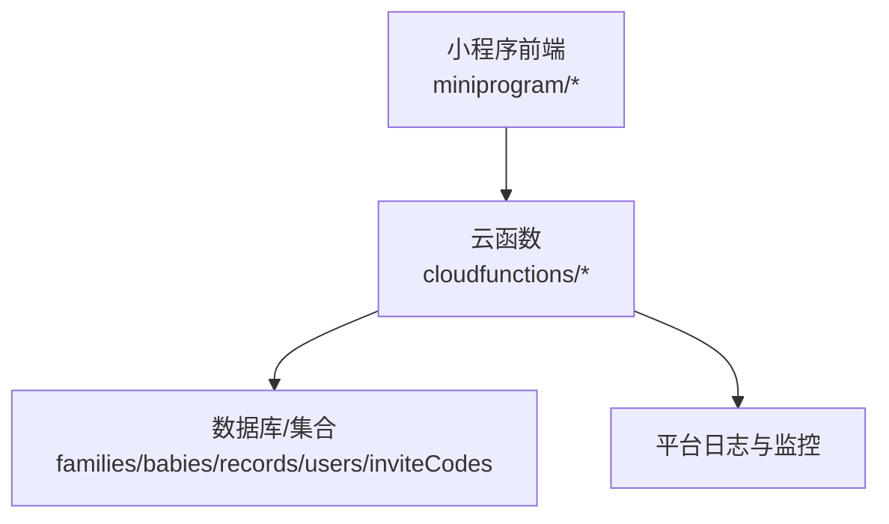
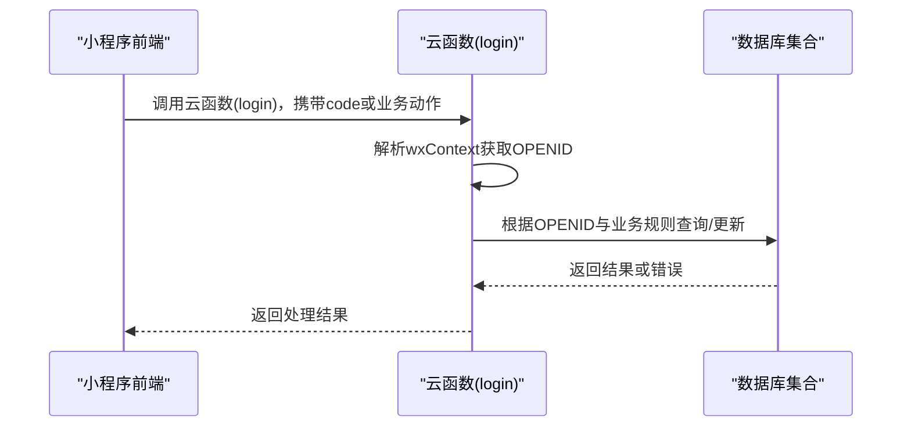
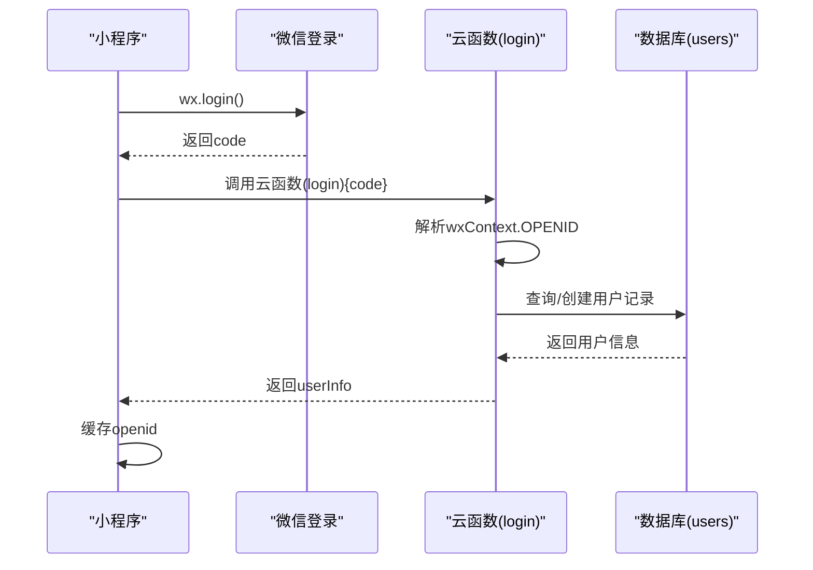
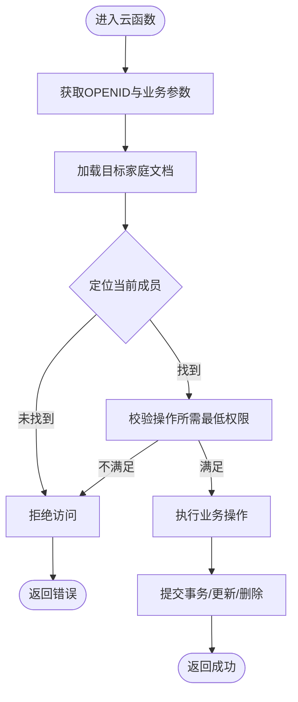
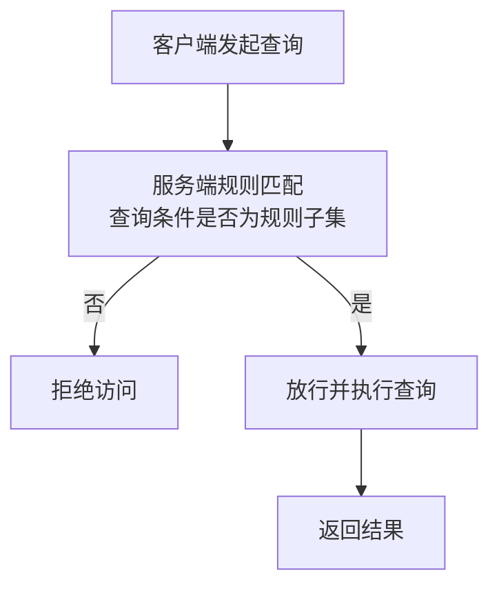
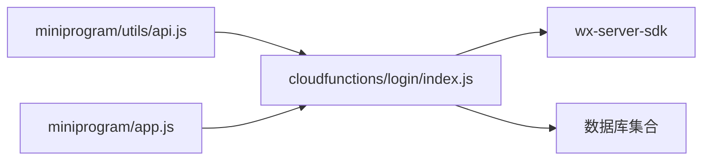

# 安全机制

<cite>
**本文引用的文件**   
- [cloudfunctions/login/index.js](file://cloudfunctions/login/index.js)
- [cloudfunctions/sendFeedbackEmail/index.js](file://cloudfunctions/sendFeedbackEmail/index.js)
- [miniprogram/utils/api.js](file://miniprogram/utils/api.js)
- [miniprogram/app.js](file://miniprogram/app.js)
- [.agents/skills/cloudbase/references/no-sql-web-sdk/security-rules.md](file://.agents/skills/cloudbase/references/no-sql-web-sdk/security-rules.md)
- [.agents/skills/cloudbase/references/cloud-functions/SKILL.md](file://.agents/skills/cloudbase/references/cloud-functions/SKILL.md)
- [miniprogram/envList.js](file://miniprogram/envList.js)
- [package.json](file://package.json)
</cite>

## 目录
1. [简介](#简介)
2. [项目结构](#项目结构)
3. [核心组件](#核心组件)
4. [架构总览](#架构总览)
5. [详细组件分析](#详细组件分析)
6. [依赖关系分析](#依赖关系分析)
7. [性能与安全特性](#性能与安全特性)
8. [故障排查指南](#故障排查指南)
9. [结论](#结论)
10. [附录](#附录)

## 简介
本文件系统化梳理该项目的云函数安全机制，覆盖身份认证、访问控制、权限分级、数据访问控制、网络安全、安全最佳实践以及审计与监控。文档基于仓库中现有的云函数与小程序前端实现进行分析，并结合平台参考文档给出可落地的建议与改进方向。

## 项目结构
项目采用“微信小程序前端 + 云函数后端”的分层架构：
- 前端通过 wx.cloud 调用云函数，云函数通过 wx-server-sdk 访问数据库与业务逻辑。
- 权限控制在云函数侧集中实现，同时辅以数据库安全规则进行客户端访问约束。
- 安全日志与可观测性可通过平台提供的日志与监控能力实现。

图表来源
- [miniprogram/app.js:1-56](file://miniprogram/app.js#L1-L56)
- [cloudfunctions/login/index.js:1-814](file://cloudfunctions/login/index.js#L1-L814)
- [.agents/skills/cloudbase/references/no-sql-web-sdk/security-rules.md:1-895](file://.agents/skills/cloudbase/references/no-sql-web-sdk/security-rules.md#L1-L895)

章节来源
- [miniprogram/app.js:1-56](file://miniprogram/app.js#L1-L56)
- [cloudfunctions/login/index.js:1-814](file://cloudfunctions/login/index.js#L1-L814)
- [miniprogram/utils/api.js:1-879](file://miniprogram/utils/api.js#L1-L879)

## 核心组件
- 身份认证与会话
  - 小程序端通过 wx.login 获取临时登录凭证，调用云函数 login 完成用户态绑定与持久化。
  - 云函数通过 wx-server-sdk 获取 wxContext，提取 OPENID 并作为后续鉴权依据。
- 权限分级与访问控制
  - 家庭成员权限分为观察者、保育员、监护人三级；部分敏感操作（如删除宝宝、修改家庭名）仅监护人可执行。
  - 云函数内对用户在目标家庭中的权限进行校验，拒绝越权操作。
- 数据访问控制
  - 云函数统一处理数据库读写，避免直接暴露集合权限给前端。
  - 数据库安全规则用于限制客户端直连的查询条件，确保查询子集满足规则。
- 安全日志与审计
  - 云函数内使用 console 输出关键流程日志，便于问题定位与审计。
  - 平台提供云函数日志查询能力，可用于审计与监控。

章节来源
- [cloudfunctions/login/index.js:22-800](file://cloudfunctions/login/index.js#L22-L800)
- [miniprogram/utils/api.js:800-852](file://miniprogram/utils/api.js#L800-L852)
- [.agents/skills/cloudbase/references/no-sql-web-sdk/security-rules.md:22-895](file://.agents/skills/cloudbase/references/no-sql-web-sdk/security-rules.md#L22-L895)

## 架构总览
下图展示从小程序到云函数再到数据库的请求链路与权限判定位置：

图表来源
- [miniprogram/app.js:28-54](file://miniprogram/app.js#L28-L54)
- [cloudfunctions/login/index.js:22-800](file://cloudfunctions/login/index.js#L22-L800)

## 详细组件分析

### 组件A：身份认证与会话（小程序端）
- 登录流程
  - 小程序调用 wx.login 获取临时登录凭证 code。
  - 调用云函数 login，传入 code。
  - 云函数通过 wx-server-sdk 获取 wxContext.OPENID，查询或创建用户记录，返回用户信息。
- 会话保持
  - 小程序端将 openid 写入全局数据与本地存储，后续接口复用。
- 安全要点
  - 仅通过云函数进行用户态解析，避免在前端暴露敏感逻辑。
  - 云函数侧对用户信息进行幂等创建与更新，保证会话一致性。

图表来源
- [miniprogram/app.js:28-54](file://miniprogram/app.js#L28-L54)
- [cloudfunctions/login/index.js:762-800](file://cloudfunctions/login/index.js#L762-L800)

章节来源
- [miniprogram/app.js:1-56](file://miniprogram/app.js#L1-L56)
- [cloudfunctions/login/index.js:762-800](file://cloudfunctions/login/index.js#L762-L800)

### 组件B：权限分级与访问控制（云函数侧）
- 权限模型
  - 家庭成员角色：观察者(viewer)、保育员(caretaker)、监护人(guardian)。
  - 操作权限矩阵：不同操作要求不同角色级别，例如删除宝宝需监护人。
- 实现方式
  - 云函数根据 OPENID 与目标家庭文档中的成员数组，定位当前用户角色并校验。
  - 对越权操作抛出明确错误，避免误操作或恶意调用。
- 关键点
  - 创建/更新/删除等操作均在云函数内完成，前端仅传递业务参数。
  - 事务性操作（如删除宝宝）通过数据库事务保障一致性。

图表来源
- [cloudfunctions/login/index.js:482-510](file://cloudfunctions/login/index.js#L482-L510)
- [cloudfunctions/login/index.js:153-225](file://cloudfunctions/login/index.js#L153-L225)
- [cloudfunctions/login/index.js:701-738](file://cloudfunctions/login/index.js#L701-L738)

章节来源
- [cloudfunctions/login/index.js:153-225](file://cloudfunctions/login/index.js#L153-L225)
- [cloudfunctions/login/index.js:482-510](file://cloudfunctions/login/index.js#L482-L510)
- [cloudfunctions/login/index.js:701-738](file://cloudfunctions/login/index.js#L701-L738)

### 组件C：数据访问控制（云函数与数据库安全规则）
- 云函数层面
  - 所有读写操作由云函数统一处理，前端通过云函数调用，避免直接访问集合。
  - 云函数内部对查询条件、更新内容进行严格校验与权限判断。
- 数据库安全规则
  - 客户端直连时，规则在服务端对查询条件进行“子集匹配”校验，未满足条件的请求直接拒绝。
  - 支持简单权限与自定义规则两种模式，复杂场景建议使用自定义规则配合角色集合实现细粒度控制。

图表来源
- [.agents/skills/cloudbase/references/no-sql-web-sdk/security-rules.md:484-583](file://.agents/skills/cloudbase/references/no-sql-web-sdk/security-rules.md#L484-L583)

章节来源
- [.agents/skills/cloudbase/references/no-sql-web-sdk/security-rules.md:22-895](file://.agents/skills/cloudbase/references/no-sql-web-sdk/security-rules.md#L22-L895)
- [cloudfunctions/login/index.js:22-800](file://cloudfunctions/login/index.js#L22-L800)

### 组件D：网络安全与传输安全
- HTTPS 与域名
  - 平台提供默认域名与自定义域名访问路径，建议启用 HTTPS 与可信域名白名单。
- 云函数访问控制
  - HTTP API 默认需要鉴权（Bearer Token），浏览器/公开 API 可选。
- DDoS 与流量治理
  - 平台提供函数计算与网络层防护能力，建议开启配额与限流策略，避免滥用。

章节来源
- [.agents/skills/cloudbase/references/cloud-functions/SKILL.md:415-466](file://.agents/skills/cloudbase/references/cloud-functions/SKILL.md#L415-L466)

### 组件E：审计与监控（云函数日志）
- 日志输出
  - 云函数内使用 console 记录关键流程与异常，便于问题定位。
- 平台日志
  - 提供云函数日志查询接口，支持按函数、时间、状态等维度检索。
- 建议
  - 在生产环境开启更细粒度的日志标签与结构化日志，结合平台日志聚合与告警。

章节来源
- [cloudfunctions/login/index.js:12-20](file://cloudfunctions/login/index.js#L12-L20)
- [.agents/skills/cloudbase/references/cloud-functions/SKILL.md:458-466](file://.agents/skills/cloudbase/references/cloud-functions/SKILL.md#L458-L466)

## 依赖关系分析
- 前端依赖
  - 小程序端通过 wx.cloud 调用云函数，依赖全局环境与 openid 缓存。
- 云函数依赖
  - wx-server-sdk 提供 wxContext、数据库操作与命令。
  - 云函数间通过调用云函数名进行协作（如删除宝宝使用事务）。
- 平台依赖
  - 数据库安全规则、云函数日志与监控、HTTPS 与域名配置。

图表来源
- [miniprogram/utils/api.js:1-879](file://miniprogram/utils/api.js#L1-L879)
- [miniprogram/app.js:1-56](file://miniprogram/app.js#L1-L56)
- [cloudfunctions/login/index.js:1-10](file://cloudfunctions/login/index.js#L1-L10)

章节来源
- [miniprogram/utils/api.js:1-879](file://miniprogram/utils/api.js#L1-L879)
- [miniprogram/app.js:1-56](file://miniprogram/app.js#L1-L56)
- [cloudfunctions/login/index.js:1-10](file://cloudfunctions/login/index.js#L1-L10)

## 性能与安全特性
- 性能
  - 云函数内使用事务保证删除等复合操作的一致性，减少重复查询与冗余操作。
  - 前端通过云函数批量获取数据，避免多次直连数据库带来的开销。
- 安全
  - 云函数集中鉴权，前端不直接操作数据库，降低越权风险。
  - 数据库安全规则对客户端直连进行条件校验，防止越权查询。
  - 建议：对高频接口增加缓存与限流，对敏感操作增加二次确认与审计日志。

[本节为通用指导，无需列出具体文件来源]

## 故障排查指南
- 登录失败
  - 检查小程序端 wx.login 是否成功返回 code，确认云函数 login 是否正确解析 wxContext.OPENID。
- 权限不足
  - 确认当前用户在目标家庭中的角色是否满足操作要求；检查云函数中权限校验逻辑。
- 数据访问被拒
  - 若通过客户端直连数据库报错，检查查询条件是否满足安全规则的“子集匹配”要求。
- 日志定位
  - 查看云函数日志，定位错误发生的具体步骤与参数；结合平台日志查询接口进行回溯。

章节来源
- [cloudfunctions/login/index.js:762-800](file://cloudfunctions/login/index.js#L762-L800)
- [cloudfunctions/login/index.js:153-225](file://cloudfunctions/login/index.js#L153-L225)
- [.agents/skills/cloudbase/references/no-sql-web-sdk/security-rules.md:484-583](file://.agents/skills/cloudbase/references/no-sql-web-sdk/security-rules.md#L484-L583)

## 结论
本项目在身份认证、权限控制与数据访问方面形成了“前端不直接触达数据库、云函数集中鉴权”的安全闭环。结合数据库安全规则与平台日志监控，能够有效降低越权与数据泄露风险。建议在生产环境中进一步完善 HTTPS 与域名白名单、接入平台的 DDoS 防护与流量治理，并加强审计日志的结构化与告警联动。

[本节为总结性内容，无需列出具体文件来源]

## 附录

### A. 安全最佳实践清单
- 输入验证
  - 对所有外部输入进行长度、类型与格式校验，避免异常数据进入业务逻辑。
- SQL 注入防护
  - 本项目使用云数据库，遵循平台查询语法与安全规则，避免拼接字符串构造查询条件。
- XSS 防护
  - 前端渲染用户输入时进行转义；云函数返回数据前进行白名单过滤。
- 传输安全
  - 使用 HTTPS 与可信域名；避免在前端暴露敏感配置。
- 权限最小化
  - 采用“最小权限原则”，仅授予完成任务所需的最低权限。
- 审计与监控
  - 开启结构化日志与平台日志查询，建立告警与回溯机制。

[本节为通用指导，无需列出具体文件来源]

### B. 环境与配置提示
- 环境变量
  - 云函数运行环境通过动态环境标识选择，建议在不同环境（开发/测试/生产）隔离配置。
- 包管理
  - 项目根目录包含基础包配置文件，云函数各自维护依赖锁文件，确保部署一致性。

章节来源
- [miniprogram/envList.js:1-7](file://miniprogram/envList.js#L1-L7)
- [package.json:1-22](file://package.json#L1-L22)