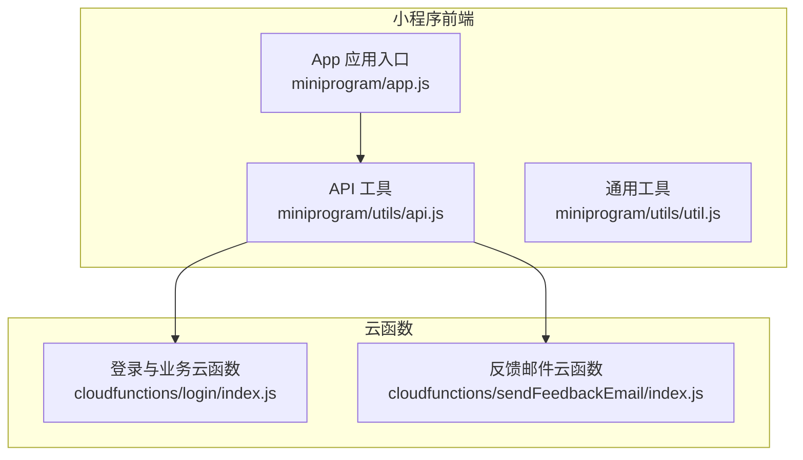
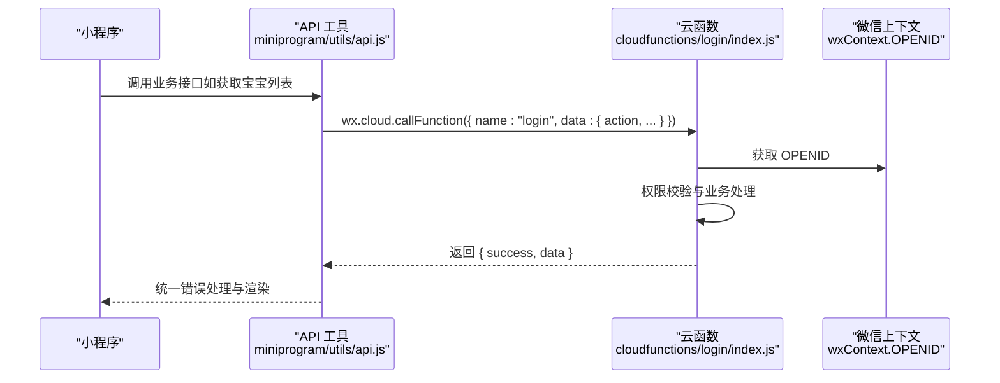
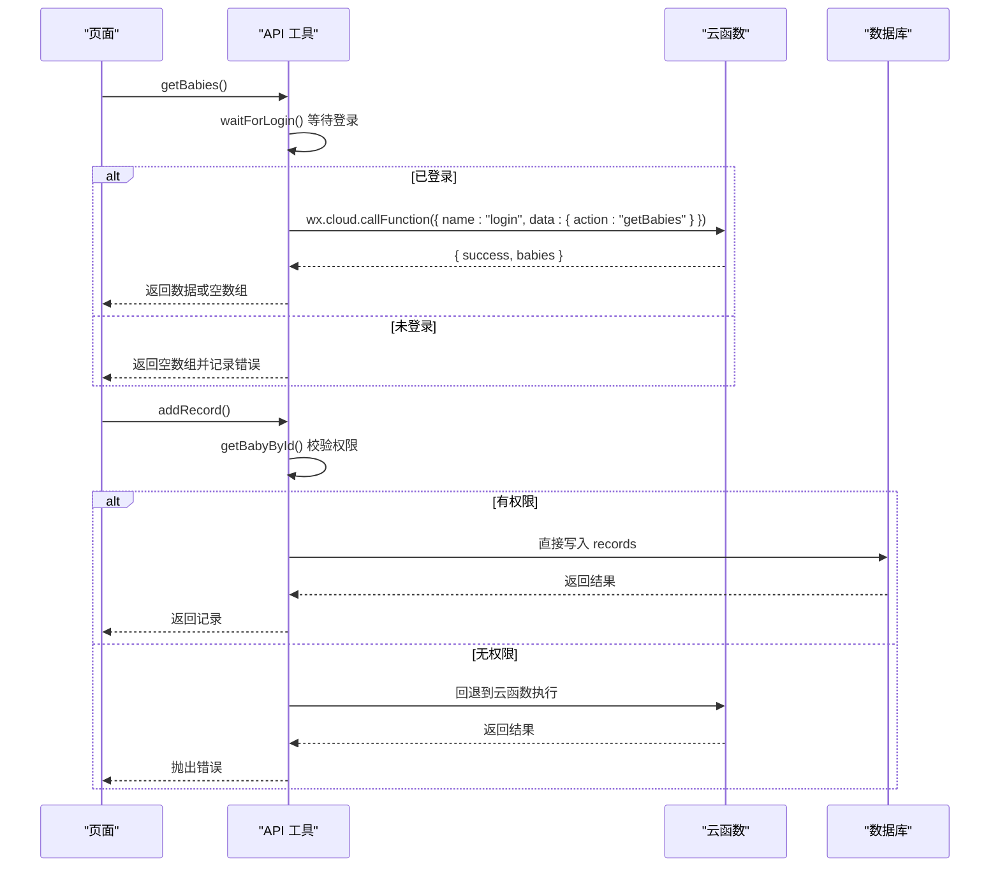
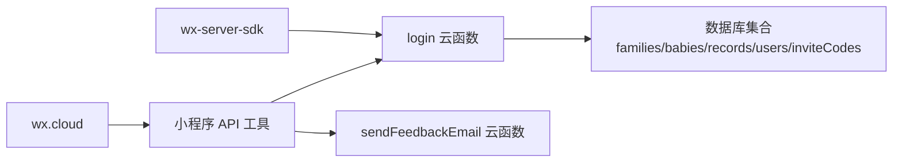
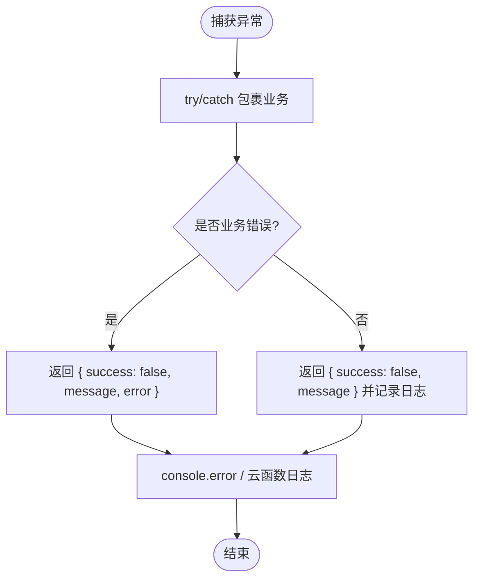

# 开发最佳实践

<cite>
**本文引用的文件**
- [cloudfunctions/login/index.js](file://cloudfunctions/login/index.js)
- [cloudfunctions/sendFeedbackEmail/index.js](file://cloudfunctions/sendFeedbackEmail/index.js)
- [cloudfunctions/login/package.json](file://cloudfunctions/login/package.json)
- [cloudfunctions/sendFeedbackEmail/package.json](file://cloudfunctions/sendFeedbackEmail/package.json)
- [miniprogram/utils/api.js](file://miniprogram/utils/api.js)
- [miniprogram/app.js](file://miniprogram/app.js)
- [miniprogram/utils/util.js](file://miniprogram/utils/util.js)
- [.agents/skills/cloudbase/references/cloud-functions/SKILL.md](file://.agents/skills/cloudbase/references/cloud-functions/SKILL.md)
- [.agents/skills/cloudbase/references/cloud-functions/checklist.md](file://.agents/skills/cloudbase/references/cloud-functions/checklist.md)
- [.agents/skills/cloudbase/references/http-api/checklist.md](file://.agents/skills/cloudbase/references/http-api/checklist.md)
- [uploadCloudFunction.sh](file://uploadCloudFunction.sh)
</cite>

## 目录
1. [简介](#简介)
2. [项目结构](#项目结构)
3. [核心组件](#核心组件)
4. [架构总览](#架构总览)
5. [详细组件分析](#详细组件分析)
6. [依赖关系分析](#依赖关系分析)
7. [性能考虑](#性能考虑)
8. [故障排查指南](#故障排查指南)
9. [结论](#结论)
10. [附录](#附录)

## 简介
本文件面向云函数开发的最佳实践，结合仓库中的微信小程序与云函数实现，系统梳理代码组织结构、错误处理策略、性能优化技巧、安全编码规范、代码质量保证方法以及部署与版本管理策略。目标是帮助开发者在保持可维护性的同时，提升系统的稳定性、安全性与性能表现。

## 项目结构
该项目采用“小程序前端 + 云函数后端”的分层架构：
- 小程序前端位于 miniprogram 目录，包含页面、组件、工具类与应用入口。
- 云函数位于 cloudfunctions 目录，每个子目录代表一个独立的云函数。
- 技能文档位于 .agents/skills/cloudbase 目录，提供云函数开发与部署的通用规范与检查清单。

**图表来源**
- [miniprogram/app.js:1-56](file://miniprogram/app.js#L1-L56)
- [miniprogram/utils/api.js:1-879](file://miniprogram/utils/api.js#L1-L879)
- [cloudfunctions/login/index.js:1-814](file://cloudfunctions/login/index.js#L1-L814)
- [cloudfunctions/sendFeedbackEmail/index.js:1-21](file://cloudfunctions/sendFeedbackEmail/index.js#L1-L21)

**章节来源**
- [miniprogram/app.js:1-56](file://miniprogram/app.js#L1-L56)
- [miniprogram/utils/api.js:1-879](file://miniprogram/utils/api.js#L1-L879)
- [cloudfunctions/login/index.js:1-814](file://cloudfunctions/login/index.js#L1-L814)
- [cloudfunctions/sendFeedbackEmail/index.js:1-21](file://cloudfunctions/sendFeedbackEmail/index.js#L1-L21)

## 核心组件
- 登录与家庭/宝宝/记录管理云函数：统一入口函数根据 action 分派不同业务逻辑，涵盖用户登录、家庭管理、成员权限控制、宝宝与记录 CRUD、邀请码等。
- 小程序 API 工具：封装对云函数的调用，统一错误处理与返回值格式；同时在部分场景下直接访问数据库，配合权限校验。
- 通用工具：日期计算、年龄换算等辅助函数。
- 反馈邮件云函数：占位实现，演示错误处理与日志记录模式。

**章节来源**
- [cloudfunctions/login/index.js:22-800](file://cloudfunctions/login/index.js#L22-L800)
- [miniprogram/utils/api.js:44-879](file://miniprogram/utils/api.js#L44-L879)
- [miniprogram/utils/util.js:1-55](file://miniprogram/utils/util.js#L1-L55)
- [cloudfunctions/sendFeedbackEmail/index.js:7-21](file://cloudfunctions/sendFeedbackEmail/index.js#L7-L21)

## 架构总览
整体交互流程如下：
- 小程序启动后初始化云环境并进行登录，获取用户 openid 并缓存。
- 前端通过 wx.cloud.callFunction 调用云函数，云函数基于 wxContext.OPENID 进行权限校验与业务处理。
- 对于需要严格权限控制的数据访问，优先通过云函数执行，避免直接暴露数据库权限。
- 部分通用逻辑（如年龄计算）在前端工具中实现，减少后端压力。

**图表来源**
- [miniprogram/utils/api.js:44-111](file://miniprogram/utils/api.js#L44-L111)
- [cloudfunctions/login/index.js:22-800](file://cloudfunctions/login/index.js#L22-L800)

**章节来源**
- [miniprogram/app.js:28-54](file://miniprogram/app.js#L28-L54)
- [miniprogram/utils/api.js:44-111](file://miniprogram/utils/api.js#L44-L111)
- [cloudfunctions/login/index.js:22-800](file://cloudfunctions/login/index.js#L22-L800)

## 详细组件分析

### 云函数登录与业务处理（login）
- 统一入口 exports.main，接收 event 与 context，使用 wxContext.OPENID 作为鉴权依据。
- 通过 action 字段分派至不同业务分支，如获取家庭列表、获取宝宝列表、创建/更新家庭、成员权限变更、加入/退出家庭、删除宝宝、删除记录、获取宝宝/记录详情、创建邀请码等。
- 关键特性：
  - 权限校验：针对不同操作校验用户在家庭中的权限等级（访客、保育员、家长），部分敏感操作要求“家长”及以上。
  - 事务性：删除宝宝使用数据库事务，确保关联记录一致性。
  - 数据一致性：更新成员信息时同步更新其在其他家庭中的信息。
  - 异步清理：创建邀请码后异步清理过期邀请码，避免阻塞主流程。
  - 错误处理：对非法输入、越权、资源不存在等情况抛出明确错误信息。

```mermaid
flowchart TD
Start(["进入云函数"]) --> Parse["解析 event 参数<br/>提取 action 与必要字段"]
Parse --> Dispatch{"根据 action 分派"}
Dispatch --> |获取家庭| GetFamilies["查询家庭并排序返回"]
Dispatch --> |获取宝宝| GetBabies["查询家庭 -> 获取宝宝 -> 排序返回"]
Dispatch --> |创建家庭| CreateFamily["校验名称长度/数量限制 -> 创建家庭"]
Dispatch --> |更新家庭名称| UpdateFamilyName["校验权限 -> 更新名称"]
Dispatch --> |更新成员权限| UpdateMemberPerm["校验权限 -> 更新成员权限"]
Dispatch --> |移除成员| RemoveMember["校验权限 -> 移除成员"]
Dispatch --> |加入家庭| JoinFamily["校验邀请码/数量限制 -> 加入家庭"]
Dispatch --> |退出家庭| LeaveFamily["创建者删除全家与宝宝记录 -> 非创建者移除成员"]
Dispatch --> |更新成员信息| UpdateMemberInfo["同步更新其他家庭信息"]
Dispatch --> |删除宝宝| DeleteBaby["事务删除宝宝与相关记录"]
Dispatch --> |删除记录| DeleteRecord["校验权限 -> 删除记录"]
Dispatch --> |获取宝宝详情| GetBabyById["校验权限 -> 返回宝宝信息"]
Dispatch --> |获取记录列表| GetRecordsByBabyId["校验权限 -> 返回记录列表"]
Dispatch --> |获取记录详情| GetRecordById["校验权限 -> 返回记录详情"]
Dispatch --> |获取家庭详情| GetFamilyById["校验成员 -> 返回家庭信息"]
Dispatch --> |创建邀请码| CreateInviteCode["生成邀请码 -> 异步清理过期码"]
Dispatch --> |更新宝宝姓名| UpdateBabyName["校验权限 -> 更新姓名"]
Dispatch --> |清理过期邀请码| CleanExpiredInviteCodes["批量删除过期邀请码"]
Dispatch --> |登录| Login["查询/创建用户 -> 更新最后登录时间"]
GetFamilies --> End(["返回结果"])
GetBabies --> End
CreateFamily --> End
UpdateFamilyName --> End
UpdateMemberPerm --> End
RemoveMember --> End
JoinFamily --> End
LeaveFamily --> End
UpdateMemberInfo --> End
DeleteBaby --> End
DeleteRecord --> End
GetBabyById --> End
GetRecordsByBabyId --> End
GetRecordById --> End
GetFamilyById --> End
CreateInviteCode --> End
UpdateBabyName --> End
CleanExpiredInviteCodes --> End
Login --> End
```

**图表来源**
- [cloudfunctions/login/index.js:22-800](file://cloudfunctions/login/index.js#L22-L800)

**章节来源**
- [cloudfunctions/login/index.js:22-800](file://cloudfunctions/login/index.js#L22-L800)

### 小程序 API 工具（api.js）
- 统一封装对云函数的调用，统一错误处理与返回值格式。
- 提供用户等待登录完成的机制，避免未登录状态发起请求。
- 在部分场景下直接访问数据库（如获取记录），并在权限不足时回退到云函数调用。
- 提供权限检查函数，基于家庭成员权限进行分级判断。

**图表来源**
- [miniprogram/utils/api.js:44-374](file://miniprogram/utils/api.js#L44-L374)
- [cloudfunctions/login/index.js:22-800](file://cloudfunctions/login/index.js#L22-L800)

**章节来源**
- [miniprogram/utils/api.js:44-374](file://miniprogram/utils/api.js#L44-L374)

### 反馈邮件云函数（sendFeedbackEmail）
- 占位实现，演示错误处理与日志记录模式。
- 成功时返回 { success: true, message }，失败时返回 { success: false, message, error }。

**章节来源**
- [cloudfunctions/sendFeedbackEmail/index.js:7-21](file://cloudfunctions/sendFeedbackEmail/index.js#L7-L21)

### 应用入口与登录流程（app.js）
- 初始化云环境，自动登录并调用云函数获取用户信息，存储 openid 到本地缓存。
- 提供全局登录状态检查与刷新逻辑。

**章节来源**
- [miniprogram/app.js:28-54](file://miniprogram/app.js#L28-L54)

### 通用工具（util.js）
- 提供日期格式化、年龄计算、年龄字符串格式化等工具函数，被 API 工具复用。

**章节来源**
- [miniprogram/utils/util.js:1-55](file://miniprogram/utils/util.js#L1-L55)

## 依赖关系分析
- 云函数依赖 wx-server-sdk 进行初始化与数据库操作。
- 小程序通过 wx.cloud 调用云函数，间接依赖云函数的稳定输出。
- 云函数内部对数据库进行多表关联查询与事务操作，需关注索引与查询条件设计。

**图表来源**
- [cloudfunctions/login/package.json:12-14](file://cloudfunctions/login/package.json#L12-L14)
- [cloudfunctions/sendFeedbackEmail/package.json:9-12](file://cloudfunctions/sendFeedbackEmail/package.json#L9-L12)
- [miniprogram/utils/api.js:1-4](file://miniprogram/utils/api.js#L1-L4)
- [cloudfunctions/login/index.js:8-10](file://cloudfunctions/login/index.js#L8-L10)

**章节来源**
- [cloudfunctions/login/package.json:12-14](file://cloudfunctions/login/package.json#L12-L14)
- [cloudfunctions/sendFeedbackEmail/package.json:9-12](file://cloudfunctions/sendFeedbackEmail/package.json#L9-L12)
- [miniprogram/utils/api.js:1-4](file://miniprogram/utils/api.js#L1-L4)
- [cloudfunctions/login/index.js:8-10](file://cloudfunctions/login/index.js#L8-L10)

## 性能考虑
- 数据库查询优化
  - 使用精确查询条件与索引字段（如 openid、familyId、_id 等）减少扫描范围。
  - 合理使用聚合与排序，避免在内存中进行大规模排序。
- 缓存策略
  - 对频繁读取但不常变化的数据（如家庭列表、成员信息）可在前端短期缓存，降低后端压力。
  - 对于邀请码等时效性数据，采用异步清理策略，避免阻塞主流程。
- 异步处理
  - 将非关键路径的清理任务（如过期邀请码删除）异步执行，提高响应速度。
- 事务与一致性
  - 删除宝宝时使用事务，确保关联记录一致性，避免脏数据。
- 冷启动与运行时
  - 选择合适的 Node.js 运行时版本，尽量减少依赖体积，缩短冷启动时间。

**章节来源**
- [cloudfunctions/login/index.js:485-507](file://cloudfunctions/login/index.js#L485-L507)
- [cloudfunctions/login/index.js:691-696](file://cloudfunctions/login/index.js#L691-L696)
- [.agents/skills/cloudbase/references/cloud-functions/SKILL.md:146-161](file://.agents/skills/cloudbase/references/cloud-functions/SKILL.md#L146-L161)

## 故障排查指南
- 错误处理策略
  - 云函数统一使用 try/catch 包裹业务逻辑，对非法输入、越权、资源不存在等情况抛出明确错误信息。
  - 小程序 API 工具对云函数调用失败进行降级处理（返回空数组或 null），并记录错误日志。
- 日志与监控
  - 在云函数中使用 console 输出关键信息与错误堆栈，便于定位问题。
  - 使用云函数日志查询功能，按时间段与 RequestId 定位具体调用。
- 常见问题
  - 未登录导致的权限错误：前端应等待登录完成后再发起请求。
  - 邀请码过期或重复使用：云函数会拒绝无效邀请码，前端需提示用户重新获取。
  - 删除失败或数据不一致：检查事务执行结果与数据库权限规则。

**图表来源**
- [cloudfunctions/sendFeedbackEmail/index.js:16-19](file://cloudfunctions/sendFeedbackEmail/index.js#L16-L19)
- [miniprogram/utils/api.js:71-74](file://miniprogram/utils/api.js#L71-L74)

**章节来源**
- [cloudfunctions/sendFeedbackEmail/index.js:16-19](file://cloudfunctions/sendFeedbackEmail/index.js#L16-L19)
- [miniprogram/utils/api.js:71-74](file://miniprogram/utils/api.js#L71-L74)

## 结论
本项目在云函数开发方面体现了清晰的职责划分与良好的错误处理机制。通过统一的云函数入口与严格的权限校验，有效规避了直接暴露数据库的风险。建议在后续迭代中进一步完善单元测试、集成测试与自动化部署流程，持续优化数据库查询与缓存策略，以提升系统的稳定性与用户体验。

## 附录

### 代码组织结构与命名规范
- 文件命名
  - 云函数目录名即函数名，index.js 为入口文件，package.json 描述依赖与元信息。
- 模块划分
  - 小程序侧：页面逻辑与 API 工具分离，API 工具集中处理云函数调用与错误处理。
  - 云函数侧：统一入口按 action 分派，权限校验前置，事务与异步清理分离。
- 代码复用
  - 通用工具（日期、年龄）在工具模块中复用，避免重复实现。

**章节来源**
- [cloudfunctions/login/package.json:1-16](file://cloudfunctions/login/package.json#L1-L16)
- [cloudfunctions/sendFeedbackEmail/package.json:1-16](file://cloudfunctions/sendFeedbackEmail/package.json#L1-L16)
- [miniprogram/utils/util.js:1-55](file://miniprogram/utils/util.js#L1-L55)

### 安全编码规范
- 输入验证
  - 对用户输入（如家庭名称、宝宝姓名、邀请码）进行长度与格式校验。
- 权限控制
  - 基于家庭成员权限进行分级校验，敏感操作仅允许“家长”及以上角色。
- 数据隔离
  - 对需要严格权限控制的数据访问，优先通过云函数执行，避免直接暴露数据库权限。
- 日志与审计
  - 记录关键操作与错误信息，便于审计与问题追踪。

**章节来源**
- [cloudfunctions/login/index.js:99-121](file://cloudfunctions/login/index.js#L99-L121)
- [cloudfunctions/login/index.js:170-174](file://cloudfunctions/login/index.js#L170-L174)
- [cloudfunctions/login/index.js:762-799](file://cloudfunctions/login/index.js#L762-L799)

### 代码质量保证方法
- 单元测试与集成测试
  - 建议为云函数的关键分支编写测试用例，覆盖正常路径与异常路径。
- 代码审查
  - 对新增权限校验、事务处理与数据库操作进行重点审查。
- 文档与规范
  - 参考云函数开发技能文档与检查清单，确保部署前符合规范。

**章节来源**
- [.agents/skills/cloudbase/references/cloud-functions/SKILL.md:718-737](file://.agents/skills/cloudbase/references/cloud-functions/SKILL.md#L718-L737)
- [.agents/skills/cloudbase/references/cloud-functions/checklist.md:1-27](file://.agents/skills/cloudbase/references/cloud-functions/checklist.md#L1-L27)

### 部署与版本管理策略
- 云函数部署
  - 使用脚本或工具进行批量部署，确保函数类型、运行时与根路径正确。
- 版本管理
  - 通过环境变量区分不同环境（开发/预发布/生产），避免硬编码配置。
- HTTP API 路由
  - 对于非 SDK 调用场景，参考 HTTP API 路由检查清单，明确认证方式与请求基址。

**章节来源**
- [uploadCloudFunction.sh:1-1](file://uploadCloudFunction.sh#L1-L1)
- [.agents/skills/cloudbase/references/cloud-functions/SKILL.md:196-203](file://.agents/skills/cloudbase/references/cloud-functions/SKILL.md#L196-L203)
- [.agents/skills/cloudbase/references/http-api/checklist.md:1-24](file://.agents/skills/cloudbase/references/http-api/checklist.md#L1-L24)