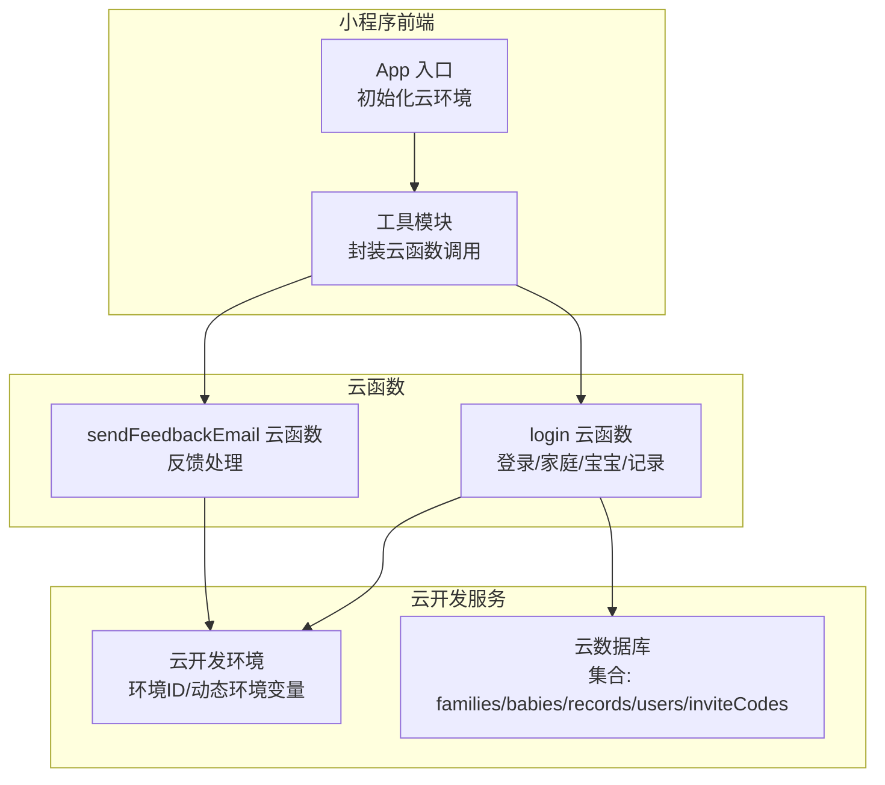
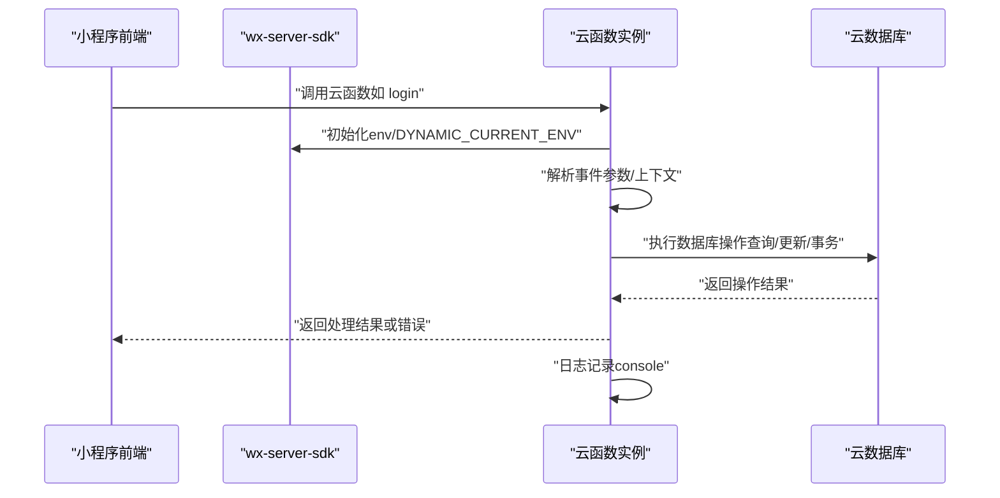
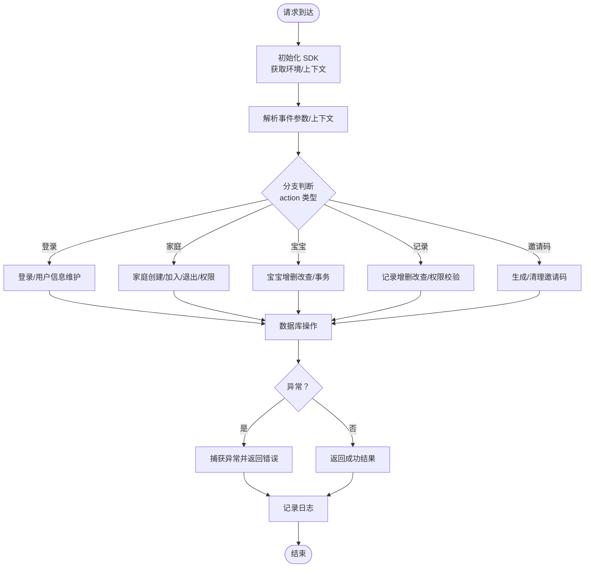
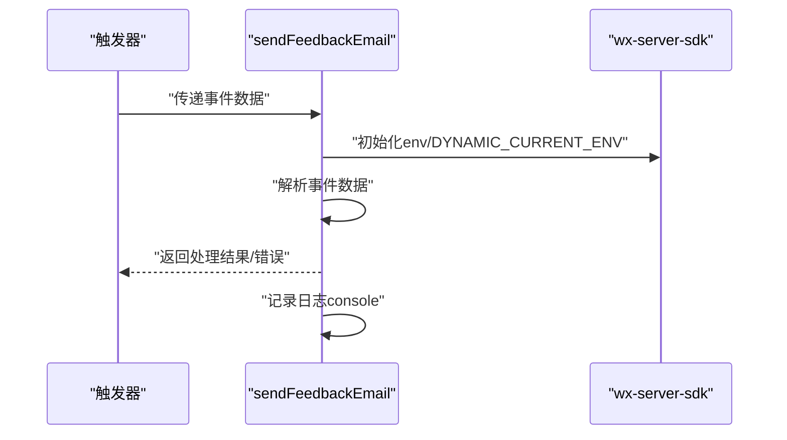
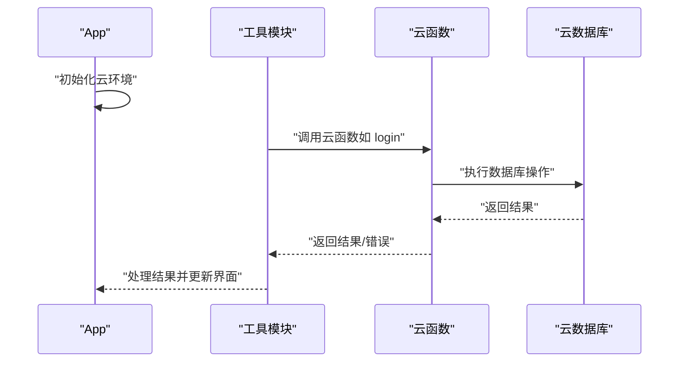
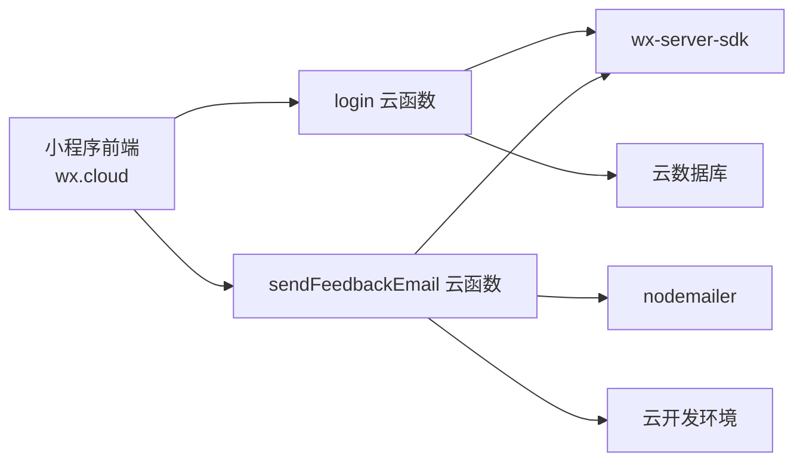

# 生命周期管理

<cite>
**本文引用的文件**
- [cloudfunctions/login/index.js](file://cloudfunctions/login/index.js)
- [cloudfunctions/sendFeedbackEmail/index.js](file://cloudfunctions/sendFeedbackEmail/index.js)
- [cloudfunctions/login/package.json](file://cloudfunctions/login/package.json)
- [cloudfunctions/sendFeedbackEmail/package.json](file://cloudfunctions/sendFeedbackEmail/package.json)
- [miniprogram/app.js](file://miniprogram/app.js)
- [miniprogram/utils/api.js](file://miniprogram/utils/api.js)
- [uploadCloudFunction.sh](file://uploadCloudFunction.sh)
- [README.md](file://README.md)
</cite>

## 目录
1. [简介](#简介)
2. [项目结构](#项目结构)
3. [核心组件](#核心组件)
4. [架构总览](#架构总览)
5. [详细组件分析](#详细组件分析)
6. [依赖关系分析](#依赖关系分析)
7. [性能考虑](#性能考虑)
8. [故障排查指南](#故障排查指南)
9. [结论](#结论)
10. [附录](#附录)

## 简介
本文件围绕云函数生命周期管理展开，结合项目中的云函数实现，系统阐述启动流程（初始化配置、环境变量加载、依赖注入）、执行超时与异常处理、内存管理策略、停止与重启机制，以及生命周期监控与调试方法。文档以“登录与家庭/宝宝管理”云函数为核心案例，辅以小程序前端调用链路，帮助读者全面理解云函数在实际业务场景下的生命周期行为。

## 项目结构
该项目采用“小程序前端 + 云函数”的典型架构。云函数位于 cloudfunctions 目录下，包含登录与家庭/宝宝管理的云函数，以及一个简单的反馈邮件云函数。小程序前端通过 wx.cloud.callFunction 调用云函数，实现用户登录、家庭管理、宝宝管理、记录管理等功能。

图示来源
- [miniprogram/app.js:1-56](file://miniprogram/app.js#L1-L56)
- [miniprogram/utils/api.js:1-879](file://miniprogram/utils/api.js#L1-L879)
- [cloudfunctions/login/index.js:1-814](file://cloudfunctions/login/index.js#L1-L814)
- [cloudfunctions/sendFeedbackEmail/index.js:1-21](file://cloudfunctions/sendFeedbackEmail/index.js#L1-L21)

章节来源
- [README.md:77-103](file://README.md#L77-L103)
- [miniprogram/app.js:1-56](file://miniprogram/app.js#L1-L56)
- [miniprogram/utils/api.js:1-879](file://miniprogram/utils/api.js#L1-L879)

## 核心组件
- 登录与家庭/宝宝/记录管理云函数：负责用户登录、家庭创建/加入/退出、成员权限管理、宝宝信息维护、记录增删改查、邀请码生成与清理等。
- 反馈邮件云函数：接收前端触发的反馈数据，当前返回成功占位，便于后续扩展。
- 小程序前端：在 App 初始化阶段完成云环境初始化；通过工具模块封装云函数调用，统一处理登录等待、权限校验与错误处理。

章节来源
- [cloudfunctions/login/index.js:1-814](file://cloudfunctions/login/index.js#L1-L814)
- [cloudfunctions/sendFeedbackEmail/index.js:1-21](file://cloudfunctions/sendFeedbackEmail/index.js#L1-L21)
- [miniprogram/app.js:1-56](file://miniprogram/app.js#L1-L56)
- [miniprogram/utils/api.js:1-879](file://miniprogram/utils/api.js#L1-L879)

## 架构总览
云函数生命周期由“请求触发 → 初始化 → 业务处理 → 返回结果/异常 → 日志输出/资源释放”构成。小程序端通过 wx.cloud.callFunction 触发云函数，云函数内部使用 wx-server-sdk 完成初始化与上下文获取，随后执行具体业务逻辑并访问云数据库。

图示来源
- [cloudfunctions/login/index.js:1-814](file://cloudfunctions/login/index.js#L1-L814)
- [miniprogram/utils/api.js:1-879](file://miniprogram/utils/api.js#L1-L879)

## 详细组件分析

### 登录与家庭/宝宝/记录管理云函数（生命周期）
- 启动与初始化
  - 云函数入口文件引入 wx-server-sdk 并进行初始化，使用动态环境变量，确保在不同环境下正确连接对应云开发环境。
  - 通过上下文获取用户标识，为后续权限校验与数据操作提供依据。
- 业务处理
  - 支持多种 action 分支，覆盖登录、家庭管理、宝宝管理、记录管理、权限变更、邀请码生成与清理等。
  - 对关键操作使用数据库事务保证一致性（如删除宝宝）。
- 超时与异常处理
  - 云函数执行过程中对异常进行捕获并返回结构化错误信息，避免进程崩溃。
  - 前端侧对云函数调用设置了最大等待时间，防止长时间阻塞。
- 资源清理
  - 云函数内部未显式声明资源句柄，遵循云函数无状态模型，执行结束后由平台回收。
  - 异步清理任务（如邀请码清理）在后台异步执行，不阻塞主流程。
- 日志与监控
  - 云函数内使用 console 输出日志，便于在云开发控制台查看。
  - 前端调用侧对错误进行统一处理与提示。

图示来源
- [cloudfunctions/login/index.js:1-814](file://cloudfunctions/login/index.js#L1-L814)

章节来源
- [cloudfunctions/login/index.js:1-814](file://cloudfunctions/login/index.js#L1-L814)
- [miniprogram/utils/api.js:13-41](file://miniprogram/utils/api.js#L13-L41)

### 反馈邮件云函数（生命周期）
- 启动与初始化
  - 同样使用 wx-server-sdk 初始化，接入动态环境变量。
- 业务处理
  - 从触发器事件中读取反馈数据，当前直接返回成功占位，便于后续扩展邮件发送逻辑。
- 超时与异常处理
  - 对异常进行捕获并返回结构化错误信息，避免影响调用方。
- 资源清理
  - 无显式资源句柄，遵循云函数无状态模型。
- 日志与监控
  - 使用 console 输出日志，便于定位问题。

图示来源
- [cloudfunctions/sendFeedbackEmail/index.js:1-21](file://cloudfunctions/sendFeedbackEmail/index.js#L1-L21)

章节来源
- [cloudfunctions/sendFeedbackEmail/index.js:1-21](file://cloudfunctions/sendFeedbackEmail/index.js#L1-L21)

### 小程序前端调用链（生命周期衔接）
- App 初始化
  - 在 App.onLaunch 中初始化云环境，设置环境 ID 并开启 traceUser。
- 云函数调用
  - 工具模块封装了大量云函数调用，统一处理登录等待、权限校验与错误处理。
  - 对云函数调用设置了最大等待时间，防止长时间阻塞。
- 生命周期衔接
  - 小程序前端负责触发云函数，云函数负责业务处理与数据库交互，二者通过 wx.cloud.callFunction 协作。

图示来源
- [miniprogram/app.js:1-56](file://miniprogram/app.js#L1-L56)
- [miniprogram/utils/api.js:1-879](file://miniprogram/utils/api.js#L1-L879)

章节来源
- [miniprogram/app.js:1-56](file://miniprogram/app.js#L1-L56)
- [miniprogram/utils/api.js:1-879](file://miniprogram/utils/api.js#L1-L879)

## 依赖关系分析
- 云函数依赖
  - login 云函数依赖 wx-server-sdk，用于初始化与数据库操作。
  - sendFeedbackEmail 云函数依赖 wx-server-sdk 与 nodemailer（用于邮件发送，当前占位）。
- 前端依赖
  - 小程序前端依赖 wx.cloud 提供的云开发能力，通过 wx.cloud.callFunction 调用云函数。
- 部署与环境
  - 通过脚本进行云函数部署，使用环境 ID 与项目路径参数。

图示来源
- [cloudfunctions/login/package.json:1-16](file://cloudfunctions/login/package.json#L1-L16)
- [cloudfunctions/sendFeedbackEmail/package.json:1-16](file://cloudfunctions/sendFeedbackEmail/package.json#L1-L16)
- [miniprogram/utils/api.js:1-879](file://miniprogram/utils/api.js#L1-L879)

章节来源
- [cloudfunctions/login/package.json:1-16](file://cloudfunctions/login/package.json#L1-L16)
- [cloudfunctions/sendFeedbackEmail/package.json:1-16](file://cloudfunctions/sendFeedbackEmail/package.json#L1-L16)
- [miniprogram/utils/api.js:1-879](file://miniprogram/utils/api.js#L1-L879)

## 性能考虑
- 执行超时与异常处理
  - 云函数内部对异常进行捕获并返回结构化错误，避免进程崩溃导致的资源泄漏。
  - 前端侧设置了最大等待时间，防止长时间阻塞。
- 内存管理
  - 云函数遵循无状态模型，执行结束后由平台回收资源，避免长期持有大对象。
  - 对于批量清理任务（如邀请码），采用异步方式执行，不阻塞主流程。
- 数据库访问
  - 对关键操作使用事务保证一致性，减少重复查询与不必要的写入。
  - 合理使用排序与过滤条件，降低数据库压力。

章节来源
- [cloudfunctions/login/index.js:1-814](file://cloudfunctions/login/index.js#L1-L814)
- [miniprogram/utils/api.js:13-41](file://miniprogram/utils/api.js#L13-L41)

## 故障排查指南
- 日志记录
  - 云函数内使用 console 输出日志，可在云开发控制台查看。
  - 前端调用侧对错误进行统一处理与提示，便于定位问题。
- 常见问题
  - 云函数调用超时：检查前端等待时间设置与网络状况。
  - 权限不足：确认用户在家庭中的权限等级与操作范围。
  - 数据库异常：查看云数据库返回的错误信息，确认集合与字段是否存在。
- 调试建议
  - 使用云开发控制台的“云函数调试”功能，逐步定位问题。
  - 在云函数中增加更详细的日志输出，区分正常与异常路径。

章节来源
- [cloudfunctions/login/index.js:1-814](file://cloudfunctions/login/index.js#L1-L814)
- [miniprogram/utils/api.js:1-879](file://miniprogram/utils/api.js#L1-L879)

## 结论
本项目通过小程序前端与云函数的协同，实现了完整的用户登录、家庭/宝宝/记录管理等核心业务。云函数遵循无状态模型，具备良好的可维护性与可扩展性。通过合理的异常处理、日志记录与前端等待机制，能够有效提升系统的稳定性与用户体验。后续可在云函数中进一步完善超时阈值配置、资源清理策略与监控指标采集，以满足更高性能与可靠性需求。

## 附录
- 部署脚本
  - 通过脚本进行云函数部署，指定环境 ID 与项目路径参数。
- 项目结构参考
  - 云函数目录与小程序前端目录结构清晰，便于维护与扩展。

章节来源
- [uploadCloudFunction.sh:1-1](file://uploadCloudFunction.sh#L1-L1)
- [README.md:77-103](file://README.md#L77-L103)