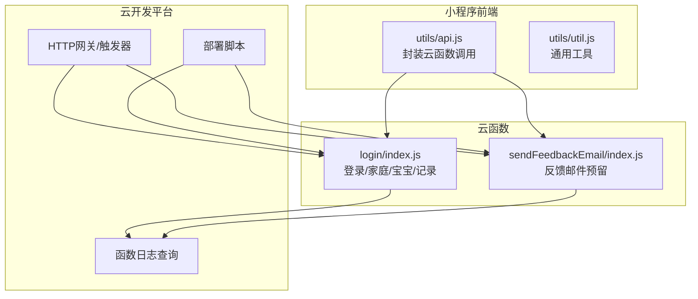
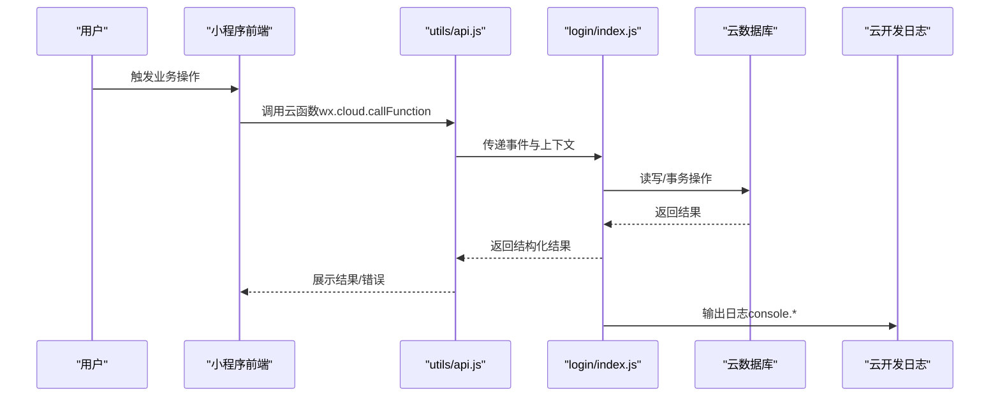
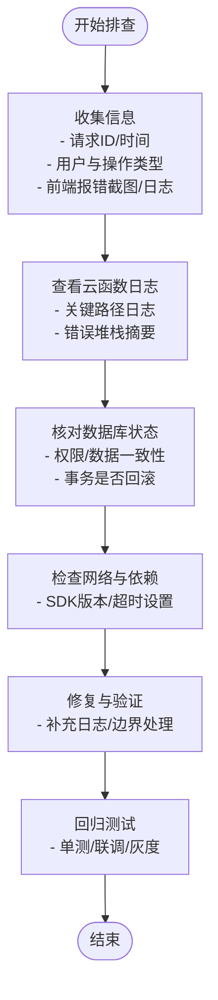
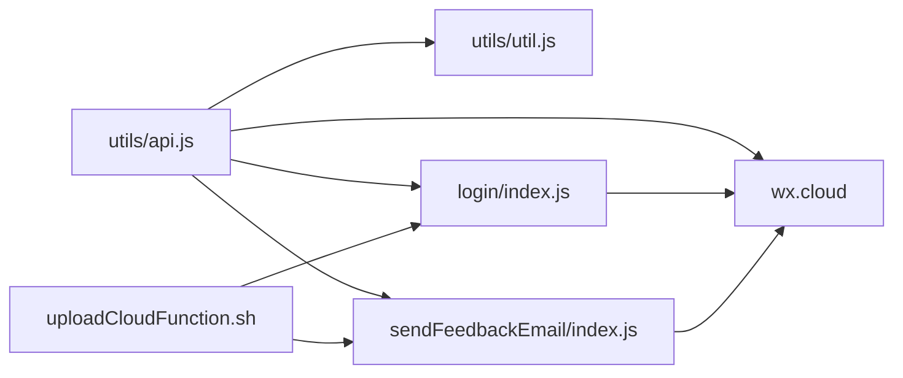

# 调试与监控

<cite>
**本文引用的文件**   
- [README.md](file://README.md)
- [cloudfunctions/login/index.js](file://cloudfunctions/login/index.js)
- [cloudfunctions/sendFeedbackEmail/index.js](file://cloudfunctions/sendFeedbackEmail/index.js)
- [cloudfunctions/login/package.json](file://cloudfunctions/login/package.json)
- [cloudfunctions/sendFeedbackEmail/package.json](file://cloudfunctions/sendFeedbackEmail/package.json)
- [miniprogram/utils/api.js](file://miniprogram/utils/api.js)
- [miniprogram/utils/util.js](file://miniprogram/utils/util.js)
- [uploadCloudFunction.sh](file://uploadCloudFunction.sh)
</cite>

## 目录
1. [简介](#简介)
2. [项目结构](#项目结构)
3. [核心组件](#核心组件)
4. [架构总览](#架构总览)
5. [详细组件分析](#详细组件分析)
6. [依赖分析](#依赖分析)
7. [性能考虑](#性能考虑)
8. [故障排查指南](#故障排查指南)
9. [结论](#结论)
10. [附录](#附录)

## 简介
本文件面向“云函数调试与监控”，围绕日志记录、性能分析、错误追踪、实时监控工具、调试技巧与故障排查流程展开，结合项目现有云函数与小程序前端调用链路，给出可落地的实践建议与可视化图示。

## 项目结构
项目采用“小程序前端 + 云函数”的分层架构：
- 小程序前端通过云函数调用实现用户登录、家庭与宝宝管理、记录增删改查等业务。
- 云函数负责权限校验、事务处理、数据库读写与外部服务对接（如后续扩展的邮件发送）。
- 云开发提供云函数部署、日志查询、网关访问等运维能力。

**图表来源**
- [cloudfunctions/login/index.js:1-814](file://cloudfunctions/login/index.js#L1-L814)
- [cloudfunctions/sendFeedbackEmail/index.js:1-21](file://cloudfunctions/sendFeedbackEmail/index.js#L1-L21)
- [miniprogram/utils/api.js:1-879](file://miniprogram/utils/api.js#L1-L879)
- [miniprogram/utils/util.js:1-55](file://miniprogram/utils/util.js#L1-L55)
- [uploadCloudFunction.sh:1-1](file://uploadCloudFunction.sh#L1-L1)

**章节来源**
- [README.md: 77-103:77-103](file://README.md#L77-L103)

## 核心组件
- 登录与业务云函数（login/index.js）：集中处理用户登录、家庭管理、宝宝管理、记录管理、权限校验、事务与邀请码等。
- 反馈邮件云函数（sendFeedbackEmail/index.js）：预留邮件发送能力，当前仅记录日志并返回结果。
- 小程序API封装（utils/api.js）：统一调用云函数，包含错误日志与重试等待逻辑。
- 工具函数（utils/util.js）：年龄计算、格式化等辅助能力。
- 部署脚本（uploadCloudFunction.sh）：提供云函数批量部署命令模板。

**章节来源**
- [cloudfunctions/login/index.js: 22-L814:22-814](file://cloudfunctions/login/index.js#L22-L814)
- [cloudfunctions/sendFeedbackEmail/index.js: 7-L21:7-21](file://cloudfunctions/sendFeedbackEmail/index.js#L7-L21)
- [miniprogram/utils/api.js: 1-L879:1-879](file://miniprogram/utils/api.js#L1-L879)
- [miniprogram/utils/util.js: 1-L55:1-55](file://miniprogram/utils/util.js#L1-L55)
- [uploadCloudFunction.sh: 1-L1:1-1](file://uploadCloudFunction.sh#L1-L1)

## 架构总览
云函数调用链路与日志落点如下：

**图表来源**
- [miniprogram/utils/api.js: 44-L111:44-111](file://miniprogram/utils/api.js#L44-L111)
- [cloudfunctions/login/index.js: 22-L814:22-814](file://cloudfunctions/login/index.js#L22-L814)

## 详细组件分析

### 日志记录机制
- 日志输出位置
  - 云函数内使用标准输出接口记录日志，便于在云开发控制台查看函数日志。
  - 示例：在反馈云函数中记录输入数据与错误信息；在登录云函数中对关键路径进行告警式输出。
- 日志级别与格式规范
  - 建议采用结构化日志字段（如请求ID、用户标识、操作类型、耗时、状态），便于检索与聚合。
  - 建议统一格式：包含时间戳、级别、模块、消息体、附加上下文。
- 输出位置建议
  - 云函数日志：云开发控制台“云函数”->“日志”。
  - 若需持久化与集中分析，可接入第三方日志服务（如SaaS平台）或导出至对象存储后由日志系统消费。

**章节来源**
- [cloudfunctions/sendFeedbackEmail/index.js: 12-L19:12-19](file://cloudfunctions/sendFeedbackEmail/index.js#L12-L19)
- [cloudfunctions/login/index.js: 344-L368:344-368](file://cloudfunctions/login/index.js#L344-L368)

### 性能分析方法
- 执行时间监控
  - 在云函数入口与关键节点打点，记录开始/结束时间，计算耗时并输出到日志。
  - 可结合云开发“函数耗时”指标进行对比分析。
- 内存使用分析
  - 关注大对象序列化、数组/字符串拼接、循环中重复创建临时对象等热点。
  - 对批量操作使用分批处理，避免一次性加载过多数据。
- 并发处理能力
  - 控制并发度，避免高并发下数据库锁竞争与超时。
  - 对幂等性敏感的操作（如删除、更新）应做去重与重试控制。

**章节来源**
- [cloudfunctions/login/index.js: 485-L507:485-507](file://cloudfunctions/login/index.js#L485-L507)

### 错误追踪策略
- 异常捕获
  - 云函数与前端均需使用 try/catch 包裹异步调用，保证错误不冒泡导致进程崩溃。
- 错误分类
  - 参数类错误、权限类错误、业务规则错误、系统/网络错误等，分别记录不同标签以便统计。
- 错误报告
  - 前端统一收集错误并上报（可选），云函数侧输出结构化错误日志，包含请求ID、用户ID、错误码与堆栈摘要。

**章节来源**
- [miniprogram/utils/api.js: 44-L111:44-111](file://miniprogram/utils/api.js#L44-L111)
- [cloudfunctions/login/index.js: 26-L510:26-510](file://cloudfunctions/login/index.js#L26-L510)

### 实时监控工具
- 云开发控制台
  - 函数日志：查询函数执行日志、定位异常。
  - 函数指标：查看调用量、错误率、平均耗时、峰值并发。
  - HTTP网关与触发器：确认访问方式与触发条件。
- 第三方监控服务（建议）
  - 结合结构化日志与指标，接入SaaS日志/监控平台，设置告警与仪表盘。
- 自定义监控指标
  - 在云函数中输出关键指标（如耗时、错误数、业务量），并在控制台或第三方平台建立看板。

**章节来源**
- [.agents\skills\cloudbase\references\cloud-functions\SKILL.md: 693-L737:693-737](file://.agents/skills/cloudbase/references/cloud-functions/SKILL.md#L693-L737)

### 调试技巧与工具
- 本地调试
  - 使用云开发提供的本地调试工具与模拟器，配合断点与变量观察。
- 远程调试
  - 在云开发控制台启用“在线调试”，直接查看日志与调用详情。
- 断点调试
  - 在关键分支与循环处插入日志，逐步缩小范围；对复杂事务（如删除宝宝）增加前置校验日志。
- 前端联调
  - 在小程序端打印请求参数与返回结果，结合云函数日志交叉验证。

**章节来源**
- [miniprogram/utils/api.js: 14-L41:14-41](file://miniprogram/utils/api.js#L14-L41)
- [cloudfunctions/login/index.js: 22-L814:22-814](file://cloudfunctions/login/index.js#L22-L814)

### 故障排查流程

**图表来源**
- [cloudfunctions/login/index.js: 26-L510:26-510](file://cloudfunctions/login/index.js#L26-L510)
- [miniprogram/utils/api.js: 44-L111:44-111](file://miniprogram/utils/api.js#L44-L111)

## 依赖分析
- 云函数依赖
  - 登录云函数依赖云开发SDK，负责数据库读写与事务。
  - 反馈邮件云函数预留依赖（如邮件客户端），当前仅作日志记录。
- 前端依赖
  - utils/api.js 依赖 wx.cloud 与本地工具函数 util.js。
- 部署与运维
  - uploadCloudFunction.sh 提供部署命令模板，便于批量部署。

**图表来源**
- [miniprogram/utils/api.js: 1-L879:1-879](file://miniprogram/utils/api.js#L1-L879)
- [miniprogram/utils/util.js: 1-L55:1-55](file://miniprogram/utils/util.js#L1-L55)
- [cloudfunctions/login/package.json: 12-L14:12-14](file://cloudfunctions/login/package.json#L12-L14)
- [cloudfunctions/sendFeedbackEmail/package.json: 9-L12:9-12](file://cloudfunctions/sendFeedbackEmail/package.json#L9-L12)
- [uploadCloudFunction.sh: 1-L1:1-1](file://uploadCloudFunction.sh#L1-L1)

**章节来源**
- [cloudfunctions/login/package.json: 12-L14:12-14](file://cloudfunctions/login/package.json#L12-L14)
- [cloudfunctions/sendFeedbackEmail/package.json: 9-L12:9-12](file://cloudfunctions/sendFeedbackEmail/package.json#L9-L12)
- [miniprogram/utils/api.js: 1-L879:1-879](file://miniprogram/utils/api.js#L1-L879)

## 性能考虑
- 事务与一致性
  - 删除宝宝涉及多表联动，已在云函数中使用事务保障一致性，建议在日志中标注事务开始/结束与关键步骤耗时。
- 查询与排序
  - 大查询前加索引与筛选条件，避免全表扫描；对排序字段建立复合索引。
- 并发与锁
  - 高并发场景下，减少长事务与热点数据写入；对批量写入采用分批与幂等策略。
- 前端体验
  - 对耗时操作提供骨架屏与进度提示，降低感知延迟。

**章节来源**
- [cloudfunctions/login/index.js: 485-L507:485-507](file://cloudfunctions/login/index.js#L485-L507)
- [miniprogram/utils/util.js: 1-L55:1-55](file://miniprogram/utils/util.js#L1-L55)

## 故障排查指南
- 常见问题与定位
  - 权限不足：检查用户在家庭中的角色与操作范围；查看云函数中权限判断日志。
  - 数据不存在：核对查询条件与文档ID；确认事务是否正确回滚。
  - 超时与并发：查看函数耗时与并发峰值，优化查询与分批处理。
- 建议流程
  - 收集请求ID与时间 -> 查看云函数日志 -> 核对数据库状态 -> 检查网络与SDK -> 修复与回归测试。

**章节来源**
- [cloudfunctions/login/index.js: 26-L510:26-510](file://cloudfunctions/login/index.js#L26-L510)
- [miniprogram/utils/api.js: 44-L111:44-111](file://miniprogram/utils/api.js#L44-L111)

## 结论
通过结构化日志、统一错误处理、关键路径性能打点与第三方监控集成，可显著提升云函数的可观测性与稳定性。建议在现有基础上补充：
- 在云函数中输出结构化字段（请求ID、用户ID、耗时、状态）。
- 对高风险路径（事务、批量操作）增加更细粒度日志与指标。
- 在前端统一错误上报与埋点，形成端到端的可观测闭环。

## 附录
- 部署与运维
  - 使用部署脚本模板进行批量部署，确保环境一致。
- 参考资料
  - 云函数日志与HTTP访问、触发器管理参考文档。

**章节来源**
- [uploadCloudFunction.sh: 1-L1:1-1](file://uploadCloudFunction.sh#L1-L1)
- [.agents\skills\cloudbase\references\cloud-functions\SKILL.md: 693-L737:693-737](file://.agents/skills/cloudbase/references/cloud-functions/SKILL.md#L693-L737)