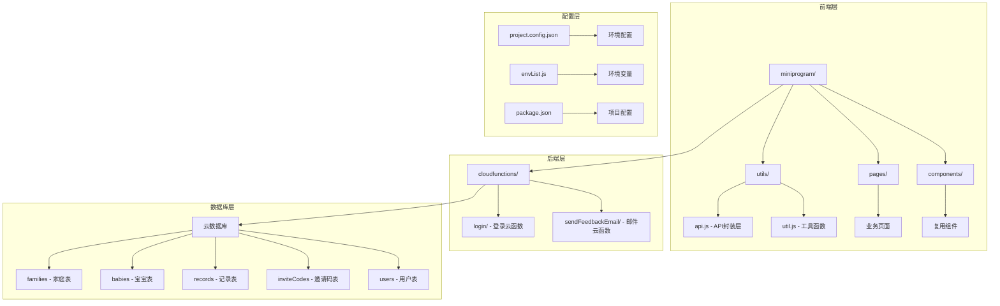
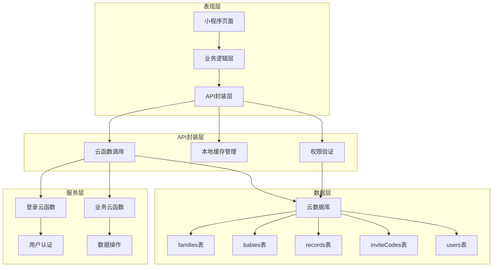
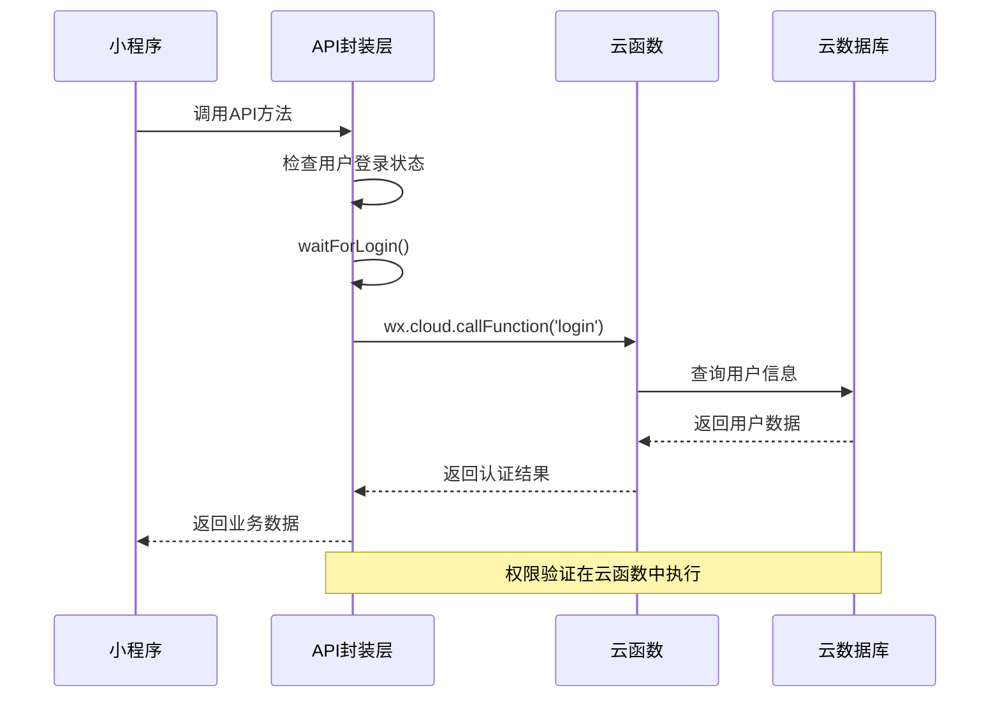
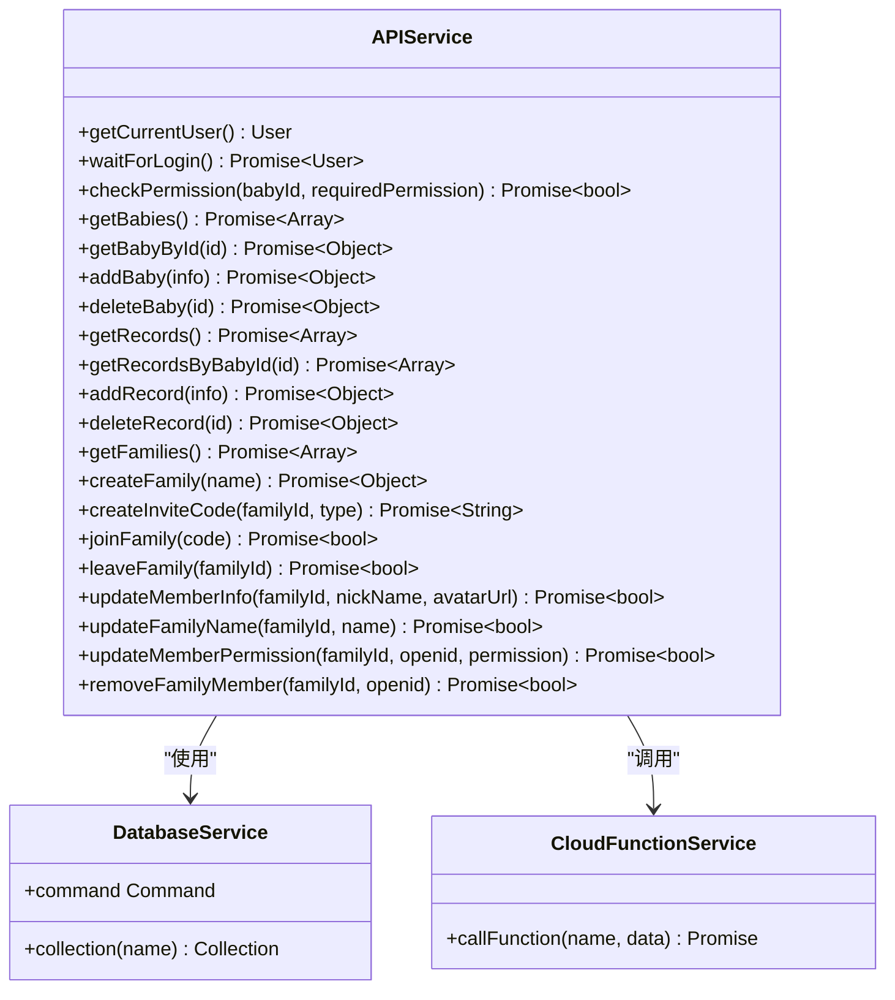
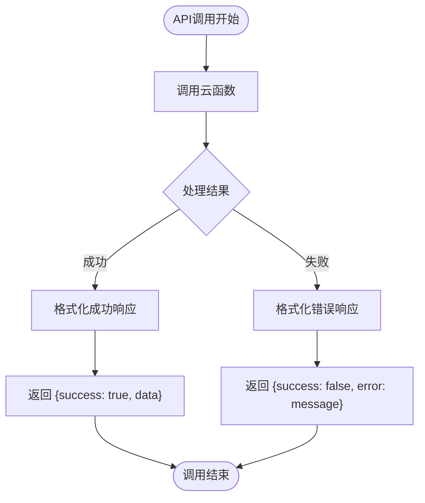
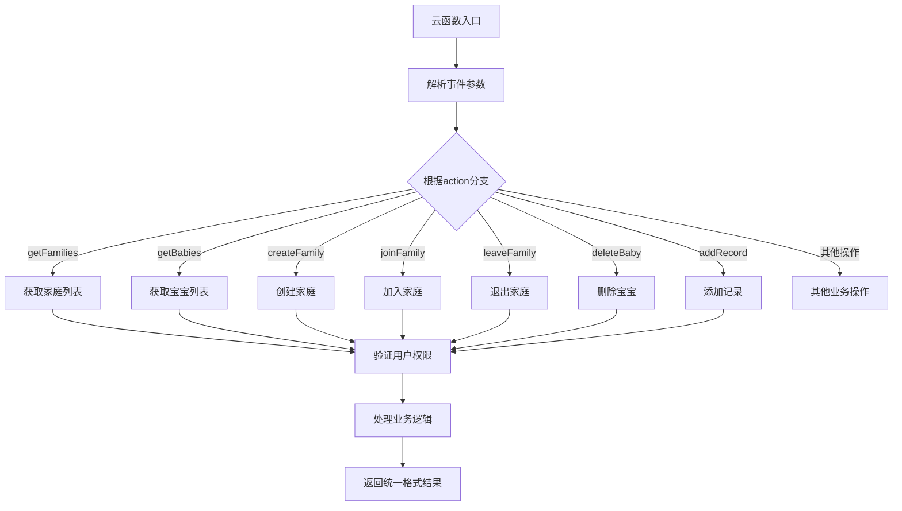
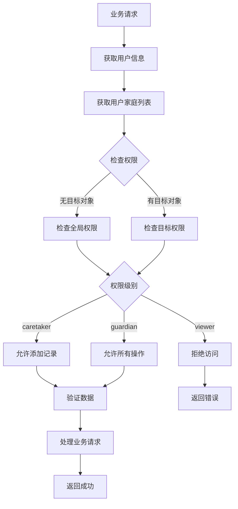
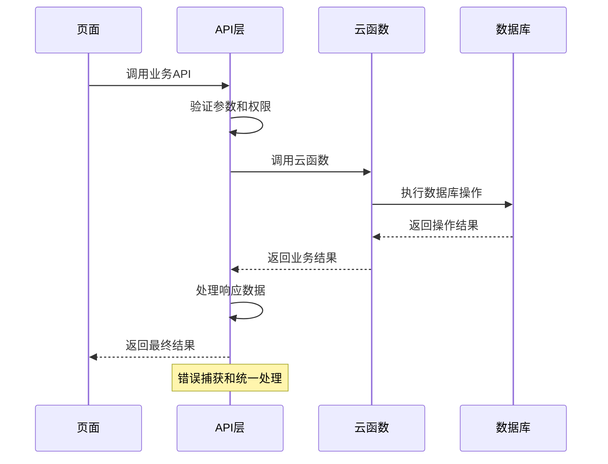
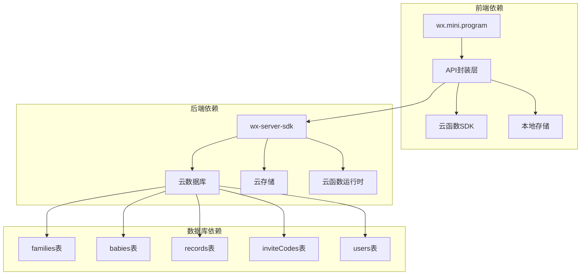
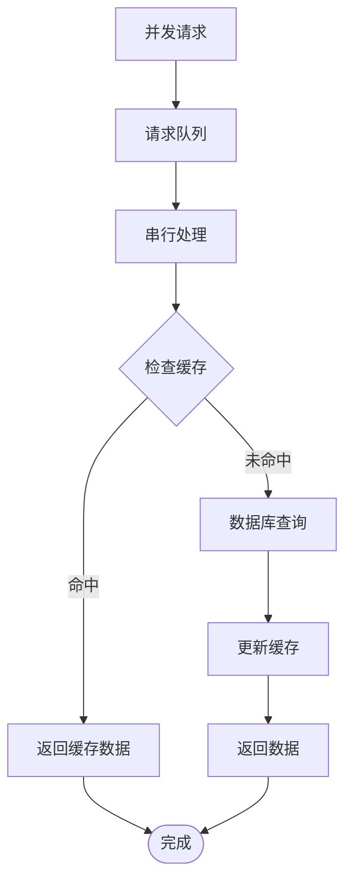

# API设计模式

<cite>
**本文档引用的文件**
- [api.js](file://miniprogram/utils/api.js)
- [login/index.js](file://cloudfunctions/login/index.js)
- [sendFeedbackEmail/index.js](file://cloudfunctions/sendFeedbackEmail/index.js)
- [app.js](file://miniprogram/app.js)
- [envList.js](file://miniprogram/envList.js)
- [baby-add.js](file://miniprogram/pages/baby-add/baby-add.js)
- [record-add.js](file://miniprogram/pages/record-add/record-add.js)
- [family.js](file://miniprogram/pages/family/family.js)
- [package.json](file://package.json)
- [login/package.json](file://cloudfunctions/login/package.json)
</cite>

## 目录
1. [简介](#简介)
2. [项目结构](#项目结构)
3. [核心组件](#核心组件)
4. [架构概览](#架构概览)
5. [详细组件分析](#详细组件分析)
6. [依赖关系分析](#依赖关系分析)
7. [性能考虑](#性能考虑)
8. [故障排除指南](#故障排除指南)
9. [结论](#结论)

## 简介

本项目是一个基于微信小程序的宝宝成长记录管理系统，采用前后端分离的架构设计。后端使用微信云开发的云函数作为统一API接口，前端通过wx.cloud.callFunction调用云函数实现统一的API设计模式。

该API设计模式的核心特点包括：
- 统一的认证流程和权限验证机制
- 前后端分离的数据访问控制
- 家庭化管理模式下的多用户协作
- 完整的错误处理和用户体验优化

## 项目结构

项目采用模块化的文件组织方式，主要分为以下几个层次：

**图表来源**
- [api.js:1-879](file://miniprogram/utils/api.js#L1-L879)
- [login/index.js:1-814](file://cloudfunctions/login/index.js#L1-L814)

**章节来源**
- [api.js:1-879](file://miniprogram/utils/api.js#L1-L879)
- [login/index.js:1-814](file://cloudfunctions/login/index.js#L1-L814)

## 核心组件

### API封装层设计

API封装层位于`miniprogram/utils/api.js`，提供了统一的业务API接口，主要包含以下功能模块：

#### 认证与用户管理
- `getCurrentUser()`: 获取当前用户信息
- `waitForLogin()`: 等待登录完成的异步处理
- `checkPermission()`: 权限验证机制

#### 宝宝管理API
- `getBabies()`: 获取用户所有宝宝列表
- `getBabyById()`: 根据ID获取宝宝详情
- `addBaby()`: 添加新宝宝
- `deleteBaby()`: 删除宝宝（支持事务）

#### 记录管理API
- `getRecords()`: 获取所有记录
- `getRecordsByBabyId()`: 获取指定宝宝的所有记录
- `getLatestRecord()`: 获取最新记录
- `addRecord()`: 添加成长记录
- `deleteRecord()`: 删除记录

#### 家庭管理API
- `getFamilies()`: 获取用户所有家庭
- `getFamilyById()`: 获取指定家庭详情
- `createFamily()`: 创建新家庭
- `createInviteCode()`: 生成邀请码
- `joinFamily()`: 加入家庭
- `leaveFamily()`: 退出家庭
- `updateMemberInfo()`: 更新成员信息
- `updateFamilyName()`: 更新家庭名称
- `updateMemberPermission()`: 更新成员权限
- `removeFamilyMember()`: 移除成员

**章节来源**
- [api.js:1-879](file://miniprogram/utils/api.js#L1-L879)

## 架构概览

系统采用三层架构设计，实现了严格的职责分离：

**图表来源**
- [api.js:1-879](file://miniprogram/utils/api.js#L1-L879)
- [login/index.js:1-814](file://cloudfunctions/login/index.js#L1-L814)

### 统一认证流程

系统实现了完整的用户认证和权限管理体系：

**图表来源**
- [app.js:28-54](file://miniprogram/app.js#L28-L54)
- [api.js:14-41](file://miniprogram/utils/api.js#L14-L41)

## 详细组件分析

### API封装层架构

API封装层采用了模块化设计，每个业务模块都有独立的函数集合：

**图表来源**
- [api.js:1-879](file://miniprogram/utils/api.js#L1-L879)

#### 请求参数格式规范

所有API调用都遵循统一的参数格式：

| 参数 | 类型 | 必填 | 描述 |
|------|------|------|------|
| action | String | 是 | 云函数操作类型 |
| code | String | 部分场景 | 微信登录code |
| babyId | String | 部分场景 | 宝宝ID |
| familyId | String | 部分场景 | 家庭ID |
| recordId | String | 部分场景 | 记录ID |
| memberInfo | Object | 部分场景 | 成员信息对象 |
| inviteCode | String | 部分场景 | 邀请码 |
| memberType | String | 部分场景 | 成员类型 |

#### 响应数据结构

API响应采用统一的成功/失败模式：

**图表来源**
- [login/index.js:22-800](file://cloudfunctions/login/index.js#L22-L800)

**章节来源**
- [api.js:58-110](file://miniprogram/utils/api.js#L58-L110)
- [login/index.js:22-800](file://cloudfunctions/login/index.js#L22-L800)

### 云函数设计模式

云函数作为统一的后端接口，实现了严格的数据访问控制和业务逻辑处理：

#### 登录云函数架构

**图表来源**
- [login/index.js:22-800](file://cloudfunctions/login/index.js#L22-L800)

#### 权限验证机制

系统实现了多层次的权限控制：

**图表来源**
- [api.js:782-852](file://miniprogram/utils/api.js#L782-L852)
- [login/index.js:154-184](file://cloudfunctions/login/index.js#L154-L184)

**章节来源**
- [login/index.js:22-800](file://cloudfunctions/login/index.js#L22-L800)
- [api.js:782-852](file://miniprogram/utils/api.js#L782-L852)

### 错误处理机制

系统实现了完善的错误处理策略：

#### 前端错误处理

#### 后端错误处理

云函数内部实现了详细的错误处理：

| 错误类型 | 触发条件 | 处理方式 |
|----------|----------|----------|
| 参数验证错误 | 缺少必要参数 | 抛出具体错误信息 |
| 权限不足 | 用户权限不够 | 返回权限错误 |
| 数据不存在 | 查询不到目标数据 | 返回不存在错误 |
| 业务逻辑错误 | 违反业务规则 | 返回业务错误 |
| 数据库错误 | 数据库操作失败 | 返回数据库错误 |

**章节来源**
- [api.js:14-41](file://miniprogram/utils/api.js#L14-L41)
- [login/index.js:22-800](file://cloudfunctions/login/index.js#L22-L800)

## 依赖关系分析

### 技术栈依赖

**图表来源**
- [api.js:1-879](file://miniprogram/utils/api.js#L1-L879)
- [login/package.json:12-14](file://cloudfunctions/login/package.json#L12-L14)

### 模块间耦合度分析

系统采用了低耦合的设计原则：

| 模块 | 耦合对象 | 耦合程度 | 说明 |
|------|----------|----------|------|
| API封装层 | 云函数 | 低 | 通过统一接口调用 |
| 页面层 | API封装层 | 中 | 业务逻辑依赖API |
| 云函数 | 数据库 | 高 | 直接数据操作 |
| 工具函数 | 业务模块 | 低 | 纯函数无副作用 |

**章节来源**
- [api.js:1-879](file://miniprogram/utils/api.js#L1-L879)
- [login/index.js:1-814](file://cloudfunctions/login/index.js#L1-L814)

## 性能考虑

### 缓存策略

系统实现了多层次的缓存机制：

1. **本地存储缓存**：用户信息和常用数据缓存
2. **数据库查询优化**：使用索引和批量查询
3. **云函数缓存**：热点数据的临时缓存

### 并发控制

### 错误恢复机制

系统具备完善的错误恢复能力：

- 自动重试机制
- 降级处理策略
- 用户友好的错误提示
- 日志记录和监控

## 故障排除指南

### 常见问题及解决方案

#### 登录相关问题

| 问题描述 | 可能原因 | 解决方案 |
|----------|----------|----------|
| 登录超时 | 网络延迟或服务器繁忙 | 增加等待时间或重试机制 |
| 用户信息缺失 | 云函数异常 | 检查云函数日志和数据库连接 |
| 权限验证失败 | 用户权限不足 | 检查用户在家庭中的角色 |

#### 数据操作问题

| 问题描述 | 可能原因 | 解决方案 |
|----------|----------|----------|
| 数据库操作失败 | 网络中断或权限不足 | 检查网络连接和权限设置 |
| 数据同步问题 | 并发写入冲突 | 使用事务或乐观锁机制 |
| 查询性能问题 | 缺少索引或查询条件不当 | 优化查询语句和添加索引 |

#### 云函数调用问题

| 问题描述 | 可能原因 | 解决方案 |
|----------|----------|----------|
| 调用超时 | 云函数执行时间过长 | 优化云函数逻辑或拆分任务 |
| 内存溢出 | 处理大数据集 | 分批处理或使用流式处理 |
| 资源限制 | 超出配额限制 | 优化资源使用或升级套餐 |

**章节来源**
- [api.js:14-41](file://miniprogram/utils/api.js#L14-L41)
- [login/index.js:22-800](file://cloudfunctions/login/index.js#L22-L800)

## 结论

本项目的API设计模式体现了现代Web应用的最佳实践，通过前后端分离、统一认证、权限控制和错误处理等机制，构建了一个稳定可靠的宝宝成长记录管理系统。

### 设计优势

1. **统一性**：通过API封装层实现了统一的接口设计
2. **安全性**：云函数中的权限验证确保了数据安全
3. **可扩展性**：模块化设计便于功能扩展和维护
4. **用户体验**：完善的错误处理和提示机制

### 改进建议

1. **监控体系**：增加API调用监控和性能分析
2. **测试覆盖**：完善单元测试和集成测试
3. **文档完善**：补充详细的API文档和使用示例
4. **安全加固**：增加数据加密和防注入措施

该API设计模式为类似的家庭管理类应用提供了良好的参考模板，其设计理念和实现方式值得在其他项目中借鉴和应用。