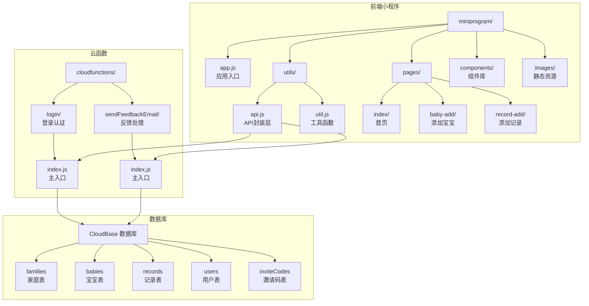
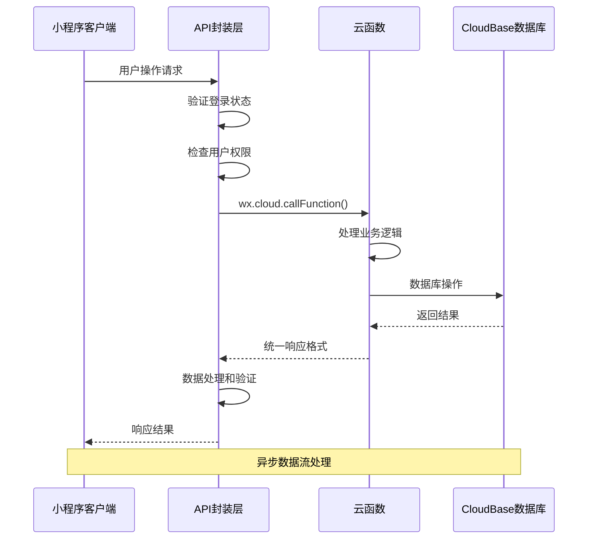
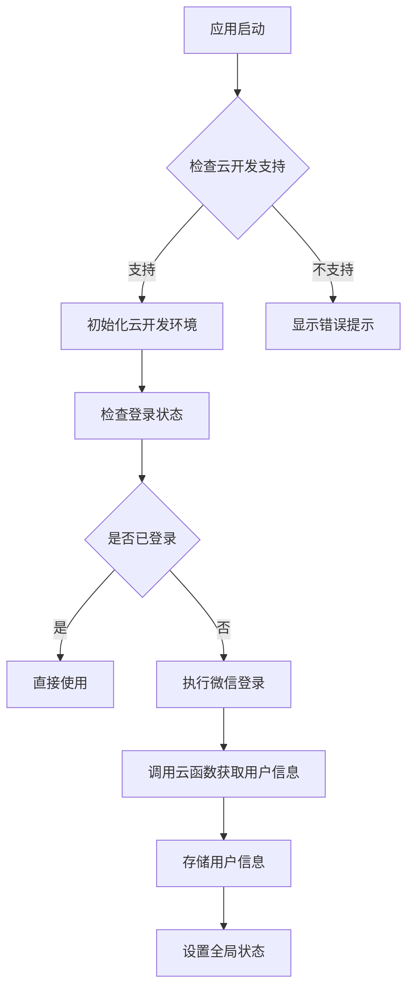
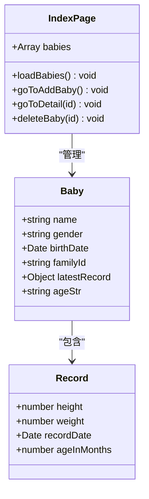
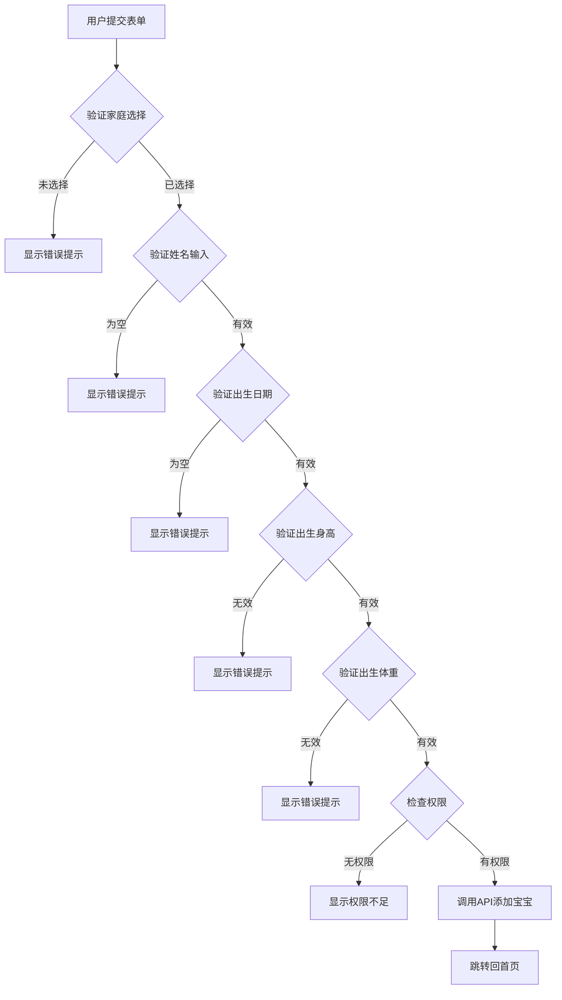
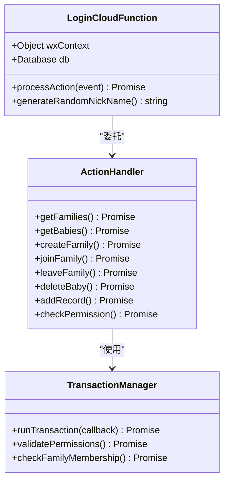
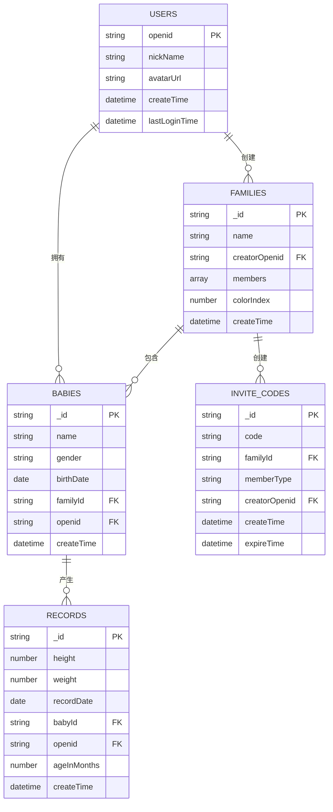
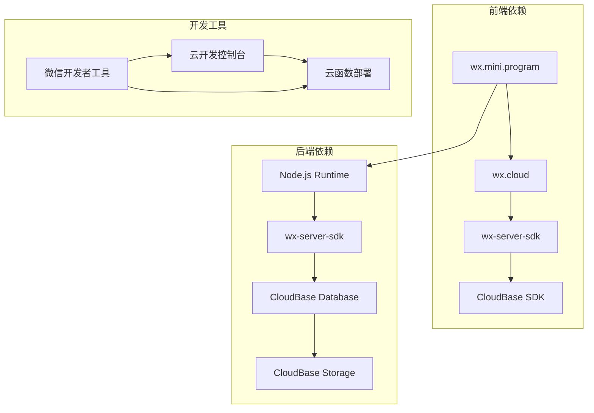
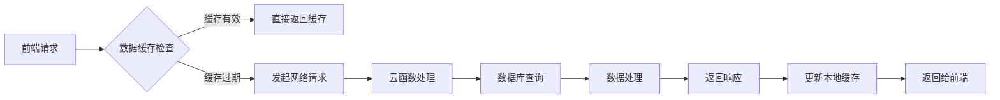

# 前后端分离模式

<cite>
**本文档引用的文件**
- [api.js](file://miniprogram/utils/api.js)
- [util.js](file://miniprogram/utils/util.js)
- [app.js](file://miniprogram/app.js)
- [login/index.js](file://cloudfunctions/login/index.js)
- [sendFeedbackEmail/index.js](file://cloudfunctions/sendFeedbackEmail/index.js)
- [baby-add.js](file://miniprogram/pages/baby-add/baby-add.js)
- [record-add.js](file://miniprogram/pages/record-add/record-add.js)
- [index.js](file://miniprogram/pages/index/index.js)
- [login/package.json](file://cloudfunctions/login/package.json)
- [sendFeedbackEmail/package.json](file://cloudfunctions/sendFeedbackEmail/package.json)
- [envList.js](file://miniprogram/envList.js)
</cite>

## 目录
1. [简介](#简介)
2. [项目结构](#项目结构)
3. [核心组件](#核心组件)
4. [架构概览](#架构概览)
5. [详细组件分析](#详细组件分析)
6. [依赖关系分析](#依赖关系分析)
7. [性能考虑](#性能考虑)
8. [故障排除指南](#故障排除指南)
9. [结论](#结论)

## 简介

本项目是一个基于微信小程序平台的前后端分离应用，专注于婴儿成长记录管理。系统采用云开发架构，前端小程序通过 `wx.cloud.callFunction` 调用云函数，实现业务逻辑处理与数据存储分离。该架构提供了良好的可扩展性和维护性，支持多用户家庭协作和权限管理。

## 项目结构

项目采用标准的微信小程序目录结构，主要分为前端小程序和云函数两大部分：



**图表来源**
- [api.js:1-879](file://miniprogram/utils/api.js#L1-L879)
- [login/index.js:1-814](file://cloudfunctions/login/index.js#L1-L814)

**章节来源**
- [api.js:1-879](file://miniprogram/utils/api.js#L1-L879)
- [login/index.js:1-814](file://cloudfunctions/login/index.js#L1-L814)

## 核心组件

### API封装层设计

API封装层是整个应用的核心，负责统一处理前端与云函数的通信。该层实现了以下关键功能：

#### 登录状态管理
- 自动检测和等待登录完成
- 用户信息持久化存储
- 登录超时处理机制

#### 权限验证系统
- 基于家庭成员身份的权限控制
- 家长和助教的不同操作权限
- 实时权限检查机制

#### 错误处理机制
- 统一的错误捕获和处理
- 用户友好的错误提示
- 详细的日志记录

#### 数据验证和转换
- 输入数据的格式验证
- 日期和数值的正确转换
- 数据标准化处理

**章节来源**
- [api.js:5-41](file://miniprogram/utils/api.js#L5-L41)
- [api.js:435-461](file://miniprogram/utils/api.js#L435-L461)
- [util.js:1-55](file://miniprogram/utils/util.js#L1-L55)

## 架构概览

系统采用典型的三层架构模式：



**图表来源**
- [app.js:28-54](file://miniprogram/app.js#L28-L54)
- [api.js:58-75](file://miniprogram/utils/api.js#L58-L75)
- [login/index.js:22-800](file://cloudfunctions/login/index.js#L22-L800)

### 数据传输协议

#### 请求格式规范
- **HTTP方法**: 使用 `POST` 方法调用云函数
- **请求头**: `Content-Type: application/json`
- **认证机制**: 自动携带用户身份信息
- **请求体**: 包含 `action` 参数标识具体操作

#### 响应数据结构
```javascript
{
  "success": boolean,           // 操作是否成功
  "data": any,                  // 成功时的数据
  "error": string,              // 失败时的错误信息
  "message": string             // 用户友好的消息
}
```

#### 状态码定义
- `200`: 操作成功
- `401`: 未授权访问
- `403`: 权限不足
- `404`: 资源不存在
- `500`: 服务器内部错误

**章节来源**
- [api.js:58-75](file://miniprogram/utils/api.js#L58-L75)
- [login/index.js:22-800](file://cloudfunctions/login/index.js#L22-L800)

## 详细组件分析

### 前端小程序组件

#### 应用入口管理
应用入口负责初始化云开发环境和处理用户登录流程：



**图表来源**
- [app.js:8-26](file://miniprogram/app.js#L8-L26)
- [app.js:28-54](file://miniprogram/app.js#L28-L54)

#### 页面组件交互

##### 首页组件
首页负责展示用户的所有宝宝信息，包含实时年龄计算和最新记录显示：



**图表来源**
- [index.js:14-52](file://miniprogram/pages/index/index.js#L14-L52)
- [api.js:435-461](file://miniprogram/utils/api.js#L435-L461)

##### 添加宝宝页面
添加宝宝页面实现了完整的表单验证和权限检查：



**图表来源**
- [baby-add.js:74-118](file://miniprogram/pages/baby-add/baby-add.js#L74-L118)
- [api.js:149-210](file://miniprogram/utils/api.js#L149-L210)

**章节来源**
- [index.js:14-144](file://miniprogram/pages/index/index.js#L14-L144)
- [baby-add.js:1-120](file://miniprogram/pages/baby-add/baby-add.js#L1-L120)
- [record-add.js:1-118](file://miniprogram/pages/record-add/record-add.js#L1-L118)

### 云函数组件

#### 登录云函数
登录云函数是整个系统的中枢，处理所有用户认证和权限相关的业务逻辑：



**图表来源**
- [login/index.js:22-800](file://cloudfunctions/login/index.js#L22-L800)
- [login/index.js:482-510](file://cloudfunctions/login/index.js#L482-L510)

#### 权限管理系统
系统实现了多层次的权限控制机制：

| 权限级别 | 操作权限 | 描述 |
|---------|---------|------|
| `guardian` | 一级助教 | 完全权限，可管理家庭和成员 |
| `caretaker` | 二级助教 | 可添加和编辑记录，但无管理权限 |
| `viewer` | 观察者 | 仅可查看数据 |

**章节来源**
- [login/index.js:186-225](file://cloudfunctions/login/index.js#L186-L225)
- [api.js:782-800](file://miniprogram/utils/api.js#L782-L800)

### 数据模型设计



**图表来源**
- [login/index.js:95-151](file://cloudfunctions/login/index.js#L95-L151)
- [login/index.js:556-605](file://cloudfunctions/login/index.js#L556-L605)

**章节来源**
- [login/index.js:95-151](file://cloudfunctions/login/index.js#L95-L151)
- [login/index.js:556-605](file://cloudfunctions/login/index.js#L556-L605)

## 依赖关系分析

### 技术栈依赖



**图表来源**
- [login/package.json:12-14](file://cloudfunctions/login/package.json#L12-L14)
- [sendFeedbackEmail/package.json:9-12](file://cloudfunctions/sendFeedbackEmail/package.json#L9-L12)

### 关键依赖关系

| 组件 | 依赖包 | 版本 | 用途 |
|------|--------|------|------|
| 登录云函数 | wx-server-sdk | latest | 云函数运行时 |
| 反馈云函数 | wx-server-sdk | latest | 云函数运行时 |
| 反馈云函数 | nodemailer | latest | 邮件发送 |

**章节来源**
- [login/package.json:12-14](file://cloudfunctions/login/package.json#L12-L14)
- [sendFeedbackEmail/package.json:9-12](file://cloudfunctions/sendFeedbackEmail/package.json#L9-L12)

## 性能考虑

### 异步数据加载优化

系统采用了多种异步处理策略来提升用户体验：

1. **延迟加载**: 首页采用分批加载策略，先显示基本信息，再异步加载详细数据
2. **缓存机制**: 用户信息和家庭数据在本地存储中进行缓存
3. **并发处理**: 对于独立的数据请求，采用并行处理提高效率

### 数据传输优化



**图表来源**
- [api.js:435-461](file://miniprogram/utils/api.js#L435-L461)
- [index.js:14-52](file://miniprogram/pages/index/index.js#L14-L52)

### 错误处理和重试机制

系统实现了完善的错误处理机制：

1. **自动重试**: 对于临时性错误，系统会自动重试1-2次
2. **用户友好提示**: 所有错误都会转换为用户可理解的消息
3. **日志记录**: 详细的错误日志便于问题排查

## 故障排除指南

### 常见问题及解决方案

#### 登录相关问题
- **问题**: 登录失败或超时
- **原因**: 网络连接问题或云函数异常
- **解决**: 检查网络连接，重新登录，查看云函数日志

#### 权限相关问题
- **问题**: 提示权限不足
- **原因**: 用户在家庭中的角色权限不够
- **解决**: 确认用户在家庭中的角色，联系一级助教提升权限

#### 数据同步问题
- **问题**: 数据显示不同步
- **原因**: 缓存未及时更新或网络延迟
- **解决**: 刷新页面，检查网络状态

### 调试技巧

1. **启用调试模式**: 在开发者工具中启用云开发调试
2. **查看网络请求**: 监控 `wx.cloud.callFunction` 的调用情况
3. **检查数据库状态**: 确认数据表结构和索引是否正确

**章节来源**
- [api.js:13-41](file://miniprogram/utils/api.js#L13-L41)
- [login/index.js:22-800](file://cloudfunctions/login/index.js#L22-L800)

## 结论

本项目成功实现了基于微信小程序的前后端分离架构，具有以下特点：

### 架构优势
- **清晰的职责分离**: 前端专注用户体验，后端专注业务逻辑
- **强大的权限控制**: 多层次的权限管理确保数据安全
- **良好的扩展性**: 模块化的API设计便于功能扩展

### 技术亮点
- **统一的API封装**: 提供一致的接口调用体验
- **完善的错误处理**: 用户友好的错误提示和日志记录
- **高效的异步处理**: 优化的异步数据加载策略

### 改进建议
1. **增加请求重试机制**: 实现更智能的请求重试策略
2. **增强缓存管理**: 实现更精细的缓存控制
3. **完善离线支持**: 增强离线数据处理能力

该架构为类似的应用开发提供了良好的参考模板，既保证了功能的完整性，又确保了系统的可维护性和可扩展性。