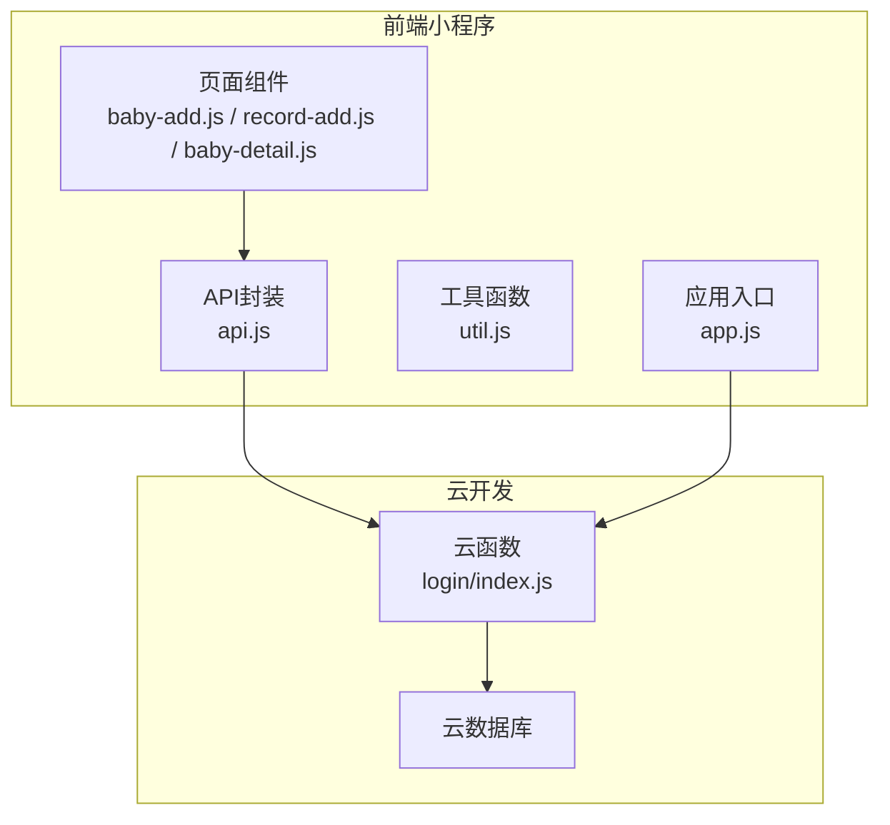
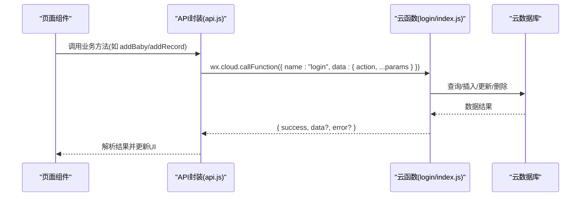
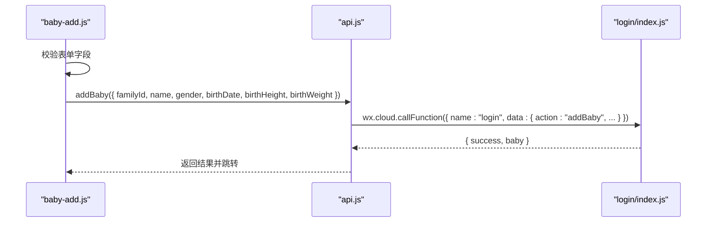
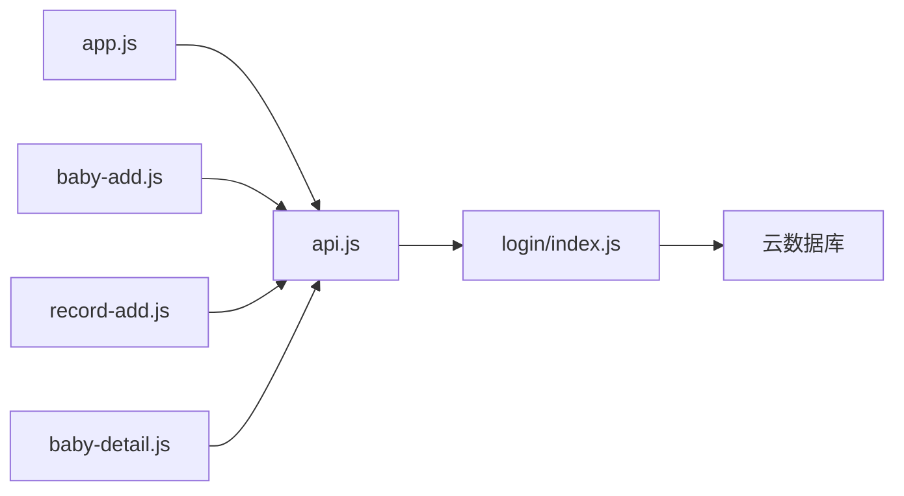

# 数据传输协议

<cite>
**本文档引用的文件**
- [api.js](file://miniprogram/utils/api.js)
- [util.js](file://miniprogram/utils/util.js)
- [app.js](file://miniprogram/app.js)
- [login/index.js](file://cloudfunctions/login/index.js)
- [sendFeedbackEmail/index.js](file://cloudfunctions/sendFeedbackEmail/index.js)
- [baby-add.js](file://miniprogram/pages/baby-add/baby-add.js)
- [record-add.js](file://miniprogram/pages/record-add/record-add.js)
- [baby-detail.js](file://miniprogram/pages/baby-detail/baby-detail.js)
- [app.json](file://miniprogram/app.json)
</cite>

## 目录
1. [简介](#简介)
2. [项目结构](#项目结构)
3. [核心组件](#核心组件)
4. [架构总览](#架构总览)
5. [详细组件分析](#详细组件分析)
6. [依赖关系分析](#依赖关系分析)
7. [性能考虑](#性能考虑)
8. [故障排查指南](#故障排查指南)
9. [结论](#结论)
10. [附录](#附录)

## 简介
本文件系统化梳理了微信小程序“宝宝助手”项目中前后端之间的数据传输协议，涵盖：
- 请求参数命名规范与数据类型
- 必填字段标识
- 响应数据的标准结构（success标志位、data数据体、error错误信息）
- 状态码与错误分类（网络错误、业务逻辑错误、权限错误）
- 常见业务场景的请求/响应示例（用户登录、宝宝信息获取、记录添加等）

## 项目结构
项目采用“前端小程序 + 云开发云函数”的架构：
- 前端通过 wx.cloud.callFunction 调用后端云函数
- 云函数负责数据库访问与业务校验，返回统一的响应结构
- 前端对响应进行解析，并在页面层做必要的数据转换与展示

图表来源
- [api.js:1-879](file://miniprogram/utils/api.js#L1-L879)
- [login/index.js:1-814](file://cloudfunctions/login/index.js#L1-L814)
- [app.js:1-56](file://miniprogram/app.js#L1-L56)

章节来源
- [app.json:1-39](file://miniprogram/app.json#L1-L39)
- [api.js:1-879](file://miniprogram/utils/api.js#L1-L879)
- [login/index.js:1-814](file://cloudfunctions/login/index.js#L1-L814)

## 核心组件
- 前端API封装（api.js）：封装了用户、家庭、宝宝、记录等业务接口，统一调用云函数并处理返回结果。
- 云函数（login/index.js）：实现用户登录、家庭管理、宝宝管理、记录管理等核心业务逻辑，返回统一响应结构。
- 工具函数（util.js）：提供日期格式化、年龄计算等通用方法。
- 应用入口（app.js）：负责初始化云环境与登录流程。

章节来源
- [api.js:1-879](file://miniprogram/utils/api.js#L1-L879)
- [login/index.js:1-814](file://cloudfunctions/login/index.js#L1-L814)
- [util.js:1-55](file://miniprogram/utils/util.js#L1-L55)
- [app.js:1-56](file://miniprogram/app.js#L1-L56)

## 架构总览
前后端交互遵循“云函数即服务”的模式：
- 前端通过 wx.cloud.callFunction 发起请求，携带 action 与业务参数
- 云函数根据 action 分发处理，执行数据库操作与权限校验
- 返回统一响应结构 { success: boolean, data?: any, error?: string }

图表来源
- [api.js:149-210](file://miniprogram/utils/api.js#L149-L210)
- [login/index.js:22-800](file://cloudfunctions/login/index.js#L22-L800)

## 详细组件分析

### 统一响应结构规范
- 成功响应：{ success: true, data: any }
- 失败响应：{ success: false, error: string }
- 特殊场景：部分云函数会返回 { success: false, message: string, error?: any }

章节来源
- [login/index.js:46-800](file://cloudfunctions/login/index.js#L46-L800)
- [sendFeedbackEmail/index.js:1-21](file://cloudfunctions/sendFeedbackEmail/index.js#L1-L21)

### 请求参数命名规范与数据类型
- 参数命名采用驼峰命名法（如 babyId、familyId、recordDate）
- 字符串类型：name、gender、recordDate、inviteCode、memberType
- 数值类型：height、weight、ageInMonths、birthHeight、birthWeight
- 日期类型：birthDate、recordDate（前端通常以字符串形式传递，内部转换为Date）
- 对象类型：userInfo、memberInfo
- 必填字段在各业务方法中明确标注

章节来源
- [api.js:149-210](file://miniprogram/utils/api.js#L149-L210)
- [api.js:299-346](file://miniprogram/utils/api.js#L299-L346)
- [api.js:497-529](file://miniprogram/utils/api.js#L497-L529)
- [api.js:531-563](file://miniprogram/utils/api.js#L531-L563)
- [api.js:565-624](file://miniprogram/utils/api.js#L565-L624)
- [api.js:626-653](file://miniprogram/utils/api.js#L626-L653)
- [api.js:655-684](file://miniprogram/utils/api.js#L655-L684)
- [api.js:686-715](file://miniprogram/utils/api.js#L686-L715)
- [api.js:717-780](file://miniprogram/utils/api.js#L717-L780)
- [api.js:782-852](file://miniprogram/utils/api.js#L782-L852)

### 必填字段标识
- addBaby：familyId、name、gender、birthDate、birthHeight、birthWeight
- addRecord：babyId、height、weight、recordDate
- createFamily：familyName、userInfo
- joinFamily：inviteCode、memberInfo
- updateBabyName：babyId、name
- updateMemberInfo：familyId、nickName、avatarUrl
- updateFamilyName：familyId、newName、openid
- updateMemberPermission：familyId、memberOpenid、permission、openid
- removeFamilyMember：familyId、memberOpenid、openid
- createInviteCode：familyId、memberType
- deleteBaby/deleteRecord：babyId/recordId

章节来源
- [api.js:149-210](file://miniprogram/utils/api.js#L149-L210)
- [api.js:299-346](file://miniprogram/utils/api.js#L299-L346)
- [api.js:497-529](file://miniprogram/utils/api.js#L497-L529)
- [api.js:565-624](file://miniprogram/utils/api.js#L565-L624)
- [api.js:701-738](file://miniprogram/utils/api.js#L701-L738)

### 权限模型与错误分类
- 权限等级：viewer（访客）、caretaker（二级助教）、guardian（一级助教）
- 权限检查：checkPermission 支持按宝宝或按家庭维度检查
- 错误分类：
  - 网络错误：云函数调用失败、登录超时
  - 业务逻辑错误：参数缺失、数据不存在、超出限制（如家庭成员数、宝宝数）
  - 权限错误：无权查看/修改/删除某资源

章节来源
- [api.js:814-852](file://miniprogram/utils/api.js#L814-L852)
- [login/index.js:153-225](file://cloudfunctions/login/index.js#L153-L225)
- [login/index.js:227-266](file://cloudfunctions/login/index.js#L227-L266)
- [login/index.js:268-422](file://cloudfunctions/login/index.js#L268-L422)
- [login/index.js:482-554](file://cloudfunctions/login/index.js#L482-L554)

### 常见业务场景数据包结构

#### 场景一：用户登录
- 请求
  - 云函数名："login"
  - 参数：{ code }
- 响应
  - { success: true, userInfo: { openid, nickName, createTime, lastLoginTime } }
  - 失败：{ success: false, error: string }

章节来源
- [app.js:28-54](file://miniprogram/app.js#L28-L54)
- [login/index.js:762-800](file://cloudfunctions/login/index.js#L762-L800)

#### 场景二：添加宝宝
- 请求
  - 云函数名："login"
  - 参数：{ action: "addBaby", familyId, name, gender, birthDate, birthHeight, birthWeight }
- 响应
  - 成功：{ success: true, baby: { _id, familyId, name, gender, birthDate, ... } }
  - 失败：{ success: false, error: string }

章节来源
- [api.js:149-210](file://miniprogram/utils/api.js#L149-L210)
- [login/index.js:482-510](file://cloudfunctions/login/index.js#L482-L510)

#### 场景三：添加记录
- 请求
  - 云函数名："login"
  - 参数：{ action: "addRecord", babyId, height, weight, recordDate }
- 响应
  - 成功：{ success: true, record: { _id, babyId, height, weight, recordDate, ... } }
  - 失败：{ success: false, error: string }

章节来源
- [api.js:299-346](file://miniprogram/utils/api.js#L299-L346)
- [login/index.js:512-554](file://cloudfunctions/login/index.js#L512-L554)

#### 场景四：获取宝宝信息
- 请求
  - 云函数名："login"
  - 参数：{ action: "getBabyById", babyId }
- 响应
  - 成功：{ success: true, baby: { ... } }
  - 失败：{ success: false, error: string }

章节来源
- [api.js:77-111](file://miniprogram/utils/api.js#L77-L111)
- [login/index.js:556-577](file://cloudfunctions/login/index.js#L556-L577)

#### 场景五：获取宝宝记录
- 请求
  - 云函数名："login"
  - 参数：{ action: "getRecordsByBabyId", babyId }
- 响应
  - 成功：{ success: true, records: [ { ... }, ... ] }
  - 失败：{ success: false, error: string }

章节来源
- [api.js:264-286](file://miniprogram/utils/api.js#L264-L286)
- [login/index.js:578-605](file://cloudfunctions/login/index.js#L578-L605)

#### 场景六：家庭管理
- 创建家庭
  - 参数：{ action: "createFamily", familyName, userInfo }
  - 成功：{ success: true, family: { ... } }
- 更新家庭名称
  - 参数：{ action: "updateFamilyName", familyId, newName, openid }
  - 成功：{ success: true }
- 创建邀请码
  - 参数：{ action: "createInviteCode", familyId, memberType }
  - 成功：{ success: true, inviteCode: string }
- 加入/退出家庭
  - 参数：{ action: "joinFamily"/"leaveFamily", ... }
  - 成功：{ success: true }

章节来源
- [api.js:497-529](file://miniprogram/utils/api.js#L497-L529)
- [api.js:655-684](file://miniprogram/utils/api.js#L655-L684)
- [api.js:686-715](file://miniprogram/utils/api.js#L686-L715)
- [api.js:717-780](file://miniprogram/utils/api.js#L717-L780)
- [login/index.js:94-151](file://cloudfunctions/login/index.js#L94-L151)
- [login/index.js:153-184](file://cloudfunctions/login/index.js#L153-L184)
- [login/index.js:658-699](file://cloudfunctions/login/index.js#L658-L699)
- [login/index.js:268-422](file://cloudfunctions/login/index.js#L268-L422)

### 页面与API交互流程

#### 添加宝宝页面（baby-add）
- 表单校验：familyId、name、birthDate、birthHeight、birthWeight
- 调用 api.addBaby，提交参数并处理结果

图表来源
- [baby-add.js:74-118](file://miniprogram/pages/baby-add/baby-add.js#L74-L118)
- [api.js:149-210](file://miniprogram/utils/api.js#L149-L210)
- [login/index.js:482-510](file://cloudfunctions/login/index.js#L482-L510)

章节来源
- [baby-add.js:1-120](file://miniprogram/pages/baby-add/baby-add.js#L1-L120)

#### 添加记录页面（record-add）
- 权限检查：需具备 caretaker 权限
- 表单校验：height、weight、recordDate
- 调用 api.addRecord 提交

章节来源
- [record-add.js:1-118](file://miniprogram/pages/record-add/record-add.js#L1-L118)
- [api.js:299-346](file://miniprogram/utils/api.js#L299-L346)

#### 宝宝详情页面（baby-detail）
- 获取宝宝信息与记录
- 图表渲染：身高/体重标准曲线对比
- 权限控制：不同操作需要 guardian/caretaker 权限

章节来源
- [baby-detail.js:1-691](file://miniprogram/pages/baby-detail/baby-detail.js#L1-L691)
- [api.js:77-111](file://miniprogram/utils/api.js#L77-L111)
- [api.js:264-286](file://miniprogram/utils/api.js#L264-L286)

## 依赖关系分析

图表来源
- [app.js:1-56](file://miniprogram/app.js#L1-L56)
- [api.js:1-879](file://miniprogram/utils/api.js#L1-L879)
- [login/index.js:1-814](file://cloudfunctions/login/index.js#L1-L814)

章节来源
- [app.json:1-39](file://miniprogram/app.json#L1-L39)

## 性能考虑
- 云函数内使用事务（runTransaction）保证关键操作的原子性（如删除宝宝）
- 云函数内对复杂查询进行排序与过滤，减少前端重复处理
- 前端对图表数据进行懒加载与分段渲染，提升页面性能

章节来源
- [login/index.js:482-510](file://cloudfunctions/login/index.js#L482-L510)
- [baby-detail.js:323-473](file://miniprogram/pages/baby-detail/baby-detail.js#L323-L473)

## 故障排查指南
- 登录失败/超时：检查 app.js 中 wx.login 与云函数 login 的调用链路
- 权限不足：确认 checkPermission 的调用与家庭成员权限
- 参数缺失：核对各业务方法的必填字段与调用方传参
- 数据不存在：确认数据库中是否存在对应记录或家庭

章节来源
- [app.js:28-54](file://miniprogram/app.js#L28-L54)
- [api.js:814-852](file://miniprogram/utils/api.js#L814-L852)
- [login/index.js:762-800](file://cloudfunctions/login/index.js#L762-L800)

## 结论
本项目通过统一的云函数接口与标准化的响应结构，实现了清晰的前后端数据传输协议。建议在后续迭代中：
- 在前端增加统一的错误提示与重试机制
- 对高频接口增加缓存策略
- 完善接口文档与契约测试，确保前后端一致性

## 附录

### 响应结构与错误字段说明
- success: boolean，表示请求是否成功
- data: any，成功时返回的具体数据
- error: string，失败时返回的错误描述
- message: string，部分云函数返回的额外消息
- error?: any，可选的错误对象或详细信息

章节来源
- [login/index.js:46-800](file://cloudfunctions/login/index.js#L46-L800)
- [sendFeedbackEmail/index.js:1-21](file://cloudfunctions/sendFeedbackEmail/index.js#L1-L21)