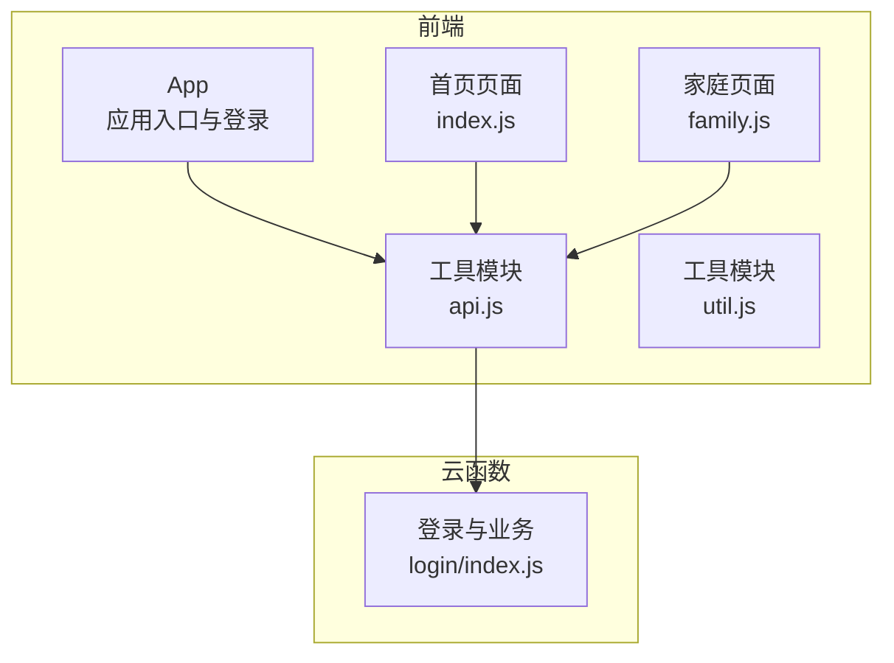
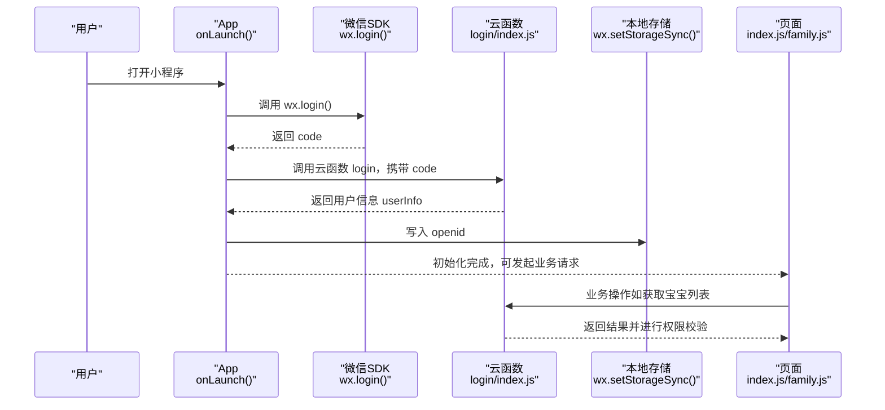
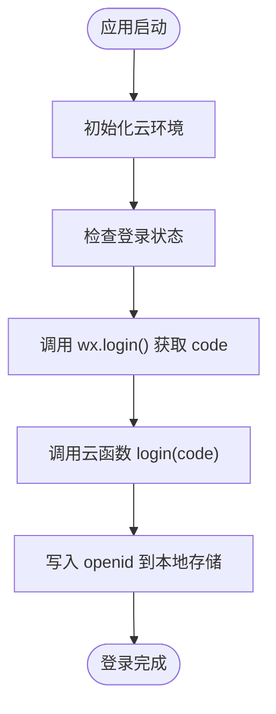
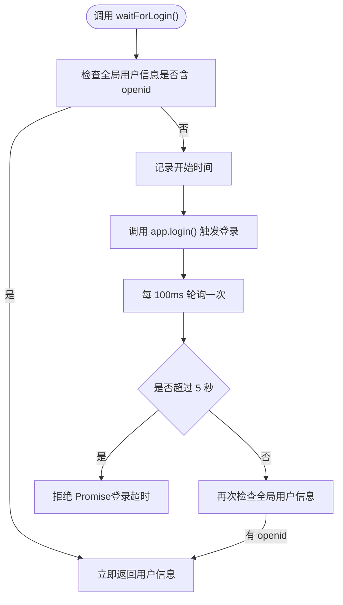
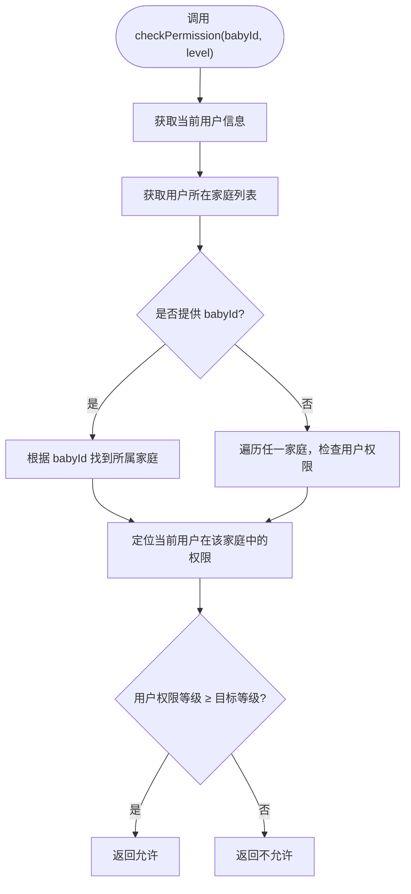
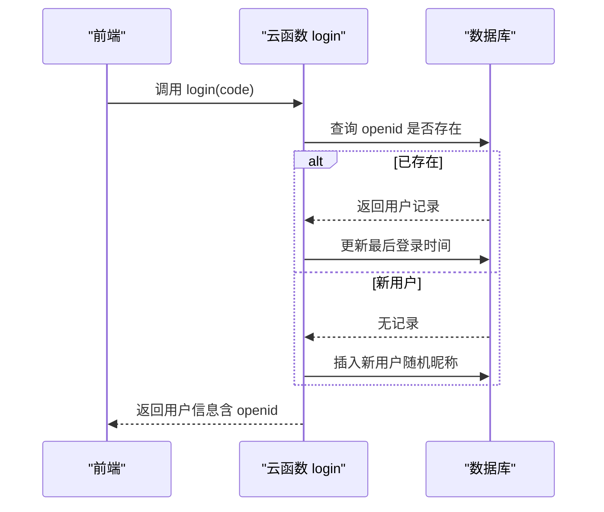
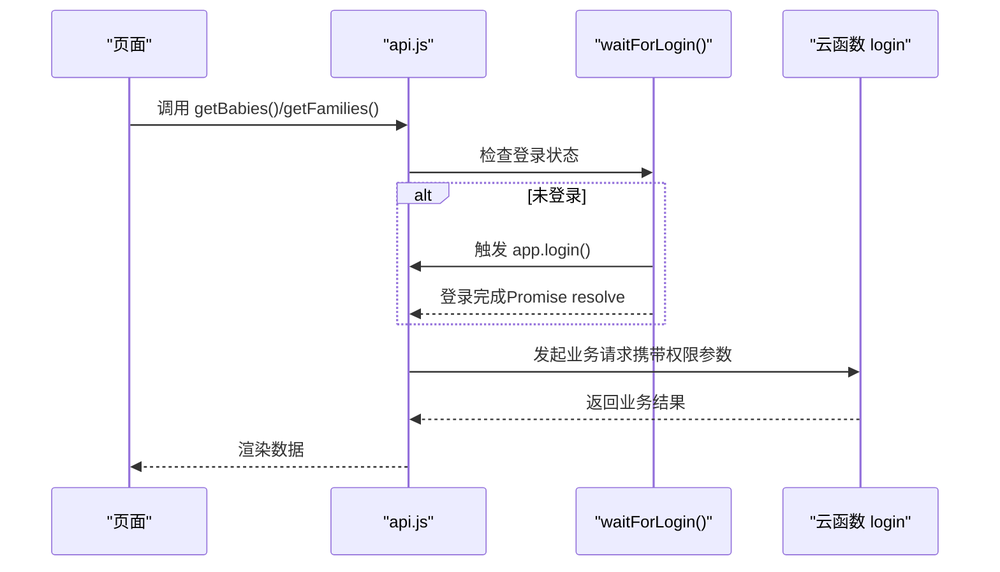
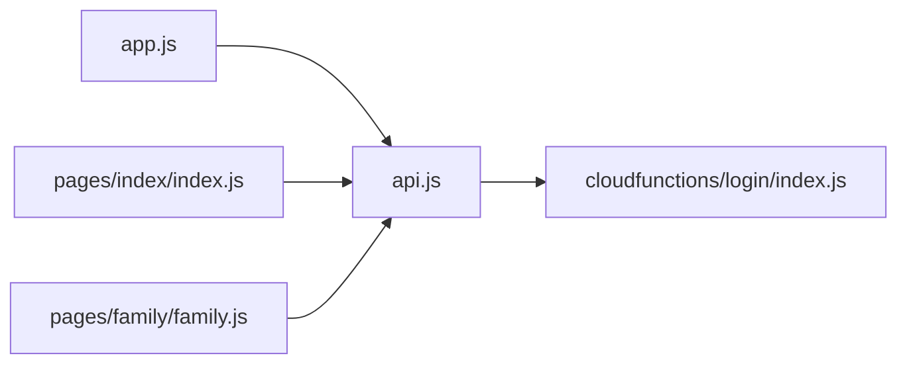

# 认证流程设计

<cite>
**本文档引用的文件**
- [app.js](file://miniprogram/app.js)
- [api.js](file://miniprogram/utils/api.js)
- [index.js](file://cloudfunctions/login/index.js)
- [index.js](file://miniprogram/pages/index/index.js)
- [family.js](file://miniprogram/pages/family/family.js)
- [util.js](file://miniprogram/utils/util.js)
</cite>

## 目录
1. [简介](#简介)
2. [项目结构](#项目结构)
3. [核心组件](#核心组件)
4. [架构总览](#架构总览)
5. [详细组件分析](#详细组件分析)
6. [依赖关系分析](#依赖关系分析)
7. [性能考虑](#性能考虑)
8. [故障排除指南](#故障排除指南)
9. [结论](#结论)

## 简介
本文件系统性梳理微信小程序的认证与权限体系，覆盖以下要点：
- 微信登录流程：wx.login() 调用、code 换取 openid 的过程、用户信息存储策略
- waitForLogin() 实现原理：登录状态检查、超时处理、重试机制
- 权限验证设计：用户身份验证、家庭权限检查、操作权限控制
- 认证状态持久化：localStorage 使用、应用启动时初始化流程
- 完整认证流程示例：登录成功后的状态更新、错误处理、会话管理

## 项目结构
小程序采用“前端页面 + 工具模块 + 云函数”的分层组织方式：
- 前端层：app.js 应用生命周期与登录入口；各页面通过 utils/api.js 统一调用认证与业务接口
- 工具层：utils/api.js 提供统一的认证等待、用户信息获取、权限检查、业务操作封装
- 云函数层：cloudfunctions/login/index.js 提供登录态校验、家庭/宝宝/记录等业务操作的权限控制

**图表来源**
- [app.js:1-56](file://miniprogram/app.js#L1-L56)
- [api.js:1-879](file://miniprogram/utils/api.js#L1-L879)
- [index.js:1-814](file://cloudfunctions/login/index.js#L1-L814)

**章节来源**
- [app.js:1-56](file://miniprogram/app.js#L1-L56)
- [api.js:1-879](file://miniprogram/utils/api.js#L1-L879)

## 核心组件
- 应用入口与登录：在应用启动时初始化云环境并触发登录，登录成功后将用户信息写入全局与本地存储
- 登录等待器：waitForLogin() 提供登录状态轮询与超时控制，保证后续业务在登录完成后执行
- 权限检查器：checkPermission() 将家庭权限映射为等级，进行细粒度的权限判定
- 云函数登录：login 云函数负责 code 换取 openid、用户注册/更新、以及各类业务操作的权限校验

**章节来源**
- [app.js:8-54](file://miniprogram/app.js#L8-L54)
- [api.js:13-41](file://miniprogram/utils/api.js#L13-L41)
- [api.js:782-852](file://miniprogram/utils/api.js#L782-L852)
- [index.js:22-800](file://cloudfunctions/login/index.js#L22-L800)

## 架构总览
下图展示了从应用启动到业务操作的完整认证与权限链路。

**图表来源**
- [app.js:28-54](file://miniprogram/app.js#L28-L54)
- [index.js:762-800](file://cloudfunctions/login/index.js#L762-L800)

## 详细组件分析

### 组件A：应用启动与自动登录
- 初始化云环境：在 onLaunch 中初始化云开发能力
- 自动登录：直接调用 wx.login() 获取 code，并通过云函数 login 完成 openid 获取与用户信息写入
- 状态持久化：登录成功后将 openid 写入本地存储，供后续业务使用

**图表来源**
- [app.js:8-54](file://miniprogram/app.js#L8-L54)

**章节来源**
- [app.js:8-54](file://miniprogram/app.js#L8-L54)

### 组件B：waitForLogin() 实现原理
- 登录状态检查：优先检查全局用户信息是否包含 openid
- 超时处理：最大等待时间为 5 秒，超时则拒绝 Promise
- 重试机制：若未登录，调用 app.login() 并以 100ms 间隔轮询全局状态
- 适用场景：在页面加载或业务操作前，确保用户已登录

**图表来源**
- [api.js:13-41](file://miniprogram/utils/api.js#L13-L41)

**章节来源**
- [api.js:13-41](file://miniprogram/utils/api.js#L13-L41)

### 组件C：权限验证设计
- 家庭权限模型：viewer（围观）、caretaker（二级助教）、guardian（一级助教），以数值等级进行比较
- 用户身份验证：通过 getFamilies() 获取用户所在家庭集合，再定位当前用户在目标家庭中的权限
- 操作权限控制：在具体业务（如添加/删除宝宝、修改家庭名称、更新成员权限等）中，结合业务需求进行权限判断

**图表来源**
- [api.js:782-852](file://miniprogram/utils/api.js#L782-L852)

**章节来源**
- [api.js:782-852](file://miniprogram/utils/api.js#L782-L852)

### 组件D：云函数登录与用户信息存储策略
- 登录态处理：接收前端传入的 code，调用微信上下文获取 openid，查询或创建用户记录，更新最后登录时间
- 用户信息存储：将 openid 写入本地存储；同时在云函数侧维护用户表，便于后续权限与业务使用
- 业务操作：云函数 login 还承担了家庭/宝宝/记录等业务的权限校验与事务处理

**图表来源**
- [index.js:22-800](file://cloudfunctions/login/index.js#L22-L800)

**章节来源**
- [index.js:22-800](file://cloudfunctions/login/index.js#L22-L800)

### 组件E：页面中的认证与权限使用示例
- 首页：在页面显示时加载宝宝列表，内部通过 waitForLogin() 确保登录后再发起请求
- 家庭页：在进入页面时加载家庭信息，并根据当前用户在各家庭中的身份动态展示权限

**图表来源**
- [index.js:14-75](file://miniprogram/pages/index/index.js#L14-L75)
- [family.js:29-80](file://miniprogram/pages/family/family.js#L29-L80)
- [api.js:43-75](file://miniprogram/utils/api.js#L43-L75)

**章节来源**
- [index.js:14-75](file://miniprogram/pages/index/index.js#L14-L75)
- [family.js:29-80](file://miniprogram/pages/family/family.js#L29-L80)
- [api.js:43-75](file://miniprogram/utils/api.js#L43-L75)

## 依赖关系分析
- app.js 依赖微信 SDK 与云函数；通过全局变量与本地存储传递登录状态
- api.js 作为统一入口，依赖 app.js 的全局状态与云函数；内部封装 waitForLogin() 与权限检查
- 页面通过 api.js 调用云函数，避免直接访问数据库，权限由云函数集中控制
- 云函数 login 负责权限校验与业务逻辑，确保数据一致性与安全性

**图表来源**
- [app.js:1-56](file://miniprogram/app.js#L1-L56)
- [api.js:1-879](file://miniprogram/utils/api.js#L1-L879)
- [index.js:1-814](file://cloudfunctions/login/index.js#L1-L814)

**章节来源**
- [app.js:1-56](file://miniprogram/app.js#L1-L56)
- [api.js:1-879](file://miniprogram/utils/api.js#L1-L879)
- [index.js:1-814](file://cloudfunctions/login/index.js#L1-L814)

## 性能考虑
- 登录轮询间隔：100ms 的轮询频率对大多数场景足够，若业务量增大可评估降低轮询频率或引入更高效的事件通知机制
- 云函数权限校验：将权限校验前置到云函数，减少前端误调用带来的网络往返
- 本地存储：仅缓存 openid，避免在本地存储敏感用户信息，降低安全风险
- 数据库查询：云函数内尽量使用索引字段（如 openid）进行查询，减少全表扫描

## 故障排除指南
- 登录超时：waitForLogin() 在 5 秒后拒绝 Promise，需检查前端登录流程与网络状况
- 权限不足：checkPermission() 返回 false 时，需确认用户在目标家庭中的权限等级
- 云函数异常：登录与业务操作均通过云函数执行，出现错误时查看云函数日志定位问题
- 页面白屏：确保在页面加载前调用 waitForLogin()，避免在未登录状态下发起业务请求

**章节来源**
- [api.js:13-41](file://miniprogram/utils/api.js#L13-L41)
- [api.js:782-852](file://miniprogram/utils/api.js#L782-L852)

## 结论
本项目通过“前端自动登录 + 云函数集中权限校验”的模式，实现了稳定可靠的认证与权限体系。waitForLogin() 提供了简洁的登录等待机制，配合云函数 login 的 openid 管理与权限控制，使得页面与业务逻辑能够专注于功能实现，同时保障数据安全与一致性。