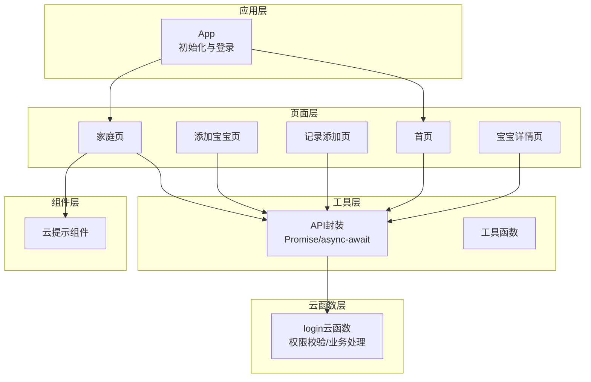
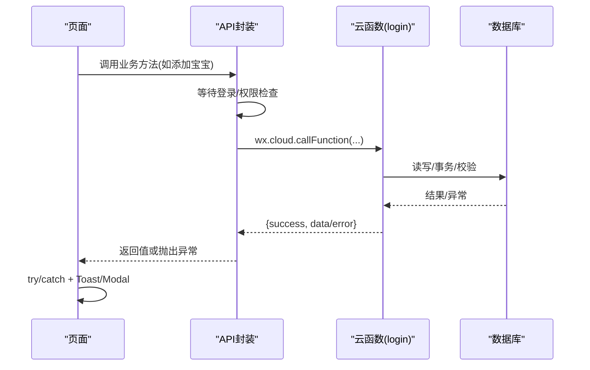
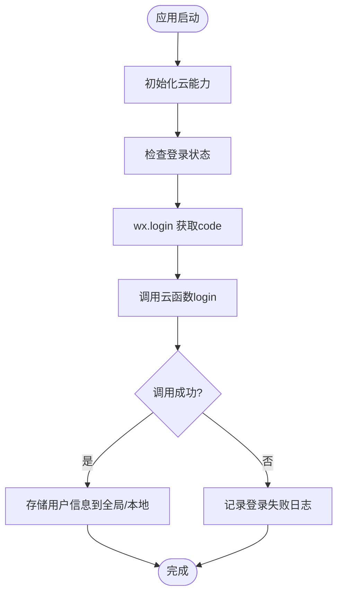
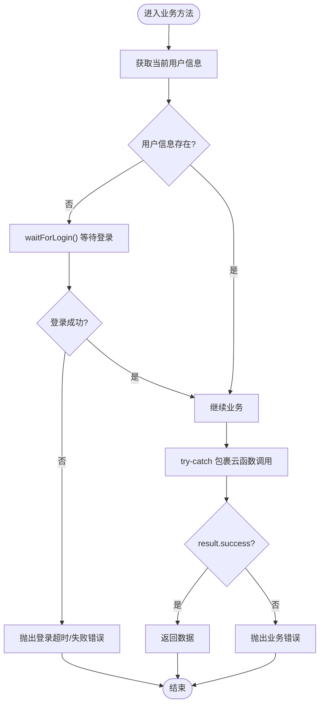
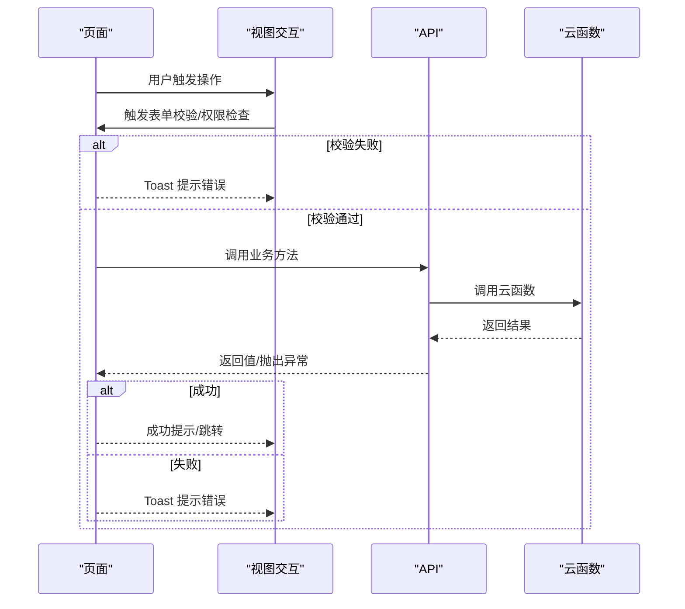
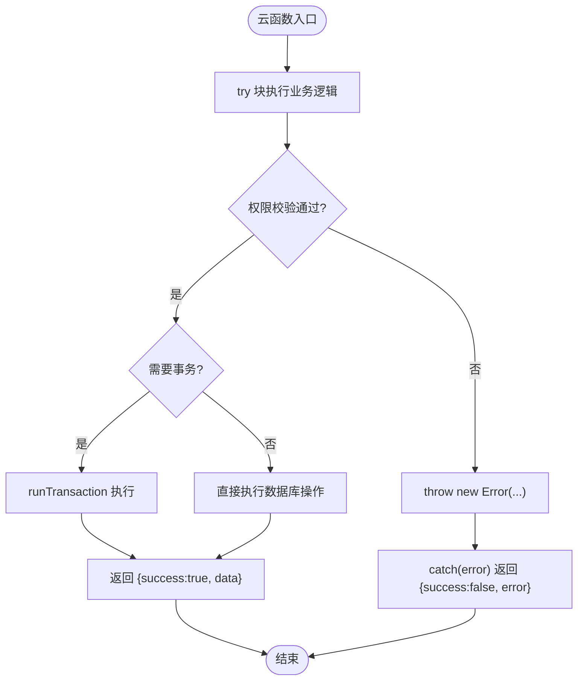
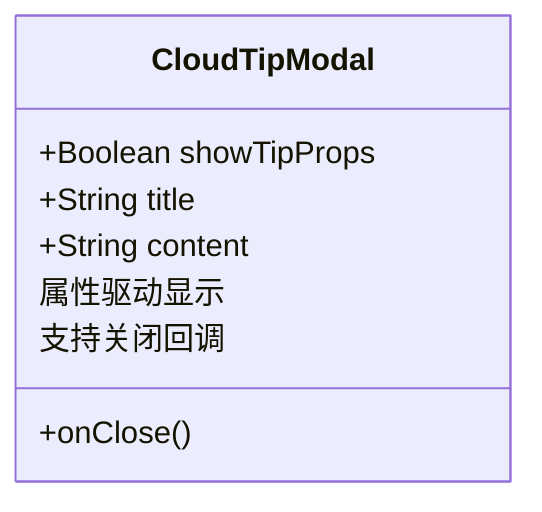
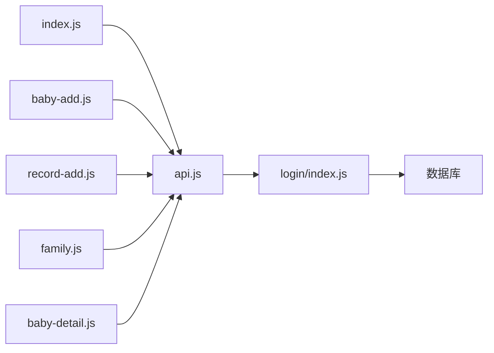

# 错误处理机制

<cite>
**本文档引用的文件**
- [app.js](file://miniprogram/app.js)
- [api.js](file://miniprogram/utils/api.js)
- [util.js](file://miniprogram/utils/util.js)
- [index.js](file://miniprogram/pages/index/index.js)
- [baby-add.js](file://miniprogram/pages/baby-add/baby-add.js)
- [record-add.js](file://miniprogram/pages/record-add/record-add.js)
- [family.js](file://miniprogram/pages/family/family.js)
- [baby-detail.js](file://miniprogram/pages/baby-detail/baby-detail.js)
- [cloudTipModal/index.js](file://miniprogram/components/cloudTipModal/index.js)
- [cloudTipModal/index.wxml](file://miniprogram/components/cloudTipModal/index.wxml)
- [login/index.js](file://cloudfunctions/login/index.js)
</cite>

## 目录
1. [简介](#简介)
2. [项目结构](#项目结构)
3. [核心组件](#核心组件)
4. [架构总览](#架构总览)
5. [详细组件分析](#详细组件分析)
6. [依赖关系分析](#依赖关系分析)
7. [性能考虑](#性能考虑)
8. [故障排查指南](#故障排查指南)
9. [结论](#结论)

## 简介
本文件系统化梳理了该微信小程序项目的错误处理机制，覆盖前端统一的错误策略（try-catch、Promise 错误处理、网络请求错误处理）、错误分类与处理方式（网络错误、业务逻辑错误、权限错误、数据验证错误）、错误信息的统一格式与显示策略（Toast 提示、错误对话框、日志记录），以及错误恢复机制（自动重试、降级处理、用户引导）。同时提供具体场景的处理路径参考，帮助开发者快速定位与修复问题。

## 项目结构
该项目采用分层架构：
- 应用层：应用生命周期与登录流程控制
- 页面层：各功能页面的业务逻辑与错误展示
- 工具层：API 封装、工具函数
- 云函数层：后端业务逻辑与权限校验
- 组件层：通用提示组件

图表来源
- [app.js:1-56](file://miniprogram/app.js#L1-L56)
- [api.js:1-800](file://miniprogram/utils/api.js#L1-L800)
- [login/index.js:1-800](file://cloudfunctions/login/index.js#L1-L800)

章节来源
- [app.js:1-56](file://miniprogram/app.js#L1-L56)
- [api.js:1-800](file://miniprogram/utils/api.js#L1-L800)

## 核心组件
- 应用层：负责初始化、环境配置与登录态检查；登录失败时进行错误记录。
- API 层：统一封装云函数调用与数据库操作，提供等待登录、权限检查、业务 CRUD 等方法；对异常进行捕获与上抛。
- 页面层：在业务流程关键节点进行 try-catch 包裹，结合 Toast、Modal 进行用户提示。
- 云函数层：集中处理权限校验与业务规则，返回统一的成功/失败结构，便于前端统一处理。
- 组件层：提供可复用的提示组件，支持标题与内容配置。

章节来源
- [app.js:18-54](file://miniprogram/app.js#L18-L54)
- [api.js:13-41](file://miniprogram/utils/api.js#L13-L41)
- [api.js:782-790](file://miniprogram/utils/api.js#L782-L790)

## 架构总览
前端通过 API 层调用云函数，云函数执行业务逻辑并返回结果；页面层根据返回结果决定 UI 行为与提示。错误在多层传递，统一通过 try-catch 捕获并以 Toast/Modal 呈现给用户。

图表来源
- [api.js:149-210](file://miniprogram/utils/api.js#L149-L210)
- [login/index.js:22-800](file://cloudfunctions/login/index.js#L22-L800)

## 详细组件分析

### 应用层错误处理（App）
- 初始化：检测基础库版本，初始化云能力。
- 登录流程：调用微信登录获取 code，再调用云函数换取用户信息；失败时记录错误日志。
- 登录状态检查：启动时直接执行登录，保证后续业务可用。

图表来源
- [app.js:8-54](file://miniprogram/app.js#L8-L54)

章节来源
- [app.js:8-54](file://miniprogram/app.js#L8-L54)

### API 层错误处理（utils/api.js）
- 等待登录：提供等待登录完成的 Promise，超时则抛出错误。
- 权限检查：在关键业务前调用权限校验，失败时抛出错误。
- 业务方法：对每个业务方法进行 try-catch 包裹，捕获异常并记录日志，返回兜底值或重新抛出。
- 云函数调用：统一通过 wx.cloud.callFunction 发起请求，解析 result.success 判断结果。
- 数据验证：在添加/更新等场景进行参数校验，不符合条件时抛出错误。

图表来源
- [api.js:13-41](file://miniprogram/utils/api.js#L13-L41)
- [api.js:44-75](file://miniprogram/utils/api.js#L44-L75)
- [api.js:782-790](file://miniprogram/utils/api.js#L782-L790)

章节来源
- [api.js:13-41](file://miniprogram/utils/api.js#L13-L41)
- [api.js:44-75](file://miniprogram/utils/api.js#L44-L75)
- [api.js:149-210](file://miniprogram/utils/api.js#L149-L210)
- [api.js:782-790](file://miniprogram/utils/api.js#L782-L790)

### 页面层错误处理（pages/*）
- 首页：在加载数据时进行 try-catch，失败时通过 Toast 提示“加载失败，请重试”。
- 添加宝宝：在表单提交前进行参数校验，失败时 Toast 提示；提交过程中 try-catch，失败时 Toast 展示错误消息。
- 记录添加：在表单提交前进行参数校验与年龄计算校验，失败时 Toast 提示；提交过程中 try-catch，失败时 Toast 展示错误消息。
- 家庭页：在创建/加入/修改/删除等操作前后进行 try-catch，失败时 Toast 展示错误消息；部分操作使用 showModal 进行二次确认。
- 宝宝详情：在加载数据时进行 try-catch，失败时 Toast 提示；图表初始化等场景进行 try-catch。

图表来源
- [index.js:14-52](file://miniprogram/pages/index/index.js#L14-L52)
- [baby-add.js:74-118](file://miniprogram/pages/baby-add/baby-add.js#L74-L118)
- [record-add.js:71-116](file://miniprogram/pages/record-add/record-add.js#L71-L116)
- [family.js:102-130](file://miniprogram/pages/family/family.js#L102-L130)
- [family.js:132-166](file://miniprogram/pages/family/family.js#L132-L166)

章节来源
- [index.js:14-52](file://miniprogram/pages/index/index.js#L14-L52)
- [baby-add.js:74-118](file://miniprogram/pages/baby-add/baby-add.js#L74-L118)
- [record-add.js:71-116](file://miniprogram/pages/record-add/record-add.js#L71-L116)
- [family.js:102-130](file://miniprogram/pages/family/family.js#L102-L130)
- [family.js:132-166](file://miniprogram/pages/family/family.js#L132-L166)

### 云函数层错误处理（cloudfunctions/login/index.js）
- 统一 try-catch：所有业务分支均包裹在 try-catch 中，异常时返回包含错误信息的对象。
- 权限校验：在创建/更新/删除/邀请等操作前进行权限校验，不满足条件时抛出错误。
- 事务处理：删除宝宝等操作使用事务保证一致性，异常时回滚并返回错误。
- 返回格式：统一返回 { success, data/error } 结构，便于前端统一处理。

图表来源
- [login/index.js:22-800](file://cloudfunctions/login/index.js#L22-L800)

章节来源
- [login/index.js:22-800](file://cloudfunctions/login/index.js#L22-L800)

### 通用提示组件（cloudTipModal）
- 属性：showTipProps、title、content
- 行为：监听属性变化自动更新显示状态；提供关闭回调。
- 用途：作为通用提示弹窗，承载“云提示”类信息。

图表来源
- [cloudTipModal/index.js:1-28](file://miniprogram/components/cloudTipModal/index.js#L1-L28)
- [cloudTipModal/index.wxml:1-10](file://miniprogram/components/cloudTipModal/index.wxml#L1-L10)

章节来源
- [cloudTipModal/index.js:1-28](file://miniprogram/components/cloudTipModal/index.js#L1-L28)
- [cloudTipModal/index.wxml:1-10](file://miniprogram/components/cloudTipModal/index.wxml#L1-L10)

## 依赖关系分析
- 页面依赖 API 封装，API 封装依赖云函数与数据库。
- 云函数内部依赖数据库命令与事务，统一返回结构。
- 组件层为页面提供可复用的提示能力。

图表来源
- [index.js:1-144](file://miniprogram/pages/index/index.js#L1-L144)
- [baby-add.js:1-120](file://miniprogram/pages/baby-add/baby-add.js#L1-L120)
- [record-add.js:1-118](file://miniprogram/pages/record-add/record-add.js#L1-L118)
- [family.js:1-757](file://miniprogram/pages/family/family.js#L1-L757)
- [baby-detail.js:1-200](file://miniprogram/pages/baby-detail/baby-detail.js#L1-L200)
- [api.js:1-800](file://miniprogram/utils/api.js#L1-L800)
- [login/index.js:1-800](file://cloudfunctions/login/index.js#L1-L800)

章节来源
- [index.js:1-144](file://miniprogram/pages/index/index.js#L1-L144)
- [api.js:1-800](file://miniprogram/utils/api.js#L1-L800)
- [login/index.js:1-800](file://cloudfunctions/login/index.js#L1-L800)

## 性能考虑
- 登录等待：提供最大等待时间限制，避免长时间阻塞。
- 云函数调用：尽量合并请求，减少往返次数；对耗时操作使用异步处理。
- 图表渲染：延迟初始化图表，避免首屏阻塞。
- 图片上传：使用云存储直传，减少前端压力。

## 故障排查指南
- 登录失败
  - 现象：登录流程报错或超时。
  - 排查：检查 App 初始化与 wx.login 流程；查看云函数返回的错误信息。
  - 参考路径
    - [app.js:29-54](file://miniprogram/app.js#L29-L54)
    - [api.js:13-41](file://miniprogram/utils/api.js#L13-L41)

- 权限不足
  - 现象：提示“只有一级助教/二级助教/无权限”等。
  - 排查：确认用户在家庭中的权限；检查云函数权限校验逻辑。
  - 参考路径
    - [api.js:782-790](file://miniprogram/utils/api.js#L782-L790)
    - [login/index.js:154-184](file://cloudfunctions/login/index.js#L154-L184)

- 参数校验失败
  - 现象：Toast 提示“请输入正确格式/必填项为空”等。
  - 排查：检查页面表单校验逻辑与 API 层参数校验。
  - 参考路径
    - [baby-add.js:74-91](file://miniprogram/pages/baby-add/baby-add.js#L74-L91)
    - [record-add.js:71-92](file://miniprogram/pages/record-add/record-add.js#L71-L92)

- 业务操作失败
  - 现象：添加/删除/更新等操作失败，Toast 提示错误。
  - 排查：查看云函数返回的错误信息；确认数据库权限与事务执行情况。
  - 参考路径
    - [api.js:149-210](file://miniprogram/utils/api.js#L149-L210)
    - [login/index.js:482-510](file://cloudfunctions/login/index.js#L482-L510)

- 网络/超时
  - 现象：云函数调用超时或失败。
  - 排查：检查云函数执行时间与数据库查询；必要时增加日志与监控。
  - 参考路径
    - [api.js:13-41](file://miniprogram/utils/api.js#L13-L41)
    - [login/index.js:22-800](file://cloudfunctions/login/index.js#L22-L800)

## 结论
本项目在前端实现了统一的错误处理策略：页面层通过 try-catch 与 Toast/Modal 提示用户；API 层统一封装登录等待、权限检查与业务调用；云函数层集中处理权限与业务规则并返回统一结构。整体形成“前端捕获—API封装—云函数执行—统一返回”的闭环，便于维护与扩展。建议后续可引入更完善的日志上报与自动重试机制，进一步提升用户体验与系统稳定性。