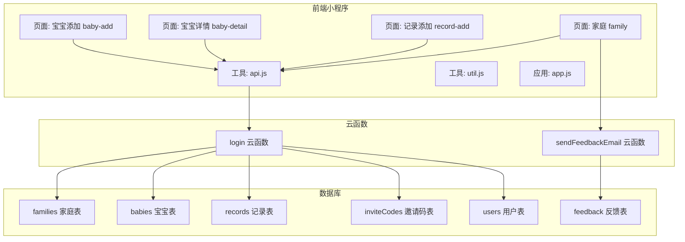
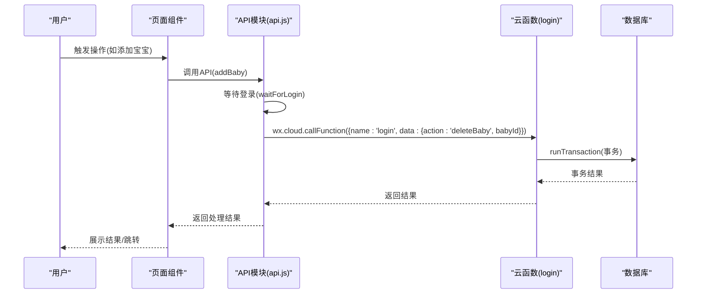
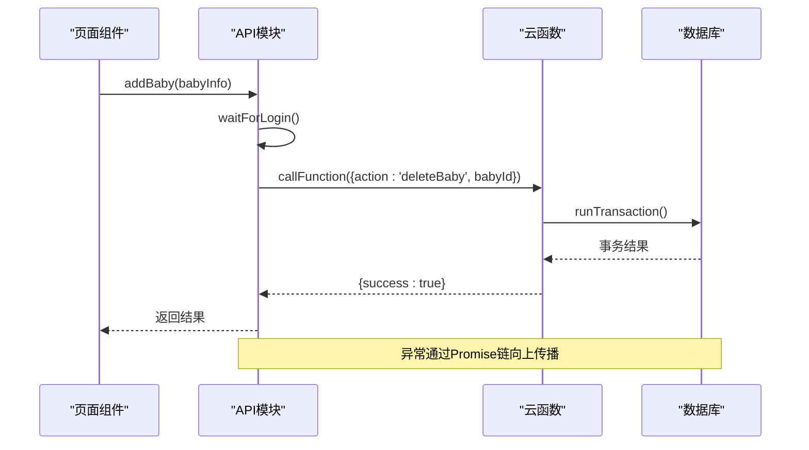
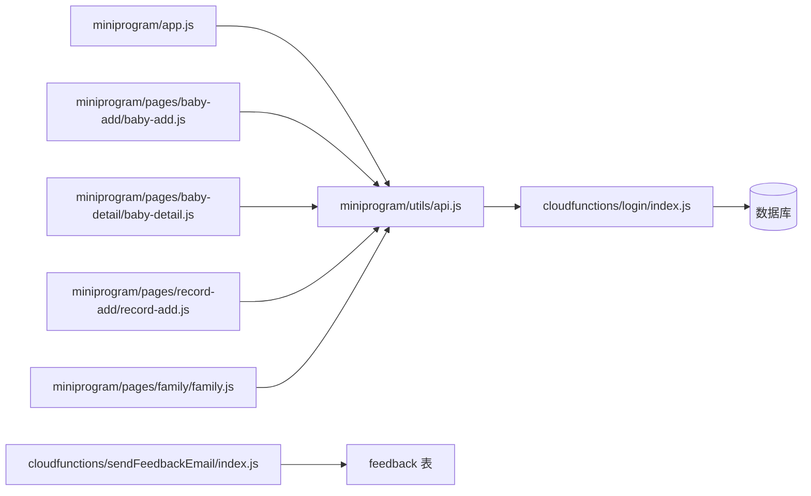

# 数据同步机制

<cite>
**本文档引用的文件**
- [cloudfunctions/login/index.js](file://cloudfunctions/login/index.js)
- [cloudfunctions/sendFeedbackEmail/index.js](file://cloudfunctions/sendFeedbackEmail/index.js)
- [miniprogram/app.js](file://miniprogram/app.js)
- [miniprogram/utils/api.js](file://miniprogram/utils/api.js)
- [miniprogram/utils/util.js](file://miniprogram/utils/util.js)
- [miniprogram/pages/baby-add/baby-add.js](file://miniprogram/pages/baby-add/baby-add.js)
- [miniprogram/pages/baby-detail/baby-detail.js](file://miniprogram/pages/baby-detail/baby-detail.js)
- [miniprogram/pages/record-add/record-add.js](file://miniprogram/pages/record-add/record-add.js)
- [miniprogram/pages/family/family.js](file://miniprogram/pages/family/family.js)
- [miniprogram/app.json](file://miniprogram/app.json)
- [cloudfunctions/login/package.json](file://cloudfunctions/login/package.json)
</cite>

## 目录
1. [简介](#简介)
2. [项目结构](#项目结构)
3. [核心组件](#核心组件)
4. [架构总览](#架构总览)
5. [详细组件分析](#详细组件分析)
6. [依赖关系分析](#依赖关系分析)
7. [性能考虑](#性能考虑)
8. [故障排查指南](#故障排查指南)
9. [结论](#结论)

## 简介
本项目是一个基于微信小程序的“宝宝助手”应用，围绕家庭、宝宝、记录等实体构建了完整的数据同步与权限控制体系。数据同步机制通过前端页面与云函数协作实现，采用云函数作为统一的数据访问入口，结合数据库事务、权限校验与异步处理，确保多端数据一致性和安全性。

## 项目结构
项目采用典型的微信小程序分层结构：
- 前端页面层：负责用户交互与UI渲染
- 工具层：封装API调用、权限校验、工具函数
- 云函数层：提供统一的数据访问与业务逻辑处理
- 数据库层：使用微信云开发NoSQL数据库

图表来源
- [miniprogram/pages/baby-add/baby-add.js:1-120](file://miniprogram/pages/baby-add/baby-add.js#L1-L120)
- [miniprogram/pages/baby-detail/baby-detail.js:1-691](file://miniprogram/pages/baby-detail/baby-detail.js#L1-L691)
- [miniprogram/pages/record-add/record-add.js:1-118](file://miniprogram/pages/record-add/record-add.js#L1-L118)
- [miniprogram/pages/family/family.js:1-757](file://miniprogram/pages/family/family.js#L1-L757)
- [miniprogram/utils/api.js:1-879](file://miniprogram/utils/api.js#L1-L879)
- [miniprogram/utils/util.js:1-55](file://miniprogram/utils/util.js#L1-L55)
- [miniprogram/app.js:1-56](file://miniprogram/app.js#L1-L56)
- [cloudfunctions/login/index.js:1-814](file://cloudfunctions/login/index.js#L1-L814)
- [cloudfunctions/sendFeedbackEmail/index.js:1-21](file://cloudfunctions/sendFeedbackEmail/index.js#L1-L21)

章节来源
- [miniprogram/app.json:1-39](file://miniprogram/app.json#L1-L39)
- [cloudfunctions/login/package.json:1-16](file://cloudfunctions/login/package.json#L1-L16)

## 核心组件
- 云函数 login：统一处理用户认证、家庭管理、宝宝管理、记录管理、权限控制等业务逻辑，提供数据库事务与权限校验。
- 云函数 sendFeedbackEmail：接收反馈数据并进行异步处理（当前为占位实现）。
- 前端API模块 api.js：封装所有数据访问接口，包含登录等待、权限校验、增删改查等。
- 工具模块 util.js：提供日期计算、年龄计算、格式化等通用工具。
- 页面组件：负责用户交互与调用API模块，实现数据展示与操作。

章节来源
- [cloudfunctions/login/index.js:1-814](file://cloudfunctions/login/index.js#L1-L814)
- [cloudfunctions/sendFeedbackEmail/index.js:1-21](file://cloudfunctions/sendFeedbackEmail/index.js#L1-L21)
- [miniprogram/utils/api.js:1-879](file://miniprogram/utils/api.js#L1-L879)
- [miniprogram/utils/util.js:1-55](file://miniprogram/utils/util.js#L1-L55)

## 架构总览
系统采用“前端直连云函数”的模式，云函数作为后端服务，直接访问数据库并执行业务逻辑。权限控制与数据一致性通过云函数内的校验与事务保证。

图表来源
- [miniprogram/pages/baby-add/baby-add.js:74-118](file://miniprogram/pages/baby-add/baby-add.js#L74-L118)
- [miniprogram/utils/api.js:149-240](file://miniprogram/utils/api.js#L149-L240)
- [cloudfunctions/login/index.js:482-510](file://cloudfunctions/login/index.js#L482-L510)

## 详细组件分析

### 云函数 login：统一数据入口与事务处理
- 功能职责
  - 用户认证与登录状态维护
  - 家庭管理：创建、加入、退出、成员权限变更、名称修改
  - 宝宝管理：创建、删除（含事务）、姓名修改
  - 记录管理：查询、删除（含权限校验）
  - 权限校验：基于家庭成员权限的细粒度控制
  - 事务处理：删除宝宝时使用事务保证数据一致性
- 关键实现点
  - 事务：删除宝宝时使用 runTransaction，确保删除宝宝与关联记录的原子性
  - 权限：严格校验用户在家庭中的权限，区分一级助教、二级助教与围观者
  - 异步清理：邀请码过期清理采用异步删除，不阻塞主流程
  - 统一入口：通过 action 参数分发不同业务逻辑，便于前端调用

```mermaid
flowchart TD
Start(["进入云函数"]) --> Action{"action类型"}
Action --> |getFamilies| GetFamilies["查询用户所在家庭"]
Action --> |getBabies| GetBabies["查询家庭下所有宝宝"]
Action --> |createFamily| CreateFamily["创建新家庭(含权限与数量校验)"]
Action --> |updateFamilyName| UpdateFamilyName["修改家庭名称(需一级助教)"]
Action --> |updateMemberPermission| UpdateMemberPermission["修改成员权限(需一级助教)"]
Action --> |removeFamilyMember| RemoveMember["移除成员(需一级助教)"]
Action --> |joinFamily| JoinFamily["加入家庭(邀请码校验)"]
Action --> |leaveFamily| LeaveFamily["退出家庭(创建者删除全家)"]
Action --> |updateMemberInfo| UpdateMemberInfo["更新成员信息(跨家庭同步)"]
Action --> |deleteBaby| DeleteBaby["删除宝宝(事务)"]
Action --> |deleteRecord| DeleteRecord["删除记录(权限校验)"]
Action --> |getBabyById| GetBabyById["查询宝宝详情(权限校验)"]
Action --> |getRecordsByBabyId| GetRecordsByBabyId["查询宝宝记录(权限校验)"]
Action --> |getRecordById| GetRecordById["查询记录详情(权限校验)"]
Action --> |getFamilyById| GetFamilyById["查询家庭详情(权限校验)"]
Action --> |createInviteCode| CreateInviteCode["创建邀请码(异步清理过期)"]
Action --> |updateBabyName| UpdateBabyName["修改宝宝姓名(需一级助教)"]
Action --> |cleanExpiredInviteCodes| CleanExpired["清理过期邀请码"]
Action --> |登录| Login["登录/注册用户"]
GetFamilies --> End(["返回结果"])
GetBabies --> End
CreateFamily --> End
UpdateFamilyName --> End
UpdateMemberPermission --> End
RemoveMember --> End
JoinFamily --> End
LeaveFamily --> End
UpdateMemberInfo --> End
DeleteBaby --> End
DeleteRecord --> End
GetBabyById --> End
GetRecordsByBabyId --> End
GetRecordById --> End
GetFamilyById --> End
CreateInviteCode --> End
UpdateBabyName --> End
CleanExpired --> End
Login --> End
```

图表来源
- [cloudfunctions/login/index.js:21-814](file://cloudfunctions/login/index.js#L21-L814)

章节来源
- [cloudfunctions/login/index.js:1-814](file://cloudfunctions/login/index.js#L1-L814)

### 前端API模块：Promise链式调用与错误传播
- 登录等待：waitForLogin 通过轮询等待登录完成，最大等待5秒，避免阻塞UI
- 权限校验：checkPermission 统一校验用户在指定宝宝或家庭中的权限
- 数据操作：封装 addBaby、deleteBaby、addRecord、deleteRecord、updateBabyName 等，均返回 Promise
- 错误传播：所有API函数捕获异常并抛出，由调用方处理
- 超时处理：登录等待设置超时，防止无限等待

图表来源
- [miniprogram/utils/api.js:14-41](file://miniprogram/utils/api.js#L14-L41)
- [miniprogram/utils/api.js:149-240](file://miniprogram/utils/api.js#L149-L240)
- [cloudfunctions/login/index.js:482-510](file://cloudfunctions/login/index.js#L482-L510)

章节来源
- [miniprogram/utils/api.js:1-879](file://miniprogram/utils/api.js#L1-L879)

### 页面组件：触发条件与时机
- 用户操作触发
  - 宝宝添加：用户在“宝宝添加”页面填写表单并提交
  - 记录添加：用户在“记录添加”页面填写身高体重并提交
  - 家庭管理：用户在“家庭”页面进行创建、加入、退出、权限变更等操作
- 定时任务
  - 邀请码过期清理：云函数内部异步清理过期邀请码，不阻塞主流程
- 事件监听
  - 页面显示时加载数据（如宝宝详情页 onShow）
  - 页面生命周期触发数据刷新

章节来源
- [miniprogram/pages/baby-add/baby-add.js:1-120](file://miniprogram/pages/baby-add/baby-add.js#L1-L120)
- [miniprogram/pages/record-add/record-add.js:1-118](file://miniprogram/pages/record-add/record-add.js#L1-L118)
- [miniprogram/pages/family/family.js:1-757](file://miniprogram/pages/family/family.js#L1-L757)
- [miniprogram/pages/baby-detail/baby-detail.js:178-245](file://miniprogram/pages/baby-detail/baby-detail.js#L178-L245)

### 数据一致性保证机制
- 事务处理
  - 删除宝宝：使用 runTransaction，确保删除宝宝与关联记录的原子性
- 冲突检测
  - 家庭数量限制：每个用户最多创建一个家庭，最多加入3个家庭
  - 成员权限限制：一级助教才能修改权限、移除成员、修改家庭名称
  - 宝宝数量限制：按家庭限制最多3个宝宝
- 回滚策略
  - 事务失败时自动回滚，保证数据一致性
  - 云函数内抛出错误，前端捕获并提示用户

章节来源
- [cloudfunctions/login/index.js:482-510](file://cloudfunctions/login/index.js#L482-L510)
- [cloudfunctions/login/index.js:94-151](file://cloudfunctions/login/index.js#L94-L151)
- [cloudfunctions/login/index.js:186-225](file://cloudfunctions/login/index.js#L186-L225)
- [cloudfunctions/login/index.js:227-266](file://cloudfunctions/login/index.js#L227-L266)

### 异步数据处理流程
- Promise链式调用
  - API模块返回Promise，页面组件通过 await/then 进行链式处理
- 错误传播
  - 云函数内捕获异常并返回错误信息，前端统一处理
- 超时处理
  - 登录等待设置最大等待时间，避免长时间阻塞
- 异步清理
  - 邀请码过期清理采用异步删除，不阻塞主流程

章节来源
- [miniprogram/utils/api.js:14-41](file://miniprogram/utils/api.js#L14-L41)
- [miniprogram/utils/api.js:212-240](file://miniprogram/utils/api.js#L212-L240)
- [cloudfunctions/login/index.js:691-696](file://cloudfunctions/login/index.js#L691-L696)

### 数据同步触发条件与时机
- 用户操作触发
  - 添加/删除宝宝、添加/删除记录、修改家庭信息、加入/退出家庭等
- 定时任务
  - 邀请码过期清理（云函数内部异步执行）
- 事件监听
  - 页面显示时加载数据（如宝宝详情页 onShow）

章节来源
- [miniprogram/pages/baby-detail/baby-detail.js:178-245](file://miniprogram/pages/baby-detail/baby-detail.js#L178-L245)
- [cloudfunctions/login/index.js:740-760](file://cloudfunctions/login/index.js#L740-L760)

### 监控与调试方法
- 日志记录
  - 云函数内使用 console.log/console.error 记录关键信息
  - 前端页面使用 wx.showToast 输出错误信息
- 状态跟踪
  - 前端通过全局变量 globalData 存储用户信息与环境
  - 页面通过 setData 更新UI状态
- 性能分析
  - 使用微信开发者工具的性能面板分析页面渲染与网络请求
  - 云函数调用使用云开发控制台查看调用耗时与错误

章节来源
- [cloudfunctions/login/index.js:12-12](file://cloudfunctions/login/index.js#L12-L12)
- [cloudfunctions/sendFeedbackEmail/index.js:12-18](file://cloudfunctions/sendFeedbackEmail/index.js#L12-L18)
- [miniprogram/app.js:34-48](file://miniprogram/app.js#L34-L48)

## 依赖关系分析
- 前端依赖
  - wx.cloud：调用云函数与数据库
  - 自定义模块：api.js、util.js
- 云函数依赖
  - wx-server-sdk：云函数运行时SDK
  - 数据库命令：_、db.collection 等
- 数据库依赖
  - 多表关联：families、babies、records、inviteCodes、users、feedback

图表来源
- [miniprogram/utils/api.js:1-879](file://miniprogram/utils/api.js#L1-L879)
- [cloudfunctions/login/index.js:1-814](file://cloudfunctions/login/index.js#L1-L814)
- [cloudfunctions/sendFeedbackEmail/index.js:1-21](file://cloudfunctions/sendFeedbackEmail/index.js#L1-L21)

章节来源
- [cloudfunctions/login/package.json:12-14](file://cloudfunctions/login/package.json#L12-L14)

## 性能考虑
- 云函数调用优化
  - 合理使用事务，避免不必要的多次查询
  - 对批量操作采用异步清理，减少主流程阻塞
- 前端渲染优化
  - 页面懒加载图表组件，减少首屏压力
  - 使用本地缓存与全局数据，减少重复请求
- 数据查询优化
  - 使用索引字段进行查询（如 openid、familyId）
  - 合理使用排序与分页，避免全量扫描

## 故障排查指南
- 登录失败
  - 检查 app.js 中 wx.login 与 wx.cloud.callFunction 的调用
  - 查看云函数 login 的登录逻辑与返回值
- 权限不足
  - 检查 api.js 中 checkPermission 的实现
  - 确认用户在家庭中的权限是否正确
- 删除失败
  - 检查云函数 login 的权限校验与事务处理
  - 查看数据库中是否存在关联记录
- 邀请码无效
  - 检查 inviteCodes 表中是否存在有效邀请码
  - 确认过期时间与使用状态

章节来源
- [miniprogram/app.js:28-54](file://miniprogram/app.js#L28-L54)
- [miniprogram/utils/api.js:782-800](file://miniprogram/utils/api.js#L782-L800)
- [cloudfunctions/login/index.js:268-371](file://cloudfunctions/login/index.js#L268-L371)
- [cloudfunctions/login/index.js:658-699](file://cloudfunctions/login/index.js#L658-L699)

## 结论
本项目通过“前端API模块 + 云函数 + 数据库”的架构实现了稳定的数据同步机制。云函数作为统一入口，提供了完善的权限控制与事务处理，确保了数据一致性与安全性；前端通过Promise链式调用与错误传播，提升了用户体验与可维护性。建议后续可引入更完善的监控与日志体系，以及针对高频操作的缓存策略，进一步提升性能与稳定性。