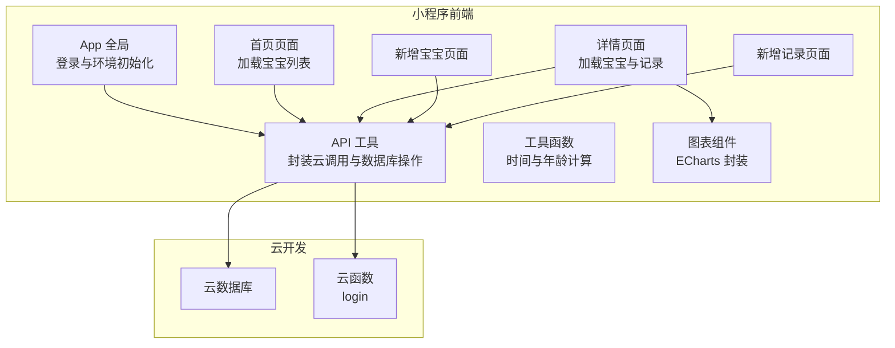
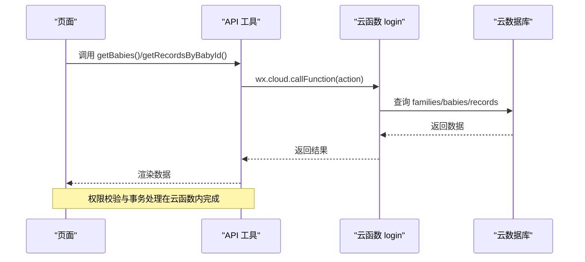
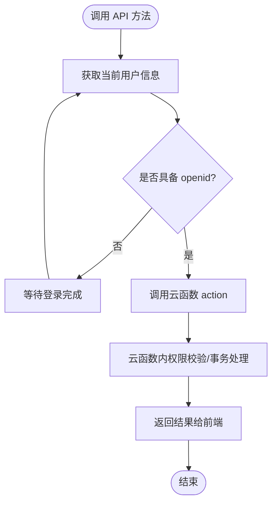
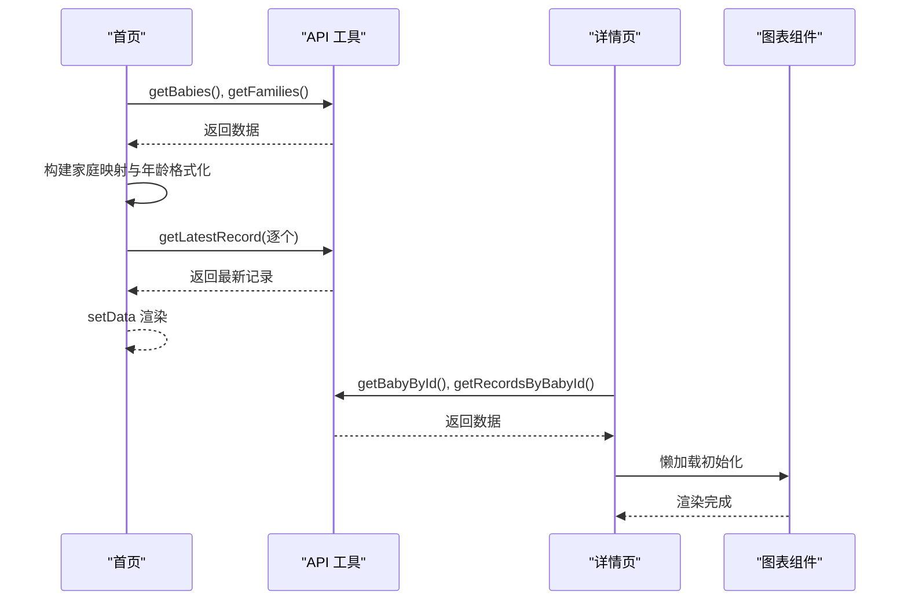
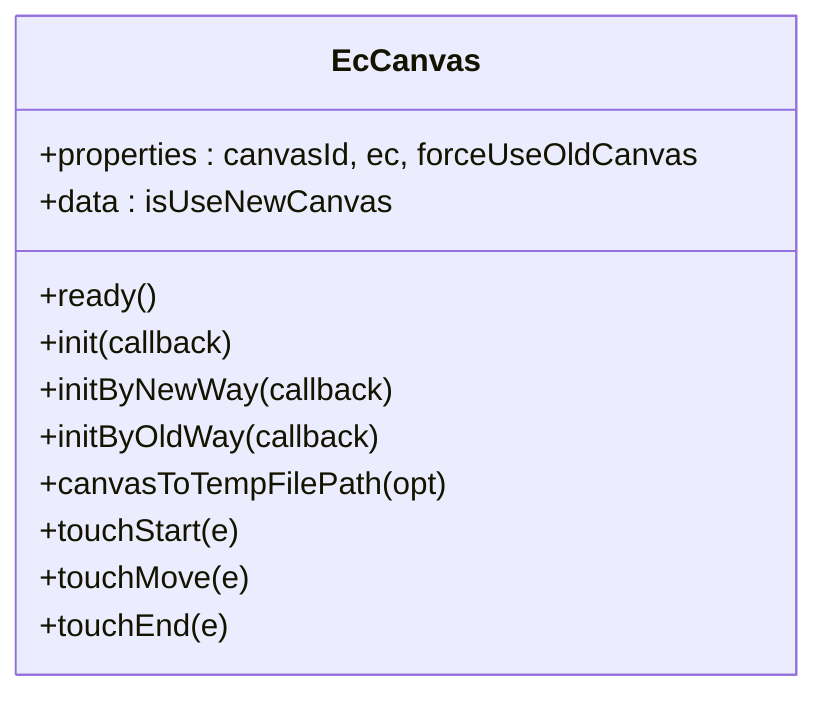
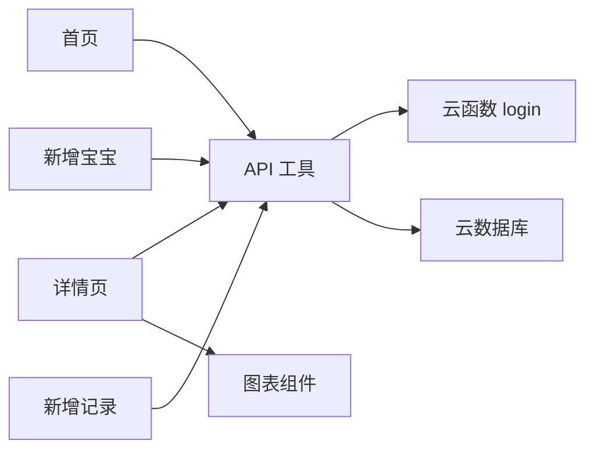

# 数据流性能优化

<cite>
**本文档引用的文件**
- [miniprogram/utils/api.js](file://miniprogram/utils/api.js)
- [miniprogram/app.js](file://miniprogram/app.js)
- [cloudfunctions/login/index.js](file://cloudfunctions/login/index.js)
- [miniprogram/utils/util.js](file://miniprogram/utils/util.js)
- [miniprogram/pages/index/index.js](file://miniprogram/pages/index/index.js)
- [miniprogram/pages/baby-detail/baby-detail.js](file://miniprogram/pages/baby-detail/baby-detail.js)
- [miniprogram/pages/baby-add/baby-add.js](file://miniprogram/pages/baby-add/baby-add.js)
- [miniprogram/pages/record-add/record-add.js](file://miniprogram/pages/record-add/record-add.js)
- [miniprogram/components/ec-canvas/ec-canvas.js](file://miniprogram/components/ec-canvas/ec-canvas.js)
- [cloudfunctions/sendFeedbackEmail/index.js](file://cloudfunctions/sendFeedbackEmail/index.js)
</cite>

## 目录
1. [简介](#简介)
2. [项目结构](#项目结构)
3. [核心组件](#核心组件)
4. [架构总览](#架构总览)
5. [详细组件分析](#详细组件分析)
6. [依赖关系分析](#依赖关系分析)
7. [性能考虑](#性能考虑)
8. [故障排查指南](#故障排查指南)
9. [结论](#结论)
10. [附录](#附录)

## 简介
本文件聚焦于该微信小程序项目的数据流性能优化，系统梳理前端与云函数之间的数据交互模式，总结网络请求优化、数据压缩、批量操作、响应时间优化、带宽消耗优化、并发处理优化以及性能监控与评估方法。通过对现有实现的分析，提出可落地的优化策略与最佳实践。

## 项目结构
该项目采用“小程序前端 + 云开发 + 云函数”的典型架构：
- 小程序前端负责用户界面与交互，通过云开发 SDK 发起请求。
- 云函数作为后端服务，统一处理数据库读写、鉴权与业务逻辑。
- 组件化图表渲染（ECharts）用于可视化展示。

**图表来源**
- [miniprogram/app.js:1-56](file://miniprogram/app.js#L1-L56)
- [miniprogram/utils/api.js:1-879](file://miniprogram/utils/api.js#L1-L879)
- [cloudfunctions/login/index.js:1-814](file://cloudfunctions/login/index.js#L1-L814)
- [miniprogram/components/ec-canvas/ec-canvas.js:1-285](file://miniprogram/components/ec-canvas/ec-canvas.js#L1-L285)

**章节来源**
- [miniprogram/app.js:1-56](file://miniprogram/app.js#L1-L56)
- [miniprogram/utils/api.js:1-879](file://miniprogram/utils/api.js#L1-L879)
- [cloudfunctions/login/index.js:1-814](file://cloudfunctions/login/index.js#L1-L814)
- [miniprogram/components/ec-canvas/ec-canvas.js:1-285](file://miniprogram/components/ec-canvas/ec-canvas.js#L1-L285)

## 核心组件
- 登录与全局状态：App 在启动时初始化云能力并触发登录流程，将用户信息写入全局与本地存储，供后续 API 调用使用。
- API 封装层：统一管理数据库读写与云函数调用，集中处理鉴权、权限校验与错误处理。
- 页面逻辑：首页与详情页分别承担列表加载与详情渲染，配合图表组件实现可视化。
- 图表组件：对 ECharts 进行封装，适配不同基础库版本，支持懒加载与交互。

**章节来源**
- [miniprogram/app.js:1-56](file://miniprogram/app.js#L1-L56)
- [miniprogram/utils/api.js:1-879](file://miniprogram/utils/api.js#L1-L879)
- [miniprogram/pages/index/index.js:1-144](file://miniprogram/pages/index/index.js#L1-L144)
- [miniprogram/pages/baby-detail/baby-detail.js:1-691](file://miniprogram/pages/baby-detail/baby-detail.js#L1-L691)
- [miniprogram/components/ec-canvas/ec-canvas.js:1-285](file://miniprogram/components/ec-canvas/ec-canvas.js#L1-L285)

## 架构总览
下图展示了从前端页面到云函数与数据库的关键数据流路径，以及权限控制与事务处理的要点。

**图表来源**
- [miniprogram/utils/api.js:44-111](file://miniprogram/utils/api.js#L44-L111)
- [miniprogram/utils/api.js:265-286](file://miniprogram/utils/api.js#L265-L286)
- [cloudfunctions/login/index.js:51-92](file://cloudfunctions/login/index.js#L51-L92)
- [cloudfunctions/login/index.js:579-605](file://cloudfunctions/login/index.js#L579-L605)

## 详细组件分析

### API 工具层（网络请求与权限控制）
- 登录等待机制：提供等待登录完成的异步流程，避免在未登录状态下发起请求。
- 云函数调用：通过统一的云函数入口处理多类业务动作（获取家庭、宝宝、记录、删除等），绕过客户端数据库权限限制。
- 权限校验：在云函数侧对用户身份、家庭成员与权限级别进行严格校验，确保数据安全。
- 事务处理：删除宝宝时使用事务保证原子性，避免数据不一致。

**图表来源**
- [miniprogram/utils/api.js:6-41](file://miniprogram/utils/api.js#L6-L41)
- [miniprogram/utils/api.js:58-75](file://miniprogram/utils/api.js#L58-L75)
- [cloudfunctions/login/index.js:482-510](file://cloudfunctions/login/index.js#L482-L510)

**章节来源**
- [miniprogram/utils/api.js:1-879](file://miniprogram/utils/api.js#L1-L879)
- [cloudfunctions/login/index.js:1-814](file://cloudfunctions/login/index.js#L1-L814)

### 页面与数据加载策略
- 首页加载：同时获取宝宝列表与家庭列表，构建家庭映射，再逐条补充最新记录与年龄信息。
- 详情页加载：按需加载宝宝信息、家庭名称、记录列表，并延迟初始化图表组件。
- 表单页：在提交前进行字段校验与权限检查，减少无效请求。

**图表来源**
- [miniprogram/pages/index/index.js:14-52](file://miniprogram/pages/index/index.js#L14-L52)
- [miniprogram/pages/baby-detail/baby-detail.js:193-245](file://miniprogram/pages/baby-detail/baby-detail.js#L193-L245)
- [miniprogram/components/ec-canvas/ec-canvas.js:74-77](file://miniprogram/components/ec-canvas/ec-canvas.js#L74-L77)

**章节来源**
- [miniprogram/pages/index/index.js:1-144](file://miniprogram/pages/index/index.js#L1-L144)
- [miniprogram/pages/baby-detail/baby-detail.js:1-691](file://miniprogram/pages/baby-detail/baby-detail.js#L1-L691)
- [miniprogram/components/ec-canvas/ec-canvas.js:1-285](file://miniprogram/components/ec-canvas/ec-canvas.js#L1-L285)

### 图表组件与渲染优化
- 版本适配：根据基础库版本选择新旧 Canvas 初始化路径，提升兼容性与性能。
- 懒加载：图表组件支持 lazyLoad，在切换到图表标签时再初始化，降低首屏压力。
- 数据预处理：按月龄计算与标准化曲线插值，减少前端重复计算。

**图表来源**
- [miniprogram/components/ec-canvas/ec-canvas.js:31-285](file://miniprogram/components/ec-canvas/ec-canvas.js#L31-L285)

**章节来源**
- [miniprogram/components/ec-canvas/ec-canvas.js:1-285](file://miniprogram/components/ec-canvas/ec-canvas.js#L1-L285)

## 依赖关系分析
- 前端依赖关系：页面依赖 API 工具；API 工具依赖云函数与云数据库；图表组件被详情页使用。
- 云函数依赖：云函数依赖云数据库命令与事务能力，统一处理鉴权与业务规则。
- 关键耦合点：API 工具与云函数之间通过 action 参数解耦，便于扩展与维护。

**图表来源**
- [miniprogram/utils/api.js:1-879](file://miniprogram/utils/api.js#L1-L879)
- [cloudfunctions/login/index.js:1-814](file://cloudfunctions/login/index.js#L1-L814)
- [miniprogram/components/ec-canvas/ec-canvas.js:1-285](file://miniprogram/components/ec-canvas/ec-canvas.js#L1-L285)

**章节来源**
- [miniprogram/utils/api.js:1-879](file://miniprogram/utils/api.js#L1-L879)
- [cloudfunctions/login/index.js:1-814](file://cloudfunctions/login/index.js#L1-L814)
- [miniprogram/components/ec-canvas/ec-canvas.js:1-285](file://miniprogram/components/ec-canvas/ec-canvas.js#L1-L285)

## 性能考虑

### 网络请求优化
- 请求合并与去重
  - 首页加载时先获取家庭列表，再一次性获取所有宝宝，避免多次跨域请求。
  - 对同一页面内的多次 API 调用，优先使用本地缓存或合并策略，减少重复请求。
- 超时与重试
  - 登录等待设置最大等待时间，防止长时间阻塞。
  - 对云函数调用可增加幂等标识与重试策略，避免重复写入。
- 错误快速失败
  - 在权限不足或数据不存在时尽早返回，避免无效计算。

**章节来源**
- [miniprogram/utils/api.js:14-41](file://miniprogram/utils/api.js#L14-L41)
- [miniprogram/pages/index/index.js:14-52](file://miniprogram/pages/index/index.js#L14-L52)

### 数据压缩与传输
- 前端传输
  - 表单输入时进行字段裁剪与类型校验，减少无效数据体积。
- 后端传输
  - 云函数查询时使用条件过滤与排序，避免全表扫描。
  - 对图表数据进行插值与采样，减少前端渲染负担。

**章节来源**
- [miniprogram/pages/baby-add/baby-add.js:74-118](file://miniprogram/pages/baby-add/baby-add.js#L74-L118)
- [cloudfunctions/login/index.js:51-92](file://cloudfunctions/login/index.js#L51-L92)

### 批量操作
- 家庭与宝宝批量查询：通过 in 查询与排序，减少多次往返。
- 删除事务：删除宝宝时同步删除其记录，保证一致性。
- 邀请码清理：异步清理过期邀请码，避免阻塞主流程。

**章节来源**
- [cloudfunctions/login/index.js:75-91](file://cloudfunctions/login/index.js#L75-L91)
- [cloudfunctions/login/index.js:482-510](file://cloudfunctions/login/index.js#L482-L510)
- [cloudfunctions/login/index.js:691-697](file://cloudfunctions/login/index.js#L691-L697)

### 响应时间优化
- 预加载策略
  - 首页在 onShow 时加载数据，结合本地缓存与懒加载，缩短首次可见时间。
- 懒加载实现
  - 图表组件支持 lazyLoad，在切换到图表标签时再初始化，降低首屏渲染压力。
- 缓存命中率提升
  - 登录状态与用户信息写入全局与本地存储，减少重复登录与查询。

**章节来源**
- [miniprogram/pages/index/index.js:10-12](file://miniprogram/pages/index/index.js#L10-L12)
- [miniprogram/components/ec-canvas/ec-canvas.js:74-77](file://miniprogram/components/ec-canvas/ec-canvas.js#L74-L77)
- [miniprogram/app.js:28-54](file://miniprogram/app.js#L28-L54)

### 带宽消耗优化
- 数据分页
  - 当前实现为一次性获取全部记录，建议在详情页对记录列表进行分页或时间窗口筛选。
- 增量更新
  - 通过时间戳或版本号实现增量拉取，减少重复数据传输。
- 压缩传输
  - 云函数侧可启用 GZIP 压缩（若平台支持），前端对非关键数据进行延迟加载。

**章节来源**
- [miniprogram/utils/api.js:242-262](file://miniprogram/utils/api.js#L242-L262)
- [miniprogram/pages/baby-detail/baby-detail.js:223-230](file://miniprogram/pages/baby-detail/baby-detail.js#L223-L230)

### 并发处理优化
- 请求合并
  - 首页同时获取家庭与宝宝列表，减少串行请求。
- 队列管理
  - 对高频操作（如图表初始化）采用节流与防抖，避免频繁重绘。
- 资源池化
  - 图表组件复用 ECharts 实例，避免重复初始化带来的内存与 CPU 开销。

**章节来源**
- [miniprogram/pages/index/index.js:16-17](file://miniprogram/pages/index/index.js#L16-L17)
- [miniprogram/components/ec-canvas/ec-canvas.js:143-192](file://miniprogram/components/ec-canvas/ec-canvas.js#L143-L192)

### 性能监控与评估
- 关键路径分析
  - 首页加载：登录 → 获取家庭 → 获取宝宝 → 获取最新记录 → 渲染。
  - 详情加载：获取宝宝 → 获取家庭 → 获取记录 → 图表初始化。
- 瓶颈识别
  - 图表初始化耗时与数据量成正比，建议对大数据集进行采样与分段渲染。
  - 云函数查询条件与排序影响数据库扫描成本，需合理建立索引。
- 优化效果评估
  - 通过埋点统计各阶段耗时（登录、云函数、数据库、渲染），对比优化前后差异。
  - 对关键指标（首屏时间、交互响应时间、图表渲染时间）进行 A/B 对比测试。

**章节来源**
- [miniprogram/pages/index/index.js:14-52](file://miniprogram/pages/index/index.js#L14-L52)
- [miniprogram/pages/baby-detail/baby-detail.js:193-245](file://miniprogram/pages/baby-detail/baby-detail.js#L193-L245)

## 故障排查指南
- 登录失败或超时
  - 检查 App 登录流程与云函数返回，确认 openid 写入与本地存储。
- 权限不足
  - 确认云函数内权限校验逻辑，检查家庭成员与权限级别。
- 数据为空或异常
  - 核对查询条件与排序逻辑，确保数据完整性。
- 图表渲染异常
  - 检查基础库版本与 Canvas 初始化路径，确认懒加载时机。

**章节来源**
- [miniprogram/app.js:28-54](file://miniprogram/app.js#L28-L54)
- [cloudfunctions/login/index.js:268-371](file://cloudfunctions/login/index.js#L268-L371)
- [miniprogram/components/ec-canvas/ec-canvas.js:80-108](file://miniprogram/components/ec-canvas/ec-canvas.js#L80-L108)

## 结论
本项目通过“前端 API 封装 + 云函数统一处理 + 组件化渲染”的架构实现了清晰的数据流。在现有基础上，建议进一步引入请求合并、懒加载、分页与增量更新、资源池化与监控埋点等策略，以持续优化响应时间、带宽消耗与并发处理能力，提升整体用户体验。

## 附录
- 云函数示例：反馈邮件处理（占位，当前返回成功）
  - 用于演示云函数入口与错误处理模式。

**章节来源**
- [cloudfunctions/sendFeedbackEmail/index.js:1-21](file://cloudfunctions/sendFeedbackEmail/index.js#L1-L21)