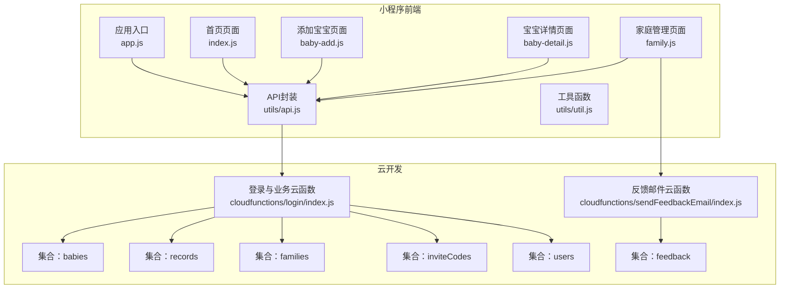
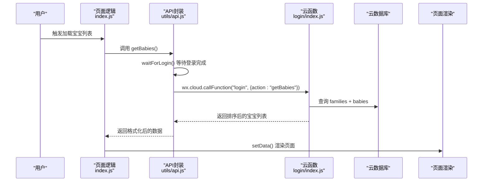
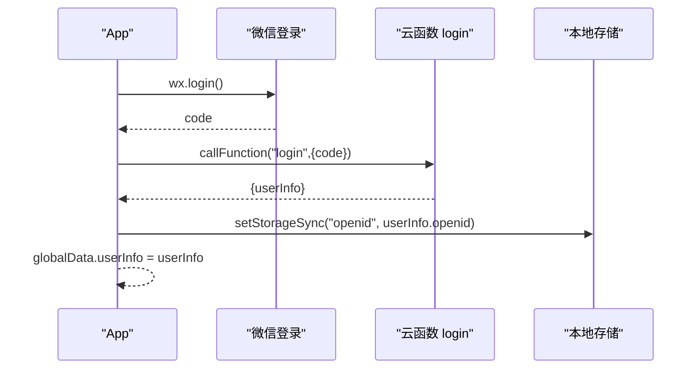
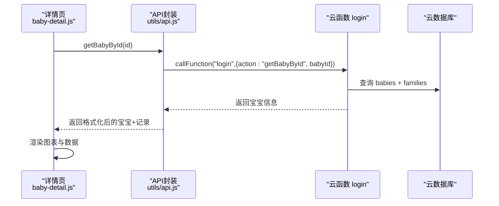
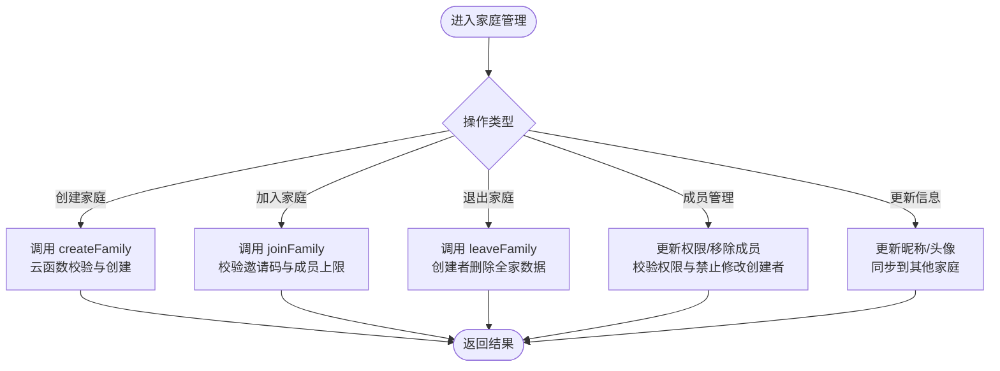
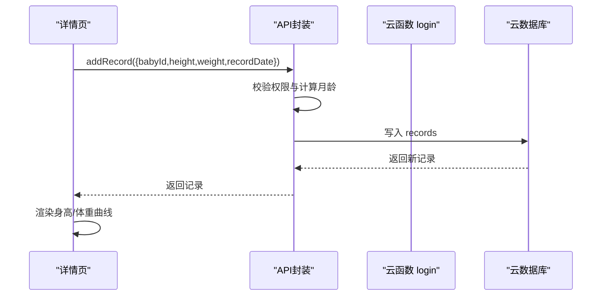
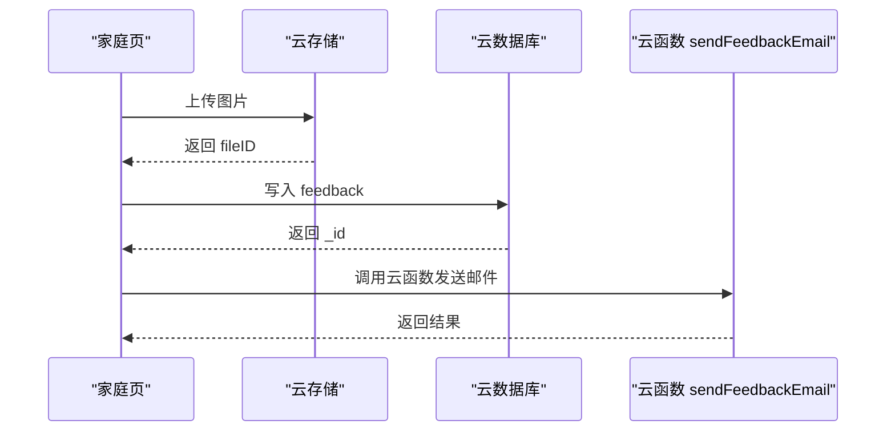
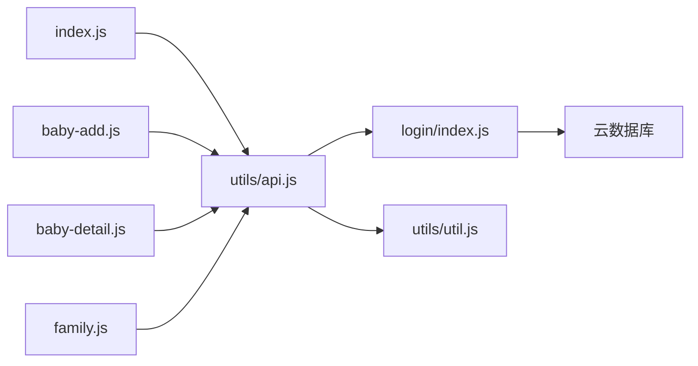

# 数据流设计

<cite>
**本文引用的文件**
- [app.js](file://miniprogram/app.js)
- [api.js](file://miniprogram/utils/api.js)
- [util.js](file://miniprogram/utils/util.js)
- [index.js](file://miniprogram/pages/index/index.js)
- [baby-add.js](file://miniprogram/pages/baby-add/baby-add.js)
- [baby-detail.js](file://miniprogram/pages/baby-detail/baby-detail.js)
- [family.js](file://miniprogram/pages/family/family.js)
- [index.js](file://cloudfunctions/login/index.js)
- [index.js](file://cloudfunctions/sendFeedbackEmail/index.js)
- [realtime.md](file://.agents/skills/cloudbase/references/no-sql-web-sdk/realtime.md)
</cite>

## 目录
1. [简介](#简介)
2. [项目结构](#项目结构)
3. [核心组件](#核心组件)
4. [架构总览](#架构总览)
5. [详细组件分析](#详细组件分析)
6. [依赖关系分析](#依赖关系分析)
7. [性能考量](#性能考量)
8. [故障排查指南](#故障排查指南)
9. [结论](#结论)
10. [附录](#附录)

## 简介
本文件系统化梳理“宝宝助手”微信小程序的数据流设计，覆盖从用户操作到页面渲染的完整链路：用户操作 -> 页面逻辑 -> API封装 -> 云函数 -> 数据库操作 -> 云函数 -> API封装 -> 页面渲染。重点阐述：
- 数据在各层级的转换与格式化（如日期、年龄、权限校验）
- 权限验证与业务逻辑处理
- 缓存策略（本地缓存、云函数侧缓存、缓存失效）
- 数据同步机制（实时更新、冲突处理、一致性保障）
- 数据流优化最佳实践（减少网络请求、提升响应速度、降低带宽）

## 项目结构
项目采用“小程序前端 + 云开发 + 云函数”的分层架构：
- 小程序前端：页面、工具函数、API封装
- 云开发：云数据库、云存储、云函数
- 云函数：统一处理业务逻辑、权限校验、跨集合事务

图表来源
- [app.js:1-56](file://miniprogram/app.js#L1-L56)
- [api.js:1-879](file://miniprogram/utils/api.js#L1-L879)
- [index.js:1-144](file://miniprogram/pages/index/index.js#L1-L144)
- [baby-add.js:1-120](file://miniprogram/pages/baby-add/baby-add.js#L1-L120)
- [baby-detail.js:1-691](file://miniprogram/pages/baby-detail/baby-detail.js#L1-L691)
- [family.js:1-757](file://miniprogram/pages/family/family.js#L1-L757)
- [index.js:1-814](file://cloudfunctions/login/index.js#L1-L814)
- [index.js:1-21](file://cloudfunctions/sendFeedbackEmail/index.js#L1-L21)

章节来源
- [app.js:1-56](file://miniprogram/app.js#L1-L56)
- [api.js:1-879](file://miniprogram/utils/api.js#L1-L879)

## 核心组件
- 应用入口与登录流程：负责初始化云环境、拉起登录、持久化用户标识
- API封装：统一封装数据库与云函数调用，处理登录等待、权限校验、数据格式化
- 页面逻辑：负责UI交互、数据展示、调用API封装层
- 云函数：集中处理业务逻辑、权限校验、跨集合事务、数据聚合
- 工具函数：日期计算、年龄格式化等

章节来源
- [app.js:1-56](file://miniprogram/app.js#L1-L56)
- [api.js:1-879](file://miniprogram/utils/api.js#L1-L879)
- [util.js:1-55](file://miniprogram/utils/util.js#L1-L55)

## 架构总览
下图展示典型用户操作到页面渲染的端到端数据流，涵盖权限校验、云函数封装、数据库读写与最终渲染。

图表来源
- [index.js:14-52](file://miniprogram/pages/index/index.js#L14-L52)
- [api.js:44-75](file://miniprogram/utils/api.js#L44-L75)
- [index.js:22-92](file://cloudfunctions/login/index.js#L22-L92)

## 详细组件分析

### 登录与用户态管理
- 初始化云环境与登录：应用启动时初始化云能力，直接发起微信登录并调用云函数换取用户信息，成功后将 openid 写入本地存储
- 登录等待机制：API封装提供等待登录完成的 Promise，避免并发场景下的空用户态
- 用户态贯穿：后续所有 API 调用均基于全局用户信息或本地存储的 openid

图表来源
- [app.js:28-54](file://miniprogram/app.js#L28-L54)
- [api.js:13-41](file://miniprogram/utils/api.js#L13-L41)
- [index.js:762-800](file://cloudfunctions/login/index.js#L762-L800)

章节来源
- [app.js:1-56](file://miniprogram/app.js#L1-L56)
- [api.js:13-41](file://miniprogram/utils/api.js#L13-L41)

### 宝宝列表与详情数据流
- 列表页：加载宝宝列表、家庭映射、最新记录、年龄格式化，再 setData 渲染
- 详情页：按宝宝 ID 获取详情、家庭名称、记录列表、标准化曲线数据，再渲染图表

图表来源
- [baby-detail.js:193-245](file://miniprogram/pages/baby-detail/baby-detail.js#L193-L245)
- [api.js:77-111](file://miniprogram/utils/api.js#L77-L111)
- [index.js:556-577](file://cloudfunctions/login/index.js#L556-L577)

章节来源
- [index.js:14-52](file://miniprogram/pages/index/index.js#L14-L52)
- [baby-detail.js:193-245](file://miniprogram/pages/baby-detail/baby-detail.js#L193-L245)

### 家庭管理与权限控制
- 家庭创建/加入/退出/成员管理：通过云函数统一处理权限校验与跨集合事务
- 权限模型：guardian（一级助教）、caretaker（二级助教）、viewer（围观）
- 头像与昵称同步：支持在多个家庭中同步更新用户信息

图表来源
- [family.js:102-130](file://miniprogram/pages/family/family.js#L102-L130)
- [family.js:132-166](file://miniprogram/pages/family/family.js#L132-L166)
- [family.js:237-257](file://miniprogram/pages/family/family.js#L237-L257)
- [family.js:511-549](file://miniprogram/pages/family/family.js#L511-L549)
- [family.js:306-354](file://miniprogram/pages/family/family.js#L306-L354)
- [index.js:94-151](file://cloudfunctions/login/index.js#L94-L151)
- [index.js:268-422](file://cloudfunctions/login/index.js#L268-L422)
- [index.js:424-480](file://cloudfunctions/login/index.js#L424-L480)

章节来源
- [family.js:1-757](file://miniprogram/pages/family/family.js#L1-L757)
- [index.js:94-151](file://cloudfunctions/login/index.js#L94-L151)

### 成长记录与图表渲染
- 记录新增：校验权限（一级/二级助教），计算月龄，写入 records
- 图表数据：按月龄标准化曲线与实测数据对比，动态缩放与滑动

图表来源
- [baby-detail.js:592-612](file://miniprogram/pages/baby-detail/baby-detail.js#L592-L612)
- [api.js:299-346](file://miniprogram/utils/api.js#L299-L346)
- [index.js:512-554](file://cloudfunctions/login/index.js#L512-L554)

章节来源
- [api.js:299-346](file://miniprogram/utils/api.js#L299-L346)
- [baby-detail.js:323-473](file://miniprogram/pages/baby-detail/baby-detail.js#L323-L473)

### 反馈与邮件发送
- 前端收集反馈内容与图片，上传至云存储，写入 feedback 集合
- 异步调用云函数发送邮件（当前为占位实现）

图表来源
- [family.js:686-755](file://miniprogram/pages/family/family.js#L686-L755)
- [index.js:6-20](file://cloudfunctions/sendFeedbackEmail/index.js#L6-L20)

章节来源
- [family.js:686-755](file://miniprogram/pages/family/family.js#L686-L755)
- [index.js:6-20](file://cloudfunctions/sendFeedbackEmail/index.js#L6-L20)

## 依赖关系分析
- 页面依赖 API 封装，API 封装依赖云函数与云数据库
- 云函数依赖数据库命令与事务，实现跨集合一致性
- 工具函数被页面与 API 封装复用

图表来源
- [index.js:1-144](file://miniprogram/pages/index/index.js#L1-L144)
- [baby-add.js:1-120](file://miniprogram/pages/baby-add/baby-add.js#L1-L120)
- [baby-detail.js:1-691](file://miniprogram/pages/baby-detail/baby-detail.js#L1-L691)
- [family.js:1-757](file://miniprogram/pages/family/family.js#L1-L757)
- [api.js:1-879](file://miniprogram/utils/api.js#L1-L879)
- [util.js:1-55](file://miniprogram/utils/util.js#L1-L55)
- [index.js:1-814](file://cloudfunctions/login/index.js#L1-L814)

章节来源
- [api.js:1-879](file://miniprogram/utils/api.js#L1-L879)
- [index.js:1-814](file://cloudfunctions/login/index.js#L1-L814)

## 性能考量
- 减少网络请求
  - 列表页一次性获取宝宝与家庭映射，避免多次查询
  - 详情页按需获取最新记录，避免全量加载
- 提升响应速度
  - API 封装内复用用户态与等待登录逻辑，避免重复登录
  - 云函数内合并查询与排序，减少往返
- 降低带宽消耗
  - 图表数据按最近 N 个点裁剪与缩放，减少传输
  - 云函数返回精简字段，前端仅渲染所需数据

[本节为通用指导，无需特定文件引用]

## 故障排查指南
- 登录失败
  - 检查应用初始化与 wx.login 流程
  - 核对云函数返回的 userInfo 是否写入本地存储
- 权限不足
  - 确认家庭成员权限（guardian/caretaker/viewer）
  - 检查云函数内的权限校验逻辑
- 数据不一致
  - 关注云函数事务（删除宝宝时同时删除记录）
  - 核对云函数内跨集合更新的原子性
- 图表异常
  - 检查月龄计算与标准化曲线数据源
  - 确认数据点排序与缩放区间

章节来源
- [app.js:28-54](file://miniprogram/app.js#L28-L54)
- [index.js:482-510](file://cloudfunctions/login/index.js#L482-L510)
- [index.js:512-554](file://cloudfunctions/login/index.js#L512-L554)
- [baby-detail.js:323-473](file://miniprogram/pages/baby-detail/baby-detail.js#L323-L473)

## 结论
本项目通过“API 封装 + 云函数 + 云数据库”的组合，实现了清晰的数据流与强一致的业务逻辑。权限校验、跨集合事务与数据格式化均集中在云函数侧，前端仅负责交互与渲染，具备良好的可维护性与扩展性。建议在现有基础上引入实时监听与本地缓存策略，进一步提升用户体验与性能。

[本节为总结性内容，无需特定文件引用]

## 附录

### 数据缓存策略
- 本地缓存
  - openid：登录成功后写入本地存储，作为用户态标识
  - 用户信息：优先使用全局状态，其次从本地存储读取
- 云函数缓存
  - 云函数内进行权限校验与跨集合查询，减少前端重复请求
  - 对于频繁访问的静态数据（如标准化曲线），可在云函数内缓存计算结果
- 缓存失效机制
  - 通过页面 onShow/onLoad 的重新拉取实现“懒失效”
  - 对于实时性要求高的场景，建议引入实时监听

章节来源
- [app.js:40-43](file://miniprogram/app.js#L40-L43)
- [api.js:6-11](file://miniprogram/utils/api.js#L6-L11)
- [api.js:13-41](file://miniprogram/utils/api.js#L13-L41)

### 数据同步机制
- 实时更新
  - 可参考云开发实时数据库能力，在需要的页面建立监听器，监听集合变化并增量更新
- 冲突处理
  - 云函数事务保证删除宝宝时同时删除记录，避免孤儿数据
- 一致性保障
  - 云函数内统一权限校验与跨集合更新，避免前端直连导致的状态不一致

章节来源
- [index.js:482-510](file://cloudfunctions/login/index.js#L482-L510)
- [realtime.md:1-136](file://.agents/skills/cloudbase/references/no-sql-web-sdk/realtime.md#L1-L136)

### 数据流优化最佳实践
- 减少网络请求
  - 合并查询：一次获取宝宝列表与家庭映射
  - 延迟加载：图表按需初始化
- 提升响应速度
  - 登录等待：统一等待机制，避免重复登录
  - 云函数聚合：在云函数内完成排序与过滤
- 降低带宽消耗
  - 图表裁剪：仅传输最近 N 个点
  - 字段精简：云函数返回最小必要字段

章节来源
- [index.js:22-92](file://cloudfunctions/login/index.js#L22-L92)
- [index.js:579-605](file://cloudfunctions/login/index.js#L579-L605)
- [baby-detail.js:323-473](file://miniprogram/pages/baby-detail/baby-detail.js#L323-L473)