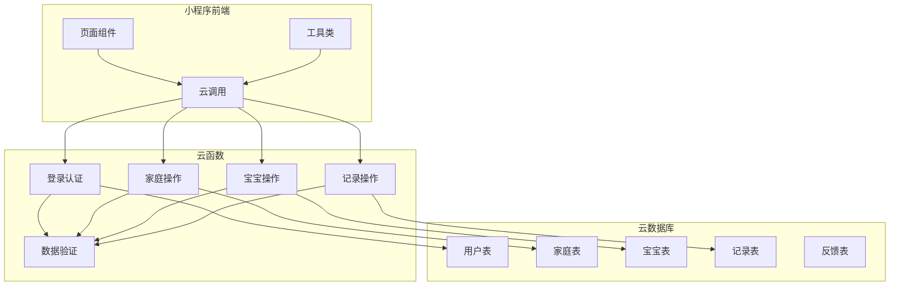
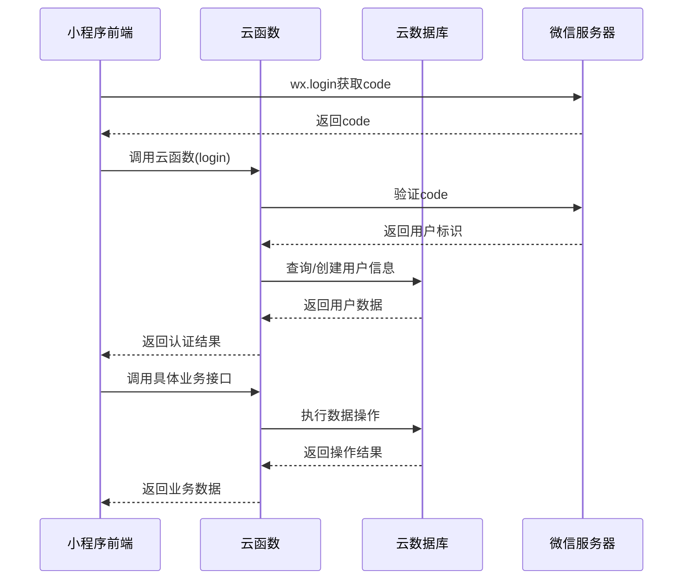
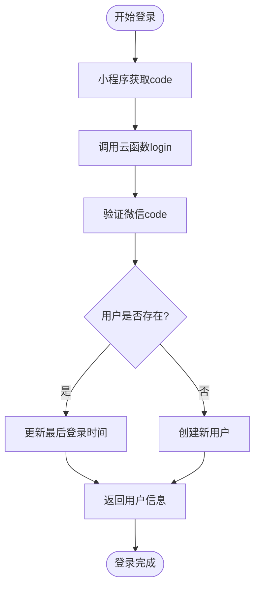
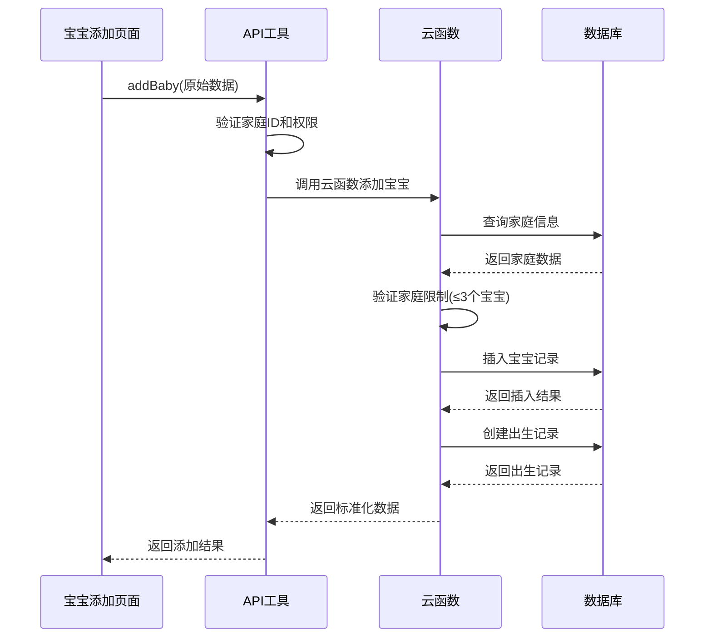
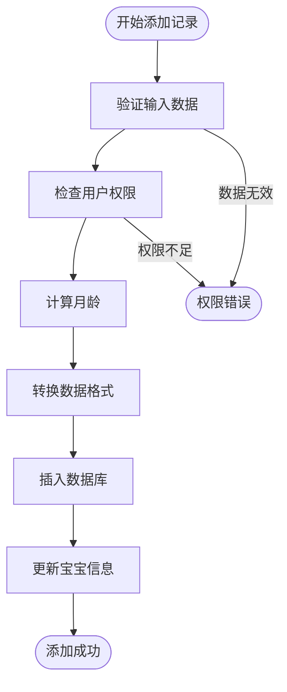
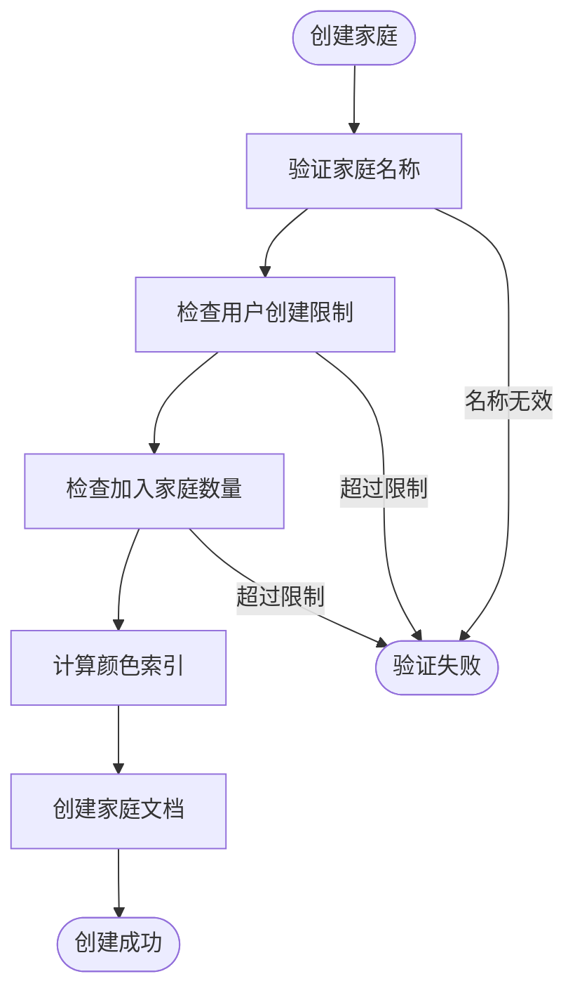
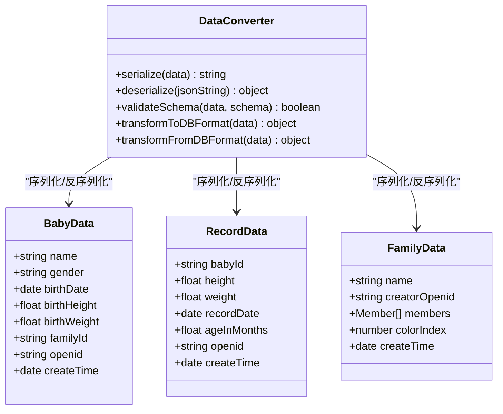
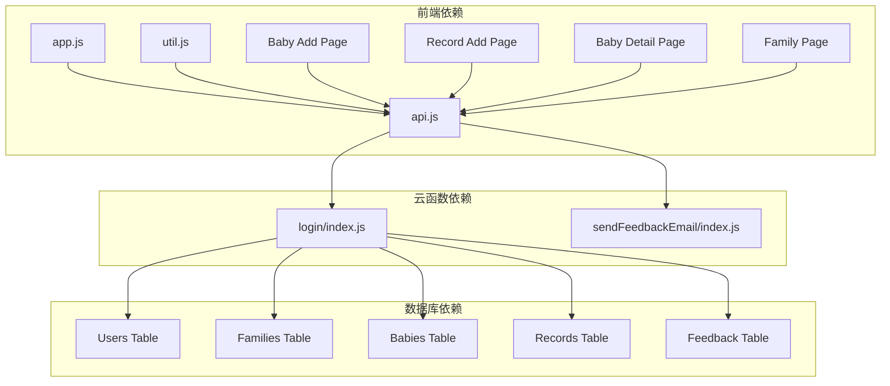

# 数据转换与格式化

<cite>
**本文档引用的文件**
- [app.js](file://miniprogram/app.js)
- [util.js](file://miniprogram/utils/util.js)
- [api.js](file://miniprogram/utils/api.js)
- [login/index.js](file://cloudfunctions/login/index.js)
- [sendFeedbackEmail/index.js](file://cloudfunctions/sendFeedbackEmail/index.js)
- [baby-add.js](file://miniprogram/pages/baby-add/baby-add.js)
- [record-add.js](file://miniprogram/pages/record-add/record-add.js)
- [baby-detail.js](file://miniprogram/pages/baby-detail/baby-detail.js)
- [family.js](file://miniprogram/pages/family/family.js)
</cite>

## 目录
1. [简介](#简介)
2. [项目结构](#项目结构)
3. [核心组件](#核心组件)
4. [架构概览](#架构概览)
5. [详细组件分析](#详细组件分析)
6. [依赖关系分析](#依赖关系分析)
7. [性能考虑](#性能考虑)
8. [故障排除指南](#故障排除指南)
9. [结论](#结论)

## 简介

本项目是一个基于微信小程序的婴儿成长追踪应用，实现了完整的小程序前端与云函数之间的数据转换与格式化流程。系统通过云函数作为数据处理层，实现了用户认证、权限验证、数据格式化、序列化和反序列化等功能。

## 项目结构

项目采用典型的微信小程序三层架构：
- **前端层**：小程序页面和工具类，负责用户交互和数据展示
- **云函数层**：云端逻辑处理，负责数据验证、权限控制和业务逻辑
- **数据存储层**：云数据库，存储用户、家庭、宝宝和记录数据

**图表来源**
- [app.js:1-56](file://miniprogram/app.js#L1-L56)
- [api.js:1-879](file://miniprogram/utils/api.js#L1-L879)
- [login/index.js:1-814](file://cloudfunctions/login/index.js#L1-L814)

**章节来源**
- [app.js:1-56](file://miniprogram/app.js#L1-L56)
- [api.js:1-879](file://miniprogram/utils/api.js#L1-L879)

## 核心组件

### 数据验证与格式化工具

系统提供了完整的数据验证和格式化工具集：

#### 时间格式化
- **日期格式转换**：将JavaScript Date对象转换为"年/月/日"格式
- **日期字符串处理**：支持从UI输入的"YYYY-MM-DD"格式转换为数据库存储格式

#### 年龄计算
- **精确年龄计算**：支持年、月、日的精确计算
- **年龄月份换算**：按15天为0.5个月的规则进行近似换算
- **年龄字符串格式化**：将年龄对象转换为可读的中文字符串

#### 权限验证
- **角色等级系统**：viewer(1) < caretaker(2) < guardian(3)
- **多层级权限检查**：支持按宝宝或按家庭的权限验证
- **实时权限查询**：动态检查用户在特定家庭中的权限级别

**章节来源**
- [util.js:1-55](file://miniprogram/utils/util.js#L1-L55)
- [api.js:782-852](file://miniprogram/utils/api.js#L782-L852)

### 云函数数据处理

云函数作为数据处理的核心层，实现了以下功能：

#### 用户认证与管理
- **微信登录集成**：通过wx.login获取code并调用云函数
- **用户信息同步**：自动创建或更新用户信息
- **会话管理**：维护用户登录状态和权限信息

#### 家庭数据管理
- **家庭创建验证**：限制每个用户只能创建一个家庭
- **成员数量控制**：限制每个家庭最多3个宝宝
- **邀请码机制**：安全的成员邀请和加入流程

#### 宝宝数据处理
- **姓名长度验证**：限制宝宝姓名最多7个字符
- **出生信息处理**：身高体重等出生数据的标准化
- **家庭关联**：确保宝宝与正确家庭的关联

#### 记录数据标准化
- **年龄计算**：根据录入日期计算准确的月龄
- **数据完整性**：确保身高体重等关键字段的有效性
- **权限控制**：严格的数据访问和修改权限

**章节来源**
- [login/index.js:22-800](file://cloudfunctions/login/index.js#L22-L800)

## 架构概览

系统采用前后端分离的架构设计，通过云函数实现数据转换和业务逻辑处理。

**图表来源**
- [app.js:29-54](file://miniprogram/app.js#L29-L54)
- [login/index.js:22-800](file://cloudfunctions/login/index.js#L22-L800)

## 详细组件分析

### 用户认证与数据转换

#### 登录流程的数据转换
小程序前端通过`wx.login`获取临时登录凭证，然后调用云函数进行用户认证。云函数接收前端传入的`code`参数，通过微信服务器验证后返回用户标识。

**图表来源**
- [app.js:29-54](file://miniprogram/app.js#L29-L54)
- [login/index.js:763-800](file://cloudfunctions/login/index.js#L763-L800)

#### 用户信息格式化
云函数对用户信息进行标准化处理，包括：
- **用户标识**：提取并验证OPENID
- **基本信息**：生成随机昵称，设置创建和最后登录时间
- **权限初始化**：为新用户提供基础权限设置

**章节来源**
- [app.js:29-54](file://miniprogram/app.js#L29-L54)
- [login/index.js:763-800](file://cloudfunctions/login/index.js#L763-L800)

### 宝宝数据格式化与验证

#### 宝宝信息添加流程
当用户添加宝宝时，系统执行以下数据转换和验证步骤：

**图表来源**
- [api.js:149-210](file://miniprogram/utils/api.js#L149-L210)
- [login/index.js:483-510](file://cloudfunctions/login/index.js#L483-L510)

#### 宝宝数据验证规则
系统实施了严格的宝宝数据验证：
- **姓名长度限制**：最多7个字符，不能为空
- **家庭数量限制**：每个家庭最多3个宝宝
- **权限验证**：只有守护者(一级助教)可以修改宝宝信息
- **数据完整性**：确保出生日期、身高、体重等关键字段有效

**章节来源**
- [api.js:149-210](file://miniprogram/utils/api.js#L149-L210)
- [login/index.js:702-738](file://cloudfunctions/login/index.js#L702-L738)

### 记录数据标准化

#### 记录添加的数据转换
记录添加流程实现了精确的数据转换：

**图表来源**
- [api.js:299-346](file://miniprogram/utils/api.js#L299-L346)
- [util.js:8-38](file://miniprogram/utils/util.js#L8-L38)

#### 记录数据格式化
系统对记录数据进行以下格式化处理：
- **年龄计算**：基于出生日期和记录日期计算精确月龄
- **数据类型转换**：将字符串转换为数值类型(float)
- **日期格式统一**：将"YYYY-MM-DD"转换为"YYYY/MM/DD"格式
- **权限检查**：确保只有有权限的用户可以添加记录

**章节来源**
- [api.js:299-346](file://miniprogram/utils/api.js#L299-L346)
- [util.js:8-38](file://miniprogram/utils/util.js#L8-L38)

### 家庭数据管理

#### 家庭创建的数据验证
家庭创建流程包含多重验证机制：

**图表来源**
- [login/index.js:95-151](file://cloudfunctions/login/index.js#L95-L151)

#### 家庭成员权限管理
系统实现了灵活的权限管理系统：
- **角色定义**：viewer(围观)、caretaker(二级助教)、guardian(一级助教)
- **权限继承**：用户在不同家庭中可能有不同的权限级别
- **权限升级**：一级助教可以修改其他成员的权限
- **权限降级**：严格控制权限变更的范围和条件

**章节来源**
- [login/index.js:187-266](file://cloudfunctions/login/index.js#L187-L266)
- [api.js:782-852](file://miniprogram/utils/api.js#L782-L852)

### 数据序列化与反序列化

#### JSON数据处理
系统在前后端数据传输中采用了标准的JSON序列化机制：

**图表来源**
- [api.js:149-210](file://miniprogram/utils/api.js#L149-L210)
- [login/index.js:483-510](file://cloudfunctions/login/index.js#L483-L510)

#### 日期格式处理
系统实现了统一的日期处理机制：
- **前端显示**：使用"YYYY/MM/DD"格式显示给用户
- **数据库存储**：使用JavaScript Date对象存储
- **跨平台转换**：在小程序和云函数之间进行格式转换
- **时区处理**：确保日期计算的准确性

**章节来源**
- [util.js:1-6](file://miniprogram/utils/util.js#L1-L6)
- [baby-add.js:98-101](file://miniprogram/pages/baby-add/baby-add.js#L98-L101)

### 数值精度控制

#### 浮点数处理
系统对数值数据进行了精确的处理：
- **身高体重**：转换为浮点数类型，保留合理精度
- **年龄计算**：使用整数月龄，按15天为0.5个月的规则
- **图表数据**：确保图表渲染时的数值精度

#### 数据类型转换
- **字符串到数值**：使用parseFloat确保数值有效性
- **数值到字符串**：使用toFixed控制显示精度
- **布尔值处理**：严格区分true/false和"true"/"false"

**章节来源**
- [api.js:199-202](file://miniprogram/utils/api.js#L199-L202)
- [record-add.js:96-99](file://miniprogram/pages/record-add/record-add.js#L96-L99)

## 依赖关系分析

系统的关键依赖关系如下：

**图表来源**
- [app.js:1-56](file://miniprogram/app.js#L1-L56)
- [api.js:1-879](file://miniprogram/utils/api.js#L1-L879)
- [login/index.js:1-814](file://cloudfunctions/login/index.js#L1-L814)

**章节来源**
- [app.js:1-56](file://miniprogram/app.js#L1-L56)
- [api.js:1-879](file://miniprogram/utils/api.js#L1-L879)

## 性能考虑

### 数据转换性能优化

#### 缓存策略
- **用户信息缓存**：登录后缓存用户信息到全局状态
- **家庭信息缓存**：缓存用户所在家庭列表，减少重复查询
- **权限信息缓存**：缓存权限检查结果，避免重复验证

#### 批量操作
- **批量数据查询**：使用`_.in`操作符批量查询相关数据
- **事务处理**：对需要一致性的操作使用数据库事务
- **异步处理**：非关键操作使用异步方式，提升用户体验

#### 内存管理
- **数据分页**：大量记录采用分页加载
- **及时释放**：不再使用的数据及时从内存中释放
- **对象复用**：复用相似的对象结构，减少内存分配

### 网络传输优化

#### 数据压缩
- **字段精简**：只传输必要的字段数据
- **格式优化**：使用紧凑的JSON格式
- **增量更新**：支持部分字段的增量更新

#### 连接管理
- **连接池**：合理管理数据库连接
- **超时控制**：设置合理的请求超时时间
- **重试机制**：网络异常时的智能重试

## 故障排除指南

### 常见问题及解决方案

#### 登录认证问题
**问题描述**：用户无法正常登录或频繁掉线
**可能原因**：
- 微信服务器验证失败
- 云函数环境配置错误
- 网络连接不稳定

**解决步骤**：
1. 检查小程序基础库版本是否满足要求
2. 验证云函数环境配置
3. 查看云函数日志获取详细错误信息
4. 重新部署云函数

#### 数据验证错误
**问题描述**：添加宝宝或记录时出现验证错误
**可能原因**：
- 输入数据格式不正确
- 权限不足
- 数据库约束冲突

**解决步骤**：
1. 检查输入数据的格式和范围
2. 验证用户权限级别
3. 查看具体的错误消息
4. 联系系统管理员

#### 数据转换异常
**问题描述**：数据显示格式不正确或计算错误
**可能原因**：
- 日期格式转换错误
- 数值精度丢失
- 字符串编码问题

**解决步骤**：
1. 检查日期格式转换逻辑
2. 验证数值类型转换
3. 确认字符串编码一致性
4. 查看具体的转换日志

### 调试技巧

#### 日志记录
- 在关键节点添加详细的日志输出
- 记录数据转换前后的状态
- 捕获并记录异常信息

#### 数据验证
- 在数据进入系统前进行格式验证
- 对关键字段进行业务规则检查
- 实施数据完整性约束

#### 性能监控
- 监控关键操作的响应时间
- 分析数据转换的性能瓶颈
- 优化热点数据的访问模式

**章节来源**
- [login/index.js:763-800](file://cloudfunctions/login/index.js#L763-L800)
- [api.js:149-210](file://miniprogram/utils/api.js#L149-L210)

## 结论

本项目实现了完整的小程序数据转换与格式化体系，通过前后端分离的设计模式，有效地处理了用户认证、权限验证、数据格式化和序列化等复杂场景。

### 主要成就

1. **完善的权限体系**：实现了三级权限管理，确保数据安全
2. **严格的数据验证**：在多个层面实施数据验证，保证数据质量
3. **灵活的数据转换**：支持多种数据格式的转换和标准化
4. **高效的性能表现**：通过缓存和批量操作提升系统性能

### 技术亮点

- **云函数抽象**：将复杂的业务逻辑集中在云函数中
- **数据格式统一**：建立了完整的数据格式转换规范
- **权限控制严密**：实现了细粒度的权限管理机制
- **错误处理完善**：提供了全面的错误处理和恢复机制

### 改进建议

1. **增加数据备份**：定期备份重要数据，防止数据丢失
2. **优化缓存策略**：根据使用模式调整缓存策略
3. **增强监控告警**：建立更完善的系统监控和告警机制
4. **扩展测试覆盖**：增加自动化测试，提高代码质量

通过持续的优化和完善，该系统能够为用户提供稳定可靠的服务，同时为后续的功能扩展奠定坚实的基础。