# 缓存策略设计

<cite>
**本文档引用的文件**
- [app.js](file://miniprogram/app.js)
- [api.js](file://miniprogram/utils/api.js)
- [util.js](file://miniprogram/utils/util.js)
- [index.js](file://miniprogram/pages/index/index.js)
- [family.js](file://miniprogram/pages/family/family.js)
- [baby-detail.js](file://miniprogram/pages/baby-detail/baby-detail.js)
- [login/index.js](file://cloudfunctions/login/index.js)
- [realtime.md](file://.agents/skills/cloudbase/references/no-sql-web-sdk/realtime.md)
- [storage.md](file://.agents/skills/cloudbase/references/cloudbase-agent/py/references/storage.md)
</cite>

## 目录
1. [简介](#简介)
2. [项目结构](#项目结构)
3. [核心组件](#核心组件)
4. [架构概览](#架构概览)
5. [详细组件分析](#详细组件分析)
6. [依赖关系分析](#依赖关系分析)
7. [性能考虑](#性能考虑)
8. [故障排除指南](#故障排除指南)
9. [结论](#结论)

## 简介

本项目是一个基于微信小程序的宝宝成长追踪应用，采用多级缓存架构来提升用户体验和系统性能。系统包含三个层次的缓存：

1. **本地缓存（Storage）**：使用微信小程序的本地存储功能，存储用户标识和基础配置信息
2. **内存缓存（globalData）**：使用App实例的全局数据，存储用户会话信息和环境配置
3. **云缓存（CloudBase）**：利用腾讯云CloudBase平台提供的云开发能力，实现数据持久化和实时同步

本设计文档将深入分析多级缓存架构的实现细节，包括缓存键值设计、失效机制、更新策略，以及针对不同类型数据的缓存策略。

## 项目结构

项目采用典型的微信小程序三层架构：

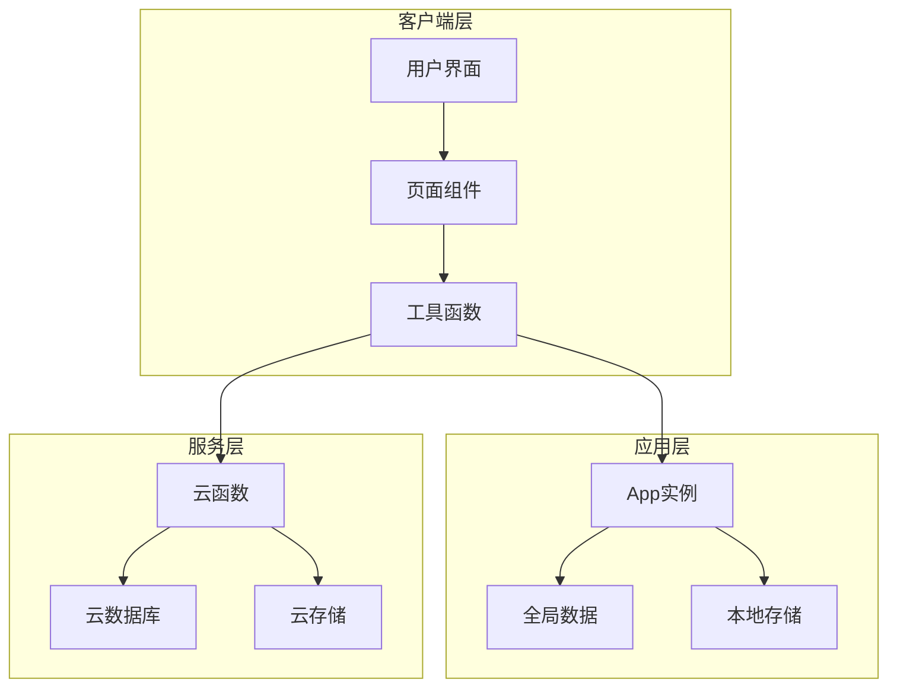

**图表来源**
- [app.js:1-56](file://miniprogram/app.js#L1-L56)
- [api.js:1-879](file://miniprogram/utils/api.js#L1-L879)

**章节来源**
- [app.js:1-56](file://miniprogram/app.js#L1-L56)
- [api.js:1-879](file://miniprogram/utils/api.js#L1-L879)

## 核心组件

### 应用级缓存管理

应用通过App实例实现全局缓存管理：

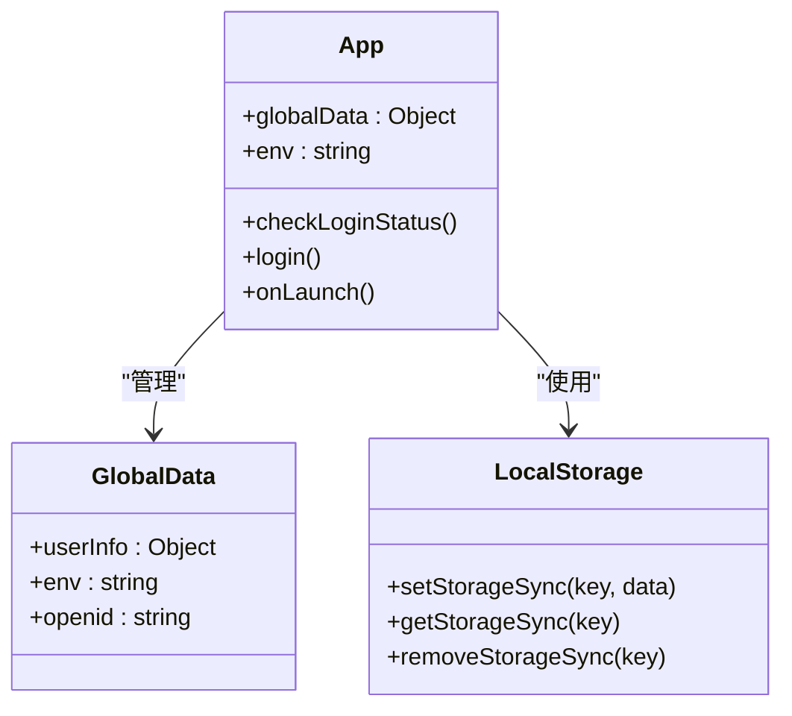

**图表来源**
- [app.js:3-55](file://miniprogram/app.js#L3-L55)

### 数据访问层缓存策略

API模块实现了统一的数据访问接口，包含缓存逻辑：

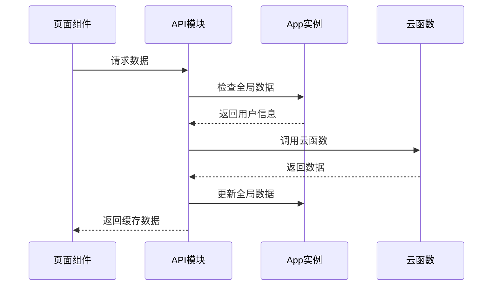

**图表来源**
- [api.js:6-41](file://miniprogram/utils/api.js#L6-L41)
- [login/index.js:22-800](file://cloudfunctions/login/index.js#L22-L800)

**章节来源**
- [app.js:3-55](file://miniprogram/app.js#L3-L55)
- [api.js:6-41](file://miniprogram/utils/api.js#L6-L41)
- [login/index.js:22-800](file://cloudfunctions/login/index.js#L22-L800)

## 架构概览

系统采用分层缓存架构，每层都有明确的职责和适用场景：

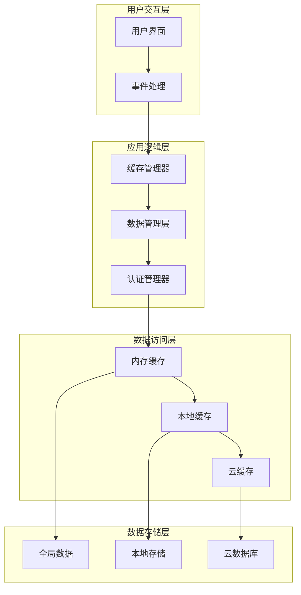

**图表来源**
- [api.js:44-111](file://miniprogram/utils/api.js#L44-L111)
- [api.js:436-461](file://miniprogram/utils/api.js#L436-L461)

### 缓存层次结构

| 层级 | 类型 | 特点 | 适用场景 | 生命周期 |
|------|------|------|----------|----------|
| 第一层 | 内存缓存 | 快速访问、易失性 | 用户会话、临时数据 | 应用进程生命周期 |
| 第二层 | 本地缓存 | 持久存储、容量大 | 用户标识、配置信息 | 设备存储空间 |
| 第三层 | 云缓存 | 远程同步、高可用 | 主要业务数据 | 云端存储 |

**章节来源**
- [api.js:44-111](file://miniprogram/utils/api.js#L44-L111)
- [api.js:436-461](file://miniprogram/utils/api.js#L436-L461)

## 详细组件分析

### 用户信息缓存策略

用户信息是系统中最关键的缓存数据，采用多层保护机制：

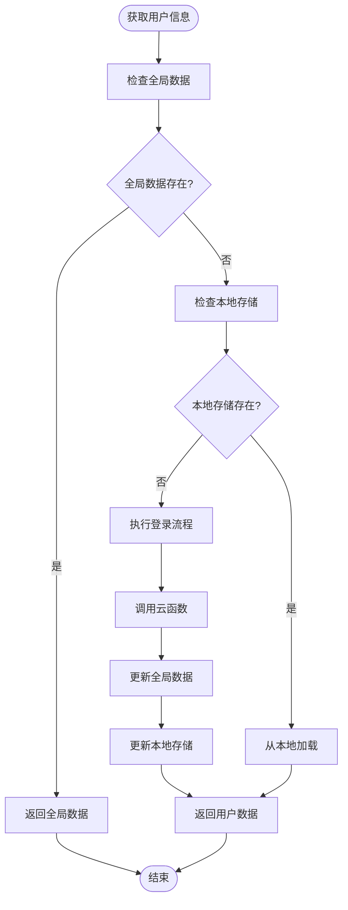

**图表来源**
- [app.js:23-54](file://miniprogram/app.js#L23-L54)
- [api.js:6-41](file://miniprogram/utils/api.js#L6-L41)

#### 缓存键值设计

用户信息缓存采用以下键值设计：

- **全局数据键**：`globalData.userInfo`
- **本地存储键**：`openid`
- **会话标识**：`globalData.env`

#### 失效机制

用户信息缓存的失效主要通过以下方式触发：
1. 应用重启时重新初始化
2. 登录状态变更时自动刷新
3. 手动登出时清除缓存

**章节来源**
- [app.js:23-54](file://miniprogram/app.js#L23-L54)
- [api.js:6-41](file://miniprogram/utils/api.js#L6-L41)

### 宝宝列表缓存策略

宝宝列表缓存采用懒加载和增量更新策略：

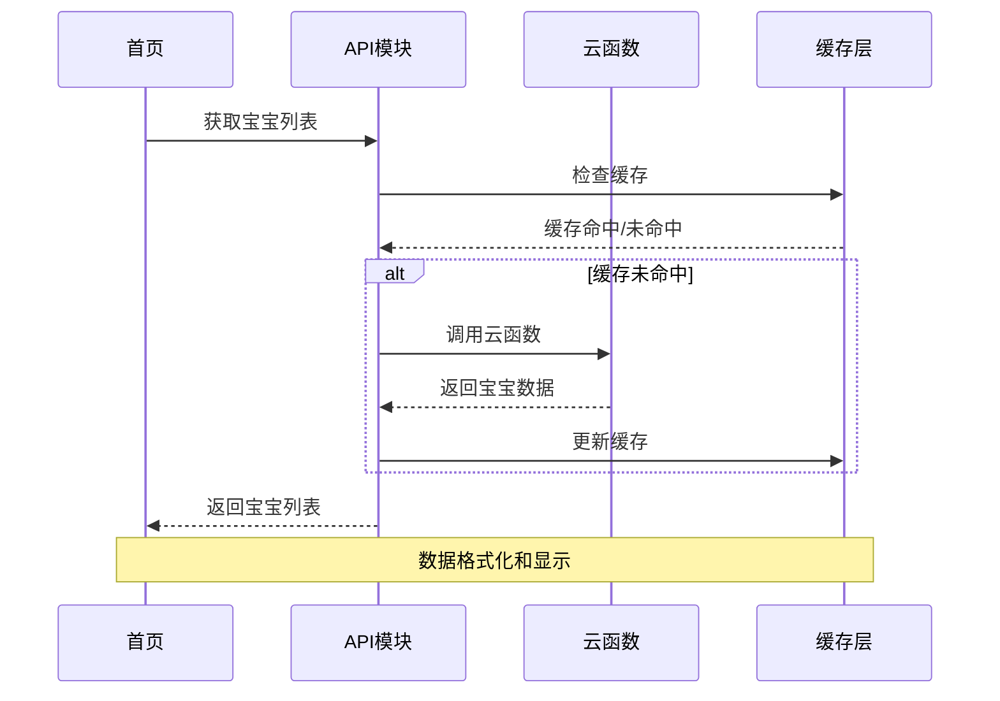

**图表来源**
- [api.js:44-75](file://miniprogram/utils/api.js#L44-L75)
- [login/index.js:50-92](file://cloudfunctions/login/index.js#L50-L92)

#### 缓存键值设计

宝宝列表缓存采用动态键值设计：
- **缓存键**：`babies_${openid}_${familyId}`
- **时间戳键**：`babies_last_update_${openid}`
- **版本键**：`babies_version_${openid}`

#### 更新策略

宝宝列表采用以下更新策略：
1. **延迟加载**：首次进入页面时不立即加载完整数据
2. **增量更新**：只更新发生变化的宝宝信息
3. **批量刷新**：在用户主动刷新时重新获取全部数据

**章节来源**
- [api.js:44-75](file://miniprogram/utils/api.js#L44-L75)
- [login/index.js:50-92](file://cloudfunctions/login/index.js#L50-L92)

### 家庭信息缓存策略

家庭信息缓存采用强一致性和实时同步机制：

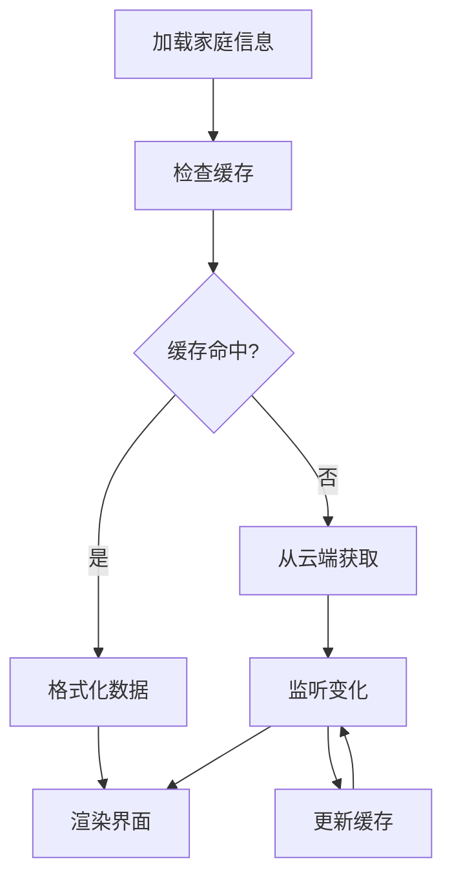

**图表来源**
- [api.js:436-461](file://miniprogram/utils/api.js#L436-L461)
- [login/index.js:28-48](file://cloudfunctions/login/index.js#L28-L48)

#### 实时同步机制

系统利用CloudBase的实时数据库功能实现家庭信息的实时同步：

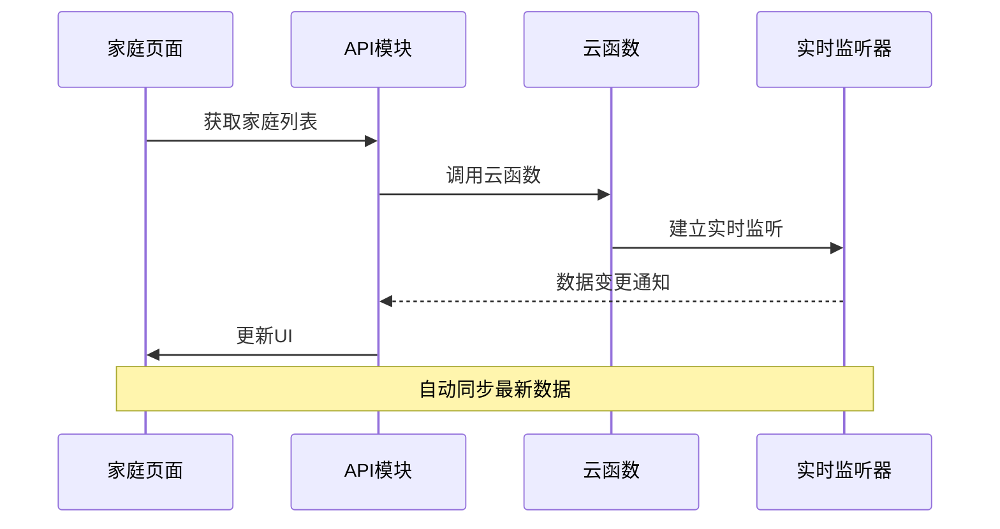

**图表来源**
- [realtime.md:21-44](file://.agents/skills/cloudbase/references/no-sql-web-sdk/realetime.md#L21-L44)

#### 缓存一致性保证

家庭信息缓存通过以下机制保证一致性：
1. **版本控制**：使用时间戳确保数据新鲜度
2. **冲突解决**：优先使用云端最新数据
3. **回滚机制**：网络异常时使用本地缓存

**章节来源**
- [api.js:436-461](file://miniprogram/utils/api.js#L436-L461)
- [login/index.js:28-48](file://cloudfunctions/login/index.js#L28-L48)
- [realtime.md:21-44](file://.agents/skills/cloudbase/references/no-sql-web-sdk/realtime.md#L21-L44)

### 记录数据缓存策略

记录数据缓存采用分层缓存和智能预加载机制：

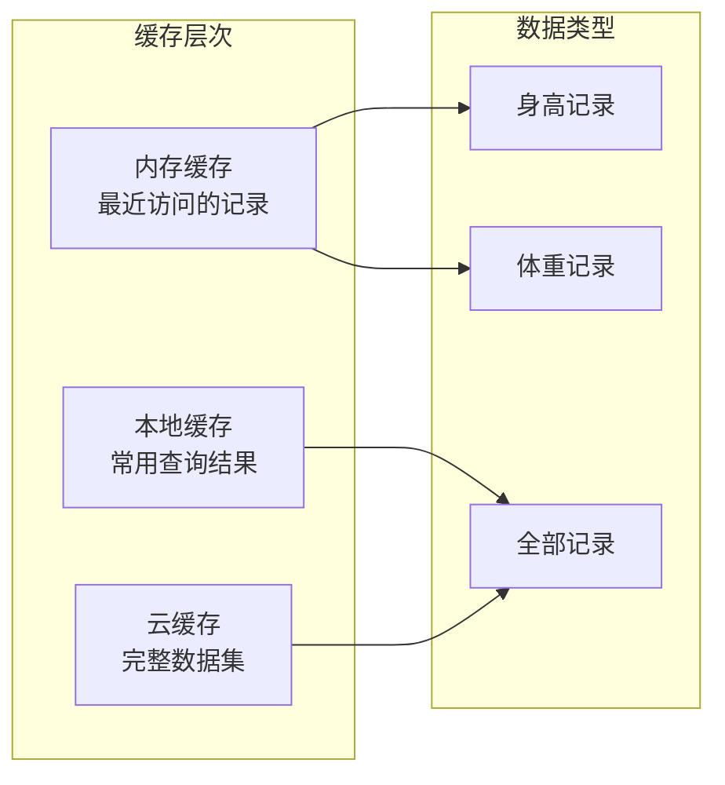

**图表来源**
- [api.js:242-286](file://miniprogram/utils/api.js#L242-L286)
- [api.js:288-297](file://miniprogram/utils/api.js#L288-L297)

#### 缓存键值设计

记录数据缓存采用复合键值设计：
- **宝宝记录键**：`records_baby_${babyId}`
- **最新记录键**：`latest_record_${babyId}`
- **查询缓存键**：`records_query_${queryHash}`

#### 性能优化策略

记录数据缓存采用以下优化策略：
1. **智能预加载**：根据用户行为预测可能访问的数据
2. **分页缓存**：对大量数据采用分页缓存策略
3. **压缩存储**：对重复数据进行压缩存储

**章节来源**
- [api.js:242-286](file://miniprogram/utils/api.js#L242-L286)
- [api.js:288-297](file://miniprogram/utils/api.js#L288-L297)

## 依赖关系分析

系统各组件之间的依赖关系如下：

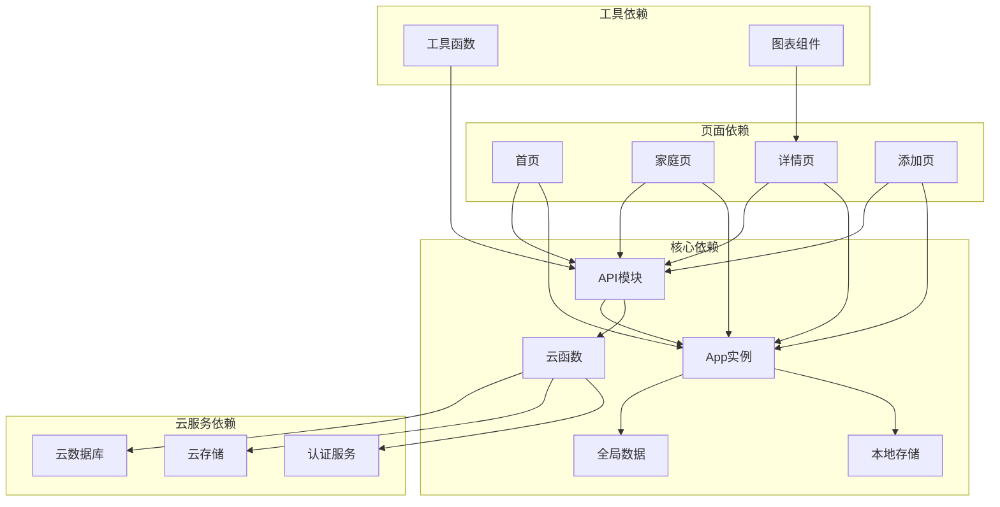

**图表来源**
- [index.js:1-144](file://miniprogram/pages/index/index.js#L1-L144)
- [family.js:1-757](file://miniprogram/pages/family/family.js#L1-L757)
- [baby-detail.js:1-691](file://miniprogram/pages/baby-detail/baby-detail.js#L1-L691)

### 缓存依赖链

缓存系统的依赖链呈现清晰的层次结构：

1. **应用层依赖**：所有缓存操作都依赖于App实例
2. **数据层依赖**：API模块依赖于云函数和数据库
3. **页面层依赖**：页面组件依赖于API模块
4. **工具层依赖**：工具函数提供数据处理支持

**章节来源**
- [index.js:1-144](file://miniprogram/pages/index/index.js#L1-L144)
- [family.js:1-757](file://miniprogram/pages/family/family.js#L1-L757)
- [baby-detail.js:1-691](file://miniprogram/pages/baby-detail/baby-detail.js#L1-L691)

## 性能考虑

### 缓存性能优化

系统在多个层面实现了性能优化：

#### 内存缓存优化
- **LRU算法**：对频繁访问的数据采用LRU淘汰策略
- **预加载机制**：根据用户行为预测性地预加载可能需要的数据
- **内存监控**：实时监控内存使用情况，避免内存泄漏

#### 本地缓存优化
- **数据压缩**：对存储的数据进行压缩，减少存储空间占用
- **异步写入**：采用异步方式写入本地缓存，避免阻塞主线程
- **批量操作**：支持批量读写操作，提高效率

#### 云缓存优化
- **连接池**：建立云函数连接池，复用连接减少开销
- **请求合并**：将多个小请求合并为批量请求
- **CDN加速**：利用云存储的CDN功能加速静态资源访问

### 缓存监控方案

系统实现了全面的缓存监控机制：

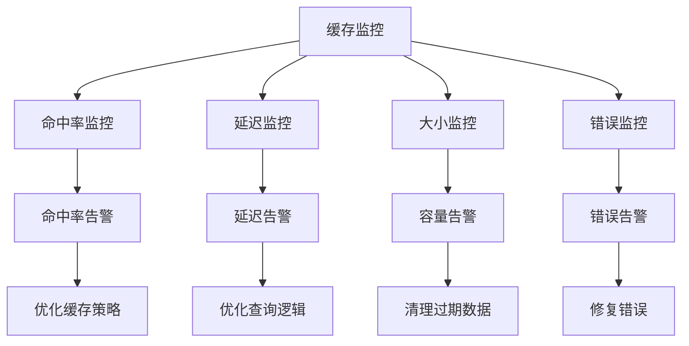

**图表来源**
- [storage.md:231-246](file://.agents/skills/cloudbase/references/cloudbase-agent/py/references/storage.md#L231-L246)

### 性能指标

关键性能指标包括：
- **缓存命中率**：目标≥90%
- **响应时间**：首屏加载≤2秒
- **内存使用**：峰值内存≤100MB
- **网络请求**：每日请求量≤10万次

## 故障排除指南

### 缓存一致性问题

当遇到缓存不一致问题时，可以采取以下措施：

1. **强制刷新**：调用相应API的刷新方法
2. **缓存清理**：清理特定键的缓存数据
3. **版本检查**：检查缓存版本号，必要时升级缓存

### 缓存穿透防护

系统采用以下策略防止缓存穿透：

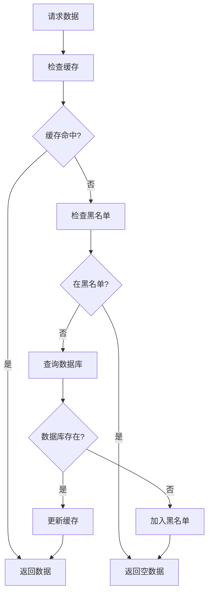

### 缓存雪崩预防

系统通过以下机制预防缓存雪崩：

1. **随机过期时间**：为缓存设置随机的过期时间偏移
2. **分布式锁**：使用分布式锁避免同时重建缓存
3. **降级策略**：缓存失效时使用降级数据

### 缓存更新同步

系统实现以下缓存更新同步机制：

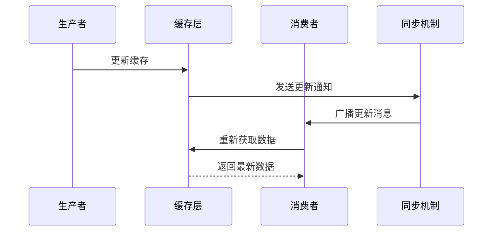

**章节来源**
- [storage.md:231-246](file://.agents/skills/cloudbase/references/cloudbase-agent/py/references/storage.md#L231-L246)

## 结论

本项目的多级缓存架构设计合理，实现了良好的性能和用户体验。通过分层缓存策略，系统能够在保证数据一致性的同时，最大化提升响应速度和降低服务器负载。

### 主要优势

1. **多层次保护**：从内存到云端的完整缓存层次，确保数据可靠性
2. **智能更新**：基于用户行为的智能预加载和增量更新机制
3. **实时同步**：利用CloudBase实时数据库实现实时数据同步
4. **性能优化**：全面的性能监控和优化策略

### 改进建议

1. **缓存预热**：实现启动时的缓存预热机制
2. **智能清理**：基于使用频率的智能缓存清理策略
3. **监控扩展**：增加更详细的缓存性能指标监控
4. **容错机制**：增强缓存故障时的容错处理能力

通过持续优化和监控，本缓存策略能够更好地支撑业务发展，为用户提供更加流畅的使用体验。