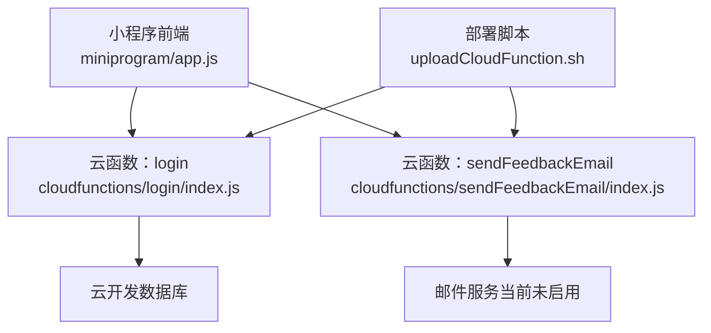
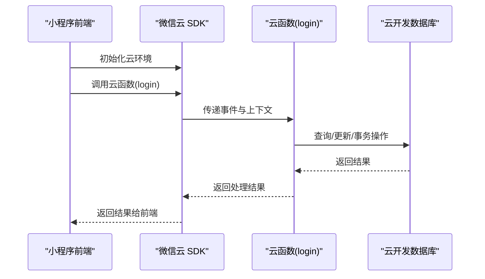
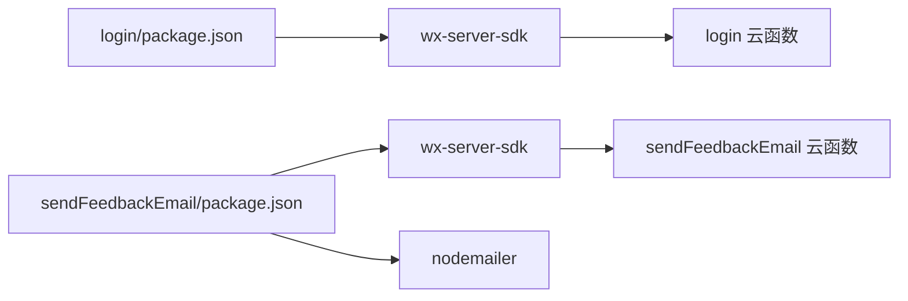

# 云函数问题

<cite>
**本文引用的文件**
- [cloudfunctions/login/index.js](file://cloudfunctions/login/index.js)
- [cloudfunctions/sendFeedbackEmail/index.js](file://cloudfunctions/sendFeedbackEmail/index.js)
- [cloudfunctions/login/package.json](file://cloudfunctions/login/package.json)
- [cloudfunctions/sendFeedbackEmail/package.json](file://cloudfunctions/sendFeedbackEmail/package.json)
- [uploadCloudFunction.sh](file://uploadCloudFunction.sh)
- [miniprogram/app.js](file://miniprogram/app.js)
- [.agents\skills\cloudbase\references\cloud-functions\checklist.md](file://.agents\skills\cloudbase\references\cloud-functions\checklist.md)
- [.agents\skills\cloudbase\references\cloudbase-agent\py\references\observability.md](file://.agents\skills\cloudbase\references\cloudbase-agent\py\references\observability.md)
</cite>

## 目录
1. [简介](#简介)
2. [项目结构](#项目结构)
3. [核心组件](#核心组件)
4. [架构总览](#架构总览)
5. [详细组件分析](#详细组件分析)
6. [依赖关系分析](#依赖关系分析)
7. [性能考虑](#性能考虑)
8. [故障排除指南](#故障排除指南)
9. [结论](#结论)
10. [附录](#附录)

## 简介
本指南聚焦于微信小程序项目中的云函数问题排查与优化，覆盖部署失败、运行时错误、性能瓶颈以及与数据库交互的关键场景。结合项目现有云函数实现与平台技能文档，提供可操作的诊断流程、优化建议与最佳实践。

## 项目结构
该项目包含两个云函数示例与前端调用入口：
- 登录云函数：负责用户登录态校验、用户信息管理、家庭与宝宝数据的增删改查、权限控制与事务处理等。
- 发送反馈邮件云函数：接收反馈数据并进行简单处理（当前未实际发送邮件）。
- 前端小程序：初始化云环境并调用云函数完成登录。
- 部署脚本：提供云函数部署命令模板。
- 技能参考：云函数执行清单与可观测性参考，用于规范开发与运维。

图表来源
- [miniprogram/app.js:28-54](file://miniprogram/app.js#L28-L54)
- [cloudfunctions/login/index.js:22-814](file://cloudfunctions/login/index.js#L22-L814)
- [cloudfunctions/sendFeedbackEmail/index.js:6-20](file://cloudfunctions/sendFeedbackEmail/index.js#L6-L20)
- [uploadCloudFunction.sh:1-1](file://uploadCloudFunction.sh#L1-L1)

章节来源
- [miniprogram/app.js:1-56](file://miniprogram/app.js#L1-L56)
- [cloudfunctions/login/index.js:1-814](file://cloudfunctions/login/index.js#L1-L814)
- [cloudfunctions/sendFeedbackEmail/index.js:1-21](file://cloudfunctions/sendFeedbackEmail/index.js#L1-L21)
- [uploadCloudFunction.sh:1-1](file://uploadCloudFunction.sh#L1-L1)

## 核心组件
- 登录云函数（login）
  - 功能：根据小程序传入的临时登录凭证换取用户标识，维护用户信息，处理家庭、宝宝、记录等多表业务逻辑，包含权限校验与事务保证。
  - 关键点：多集合查询、排序与聚合、事务原子性、权限模型（创建者/一级助教/二级助教）、邀请码机制。
- 发送反馈邮件云函数（sendFeedbackEmail）
  - 功能：接收反馈数据并返回结果；当前未集成邮件发送逻辑。
- 小程序前端（app.js）
  - 功能：初始化云环境并调用 login 云函数完成登录态获取与用户信息缓存。
- 部署脚本（uploadCloudFunction.sh）
  - 功能：提供云函数批量部署命令模板，便于统一发布。

章节来源
- [cloudfunctions/login/index.js:22-814](file://cloudfunctions/login/index.js#L22-L814)
- [cloudfunctions/sendFeedbackEmail/index.js:6-20](file://cloudfunctions/sendFeedbackEmail/index.js#L6-L20)
- [miniprogram/app.js:28-54](file://miniprogram/app.js#L28-L54)
- [uploadCloudFunction.sh:1-1](file://uploadCloudFunction.sh#L1-L1)

## 架构总览
云函数作为小程序与云开发数据库之间的桥梁，承担鉴权、业务编排与数据一致性保障。前端通过 wx.cloud.callFunction 调用后端云函数，云函数内部使用 wx-server-sdk 进行数据库操作与上下文获取。

图表来源
- [miniprogram/app.js:28-54](file://miniprogram/app.js#L28-L54)
- [cloudfunctions/login/index.js:22-814](file://cloudfunctions/login/index.js#L22-L814)

## 详细组件分析

### 登录云函数（login）分析
- 入口与上下文
  - 使用 wx-server-sdk 初始化，并通过 cloud.getWXContext 获取用户标识与环境信息。
- 主要业务分支
  - 家庭与宝宝查询、创建与更新、成员权限变更、邀请码生成与清理、记录删除、权限校验与事务处理等。
- 数据库交互
  - 多集合联查、排序、聚合、事务原子性、条件查询与更新。
- 错误处理
  - 统一 try/catch 包裹，捕获异常后返回结构化错误信息，便于前端展示与日志追踪。

```mermaid
flowchart TD
Start(["进入云函数"]) --> GetCtx["获取微信上下文"]
GetCtx --> Switch{"根据 action 分支"}
Switch --> |getFamilies| QFams["查询用户所在家庭"]
Switch --> |getBabies| QBab["查询用户所在家庭并关联宝宝"]
Switch --> |createFamily| CFam["校验限制并创建家庭"]
Switch --> |updateFamilyName| UFam["校验权限并更新名称"]
Switch --> |updateMemberPermission| UPerm["校验权限并更新成员权限"]
Switch --> |removeFamilyMember| RMem["校验权限并移除成员"]
Switch --> |joinFamily| JFam["校验邀请码并加入家庭"]
Switch --> |leaveFamily| LFam["创建者删除家庭或普通成员退出"]
Switch --> |updateMemberInfo| UInf["更新成员信息并同步到其他家庭"]
Switch --> |deleteBaby| TDel["事务删除宝宝及关联记录"]
Switch --> |deleteRecord| RDel["校验权限后删除记录"]
Switch --> |getBabyById| GBaby["校验权限后查询宝宝信息"]
Switch --> |getRecordsByBabyId| GRc["查询宝宝记录并排序"]
Switch --> |getRecordById| GRcId["校验权限后查询单条记录"]
Switch --> |getFamilyById| GFam["校验成员身份后查询家庭信息"]
Switch --> |createInviteCode| IC["生成邀请码并异步清理过期"]
Switch --> |updateBabyName| NB["校验权限并更新宝宝姓名"]
Switch --> |cleanExpiredInviteCodes| CIC["清理过期邀请码"]
Switch --> |登录| Login["登录态换取用户信息并创建/更新用户记录"]
QFams --> End(["返回结果"])
QBab --> End
CFam --> End
UFam --> End
UPerm --> End
RMem --> End
JFam --> End
LFam --> End
UInf --> End
TDel --> End
RDel --> End
GBaby --> End
GRc --> End
GRcId --> End
GFam --> End
IC --> End
NB --> End
CIC --> End
Login --> End
```

图表来源
- [cloudfunctions/login/index.js:22-814](file://cloudfunctions/login/index.js#L22-L814)

章节来源
- [cloudfunctions/login/index.js:1-814](file://cloudfunctions/login/index.js#L1-L814)

### 发送反馈邮件云函数（sendFeedbackEmail）分析
- 当前行为：接收事件中的数据并记录日志，返回成功提示；未实际发送邮件。
- 优化方向：若需启用邮件功能，应在此函数中集成邮件发送逻辑，并在依赖中声明相应模块。

章节来源
- [cloudfunctions/sendFeedbackEmail/index.js:1-21](file://cloudfunctions/sendFeedbackEmail/index.js#L1-L21)

### 前端调用链路（小程序）
- 初始化：在应用启动时初始化云环境并设置全局环境标识。
- 登录调用：通过 wx.login 获取临时登录凭证，再调用云函数 login 并缓存用户信息。

章节来源
- [miniprogram/app.js:1-56](file://miniprogram/app.js#L1-L56)

## 依赖关系分析
- 云函数依赖
  - login：依赖 wx-server-sdk，用于数据库操作与上下文获取。
  - sendFeedbackEmail：依赖 wx-server-sdk 与 nodemailer（当前未使用）。
- 依赖安装与打包
  - 通过 package.json 声明依赖，部署时需确保依赖完整安装并随函数一起上传。
- 部署脚本
  - 提供云函数批量部署命令模板，便于统一发布。

图表来源
- [cloudfunctions/login/package.json:1-16](file://cloudfunctions/login/package.json#L1-L16)
- [cloudfunctions/sendFeedbackEmail/package.json:1-16](file://cloudfunctions/sendFeedbackEmail/package.json#L1-L16)

章节来源
- [cloudfunctions/login/package.json:1-16](file://cloudfunctions/login/package.json#L1-L16)
- [cloudfunctions/sendFeedbackEmail/package.json:1-16](file://cloudfunctions/sendFeedbackEmail/package.json#L1-L16)
- [uploadCloudFunction.sh:1-1](file://uploadCloudFunction.sh#L1-L1)

## 性能考虑
- 冷启动与并发
  - 云函数通常具备自动扩缩容能力，但首次调用可能受冷启动影响。可通过预热策略或减少初始化开销降低延迟。
- 数据库访问
  - 合理使用索引与查询条件，避免全表扫描；对频繁查询字段建立索引；分页与排序尽量在数据库侧完成。
- 事务与一致性
  - 对涉及多表原子性的操作使用事务，减少重复查询与中间状态不一致。
- 日志与指标
  - 结合可观测性参考文档，增加结构化日志、指标埋点与分布式追踪，定位性能瓶颈。

章节来源
- [.agents\skills\cloudbase\references\cloudbase-agent\py\references\observability.md:1-416](file://.agents\skills\cloudbase\references\cloudbase-agent\py\references\observability.md#L1-L416)

## 故障排除指南

### 一、部署失败排查
- 依赖缺失
  - 现象：部署报错或运行时报模块找不到。
  - 排查：确认 package.json 中依赖声明完整，本地执行安装后再上传；检查 node_modules 是否随函数一起上传。
  - 参考：云函数执行清单中关于函数类型与运行时的选择、打包约束等要求。
- 环境变量与运行时
  - 现象：运行时版本不匹配或环境变量未生效。
  - 排查：确认运行时选择与函数类型一致；检查 DYNAMIC_CURRENT_ENV 的使用是否正确。
- 部署命令
  - 现象：部署失败或未生效。
  - 排查：核对部署脚本中的环境 ID、函数名与项目路径参数是否正确。

章节来源
- [.agents\skills\cloudbase\references\cloud-functions\checklist.md:1-27](file://.agents\skills\cloudbase\references\cloud-functions\checklist.md#L1-L27)
- [cloudfunctions/login/package.json:1-16](file://cloudfunctions/login/package.json#L1-L16)
- [cloudfunctions/sendFeedbackEmail/package.json:1-16](file://cloudfunctions/sendFeedbackEmail/package.json#L1-L16)
- [uploadCloudFunction.sh:1-1](file://uploadCloudFunction.sh#L1-L1)

### 二、运行时错误诊断
- 权限不足
  - 现象：无法更新/删除对象或跨家庭操作。
  - 排查：检查当前用户在家庭中的权限等级；确认只有创建者或一级助教具备特定操作权限。
- 数据库连接失败/查询超时
  - 现象：数据库操作报错或超时。
  - 排查：检查集合是否存在、查询条件是否合理、索引是否缺失；对复杂查询添加索引与分页。
- 事务处理失败
  - 现象：删除宝宝时因权限或数据不存在导致事务回滚。
  - 排查：在事务开始前先校验对象存在性与权限；确保事务内操作原子性。
- 内存不足/执行超时
  - 现象：函数执行时间过长或内存溢出。
  - 排查：减少不必要的计算与IO；拆分大任务为多次调用；开启日志与指标定位热点路径。

章节来源
- [cloudfunctions/login/index.js:484-510](file://cloudfunctions/login/index.js#L484-L510)
- [cloudfunctions/login/index.js:512-554](file://cloudfunctions/login/index.js#L512-L554)
- [cloudfunctions/login/index.js:638-699](file://cloudfunctions/login/index.js#L638-L699)

### 三、性能问题优化
- 冷启动延迟
  - 优化：减少初始化工作量；避免在函数入口加载大型依赖；必要时采用预热策略。
- 并发处理能力
  - 优化：合理拆分任务，避免长时间阻塞；利用事务与批量操作提升吞吐。
- 资源使用优化
  - 优化：减少数据库往返次数；使用投影字段与索引；避免在循环中进行昂贵操作。
- 日志与监控
  - 建议：遵循可观测性参考文档，增加结构化日志、指标与追踪，定期分析慢查询与错误趋势。

章节来源
- [.agents\skills\cloudbase\references\cloudbase-agent\py\references\observability.md:388-416](file://.agents\skills\cloudbase\references\cloudbase-agent\py\references\observability.md#L388-L416)

### 四、数据库交互问题
- 查询超时
  - 策略：为高频查询字段建立索引；使用复合索引；避免在循环中逐条查询。
- 事务失败
  - 策略：在事务开始前进行存在性与权限校验；确保事务内操作最小化与原子性。
- 索引优化
  - 策略：针对 where、orderBy、in 查询字段建立合适索引；定期评估索引使用情况。

章节来源
- [cloudfunctions/login/index.js:484-510](file://cloudfunctions/login/index.js#L484-L510)
- [cloudfunctions/login/index.js:580-605](file://cloudfunctions/login/index.js#L580-L605)

### 五、调试技巧与日志分析
- 调试技巧
  - 在云函数中使用结构化日志输出关键参数与中间结果；对异常进行统一捕获并记录上下文。
- 日志分析
  - 建议：结合平台日志面板查看函数执行日志；关注错误堆栈与耗时；对高频错误进行聚合分析。
- 监控告警
  - 建议：基于可观测性参考文档配置指标与告警规则，如错误率、P95/P99 延迟、内存使用等。

章节来源
- [cloudfunctions/login/index.js:806-812](file://cloudfunctions/login/index.js#L806-L812)
- [cloudfunctions/sendFeedbackEmail/index.js:12-19](file://cloudfunctions/sendFeedbackEmail/index.js#L12-L19)
- [.agents\skills\cloudbase\references\cloudbase-agent\py\references\observability.md:1-416](file://.agents\skills\cloudbase\references\cloudbase-agent\py\references\observability.md#L1-L416)

## 结论
通过规范的依赖管理、合理的数据库设计与索引、严格的权限控制与事务保证，以及完善的日志与监控体系，可以有效降低云函数的部署与运行风险，提升整体稳定性与性能。建议在后续迭代中逐步完善邮件发送能力与更多业务分支的可观测性覆盖。

## 附录
- 云函数执行清单要点
  - 明确函数类型与运行时；检查打包约束；确认任务为函数工作流而非容器服务。
- 可观测性参考
  - 结构化日志、指标埋点、分布式追踪与健康检查的最佳实践。

章节来源
- [.agents\skills\cloudbase\references\cloud-functions\checklist.md:1-27](file://.agents\skills\cloudbase\references\cloud-functions\checklist.md#L1-L27)
- [.agents\skills\cloudbase\references\cloudbase-agent\py\references\observability.md:1-416](file://.agents\skills\cloudbase\references\cloudbase-agent\py\references\observability.md#L1-L416)