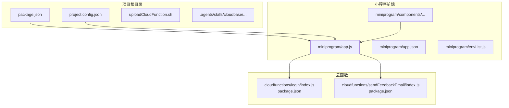
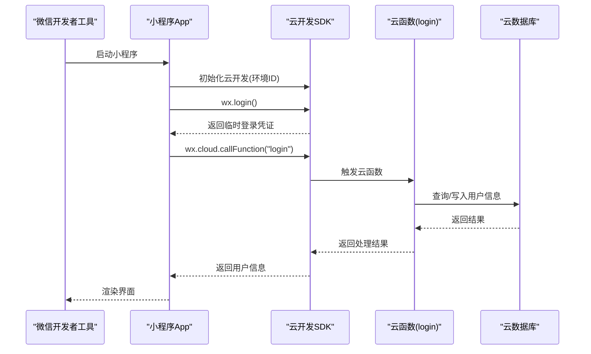
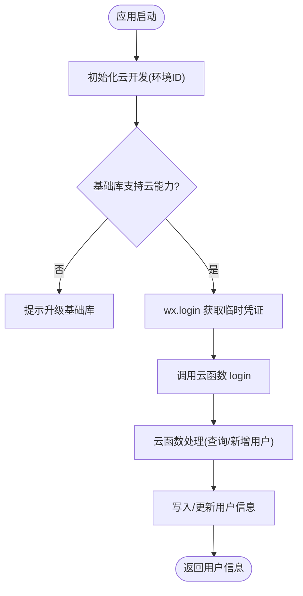
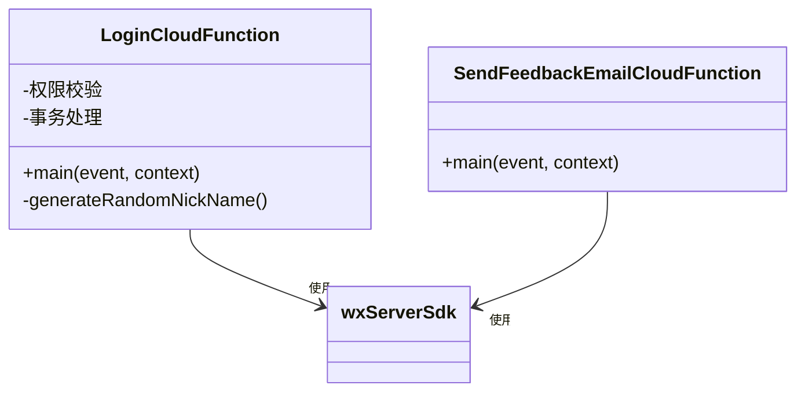
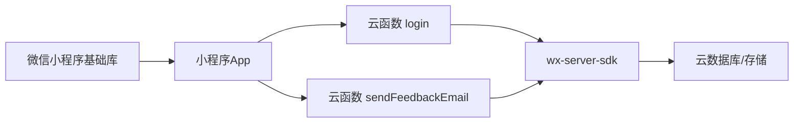

# 开发环境问题

<cite>
**本文引用的文件**
- [package.json](file://package.json)
- [project.config.json](file://project.config.json)
- [miniprogram/app.json](file://miniprogram/app.json)
- [miniprogram/app.js](file://miniprogram/app.js)
- [miniprogram/envList.js](file://miniprogram/envList.js)
- [cloudfunctions/login/package.json](file://cloudfunctions/login/package.json)
- [cloudfunctions/sendFeedbackEmail/package.json](file://cloudfunctions/sendFeedbackEmail/package.json)
- [cloudfunctions/login/index.js](file://cloudfunctions/login/index.js)
- [cloudfunctions/sendFeedbackEmail/index.js](file://cloudfunctions/sendFeedbackEmail/index.js)
- [uploadCloudFunction.sh](file://uploadCloudFunction.sh)
- [.agents/skills/cloudbase/references/miniprogram-development/SKILL.md](file://.agents/skills/cloudbase/references/miniprogram-development/SKILL.md)
- [.agents/skills/cloudbase/references/cloud-functions/checklist.md](file://.agents/skills/cloudbase/references/cloud-functions/checklist.md)
- [.agents/skills/cloudbase/references/web-development/SKILL.md](file://.agents/skills/cloudbase/references/web-development/SKILL.md)
- [.agents/skills/cloudbase/references/cloudbase-platform/SKILL.md](file://.agents/skills/cloudbase/references/cloudbase-platform/SKILL.md)
- [miniprogram/components/ec-canvas/ec-canvas.js](file://miniprogram/components/ec-canvas/ec-canvas.js)
</cite>

## 目录
1. [简介](#简介)
2. [项目结构](#项目结构)
3. [核心组件](#核心组件)
4. [架构总览](#架构总览)
5. [详细组件分析](#详细组件分析)
6. [依赖关系分析](#依赖关系分析)
7. [性能考虑](#性能考虑)
8. [故障排除指南](#故障排除指南)
9. [结论](#结论)
10. [附录](#附录)

## 简介
本指南面向使用微信小程序与云开发（CloudBase）的团队，聚焦“开发环境问题”的系统化排查与修复。内容覆盖：
- 微信开发者工具安装与配置问题（版本兼容、插件安装、模拟器启动）
- 项目依赖安装问题（npm 包安装失败、版本冲突、Node.js 版本不兼容）
- 项目配置错误（project.config.json、appid、编译选项）
- 云开发环境配置（环境变量、SDK 初始化、网络连接）
- 常见错误快速修复清单与预防措施

## 项目结构
该项目采用“小程序前端 + 云函数后端”的典型分层结构，根目录包含小程序代码与云函数代码，另有项目配置与脚本文件。

图表来源
- [project.config.json:1-85](file://project.config.json#L1-L85)
- [miniprogram/app.js:1-56](file://miniprogram/app.js#L1-L56)
- [cloudfunctions/login/index.js:1-814](file://cloudfunctions/login/index.js#L1-L814)
- [cloudfunctions/sendFeedbackEmail/index.js:1-21](file://cloudfunctions/sendFeedbackEmail/index.js#L1-L21)

章节来源
- [project.config.json:1-85](file://project.config.json#L1-L85)
- [miniprogram/app.json:1-39](file://miniprogram/app.json#L1-L39)
- [miniprogram/app.js:1-56](file://miniprogram/app.js#L1-L56)
- [cloudfunctions/login/package.json:1-16](file://cloudfunctions/login/package.json#L1-L16)
- [cloudfunctions/sendFeedbackEmail/package.json:1-16](file://cloudfunctions/sendFeedbackEmail/package.json#L1-L16)

## 核心组件
- 小程序应用入口与云开发初始化：负责在启动时初始化云开发、调用云函数进行登录。
- 云函数：提供登录、数据管理等后端逻辑；使用 wx-server-sdk 进行数据库操作。
- 项目配置：project.config.json 定义小程序根目录、云函数根目录、编译选项与 appid 等。
- 环境变量：envList.js 提供环境列表占位，便于后续注入真实环境配置。
- 上传脚本：uploadCloudFunction.sh 用于一键部署云函数。

章节来源
- [miniprogram/app.js:1-56](file://miniprogram/app.js#L1-L56)
- [cloudfunctions/login/index.js:1-814](file://cloudfunctions/login/index.js#L1-L814)
- [cloudfunctions/sendFeedbackEmail/index.js:1-21](file://cloudfunctions/sendFeedbackEmail/index.js#L1-L21)
- [project.config.json:1-85](file://project.config.json#L1-L85)
- [miniprogram/envList.js:1-7](file://miniprogram/envList.js#L1-L7)
- [uploadCloudFunction.sh:1-1](file://uploadCloudFunction.sh#L1-L1)

## 架构总览
下图展示从微信开发者工具到云函数的典型请求链路，以及云函数对数据库的访问。

图表来源
- [miniprogram/app.js:8-54](file://miniprogram/app.js#L8-L54)
- [cloudfunctions/login/index.js:22-799](file://cloudfunctions/login/index.js#L22-L799)

## 详细组件分析

### 小程序应用初始化与云开发集成
- 初始化逻辑：在启动时检测基础库能力并初始化云开发，指定环境 ID。
- 登录流程：调用 wx.login 获取临时登录凭证，再通过 wx.cloud.callFunction 调用云函数完成登录态校验与用户信息落库。
- 权限与数据：云函数侧对用户身份、家庭与宝宝数据进行严格校验与事务处理。

图表来源
- [miniprogram/app.js:8-54](file://miniprogram/app.js#L8-L54)
- [cloudfunctions/login/index.js:762-799](file://cloudfunctions/login/index.js#L762-L799)

章节来源
- [miniprogram/app.js:1-56](file://miniprogram/app.js#L1-L56)
- [cloudfunctions/login/index.js:1-814](file://cloudfunctions/login/index.js#L1-L814)

### 云函数模块
- login 云函数：集中处理用户登录、家庭与宝宝数据的查询、更新、删除等操作，包含严格的权限校验与事务保证。
- sendFeedbackEmail 云函数：当前实现为占位，接收事件数据并返回处理结果，便于后续扩展邮件发送功能。

图表来源
- [cloudfunctions/login/index.js:1-814](file://cloudfunctions/login/index.js#L1-L814)
- [cloudfunctions/sendFeedbackEmail/index.js:1-21](file://cloudfunctions/sendFeedbackEmail/index.js#L1-L21)

章节来源
- [cloudfunctions/login/package.json:1-16](file://cloudfunctions/login/package.json#L1-L16)
- [cloudfunctions/sendFeedbackEmail/package.json:1-16](file://cloudfunctions/sendFeedbackEmail/package.json#L1-L16)
- [cloudfunctions/login/index.js:1-814](file://cloudfunctions/login/index.js#L1-L814)
- [cloudfunctions/sendFeedbackEmail/index.js:1-21](file://cloudfunctions/sendFeedbackEmail/index.js#L1-L21)

### 项目配置与编译选项
- project.config.json：定义小程序根目录、云函数根目录、编译开关、appid、基础库版本等。
- app.json：声明页面路径、窗口样式、tabBar、sitemap 等。
- envList.js：预留环境列表与平台标识，便于后续注入真实环境配置。

章节来源
- [project.config.json:1-85](file://project.config.json#L1-L85)
- [miniprogram/app.json:1-39](file://miniprogram/app.json#L1-L39)
- [miniprogram/envList.js:1-7](file://miniprogram/envList.js#L1-L7)

## 依赖关系分析
- 小程序前端依赖微信基础库提供的云开发能力，运行时由微信客户端提供。
- 云函数依赖 wx-server-sdk，通过云函数运行时环境提供数据库与存储能力。
- 项目根 package.json 中未定义构建脚本，云函数依赖通过各自 package.json 管理。

图表来源
- [miniprogram/app.js:1-56](file://miniprogram/app.js#L1-L56)
- [cloudfunctions/login/package.json:12-14](file://cloudfunctions/login/package.json#L12-L14)
- [cloudfunctions/sendFeedbackEmail/package.json:9-12](file://cloudfunctions/sendFeedbackEmail/package.json#L9-L12)

章节来源
- [package.json:1-22](file://package.json#L1-L22)
- [cloudfunctions/login/package.json:1-16](file://cloudfunctions/login/package.json#L1-L16)
- [cloudfunctions/sendFeedbackEmail/package.json:1-16](file://cloudfunctions/sendFeedbackEmail/package.json#L1-L16)

## 性能考虑
- 编译优化：project.config.json 中启用压缩、最小化、多帧运行等选项，有助于提升运行时性能。
- 数据访问：云函数内尽量减少不必要的查询与循环，使用事务保证一致性的同时避免长事务。
- 组件渲染：图表组件对基础库版本有要求，建议升级至较新版本以获得更好的渲染性能。

章节来源
- [project.config.json:44-46](file://project.config.json#L44-L46)
- [miniprogram/components/ec-canvas/ec-canvas.js:88-108](file://miniprogram/components/ec-canvas/ec-canvas.js#L88-L108)

## 故障排除指南

### 一、微信开发者工具安装与配置问题
- 版本兼容性
  - 症状：模拟器启动异常、页面空白、云能力不可用。
  - 排查：确认 project.config.json 中 libVersion 与实际基础库版本匹配；若使用图表组件，确保基础库版本满足组件要求。
  - 修复：升级微信开发者工具与基础库版本，使 libVersion 与实际一致。
- 插件安装失败
  - 症状：插件面板无法加载、插件报错。
  - 排查：检查网络代理与开发者工具设置；重装插件或切换为稳定版。
  - 修复：清理缓存后重试，必要时更换代理或使用离线安装包。
- 模拟器启动异常
  - 症状：模拟器黑屏、卡死、频繁重启。
  - 排查：关闭其他占用资源的程序；清理模拟器缓存；降低编译选项（如关闭某些增强特性）。
  - 修复：重启开发者工具与模拟器；重置项目配置后重新打开。

章节来源
- [project.config.json:49](file://project.config.json#L49)
- [.agents/skills/cloudbase/references/miniprogram-development/SKILL.md:76-101](file://.agents/skills/cloudbase/references/miniprogram-development/SKILL.md#L76-L101)
- [miniprogram/components/ec-canvas/ec-canvas.js:88-108](file://miniprogram/components/ec-canvas/ec-canvas.js#L88-L108)

### 二、项目依赖安装问题
- npm 包安装失败
  - 症状：安装云函数依赖时报错、依赖缺失。
  - 排查：检查网络与 registry 设置；确认 package.json 中依赖版本可解析。
  - 修复：更换镜像源、清理缓存、使用锁定文件重新安装。
- 版本冲突
  - 症状：不同模块对同一依赖版本要求不一致导致报错。
  - 排查：对比各云函数 package.json 的依赖版本；检查全局/项目级缓存。
  - 修复：统一依赖版本范围，优先使用兼容范围；必要时拆分云函数以隔离依赖。
- Node.js 版本不兼容
  - 症状：云函数运行时报 Node.js 版本相关错误。
  - 排查：确认云函数运行时与 Node.js 版本要求匹配。
  - 修复：在云函数运行时选择与 SDK 兼容的版本；避免使用过旧版本。

章节来源
- [cloudfunctions/login/package.json:12-14](file://cloudfunctions/login/package.json#L12-L14)
- [cloudfunctions/sendFeedbackEmail/package.json:9-12](file://cloudfunctions/sendFeedbackEmail/package.json#L9-L12)
- [.agents/skills/cloudbase/references/cloud-functions/checklist.md:59-85](file://.agents/skills/cloudbase/references/cloud-functions/checklist.md#L59-L85)

### 三、项目配置错误
- project.config.json 配置项错误
  - 症状：预览/上传失败、路径解析错误。
  - 排查：核对 miniprogramRoot、cloudfunctionRoot、compileType、libVersion 等字段。
  - 修复：修正路径与编译选项；确保与实际目录结构一致。
- appid 配置问题
  - 症状：真机预览/上传提示 appid 错误。
  - 排查：确认 project.config.json 中 appid 是否正确；与微信公众平台一致。
  - 修复：更新为正确的 appid；如需测试，使用测试号。
- 编译选项设置不当
  - 症状：编译报错、产物体积异常。
  - 排查：检查 setting 中的压缩、ES6 转 ES5、nodeModules 等选项。
  - 修复：根据需要开启/关闭对应选项；避免同时启用相互冲突的选项。

章节来源
- [project.config.json:1-85](file://project.config.json#L1-L85)
- [.agents/skills/cloudbase/references/miniprogram-development/SKILL.md:85-98](file://.agents/skills/cloudbase/references/miniprogram-development/SKILL.md#L85-L98)

### 四、云开发环境配置问题
- 环境变量设置
  - 症状：云函数初始化失败、找不到环境。
  - 排查：确认小程序端 app.js 中的环境 ID 与控制台一致；envList.js 是否正确注入。
  - 修复：更新环境 ID；确保 envList.js 在构建阶段被替换为真实值。
- 云开发 SDK 初始化失败
  - 症状：wx.cloud 未定义、初始化报错。
  - 排查：确认基础库版本满足云开发要求；检查初始化参数。
  - 修复：升级基础库；确保在 onLaunch 中正确初始化。
- 网络连接问题
  - 症状：调用云函数超时、数据库读写失败。
  - 排查：检查本地网络与代理；确认云函数与数据库服务可用。
  - 修复：切换网络或代理；重试请求；必要时在云端查看日志定位。

章节来源
- [miniprogram/app.js:8-16](file://miniprogram/app.js#L8-L16)
- [miniprogram/envList.js:1-7](file://miniprogram/envList.js#L1-L7)
- [.agents/skills/cloudbase/references/web-development/SKILL.md:122-165](file://.agents/skills/cloudbase/references/web-development/SKILL.md#L122-L165)
- [.agents/skills/cloudbase/references/cloudbase-platform/SKILL.md:85-97](file://.agents/skills/cloudbase/references/cloudbase-platform/SKILL.md#L85-L97)

### 五、常见开发环境错误快速修复清单
- 开发者工具类
  - 升级基础库与开发者工具版本；重装插件；清理模拟器缓存。
- 依赖类
  - 更换 npm 镜像；删除 node_modules 与锁定文件后重装；统一依赖版本。
- 配置类
  - 校正 project.config.json 路径与 appid；调整编译选项；同步 app.json 页面与资源。
- 云开发类
  - 校验环境 ID；确保基础库满足云能力要求；检查网络连通性；查看云函数与数据库日志。

章节来源
- [project.config.json:1-85](file://project.config.json#L1-L85)
- [miniprogram/app.json:1-39](file://miniprogram/app.json#L1-L39)
- [miniprogram/app.js:8-16](file://miniprogram/app.js#L8-L16)
- [.agents/skills/cloudbase/references/miniprogram-development/SKILL.md:85-101](file://.agents/skills/cloudbase/references/miniprogram-development/SKILL.md#L85-L101)

## 结论
本指南围绕微信小程序与云开发的开发环境问题提供了系统化的排查思路与修复步骤。建议在日常开发中：
- 保持开发者工具与基础库版本更新；
- 统一并明确项目配置与依赖版本；
- 在云开发初始化与网络层面做好环境校验与日志监控；
- 建立标准化的检查清单与回滚策略，降低回归风险。

## 附录
- 云函数部署脚本：uploadCloudFunction.sh 提供了部署命令模板，部署前请确认环境 ID 与项目路径。
- 云函数开发规范：参考云函数检查清单，明确函数类型、运行时与打包约束，避免常见失败模式。

章节来源
- [uploadCloudFunction.sh:1-1](file://uploadCloudFunction.sh#L1-L1)
- [.agents/skills/cloudbase/references/cloud-functions/checklist.md:1-27](file://.agents/skills/cloudbase/references/cloud-functions/checklist.md#L1-L27)