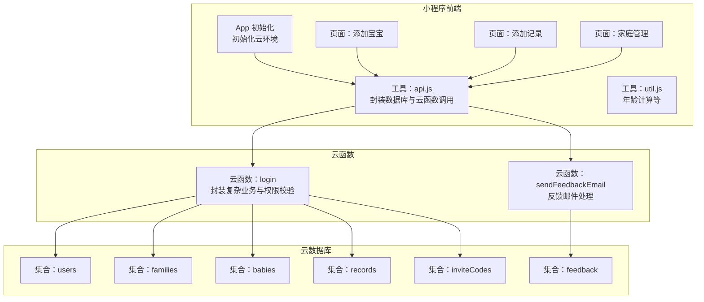
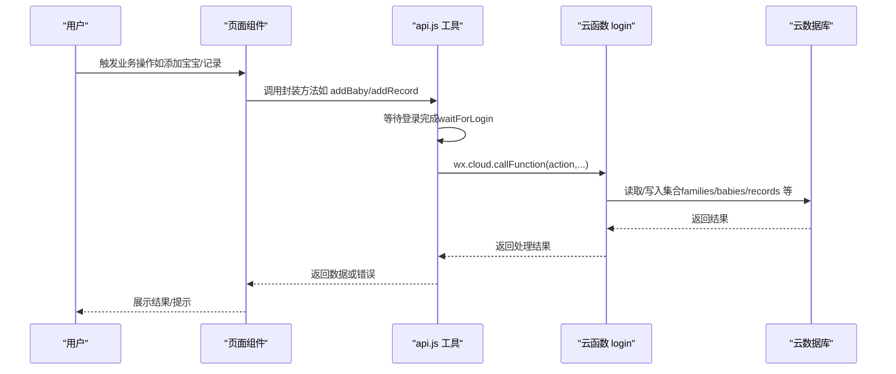
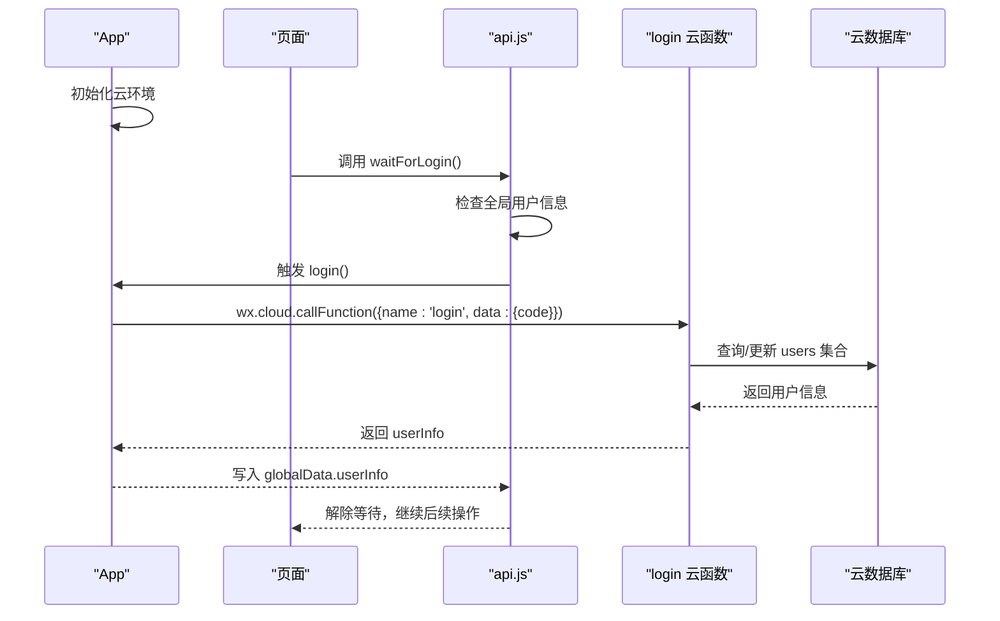
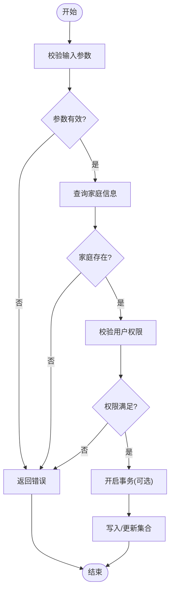
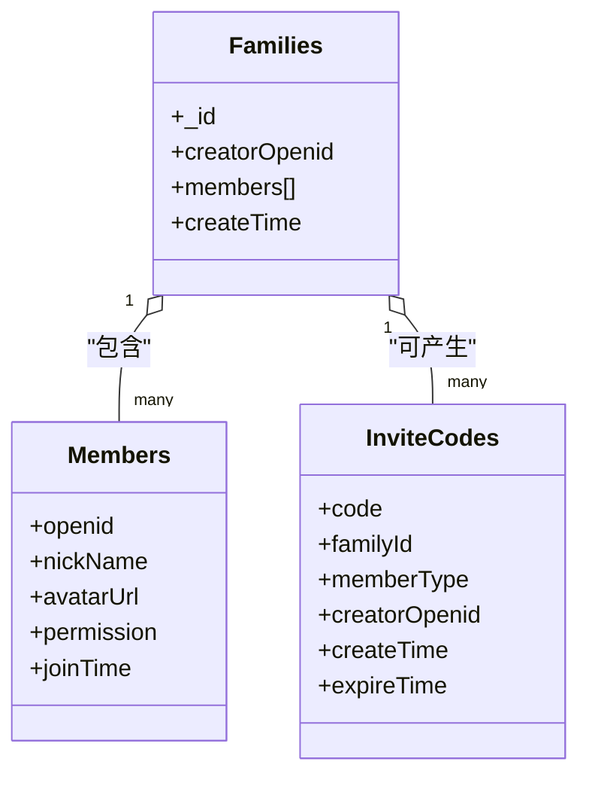
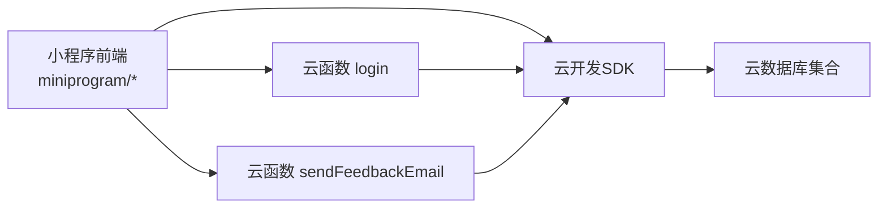
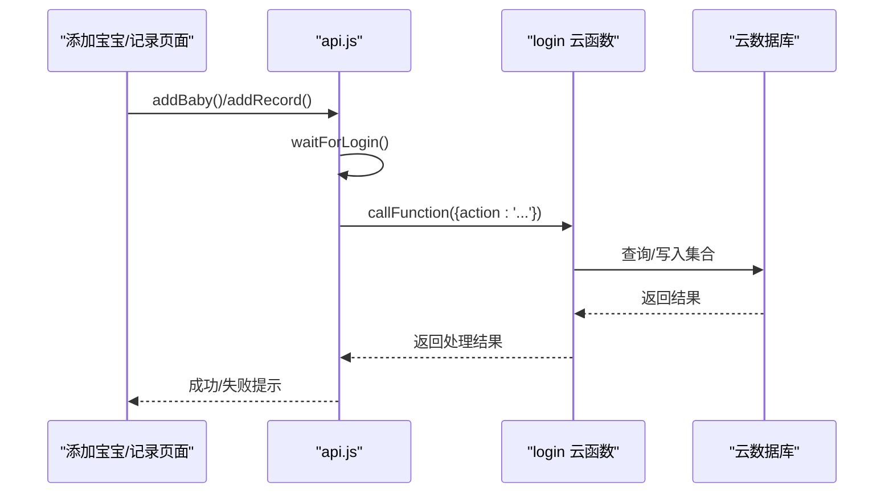

# 数据库问题

<cite>
**本文引用的文件**
- [miniprogram/app.js](file://miniprogram/app.js)
- [miniprogram/utils/api.js](file://miniprogram/utils/api.js)
- [cloudfunctions/login/index.js](file://cloudfunctions/login/index.js)
- [cloudfunctions/sendFeedbackEmail/index.js](file://cloudfunctions/sendFeedbackEmail/index.js)
- [miniprogram/pages/baby-add/baby-add.js](file://miniprogram/pages/baby-add/baby-add.js)
- [miniprogram/pages/record-add/record-add.js](file://miniprogram/pages/record-add/record-add.js)
- [miniprogram/pages/family/family.js](file://miniprogram/pages/family/family.js)
- [miniprogram/utils/util.js](file://miniprogram/utils/util.js)
- [miniprogram/envList.js](file://miniprogram/envList.js)
- [miniprogram/app.json](file://miniprogram/app.json)
- [project.config.json](file://project.config.json)
- [cloudfunctions/login/package.json](file://cloudfunctions/login/package.json)
- [cloudfunctions/sendFeedbackEmail/package.json](file://cloudfunctions/sendFeedbackEmail/package.json)
</cite>

## 目录
1. [简介](#简介)
2. [项目结构](#项目结构)
3. [核心组件](#核心组件)
4. [架构总览](#架构总览)
5. [详细组件分析](#详细组件分析)
6. [依赖关系分析](#依赖关系分析)
7. [性能考虑](#性能考虑)
8. [故障排除指南](#故障排除指南)
9. [结论](#结论)
10. [附录](#附录)

## 简介
本指南聚焦于数据库相关问题的故障排除与优化，结合项目中使用的微信小程序云开发能力，系统阐述以下主题：
- 数据库连接失败的排查：环境配置、权限规则、网络与超时等
- 查询与写入异常的诊断：超时、格式错误、索引与事务问题
- 性能优化：查询优化、索引设计、批量操作、缓存策略
- 安全与权限：访问控制、数据加密、敏感信息保护
- 监控、备份与迁移：最佳实践与故障处理流程

## 项目结构
项目采用“小程序前端 + 云开发 + 云函数”的分层架构：
- 前端层：小程序页面与工具模块，负责用户交互与调用云数据库与云函数
- 云函数层：后端逻辑封装，统一处理权限校验、事务与复杂业务
- 云数据库层：基于微信云开发的文档型数据库

**图表来源**
- [miniprogram/app.js:1-56](file://miniprogram/app.js#L1-L56)
- [miniprogram/utils/api.js:1-879](file://miniprogram/utils/api.js#L1-L879)
- [cloudfunctions/login/index.js:1-814](file://cloudfunctions/login/index.js#L1-L814)
- [cloudfunctions/sendFeedbackEmail/index.js:1-21](file://cloudfunctions/sendFeedbackEmail/index.js#L1-L21)

**章节来源**
- [miniprogram/app.js:1-56](file://miniprogram/app.js#L1-L56)
- [miniprogram/app.json:1-39](file://miniprogram/app.json#L1-L39)
- [project.config.json:1-85](file://project.config.json#L1-L85)

## 核心组件
- 应用初始化与云环境配置：在应用启动时初始化云能力并设置环境标识
- 数据访问工具：统一封装数据库读写与云函数调用，提供等待登录、权限检查、查询与写入等方法
- 云函数：login 负责复杂业务与权限校验；sendFeedbackEmail 负责反馈邮件处理
- 页面组件：分别负责添加宝宝、添加记录、家庭管理等业务场景

**章节来源**
- [miniprogram/app.js:8-20](file://miniprogram/app.js#L8-L20)
- [miniprogram/utils/api.js:1-879](file://miniprogram/utils/api.js#L1-L879)
- [cloudfunctions/login/index.js:22-800](file://cloudfunctions/login/index.js#L22-L800)
- [cloudfunctions/sendFeedbackEmail/index.js:6-20](file://cloudfunctions/sendFeedbackEmail/index.js#L6-L20)

## 架构总览
整体交互流程如下：

**图表来源**
- [miniprogram/pages/baby-add/baby-add.js:74-118](file://miniprogram/pages/baby-add/baby-add.js#L74-L118)
- [miniprogram/pages/record-add/record-add.js:71-117](file://miniprogram/pages/record-add/record-add.js#L71-L117)
- [miniprogram/utils/api.js:14-41](file://miniprogram/utils/api.js#L14-L41)
- [cloudfunctions/login/index.js:22-800](file://cloudfunctions/login/index.js#L22-L800)

## 详细组件分析

### 组件A：数据库连接与登录流程
- 登录前置条件：小程序启动时初始化云环境，随后直接发起登录并调用云函数获取用户信息
- 登录等待机制：若未就绪，通过轮询等待登录完成，最大等待时间约 5 秒
- 云函数入口：login 云函数根据 action 分派具体业务，如获取家庭、宝宝、记录，或执行删除、更新等

**图表来源**
- [miniprogram/app.js:28-54](file://miniprogram/app.js#L28-L54)
- [miniprogram/utils/api.js:14-41](file://miniprogram/utils/api.js#L14-L41)
- [cloudfunctions/login/index.js:762-800](file://cloudfunctions/login/index.js#L762-L800)

**章节来源**
- [miniprogram/app.js:8-20](file://miniprogram/app.js#L8-L20)
- [miniprogram/utils/api.js:14-41](file://miniprogram/utils/api.js#L14-L41)
- [cloudfunctions/login/index.js:22-800](file://cloudfunctions/login/index.js#L22-L800)

### 组件B：数据查询与写入异常诊断
- 查询超时：前端等待登录超时会返回错误；云函数侧建议增加超时与重试策略
- 数据格式错误：页面层对输入进行基础校验（如身高/体重为正数），云函数层进一步校验（如权限、长度限制）
- 索引与事务：云函数使用事务保证删除宝宝与关联记录的原子性；建议在高频查询字段建立索引
- 权限控制：云函数严格校验用户在家庭中的权限，避免越权访问

**图表来源**
- [miniprogram/pages/baby-add/baby-add.js:74-118](file://miniprogram/pages/baby-add/baby-add.js#L74-L118)
- [miniprogram/pages/record-add/record-add.js:71-117](file://miniprogram/pages/record-add/record-add.js#L71-L117)
- [cloudfunctions/login/index.js:482-510](file://cloudfunctions/login/index.js#L482-L510)

**章节来源**
- [miniprogram/pages/baby-add/baby-add.js:74-118](file://miniprogram/pages/baby-add/baby-add.js#L74-L118)
- [miniprogram/pages/record-add/record-add.js:71-117](file://miniprogram/pages/record-add/record-add.js#L71-L117)
- [cloudfunctions/login/index.js:482-510](file://cloudfunctions/login/index.js#L482-L510)

### 组件C：权限与安全控制
- 家庭与成员：通过集合 families 的成员数组与权限字段控制访问范围
- 家长与助教：不同角色对增删改查有不同权限，云函数严格校验
- 邀请码机制：通过 inviteCodes 控制加入家庭的流程与有效期

**图表来源**
- [cloudfunctions/login/index.js:28-92](file://cloudfunctions/login/index.js#L28-L92)
- [cloudfunctions/login/index.js:268-371](file://cloudfunctions/login/index.js#L268-L371)
- [cloudfunctions/login/index.js:658-699](file://cloudfunctions/login/index.js#L658-L699)

**章节来源**
- [cloudfunctions/login/index.js:28-92](file://cloudfunctions/login/index.js#L28-L92)
- [cloudfunctions/login/index.js:268-371](file://cloudfunctions/login/index.js#L268-L371)
- [cloudfunctions/login/index.js:658-699](file://cloudfunctions/login/index.js#L658-L699)

## 依赖关系分析
- 小程序前端依赖云开发 SDK 进行数据库与云函数调用
- 云函数依赖 wx-server-sdk，内部通过 cloud.database() 访问数据库
- 项目配置文件指定了小程序根目录与云函数根目录，确保正确编译与部署

**图表来源**
- [project.config.json:2-4](file://project.config.json#L2-L4)
- [cloudfunctions/login/package.json:12-14](file://cloudfunctions/login/package.json#L12-L14)
- [cloudfunctions/sendFeedbackEmail/package.json:9-12](file://cloudfunctions/sendFeedbackEmail/package.json#L9-L12)

**章节来源**
- [project.config.json:2-4](file://project.config.json#L2-L4)
- [cloudfunctions/login/package.json:12-14](file://cloudfunctions/login/package.json#L12-L14)
- [cloudfunctions/sendFeedbackEmail/package.json:9-12](file://cloudfunctions/sendFeedbackEmail/package.json#L9-L12)

## 性能考虑
- 查询优化
  - 在高频查询字段上建立索引（如 families.members.openid、records.babyId、users.openid 等）
  - 使用 where + in 查询减少多次往返
  - 对大数据量集合使用分页或 limit 限制返回条目
- 索引设计
  - 布尔字段（如 used）与时间字段（expireTime）组合索引可提升筛选效率
- 批量操作
  - 云函数内使用事务保证原子性，避免部分写入导致的数据不一致
- 缓存策略
  - 前端对常用数据（如家庭列表、宝宝列表）进行本地缓存，减少重复查询
  - 云函数对热点数据进行内存缓存（需谨慎处理并发与一致性）

[本节为通用性能建议，无需特定文件引用]

## 故障排除指南

### 一、数据库连接失败排查
- 环境配置错误
  - 确认小程序 App 初始化时的环境标识与云端一致
  - 检查项目配置文件中的云函数与小程序根目录路径
- 权限配置错误
  - 确认云开发数据库的安全规则允许小程序前端进行相应操作
  - 若使用云函数，确保云函数具备对应集合的读写权限
- 网络连接问题
  - 前端等待登录超时（约 5 秒）：检查网络状况与服务器可用性
  - 云函数超时：适当延长云函数执行时间上限，优化查询与事务

**章节来源**
- [miniprogram/app.js:8-20](file://miniprogram/app.js#L8-L20)
- [miniprogram/utils/api.js:14-41](file://miniprogram/utils/api.js#L14-L41)
- [project.config.json:2-4](file://project.config.json#L2-L4)

### 二、数据查询与写入异常诊断
- 查询超时
  - 前端：检查 waitForLogin 是否超时，必要时增加重试与降级提示
  - 云函数：对复杂查询加索引，拆分为多步查询，避免一次性大范围扫描
- 数据格式错误
  - 页面层：对数值型字段进行非负数与范围校验
  - 云函数层：对字符串长度、权限、存在性进行二次校验
- 索引失效
  - 分析慢查询日志，为频繁过滤字段建立复合索引
- 事务冲突
  - 使用云函数事务包裹相关写入，确保原子性
  - 避免跨集合的大事务，拆分为多个小事务

**章节来源**
- [miniprogram/pages/baby-add/baby-add.js:74-118](file://miniprogram/pages/baby-add/baby-add.js#L74-L118)
- [miniprogram/pages/record-add/record-add.js:71-117](file://miniprogram/pages/record-add/record-add.js#L71-L117)
- [cloudfunctions/login/index.js:482-510](file://cloudfunctions/login/index.js#L482-L510)

### 三、数据安全与权限控制
- 访问权限配置
  - 通过云开发数据库安全规则限制集合访问
  - 在云函数中严格校验用户 openid 与家庭成员权限
- 数据加密
  - 对敏感字段（如头像地址）在传输与存储层面遵循最小化原则
- 敏感信息保护
  - 邀请码设置有效期与使用次数限制，定期清理过期数据
  - 限制用户可修改的字段范围，避免越权修改他人信息

**章节来源**
- [cloudfunctions/login/index.js:268-371](file://cloudfunctions/login/index.js#L268-L371)
- [cloudfunctions/login/index.js:658-699](file://cloudfunctions/login/index.js#L658-L699)
- [cloudfunctions/login/index.js:740-760](file://cloudfunctions/login/index.js#L740-L760)

### 四、监控、备份与迁移
- 监控
  - 使用云开发提供的日志与指标监控数据库查询耗时与错误率
- 备份与恢复
  - 利用云开发提供的备份功能定期导出集合数据
- 迁移与升级
  - 升级前先在测试环境验证集合结构变更与索引策略
  - 通过灰度发布逐步切换，观察性能与稳定性

[本节为通用运维建议，无需特定文件引用]

## 结论
本项目通过“前端 + 云函数 + 云数据库”的架构实现了清晰的职责分离与强权限控制。针对数据库问题，建议优先从环境配置、权限规则与网络稳定性入手排查；在性能方面，重点在于索引设计、查询优化与事务原子性；在安全方面，应强化云函数权限校验与敏感信息保护；在运维方面，完善监控、备份与迁移流程以保障系统稳定。

[本节为总结性内容，无需特定文件引用]

## 附录

### A. 关键流程图：添加宝宝与记录

**图表来源**
- [miniprogram/pages/baby-add/baby-add.js:74-118](file://miniprogram/pages/baby-add/baby-add.js#L74-L118)
- [miniprogram/pages/record-add/record-add.js:71-117](file://miniprogram/pages/record-add/record-add.js#L71-L117)
- [miniprogram/utils/api.js:149-210](file://miniprogram/utils/api.js#L149-L210)
- [cloudfunctions/login/index.js:556-636](file://cloudfunctions/login/index.js#L556-L636)

### B. 环境与配置要点
- 小程序环境初始化与页面注册
- 云函数依赖与打包配置
- 云开发数据库集合与安全规则

**章节来源**
- [miniprogram/app.js:8-20](file://miniprogram/app.js#L8-L20)
- [miniprogram/app.json:1-39](file://miniprogram/app.json#L1-L39)
- [cloudfunctions/login/package.json:12-14](file://cloudfunctions/login/package.json#L12-L14)
- [cloudfunctions/sendFeedbackEmail/package.json:9-12](file://cloudfunctions/sendFeedbackEmail/package.json#L9-L12)