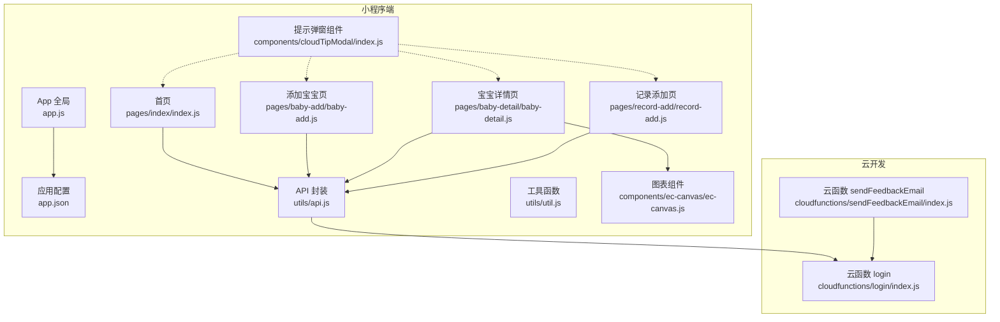
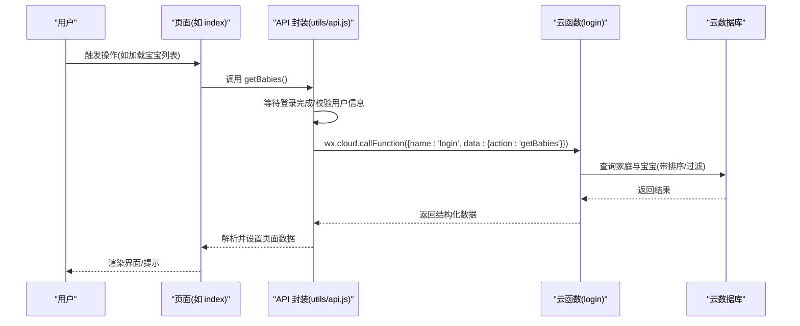
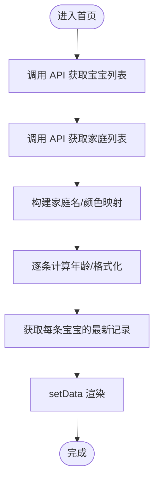
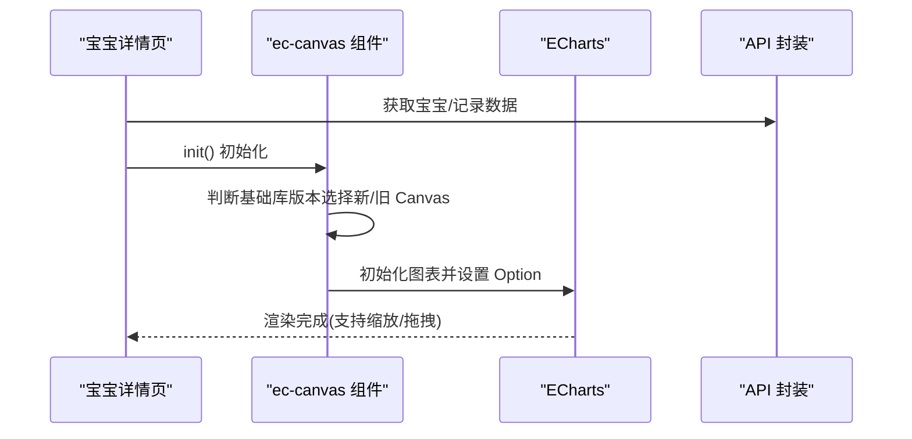
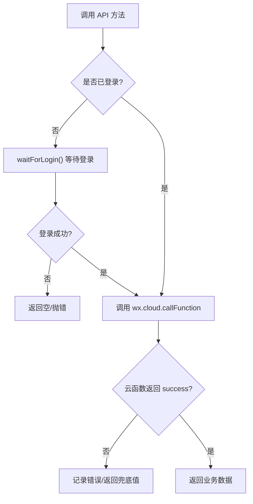
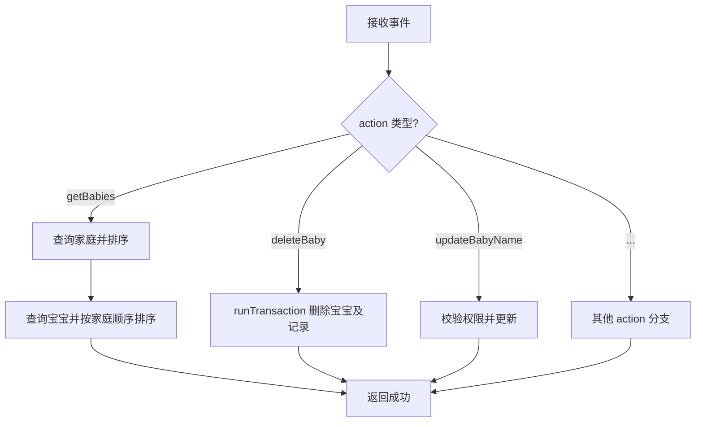
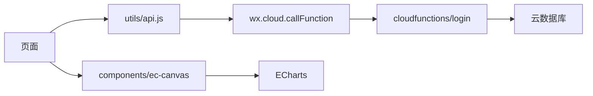

# 用户反馈问题

<cite>
**本文引用的文件**
- [miniprogram/app.js](file://miniprogram/app.js)
- [miniprogram/app.json](file://miniprogram/app.json)
- [miniprogram/utils/api.js](file://miniprogram/utils/api.js)
- [miniprogram/utils/util.js](file://miniprogram/utils/util.js)
- [miniprogram/pages/index/index.js](file://miniprogram/pages/index/index.js)
- [miniprogram/pages/baby-add/baby-add.js](file://miniprogram/pages/baby-add/baby-add.js)
- [miniprogram/pages/baby-detail/baby-detail.js](file://miniprogram/pages/baby-detail/baby-detail.js)
- [miniprogram/pages/record-add/record-add.js](file://miniprogram/pages/record-add/record-add.js)
- [miniprogram/components/cloudTipModal/index.js](file://miniprogram/components/cloudTipModal/index.js)
- [miniprogram/components/ec-canvas/ec-canvas.js](file://miniprogram/components/ec-canvas/ec-canvas.js)
- [cloudfunctions/login/index.js](file://cloudfunctions/login/index.js)
- [cloudfunctions/sendFeedbackEmail/index.js](file://cloudfunctions/sendFeedbackEmail/index.js)
- [project.config.json](file://project.config.json)
- [miniprogram/sitemap.json](file://miniprogram/sitemap.json)
</cite>

## 目录
1. [简介](#简介)
2. [项目结构](#项目结构)
3. [核心组件](#核心组件)
4. [架构总览](#架构总览)
5. [详细组件分析](#详细组件分析)
6. [依赖关系分析](#依赖关系分析)
7. [性能考虑](#性能考虑)
8. [故障排除指南](#故障排除指南)
9. [结论](#结论)
10. [附录](#附录)

## 简介
本指南面向“用户反馈问题”的故障排除与优化，聚焦以下方面：
- 功能缺陷的识别与定位：界面显示异常、交互逻辑错误、数据展示问题
- 兼容性问题诊断与解决：设备适配、系统版本差异、浏览器兼容性
- 性能问题优化：页面加载慢、图表渲染卡顿、内存占用高
- 用户体验改进：操作流程优化、提示信息完善、错误处理友好
- 用户反馈闭环：收集、分类、优先级评估、解决跟踪

## 项目结构
该项目为微信小程序应用，采用分层组织：
- 应用入口与全局配置：app.js、app.json、project.config.json、sitemap.json
- 页面与组件：pages/*、components/*
- 工具模块：utils/api.js、utils/util.js
- 云开发：cloudfunctions/login（业务逻辑）、cloudfunctions/sendFeedbackEmail（反馈处理）

**图表来源**
- [miniprogram/app.js:1-56](file://miniprogram/app.js#L1-L56)
- [miniprogram/app.json:1-39](file://miniprogram/app.json#L1-L39)
- [miniprogram/utils/api.js:1-879](file://miniprogram/utils/api.js#L1-L879)
- [miniprogram/pages/index/index.js:1-144](file://miniprogram/pages/index/index.js#L1-L144)
- [miniprogram/pages/baby-add/baby-add.js:1-120](file://miniprogram/pages/baby-add/baby-add.js#L1-L120)
- [miniprogram/pages/baby-detail/baby-detail.js:1-691](file://miniprogram/pages/baby-detail/baby-detail.js#L1-L691)
- [miniprogram/pages/record-add/record-add.js:1-118](file://miniprogram/pages/record-add/record-add.js#L1-L118)
- [miniprogram/components/cloudTipModal/index.js:1-29](file://miniprogram/components/cloudTipModal/index.js#L1-L29)
- [miniprogram/components/ec-canvas/ec-canvas.js:1-285](file://miniprogram/components/ec-canvas/ec-canvas.js#L1-L285)
- [cloudfunctions/login/index.js:1-814](file://cloudfunctions/login/index.js#L1-L814)
- [cloudfunctions/sendFeedbackEmail/index.js:1-21](file://cloudfunctions/sendFeedbackEmail/index.js#L1-L21)

**章节来源**
- [miniprogram/app.js:1-56](file://miniprogram/app.js#L1-L56)
- [miniprogram/app.json:1-39](file://miniprogram/app.json#L1-L39)
- [project.config.json:1-85](file://project.config.json#L1-L85)

## 核心组件
- 登录与全局状态：App 初始化、云开发初始化、登录态检查与持久化
- API 封装：统一调用云函数与数据库，封装权限校验、等待登录等通用逻辑
- 页面：首页列表、添加宝宝、宝宝详情（含图表）、记录添加
- 组件：提示弹窗、图表容器（兼容多版本基础库）
- 云函数：登录态、家庭/宝宝/记录管理、邀请码、权限控制、事务保证

**章节来源**
- [miniprogram/app.js:1-56](file://miniprogram/app.js#L1-L56)
- [miniprogram/utils/api.js:1-879](file://miniprogram/utils/api.js#L1-L879)
- [cloudfunctions/login/index.js:1-814](file://cloudfunctions/login/index.js#L1-L814)

## 架构总览
小程序端通过 wx.cloud 调用云函数，云函数访问云数据库实现业务逻辑；页面通过工具模块封装的 API 进行数据请求与权限校验。

**图表来源**
- [miniprogram/pages/index/index.js:14-52](file://miniprogram/pages/index/index.js#L14-L52)
- [miniprogram/utils/api.js:44-75](file://miniprogram/utils/api.js#L44-L75)
- [cloudfunctions/login/index.js:51-92](file://cloudfunctions/login/index.js#L51-L92)

## 详细组件分析

### 页面：首页（宝宝列表）
- 关键点：加载宝宝列表、计算年龄与最新记录、家庭映射、跳转详情
- 常见问题：列表为空、权限不足、网络超时、Toast 提示缺失
- 排查要点：检查登录态、云函数返回、页面 setData 是否执行

**图表来源**
- [miniprogram/pages/index/index.js:14-52](file://miniprogram/pages/index/index.js#L14-L52)

**章节来源**
- [miniprogram/pages/index/index.js:1-144](file://miniprogram/pages/index/index.js#L1-L144)

### 页面：添加宝宝
- 关键点：权限校验（仅一级助教）、表单校验、提交后回退
- 常见问题：权限提示不明确、表单校验不及时、提交后未刷新

**章节来源**
- [miniprogram/pages/baby-add/baby-add.js:1-120](file://miniprogram/pages/baby-add/baby-add.js#L1-L120)

### 页面：宝宝详情（图表）
- 关键点：ECharts 图表初始化、标准曲线对比、数据缩放、权限控制
- 常见问题：图表不显示、缩放异常、滑动冲突、性别标准数据不匹配
- 排查要点：组件初始化、canvas 版本兼容、数据排序与区间

**图表来源**
- [miniprogram/pages/baby-detail/baby-detail.js:323-397](file://miniprogram/pages/baby-detail/baby-detail.js#L323-L397)
- [miniprogram/components/ec-canvas/ec-canvas.js:80-192](file://miniprogram/components/ec-canvas/ec-canvas.js#L80-L192)

**章节来源**
- [miniprogram/pages/baby-detail/baby-detail.js:1-691](file://miniprogram/pages/baby-detail/baby-detail.js#L1-L691)
- [miniprogram/components/ec-canvas/ec-canvas.js:1-285](file://miniprogram/components/ec-canvas/ec-canvas.js#L1-L285)

### 页面：记录添加
- 关键点：日期校验、年龄计算、权限校验、提交后回退
- 常见问题：日期早于出生、数值非法、权限不足

**章节来源**
- [miniprogram/pages/record-add/record-add.js:1-118](file://miniprogram/pages/record-add/record-add.js#L1-L118)

### 组件：提示弹窗
- 作用：统一的提示弹窗，支持属性透传与观测
- 常见问题：未正确绑定 showTipProps、点击关闭无效

**章节来源**
- [miniprogram/components/cloudTipModal/index.js:1-29](file://miniprogram/components/cloudTipModal/index.js#L1-L29)

### 工具模块：API 封装
- 作用：统一封装登录等待、权限校验、调用云函数、错误处理
- 常见问题：登录超时、云函数返回失败、权限判断错误

**图表来源**
- [miniprogram/utils/api.js:13-41](file://miniprogram/utils/api.js#L13-L41)
- [miniprogram/utils/api.js:44-75](file://miniprogram/utils/api.js#L44-L75)

**章节来源**
- [miniprogram/utils/api.js:1-879](file://miniprogram/utils/api.js#L1-L879)

### 工具模块：工具函数
- 作用：时间格式化、年龄计算、年龄字符串格式化
- 常见问题：跨月边界、负年龄显示

**章节来源**
- [miniprogram/utils/util.js:1-55](file://miniprogram/utils/util.js#L1-L55)

### 云函数：登录与业务
- 作用：登录态、家庭/宝宝/记录 CRUD、权限校验、事务、邀请码
- 常见问题：权限不足、事务失败、超时、数据一致性

**图表来源**
- [cloudfunctions/login/index.js:22-92](file://cloudfunctions/login/index.js#L22-L92)
- [cloudfunctions/login/index.js:482-510](file://cloudfunctions/login/index.js#L482-L510)
- [cloudfunctions/login/index.js:701-738](file://cloudfunctions/login/index.js#L701-L738)

**章节来源**
- [cloudfunctions/login/index.js:1-814](file://cloudfunctions/login/index.js#L1-L814)

## 依赖关系分析
- 页面依赖 utils/api.js 进行数据与权限处理
- API 封装依赖 wx.cloud 调用云函数
- 云函数依赖云数据库进行数据存取与事务
- 图表组件依赖 ECharts 并兼容不同基础库版本

**图表来源**
- [miniprogram/utils/api.js:58-63](file://miniprogram/utils/api.js#L58-L63)
- [cloudfunctions/login/index.js:1-10](file://cloudfunctions/login/index.js#L1-L10)
- [miniprogram/components/ec-canvas/ec-canvas.js:1-10](file://miniprogram/components/ec-canvas/ec-canvas.js#L1-L10)

**章节来源**
- [miniprogram/utils/api.js:1-879](file://miniprogram/utils/api.js#L1-L879)
- [cloudfunctions/login/index.js:1-814](file://cloudfunctions/login/index.js#L1-L814)
- [miniprogram/components/ec-canvas/ec-canvas.js:1-285](file://miniprogram/components/ec-canvas/ec-canvas.js#L1-L285)

## 性能考虑
- 页面加载
  - 首屏渲染：减少不必要的 setData，按需加载最新记录
  - 登录等待：合理设置最大等待时间，避免阻塞主线程
- 图表渲染
  - 数据预处理：按月龄排序、裁剪最近 N 条，降低绘图复杂度
  - 缩放策略：默认展示近期窗口，避免全量数据导致卡顿
  - Canvas 版本：优先使用新版 canvas，提升绘制性能
- 内存占用
  - 图表销毁：离开页面时释放图表实例
  - 数据缓存：对静态标准曲线数据做缓存复用

[本节为通用指导，无需特定文件来源]

## 故障排除指南

### 一、界面显示异常
- 症状
  - 图表不显示或空白
  - 列表项错位、颜色异常
  - 提示弹窗不出现
- 定位步骤
  - 检查 ec-canvas 组件初始化与 canvas 版本兼容
  - 检查页面数据流：API 返回、map 映射、setData
  - 检查组件属性绑定与观测
- 处理建议
  - 在组件 ready 中打印版本信息，确认 isUseNewCanvas
  - 在页面 onLoad/onShow 中增加日志，确认数据到达
  - 确保 cloudTipModal 的 showTipProps 正确透传

**章节来源**
- [miniprogram/components/ec-canvas/ec-canvas.js:52-108](file://miniprogram/components/ec-canvas/ec-canvas.js#L52-L108)
- [miniprogram/pages/baby-detail/baby-detail.js:184-191](file://miniprogram/pages/baby-detail/baby-detail.js#L184-L191)
- [miniprogram/components/cloudTipModal/index.js:14-20](file://miniprogram/components/cloudTipModal/index.js#L14-L20)

### 二、交互逻辑错误
- 症状
  - 添加/删除按钮无响应
  - 权限提示与实际行为不符
  - 表单校验时机不当
- 定位步骤
  - 检查权限校验函数调用位置与返回值
  - 检查事件绑定与回调执行
  - 检查表单字段校验与 Toast 提示
- 处理建议
  - 在权限校验前统一等待登录完成
  - 将校验前置到 submit 前，避免异步失败
  - 对异常路径补充明确的用户提示

**章节来源**
- [miniprogram/pages/baby-add/baby-add.js:74-118](file://miniprogram/pages/baby-add/baby-add.js#L74-L118)
- [miniprogram/pages/index/index.js:101-142](file://miniprogram/pages/index/index.js#L101-L142)
- [miniprogram/utils/api.js:783-800](file://miniprogram/utils/api.js#L783-L800)

### 三、数据展示问题
- 症状
  - 年龄显示异常（负数、跨月边界）
  - 图表标准曲线不匹配性别
  - 最新记录未更新
- 定位步骤
  - 检查年龄计算函数边界条件
  - 检查图表标准数据选择逻辑
  - 检查获取最新记录的调用时机
- 处理建议
  - 在日期变更后立即重新计算年龄
  - 根据性别动态选择标准曲线函数
  - 在新增/删除记录后主动刷新详情页数据

**章节来源**
- [miniprogram/utils/util.js:8-28](file://miniprogram/utils/util.js#L8-L28)
- [miniprogram/pages/baby-detail/baby-detail.js:346-350](file://miniprogram/pages/baby-detail/baby-detail.js#L346-L350)
- [miniprogram/pages/baby-detail/baby-detail.js:223-245](file://miniprogram/pages/baby-detail/baby-detail.js#L223-L245)

### 四、兼容性问题
- 设备与系统版本
  - 基础库版本低于 1.9.91：无法使用旧版 canvas
  - 基础库版本 2.9.0+：推荐使用新版 canvas
- 浏览器兼容性
  - 小程序内核与浏览器差异较大，图表依赖 canvas API
- 处理建议
  - 在组件初始化时比较版本并给出警告
  - 对低版本基础库提供降级提示与替代方案

**章节来源**
- [miniprogram/components/ec-canvas/ec-canvas.js:80-108](file://miniprogram/components/ec-canvas/ec-canvas.js#L80-L108)
- [project.config.json:49-49](file://project.config.json#L49-L49)

### 五、性能问题
- 页面加载慢
  - 优化：分页/懒加载、减少 setData 字段、延迟加载图表
- 图表卡顿
  - 优化：裁剪数据、默认显示近期窗口、禁用渐进式渲染
- 内存占用高
  - 优化：离开页面释放图表实例、避免重复创建

**章节来源**
- [miniprogram/pages/baby-detail/baby-detail.js:370-387](file://miniprogram/pages/baby-detail/baby-detail.js#L370-L387)
- [miniprogram/components/ec-canvas/ec-canvas.js:55-66](file://miniprogram/components/ec-canvas/ec-canvas.js#L55-L66)

### 六、用户体验问题
- 操作流程优化
  - 在关键入口（添加宝宝）前置权限校验与引导
  - 提交后自动回退并提示成功
- 提示信息完善
  - 明确错误原因（如“录入时间不能早于出生日期”）
  - 统一 Toast 风格与文案
- 错误处理友好
  - 登录超时、网络失败、权限不足分别提示

**章节来源**
- [miniprogram/pages/baby-add/baby-add.js:74-118](file://miniprogram/pages/baby-add/baby-add.js#L74-L118)
- [miniprogram/pages/record-add/record-add.js:90-92](file://miniprogram/pages/record-add/record-add.js#L90-L92)
- [miniprogram/utils/api.js:13-41](file://miniprogram/utils/api.js#L13-L41)

### 七、用户反馈收集与处理
- 当前实现
  - 提供云函数入口用于接收反馈数据
  - 当前逻辑：记录日志并返回成功/失败
- 改进建议
  - 增加表单校验与必填项
  - 增加邮件发送或消息通知
  - 增加反馈类型分类与优先级字段

**章节来源**
- [cloudfunctions/sendFeedbackEmail/index.js:1-21](file://cloudfunctions/sendFeedbackEmail/index.js#L1-L21)

## 结论
本项目围绕“用户反馈问题”提供了从界面、交互、数据、兼容性到性能的系统化排查思路与优化建议。建议在后续迭代中：
- 强化权限校验与提示
- 优化图表渲染与数据处理
- 完善用户反馈闭环与分类优先级
- 增强兼容性检测与降级策略

[本节为总结，无需特定文件来源]

## 附录

### A. 登录与全局初始化
- 检查云开发初始化与登录态
- 确认环境变量与本地存储

**章节来源**
- [miniprogram/app.js:8-26](file://miniprogram/app.js#L8-L26)
- [miniprogram/app.js:29-54](file://miniprogram/app.js#L29-L54)

### B. 页面与组件清单
- 页面：index、baby-add、baby-detail、record-add
- 组件：cloudTipModal、ec-canvas

**章节来源**
- [miniprogram/pages/index/index.js:1-144](file://miniprogram/pages/index/index.js#L1-L144)
- [miniprogram/pages/baby-add/baby-add.js:1-120](file://miniprogram/pages/baby-add/baby-add.js#L1-L120)
- [miniprogram/pages/baby-detail/baby-detail.js:1-691](file://miniprogram/pages/baby-detail/baby-detail.js#L1-L691)
- [miniprogram/pages/record-add/record-add.js:1-118](file://miniprogram/pages/record-add/record-add.js#L1-L118)
- [miniprogram/components/cloudTipModal/index.js:1-29](file://miniprogram/components/cloudTipModal/index.js#L1-L29)
- [miniprogram/components/ec-canvas/ec-canvas.js:1-285](file://miniprogram/components/ec-canvas/ec-canvas.js#L1-L285)