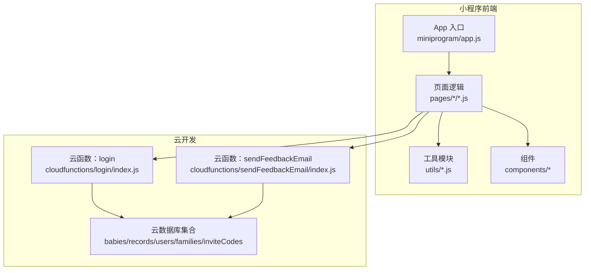
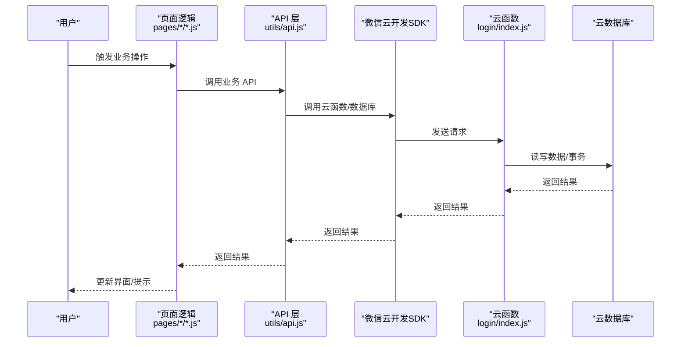
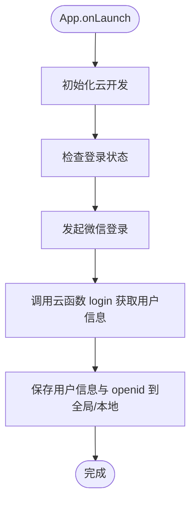
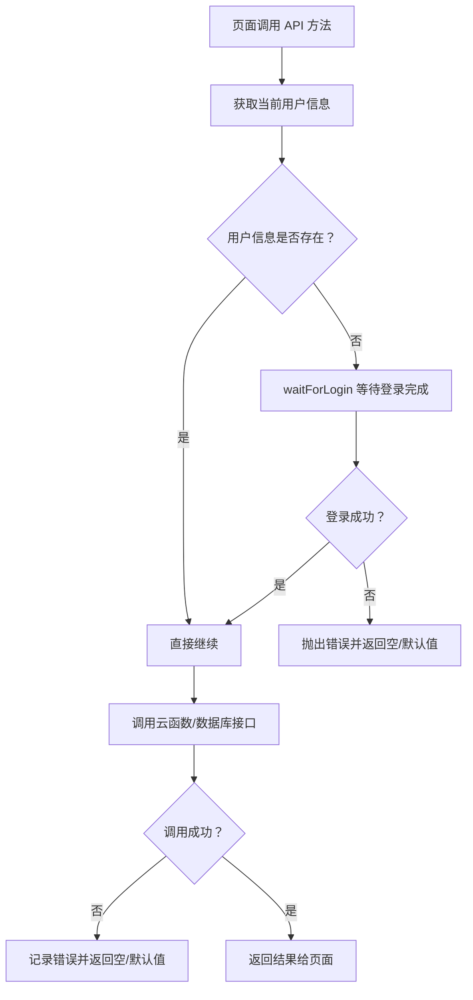
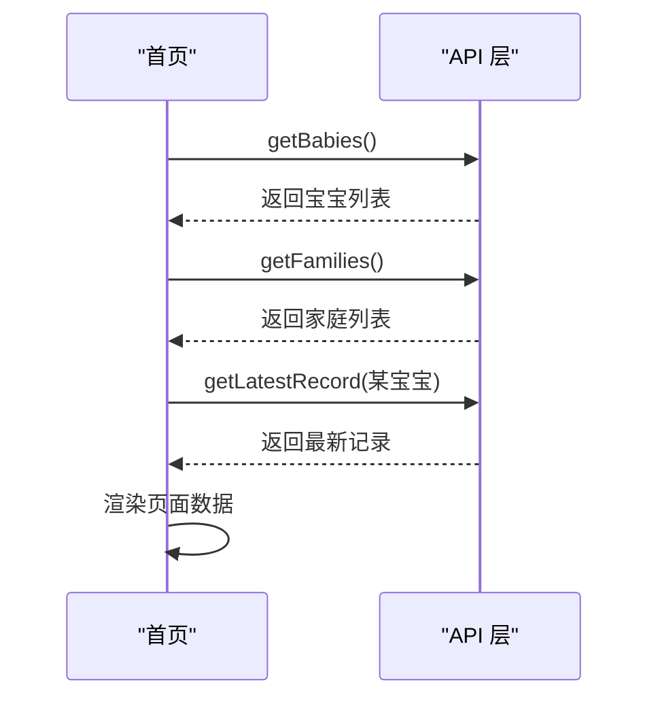
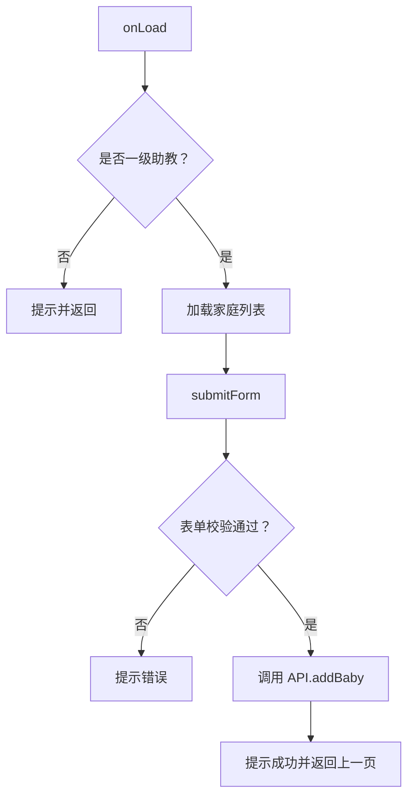
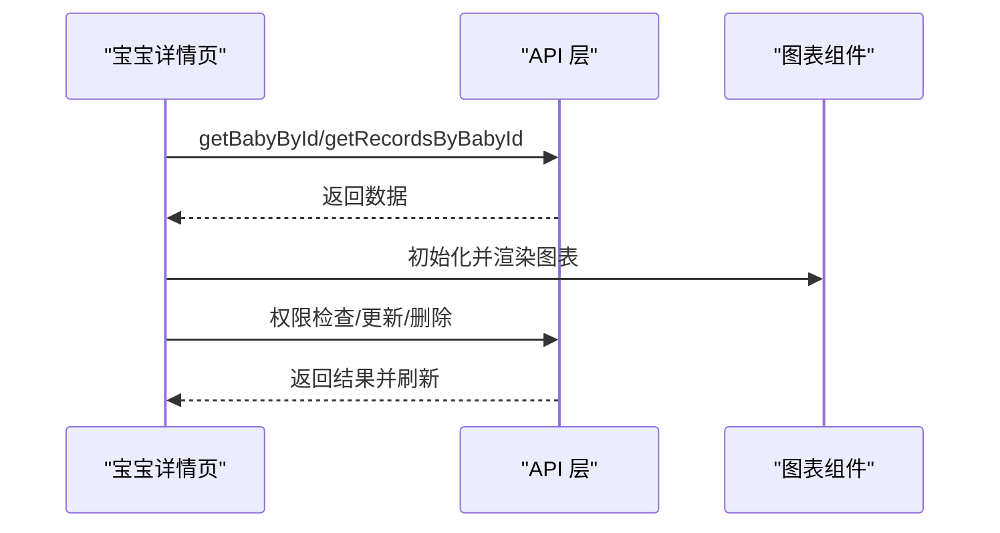
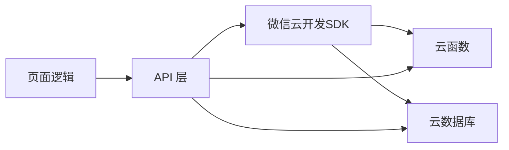

# 调试工具使用

<cite>
**本文引用的文件**
- [miniprogram/app.js](file://miniprogram/app.js)
- [miniprogram/utils/api.js](file://miniprogram/utils/api.js)
- [miniprogram/pages/index/index.js](file://miniprogram/pages/index/index.js)
- [miniprogram/pages/baby-add/baby-add.js](file://miniprogram/pages/baby-add/baby-add.js)
- [miniprogram/pages/baby-detail/baby-detail.js](file://miniprogram/pages/baby-detail/baby-detail.js)
- [miniprogram/components/cloudTipModal/index.js](file://miniprogram/components/cloudTipModal/index.js)
- [miniprogram/utils/util.js](file://miniprogram/utils/util.js)
- [miniprogram/envList.js](file://miniprogram/envList.js)
- [project.config.json](file://project.config.json)
- [cloudfunctions/login/index.js](file://cloudfunctions/login/index.js)
- [cloudfunctions/sendFeedbackEmail/index.js](file://cloudfunctions/sendFeedbackEmail/index.js)
- [README.md](file://README.md)
</cite>

## 目录
1. [简介](#简介)
2. [项目结构](#项目结构)
3. [核心组件](#核心组件)
4. [架构总览](#架构总览)
5. [详细组件分析](#详细组件分析)
6. [依赖关系分析](#依赖关系分析)
7. [性能考量](#性能考量)
8. [故障排除指南](#故障排除指南)
9. [结论](#结论)
10. [附录](#附录)

## 简介
本指南面向使用微信开发者工具进行小程序与云开发调试的工程师，围绕以下主题展开：
- 微信开发者工具的控制台输出、断点调试、网络请求监控、Storage检查等核心调试功能
- 云开发控制台的监控功能：云函数日志查看、数据库查询分析、性能监控仪表板
- 第三方调试工具集成：Chrome DevTools、Postman 等在小程序开发中的应用
- 日志分析与错误追踪：错误堆栈分析、性能瓶颈定位、内存使用监控
- 调试最佳实践与常见场景操作步骤

## 项目结构
该项目采用“小程序前端 + 云函数”的典型分层结构，便于在开发者工具中分别调试前端与云函数侧逻辑。

图示来源
- [miniprogram/app.js:1-56](file://miniprogram/app.js#L1-L56)
- [miniprogram/utils/api.js:1-800](file://miniprogram/utils/api.js#L1-L800)
- [cloudfunctions/login/index.js:1-814](file://cloudfunctions/login/index.js#L1-L814)
- [cloudfunctions/sendFeedbackEmail/index.js:1-21](file://cloudfunctions/sendFeedbackEmail/index.js#L1-L21)

章节来源
- [project.config.json:1-85](file://project.config.json#L1-L85)
- [README.md:77-103](file://README.md#L77-L103)

## 核心组件
- App 入口与初始化：负责云开发初始化、全局登录状态检查与持久化。
- API 层：封装数据库与云函数调用，统一错误处理与登录等待逻辑。
- 页面逻辑：首页、添加宝宝、宝宝详情等页面，承载业务交互与调用 API。
- 云函数：login 负责登录态、家庭与宝宝管理、权限校验；sendFeedbackEmail 作为反馈处理占位。
- 工具与组件：通用工具函数、图表组件、云提示弹窗组件。

章节来源
- [miniprogram/app.js:1-56](file://miniprogram/app.js#L1-L56)
- [miniprogram/utils/api.js:1-800](file://miniprogram/utils/api.js#L1-L800)
- [miniprogram/pages/index/index.js:1-144](file://miniprogram/pages/index/index.js#L1-L144)
- [miniprogram/pages/baby-add/baby-add.js:1-120](file://miniprogram/pages/baby-add/baby-add.js#L1-L120)
- [miniprogram/pages/baby-detail/baby-detail.js:1-691](file://miniprogram/pages/baby-detail/baby-detail.js#L1-L691)
- [cloudfunctions/login/index.js:1-814](file://cloudfunctions/login/index.js#L1-L814)
- [cloudfunctions/sendFeedbackEmail/index.js:1-21](file://cloudfunctions/sendFeedbackEmail/index.js#L1-L21)

## 架构总览
小程序前端通过云开发 SDK 调用云函数与云数据库；云函数在云端执行业务逻辑并访问数据库，实现权限校验、事务与数据一致性保障。

图示来源
- [miniprogram/utils/api.js:1-800](file://miniprogram/utils/api.js#L1-L800)
- [cloudfunctions/login/index.js:1-814](file://cloudfunctions/login/index.js#L1-L814)

## 详细组件分析

### App 初始化与登录流程
- 初始化云开发，设置环境 ID 与 traceUser。
- onLaunch 中检查登录状态并触发登录，登录成功后将用户信息与 openid 写入全局与本地缓存。

图示来源
- [miniprogram/app.js:8-54](file://miniprogram/app.js#L8-L54)

章节来源
- [miniprogram/app.js:1-56](file://miniprogram/app.js#L1-L56)

### API 层：统一调用与错误处理
- 提供获取/增删改查等方法，内部统一处理登录等待、权限校验与错误提示。
- 对数据库与云函数调用进行封装，便于页面直接调用。

图示来源
- [miniprogram/utils/api.js:1-800](file://miniprogram/utils/api.js#L1-L800)

章节来源
- [miniprogram/utils/api.js:1-800](file://miniprogram/utils/api.js#L1-L800)

### 首页：加载宝宝列表与家庭映射
- 页面 onShow 时拉取宝宝列表与家庭列表，构建家庭名称与颜色映射，计算年龄与最新记录并渲染。

图示来源
- [miniprogram/pages/index/index.js:14-52](file://miniprogram/pages/index/index.js#L14-L52)

章节来源
- [miniprogram/pages/index/index.js:1-144](file://miniprogram/pages/index/index.js#L1-L144)

### 添加宝宝：权限校验与表单校验
- onLoad 中校验一级助教权限；表单输入进行必填与数值校验；提交后调用 API 并返回上一页。

图示来源
- [miniprogram/pages/baby-add/baby-add.js:20-118](file://miniprogram/pages/baby-add/baby-add.js#L20-L118)

章节来源
- [miniprogram/pages/baby-add/baby-add.js:1-120](file://miniprogram/pages/baby-add/baby-add.js#L1-L120)

### 宝宝详情：图表与权限控制
- 支持身高/体重曲线绘制，按性别加载标准曲线；权限控制：一级助教可修改姓名/头像/删除记录；二级助教可添加记录与删除自己录入的记录。

图示来源
- [miniprogram/pages/baby-detail/baby-detail.js:193-245](file://miniprogram/pages/baby-detail/baby-detail.js#L193-L245)

章节来源
- [miniprogram/pages/baby-detail/baby-detail.js:1-691](file://miniprogram/pages/baby-detail/baby-detail.js#L1-L691)

### 云函数：login 与 sendFeedbackEmail
- login：处理登录、家庭/宝宝/记录/成员管理、权限校验、事务与邀请码等。
- sendFeedbackEmail：接收反馈数据并记录日志，当前暂不发送邮件。

章节来源
- [cloudfunctions/login/index.js:1-814](file://cloudfunctions/login/index.js#L1-L814)
- [cloudfunctions/sendFeedbackEmail/index.js:1-21](file://cloudfunctions/sendFeedbackEmail/index.js#L1-L21)

## 依赖关系分析
- 前端依赖微信云开发 SDK，通过 wx.cloud.* 调用云函数与数据库。
- 云函数依赖 @cloudbase/node-sdk，访问云数据库与上下文信息。
- 页面与组件通过 API 层解耦，便于测试与调试。

图示来源
- [miniprogram/utils/api.js:1-800](file://miniprogram/utils/api.js#L1-L800)
- [cloudfunctions/login/index.js:1-814](file://cloudfunctions/login/index.js#L1-L814)

章节来源
- [miniprogram/utils/api.js:1-800](file://miniprogram/utils/api.js#L1-L800)
- [cloudfunctions/login/index.js:1-814](file://cloudfunctions/login/index.js#L1-L814)

## 性能考量
- 避免不必要的全量查询：优先使用条件过滤与分页，减少传输与渲染压力。
- 合理使用本地缓存：将常用数据写入本地 Storage，降低重复请求。
- 图表懒加载：仅在切换到图表标签时初始化，避免首屏阻塞。
- 云函数冷启动优化：减少依赖体积、合理初始化，避免在函数内做耗时初始化。

## 故障排除指南

### 一、微信开发者工具调试功能
- 控制台输出
  - 在页面逻辑、API 层与云函数中使用日志输出关键变量与错误信息，便于定位问题。
  - 示例路径参考：[miniprogram/pages/index/index.js:46-50](file://miniprogram/pages/index/index.js#L46-L50)、[miniprogram/utils/api.js:48-54](file://miniprogram/utils/api.js#L48-L54)、[cloudfunctions/login/index.js:796-800](file://cloudfunctions/login/index.js#L796-L800)
- 断点调试
  - 在页面逻辑与 API 方法中设置断点，观察变量状态与调用链。
  - 示例路径参考：[miniprogram/pages/baby-add/baby-add.js:74-118](file://miniprogram/pages/baby-add/baby-add.js#L74-L118)、[miniprogram/utils/api.js:14-41](file://miniprogram/utils/api.js#L14-L41)
- 网络请求监控
  - 打开“网络”面板，筛选域名与请求类型，观察云函数调用与数据库请求的耗时与状态码。
  - 关注 wx.cloud.callFunction 与数据库查询的请求详情。
- Storage 检查
  - 在“Storage”面板查看本地缓存键值，如 openid、userInfo 等，确认登录态与用户信息是否正确写入。
  - 示例路径参考：[miniprogram/app.js:42-43](file://miniprogram/app.js#L42-L43)

章节来源
- [miniprogram/pages/index/index.js:46-50](file://miniprogram/pages/index/index.js#L46-L50)
- [miniprogram/utils/api.js:48-54](file://miniprogram/utils/api.js#L48-L54)
- [cloudfunctions/login/index.js:796-800](file://cloudfunctions/login/index.js#L796-L800)
- [miniprogram/pages/baby-add/baby-add.js:74-118](file://miniprogram/pages/baby-add/baby-add.js#L74-L118)
- [miniprogram/app.js:42-43](file://miniprogram/app.js#L42-L43)

### 二、云开发控制台监控
- 云函数日志查看
  - 在“云函数”面板选择对应函数，查看实时日志与详细日志，结合 RequestId 定位问题。
  - 示例路径参考：[cloudfunctions/login/index.js:12-19](file://cloudfunctions/login/index.js#L12-L19)、[cloudfunctions/sendFeedbackEmail/index.js:12-19](file://cloudfunctions/sendFeedbackEmail/index.js#L12-L19)
- 数据库查询分析
  - 在“云数据库”面板查看集合与索引，使用聚合与查询分析慢查询，优化 where 条件与投影字段。
- 性能监控仪表板
  - 在“云开发”概览中查看函数耗时、冷启动次数、错误率等指标，识别性能瓶颈。

章节来源
- [cloudfunctions/login/index.js:12-19](file://cloudfunctions/login/index.js#L12-L19)
- [cloudfunctions/sendFeedbackEmail/index.js:12-19](file://cloudfunctions/sendFeedbackEmail/index.js#L12-L19)

### 三、第三方调试工具集成
- Chrome DevTools
  - 使用“远程调试”连接真机，结合“Sources”面板设置断点，观察全局变量与调用栈。
  - 使用“Elements”与“Network”面板辅助定位 UI 与网络问题。
- Postman
  - 若云函数暴露 HTTP 访问，可在 Postman 中构造请求体与头部，验证鉴权与参数校验。
  - 注意：本项目云函数主要通过 wx.cloud.callFunction 调用，HTTP 访问需额外配置。

章节来源
- [README.md:41-76](file://README.md#L41-L76)

### 四、日志分析与错误追踪
- 错误堆栈分析
  - 在页面与 API 层捕获异常并打印堆栈，结合云函数日志定位具体错误位置。
  - 示例路径参考：[miniprogram/pages/baby-detail/baby-detail.js:614-662](file://miniprogram/pages/baby-detail/baby-detail.js#L614-L662)、[miniprogram/utils/api.js:206-209](file://miniprogram/utils/api.js#L206-L209)
- 性能瓶颈定位
  - 关注数据库查询耗时、图表渲染耗时与云函数执行时间，优先优化热点路径。
- 内存使用监控
  - 在“性能”面板观察内存增长趋势，避免组件未销毁导致的内存泄漏。
  - 示例路径参考：[miniprogram/pages/baby-detail/baby-detail.js:184-191](file://miniprogram/pages/baby-detail/baby-detail.js#L184-L191)

章节来源
- [miniprogram/pages/baby-detail/baby-detail.js:184-191](file://miniprogram/pages/baby-detail/baby-detail.js#L184-L191)
- [miniprogram/utils/api.js:206-209](file://miniprogram/utils/api.js#L206-L209)

### 五、调试最佳实践与常见场景
- 登录与权限问题
  - 确认 App 初始化与登录流程正常，检查 openid 是否写入 Storage。
  - 在 API 层增加登录等待与超时处理，避免并发访问导致的权限判断错误。
  - 示例路径参考：[miniprogram/app.js:23-54](file://miniprogram/app.js#L23-L54)、[miniprogram/utils/api.js:14-41](file://miniprogram/utils/api.js#L14-L41)
- 数据加载与渲染
  - 首页与详情页应先拉取家庭列表再进行映射，避免空指针。
  - 图表懒加载，减少首屏压力。
  - 示例路径参考：[miniprogram/pages/index/index.js:14-52](file://miniprogram/pages/index/index.js#L14-L52)、[miniprogram/pages/baby-detail/baby-detail.js:184-191](file://miniprogram/pages/baby-detail/baby-detail.js#L184-L191)
- 表单与权限校验
  - 添加宝宝前校验权限与表单合法性，失败时给出明确提示。
  - 示例路径参考：[miniprogram/pages/baby-add/baby-add.js:20-44](file://miniprogram/pages/baby-add/baby-add.js#L20-L44)、[miniprogram/pages/baby-add/baby-add.js:74-118](file://miniprogram/pages/baby-add/baby-add.js#L74-L118)
- 云函数事务与权限
  - 删除宝宝/记录使用事务保证一致性；权限校验严格区分一级助教与二级助教。
  - 示例路径参考：[cloudfunctions/login/index.js:483-510](file://cloudfunctions/login/index.js#L483-L510)、[cloudfunctions/login/index.js:512-554](file://cloudfunctions/login/index.js#L512-L554)

章节来源
- [miniprogram/app.js:23-54](file://miniprogram/app.js#L23-L54)
- [miniprogram/utils/api.js:14-41](file://miniprogram/utils/api.js#L14-L41)
- [miniprogram/pages/index/index.js:14-52](file://miniprogram/pages/index/index.js#L14-L52)
- [miniprogram/pages/baby-detail/baby-detail.js:184-191](file://miniprogram/pages/baby-detail/baby-detail.js#L184-L191)
- [miniprogram/pages/baby-add/baby-add.js:20-44](file://miniprogram/pages/baby-add/baby-add.js#L20-L44)
- [cloudfunctions/login/index.js:483-510](file://cloudfunctions/login/index.js#L483-L510)
- [cloudfunctions/login/index.js:512-554](file://cloudfunctions/login/index.js#L512-L554)

## 结论
通过微信开发者工具的控制台、断点、网络与 Storage 能力，配合云开发控制台的日志与性能监控，能够高效定位小程序与云函数的问题。结合 API 层统一错误处理与权限校验，以及图表懒加载与本地缓存策略，可显著提升调试效率与用户体验。

## 附录
- 项目配置与环境
  - 项目配置文件与云函数根目录、小程序根目录等信息可参考项目配置。
  - 示例路径参考：[project.config.json:1-85](file://project.config.json#L1-L85)
- 环境变量与本地调试
  - 如需本地调试云函数，可参考云函数模板与环境变量配置。
  - 示例路径参考：[README.md:41-76](file://README.md#L41-L76)

章节来源
- [project.config.json:1-85](file://project.config.json#L1-L85)
- [README.md:41-76](file://README.md#L41-L76)