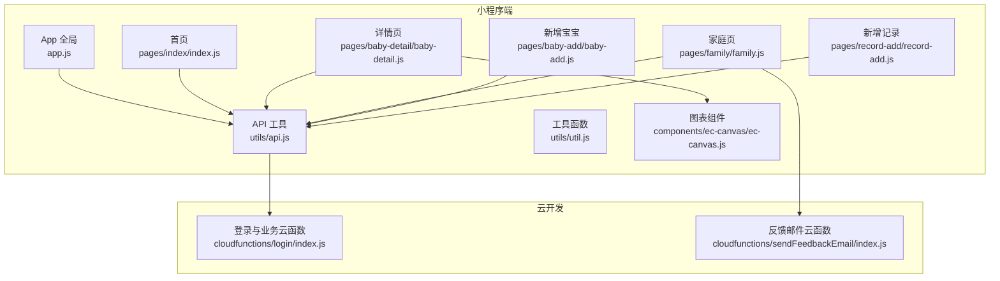
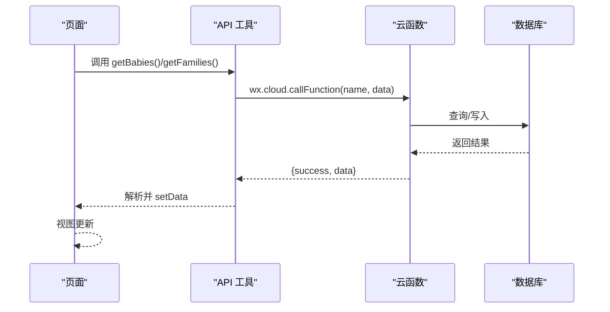
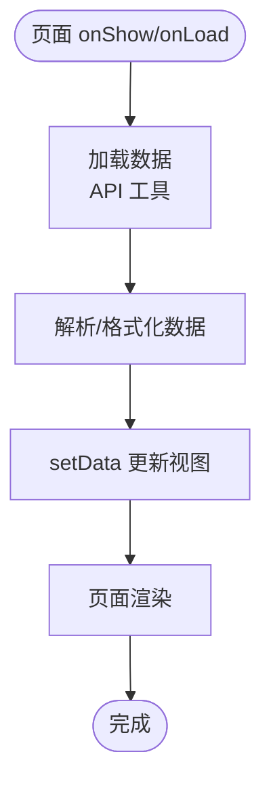
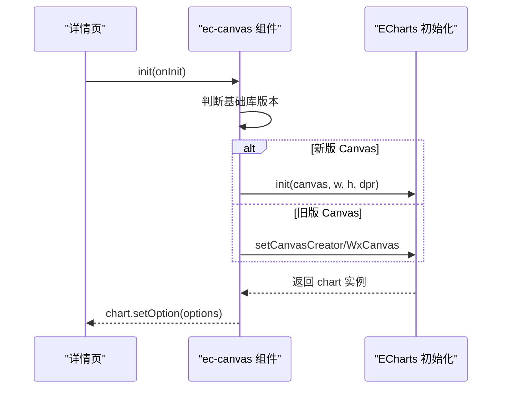
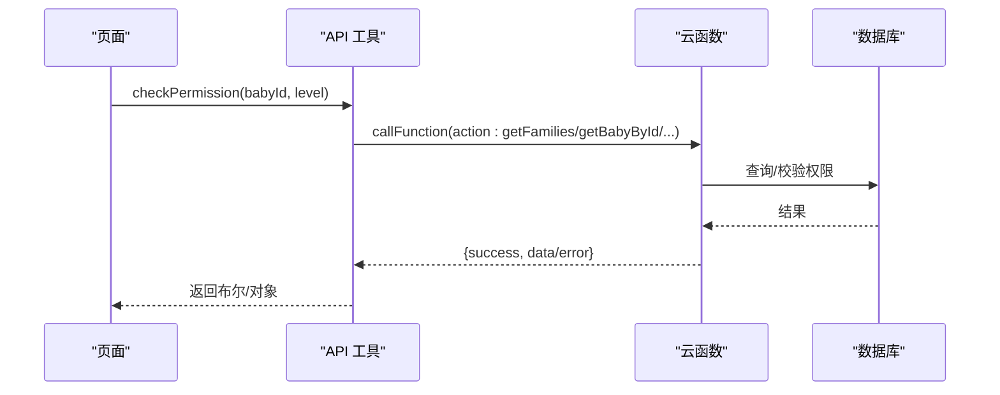
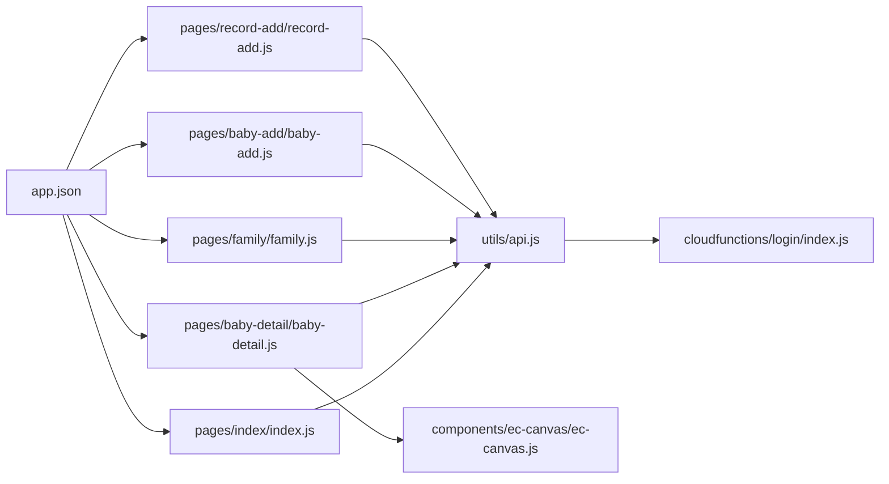
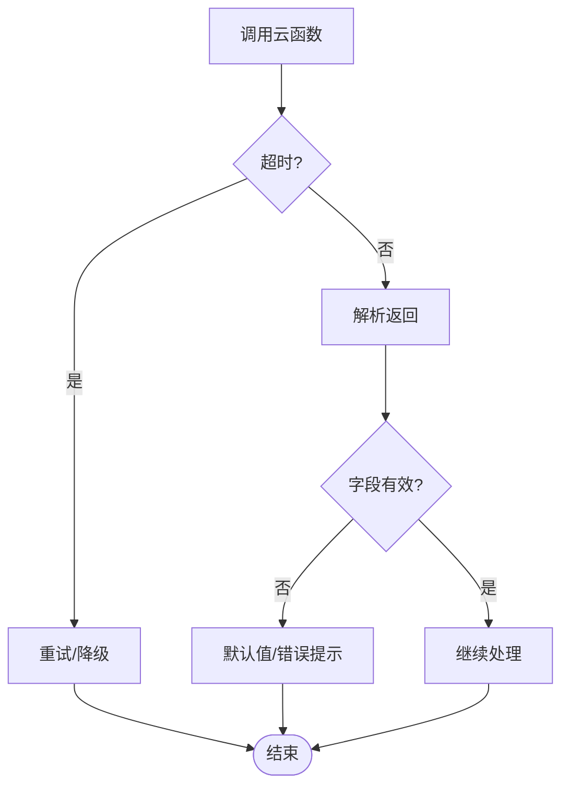

# 运行时错误

<cite>
**本文引用的文件**
- [miniprogram/app.js](file://miniprogram/app.js)
- [miniprogram/utils/api.js](file://miniprogram/utils/api.js)
- [miniprogram/utils/util.js](file://miniprogram/utils/util.js)
- [miniprogram/pages/index/index.js](file://miniprogram/pages/index/index.js)
- [miniprogram/pages/baby-detail/baby-detail.js](file://miniprogram/pages/baby-detail/baby-detail.js)
- [miniprogram/pages/family/family.js](file://miniprogram/pages/family/family.js)
- [miniprogram/pages/baby-add/baby-add.js](file://miniprogram/pages/baby-add/baby-add.js)
- [miniprogram/pages/record-add/record-add.js](file://miniprogram/pages/record-add/record-add.js)
- [miniprogram/components/ec-canvas/ec-canvas.js](file://miniprogram/components/ec-canvas/ec-canvas.js)
- [cloudfunctions/login/index.js](file://cloudfunctions/login/index.js)
- [cloudfunctions/sendFeedbackEmail/index.js](file://cloudfunctions/sendFeedbackEmail/index.js)
- [miniprogram/app.json](file://miniprogram/app.json)
</cite>

## 目录
1. [简介](#简介)
2. [项目结构](#项目结构)
3. [核心组件](#核心组件)
4. [架构总览](#架构总览)
5. [详细组件分析](#详细组件分析)
6. [依赖关系分析](#依赖关系分析)
7. [性能考量](#性能考量)
8. [故障排除指南](#故障排除指南)
9. [结论](#结论)
10. [附录](#附录)

## 简介
本指南聚焦于微信小程序在运行时可能出现的常见错误与故障，覆盖页面加载失败、组件渲染异常、数据绑定错误、API 调用失败（网络超时、返回数据格式错误、权限验证失败）、页面跳转与路由问题（页面栈溢出、参数传递错误、生命周期异常）、数据加载与缓存问题（异步处理、Promise 链错误、内存泄漏），以及通用排查步骤与调试技巧。文档基于仓库现有代码进行分析，提供可操作的定位与修复建议。

## 项目结构
项目采用分层组织：应用入口与全局逻辑位于 app.js；页面逻辑集中在 pages 目录；工具函数与通用 API 封装在 utils；图表组件封装在 components；云函数位于 cloudfunctions；应用配置在 app.json。

**图表来源**
- [miniprogram/app.js:1-56](file://miniprogram/app.js#L1-L56)
- [miniprogram/utils/api.js:1-879](file://miniprogram/utils/api.js#L1-L879)
- [miniprogram/utils/util.js:1-55](file://miniprogram/utils/util.js#L1-L55)
- [miniprogram/pages/index/index.js:1-144](file://miniprogram/pages/index/index.js#L1-L144)
- [miniprogram/pages/baby-detail/baby-detail.js:1-691](file://miniprogram/pages/baby-detail/baby-detail.js#L1-L691)
- [miniprogram/pages/family/family.js:1-757](file://miniprogram/pages/family/family.js#L1-L757)
- [miniprogram/pages/baby-add/baby-add.js:1-120](file://miniprogram/pages/baby-add/baby-add.js#L1-L120)
- [miniprogram/pages/record-add/record-add.js:1-118](file://miniprogram/pages/record-add/record-add.js#L1-L118)
- [miniprogram/components/ec-canvas/ec-canvas.js:1-285](file://miniprogram/components/ec-canvas/ec-canvas.js#L1-L285)
- [cloudfunctions/login/index.js:1-814](file://cloudfunctions/login/index.js#L1-L814)
- [cloudfunctions/sendFeedbackEmail/index.js:1-21](file://cloudfunctions/sendFeedbackEmail/index.js#L1-L21)

**章节来源**
- [miniprogram/app.json:1-39](file://miniprogram/app.json#L1-L39)

## 核心组件
- 应用入口与全局状态：负责初始化云能力、检查登录状态、全局用户信息存储与持久化。
- API 工具：统一封装用户信息获取、等待登录、数据库与云函数调用、权限校验等。
- 页面逻辑：首页、详情页、家庭页、新增宝宝、新增记录等页面均通过 API 工具访问云函数与数据库。
- 图表组件：封装 ECharts 初始化、触摸交互、跨基础库版本兼容。
- 云函数：登录态、家庭与宝宝管理、记录管理、邀请码、权限变更、反馈收集与邮件通知。

**章节来源**
- [miniprogram/app.js:1-56](file://miniprogram/app.js#L1-L56)
- [miniprogram/utils/api.js:1-879](file://miniprogram/utils/api.js#L1-L879)
- [miniprogram/components/ec-canvas/ec-canvas.js:1-285](file://miniprogram/components/ec-canvas/ec-canvas.js#L1-L285)
- [cloudfunctions/login/index.js:1-814](file://cloudfunctions/login/index.js#L1-L814)
- [cloudfunctions/sendFeedbackEmail/index.js:1-21](file://cloudfunctions/sendFeedbackEmail/index.js#L1-L21)

## 架构总览
小程序端通过云函数与数据库交互，云函数内部进行权限校验与业务逻辑处理，图表组件负责可视化渲染。页面间通过 navigateTo/navigateBack 等路由 API 进行跳转，数据通过 setData 触发视图更新。

**图表来源**
- [miniprogram/utils/api.js:44-91](file://miniprogram/utils/api.js#L44-L91)
- [cloudfunctions/login/index.js:22-92](file://cloudfunctions/login/index.js#L22-L92)

## 详细组件分析

### 页面加载与生命周期
- 首页 index：在 onShow 中加载宝宝列表与家庭列表，逐条计算年龄与最新记录，最终 setData 渲染。
- 详情页 baby-detail：onLoad 接收 babyId，onShow 加载数据；图表组件懒加载，切换标签时再初始化。
- 家庭页 family：onShow 加载家庭列表，支持创建、加入、退出、邀请、权限管理、头像/昵称修改、反馈提交。
- 新增宝宝/记录：onLoad 校验权限，表单校验后调用 API 并 navigateBack。

**图表来源**
- [miniprogram/pages/index/index.js:14-52](file://miniprogram/pages/index/index.js#L14-L52)
- [miniprogram/pages/baby-detail/baby-detail.js:193-245](file://miniprogram/pages/baby-detail/baby-detail.js#L193-L245)
- [miniprogram/pages/family/family.js:29-80](file://miniprogram/pages/family/family.js#L29-L80)

**章节来源**
- [miniprogram/pages/index/index.js:1-144](file://miniprogram/pages/index/index.js#L1-L144)
- [miniprogram/pages/baby-detail/baby-detail.js:1-691](file://miniprogram/pages/baby-detail/baby-detail.js#L1-L691)
- [miniprogram/pages/family/family.js:1-757](file://miniprogram/pages/family/family.js#L1-L757)
- [miniprogram/pages/baby-add/baby-add.js:1-120](file://miniprogram/pages/baby-add/baby-add.js#L1-L120)
- [miniprogram/pages/record-add/record-add.js:1-118](file://miniprogram/pages/record-add/record-add.js#L1-L118)

### 组件渲染与图表初始化
- 图表组件 ec-canvas：根据基础库版本选择新旧 Canvas 初始化路径，注册预处理器禁用 progressive，避免 drawImage 不支持 DOM 的问题；提供 touchStart/touchMove/touchEnd 事件桥接。
- 详情页图表：按性别选择标准曲线，按最近若干点自动缩放；懒加载模式下切换标签才初始化。

**图表来源**
- [miniprogram/components/ec-canvas/ec-canvas.js:80-192](file://miniprogram/components/ec-canvas/ec-canvas.js#L80-L192)
- [miniprogram/pages/baby-detail/baby-detail.js:323-397](file://miniprogram/pages/baby-detail/baby-detail.js#L323-L397)

**章节来源**
- [miniprogram/components/ec-canvas/ec-canvas.js:1-285](file://miniprogram/components/ec-canvas/ec-canvas.js#L1-L285)
- [miniprogram/pages/baby-detail/baby-detail.js:323-473](file://miniprogram/pages/baby-detail/baby-detail.js#L323-L473)

### API 调用与权限校验
- API 工具：封装 waitForLogin、getCurrentUser、getBabies/getBabyById/getRecordsByBabyId 等；对云函数调用统一处理 success/fail；对权限不足、超时等场景进行错误提示。
- 云函数：登录态校验、家庭/宝宝/记录 CRUD、权限校验、邀请码生成与清理、反馈收集与邮件通知。

**图表来源**
- [miniprogram/utils/api.js:782-800](file://miniprogram/utils/api.js#L782-L800)
- [cloudfunctions/login/index.js:22-92](file://cloudfunctions/login/index.js#L22-L92)

**章节来源**
- [miniprogram/utils/api.js:1-879](file://miniprogram/utils/api.js#L1-L879)
- [cloudfunctions/login/index.js:1-814](file://cloudfunctions/login/index.js#L1-L814)

## 依赖关系分析
- 页面依赖 API 工具；API 工具依赖云函数与数据库；图表组件独立于页面，通过组件化复用。
- 权限控制贯穿 API 与云函数两端，页面侧通过 checkPermission 做前置判断，云函数侧做最终校验。
- 路由配置在 app.json，页面栈受 navigateTo/navigateBack 影响。

**图表来源**
- [miniprogram/pages/index/index.js:1-144](file://miniprogram/pages/index/index.js#L1-L144)
- [miniprogram/pages/baby-detail/baby-detail.js:1-691](file://miniprogram/pages/baby-detail/baby-detail.js#L1-L691)
- [miniprogram/pages/family/family.js:1-757](file://miniprogram/pages/family/family.js#L1-L757)
- [miniprogram/pages/baby-add/baby-add.js:1-120](file://miniprogram/pages/baby-add/baby-add.js#L1-L120)
- [miniprogram/pages/record-add/record-add.js:1-118](file://miniprogram/pages/record-add/record-add.js#L1-L118)
- [miniprogram/utils/api.js:1-879](file://miniprogram/utils/api.js#L1-L879)
- [miniprogram/components/ec-canvas/ec-canvas.js:1-285](file://miniprogram/components/ec-canvas/ec-canvas.js#L1-L285)
- [cloudfunctions/login/index.js:1-814](file://cloudfunctions/login/index.js#L1-L814)
- [miniprogram/app.json:1-39](file://miniprogram/app.json#L1-L39)

**章节来源**
- [miniprogram/app.json:1-39](file://miniprogram/app.json#L1-L39)

## 性能考量
- 图表懒加载：详情页切换到身高/体重标签时再初始化，减少首屏渲染压力。
- 数据预处理：在页面侧对年龄、家庭映射等进行一次性计算，避免重复计算。
- 云函数事务：删除宝宝时使用事务保证一致性，避免部分删除导致脏数据。
- 基础库兼容：图表组件根据 SDK 版本选择初始化路径，兼顾性能与稳定性。

[本节为通用指导，无需特定文件引用]

## 故障排除指南

### 一、页面加载失败
- 现象
  - 页面空白、白屏或长时间无响应。
  - 控制台出现“找不到页面”或路由错误。
- 常见原因
  - 页面未在 app.json 注册。
  - 页面 onLoad/onShow 中异步数据未正确处理，setData 时机不当。
  - 云函数返回空或报错，前端未兜底。
- 诊断步骤
  - 检查 app.json pages 列表是否包含目标页面。
  - 在页面 onLoad/onShow 中增加错误捕获与提示。
  - 在 API 工具中对云函数调用增加 fail 回调与日志。
- 修复建议
  - 补充缺失页面路径至 app.json。
  - 对异步数据设置默认值与空状态，避免空对象渲染。
  - 对云函数返回值进行判空与字段校验，失败时显示错误提示并引导重试。

**章节来源**
- [miniprogram/app.json:2-8](file://miniprogram/app.json#L2-L8)
- [miniprogram/pages/index/index.js:14-52](file://miniprogram/pages/index/index.js#L14-L52)
- [miniprogram/utils/api.js:44-91](file://miniprogram/utils/api.js#L44-L91)

### 二、组件渲染异常（图表）
- 现象
  - 图表不显示、空白或报错。
  - 触摸缩放无效或报“找不到组件”。
- 常见原因
  - 未正确绑定 ec 属性或未设置 canvasId。
  - 基础库版本过低，无法使用新版 Canvas。
  - 图表初始化时机不当，DOM 尚未就绪。
- 诊断步骤
  - 检查组件属性绑定与 canvasId 是否一致。
  - 查看控制台是否输出“基础库版本过低”警告。
  - 确认 init 调用在组件 ready 或页面 onReady 后执行。
- 修复建议
  - 确保组件绑定 ec 与 canvasId 正确。
  - 升级基础库至 2.9.0+ 以启用新 Canvas。
  - 使用懒加载并在切换标签后再初始化图表。

**章节来源**
- [miniprogram/components/ec-canvas/ec-canvas.js:68-77](file://miniprogram/components/ec-canvas/ec-canvas.js#L68-L77)
- [miniprogram/components/ec-canvas/ec-canvas.js:80-108](file://miniprogram/components/ec-canvas/ec-canvas.js#L80-L108)
- [miniprogram/pages/baby-detail/baby-detail.js:184-191](file://miniprogram/pages/baby-detail/baby-detail.js#L184-L191)

### 三、数据绑定错误
- 现象
  - 页面显示“undefined”或“NaN”。
  - 表单输入后未实时更新。
- 常见原因
  - setData 字段名拼写错误或层级不匹配。
  - 未使用 setData 更新视图，直接修改 data。
  - 云函数返回字段缺失或类型不符。
- 诊断步骤
  - 在 setData 前打印 data 与目标字段，核对键名。
  - 检查模板中绑定的字段与 data 是否一致。
  - 在云函数中补充缺失字段或提供默认值。
- 修复建议
  - 使用安全的字段拼接方式，如使用数组/对象展开。
  - 对数值型字段进行类型转换与边界检查。
  - 为可选字段提供默认值，避免空值渲染。

**章节来源**
- [miniprogram/pages/baby-detail/baby-detail.js:224-235](file://miniprogram/pages/baby-detail/baby-detail.js#L224-L235)
- [miniprogram/utils/api.js:150-210](file://miniprogram/utils/api.js#L150-L210)

### 四、API 调用失败
- 网络请求超时
  - 现象：云函数调用长时间无响应。
  - 诊断：在 API 工具中增加超时检测与重试机制。
  - 修复：为 wx.cloud.callFunction 设置合理超时，必要时降级为本地缓存或离线提示。
- 返回数据格式错误
  - 现象：字段缺失、类型不匹配、结构不符合预期。
  - 诊断：在 API 工具中对 result 进行严格校验与默认值填充。
  - 修复：在云函数中统一返回结构，确保必填字段存在。
- 权限验证失败
  - 现象：提示“无权限”或“只有一级助教/二级助教”。
  - 诊断：确认 checkPermission 调用与云函数权限校验一致。
  - 修复：在页面侧提前校验权限，云函数侧再次校验并返回明确错误信息。

**图表来源**
- [miniprogram/utils/api.js:14-41](file://miniprogram/utils/api.js#L14-L41)
- [cloudfunctions/login/index.js:22-92](file://cloudfunctions/login/index.js#L22-L92)

**章节来源**
- [miniprogram/utils/api.js:1-879](file://miniprogram/utils/api.js#L1-L879)
- [cloudfunctions/login/index.js:1-814](file://cloudfunctions/login/index.js#L1-L814)

### 五、页面跳转与路由问题
- 页面栈溢出
  - 现象：navigateTo 过多导致页面栈过深。
  - 诊断：统计页面跳转次数与层级。
  - 修复：优先使用 redirectTo 或 navigateBack，避免无限 push。
- 参数传递错误
  - 现象：目标页面接收不到参数或参数类型错误。
  - 诊断：在 onLoad 中打印 options 并校验类型。
  - 修复：对参数进行类型转换与默认值处理。
- 页面生命周期异常
  - 现象：onShow 未触发或数据未刷新。
  - 诊断：确认页面是否被 tabBar 页面替换。
  - 修复：使用 onShow 刷新数据，避免依赖 onShow 之外的状态。

**章节来源**
- [miniprogram/pages/baby-detail/baby-detail.js:170-182](file://miniprogram/pages/baby-detail/baby-detail.js#L170-L182)
- [miniprogram/pages/baby-add/baby-add.js:20-29](file://miniprogram/pages/baby-add/baby-add.js#L20-L29)
- [miniprogram/pages/record-add/record-add.js:18-39](file://miniprogram/pages/record-add/record-add.js#L18-L39)

### 六、数据加载与缓存问题
- 异步数据处理
  - 现象：并发请求导致竞态或数据覆盖。
  - 诊断：检查多个异步调用的顺序与合并策略。
  - 修复：使用 Promise.all 并行聚合，或串行依赖明确。
- Promise 链错误
  - 现象：中间环节抛错导致后续链断裂。
  - 诊断：在每个 then/catch 中记录错误。
  - 修复：为每个阶段添加错误处理与回退逻辑。
- 内存泄漏
  - 现象：页面切换后图表实例未释放，内存持续增长。
  - 诊断：确认页面卸载时销毁图表实例。
  - 修复：在页面 onHide 或组件 detached 中销毁 chart。

**章节来源**
- [miniprogram/pages/baby-detail/baby-detail.js:323-397](file://miniprogram/pages/baby-detail/baby-detail.js#L323-L397)
- [miniprogram/components/ec-canvas/ec-canvas.js:193-214](file://miniprogram/components/ec-canvas/ec-canvas.js#L193-L214)

### 七、通用排查步骤与调试技巧
- 开启调试
  - 在开发者工具中开启“断点调试”“Console 日志”“Network 请求”。
- 错误捕获
  - 在页面与 API 工具中统一 try/catch，记录错误堆栈与上下文。
- 网络诊断
  - 检查 wx.cloud.callFunction 的返回值与错误对象，区分业务错误与系统错误。
- 权限与登录
  - 确认 App.onLaunch 中初始化云能力与登录流程，waitForLogin 的超时与重试策略。
- 图表与组件
  - 确保组件属性绑定正确，基础库版本满足要求，懒加载时机合理。

**章节来源**
- [miniprogram/app.js:8-20](file://miniprogram/app.js#L8-L20)
- [miniprogram/utils/api.js:14-41](file://miniprogram/utils/api.js#L14-L41)
- [miniprogram/components/ec-canvas/ec-canvas.js:80-108](file://miniprogram/components/ec-canvas/ec-canvas.js#L80-L108)

## 结论
本指南围绕页面加载、组件渲染、数据绑定、API 调用、路由跳转、数据与缓存、通用排查等方面提供了系统化的诊断与修复思路。结合项目现有代码结构与实现细节，建议在开发过程中：
- 统一错误处理与日志记录；
- 在关键节点增加超时与重试；
- 严格校验数据结构与权限；
- 合理使用懒加载与生命周期钩子；
- 在图表与复杂组件上关注基础库兼容与资源释放。

[本节为总结，无需特定文件引用]

## 附录
- 常见错误码与提示
  - “无权限查看此宝宝信息/记录”：云函数权限校验失败。
  - “只有一级助教/二级助教可以...”：checkPermission 返回 false。
  - “基础库版本过低”：图表组件检测到 SDKVersion < 1.9.91。
- 建议的改进点
  - 在 API 工具中引入统一的错误分类与国际化提示。
  - 在页面侧增加骨架屏或占位符，提升感知性能。
  - 在图表组件中增加销毁钩子与内存监控。

[本节为通用指导，无需特定文件引用]