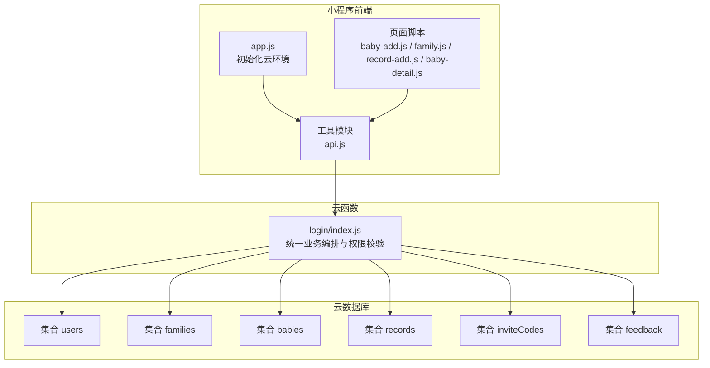
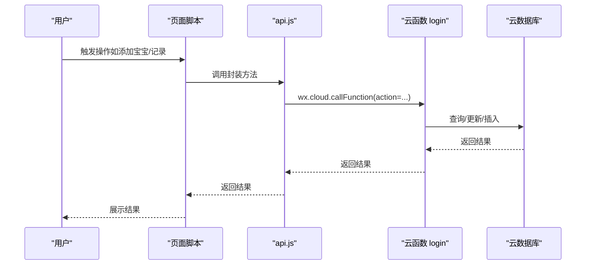
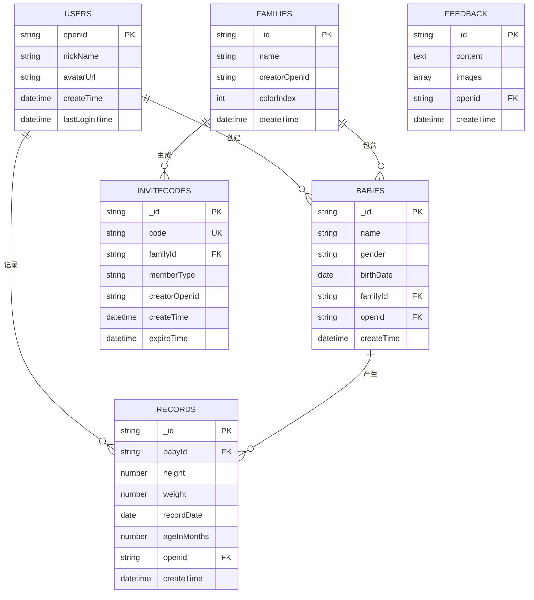
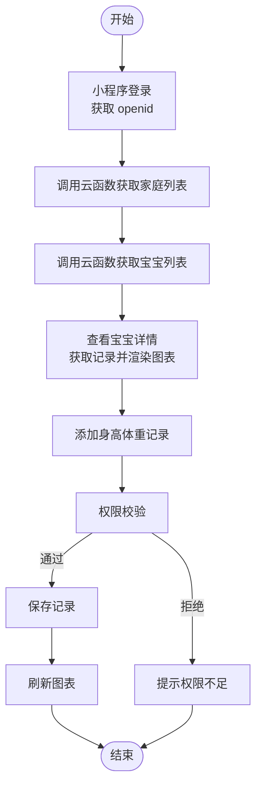
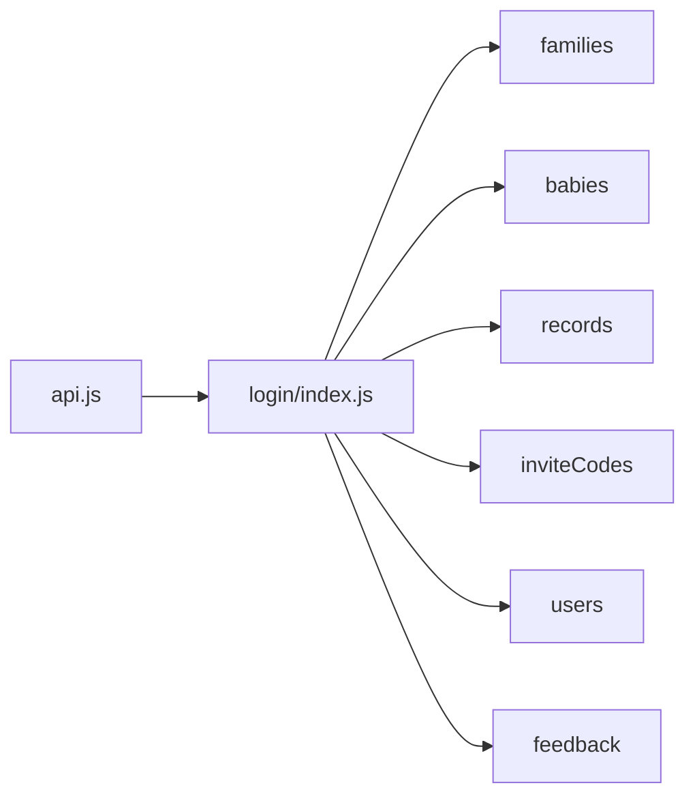

# 数据库设计

<cite>
**本文引用的文件**
- [app.js](file://miniprogram/app.js)
- [app.json](file://miniprogram/app.json)
- [api.js](file://miniprogram/utils/api.js)
- [baby-add.js](file://miniprogram/pages/baby-add/baby-add.js)
- [baby-detail.js](file://miniprogram/pages/baby-detail/baby-detail.js)
- [record-add.js](file://miniprogram/pages/record-add/record-add.js)
- [family.js](file://miniprogram/pages/family/family.js)
- [login/index.js](file://cloudfunctions/login/index.js)
- [SKILL.md](file://.agents/skills/cloudbase/references/no-sql-web-sdk/SKILL.md)
- [security-rules.md](file://.agents/skills/cloudbase/references/no-sql-web-sdk/security-rules.md)
- [cloudbase-platform SKILL.md](file://.agents/skills/cloudbase/references/cloudbase-platform/SKILL.md)
</cite>

## 目录
1. [简介](#简介)
2. [项目结构](#项目结构)
3. [核心组件](#核心组件)
4. [架构总览](#架构总览)
5. [详细组件分析](#详细组件分析)
6. [依赖分析](#依赖分析)
7. [性能考虑](#性能考虑)
8. [故障排查指南](#故障排查指南)
9. [结论](#结论)
10. [附录](#附录)

## 简介
本数据库设计文档面向“宝宝助手”微信小程序，基于现有代码库梳理与抽象，给出整体数据库架构、核心数据模型、索引与查询优化策略、数据完整性保障、权限控制、数据流图与ER图，以及迁移、备份与安全隐私建议。目标是帮助开发者快速理解并正确使用数据库层。

## 项目结构
小程序采用前端云开发（CloudBase）+ 云函数的架构：
- 前端通过 wx.cloud SDK 访问云数据库与云存储，部分复杂业务通过 wx.cloud.callFunction 调用云函数统一处理。
- 云函数集中处理跨集合操作、权限校验、业务逻辑与数据一致性保障。

图表来源
- [app.js:1-56](file://miniprogram/app.js#L1-L56)
- [api.js:1-200](file://miniprogram/utils/api.js#L1-L200)
- [login/index.js:1-200](file://cloudfunctions/login/index.js#L1-L200)

章节来源
- [app.js:1-56](file://miniprogram/app.js#L1-L56)
- [app.json:1-39](file://miniprogram/app.json#L1-L39)

## 核心组件
- 云数据库集合：users、families、babies、records、inviteCodes、feedback
- 云函数 login：统一处理用户登录、家庭与宝宝查询、记录读取、邀请码创建与加入、成员权限变更、删除等
- 前端工具模块 api.js：封装数据库调用与云函数调用，负责权限检查与数据格式化

章节来源
- [api.js:1-200](file://miniprogram/utils/api.js#L1-L200)
- [login/index.js:22-92](file://cloudfunctions/login/index.js#L22-L92)

## 架构总览
- 数据访问模式
  - 前端直接访问：用户头像、昵称等个人信息；部分公开数据
  - 云函数编排：跨集合查询、权限校验、批量操作、事务性操作
- 缓存策略
  - 前端页面级缓存：页面显示数据在 onShow/onLoad 中拉取并缓存，避免重复请求
  - 云函数侧无显式缓存，但通过权限校验与查询合并减少冗余
- 性能考虑
  - 使用云函数聚合查询，减少前端多次请求
  - 对频繁查询字段建立索引（见下节）

图表来源
- [api.js:149-200](file://miniprogram/utils/api.js#L149-L200)
- [login/index.js:22-92](file://cloudfunctions/login/index.js#L22-L92)

## 详细组件分析

### 数据模型与字段定义
以下为各集合的核心字段与约束（基于现有代码行为抽象归纳）：

- users
  - 字段：openid（主键）、nickName、avatarUrl、createTime、lastLoginTime
  - 约束：openid 唯一；创建与登录时间自动维护
  - 用途：用户身份标识与基本信息

- families
  - 字段：_id、name、creatorOpenid、members（数组，含 openid、nickName、avatarUrl、permission、joinTime）、colorIndex、createTime
  - 约束：每个用户最多创建1个家庭；最多加入3个家庭；权限层级 guardian > caretaker > viewer
  - 用途：家庭组织与成员权限管理

- babies
  - 字段：_id、name、gender、birthDate、familyId、openid、createTime
  - 约束：按家庭限制最多3个宝宝；创建者为家庭成员
  - 用途：宝宝基本信息与归属

- records
  - 字段：_id、babyId、height、weight、recordDate、ageInMonths、openid、createTime
  - 约束：按宝宝维度有序排列；年龄字段按出生日期计算
  - 用途：宝宝身高体重记录与趋势分析

- inviteCodes
  - 字段：_id、code、familyId、memberType、creatorOpenid、createTime、expireTime
  - 约束：12小时有效期；加入后即删除
  - 用途：家庭成员邀请与加入

- feedback
  - 字段：_id、content、images（数组）、openid、createTime
  - 约束：最多3张图片；异步发送邮件通知
  - 用途：用户反馈与问题追踪

章节来源
- [login/index.js:94-151](file://cloudfunctions/login/index.js#L94-L151)
- [login/index.js:548-605](file://cloudfunctions/login/index.js#L548-L605)
- [login/index.js:658-699](file://cloudfunctions/login/index.js#L658-L699)
- [login/index.js:762-800](file://cloudfunctions/login/index.js#L762-L800)
- [family.js:717-721](file://miniprogram/pages/family/family.js#L717-L721)

### 实体关系映射（ER）

图表来源
- [login/index.js:94-151](file://cloudfunctions/login/index.js#L94-L151)
- [login/index.js:548-605](file://cloudfunctions/login/index.js#L548-L605)
- [login/index.js:658-699](file://cloudfunctions/login/index.js#L658-L699)
- [family.js:717-721](file://miniprogram/pages/family/family.js#L717-L721)

### 权限与安全
- 平台权限模型
  - READONLY：所有人可读，仅创建者/管理员可写
  - PRIVATE：仅创建者/管理员可读写
  - ADMINWRITE：所有人可读，仅管理员可写（Web SDK 不支持 ADMINWRITE 写）
  - ADMINONLY：仅管理员可读写
  - CUSTOM：细粒度自定义规则
- 安全规则要点
  - 基于 auth.uid 的所有权校验
  - 跨集合操作需通过云函数实现
  - 错误处理：捕获 PERMISSION_DENIED 并提示
- 业务权限
  - 家庭成员权限：guardian > caretaker > viewer
  - 宝宝记录操作：一级助教可删改任意记录；二级助教仅可删改本人录入记录

章节来源
- [cloudbase-platform SKILL.md:120-158](file://.agents/skills/cloudbase/references/cloudbase-platform/SKILL.md#L120-L158)
- [security-rules.md:766-877](file://.agents/skills/cloudbase/references/no-sql-web-sdk/security-rules.md#L766-L877)
- [api.js:782-852](file://miniprogram/utils/api.js#L782-L852)
- [baby-detail.js:614-663](file://miniprogram/pages/baby-detail/baby-detail.js#L614-L663)

### 查询与索引策略
- 常用查询路径
  - 获取用户家庭列表：按 members.openid 查询 families
  - 获取用户宝宝列表：先查 families，再按 familyId in(...) 查询 babies
  - 获取宝宝记录：按 babyId 查询 records 并按 recordDate 降序
  - 邀请码加入：按 code 查询 inviteCodes 并删除
- 建议索引
  - families.members.openid（用户多家庭关联）
  - babies.familyId（宝宝归属）
  - records.babyId + recordDate（记录查询与排序）
  - inviteCodes.code（邀请码唯一性）
  - users.openid（用户唯一标识）
- 分页与排序
  - 使用 orderBy(recordDate, desc) 与 limit/skip 进行分页
  - 前端页面按需懒加载图表数据

章节来源
- [login/index.js:28-92](file://cloudfunctions/login/index.js#L28-L92)
- [login/index.js:607-605](file://cloudfunctions/login/index.js#L607-L605)
- [api.js:242-262](file://miniprogram/utils/api.js#L242-L262)

### 数据完整性与一致性
- 云函数事务性
  - 家庭创建：检查用户创建/加入数量上限，分配颜色索引
  - 宝宝添加：检查家庭内宝宝数量上限
  - 邀请码：创建后异步清理过期邀请码
- 前端校验
  - 表单输入校验（数值范围、必填项）
  - 权限检查（checkPermission）
- 数据一致性
  - 家庭成员头像/昵称更新：遍历所有家庭同步更新
  - 删除家庭：级联删除该家庭下所有宝宝与记录

章节来源
- [login/index.js:94-151](file://cloudfunctions/login/index.js#L94-L151)
- [login/index.js:373-405](file://cloudfunctions/login/index.js#L373-L405)
- [family.js:325-330](file://miniprogram/pages/family/family.js#L325-L330)

### 数据流图

图表来源
- [api.js:44-111](file://miniprogram/utils/api.js#L44-L111)
- [baby-detail.js:193-245](file://miniprogram/pages/baby-detail/baby-detail.js#L193-L245)
- [record-add.js:71-116](file://miniprogram/pages/record-add/record-add.js#L71-L116)

## 依赖分析
- 前端对云函数的依赖：所有跨集合与复杂权限逻辑均通过云函数处理
- 集合间依赖：families -> babies -> records；inviteCodes 为外部接入入口
- 外部依赖：微信云开发 SDK、云函数运行时

图表来源
- [api.js:149-200](file://miniprogram/utils/api.js#L149-L200)
- [login/index.js:22-92](file://cloudfunctions/login/index.js#L22-L92)

章节来源
- [api.js:149-200](file://miniprogram/utils/api.js#L149-L200)
- [login/index.js:22-92](file://cloudfunctions/login/index.js#L22-L92)

## 性能考虑
- 查询优化
  - 使用复合条件查询（如 _.in）减少多次请求
  - 对高频查询字段建立索引（members.openid、familyId、babyId、recordDate、code）
- 分页与懒加载
  - 图表数据按最近N条展示，避免全量渲染
- 云函数聚合
  - 将多步查询合并为一次云函数调用，降低网络往返
- 缓存策略
  - 页面 onShow/onLoad 中缓存数据，减少重复请求
- 安全规则
  - 使用 CUSTOM 规则精细化控制，避免全表扫描

[本节为通用指导，无需特定文件引用]

## 故障排查指南
- 登录与权限
  - 检查 openid 是否正确写入本地存储
  - 使用 api.checkPermission 校验当前用户权限
- 数据访问
  - 捕获数据库操作返回值中的 code 字段判断错误类型
  - 对 PERMISSION_DENIED 进行专门处理
- 云函数异常
  - 查看云函数日志，定位 action 分支与具体错误信息
  - 确认集合权限与安全规则配置

章节来源
- [api.js:13-41](file://miniprogram/utils/api.js#L13-L41)
- [SKILL.md:213-220](file://.agents/skills/cloudbase/references/no-sql-web-sdk/SKILL.md#L213-L220)
- [security-rules.md:766-779](file://.agents/skills/cloudbase/references/no-sql-web-sdk/security-rules.md#L766-L779)

## 结论
本设计以云函数为核心编排层，结合集合间关系与权限模型，实现了家庭、宝宝、记录、邀请码与反馈的完整数据流。通过合理的索引策略、分页与懒加载、以及安全规则配置，可在保证数据安全与一致性的前提下，满足日常使用场景的性能需求。建议后续根据实际访问量与数据规模进一步优化索引与查询计划。

[本节为总结性内容，无需特定文件引用]

## 附录

### 数据访问模式与缓存策略
- 数据访问模式
  - 直接访问：用户头像、昵称等轻量信息
  - 云函数访问：跨集合查询、权限校验、批量更新
- 缓存策略
  - 页面级缓存：onShow/onLoad 拉取并缓存，图表懒加载
  - 云函数聚合：减少前端请求次数

章节来源
- [api.js:44-111](file://miniprogram/utils/api.js#L44-L111)
- [baby-detail.js:184-191](file://miniprogram/pages/baby-detail/baby-detail.js#L184-L191)

### 数据迁移方案
- 新增字段
  - 使用云数据库控制台或云函数执行更新，注意安全规则与索引
- 字段重命名
  - 通过云函数批量迁移，保持向后兼容
- 删除集合
  - 先迁移数据至新集合，再删除旧集合

[本节为通用指导，无需特定文件引用]

### 备份与恢复策略
- 备份
  - 使用云开发控制台导出集合数据
  - 定期导出 inviteCodes 与 feedback 等重要集合
- 恢复
  - 导入数据前先在测试环境验证
  - 恢复后检查权限与索引是否生效

[本节为通用指导，无需特定文件引用]

### 数据安全与隐私保护
- 权限控制
  - 使用 CUSTOM 规则，基于 openid 与家庭成员权限进行访问控制
  - 跨集合操作必须通过云函数
- 数据最小化
  - 仅收集必要字段，避免存储敏感信息
- 日志与审计
  - 记录关键操作（创建/删除/权限变更），便于审计

章节来源
- [cloudbase-platform SKILL.md:120-158](file://.agents/skills/cloudbase/references/cloudbase-platform/SKILL.md#L120-L158)
- [security-rules.md:781-877](file://.agents/skills/cloudbase/references/no-sql-web-sdk/security-rules.md#L781-L877)