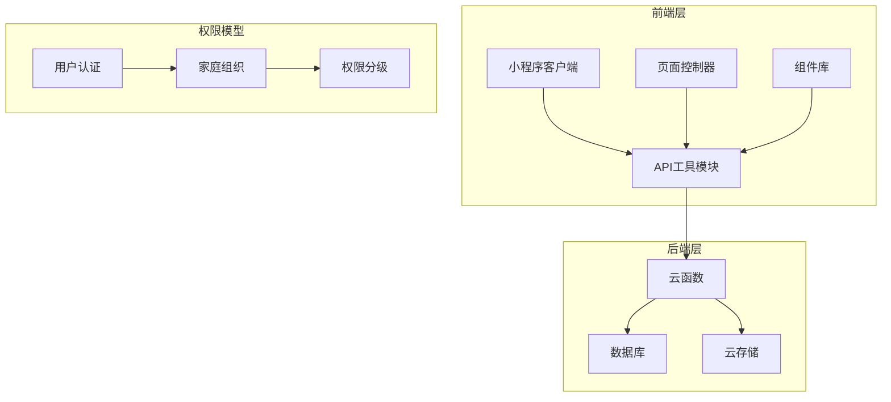
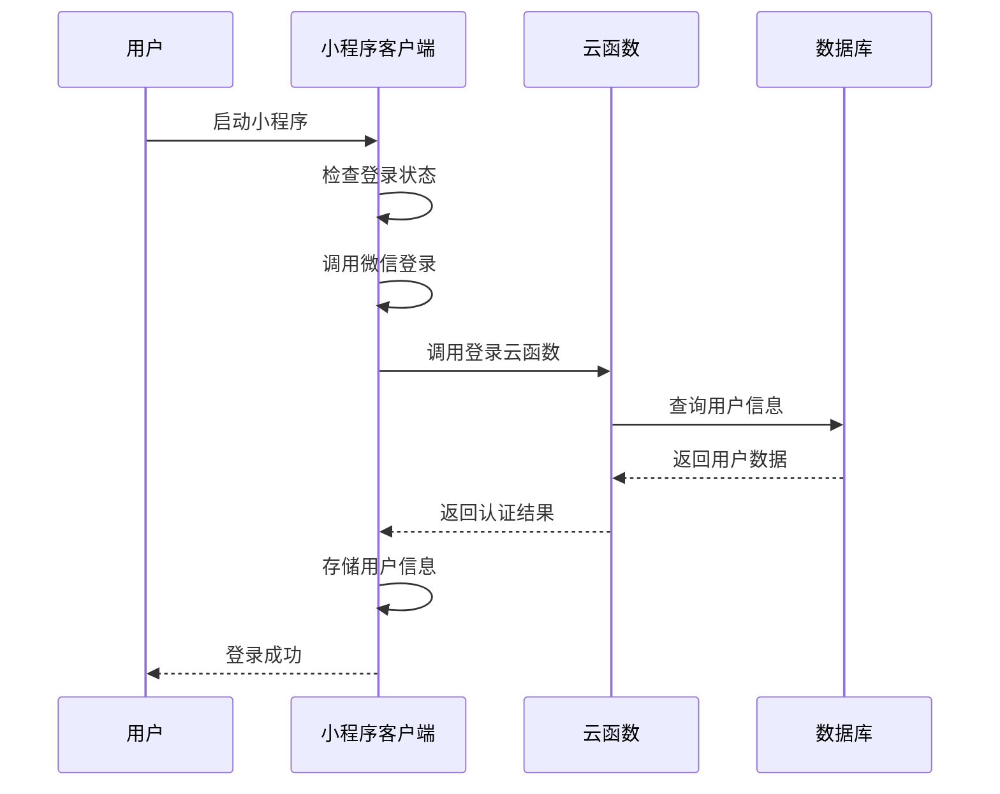
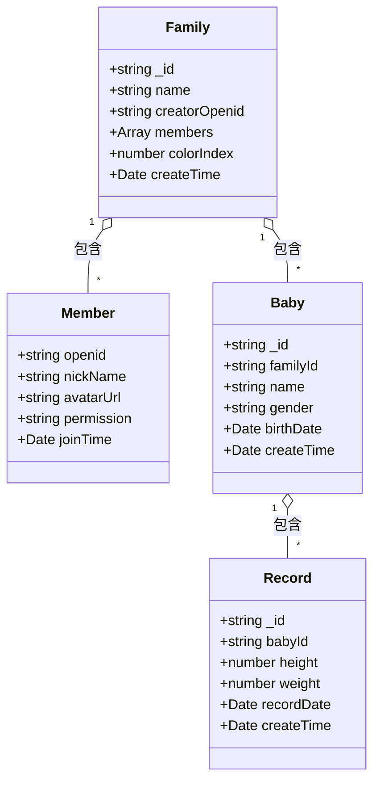
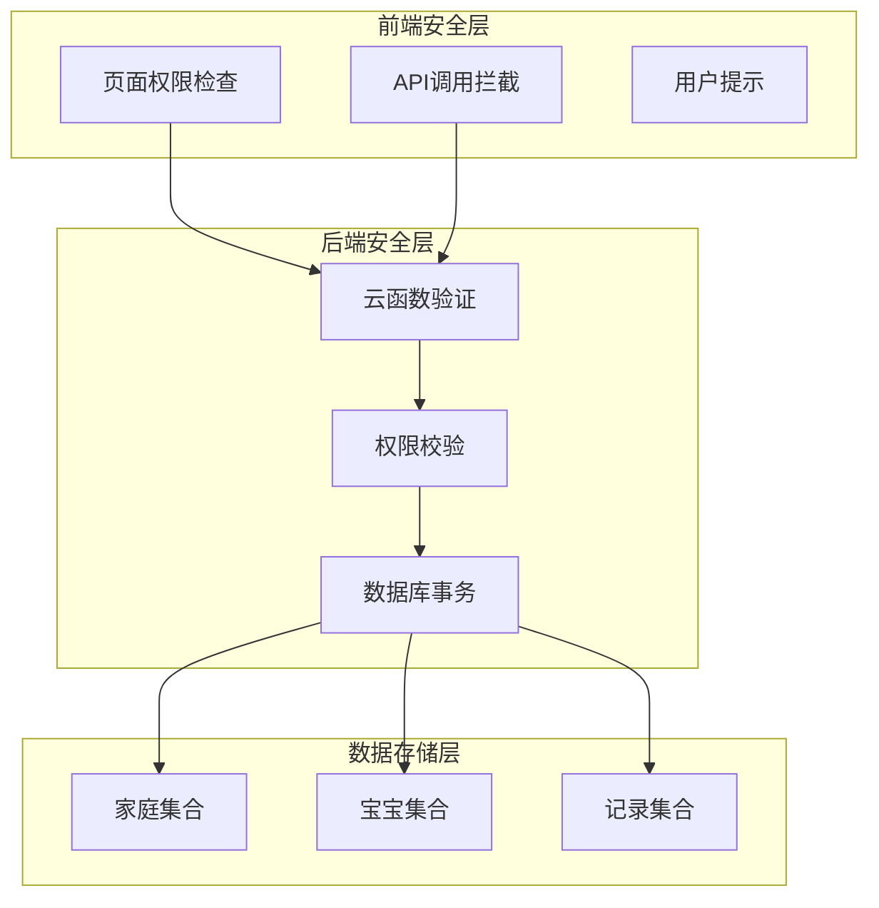
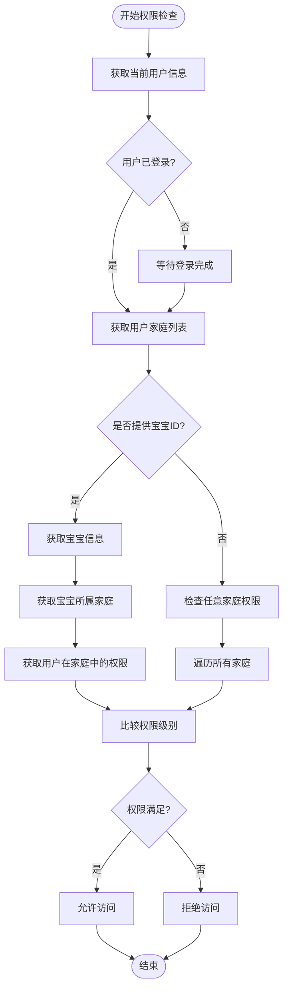
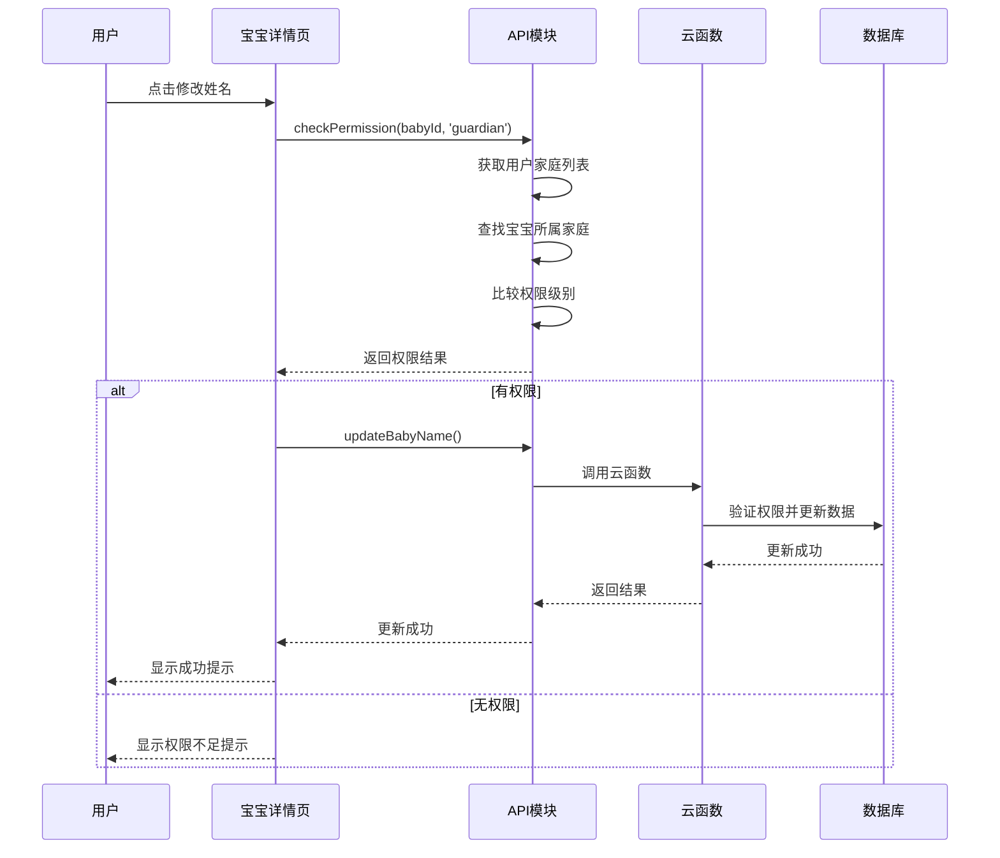
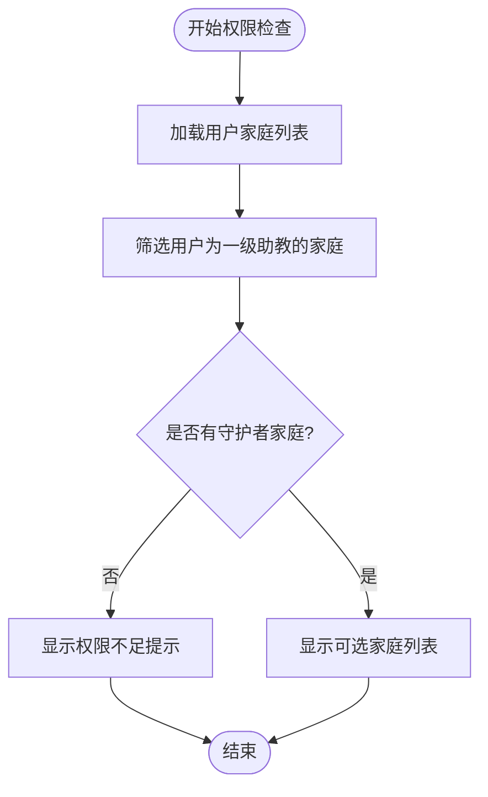
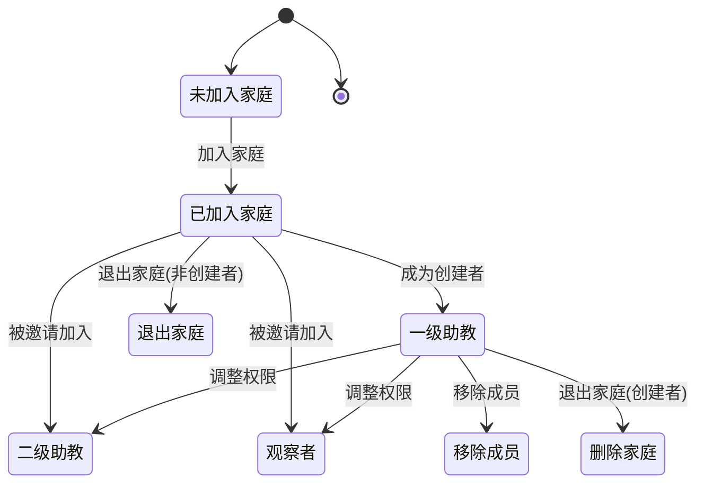
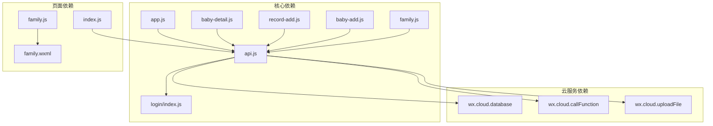
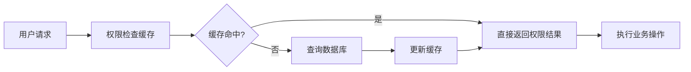

# 权限控制系统

<cite>
**本文档引用的文件**
- [app.js](file://miniprogram/app.js)
- [api.js](file://miniprogram/utils/api.js)
- [login/index.js](file://cloudfunctions/login/index.js)
- [baby-detail.js](file://miniprogram/pages/baby-detail/baby-detail.js)
- [family.js](file://miniprogram/pages/family/family.js)
- [record-add.js](file://miniprogram/pages/record-add/record-add.js)
- [baby-add.js](file://miniprogram/pages/baby-add/baby-add.js)
- [index.js](file://miniprogram/pages/index/index.js)
- [app.json](file://miniprogram/app.json)
</cite>

## 更新摘要
**变更内容**
- 更新了权限验证机制，从全局权限检查改为基于家庭成员角色的精细化权限控制
- 新增了家庭级权限验证流程，用户需要在特定家庭中具有相应权限才能执行操作
- 修改了权限检查算法，现在会筛选用户具有'guardian'权限的家庭并进行权限验证
- 更新了页面权限控制逻辑，特别是宝宝添加页面的权限验证机制

## 目录
1. [简介](#简介)
2. [项目结构](#项目结构)
3. [核心组件](#核心组件)
4. [架构概览](#架构概览)
5. [详细组件分析](#详细组件分析)
6. [依赖关系分析](#依赖关系分析)
7. [性能考虑](#性能考虑)
8. [故障排除指南](#故障排除指南)
9. [结论](#结论)

## 简介

宝宝助手小程序权限控制系统是一个基于微信小程序平台构建的多层次权限管理解决方案。该系统通过"家庭-成员-权限"的三层架构，实现了精细化的数据访问控制和操作权限管理。

系统采用前后端分离的权限验证模式：前端负责用户界面的权限控制和用户体验优化，后端云函数负责核心业务逻辑的安全验证和数据完整性保护。这种设计确保了即使前端被绕过，后端仍然能够提供可靠的安全保障。

**更新** 系统现已采用基于家庭成员角色的精细化权限控制机制，用户需要在特定家庭中具有相应权限才能执行相关操作，而非之前的全局权限检查。

## 项目结构

系统采用模块化设计，主要分为以下几个核心模块：

**图表来源**
- [app.js:1-56](file://miniprogram/app.js#L1-L56)
- [api.js:1-879](file://miniprogram/utils/api.js#L1-L879)
- [login/index.js:1-814](file://cloudfunctions/login/index.js#L1-L814)

**章节来源**
- [app.js:1-56](file://miniprogram/app.js#L1-L56)
- [app.json:1-39](file://miniprogram/app.json#L1-L39)

## 核心组件

### 权限模型设计

系统采用三级权限模型，通过"家庭成员身份"来实现细粒度的访问控制：

| 权限级别 | 英文标识 | 描述 | 数据访问权限 | 操作权限 |
|---------|----------|------|-------------|----------|
| 围观吃瓜 | viewer | 观察者，仅可查看公开信息 | 仅限家庭成员可见数据 | 无 |
| 二级助教 | caretaker | 照看者，可添加记录 | 家庭内所有数据 | 添加身高体重记录 |
| 一级助教 | guardian | 监护人，最高权限 | 家庭内所有数据 | 新增/删除宝宝、成员管理、权限调整 |

**更新** 权限验证现在基于家庭级权限控制，用户需要在特定家庭中具有相应权限才能执行操作。

### 用户认证流程

系统采用微信登录与云函数结合的方式进行用户认证：

**图表来源**
- [app.js:28-54](file://miniprogram/app.js#L28-L54)
- [login/index.js:762-800](file://cloudfunctions/login/index.js#L762-L800)

### 家庭组织结构

系统通过"家庭"概念实现数据隔离和权限控制：

**图表来源**
- [login/index.js:95-151](file://cloudfunctions/login/index.js#L95-L151)
- [login/index.js:556-577](file://cloudfunctions/login/index.js#L556-L577)

**章节来源**
- [api.js:814-852](file://miniprogram/utils/api.js#L814-L852)
- [login/index.js:95-151](file://cloudfunctions/login/index.js#L95-L151)

## 架构概览

系统采用"前端权限控制 + 后端安全验证"的双重防护架构：

**图表来源**
- [api.js:300-346](file://miniprogram/utils/api.js#L300-L346)
- [login/index.js:482-510](file://cloudfunctions/login/index.js#L482-L510)

## 详细组件分析

### API权限验证模块

API模块提供了统一的权限验证接口，支持多种权限检查场景：

#### 权限检查机制

**更新** 权限检查机制已更新为基于家庭成员角色的精细化权限控制：

**图表来源**
- [api.js:835-905](file://miniprogram/utils/api.js#L835-L905)

#### 权限级别映射

系统使用数值映射来实现权限级别的比较：

| 权限字符串 | 数值级别 | 描述 |
|-----------|----------|------|
| viewer | 1 | 观察者权限 |
| caretaker | 2 | 二级助教权限 |
| guardian | 3 | 一级助教权限 |

**章节来源**
- [api.js:867-871](file://miniprogram/utils/api.js#L867-L871)

### 页面权限控制

#### 宝宝详情页权限控制

宝宝详情页实现了最严格的权限控制，针对不同操作设置不同的权限要求：

**图表来源**
- [baby-detail.js:490-550](file://miniprogram/pages/baby-detail/baby-detail.js#L490-L550)
- [api.js:835-905](file://miniprogram/utils/api.js#L835-L905)

#### 记录添加页面权限控制

记录添加页面采用了相对宽松的权限策略，允许二级助教及以上权限的用户添加记录：

**更新** 宝宝添加页面现在采用更严格的权限控制机制：

**图表来源**
- [baby-add.js:26-54](file://miniprogram/pages/baby-add/baby-add.js#L26-L54)

**章节来源**
- [record-add.js:71-116](file://miniprogram/pages/record-add/record-add.js#L71-L116)
- [baby-detail.js:606-626](file://miniprogram/pages/baby-detail/baby-detail.js#L606-L626)
- [baby-add.js:26-54](file://miniprogram/pages/baby-add/baby-add.js#L26-L54)

### 家庭管理权限控制

家庭管理页面实现了复杂的权限继承和转移机制：

**图表来源**
- [family.js:132-166](file://miniprogram/pages/family/family.js#L132-L166)
- [login/index.js:373-422](file://cloudfunctions/login/index.js#L373-L422)

**章节来源**
- [family.js:511-549](file://miniprogram/pages/family/family.js#L511-L549)
- [login/index.js:186-266](file://cloudfunctions/login/index.js#L186-L266)

## 依赖关系分析

系统各组件之间的依赖关系如下：

**图表来源**
- [app.js:1-56](file://miniprogram/app.js#L1-L56)
- [api.js:1-879](file://miniprogram/utils/api.js#L1-L879)
- [login/index.js:1-814](file://cloudfunctions/login/index.js#L1-L814)

**章节来源**
- [app.json:1-39](file://miniprogram/app.json#L1-L39)

## 性能考虑

### 权限检查优化

系统在权限检查方面采用了多项优化措施：

1. **缓存机制**：用户登录信息和家庭信息会在内存中缓存，避免重复网络请求
2. **批量查询**：在需要时一次性获取多个家庭信息，减少数据库查询次数
3. **延迟加载**：权限检查采用异步方式，不会阻塞用户界面响应

### 数据访问优化

**图表来源**
- [api.js:14-41](file://miniprogram/utils/api.js#L14-L41)

## 故障排除指南

### 常见权限问题

| 问题现象 | 可能原因 | 解决方案 |
|---------|---------|---------|
| 无法添加宝宝 | 当前用户权限不足 | 确保用户为一级助教 |
| 无法修改记录 | 用户权限不足或非记录创建者 | 检查用户权限和记录归属 |
| 无法查看宝宝信息 | 用户不在宝宝所属家庭 | 确认用户已加入正确家庭 |
| 无法删除家庭 | 用户不是家庭创建者 | 联系家庭创建者处理 |
| **更新** 无法添加记录 | 用户在该家庭中权限不足 | 确保用户为二级助教或一级助教 |

### 调试技巧

1. **检查用户状态**：确认用户是否已成功登录
2. **验证家庭关系**：确认用户与目标家庭的成员关系
3. **权限级别确认**：核对用户在家庭中的具体权限级别
4. **日志分析**：查看云函数和前端的日志输出

**章节来源**
- [api.js:835-905](file://miniprogram/utils/api.js#L835-L905)
- [login/index.js:512-554](file://cloudfunctions/login/index.js#L512-L554)

## 结论

宝宝助手小程序的权限控制系统通过精心设计的三层架构，实现了安全、灵活、易扩展的权限管理方案。系统的核心优势包括：

1. **多层防护**：前端权限控制与后端安全验证相结合，提供双重安全保障
2. **灵活扩展**：清晰的权限模型便于新增权限类型和自定义权限规则
3. **用户体验**：合理的权限分级确保了良好的用户操作体验
4. **数据安全**：严格的权限验证和数据库事务保证了数据完整性

**更新** 系统现已采用基于家庭成员角色的精细化权限控制机制，这一改进显著提升了系统的安全性和灵活性。用户现在需要在特定家庭中具有相应权限才能执行相关操作，而非之前的全局权限检查。这种设计更好地适应了家庭类应用的使用场景，为类似的应用提供了优秀的参考模板。

该权限系统为类似的家庭类应用提供了优秀的参考模板，其设计理念和实现方式值得在其他项目中借鉴和应用。