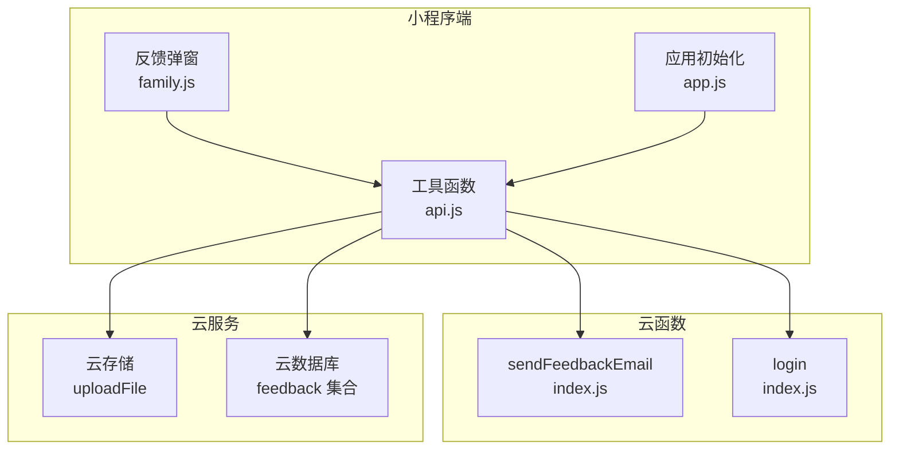
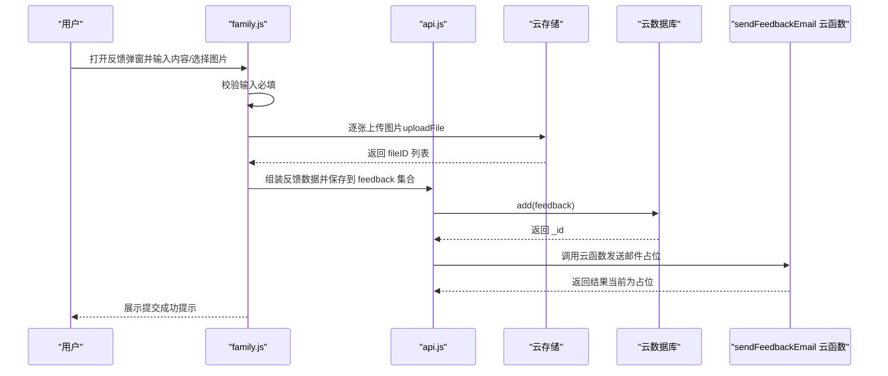
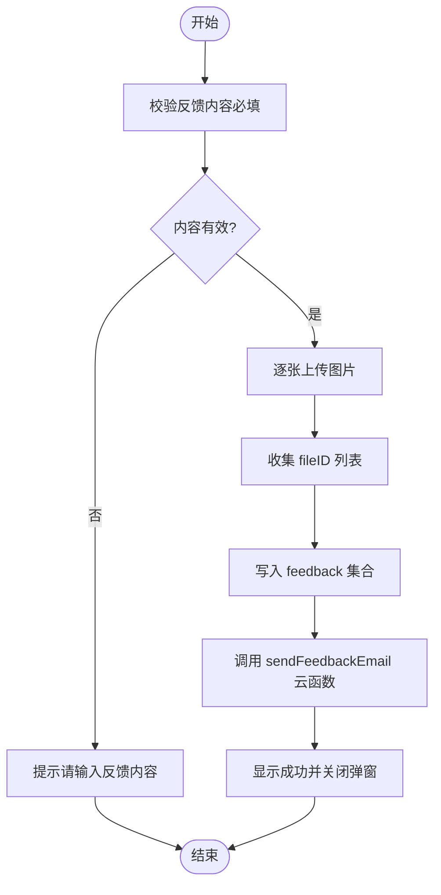
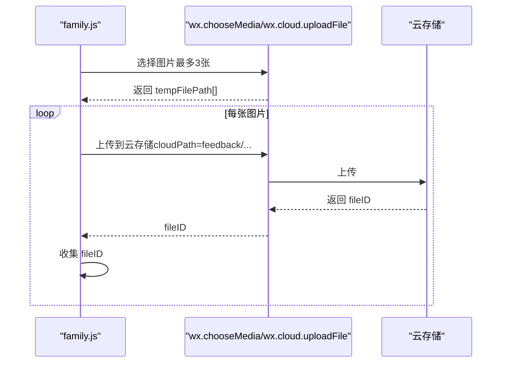
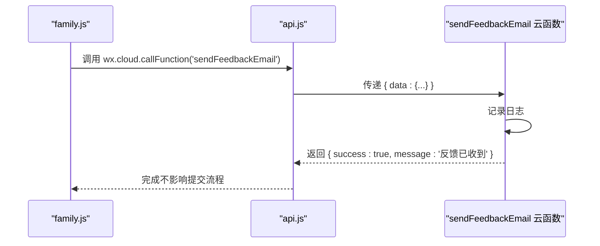
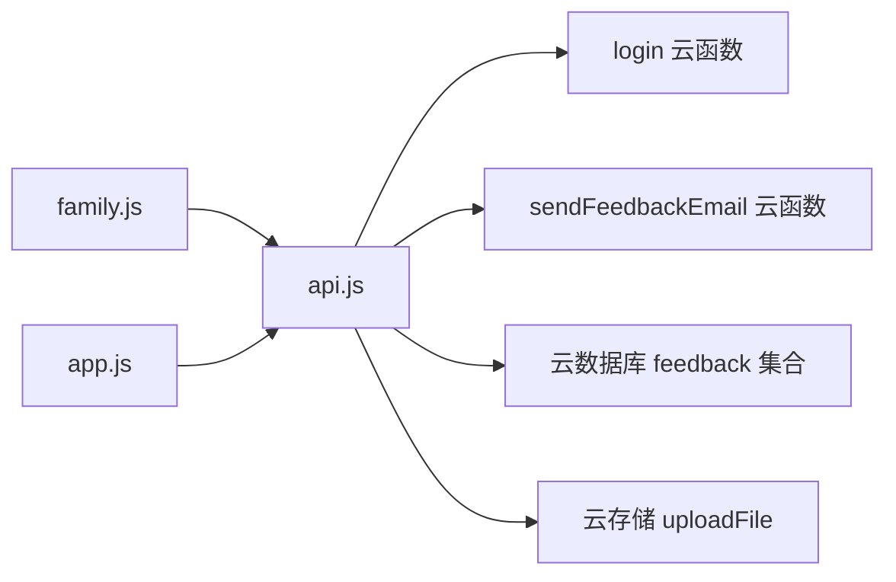

# 反馈系统

<cite>
**本文档引用的文件**
- [sendFeedbackEmail/index.js](file://cloudfunctions/sendFeedbackEmail/index.js)
- [sendFeedbackEmail/package.json](file://cloudfunctions/sendFeedbackEmail/package.json)
- [login/index.js](file://cloudfunctions/login/index.js)
- [login/package.json](file://cloudfunctions/login/package.json)
- [family.js](file://miniprogram/pages/family/family.js)
- [api.js](file://miniprogram/utils/api.js)
- [app.js](file://miniprogram/app.js)
- [cloud-storage-web/SKILL.md](file://.agents/skills/cloudbase/references/cloud-storage-web/SKILL.md)
- [no-sql-web-sdk/security-rules.md](file://.agents/skills/cloudbase/references/no-sql-web-sdk/security-rules.md)
</cite>

## 目录
1. [简介](#简介)
2. [项目结构](#项目结构)
3. [核心组件](#核心组件)
4. [架构总览](#架构总览)
5. [详细组件分析](#详细组件分析)
6. [依赖关系分析](#依赖关系分析)
7. [性能考虑](#性能考虑)
8. [故障排除指南](#故障排除指南)
9. [结论](#结论)
10. [附录](#附录)

## 简介
本文件面向“反馈系统”的完整技术文档，覆盖以下方面：
- 反馈表单设计与数据收集流程
- 图片上传与云存储集成
- 邮件通知机制（云函数触发、模板与发送状态）
- API 接口规范（请求/响应、错误码）
- 数据安全与隐私保护策略
- 用户体验优化建议
- 基于反馈的持续产品迭代机制
- 常见问题诊断与解决

## 项目结构
反馈系统由三部分组成：
- 小程序前端页面：负责表单输入、图片选择与上传、调用云函数发送邮件
- 云函数：接收反馈数据，进行简单处理（当前暂不发送邮件）
- 云数据库：保存反馈记录（集合名：feedback）

图表来源
- [family.js:626-756](file://miniprogram/pages/family/family.js#L626-L756)
- [api.js:1-879](file://miniprogram/utils/api.js#L1-L879)
- [app.js:1-56](file://miniprogram/app.js#L1-L56)
- [sendFeedbackEmail/index.js:1-21](file://cloudfunctions/sendFeedbackEmail/index.js#L1-L21)
- [login/index.js:1-814](file://cloudfunctions/login/index.js#L1-L814)

章节来源
- [family.js:1-757](file://miniprogram/pages/family/family.js#L1-L757)
- [api.js:1-879](file://miniprogram/utils/api.js#L1-L879)
- [app.js:1-56](file://miniprogram/app.js#L1-L56)

## 核心组件
- 反馈弹窗与交互逻辑：负责表单输入、图片选择、上传与提交
- 云存储上传：将图片上传至云存储，返回 fileID
- 云数据库保存：将反馈内容与图片 fileID 写入 feedback 集合
- 云函数触发：调用 sendFeedbackEmail 云函数（当前为占位实现）
- 登录与权限：通过 login 云函数统一处理用户态与权限校验

章节来源
- [family.js:626-756](file://miniprogram/pages/family/family.js#L626-L756)
- [api.js:1-879](file://miniprogram/utils/api.js#L1-L879)
- [sendFeedbackEmail/index.js:1-21](file://cloudfunctions/sendFeedbackEmail/index.js#L1-L21)
- [login/index.js:1-814](file://cloudfunctions/login/index.js#L1-L814)

## 架构总览
反馈提交的端到端流程如下：

图表来源
- [family.js:687-756](file://miniprogram/pages/family/family.js#L687-L756)
- [api.js:717-720](file://miniprogram/utils/api.js#L717-L720)
- [sendFeedbackEmail/index.js:7-20](file://cloudfunctions/sendFeedbackEmail/index.js#L7-L20)

## 详细组件分析

### 表单与数据收集
- 表单字段
  - 反馈内容：必填校验
  - 图片附件：最多3张，支持相册/相机
- 数据组装
  - content：去除首尾空白
  - images：上传后得到的 fileID 数组
  - openid：来自全局用户信息
  - createTime：当前时间
- 提交流程
  - 显示加载提示
  - 逐张上传图片并收集 fileID
  - 写入 feedback 集合，获得 _id
  - 调用云函数发送邮件（当前为占位）
  - 成功后关闭弹窗并提示

图表来源
- [family.js:687-756](file://miniprogram/pages/family/family.js#L687-L756)

章节来源
- [family.js:626-756](file://miniprogram/pages/family/family.js#L626-L756)

### 图片上传实现
- 选择图片
  - 支持从相册或相机选择，最多3张
  - 选择成功后将临时路径存入本地数组
- 上传到云存储
  - 逐张调用 uploadFile，云端路径前缀为 feedback/
  - 生成唯一文件名（时间戳+随机数），扩展名为 .jpg
  - 返回 fileID 并收集到数组
- 错误处理
  - 选择失败与上传失败均记录日志
  - 提交失败时隐藏加载并提示重试

图表来源
- [family.js:659-706](file://miniprogram/pages/family/family.js#L659-L706)

章节来源
- [family.js:651-706](file://miniprogram/pages/family/family.js#L651-L706)
- [cloud-storage-web/SKILL.md:320-344](file://.agents/skills/cloudbase/references/cloud-storage-web/SKILL.md#L320-L344)

### 邮件通知机制
- 触发方式
  - 提交成功后调用云函数 sendFeedbackEmail
- 当前实现
  - 云函数接收事件参数中的 data 字段
  - 记录日志后直接返回占位的成功结果
  - 未实际发送邮件
- 扩展建议
  - 引入 nodemailer 依赖（已在 package.json 中声明）
  - 在云函数中读取环境变量配置 SMTP
  - 实现邮件模板渲染与发送
  - 记录发送状态与错误日志

图表来源
- [family.js:722-737](file://miniprogram/pages/family/family.js#L722-L737)
- [sendFeedbackEmail/index.js:7-20](file://cloudfunctions/sendFeedbackEmail/index.js#L7-L20)
- [sendFeedbackEmail/package.json:9-12](file://cloudfunctions/sendFeedbackEmail/package.json#L9-L12)

章节来源
- [sendFeedbackEmail/index.js:1-21](file://cloudfunctions/sendFeedbackEmail/index.js#L1-L21)
- [sendFeedbackEmail/package.json:1-16](file://cloudfunctions/sendFeedbackEmail/package.json#L1-L16)

### API 接口文档

- 云函数：sendFeedbackEmail
  - 请求参数
    - data：包含 content、images、openid、createTime 等字段
  - 响应结构
    - success：布尔值
    - message：字符串
    - error：可选，错误详情
  - 错误码
    - 200：成功（占位）
    - 500：处理失败（占位）

- 云函数：login（与反馈流程相关的调用）
  - 请求参数
    - action：'getFamilies' | 'getBabies' | 'getBabyById' | 'getRecordsByBabyId' | 'getRecordById' | 'getFamilyById' | 'createFamily' | 'createInviteCode' | 'joinFamily' | 'leaveFamily' | 'updateMemberInfo' | 'updateMemberPermission' | 'removeFamilyMember' | 'deleteBaby' | 'deleteRecord' | 'updateBabyName' | 'cleanExpiredInviteCodes' | 'login'
    - 其他根据 action 的具体参数
  - 响应结构
    - success：布尔值
    - result：根据 action 返回的数据对象或错误信息
  - 错误码
    - 业务错误：如权限不足、资源不存在等（由具体 action 抛出）
    - 500：内部错误

章节来源
- [sendFeedbackEmail/index.js:7-20](file://cloudfunctions/sendFeedbackEmail/index.js#L7-L20)
- [login/index.js:22-800](file://cloudfunctions/login/index.js#L22-L800)

### 数据安全与隐私保护
- 权限控制
  - 使用云数据库安全规则限制对 feedback 集合的访问
  - 建议采用“管理员写入”或“私有”策略，避免公开读写
- 敏感信息过滤
  - 上传前对 content 进行基本清洗（去空白）
  - 仅保存必要字段（content、images、openid、createTime）
- 存储加密
  - 云存储默认 HTTPS 传输；结合数据库安全规则实现最小权限访问
- 用户标识
  - 使用 openid 作为用户标识，避免明文存储手机号等敏感信息

章节来源
- [no-sql-web-sdk/security-rules.md:1-877](file://.agents/skills/cloudbase/references/no-sql-web-sdk/security-rules.md#L1-L877)

## 依赖关系分析

图表来源
- [family.js:1-3](file://miniprogram/pages/family/family.js#L1-L3)
- [api.js:1-4](file://miniprogram/utils/api.js#L1-L4)
- [login/index.js:1-10](file://cloudfunctions/login/index.js#L1-L10)
- [sendFeedbackEmail/index.js:1-5](file://cloudfunctions/sendFeedbackEmail/index.js#L1-L5)

章节来源
- [family.js:1-3](file://miniprogram/pages/family/family.js#L1-L3)
- [api.js:1-4](file://miniprogram/utils/api.js#L1-L4)
- [login/index.js:1-10](file://cloudfunctions/login/index.js#L1-L10)
- [sendFeedbackEmail/index.js:1-5](file://cloudfunctions/sendFeedbackEmail/index.js#L1-L5)

## 性能考虑
- 图片上传
  - 建议在小程序端进行压缩（降低体积与带宽消耗）
  - 控制并发上传数量，避免浏览器过载
  - 显示上传进度反馈，提升用户体验
- 云函数
  - 发送邮件逻辑建议异步化，避免阻塞主流程
  - 对外暴露的云函数需设置合理的超时与重试策略
- 数据库
  - feedback 集合建议配置合适的索引（如 openid、createTime）
  - 定期清理历史数据，避免集合膨胀

章节来源
- [cloud-storage-web/SKILL.md:320-344](file://.agents/skills/cloudbase/references/cloud-storage-web/SKILL.md#L320-L344)

## 故障排除指南
- 图片上传失败
  - 检查网络状态与权限
  - 确认文件类型与大小符合平台限制
  - 查看控制台日志定位失败原因
- 反馈提交失败
  - 确认必填项已填写
  - 检查数据库写入权限与安全规则
  - 查看云函数返回的错误信息
- 邮件发送异常
  - 当前云函数为占位实现，需补充 SMTP 配置与模板
  - 记录发送状态与错误日志，便于排查
- 权限问题
  - 确保用户已登录并获取 openid
  - 检查 login 云函数的权限判断逻辑

章节来源
- [family.js:687-756](file://miniprogram/pages/family/family.js#L687-L756)
- [sendFeedbackEmail/index.js:16-19](file://cloudfunctions/sendFeedbackEmail/index.js#L16-L19)
- [login/index.js:22-800](file://cloudfunctions/login/index.js#L22-L800)

## 结论
本反馈系统以“表单-上传-存储-通知”为主线，实现了从用户输入到数据落库的闭环。当前邮件通知为占位实现，后续可基于 nodemailer 完善模板与发送流程。建议进一步强化图片压缩、上传进度反馈、权限与安全规则配置，以及建立基于反馈的持续迭代机制。

## 附录

### 用户体验优化建议
- 上传进度提示：在上传过程中显示百分比或进度条
- 错误信息友好化：针对不同错误场景给出明确提示
- 重复提交防护：提交按钮加禁用状态，防止多次点击
- 图片预览与删除：支持在提交前预览与删除已选图片

### 基于反馈的持续迭代机制
- 建立反馈分类标签（功能建议、Bug 反馈、界面优化等）
- 设定优先级与处理时限
- 将高价值反馈纳入产品路线图
- 定期回顾与公布改进结果，增强用户参与感